# Alpha 進化迴圈研究 Wiki

> 一台會拒絕相信自己的量化研究引擎。這個 repo 是完整的研究 wiki——從設計流程、量化/質化結構組成語言、知識圖譜與超圖，到每一次實驗（第 000–003 次，可持續增長）的逐環節透明紀錄，供任何 LLM 審閱與挑錯。

**單檔全文**（一次讀完 25 頁）：[alpha-wiki-bundle.md](alpha-wiki-bundle.md)　·　**給 LLM 評審**：[for-llm-review.md](for-llm-review.md)

所有績效數字均為未經樣本外驗證的暫定（provisional）結果，非投資建議。

---

# Alpha 進化迴圈研究 Wiki

這是一份**攤在陽光下請人來拆的研究筆記**。我們在做一台把量化策略當「可分解基因」、把每次實驗當「可否證證據」、把累積知識當「可查詢圖」的自動進化引擎；這個 wiki 把它的每一層設計、每一條程式模組、每一次真跑實驗，逐環節寫開，讓另一個 LLM 能指著某一步說「這裡做錯了」或「這裡可以更好」。它**不是黑箱**——凡是裁決，都能被別人用同一份資料重算出同一個結論。

先講最重要的一件事，免得你被漂亮數字帶走：這台引擎生成過一個年化 33%、Sharpe 1.52 的策略（[實驗 001](exp-001-candidate-c.md)），然後**自己動手把它拆穿**（[實驗 002](exp-002-ablation.md)）——證明那 33% 幾乎全是動能 beta 相加，不是它宣稱的「月營收 × 價格強勢」綜效。整份 wiki 的精神就在這裡：**生成一個看起來像 Alpha 的東西，同時拒絕相信它**。

如果你只有三分鐘，讀 [總覽：從一個念頭到一台會拒絕相信自己的引擎](overview.md)（敘事總覽）→ [整體架構與資料流](architecture.md)（架構大圖）→ [給 LLM 評審：請攻擊這些接縫](for-llm-review.md)（我最想被你攻擊的接縫）。

```mermaid
flowchart TB
    IDX["index 本頁：內容地圖"]
    subgraph ENTRY["入口"]
      OV["overview 敘事總覽"]
      AR["architecture 架構與資料流"]
    end
    subgraph QUANT["量化語言（策略基因的文法）"]
      LQ["lang-quant 量化語言總覽"]
      FA["fw-feature-algebra 特徵代數"]
      WS["fw-world-signal 世界訊號"]
      HL["fw-holding-lifecycle 持有期生命週期"]
      RB["fw-research-bilingual 研究雙語"]
      TP["fw-temporal 時間層"]
    end
    subgraph QUAL["質化語言（新聞→世界模型→特徵）"]
      LU["lang-qual 質化語言總覽"]
      QE["fw-qual-engine 質化引擎"]
    end
    subgraph GRAPH["圖與超圖（記憶結構）"]
      GK["graph-knowledge 四張圖"]
      GH["graph-hypergraph 超邊"]
    end
    subgraph METHOD["方法（引擎怎麼運作）"]
      MS["method-strategy-spec 策略基因九部件"]
      MC["method-components 部件從哪取用"]
      MG["method-gates 十道證據閘"]
      ME["method-evolution-loop 進化迴圈"]
    end
    subgraph EXP["實驗（真跑紀錄）"]
      EI["exp-index 實驗索引"]
      E0["exp-000 引擎首輪 A/B"]
      E1["exp-001 候選 C"]
      E2["exp-002 消融"]
      E3["exp-003 圖驅動進化"]
    end
    subgraph DISC["方法論（誠實與審查）"]
      DI["discipline 誠實紀律"]
      LR["for-llm-review 請攻擊這些接縫"]
      GL["glossary 詞彙表"]
    end
    IDX --> ENTRY --> QUANT --> QUAL --> GRAPH --> METHOD --> EXP --> DISC
```

## 這份 wiki 怎麼長大

它是**會持續增長的實驗 wiki**，不是一次寫完的定稿。目前引擎跑完了四輪真實驗（[000](exp-000-engine-first-run.md)／[001](exp-001-candidate-c.md)／[002](exp-002-ablation.md)／[003](exp-003-graph-evolution.md)），每多跑一輪、每多蓋一層，就在對應群組多一頁或更新既有頁。所以你看到的數字都帶「資料截止 2026-07-22」與證據級標記；後續世代會沿同一套雙向連結接進來。凡尚未實作或尚未驗證的部分，頁內一律明標「待補」或標成 provisional，不假裝完成。

## 內容地圖（分群 × 一句話）

### 入口
- [總覽：從一個念頭到一台會拒絕相信自己的引擎](overview.md) — 從「策略是狀態的期望」這個念頭，一路走到「一台會拒絕相信自己的引擎」的敘事總覽。
- [整體架構與資料流](architecture.md) — 一張大圖看懂：資料 → 量化語言棧 → 質化語言 → 圖記憶 → 進化迴圈 → 實驗，各層對應哪一頁、資料怎麼流。

### 量化語言（策略基因的文法）
- [量化結構組成語言（總覽）](lang-quant.md) — 四層量化語言的總覽：它們合起來把「一檔股票現在的完整狀態」寫成可執行、可組合、可驗證的文法。
- [框架：特徵代數](fw-feature-algebra.md) — 特徵代數：把每個特徵拆成 `B+X+W+R+O` 完整地址，用型別化轉換樹取代不透明字串。
- [框架：世界訊號](fw-world-signal.md) — 世界訊號：把世界事件／機制／公司位置拆成可反證的世界模型，輸出行情演化九態。
- [框架：持有期生命週期](fw-holding-lifecycle.md) — 持有期生命週期：月頻選股「入選之後怎麼抱到賣」的持有管理層，退出狀態機 H0–H5。
- [框架：研究雙語與認知編譯器](fw-research-bilingual.md) — 研究雙語與認知編譯器：證據級 E0–E4、結果向量、把研究規格編譯成人類報告。
- [框架：時間層（時態邏輯節點）](fw-temporal.md) — 時間層：把時間從欄位升級為圖的一級結構（時態邏輯節點），大部分尚在設計。

### 質化語言（新聞怎麼變成可反證特徵）
- [質化結構組成語言（總覽）](lang-qual.md) — 質化語言總覽：新聞的四層用法（理解 → 世界模型 → 研究 → Alpha 工廠），三階段嚴格分離。
- [框架：質化引擎（新聞→世界模型→特徵→Alpha工廠）](fw-qual-engine.md) — 質化引擎：mcm 新聞管線 → MIEE 事件帳 → 敘事卡 → 供應鏈圖的既有雛形與誠實缺口。

### 圖與超圖（記憶結構）
- [知識圖譜：四張圖](graph-knowledge.md) — 四張圖（定義／策略／證據／演化），全部是 append-only 帳的投影，DROP 可重推。
- [超圖：策略基因超邊與交互超邊](graph-hypergraph.md) — 超邊：策略基因超邊（每份 StrategySpec 一條）與交互超邊（消融證明的高階綜效知識）。

### 方法（引擎怎麼運作）
- [方法：策略基因（StrategySpec 九部件）](method-strategy-spec.md) — 進化的最小單位＝一份完整策略基因 StrategySpec 九部件。
- [方法：部件從哪取用、怎麼啟用](method-components.md) — 九部件各自從哪個框架／哪個檔案取用、怎麼啟用、目前哪些是空值。
- [方法：證據閘（十道關卡）](method-gates.md) — 十道證據閘：先確定沒作弊，再問有沒有用；前一關敗，不花後一關預算。
- [方法：進化迴圈（圖提案→變異→裁決→回流）](method-evolution-loop.md) — 進化迴圈六步：圖提案 → 受控變異 → 十閘 → 純碼裁決 → 回流寫圖。

### 實驗（真跑紀錄）
- [實驗索引：每一輪真跑，逐環節攤開](exp-index.md) — 四輪實驗的索引與血統：A→B→C 三代基因＋一條交互超邊＋三代已回滾的迴圈世代。
- [實驗 000：引擎首輪 A/B 退出時點](exp-000-engine-first-run.md) — 引擎首輪 A/B 退出時點對照：提前三天賣（B）全樣本勝，方向與獨立管線互證，但只到「方向」為止。
- [實驗 001：生成候選 C（月營收 × 價格強勢）](exp-001-candidate-c.md) — 生成候選 C（月營收 × 250 日價格強勢）：一個漂亮到該被懷疑的 33% 結果，框架當場掛三張警告。
- [實驗 002：交互超邊消融](exp-002-ablation.md) — 交互超邊消融：機器判 C 為 `conflicting`，拆穿它是動能 beta 相加、不是綜效。
- [實驗 003：圖驅動自主進化三代](exp-003-graph-evolution.md) — 圖驅動自主進化三代：迴圈會轉、會記負結果，但放手追報酬只會一路走進更深的動能暴露。

### 方法論（誠實與審查）
- [方法論：誠實紀律（拒絕相信自己）](discipline.md) — 誠實紀律：拒絕相信自己、provisional 封頂、負結果入帳、圖是帳的投影、薄縱切、總體 kill criteria。
- [給 LLM 評審：請攻擊這些接縫](for-llm-review.md) — 給評審 LLM：我最希望你攻擊的接縫在哪，每個接縫對應到哪一頁去查。
- [詞彙表](glossary.md) — 詞彙表：狀態的期望、決策事件樣本、B+X+W+R+O、九態、H0–H5、E0–E4、genome、交互超邊、消融、synergy、conflicting、provisional、walk-forward、closed_frontier、薄縱切、動能 beta。

## 一句話總綱

> 讓策略成為可分解的基因、讓實驗成為可否證的證據、讓知識成為可查詢的圖——**下一代研究問題從圖的空洞裡長出來，不從 LLM 的靈感裡長出來**。

而目前這台引擎最誠實的狀態是：**機件會轉、帳務可信、能自我否證，但沒有任何一條策略撐過樣本外**——所有裁決封頂在 E2（重複支持、尚無樣本外確認），下一步全指向同一個缺口：walk-forward。細節見 [方法論：誠實紀律（拒絕相信自己）](discipline.md) 與 [給 LLM 評審：請攻擊這些接縫](for-llm-review.md)。
