# Alpha 進化迴圈研究 Wiki

> 一台會拒絕相信自己的量化研究引擎。**世界模型為主軸的 Research OS**（世界W→觀測O→信念B→假說→到期對帳→信念更新→決策）；認知/決策/元研究三個分開裁決的迴圈；每一次實驗（000–004，可持續增長）逐環節透明。exp-004 已用真 MIEE 已對帳資料跑通信念契約的「到期對帳→信念更新」——信念 B-H-003 因 86 筆對帳僅 27 命中，信心 0.5→0.2256、判 REFUTE。

**演化的目標（最重要）**：[objective.md](objective.md)　·　**世界信念契約**：[world-belief-contract.md](world-belief-contract.md)　·　**單檔全文**：[alpha-wiki-bundle.md](alpha-wiki-bundle.md)　·　**給 LLM 評審**：[for-llm-review.md](for-llm-review.md)

績效數字均為未經樣本外驗證的暫定結果，非投資建議。

---

# Alpha 進化迴圈研究 Wiki

這是一份**攤在陽光下請人來拆的研究筆記**。它記錄一台自動進化引擎：把每次實驗當可否證證據、把累積知識當可查詢圖，讓另一個 LLM 能指著某一步說「這裡做錯了」或「這裡可以更好」。凡是裁決，都能被別人用同一份資料重算出同一個結論——它**不是黑箱**。

而這份 wiki 自己被拆了**兩輪**。**owner 第一輪（2026-07-22）指出：整份敘事把「策略」當成被演化的東西，但對量化投資而言，該演化的是「世界模型」——我們對『市場如何運作』的一組可反證信念。** 最有力的證據是引擎自己的一次實驗（[實驗 002](exp-002-ablation.md)）：當我們讓它去優化策略級指標（子代 Sharpe 勝父代），它就找到一條**動能捷徑**——一再重新發現動能 beta 而非真正的市場理解（限這段樣本）。

**owner 第二輪批評把第一輪的修法也拆了，一次開四槍**，這份 wiki 已據此改寫：①世界 W／觀測 O／信念 B 要**乾淨分離**——真實世界不會被新聞更新，被更新的是信念 B；投資的核心是 surprise＝新觀測 O−市場預期（見 [世界模型：世界不是新聞，新聞是世界狀態的 delta](world-model.md)、[信念契約](world-belief-contract.md)）。②「只演化世界模型」是矯枉過正，策略不是可有可無的投影，而是「世界信念進入現實約束後的決策政策」——應拆成 [認知／決策／元研究三個分開裁決的迴圈](three-loops.md)。③「知識缺口收斂」會被鑽漏洞，改用 `ResearchValue`（資訊增益÷成本時間）選題。④exp-002 別說太滿——它是「現行目標函數存在動能捷徑的直接證據」，不是「所有策略演化必收斂到 beta」。這些新增了 [世界信念契約：被更新的是信念，不是世界](world-belief-contract.md)、[三個迴圈：認知、決策、元研究，各有各的裁判](three-loops.md) 兩頁，排進最前面的「Research OS 主軸」。

先講最重要的一件事，免得你被兩種印象帶偏：①別被漂亮數字帶走——引擎生成過一個年化 33% 的策略（[實驗 001](exp-001-candidate-c.md)），然後自己動手把它拆穿是 beta 相加（[實驗 002](exp-002-ablation.md)）；②也別被「機件很誠實」帶走——機件誠實，但它演化的對象與目標擺錯了，這才是這兩輪要修的。

如果你只有三分鐘，讀 [總覽：真正該演化的不是策略，是世界模型](overview.md)（重構後的敘事總覽）→ [世界模型：世界不是新聞，新聞是世界狀態的 delta](world-model.md)（W／O／B 分離與 surprise）→ [三個迴圈：認知、決策、元研究，各有各的裁判](three-loops.md)（三個分開裁決的迴圈）→ [給 LLM 評審：請攻擊這些接縫](for-llm-review.md)（我最想被你攻擊的接縫）。想看第一條真資料閉環，直接跳 [實驗 004](exp-004-belief-contract.md)。

```mermaid
flowchart TB
    IDX["index 本頁：內容地圖"]
    subgraph ROS["Research OS 主軸（依 owner 兩輪批評重構）"]
      RO["research-os 十一層與 architecture-first 警告"]
      OB["objective 演化目標錯置（核心）"]
      WM["world-model 世界模型＝root；W/O/B 分離"]
      WBC["world-belief-contract 信念契約（可對帳）"]
      TL["three-loops 認知/決策/元研究 三迴圈"]
      KL["knowledge-layer 知識層"]
      CL["causal-layer 因果與供應鏈傳導"]
      RL["research-loop 世界→假說→驗證→回寫"]
      HE["hypothesis-engine 假說引擎"]
    end
    subgraph ENTRY["入口"]
      OV["overview 敘事總覽"]
      AR["architecture 架構與資料流"]
    end
    subgraph QUANT["量化語言（策略投影的文法）"]
      LQ["lang-quant 量化語言總覽"]
      FA["fw-feature-algebra 特徵代數"]
      WS["fw-world-signal 世界訊號"]
      HL["fw-holding-lifecycle 持有期生命週期"]
      RB["fw-research-bilingual 研究雙語"]
      TP["fw-temporal 時間層"]
    end
    subgraph QUAL["質化語言（新聞→世界模型→特徵）"]
      LU["lang-qual 質化語言總覽"]
      QE["fw-qual-engine 質化引擎"]
    end
    subgraph GRAPH["圖與超圖（記憶結構）"]
      GK["graph-knowledge 四張圖"]
      GH["graph-hypergraph 超邊"]
    end
    subgraph METHOD["方法（引擎怎麼運作）"]
      MS["method-strategy-spec 策略基因九部件"]
      MC["method-components 部件從哪取用"]
      MG["method-gates 十道證據閘"]
      ME["method-evolution-loop 進化迴圈"]
    end
    subgraph EXP["實驗（真跑紀錄）"]
      EI["exp-index 實驗索引"]
      E0["exp-000 引擎首輪 A/B"]
      E1["exp-001 候選 C"]
      E2["exp-002 消融（動能捷徑的直接證據）"]
      E3["exp-003 圖驅動進化"]
      E4["exp-004 信念契約（跑通前半：對帳→更新）"]
    end
    subgraph DISC["方法論（誠實與審查）"]
      DI["discipline 誠實紀律"]
      LR["for-llm-review 請攻擊這些接縫"]
      GL["glossary 詞彙表"]
    end
    IDX --> ROS --> ENTRY --> QUANT --> QUAL --> GRAPH --> METHOD --> EXP --> DISC
```

## 這份 wiki 怎麼長大，以及這一輪為什麼重構

它是**會持續增長的實驗 wiki**，不是一次寫完的定稿。目前策略軌跑完了四輪真實驗（[000](exp-000-engine-first-run.md)／[001](exp-001-candidate-c.md)／[002](exp-002-ablation.md)／[003](exp-003-graph-evolution.md)），信念契約軌跑通第一輪（[004](exp-004-belief-contract.md)），每多跑一輪就在對應群組多一頁或更新既有頁。所以你看到的數字都帶「資料截止 2026-07-22」與證據級標記；凡尚未實作或尚未驗證的部分，頁內一律明標「待補」或標成 provisional，不假裝完成。

這一輪的重構是**敘事層的，不是又蓋了十一個引擎**。owner 同時警告：把研究迴圈拆成十一層是對的，但「真的把十一個引擎都蓋出來」正是 [方法論：誠實紀律（拒絕相信自己）](discipline.md) 方向裁決點名的頭號陷阱 architecture-first。所以修法是兩條腿：**①敘事與演化目標現在就重構（便宜、正確、不寫新引擎碼）；②建置永遠只准一條薄縱切（先填滿一條真實的世界→知識→假說→驗證機制鏈）。** 「Research OS 主軸」那一組頁是在做①，不是在宣稱②已完成——完整說明在 [研究作業系統：11 層與「別蓋空引擎」](research-os.md)。

## 內容地圖（分群 × 一句話）

### Research OS 主軸（依 owner 兩輪批評重構）
- [研究作業系統：11 層與「別蓋空引擎」](research-os.md) — 把研究迴圈重構成十一層，以及「別因此掉進 architecture-first 陷阱」的兩腿修法（敘事現在重構、建置只走薄縱切）。
- [演化的目標：一個目標函數量不了三種東西](objective.md) — **核心**：演化目標錯置。優化策略級指標會找到動能捷徑（[實驗 002：交互超邊消融](exp-002-ablation.md) 提供的直接證據）；該優化的是世界模型的可反證預測力——但目標不是單一，而是拆成 [三迴圈](three-loops.md)。
- [世界模型：世界不是新聞，新聞是世界狀態的 delta](world-model.md) — 世界模型＝真正的 root：**世界 W／觀測 O／信念 B 乾淨分離**，被更新的永遠是信念 B 不是世界 W；新聞三型（改變世界／揭露狀態／只改信念）＋ surprise＝O−市場預期。
- [世界信念契約：被更新的是信念，不是世界](world-belief-contract.md) — **信念契約**（owner 第二輪）：把每條信念寫成可版本化、可對帳、可被真觀測推翻的契約，讓「哪條信念、因哪份證據、從哪版更新到哪版」有逐欄答案；exp-004 已跑通。
- [三個迴圈：認知、決策、元研究，各有各的裁判](three-loops.md) — **三個進化迴圈**（owner 第二輪）：認知（改世界模型，裁判＝預測校準）／決策（改策略，裁判＝beta 中性後增量）／元研究（改選題，裁判＝`ResearchValue`＝資訊增益÷成本時間）分開裁決；策略不是投影，是世界信念進入現實約束後的決策政策。
- [知識層：一則新聞展開成一張知識子圖](knowledge-layer.md) — 知識層：把事件與傳導沉澱成可查詢的圖與超圖，量測「還有多少洞沒填」。
- [因果層：新聞→事件→供需→公司→財報→預期→價格](causal-layer.md) — 因果與供應鏈傳導：事件傳到誰、隔幾階；誠實面對 causal_observations 約 108 筆、正式 edges 0 筆、供應鏈只一階。
- [研究迴圈：世界不被更新，被更新的是信念](research-loop.md) — 主迴圈：世界→事件→企業→定價→知識→假說→策略→回測→部署→回寫世界模型，一個回到自己的閉環。
- [假說引擎：今天最值得消除、又辨識得出的決策相關未知是什麼](hypothesis-engine.md) — 假說引擎：從知識缺口長出帶時窗、可打臉的預測（MIEE 雛形），對 beta 免疫的演化目標載體。

### 入口
- [總覽：真正該演化的不是策略，是世界模型](overview.md) — 從「生成策略即拒絕相信」升級到「真正該演化的是世界模型；策略只是投影」的敘事總覽，用 exp-002 當目標錯置的證據。
- [整體架構與資料流](architecture.md) — 一張大圖看懂重構後的世界模型閉環、每一格對應哪一頁，並誠實對帳哪些格是真的、哪些是空殼、哪些擺錯位置。

### 量化語言（策略投影的文法）
- [量化結構組成語言（總覽）](lang-quant.md) — 四層量化語言的總覽：它們是「把世界模型的一條信念寫成可執行投影」的文法，不是演化的對象本身。
- [框架：特徵代數](fw-feature-algebra.md) — 特徵代數：把每個特徵拆成 `B+X+W+R+O` 完整地址，用型別化轉換樹取代不透明字串。
- [框架：世界訊號](fw-world-signal.md) — 世界訊號：把世界事件／機制／公司位置拆成可反證的世界模型，輸出行情演化九態（世界層數值目前為示意佔位）。
- [框架：持有期生命週期](fw-holding-lifecycle.md) — 持有期生命週期：月頻選股「入選之後怎麼抱到賣」的持有管理層，退出狀態機 H0–H5。
- [框架：研究雙語與認知編譯器](fw-research-bilingual.md) — 研究雙語與認知編譯器：證據級 E0–E4、結果向量、把研究規格編譯成人類報告。
- [框架：時間層（時態邏輯節點）](fw-temporal.md) — 時間層：把時間從欄位升級為圖的一級結構；`temporal_edge` 連表都還沒建，幾乎整層未實作。

### 質化語言（新聞怎麼變成可反證特徵）
- [質化結構組成語言（總覽）](lang-qual.md) — 質化語言總覽：新聞的四層用法（理解 → 世界模型 → 研究 → Alpha 工廠），三階段嚴格分離。
- [框架：質化引擎（新聞→世界模型→特徵→Alpha工廠）](fw-qual-engine.md) — 質化引擎：mcm 新聞管線 → MIEE 事件帳 → 敘事卡 → 供應鏈圖的既有雛形與誠實缺口（新聞真實歷史只有 15 天）。

### 圖與超圖（記憶結構）
- [知識圖譜：四張圖](graph-knowledge.md) — 四張圖（定義／策略／證據／演化），全部是 append-only 帳的投影，DROP 可重推。
- [超圖：策略基因超邊與交互超邊](graph-hypergraph.md) — 超邊：策略基因超邊（每份 StrategySpec 一條）與交互超邊（消融證明的高階綜效知識，目前正典帳 1 條、判 conflicting）。

### 方法（引擎怎麼運作）
- [方法：策略基因（StrategySpec 九部件）](method-strategy-spec.md) — 進化的最小單位＝一份完整策略基因 StrategySpec 九部件（它是投影的載體，不是 root）。
- [方法：部件從哪取用、怎麼啟用](method-components.md) — 九部件各自從哪個框架／哪個檔案取用、怎麼啟用、目前哪些是空值。
- [方法：證據閘（十道關卡）](method-gates.md) — 十道證據閘：先確定沒作弊，再問有沒有用；前一關敗，不花後一關預算。
- [方法：進化迴圈（圖提案→變異→裁決→回流）](method-evolution-loop.md) — 進化迴圈六步：圖提案 → 受控變異 → 十閘 → 純碼裁決 → 回流寫圖。

### 實驗（真跑紀錄）
- [實驗索引：每一輪真跑，逐環節攤開](exp-index.md) — 實驗的索引與血統：策略軌 A→B→C 三代基因＋一條交互超邊＋三代已回滾的迴圈世代；另有信念契約軌 exp-004。
- [實驗 000：引擎首輪 A/B 退出時點](exp-000-engine-first-run.md) — 引擎首輪 A/B 退出時點對照：提前三天賣（B）全樣本勝，方向與獨立管線互證，但只到「方向」為止。
- [實驗 001：生成候選 C（月營收 × 價格強勢）](exp-001-candidate-c.md) — 生成候選 C（月營收 × 250 日價格強勢）：一個漂亮到該被懷疑的 33% 結果，框架當場掛三張警告。
- [實驗 002：交互超邊消融](exp-002-ablation.md) — **動能捷徑的直接證據**：機器判 C 為 `conflicting`，拆穿它是動能 beta 相加、不是綜效——這是「現行目標函數存在動能捷徑」的實驗證據（不是「所有策略演化必收斂到 beta」的全稱結論）。
- [實驗 003：圖驅動自主進化三代](exp-003-graph-evolution.md) — 圖驅動自主進化三代：迴圈會轉、會記負結果，但放手追報酬會一路走進更深的動能暴露（限這段樣本）。
- [實驗 004：世界信念契約首度到期對帳](exp-004-belief-contract.md) — **分水嶺**：用真 MIEE 資料跑通信念契約的「到期對帳 → 信念更新」這一段（決策是否因此改變的後半尚未做）——B-H-003 因 86 筆對帳僅 27 命中，信心 0.5 → 0.2256、判 REFUTE，與 MIEE 自身 `refuted` 一致。

### 方法論（誠實與審查）
- [方法論：誠實紀律（拒絕相信自己）](discipline.md) — 誠實紀律：拒絕相信自己、provisional 封頂、負結果入帳、圖是帳的投影、薄縱切、architecture-first 警告、總體 kill criteria。
- [給 LLM 評審：請攻擊這些接縫](for-llm-review.md) — 給評審 LLM：我最希望你攻擊的接縫在哪，每個接縫對應到哪一頁去查。
- [詞彙表](glossary.md) — 詞彙表：狀態的期望、世界模型、投影、演化目標、決策事件樣本、B+X+W+R+O、九態、H0–H5、E0–E4、genome、交互超邊、消融、conflicting、provisional、walk-forward、closed_frontier、薄縱切、architecture-first、動能 beta。

## 一句話總綱

> **分水嶺＝用真資料跑通第一次完整閉環。** exp-004 已跑通前半（到期對帳 → 信念更新：B-H-003 因 86 筆對帳僅 27 命中，信心 0.5 → 0.2256、判 REFUTE）——這是第一條不靠佔位資料、能被真觀測打分的信念。下一代研究問題從 `ResearchValue` 選出、從圖的空洞裡長出來，不從 LLM 的靈感裡長出來；被演化的不是單一目標，是認知／決策／元研究三個分開裁決的迴圈。

目前這台引擎最誠實的狀態，分三態說完：**機件會轉、帳務可信、能自我否證**（真的、有料——策略進化薄縱切＋ exp-004 信念對帳前半）；**但整條閉環只跑通了一小段**（信念更新的後半有真資料，前半「觀測→假說→預測」與選題 `ResearchValue` 都還沒接真管線）；**世界模型閉環的其餘層多為空殼**（因果邊 108 筆、正式 edges 0 筆、供應鏈一階、新聞史 15 天、時間層 `temporal_edge` 未建）。所有策略裁決封頂在 E2、真錢一律不動。細節見 [演化的目標：一個目標函數量不了三種東西](objective.md)、[三個迴圈：認知、決策、元研究，各有各的裁判](three-loops.md)、[世界信念契約：被更新的是信念，不是世界](world-belief-contract.md)、[方法論：誠實紀律（拒絕相信自己）](discipline.md) 與 [給 LLM 評審：請攻擊這些接縫](for-llm-review.md)。
