# Alpha 進化迴圈研究 Wiki — 全文合輯

> 整個研究 wiki 的單檔匯出（共 43 頁），供 LLM 一次讀完、逐環節審閱。
> 章節間以 [[slug]] 雙向連結；每章開頭 anchor 對應該 slug。

---

<a name='index'></a>
# 〔index〕首頁：Alpha 進化迴圈研究 Wiki

這是一份**攤在陽光下請人來拆的研究筆記**。它記錄一台自動進化引擎：把每次實驗當可否證證據、把累積知識當可查詢圖，讓另一個 LLM 能指著某一步說「這裡做錯了」或「這裡可以更好」。凡是裁決，都能被別人用同一份資料重算出同一個結論——它**不是黑箱**。

而這份 wiki 自己被拆了**三輪**，三輪各修一個層次的錯：

- **第一輪（演化什麼）**：整份敘事把「策略」當演化對象，但該演化的是「世界模型」——對『市場如何運作』的一組可反證信念。直接證據是引擎自己的實驗（[[exp-002-ablation|實驗 002]]）：讓它優化策略級指標，它就找到動能捷徑、一再重新發現動能 beta（限這段樣本）。
- **第二輪（怎麼分開裁決）**：①世界 W／觀測 O／信念 B 要乾淨分離——被更新的永遠是信念，投資賺的是 surprise＝新觀測−市場預期（[[world-model]]、[[world-belief-contract|信念契約]]）；②「只演化世界模型」矯枉過正，應拆成 [[three-loops|認知／決策／元研究三迴圈]]分開裁決；③選題用 ResearchValue 取代可被鑽漏洞的「缺口收斂」；④exp-002 別說過頭。
- **第三輪（主線接回真決策，2026-07-22）**：前兩輪修完，主線仍**斷成兩段**——owner 真錢在跑的最強策略 king2（wiki 幾乎不談），與跟任何真實決策無關的信念契約支線（[[exp-004-belief-contract|實驗 004]] 是**機件驗證**，不是主線）。修法＝**現任冠軍制度**：凍結 king2 當冠軍（永不覆寫）→ 攤開它的決策殘差 → 從殘差長出世界假說（天然決策相關，勝過抽象「最大未知」）→ 預註冊 → 挑戰者 → 樣本外對決 → 晉升追加新列。新增 [[champion-challenger|現任冠軍制度]] 與 [[exp-005-king2-prereg|實驗 005 五臂預註冊]] 兩頁，並改寫 [[hypothesis-engine|假說引擎]]（選題改殘差優先）與 [[research-loop|研究迴圈]]（主線圖加冠軍挑戰環）。
- **第四輪（載具層，2026-07-22）**：king2 回答「要不要看多這家公司」，載具回答「用什麼**報酬形狀**表達這個信念」——四種商品（股票／權證／CB／CBAS）不混進同一個選股分數，路由永遠在選股之後。新增 [[instrument-router|載具路由器]]（五載具對照＋InstrumentUtility）、[[cb-cbas|CB／CBAS 知識與誠實歸戶]]（六維覆蓋現況：債底半套＝歷史賣回價無資料源是最大缺口；CBAS 零實作觀察區；已判死清單勿重跑）、[[order-execution-ui|下單協調邏輯]]（去識別化：雙塔分工／八道閘鏈／零自動送單／多載具擴充點，附「請 LLM 檢視的協調問題」）、[[exp-006-cb-router-prereg|實驗 006 CB 路由（構想級）]]。

先講最重要的三件事，免得被印象帶偏：①別被漂亮數字帶走——引擎生成過年化 33% 的策略（[[exp-001-candidate-c|實驗 001]]），然後自己拆穿它是 beta 相加（[[exp-002-ablation|實驗 002]]）；②別被「機件很誠實」帶走——機件誠實，但演化對象、裁決分工、主線錨點三個層次都曾擺錯，這正是三輪批評依次修的；③**別把第三輪讀成「世界信念已經改善 king2」**——目前真實存在的只有凍結冠軍、殘差資料集、預註冊三樣，零個挑戰臂跑過、零次對決、零次晉升。

如果你只有三分鐘：讀 [[overview]]（敘事總覽）→ [[champion-challenger|現任冠軍制度]]（第三輪主線）→ [[research-loop|研究迴圈]]（W/O/B/P × 冠軍挑戰環全圖）→ [[for-llm-review]]（我最想被你攻擊的接縫）。想看真資料，跳 [[champion-challenger|殘差四格]] 與 [[exp-004-belief-contract|實驗 004]]。

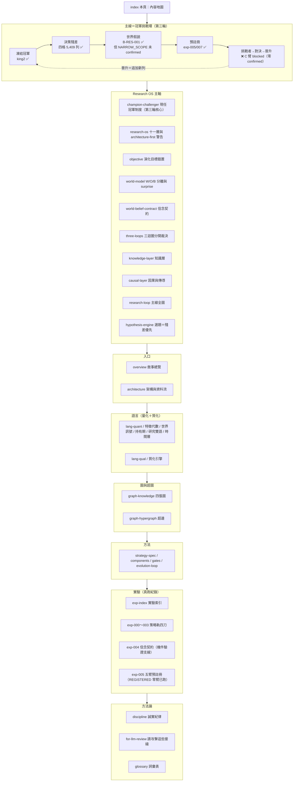

## 這份 wiki 怎麼長大，以及這一輪為什麼重構

它是**會持續增長的實驗 wiki**，不是一次寫完的定稿。策略軌跑完四輪真實驗（[[exp-000-engine-first-run|000]]～[[exp-003-graph-evolution|003]]），信念契約機件驗證一輪（[[exp-004-belief-contract|004]]），冠軍挑戰軌完成凍結＋殘差＋預註冊（[[exp-005-king2-prereg|005]]，REGISTERED）。所有數字帶「資料截止 2026-07-22」與證據級標記；尚未實作或未驗證的部分一律明標「待補」或 provisional。

三輪重構全部是**敘事層與制度層的，不是又蓋引擎**。owner 同時警告：把研究迴圈拆成十一層是對的，但「真的把十一個引擎都蓋出來」正是 [[discipline]] 點名的 architecture-first 陷阱。修法兩條腿：①敘事與制度現在就修（便宜、正確）；②建置只走薄縱切——第三輪的薄縱切已經指名：**從殘差長出第一條世界假說、settle 它**，其餘一概不蓋。

## 內容地圖（分群 × 一句話）

### Research OS 主軸
- [[champion-challenger]] — **第三輪核心**：現任冠軍制度——凍結 king2（永不覆寫）、五角色（champion／challenger／belief_augmented／placebo／independent）、殘差四格真計數、研究問題從冠軍四分支長出。
- [[research-os]] — 十一層重構與「別掉進 architecture-first」的兩腿修法。
- [[objective]] — 演化目標錯置：優化策略級指標會找到動能捷徑（exp-002 直接證據）。
- [[world-model]] — W／O／B 乾淨分離；新聞三型；surprise＝O−市場預期。
- [[world-belief-contract]] — 信念契約：可版本化、可對帳、可被真觀測推翻；機件已由 exp-004 驗證。
- [[three-loops]] — 認知／決策／元研究三迴圈分開裁決。
- [[knowledge-layer]] — 知識層：事件與傳導沉澱成可查詢的圖。
- [[causal-layer]] — 因果與供應鏈傳導；誠實面對 edges 0 筆、供應鏈一階。
- [[research-loop]] — **主線全圖**：W/O/B/P 骨架 × 冠軍挑戰環（殘差→假說→挑戰者→對決→晉升）。
- [[hypothesis-engine]] — 假說引擎第三版：**選題殘差優先**（殘差天然帶決策相關性），ResearchValue 退為殘差外補充。

### 入口
- [[overview]] — 敘事總覽：從「拒絕相信自己」到「演化世界模型」到「繞著冠軍轉」。
- [[architecture]] — 一張大圖看懂閉環、每格對應哪頁、哪些格是真的哪些是空殼。

### 量化語言（策略投影的文法）
- [[lang-quant]] — 四層量化語言總覽。
- [[fw-feature-algebra]] — 特徵代數：B+X+W+R+O 型別化轉換樹。
- [[fw-world-signal]] — 世界訊號：可反證世界模型與行情九態（數值示意佔位）。
- [[fw-holding-lifecycle]] — 持有期生命週期：H0–H5 退出狀態機（殘差「太早賣」格的接收方）。
- [[fw-research-bilingual]] — 研究雙語與認知編譯器：E0–E4 證據級。
- [[fw-temporal]] — 時間層：幾乎整層未實作。

### 質化語言（新聞怎麼變成可反證特徵）
- [[lang-qual]] — 四層用法、三階段嚴格分離。
- [[fw-qual-engine]] — mcm→MIEE 雛形與誠實缺口（新聞真史 15 天）。

### 圖與超圖（記憶結構）
- [[graph-knowledge]] — 四張圖，全是 append-only 帳的投影。
- [[graph-hypergraph]] — 策略基因超邊與交互超邊（正典帳 1 條、判 conflicting）。

### 方法（引擎怎麼運作）
- [[method-strategy-spec]] — 策略基因 StrategySpec 九部件。
- [[method-components]] — 九部件從哪取用。
- [[method-gates]] — 十道證據閘：先確定沒作弊，再問有沒有用。
- [[method-evolution-loop]] — 進化迴圈六步。

### 實驗（真跑紀錄）
- [[exp-index]] — 索引與血統：策略軌四刀＋機件支線 004＋冠軍軌 005。
- [[exp-000-engine-first-run]] — 引擎首輪 A/B 退出時點對照。
- [[exp-001-candidate-c]] — 33% 的候選 C 與當場掛上的三張警告。
- [[exp-002-ablation]] — 動能捷徑的直接證據（conflicting）。
- [[exp-003-graph-evolution]] — 圖驅動三代：機件會轉，放手就滑進動能。
- [[exp-004-belief-contract]] — **機件驗證支線**：settle 機件 fail-closed 真跑（B-H-003 REFUTE 0.5→0.2256、B-H-001 WEAKEN 0.5→0.3913）；信念內容不在冠軍決策鏈上。
- [[exp-005-king2-prereg]] — **冠軍軌第一份預註冊**：五臂＋晉升五道門判準凍結、C 臂 blocked（零 confirmed）、機件考卷 12/12；**REGISTERED，零臂已跑**。

### 方法論（誠實與審查）
- [[discipline]] — 誠實紀律：provisional 封頂、負結果入帳、薄縱切、architecture-first 警告。
- [[for-llm-review]] — 給評審 LLM：最想被攻擊的接縫。
- [[glossary]] — 詞彙表。

## 一句話總綱

> **主線＝冠軍挑戰環：凍結冠軍 → 決策殘差 → 世界假說 → 預註冊 → 挑戰者 → 樣本外對決 → 晉升（追加新列，冠軍永不覆寫）。** 研究問題從冠軍殘差四格長出——每一列殘差都是一筆真的虧掉或漏掉的錢，決策相關性不必自估。環上完成到哪、還缺哪一段，一律由下方真相帳快照說了算（不再手寫）：

<!--STATE-->
> **現況快照（自 `aaro.sqlite` 真相帳投影，非手寫；由 `wm/state_projector.py` 於 build 時注入）**
>
> - 編號實驗：**8 個**（000–007，每個都指回帳本證據）
> - 信念契約：**6 條**＝策展 3＋自主示範 3；從冠軍殘差長出的世界假說 **1 條** → B-RES-001（NARROW_SCOPE，信心 0.445182）
> - 已 confirmed（REINFORCE 過基準且來自 SEALED 段）：**0 條（C 臂維持 blocked）**
> - 預註冊凍結：**8 份**（H-DEV2、EXP-005、AUTO-AR-1-C-normal-revH-chipL、AUTO-AR-2-C-normal-revM-chipL、AUTO-AR-3-C-normal-revL-chipL、OPEN-3fe5914572bb10d4、CONFIRM-bb482590fefecfe9、EXP-007）
> - C 臂狀態：**blocked**（需一條 confirmed 信念才解鎖）
> - 金庫可授 confirmed 的 SEALED 段：**1 個** → LIVE_FORWARD（SEALED，0 筆，未來事件累積中）
> - 自主搜尋輪：**6 輪**（無人選題自主 **5 輪**，示範迴圈自轉，結算在 EXPOSED 段故不可 confirmed）
<!--/STATE-->

環的中段仍未閉合：已有第一條從殘差長出的世界假說（B-RES-001），但它 `NARROW_SCOPE`、未 confirmed，挑戰者 C 臂因此維持 blocked，零對決、零晉升。

目前這台引擎最誠實的狀態，分三態說完：**機件會轉、帳務可信、能自我否證**（策略軌四刀＋settle 機件 fail-closed 真跑）；**主線地基已釘死但環的中段整段是空的**（殘差→假說→confirmed→對決全未發生）；**世界模型閉環其餘層多為空殼**（因果 edges 0 筆、新聞史 15 天、`temporal_edge` 未建、walk-forward 未跑）。所有策略裁決封頂 E2、真錢一律不動、冠軍是研究帳鏡像而真錢線唯讀。細節見 [[champion-challenger]]、[[research-loop]]、[[exp-005-king2-prereg]]、[[discipline]] 與 [[for-llm-review]]。

---

<a name='overview'></a>
# 〔overview〕總覽：真正該演化的不是策略，是世界模型

這一頁用一條敘事線把整個系統串起來，但它是**被 owner 的深層批評重寫過的版本**。上一版的主軸是「一台會拒絕相信自己剛生出的漂亮結果的引擎」——那件事是真的、也很珍貴，機件確實會生成、會回測、會消融、會自我否證。但 owner 2026-07-22 指出：那整條敘事回答的是「**怎麼**演化」，卻沒回答「**演化什麼**」。而在量化投資裡，答錯後者比答錯前者致命得多。

一句話總綱：**這台引擎目前把「策略」當演化對象，但策略只是世界模型的一個投影；真正該被演化的，是我們對「市場如何運作」的那組可反證信念。最有力的證據，是引擎自己的一次實驗——當我們讓它去優化策略級指標，它只會一再重新發現動能 beta。**

## 第一步：好的紀律，答錯了問題

先肯定舊主軸沒錯的部分。這台引擎真的轉了四輪，而且一邊生成一邊拒絕相信自己：[[exp-000-engine-first-run|實驗 000]] 把 owner 現行月營收策略寫成創世基因、只改退出時點生子代；[[exp-001-candidate-c|實驗 001]] 生成第一條新策略 C（月營收 × 250 日價格強勢），漂亮到 CAGR 33%、Sharpe 1.52，而框架當場替它掛三張警告標籤。這套「生成 ≠ 相信」的紀律是真本事，完整條文在 [[discipline]]。

但請看這件事的**高度**：它全部發生在「策略」這個層次。它問的永遠是「這條策略的評分有沒有勝過上一條」。這就像 AlphaEvolve 那類系統去優化「最小化 Loss／FLOPs」——那樣做沒問題，因為它的優化目標本身定義得很乾淨。**問題在於，一條策略的 Sharpe 或 CAGR，並不是一個乾淨的優化目標。** 它混著市場 beta、混著樣本期的運氣、混著過擬合。你越用力優化它，越可能優化到那些混進去的東西，而不是真正的市場理解。舊主軸把全副精神放在「怎麼嚴格地演化策略」，卻沒問「策略級指標到底該不該是演化目標」——這就是被批評的**目標錯置**，完整展開在 [[objective]]。

## 第二步：我們自己的實驗，親手顯示了目標錯置

這不是紙上推論。**引擎自己跑出了目標錯置的直接證據**，就在 [[exp-002-ablation|實驗 002]]。

把實驗 001 那個 33% 的候選 C 拿去做乾淨的 2×2 消融（都沒有／只有營收／只有強勢／兩者都有），純碼判定關係是 **`conflicting`**——C 的優勢幾乎全是動能 beta 相加，不是它宣稱的「月營收 × 價格強勢」綜效。證據硬到不留情面：純動能自己的 Sharpe 就已經 1.52，和「營收＋強勢」的 1.52 一模一樣；把強勢加到營收股上的增益（+13.0pp），和加到隨便一個基準上的增益（+12.3pp）幾乎一樣大——強勢的貢獻跟有沒有做營收選股無關，是相加不是綜效。

然後看 [[exp-003-graph-evolution|實驗 003]]：讓圖自己提案下一代、自主連跑三代。放手讓它追報酬，它就一路走進更純的動能暴露（某代 Sharpe 衝到 2.06）。引擎每一代都如實封頂 provisional、標「幾乎肯定過度擬合」，沒有一代被誤判為可部署——**機件是誠實的**。但請看它在誠實的同時做了什麼：**只要優化目標是「策略級指標勝過父代」，它就會一次又一次地走回動能 beta。** 因為在這段多頭樣本裡，動能就是會付錢，而策略級指標分不清「賺到 beta」和「理解了市場」。

這就是目標錯置的直接證據：**不是機件不夠嚴格，是它被要求去爬一座錯的山。** 把演化目標設成「子代 Sharpe 勝父代」，能得到的最好結果就是「更純的 beta 暴露」。這一段是整份重構最重要的一根釘子，也是 [[objective]] 的開場證據。

## 第三步：正確的 root——策略只是世界模型的投影

那該演化什麼？先把「策略是什麼」想清楚。舊主軸有一個很好的第一原理，它依然成立：

> 策略的本質是**對狀態的期望**。「某檔股票符合某些條件」＝它現在的狀態 S；「未來很可能大漲」＝對這個狀態的期望 `E[未來報酬 | S]`；回測的作用是提高這個期望的證據等級。

但再往下追一層：**那個「狀態 S」和「為什麼 S 會對應到大漲」，本身是從哪來的？** 它來自一組關於世界如何運作的信念——「AI 需求推升 CoWoS 產能 → 散熱與重電供應鏈受惠 → 這些公司月營收會加速 → 市場定價會延遲反映」。**這組信念就是世界模型。** 策略只是把世界模型的某條信念，兌現成一個可下單、可回測的形狀——它是投影，不是本體。

所以四種語言（[[lang-quant|量化語言]] 的 [[fw-feature-algebra|特徵代數]]／[[fw-world-signal|世界訊號]]／[[fw-holding-lifecycle|持有期]]／[[fw-research-bilingual|研究雙語]]，加上質化的 [[fw-qual-engine|質化引擎]]）該被重新理解：**它們是「把世界模型的一條信念寫成可執行投影」的文法，不是「演化的對象」本身。** 演化的對象在它們背後——是那組信念。這個 root 的重構，是 [[world-model]] 這一頁的主題。

## 第四步：該演化的目標，換成世界模型的可反證預測力

一旦 root 換成世界模型，演化目標就跟著換。不再是「找到更高 Sharpe 的策略」，而是兩件可以誠實計量、又不會退化成 beta 的事：

- **世界模型的可反證預測力**——世界模型不是一堆好聽的因果故事，它必須吐出**帶時窗、可被打臉的預測**（「需求新聞首現後 30–70 日、營收連兩次加速、同業確認、法人尚未上修且價格未反應時，未來 20–60 日有正超額」），然後真的去對帳它對不對。這條路的雛形是 MIEE 假說引擎（[[hypothesis-engine]]），它已經真跑過前瞻預測與到期結算。
- **知識缺口的收斂**——下一代研究問題不從 LLM 的靈感裡長，而是**從知識圖的空洞裡長**（[[knowledge-layer]]）：哪組條件從沒共測過、哪條供應鏈傳導只有一階、哪個機制只有初步證據。演化的進度，用「圖上還有多少沒被填的洞」來衡量，而不是用「最高 Sharpe」。

這兩個目標的共同好處是：**它們對 beta 免疫。** 一條「營收加速領先價格突破 30 天」的可反證預測，就算最後被否證，也是知識；而它不會因為多頭樣本裡動能付錢就被誤判成有效——因為它的裁判是「預測有沒有兌現」，不是「策略級指標有沒有變好」。至於世界事件怎麼傳導到企業、隔幾階、有沒有證據，是 [[causal-layer|因果層]] 的地盤；整套「世界→事件→知識→假說→驗證→回寫世界模型」怎麼串成一個閉環，是 [[research-loop]]。


## 第五步：但別因此去蓋十一個引擎

把 root 換成世界模型、把研究迴圈拆成十一層（世界模型／知識／超圖／時間／因果／假說／實驗／Alpha／組合／執行／自我進化），這個拆法是對的。**但「既然要以世界模型為主軸，那就把十一層都蓋起來」——這句話會直接把你推進 [[discipline]] 方向裁決點名的頭號致命陷阱：architecture-first（架構先於價值驗證）。** 十一層同時建成，日後研究失敗就無法歸因到哪一層；那是精緻的空轉。

所以修法是兩條腿分開走（完整說明在 [[research-os]]）：**①敘事與演化目標現在就重構**——這件事便宜、正確、不寫一行新引擎程式碼，這一頁與 [[objective]] 就是在做它；**②建置永遠只准一條薄縱切**——不蓋十一個空引擎，而是先把一條真實的世界→知識→假說→驗證機制鏈（例如台電強韌電網與 CoWoS 擴產那條供應鏈）填滿走完，再談任何擴建。重構是免費的，建置是昂貴的——把兩者混為一談，就是掉進陷阱。

## 這台引擎現在到底處於什麼狀態

一句話：**機件會轉、帳務可信、能自我否證——但它演化的是策略，不是世界模型；而構成世界模型閉環的層，多半是設計好的空殼。** 誠實三態（資料截止 2026-07-22）：

- **真的、有料**（策略進化薄縱切）：strategy_spec 5 條基因、四輪實驗、消融判 conflicting、樣本外一輪都還沒跑（全封頂 E2）。這一段紮實。
- **設計了、幾乎空殼**：世界側因果邊 causal_observations 約 108 筆、正式 `edges` 表 0 筆、供應鏈只有一階；新聞真實歷史只有 15 天（無回測深度）；[[fw-temporal|時間層]] 的 `temporal_edge` 連表都沒建。
- **擺錯位階**：現行 wiki 敘事以策略為中心，世界模型像側邊功能——這一頁與 [[architecture]] 正在修的就是這個。

這不是失敗，是**誠實成功的下半場**：上半場證明了「機件能自我否證」，下半場要證明的是「把演化對象換成世界模型後，它能不能找到不是 beta 的東西」。我最希望你去攻擊的接縫（策略級目標到底能不能被世界模型目標取代、可反證預測力會不會只是換一種過擬合、知識缺口收斂能不能量化、薄縱切會不會又悄悄擴建成十一層）整理在 [[for-llm-review]]。

想看它怎麼被重新拼起來、資料怎麼流、哪一層對應哪一頁，接著讀 [[architecture]]；想直接讀「演化目標為什麼是最關鍵的一處錯」，去 [[objective]]。

---

<a name='architecture'></a>
# 〔architecture〕整體架構與資料流

這一頁給你一張總圖，但它跟上一版不一樣。上一版把「策略基因」放在圖的中心——資料流進來、變成策略、被進化引擎生成與裁決；策略是那個「被演化的東西」。**owner 2026-07-22 的深層批評說這張圖的 root 擺錯了**：對量化投資而言，真正該被演化的不是策略，是**世界模型**（我們對「市場如何運作」的一組可反證信念）。策略只是世界模型的一個**投影**——把某條世界信念兌現成可下單、可回測的形狀，用來檢驗那條信念對不對。這一頁按這個重構後的主軸重畫，並且**誠實標出哪些層是真的、哪些是空殼、哪些只是擺錯位置**。若你想先讀完整敘事再看結構，先去 [[overview]]；想理解為什麼「演化目標」是最關鍵的一處錯，去 [[objective]]；想看整套重構主軸怎麼站成一排，去 [[research-os]]。

一句話定位：**這台引擎的機件（生成→回測→消融→裁決→記憶）是真的、會轉、能自我否證；但它目前只把「策略」當演化對象，而策略只是世界模型的一個節點。把 root 換回世界模型，是這份 wiki 這一輪最重要的修正。**

## 重構後的主軸：研究迴圈是一個世界模型的閉環

先看該長成什麼樣子。研究的主迴圈不是「資料→策略→回測」，而是一條回到自己的環：世界怎麼運作（信念）→ 世界發生了什麼（事件）→ 傳導到誰（企業與供應鏈）→ 市場反映多少（定價與預期差）→ 沉澱成可查詢的知識 → 從知識缺口長出可反證的假說 → 把假說編譯成一個策略去下注 → 回測與樣本外驗證 → 紙上部署與交易 → 用驗證結果**回寫世界模型的信念與缺口**。策略在這條環裡只是第⑦格。

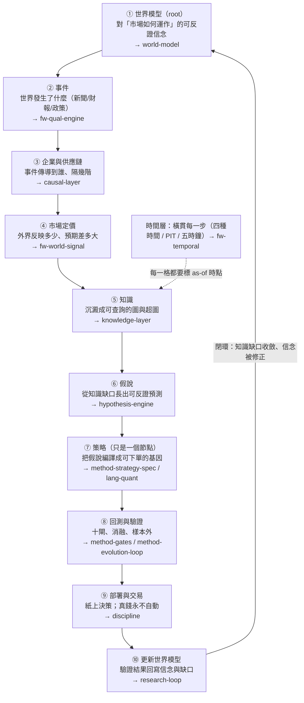

這張圖跟舊圖最大的差別，是箭頭的**終點回到了起點**。舊圖的終點是「實驗頁留下血統」，是一條開口的管線；新圖的終點是「更新世界模型」，是一個閉環。**進化的對象因此從「策略」換成「世界模型」**——每一輪不是問「有沒有生出更高 Sharpe 的策略」，而是問「世界模型的哪條信念被證實、哪條被否證、哪個知識缺口被填上」。整套主軸的完整說明在 [[research-loop]]，每一層各自展開在下面標的頁。

## 誠實對帳：這十格，哪些是真的、哪些是空殼、哪些擺錯位置

這是這一頁最重要的一節，不能跳過。上面那張漂亮的閉環圖，**目前絕大多數格子是「設計了、但幾乎沒有資料、而且在現行 wiki 敘事裡被擺到側邊」**。把每一格拆成三態誠實標記（資料截止 2026-07-22，數字為當日實查）：

| 迴圈格 | 【已設計】哪一頁/框架定義了它 | 【幾乎空殼】實際資料量（實查） | 【擺錯位階】現行 wiki 怎麼對待它 |
|---|---|---|---|
| ① 世界模型 root | [[world-model]]（本輪新頁）＋世界模型基底六動詞已上線 | wm_state 只鏡射研究側裁決摘要，**沒有一組「市場如何運作」的本體信念被顯式建模** | 舊圖裡根本沒有這一格；世界模型是「側邊功能」不是 root |
| ② 事件 | [[fw-qual-engine]]（mcm 唯讀 → MIEE 事件帳） | 新聞真實歷史**只有 15 天**（mcm 2026-07-07 起收）；事件帳雖多，可回測深度＝0 | 被歸為「質化語言」的一個框架，不是主迴圈入口 |
| ③ 企業與供應鏈 | [[causal-layer]]（本輪新頁）＋mcm causal_observations | causal_observations 約 **108 筆**（活管線，晨快照記 77）、正式 `edges` 表 **0 筆**、供應鏈**只有一階**（distance≈0）；多階傳導拓撲不存在 | 舊圖完全沒有這一格 |
| ④ 市場定價 | [[fw-world-signal]]（九態、P 預期差） | 世界層數值是**示意佔位**，未接真資料源（設計書自述） | 被歸為「量化語言」的第二個框架，P1 之後才進場 |
| ⑤ 知識 | [[knowledge-layer]]／[[graph-knowledge]]／[[graph-hypergraph]] | 研究側圖有料（qual_edge 374、qual_hyperedge 159、strategy_spec 5、interaction_edge 1）；但**世界側知識圖近乎空帳** | 舊圖有「圖記憶」，但它記的是研究血統，不是世界知識 |
| ⑥ 假說 | [[hypothesis-engine]]（MIEE hypothesis 狀態機） | MIEE 機件真跑過（109/109 考卷綠、3,412 筆前瞻預測），但**假說是從新聞事件長的，不是從世界模型缺口長的** | 被歸為第四部資訊層的一個雛形 |
| ⑦ 策略 | [[method-strategy-spec]]／[[lang-quant]]／進化引擎 | **這一格是真的**：strategy_spec 5、mutation_edge 2、gate_result 13，真跑過四輪實驗 | **舊圖把它當 root**——這正是被批評的擺錯位階 |
| ⑧ 回測與驗證 | [[method-gates]]／[[method-evolution-loop]]／[[exp-index]] | **這一格也是真的**：十閘建了幾道、消融真跑、樣本外一輪都還沒跑（全封頂 E2） | 位置正確，是全系統最紮實的一段 |
| ⑨ 部署與交易 | [[discipline]] | 只有紙上決策；真錢永不自動（天然護欄） | 位置正確 |
| ⑩ 更新世界模型 | [[research-loop]]（本輪新頁）＋wm_mirror 六動詞 | 目前只鏡射研究側裁決；**沒有「世界信念被修正」的回寫路徑** | 舊圖沒有閉環這一格 |
| 時間層（橫貫） | [[fw-temporal]] | `temporal_edge` **連表都還沒建**；四種時間、五時鐘、階段 schema 幾乎整層未實作 | 被標為「最未完成的一層」，位置正確但幾乎是空的 |

一句話讀完這張表：**真正有程式與資料撐著的，是⑦策略、⑧回測、⑨部署這一小段——也就是「策略進化的薄縱切」；而①②③⑤⑥⑩這些構成「世界模型閉環」的格子，多半是設計好的空殼。** 所以這不是「wiki 說有世界模型、其實完全沒有」的謊言，而是「世界模型層設計了、幾乎沒填、而且在敘事裡被擺到策略旁邊當配角」的三重實情。這個判斷本身就是 [[objective]] 與 [[research-os]] 兩頁的出發點。

## 一個關鍵警告：不要因為圖漂亮就去蓋十一個引擎

owner 同時提了另一個重構視角——把整套研究迴圈拆成 **Research OS 十一層**（世界模型／知識／超圖／時間／因果／假說／實驗／Alpha／組合／執行／自我進化）。這個拆法是對的，它把「該演化世界模型」這件事講清楚了。**但「真的把十一個引擎都蓋出來」，正是 [[discipline]] 方向裁決裡被點名的頭號致命盲點：architecture-first（架構先於價值驗證）。** 四層同時建成、日後研究失敗就無法歸因到哪一層——這句話對十一層一樣成立，而且更嚴重。

所以這份 wiki 的修法是**兩條腿分開走**，細節在 [[research-os]]：

1. **現在就重構敘事主軸與演化目標**——把 root 從策略換回世界模型、把演化目標從「策略級指標」換成「世界模型的可反證預測力／知識缺口收斂」。這件事便宜、正確、不寫一行新引擎程式碼，這一頁與 [[overview]]／[[objective]] 就是在做它。
2. **建置仍走薄縱切**——不蓋十一個空引擎，而是先把**一條**世界→知識→假說→驗證的真實機制鏈填滿（例如「台電強韌電網／CoWoS 擴產→散熱與重電供應鏈→月營收加速→定價延遲」這一條），讓它整條走完再談擴建。這正是方向裁決鐵律一「薄縱切優先」。

換句話說：**敘事重構是免費且該立刻做的；引擎建置永遠只准一條縱切在跑。** 把這兩件事混為一談——「既然要以世界模型為主軸，那就把十一層都蓋起來」——就是掉進 architecture-first 陷阱。

## 後端在做什麼：真相層的模組（＝⑦⑧那一小段的實體）

上面那條閉環是**該有的樣子**；下面這張表是**真的存在的程式碼**。它們全部長在 `aaro/`，寫進同一個 `aaro.sqlite`（07-22 兩引擎落地後 30 表）。看清楚它們在閉環裡的位置：**它們幾乎全部落在第⑦格（策略）與第⑧格（回測驗證）**——這正說明「已建置的部分＝策略進化薄縱切」，而不是整個世界模型閉環。

| 目錄／檔案 | 角色 | 在閉環的位置 | 狀態 |
|---|---|---|---|
| `engine/speclang.py` | 策略層 DSL 六算子（Universe/RankBy/TopN/Weight/RebalanceOn/ExitRule） | ⑦ 策略 | 07-22 已落地、九卷考卷綠 |
| `engine/spec.py` | StrategySpec 九部件驗證器＋單變因 diff 閘 | ⑦ 策略 | 已落地 |
| `engine/db_strategy.py`／`db_graph.py` | 四新表＋append-only 觸發器＋證據非空 CHECK；交互超邊表 | ⑤ 知識（研究側） | 已落地 |
| `engine/graph_views.py` | 四圖投影 SQL 視圖（DROP 可重推逐位元一致） | ⑤ 知識（研究側） | 已落地兩圖視圖 |
| `engine/compile_positions.py` | 真 finlab_db 事件樣本部位編譯器（月營收公告日錨、t+1） | ⑦→⑧ | 已落地 |
| `engine/run_ab.py`／`run_c.py` | 部署同形淨值引擎 | ⑧ 回測 | 已落地 |
| `engine/gaps.py`／`ablation.py`／`evolve_loop.py` | 圖提案器／四臂消融／自主迴圈 | ⑧ 驗證（見 [[method-evolution-loop]]） | 07-22 落地 |
| `evaluator/harness.py` | **全系統唯一評分器**：rank IC/t、噪音地板、控動能增量、三態 judge | ⑧ 純碼裁決 | 沿用、零改動 |
| `kb.py` | 實驗記憶／接手摘要／查重閘 G0／預註冊 sha256 凍結 | ⑤→⑩ | 沿用＋擴 writeback |
| `wm_mirror.py` | 世界模型六動詞鏡射（分域分庫、同一契約） | ⑩ 更新世界模型（目前只鏡射研究側） | 沿用 |
| `qual/`（`db_qual.py`／`narrative.py`／`vocab.py`／`project_edges.py`） | 質化引擎：機制詞彙對映／`qual_edge`／`qual_hyperedge`／敘事卡 | ②③ 事件與傳導（雛形） | 07-22 落地、九卷綠，見 [[fw-qual-engine]] |
| `report → :8987 /compiler` | 研究雙語把裁決編成固定順序人類報告 | 全鏈輸出 | 沿用 |

三條不可混淆的邊界（後端 code review 的紅線）：**LLM 與規則可提案、永不寫裁決欄；回測產知識、永不產真錢部位；UI 是投影、永不回灌計算。** 這三條在重構後一字不改——它們保護的是機件的誠實，與 root 是誰無關。

## 資料流：策略節點內部怎麼端到端跑完一輪

下面是⑦⑧兩格內部的一輪進化資料流——也就是「已建置薄縱切」的實際管線。放在這裡是要提醒你：**這條管線很紮實，但它是閉環裡的一小段，不是閉環本身。** 每一步都落帳，前一關敗、後一關不跑（省預算）：

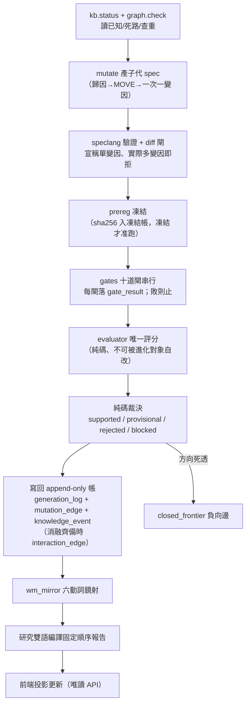

這條流水線裡有三個設計不可退讓：**預註冊在看結果之前凍結**（[[method-gates]]）、**評分器唯一且不可被進化對象自改**（[[discipline]]）、**裁決是純碼不是 LLM**（LLM 只在「unknown 歸因解讀」與「交互超邊候選提案」兩處出現，輸出一律過驗證器，非法即拒）。

**但要注意這條管線的裁判是誰**：它問的是「子代 spec 的評分有沒有勝過父代」。[[exp-002-ablation|實驗 002]] 已經證明，當你用這個裁判去放手優化，引擎會一路走進動能 beta——因為在多頭樣本裡，動能就是會付錢。這不是機件壞了，是**裁判問錯了問題**。要問對問題，裁判得換成「世界模型的可反證預測有沒有被證實」，而不是「策略級指標有沒有變好」。這個「目標錯置」是整份重構的核心證據，完整寫在 [[objective]]。

## 前端：投影層

前端全部是投影，資料只走唯讀 API（`serve.py`，回應加 `no-store` 防舊快取假故障）。主使用者是 owner，手機經 tailscale 進入，三分鐘回答「在研究什麼／為何選這步／花了多少／卡在哪／要不要我介入」。核心頁：候選閘門管線頁（每列一候選、十閘燈、點開逐閘履歷）、血統樹（父→子沿 MOVE 展開、失敗旁支灰色保留）、A/B 功勞簿（舊流程 vs 語言棧流程七項 meta 記帳，見 [[discipline]] 證據歸屬分離）、每日持股敘事卡（[[fw-qual-engine]]）。另有一個對外報告站 `pub/`（`serve_report.py:8996`，公開網址

https://alpha.7706210988.uk

自包含、去識別化，就是為了貼給 LLM 讀並邀請對抗批判；這份 wiki 就住在它下面。

## 現況與邊界

架構圖上不是每一塊都已實作，而且重構之後這件事更該被講清楚：**已落地的是「策略進化薄縱切」（⑦⑧⑨），構成「世界模型閉環」的其餘格子（①②③⑤⑥⑩）多為設計空殼。** 逐項狀態見上面的三態對帳表。具體到程式層——**已落地**（07-22）：speclang／spec 驗證器／diff 閘／四新表＋觸發器／兩圖視圖／查重閘／部位編譯／run_ab 與 run_c 部署同形對照／qual 兩表／敘事卡 v1／圖提案器＋消融＋自主迴圈。**未落地**：十道證據閘只建了其中幾道、mutate 完整路由、前端全部頁面、[[fw-temporal|時間層]] 的 `temporal_edge`／五時鐘／對齊契約、[[causal-layer|因果層]] 的正式 edges 表與多階供應鏈、[[world-model]] 的世界信念本體、[[hypothesis-engine|假說]] 從知識缺口生成的路徑。各層對應頁的「誠實邊界」節與 [[for-llm-review]] 有逐項展開；為什麼「先重構敘事、再薄縱切填一條鏈」而不是「蓋齊十一層」，見 [[research-os]]。

---

<a name='research-os'></a>
# 〔research-os〕研究作業系統：11 層與「別蓋空引擎」

這一頁把 owner 對整套系統的**結構重構**攤開：這不該是「一台進化策略的引擎」，而該是一個以**世界模型為根**的研究作業系統（Research OS），共 11 層——World Model／Knowledge／Hypergraph／Time／Causal／Hypothesis／Experiment／Alpha／Portfolio／Execution／Self-Evolution。

但這一頁同時要做一件**誠實對帳**的事，因為它最容易被誤讀成「所以我們要去把 11 層都蓋出來」。先給兩個答案：

> **認知答案**：11 層架構是對的**敘事與目標重構**——它把「策略」從研究的根，降級成迴圈裡的一個節點，把「世界模型」擺回根的位置（為什麼是根，見 [[objective|進化目標]] 與 [[research-loop|研究迴圈]]）。但這 11 層**目前的真實狀態**大多是「設計了、幾乎空殼、而且擺錯位階」，不是「已經蓋好」。
>
> **行動答案**：修法分兩半，**只做第一半是便宜且正確的，第二半必須忍住**。①**現在就重構敘事主軸與演化目標**——這只要改文件與評分方向，便宜、無風險、且直接對；②**建置仍走薄縱切**——先把**一條**真實的「世界→知識→假說→驗證」機制鏈填滿（例如台電強韌電網、或 CoWoS 擴產這種有真新聞、真傳導、真標的的鏈），**而不是把 11 個空引擎都蓋出來**。因為「真的把 11 層都蓋出來」正是 owner 自己在 [[discipline|誠實紀律]] 裡點名的 **architecture-first 致命陷阱**。

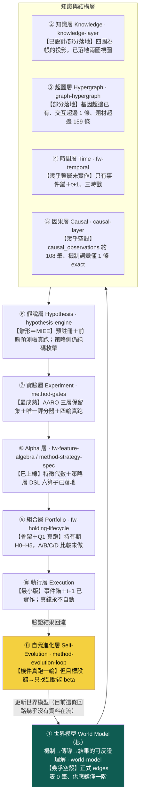

## 一、11 層各自是什麼、現在真的長什麼樣（三態對帳）

下面這張表是本頁的骨幹。每一層標三件事：**【已設計】**它在哪個既有頁或框架已被定義；**【幾乎空殼】**它實際的資料量／實作到哪；**這一層對應的頁**。誠實邊界不得省——owner 說「沒有 Knowledge／World State／Time／Causal Layer」，更精確的真相是「這些**設計了但幾乎是空殼、而且擺錯位階**」，不是完全沒有。

| 層 | 這一層做什麼 | 【已設計】 | 【幾乎空殼／真實資料量】 | 頁 |
|---|---|---|---|---|
| ① 世界模型 | 機制→產業→公司→供應鏈的可反證理解，是全迴圈的根 | 設計書第四部＋`wm_mirror` 六動詞鏡射介面 | **正式 edges 表 0 筆**；供應鏈只有一階（`supply_chain_distance` 幾乎全 0）；新聞真歷史僅 15 天 | [[world-model]] |
| ② 知識 | 定義／策略／證據／演化四張圖，記「誰與誰有關、誰生了誰」 | [[graph-knowledge]] 第一鐵律「圖是帳的投影」 | 已落地演化圖／證據圖兩個 SQL 視圖；定義／策略圖為 spec 展開 partial | [[knowledge-layer]] |
| ③ 超圖 | 存「多條件共同作用」的高階交互 | [[graph-hypergraph]]（基因超邊＋交互超邊消融紀律） | 基因超邊已落地；交互超邊**只 1 條**（conflicting）；世界側題材超邊 `qual_hyperedge` 159 條 | [[graph-hypergraph]] |
| ④ 時間 | 把時間從欄位升級為圖的一級結構（四種時間／時態超邊／五時鐘） | [[fw-temporal]]（十塊 schema 完整設計） | **幾乎整層未實作**；只有事件錨＋t+1、三時戳、`qual_edge` 時效欄 | [[fw-temporal]] |
| ⑤ 因果 | 事件→影響→傳導的因果邊與機制身份 | [[causal-layer]]；mcm `causal_observations`＋MIEE `market_mapping` | `causal_observations` **約 108 筆**（活管線日更、浮動）；機制詞彙兩套僅 **1 條 exact 生效**、3 條待人核 | [[causal-layer]] |
| ⑥ 假說 | 從缺口提出**可反證**的假說，預註冊凍結 | [[hypothesis-engine]]；MIEE 假說機（預註冊凍結＋落准觸發器） | MIEE 有 3,412 筆前瞻預測帳（真跑）；但**策略側**的「下一代測什麼」仍是純碼機制庫枚舉，非真假說引擎 | [[hypothesis-engine]] |
| ⑦ 實驗 | 十道證據閘＋唯一評分器＋三層保留集，判真假 | [[method-gates]]；AARO harness | **全機最成熟一層**：四輪實驗真跑、獨立重算、E2 封頂 | [[method-gates]] |
| ⑧ Alpha | 把世界狀態寫成可組合的特徵與策略基因 | [[fw-feature-algebra]]＋[[method-strategy-spec]] | 特徵代數已上線；策略層 DSL 六算子已落地 | [[fw-feature-algebra]] |
| ⑨ 組合 | 入選之後怎麼抱到賣（持有管理） | [[fw-holding-lifecycle]]（H0–H5＋剩餘 Alpha） | 骨架＋研究問題一真跑（finlab 覆核）；A/B/C/D 完整比較未做 | [[fw-holding-lifecycle]] |
| ⑩ 執行 | 事件錨、t+1、成本滑價、真錢閘 | 框架書執行層；`engine/compile_positions` | 事件錨＋t+1 已實作；**真錢永不自動**（人按 CA 閘） | [[research-loop]] |
| ⑪ 自我進化 | 讓迴圈自己提案、變異、裁決、回流 | [[method-evolution-loop]]；evolution-loop 憲法 | 機件真跑一輪（[[exp-003-graph-evolution|實驗 003]]）；**但目標設錯→只找到動能 beta**（[[objective]]） | [[method-evolution-loop]] |

## 二、「擺錯位階」到底錯在哪

三態裡最隱形、也最該修的是第三態——**擺錯位階**。目前這份 wiki 的敘事骨架（[[overview|總覽]]／[[architecture|架構]]／[[lang-quant|量化語言]]）是**以策略為中心**排的：策略基因 → 語言棧 → 圖記憶 → 進化迴圈 → 實驗。世界模型（新聞、供應鏈、因果、時間）像是掛在旁邊的一組**側邊功能**（質化語言那一支），而不是整條研究迴圈的**根**。

這個排法本身就在複製病灶六。當敘事把「策略」放在中央，讀者、以及演化目標，都會自然地去優化「策略好不好」——於是就一路滑向 [[exp-002-ablation|實驗 002]] 那個結局：動能 beta。owner 的重構要求把位階倒過來：**世界模型是根，策略只是世界模型在某個決策時點的一個投影/下游節點**（見 [[research-loop|研究迴圈]] 的主軸）。這一步**不需要寫任何新引擎**，只需要重排敘事與重設目標——所以它是「便宜且正確」的第一半修法。

## 三、關鍵 caveat：別把「重構」做成「蓋 11 個空引擎」

這是全頁最重要的一句提醒，因為 11 層架構圖**太容易被讀成一張施工藍圖**。

owner 自己在 [[discipline|誠實紀律]] 的方向裁決裡，把 **architecture-first（架構先於價值驗證）** 列為**致命盲點**：四層同時建成，日後研究失敗就無法歸因到哪一層；精緻空轉。11 層比 4 層更危險——如果讀完這頁的反應是「那我們把 World Model、Knowledge、Causal、Time 四個空引擎都建起來」，那就正好踩進 owner 親手畫的地雷。

正確的第二半修法是**薄縱切**（thin vertical slice，[[discipline]] 第六節）：

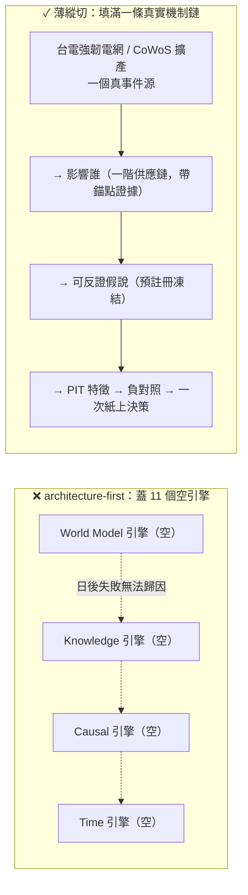

薄縱切的意思是：**先只打通一條**「真實事件源 → 影響誰 → 可反證假說 → PIT 特徵 → 負對照 → 持有規則 → 報告 → 一次紙上決策」的完整垂直鏈，讓這一條鏈**真的有資料在世界模型、知識、假說、驗證之間流動**。把 11 層各建一點點、卻沒有任何一條端到端跑通，是最差的結果——那是 11 個都是空殼，只是每個都「有了」。用一條真鏈把「世界→知識→假說→驗證」走通，遠比 11 個空引擎有價值，也才符合上位方向裁決的第一鐵律。

（為什麼選台電強韌電網 / CoWoS 這種鏈當第一條薄縱切：它們有真新聞、有可辨識的一階供應鏈、有可反證的傳導假說——正好是把因果層與世界模型層從「約 108 筆觀察／0 筆正式邊」推到「一條有證據的完整鏈」所需要的最小真實案例，而不是憑空畫想像的全圖。）

## 四、誠實邊界（不得省略）

- **本頁講的是結構重構，不是「已完成 11 層」**。表中每一層的【幾乎空殼】欄就是它的真實資料量：正式世界模型 edges 表 0 筆、因果觀察約 108 筆、供應鏈一階、交互超邊 1 條、時間層幾乎整層未實作、新聞史 15 天。這些數字是 2026-07-22 晨偵察快照，會隨活管線浮動。
- **11 層不是新蓋 11 個系統**。多數層是把**既有資產歸戶**進來：實驗層＝既有 AARO harness、Alpha 層＝既有特徵代數、組合層＝既有持有期、自我進化層＝既有進化迴圈。真正**近乎零實作**的是世界模型層、因果層、時間層，以及「策略側」的假說層。
- **第一半修法（重構敘事與目標）可以現在做；第二半（建置）必須走薄縱切**。把兩半混為一談、直接開工蓋四個空引擎，就是 architecture-first 復發。
- **11 層本身也在總體 kill criteria 之下**。若薄縱切跑完、A/B 記帳證明某層沒有增量，那一層照樣拆——把它蓋出來不構成保留它的理由（見 [[discipline]] 第十節）。

一句話收束：**11 層是對的地圖，不是對的施工順序。** 現在就把世界模型擺回根、把目標從策略級績效換成世界模型的可反證預測力（[[objective]]）；然後只挑一條真鏈，把世界→知識→假說→驗證走通一次，再談要不要擴。

延伸：這條迴圈的完整主軸見 [[research-loop|研究迴圈]]；為什麼世界模型該當根、策略級目標為何會壞見 [[objective|進化目標]]；把假說變成可反證一等公民的機制見 [[hypothesis-engine|假說引擎]]；世界模型層與因果層的真實空殼狀態見 [[world-model]] 與 [[causal-layer]]；architecture-first 與薄縱切的完整條文見 [[discipline|誠實紀律]]。

---

<a name='objective'></a>
# 〔objective〕演化的目標：一個目標函數量不了三種東西

這一頁講整套系統**最深的一個 bug**，以及修這個 bug 時**第一輪修過頭**的地方。前面的頁都在談「進化（Evolution）」怎麼跑得更好——圖怎麼提案、消融怎麼判、迴圈怎麼回流。owner 第一輪批評指到更下面一層：問題不在**演化的機制**，在**演化的目標（Objective）設錯了**。owner 第二輪批評又補一刀：第一輪的解法「所以改成只演化世界模型」**本身也是錯的**——它把策略當成可有可無的投影丟掉了。

先給認知答案與行動答案，其餘證據都服務這條主軸。

> **認知答案**：原始的 bug 是真的——這台引擎（以及大多數「自動找 Alpha」的系統）把**策略／程式／prompt** 當成演化對象，去優化一個策略級指標（子代 Sharpe 勝父代），而那個指標是**過擬合代理**，不是你真正要的東西。但第一輪的修法「**只**演化世界模型」矯枉過正了：它把「策略」貶成世界信念的**免費投影**，好像信念對了策略就自動掉出來。實情相反——**策略是世界信念穿過真實世界約束（成本、beta、風險、容量）後的決策政策**，那層約束是真功夫，有它自己的對錯。正確的結構不是「一個目標」，是**三個分開裁決的迴圈**：認知迴圈演化**信念**、決策迴圈演化**策略**、元研究迴圈演化**怎麼選問題**，各有各的裁判。
>
> **行動答案**：不要再用**一把尺**（子代 Sharpe 勝父代）量所有東西——那把尺我們**已經實測過會壞**（見下面 [[exp-002-ablation|實驗 002]]）。改成三把尺：認知迴圈用**預測校準／樣本外 log score／反證**、決策迴圈用 **beta 中性後增量／成本後效用／風險**、元研究迴圈用**單位成本資訊增益／重複研究率／失敗歸因**。三迴圈的完整分工見 [[three-loops|三個迴圈]]。而**第一步**不是重寫全部評分器，是先給**決策迴圈**的適應度加一道「動能 beta 懲罰」（[[exp-003-graph-evolution|實驗 003]] 的 P0 行動），擋住「放手優化 CAGR 只會一再重新發現 beta」這個已被證實的捷徑。

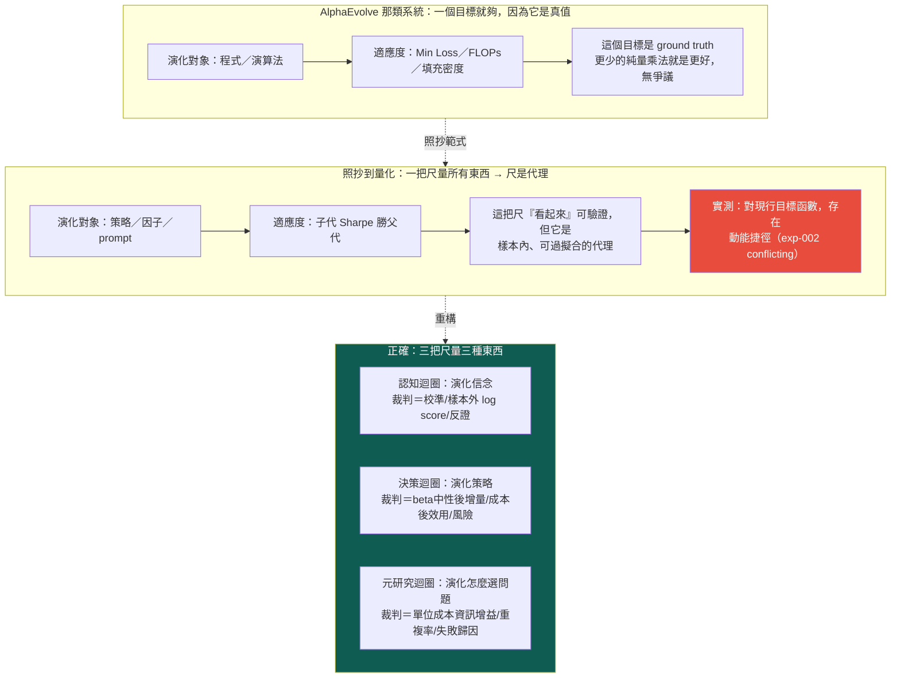

## 一、AlphaEvolve 為什麼一把尺就夠：因為它的目標無可爭議

先講清楚被照抄的範式為什麼在它自己的場域裡有效。AlphaEvolve 這類演化式程式合成系統的核心前提是：**適應度函數是一個可機械驗證的 ground-truth 指標**——一個矩陣乘法演算法用了幾次純量乘法、一個模型的 loss 是多少、一種裝箱方式的填充密度多高。這些數字**就是你要的東西本身**，不是它的代理：更少的乘法次數，客觀上就是更好的演算法，沒有「它看起來好但其實沒用」的空間。

有了這種目標，演化就有一個**不會騙自己的裁判**，而且**一把尺就夠**——因為在它的世界裡，「更好的程式」是單一維度、無歧義的。你可以放手讓它變異幾百萬代，每一代的分數都直接對應真實價值。這是 AlphaEvolve 範式成立的全部基礎，也是它**只需要一個目標函數**的原因。

## 二、照抄到量化，一把尺就從「真值」退化成「代理」

問題出在把這個範式搬到量化投資時，**目標的性質變了，但抄的人沒注意到**。

「子代策略的 Sharpe 勝過父代」看起來也像個可驗證的目標——Sharpe 確實算得出來、確實決定性可重現、確實能寫進純碼裁決。整套 [[method-evolution-loop|進化迴圈]] 的 `decide_verdict()` 現在就是這樣判的：`CAGR 與 Sharpe 皆勝父代 → provisional`。表面上跟 AlphaEvolve 一樣嚴謹。

但它跟 FLOPs 有一個致命差別：**樣本內的策略績效不是 ground truth，是一個高度可過擬合的代理**。你真正要的是「這條策略在未來、在你沒看過的市場狀態下還會賺錢」，而樣本內 Sharpe 對這件事只是一個**有偏、可被搜尋策略反向利用**的估計。當你把它當適應度去大量優化，演化不會去找「真正理解市場」的策略，它會去找「在這段歷史上剛好 Sharpe 高」的策略——而在一段多頭偏樣本裡，那條最好走的路，往往是**動能 beta**。

這不是純理論擔憂。這台引擎自己撞上了那條路。

## 三、直接證據（正確計量）：對現行目標函數，存在一條動能捷徑

這是本頁最硬的一塊。這裡要**謹慎地**陳述它證明了什麼、沒證明什麼——owner 第二輪特別點名舊版把這個實驗**說太滿**。

[[exp-002-ablation|實驗 002]] 對這台引擎自己剛生出的漂亮候選 C（月營收 × 250 日價格強勢，CAGR 33%、Sharpe 1.52）跑了一個乾淨的四臂消融，問：C 的優勢是「月營收 × 價格強勢」的**真綜效**，還是兩個因子各自貢獻的**相加**？純碼判定的答案是 `conflicting`——**幾乎全是動能 beta 相加**：

| 組合 | Sharpe | 對基準超額(CAGR) |
|---|---|---|
| 都沒有（基準，等權流動性全池） | 0.96 | — |
| 只有營收選股（＝父代 B） | 1.08 | +5.60pp |
| 只有價格強勢（純動能） | **1.52** | +12.26pp |
| 營收＋強勢（＝候選 C） | **1.52** | +18.60pp |

三個讀數把這件事講死了：

- **加強勢給營收股（+13.0pp）≈ 加給基準（+12.3pp）**——價格強勢的貢獻與有沒有做營收選股**無關**，是相加不是綜效。
- **純動能 Sharpe 1.52 ＝ 營收＋強勢 Sharpe 1.52**——有了動能之後，再加營收選股，對風險調整報酬的邊際貢獻是**零**。
- synergy CAGR 只 +0.74pp（勉強過噪音門檻）、synergy Sharpe −0.12（負），兩指標方向相反 → `conflicting`。

然後 [[exp-003-graph-evolution|實驗 003]] 讓圖自己提案、自主連跑三代，**放手讓迴圈去追報酬**，它就一路走進更純的動能暴露——gen2 換 120 日動能（Sharpe 1.50）、gen3 換 250 日創新高（Sharpe **2.06**，標「幾乎肯定過度擬合」）。迴圈的機件全部正確運作、決定性可重現、負結果如實入帳。

**這證明了什麼，要精確**：合起來看，這是**對「子代 Sharpe 勝父代」這個現行目標函數，存在一條動能捷徑的直接實驗證據**——在這段多頭偏樣本上，優化它會系統性地滑向動能 beta，而不是滑向對世界的新理解。

**這不證明什麼**：它**不**證明「所有策略演化都必然收斂到 beta」。那是舊版的過度宣稱。它是**在這個特定目標函數 × 這段特定樣本**下的一次真實觀測——一個存在性證明（「這條捷徑存在、且迴圈會走它」），不是一條普世定律。換一個把 beta 中性化掉的目標、換一段含空頭的樣本、換一個帶反證約束的搜尋空間，結論可能不同——事實上，加 beta 懲罰正是為了**堵掉這條已被觀測到的捷徑**。把「觀測到一條捷徑」升級成「一切演化的命運」，就犯了跟原始 bug 同一類的錯：把一次樣本內觀測當成 ground truth。

即便收窄成存在性證明，它依然很尖銳：**當你用『策略級績效勝父代』這一把尺，一台機件完全正確的進化迴圈，會沿著這段樣本裡最好走的那條路滑下去——而那條路是動能 beta。** 這就是原始 bug——**Evolution 沒問題，用單一策略級目標當裁判有問題**。

## 四、第一輪修過頭了：策略不是投影，是穿過約束的決策政策

原始 bug 的第一輪解法是「把根從策略搬到世界模型，**只**演化世界模型」。方向對了一半，但 owner 第二輪批評指出它**過頭**：它把策略貶成世界信念的一個**免費投影**，好像「信念對了 → 策略自動掉出來」。這是錯的，而且錯得會讓人忽略一整層真功夫。

**策略是世界信念（B）穿過真實世界約束後的決策政策（P）**，不是 B 的無損投影。從「我相信 CoWoS 擴產會讓某供應鏈受惠」到「我今天實際該持有什麼、多少、抱多久、何時砍」，中間隔著一整層**現實約束**：

- **成本與滑價**：信念再對，週轉太高被交易成本吃光就不該做；
- **beta 與風險**：一條政策若增量全來自 beta 暴露，即使賺錢也不算「懂了世界」（這正是第三節的捷徑）；
- **容量與流動性**：小型股上有效的信念，放大部位就成交不了（[[fw-holding-lifecycle|持有期]] 記過 0056 這種案例）；
- **持有與退出**：同一個信念，配不同的進出場政策，報酬天差地別（[[exp-000-engine-first-run|實驗 000]] 的 A/B 退出時點）。

這層約束**有它自己的對錯**，不能靠「把信念弄對」免費得到。所以策略需要一個**自己的演化迴圈、自己的裁判**——決策迴圈，用「beta 中性化後還有沒有增量、成本後效用、風險」來打分。把它丟掉、只演化信念，等於假設現實約束不存在——那跟「照抄 FLOPs 尺」是同一種天真，只是天真在另一頭。

於是正確結構是**三個分開裁決的迴圈**，各演化不同的東西、各用不同的尺：

| 迴圈 | 演化什麼 | 裁判（不可共用） | 為什麼要獨立 |
|---|---|---|---|
| **認知迴圈** | 信念／世界模型 B | 預測校準、樣本外 log score、反證 | 「懂了世界」的判準是**可反證預測力**，不是賺不賺錢 |
| **決策迴圈** | 策略 P（決策政策） | beta 中性後增量、成本後效用、風險 | 「該不該做」隔著真實約束，有 beta 捷徑要專門堵 |
| **元研究迴圈** | 怎麼選問題（研究議程） | 單位成本資訊增益、重複研究率、失敗歸因 | 「值不值得研究」是資源配置問題，見 [[hypothesis-engine]] 的 ResearchValue |

一把尺量三種東西，就是本頁病灶的根：用決策迴圈的尺（Sharpe）去評認知的產出（信念），於是「懂了世界」被誤判成「Sharpe 高」，最後只量出動能 beta。三迴圈怎麼扣在一起、各自的 settle 怎麼跑，見 [[three-loops|三個迴圈]] 與 [[research-loop|研究迴圈]]。

## 五、認知迴圈的裁判長什麼樣：可反證預測，不是績效

三把尺裡最反直覺的是**認知迴圈的尺**——它**不用績效**評分。一條信念不是用「它讓某策略 Sharpe 變高」來評，而是用「它事前下了一個**會被證偽**的預測、後來對帳成立」來評。這正是 [[world-belief-contract|信念契約]] 與 [[fw-qual-engine|MIEE]] 預測帳在做的事：預註冊 → 到期 settle → 純碼判 REFUTE／WEAKEN／CONFIRM。

[[exp-004-belief-contract|實驗 004]] 給了這把尺第一個真讀數：信念 B-H-003（漲價事件後遲滯重定價，主窗 5 日）事前把預期凍結成靶，86 筆對帳只有 27 命中、成本後平均超額 −0.76%，純碼用 Wilson 下界把信心從 0.5 判到 **0.2256**，`update_action=REFUTE`。**注意這條信念被推翻，用的不是「它對應的策略賺不賺錢」，是「它事前的可反證預測對不對」**——這就是認知迴圈的尺與決策迴圈的尺**根本不同**的活證據。系統要找的 Alpha 的最終形態，不是「營收加速有效」，而是一條**帶完整時間約束、附預註冊未來驗證窗的時態因果模式**（見 [[fw-temporal|時間層]]）——那才是能被認知迴圈這把尺持續打分、能隨時間演化的完整投資邏輯。

## 六、誠實邊界（不得省略）

這一頁講的是**目標的重構**，屬於敘事與設計層，必須誠實標明哪些還沒兌現：

- **三把尺目前只有一把半真的在跑**。決策迴圈的尺（Sharpe/CAGR 勝父代）是線上的（但那正是要修的舊尺）；認知迴圈的尺剛在 exp-004 跑出**兩條**信念契約；元研究迴圈的尺（ResearchValue）目前是**設計**，見 [[hypothesis-engine]]，未成為線上評分器。「三迴圈分開裁決」是對的結構，但遠未實作完。
- **exp-002 是存在性證明，不是普世定律**。本頁第三節已改寫成「對現行目標函數存在動能捷徑的直接實驗證據」；任何把它讀成「所有策略演化必然收斂 beta」的說法都超出證據。
- **第一步是打補丁，不是換三套引擎**。三份報告共同的 P0 行動是給**決策迴圈**加「動能 beta 懲罰」，這只是**堵住已知的最大捷徑**，不等於「三迴圈都建好了」。真正的目標轉向要靠 [[world-belief-contract|信念契約]] 與 [[hypothesis-engine|假說引擎]] 把「可反證預測」與「單位成本資訊增益」變成一等公民。
- **這是重構，不是推翻已跑的實驗**。exp-000～004 的機件、消融、帳務、信念 settle 全部有效且經獨立重算；本頁不改它們的數字，只是指出「用單一策略級目標當裁判」是錯的——這恰恰是那些實驗**自己證明出來的**。
- **別把目標重構升級成「蓋 11 個引擎」**。把根搬到世界信念、把策略獨立成決策迴圈，都是對的敘事，但「真的把信念層、知識層、因果層都蓋出來」正是 [[discipline|誠實紀律]] 點名的 architecture-first 陷阱——修法走薄縱切，先填一條真的觀測→信念→假說→驗證鏈，細節見 [[research-os|研究作業系統]]。

一句話收束：**這台引擎最有價值的一次自我否證（exp-002），起訴的不是「策略」這個東西，是「用一把尺量所有東西」這件事。** 機件會轉、帳務可信、能拒絕相信自己——但只要還想用單一策略級目標當唯一裁判，它會非常誠實地、非常可重現地，把力氣全花在重新發現動能 beta 上。把尺拆成三把、讓信念、策略、議程各自被對的裁判打分，才是解法。

延伸：三個迴圈的完整分工與 settle 見 [[three-loops|三個迴圈]]；這條迴圈真正的主軸（W/O/B/P 分開）見 [[research-loop|研究迴圈]]；信念怎麼被真證據判 REFUTE 見 [[world-belief-contract|信念契約]] 與 [[exp-004-belief-contract|實驗 004]]；把「值不值得研究」變成 ResearchValue 見 [[hypothesis-engine|假說引擎]]；11 層架構與「別蓋空引擎」的紀律見 [[research-os|研究作業系統]]；紀律總條文見 [[discipline|誠實紀律]]；不認得的詞查 [[glossary|詞彙表]]。

---

<a name='world-model'></a>
# 〔world-model〕世界模型：世界不是新聞，新聞是世界狀態的 delta

這一頁是 owner 深層批評的**病灶 3**。批評很短、但足以掀掉整份 wiki 的敘事主軸：

> 這台引擎把「新聞流」當成世界的樣子——一則一則事件進來、觸發訊號、生成策略。但**世界不是一串新聞**。世界是一組緩慢與快速移動的狀態變數：利率、美元、能源價格、航運費率、AI 資本支出、記憶體（DRAM/HBM）循環、PCB 稼動、CoWoS 產能、ETF 資金流……**一則新聞之所以有意義，是因為它是這些世界狀態的一個 delta（變化量）**。「Fed 降息」不是一個孤立事件，它的意義是：`Fed 利率 ↓ → 美元 ↓ → 借貸成本 ↓ → 科技股評價 ++`。沒有那個世界狀態當背景，這則新聞不可讀。

換句話說，投資判斷的根不是「新聞說了什麼」，而是「世界現在是什麼狀態、這則新聞把哪個狀態變數推向哪裡」。策略只是這個世界狀態的一個下游函數——`E[未來報酬 | 世界狀態]`（見 [[objective|進化目標]]、[[overview|總覽]]的策略本體論）。

## 認知答案與行動答案（先講結論）

- **認知答案**：世界模型（world model）在這台引擎裡**被設計了、但幾乎是空殼、而且擺錯了位階**。它不是「完全沒有」——[[fw-world-signal|世界訊號]]的九態狀態機、[[objective|本體論]]的 `狀態 → 期望` 公式都在描述世界狀態；但世界層的**數值全是示意佔位、沒接任何一條真實的世界狀態序列**，而且整份 wiki 的敘事把「策略基因的進化」當主軸、把世界模型降格成量化語言棧的一個側邊框架。
- **行動答案**：分兩步，且順序不能顛倒。①**現在就重構敘事主軸與進化目標**——把世界模型放回根、策略放回下游節點（便宜且正確，只改敘事與目標函數）；②**建置仍走薄縱切**——先把 **ONE** 條「世界狀態 → 知識 → 假說 → 驗證」的真實機制鏈（如台電強韌電網、CoWoS 產能）從頭填滿，**而不是**把 [[research-os|Research OS 11 層]]的十一個引擎都蓋成空殼。後者正是 [[discipline|誠實紀律]]點名的 architecture-first 致命陷阱。

## 三態誠實對帳：世界模型現在到底存在到什麼程度

owner 說「沒有世界狀態層」——精確講不是完全沒有，是三種狀態混在一起。攤開如下。

### 【已設計】哪些既有頁/框架已經定義了世界狀態的語言

- [[fw-world-signal|世界訊號]]把世界判斷拆成 `WS = D + V + M + A + T + P + E + τ` 的完整地址，其中 **D（Observation）的九種觀測型別**——`Price / Quantity / Capacity / Demand / Competition / Policy / Technology / Finance / Market`——就是「世界狀態變數」的封閉詞彙雛形；輸出是**行情演化九態狀態機**（無衝擊 → 甜蜜點 → 主升段 → 破壞），這是「世界走到哪個階段」的語言。
- [[objective|本體論]]／[[overview|總覽]]把策略定義成 `世界狀態 S → E[未來報酬 | S]`——這條公式本身就把世界狀態立為第一位、策略立為它的期望函數。
- AARO（自治 Alpha 研究實驗室，本專案地基）的 regime 概念（波動 regime 決定順勢/反轉輪動，已真跑 H-R001）是「世界處於哪個狀態」影響策略的既有實例。

### 【幾乎空殼】實際上世界狀態有多少真數據

- **世界訊號的世界層數值是示意佔位**：案例庫 WS001–WS006 用同一個衝擊（華城／台電強韌電網）示範九態，但那些世界層數值是**示範 schema 用的佔位資料，不是即時抓取的真實世界資料**（見 [[fw-world-signal]] 誠實邊界）。引擎機件（狀態機／影響比／預期差／反證／PIT）是真的、可驗證；但世界層**尚未接任何真資料源**。
- **九態不是 owner 講的那個世界狀態**：這裡有一個必須說清楚的位階落差。世界訊號的九態，描述的是「**某個特定衝擊 × 某家公司**」演化到哪——它是**個股行情**的階段機。而 owner 病灶 3 講的世界狀態，是**利率／美元／能源／航運／DRAM／PCB／CoWoS／ETF 這些總體變數本身**當一級物件、每天有值、彼此有傳導。**這一層——把總體世界變數物化成一張「今天世界長什麼樣」的狀態表——全機零實作、連 schema 都還沒定**。九態是「行情對某衝擊的反應」，不是「世界本身的狀態」。
- **沒有任何一張表叫「世界狀態」**：你在整台機器裡找不到一列「2026-07-22：Fed 利率 x%、美元指數 y、BDI 航運 z、HBM 現貨 w、CoWoS 稼動 v」。世界狀態目前只存在於敘事與佔位案例裡，不存在於資料裡。

### 【擺錯位階】wiki 敘事把策略當根、世界模型當側邊

- [[index|首頁]]與 [[overview|總覽]]的敘事線是「策略＝狀態的期望 → 四種語言 → 圖記憶 → **進化引擎生成/否證策略**」——主角是**策略基因（StrategySpec）**，進化迴圈變異的是策略、裁決的是策略的 Sharpe/CAGR。
- 世界模型出現在哪？出現在量化語言棧的**第二層框架**（[[fw-world-signal]]），與特徵代數、持有期並列，是「五層語言之一」，而且資產歸戶總表明講它「**P1 後才進場**」（Gen5 regime 門控才需要）——被排到最後。
- 這正是病灶 3 的核心：**世界模型像側邊功能，不像根**。owner 的重構要求把這個位階倒過來——世界狀態是根，策略是「站在某個世界狀態下、對某群股票的期望」這個下游節點。

## 一張圖看懂：世界狀態當根，新聞是它的 delta

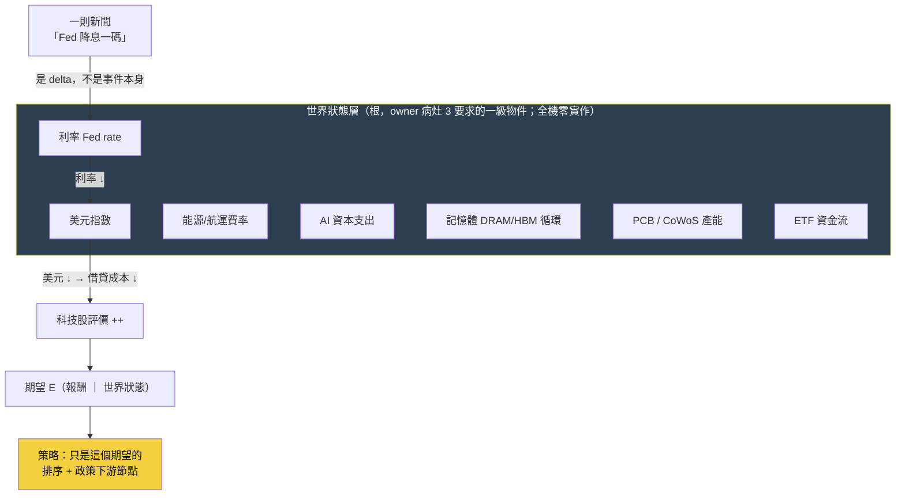

讀法：新聞（「Fed 降息」）不是圖的起點，它是**打在世界狀態變數上的一個 delta**；世界狀態沿傳導鏈改變評價，評價改變條件期望，策略才在最下游依期望排序、套政策。目前這台引擎的實作把箭頭方向搞反了——從新聞直接跳到策略訊號，中間那層深藍色的「世界狀態」是空的。

## 病灶 3 的第二層（owner 第二輪）：世界 W、觀測 O、信念 B 要乾淨分開

上面那張圖有一個藏起來的粗糙處，owner 第二輪批評把它挑出來：圖把新聞畫成「打在世界狀態上的一個 delta」，好像世界狀態會被新聞直接改寫。但這其實把**三種完全不同的東西**壓成了一種。要把世界模型做對，得先把三層乾淨分開：

- **世界 W（World state）**：市場真正的狀態——利率、產能、庫存、供需。它**只被真實事件改變，不會被一則報導「更新」**。台積電產能是多少就是多少，不因為某家媒體報導而改變。
- **觀測 O（Observation）**：我們透過資料／新聞／財報**看到的 W 的一角**。O 永遠是 W 的有雜訊、有延遲、不完整的投影。
- **信念 B（Belief）**：市場（與我們的模型）對 W 的**估計分布**。**投資裡真正被更新的，永遠是 B，不是 W。** 一則新聞的作用，是透過 O 去修正 B——世界本身不會因為你讀了新聞而改變。

把這三者分開之後，「一則新聞是什麼」就不再是單一答案，而是**三型**——而且每一型對投資的意義完全不同：

| 新聞型別 | 它改變了什麼 | 例子 | 對 B（信念）的作用 |
|---|---|---|---|
| ① 改變世界狀態 | 真的動了 W | Fed 真的降息一碼、廠房火災燒掉產能 | W 變了 → 理性的 B 應隨之更新 |
| ② 揭露既有狀態 | W 沒動，只是把早已存在的 W 揭露給 O | 財報公布上季「已經發生」的營收、法說會證實傳聞 | W 不變，但 O 讓 B 從偏誤收斂向真實 W |
| ③ 只改市場信念 | W、O 都沒真的變，只有情緒／敘事移動 B | 分析師喊目標價、無新資訊的媒體渲染 | B 動了但沒有 W 支撐 → 常是均值回歸的來源 |

**為什麼這個區分是投資的命脈**：因為賺錢的不是「新聞好不好」，是 **surprise（意外）＝ 新觀測 O − 市場預期（B 的均值）**。同一則「營收成長 30%」，若市場本來就預期 30%，surprise＝0、不該有超額報酬；若市場只預期 10%，surprise＝＋20%、才有 alpha。第①②型在 surprise 為正時提供真訊號，第③型的 surprise 常是假的（沒有 O 支撐），事後回吐。**一個把三型混為一談的系統，會把第③型的雜訊當成第①型的訊號去下注。**

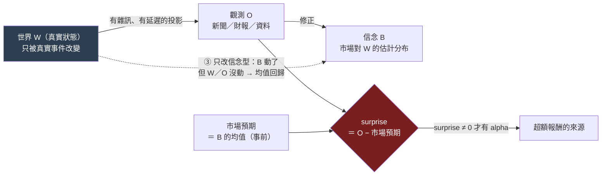

### 這一層系統已經有一半：world-signal 的 P（預期差）

要誠實對帳：surprise 這個概念，[[fw-world-signal|世界訊號]] 的 **P 欄（Pricing/Expectation）已經部分做出來了**——它的 `預期差 = 研究估計增量利益 − 市場隱含` 正是 surprise 的一個具體實例；九態狀態機裡 `CAPTURE_CONFIRMED_EXPECTATION_GAP`（有預期差＝甜蜜點）與 `CAPTURE_CONFIRMED_ALREADY_PRICED`（已定價＝ surprise 已耗盡）也正是「surprise 還在不在」的語言。所以這不是全新發明，是把既有的 P 欄升格成整套世界模型的骨架。

**缺的不是 surprise 的概念，是 W／O／B 的乾淨分離。** 現在的引擎沒有一個地方把「世界真實狀態 W」「我們的觀測 O」「市場信念 B」當成三個分開、有型別的物件來記帳——P 預期差是算出來的一個數，但它背後的 B（市場信念的完整分布、它從哪一版更新到哪一版、因哪份 O）沒有被獨立、可追溯地存下來。這正是 [[world-belief-contract|信念契約]] 要補的洞：把每一條信念 B 寫成可版本化、可對帳、可被 O 推翻的契約，讓「哪條信念、因哪份證據、從哪版更新到哪版」有逐欄的答案。exp-004 已經用真資料跑通一次（信念 B-H-003：86 筆對帳 27 命中 → 信心從 0.5 更新到 0.2256、判 REFUTE），見 [[exp-004-belief-contract|實驗 004]]。

這一層的信念更新迴圈，就是 [[three-loops|三迴圈]] 裡的**認知迴圈**（改世界模型，裁判＝預測校準／樣本外 log score／反證）；它跟決策迴圈（改策略）、元研究迴圈（改怎麼選問題）分開結算——避免第一版「只演化世界模型」把策略當可有可無投影的矯枉過正。owner 第二輪講得直接：策略不是投影，是「**世界信念進入現實約束後的決策政策**」，本身要被單獨演化與裁決。

## 修法：先重構目標，再薄縱切填一條真鏈

病灶 3 的修法不是「趕快把世界狀態表建出來」，那會掉進兩個坑：一是 architecture-first（先蓋空層、日後研究失敗無法歸因到哪層，見 [[discipline]] 第六條）；二是「用想像的邊餵傳播，比沒有邊還毒」（[[graph-knowledge]]第一鐵律）。正確順序是：

1. **敘事與目標先改（便宜且正確）**：把單一適應度（[[objective|進化目標]]的「子代 Sharpe 勝父代」）拆成 [[three-loops|三個分開裁決的迴圈]]——認知迴圈用預測校準／樣本外 log score 演化世界模型 B，決策迴圈用 beta 中性後增量演化策略，元研究迴圈用 `ResearchValue` 選題（取代會被鑽漏洞的「知識缺口收斂」）。這件事一行代碼不用動世界狀態表，就能收束 [[exp-002-ablation|實驗 002]] 提供的證據——**現行目標函數存在一條動能捷徑**（注意：這是「這個目標 × 這段樣本」的實驗證據，不是「所有策略演化必收斂到 beta」的全稱結論）。
2. **薄縱切填一條真鏈（不蓋 11 個空引擎）**：選 **ONE** 個世界狀態變數當起點（例如「台電強韌電網政策 → 重電設備需求」或「CoWoS 產能循環」），把 `世界狀態 → 知識子圖 → 假說 → PIT 驗證` 這條窄鏈**填滿真數據、每條邊帶證據錨點**，跑完一次前瞻驗證窗。這條薄鏈的知識展開見 [[knowledge-layer|知識層]]，機制傳導見 [[causal-layer|因果層]]，11 層為何不能一次蓋見 [[research-os|Research OS]]。

一句話收束：**世界模型的問題不是「沒做」，是「做成了佔位樣品、還擺在側邊」**。把它搬回根、先填實一條，比把十一層都畫成空圖有價值得多。

延伸閱讀：一則新聞如何展開成知識子圖 → [[knowledge-layer]]；世界事件如何沿機制傳導到股價 → [[causal-layer]]；為什麼進化目標本身錯了 → [[objective]]；九態世界訊號的完整設計與誠實邊界 → [[fw-world-signal]]；11 層重構為何要走薄縱切 → [[research-os]]。

---

<a name='knowledge-layer'></a>
# 〔knowledge-layer〕知識層：一則新聞展開成一張知識子圖

這一頁是 owner 深層批評的**病灶 2**。它問的是：當一則新聞進來，這台引擎把它變成了什麼？

> 一則新聞不該只被打成「正面／負面情緒」——那太淺，等於沒讀。一則新聞應該**展開成一張知識子圖**：`台電（發包方）→ 設備類別（重電/電網/變壓器）→ 受惠公司（華城/士電/中興電）→ 產品線 → 營收貢獻 → 歷史事件（2022 也發過標）→ 上游供應商（矽鋼片）→ 競爭者 → 歷史案例（上次決標後股價怎麼走）`。有了這張子圖，你才知道「這則新聞到底牽動了誰、透過什麼、以前發生過沒、可以拿什麼當代理」。這是把新聞當**世界模型的第二層**用，不是當情緒指標用。

知識層是 [[world-model|世界模型]]（病灶 3）往下走一步的具體化：世界狀態告訴你「世界現在是什麼」，知識層告訴你「這個事件在世界的關係網裡連到誰」。

## 認知答案與行動答案（先講結論）

- **認知答案**：知識子圖**已經有完整的設計語言、也真的建了一張圖表出來，但那張圖幾乎是平的**——374 條邊全部是同一種「這則事件講的是這檔股票」的一階關係，`台電 → 設備 → 公司 → 供應商 → 競爭者` 這種**多跳知識子圖，在真實資料裡不存在**。正式的世界模型邊表是 0 筆空帳。所以病灶 2 精確講不是「沒有知識層」，是「知識層退化成一張事件指向單一資產的星狀圖」。
- **行動答案**：不要一次把整張想像的供應鏈圖畫出來（[[graph-knowledge|圖鐵律]]：用想像的邊餵傳播比沒有邊還毒）。**選一條真鏈、逐邊帶證據錨點填深**——例如台電強韌電網那條，從發包方一路建到上游供應商與歷史案例，每一跳都指得回一則有逐字引文的新聞。填實一條，勝過畫十張空圖。

## 三態誠實對帳：知識子圖現在到底有多少邊

### 【已設計】哪些框架已經定義了「一則新聞→知識子圖」的語言

- [[fw-qual-engine|質化引擎]]的 **qual_edge** 沿 OCM（組織圖譜，全機最完整的「帶證據帶時效」二元邊實作）的 typed edge 形狀：`src / rel / dst / valid_from / valid_to / evidence / status / source`。每條邊必須指回帳裡的證據列（`evidence` 欄有 `CHECK`，非空 JSON 陣列，否則整條邊非法）。這正是「知識子圖的每條邊都要能溯源」的欄位級落地。
- [[graph-knowledge|四張圖]]定義了知識如何從 append-only 帳投影成可查詢的圖，第一鐵律「圖是帳的投影、不是第二真相源」保證圖不會長出想像的邊。
- **關係詞彙已存在**：MIEE（市場訊息演化引擎）的 `market_mapping.relation_type` 有 `subject / supplier / customer / peer`——這就是「事件→設備→公司→供應商→競爭者」多跳所需的邊型別詞彙。
- [[fw-qual-engine|敘事卡]]的「世界模型鏈」設計會沿 qual_edge 從 asset 節點**反向多跳走傳導路徑**，走不出就誠實回「尚無邊」——多跳查詢的機制本身已寫好。

### 【幾乎空殼】實際資料量（2026-07-22 查得，活管線會漂）

這是病灶 2 最刺眼的地方，數字攤開：

| 資料表 | 應該裝什麼 | 實際 | 意義 |
|---|---|---|---|
| AARO `qual_edge` | 事件↔公司↔供應鏈的多型別知識邊 | **374 筆，rel 全部是 `subject`** | 全是「這事件講的是這檔」，**零 supplier/customer/competitor 邊**——圖是平的星狀 |
| MIEE `market_mapping`（approved=1） | 人核過、可用的關係邊 | **374 筆全是 subject，supply_chain_distance 全 0** | 人核過的傳導邊＝**0**；唯一 1 筆 supplier 邊還沒核准 |
| mcm 正式 `edges` 表 | 提升為正典的因果/關係邊 | **0 筆** | 世界模型邊表是**空帳** |
| mcm `causal_observations` | 帶機制的因果觀察 | 108 筆（`company_role` 全空、單一 `proof_grade`） | 是**原始觀察料**，不是連成圖的邊 |
| mcm `nodes` | 知識圖節點 | 155 個 | 有節點、**沒有邊把它們連起來** |

翻成白話：**「一則新聞 → 台電 → 設備 → 華城 → 產品 → 營收 → 供應商 → 競爭者」這條子圖，在資料裡走不出第一跳**。qual_edge 的 374 條邊，每一條都只是「事件 e 指向資產 a」，沒有第二跳。[[fw-qual-engine|敘事卡]]首輪對 20 檔最新籃子出卡，只有 **1/20 有內容**（2408 南亞科 3 事件），其餘 19 檔的世界模型鏈都誠實顯示「尚無邊」。稀疏不是 bug，是 mcm 新聞只從 2026-07-07 起收、**真實歷史只有 15 天**的上游現實，加上多跳邊根本還沒被投影出來。

### 【擺錯位階】wiki 把研究記憶圖當主角、世界知識圖當延伸

- [[graph-knowledge|四張圖]]（定義／策略／證據／演化）講得很完整，但它們是**研究記憶側**——管實驗與策略的血統，不是 owner 病灶 2 講的世界知識子圖。
- owner 要的那張圖是**世界模型側**（實體關係／條件超圖／時間因果／決策狀態），它在 wiki 裡只出現在 [[lang-qual|質化語言]]的「第二層世界模型」一段，被描述成「只建圖不打分」的中間層，且落地狀態是三個誠實缺口（[[fw-qual-engine]]）。**最完整的圖是研究側，最空的圖是世界側**——而 owner 要當根用的，恰好是最空的那張。

## 一張圖看懂：設計 vs 真實

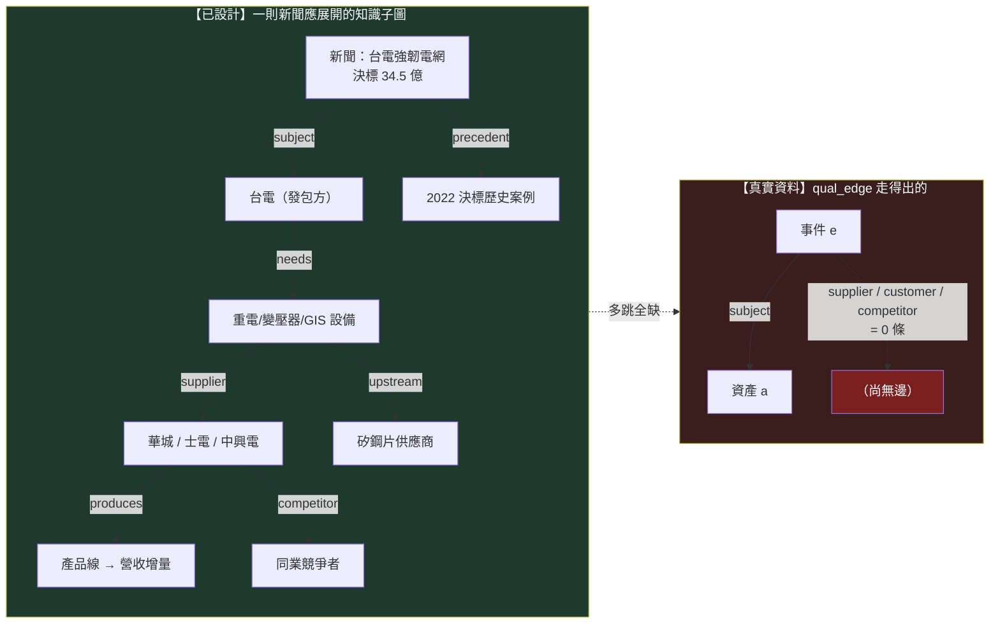

左邊是設計該長成的子圖（八類節點、五種關係、帶歷史案例）；右邊是資料庫真的走得出的——一條 subject 邊到底，剩下全是「尚無邊」。病灶 2 就是這張圖左右的落差。

## 修法：填深一條，不畫寬十條

知識層的正確補法，繼承 [[graph-knowledge|圖鐵律]]與 [[discipline|誠實紀律]]的薄縱切原則：

1. **選一條真鏈填深**：拿台電強韌電網（或 CoWoS）這一條，把 `subject / supplier / customer / competitor / precedent` 五種邊**逐條建出來**，每條邊 `evidence` 欄引用一則帶逐字錨點引文（≥8 字原文子字串，MIEE 反捏造閘）的新聞。目標是這一條鏈**能從新聞多跳走到上游供應商與歷史案例**，而不是 374 條 subject 邊再加一堆想像箭頭。
2. **邊靠證據落地、不靠 LLM 畫滿**：LLM 只能**提案**候選邊（進候選佇列），成邊要嘛純碼從帳投影、要嘛靠人核 approved（[[graph-knowledge]]第三鐵律）。目前 4,350 筆未核准的 distance-1 對映就是候選料——它們該經人核逐條轉正，不是直接當邊用。
3. **接回世界狀態與因果**：這條知識子圖不是孤立的，它上接 [[world-model|世界狀態]]（台電政策是能源/基建世界狀態的 delta），下接 [[causal-layer|因果層]]（設備需求 → 營收 → 預期 → 股價的機制傳導）。三層填的是同一條薄縱切。

一句話收束：**知識層有完整的邊語言、有反捏造的證據閘、有多跳查詢機制——唯獨沒有多跳的邊**。病灶 2 的解不是再蓋一套圖框架，是把已有的框架**灌進一條真實、帶證據、走得出多跳的鏈**。

延伸閱讀：知識邊的機制傳導（H20→GPU→HBM→股價）→ [[causal-layer]]；世界狀態當根 → [[world-model]]；qual_edge 的實作與三個缺口 → [[fw-qual-engine]]；圖為什麼是帳的投影 → [[graph-knowledge]]；為什麼不能一次蓋 11 層 → [[research-os]]。

---

<a name='causal-layer'></a>
# 〔causal-layer〕因果層：新聞→事件→供需→公司→財報→預期→價格

這一頁是 owner 深層批評的**病灶 5**。如果 [[knowledge-layer|知識層]]（病灶 2）問「一則新聞連到誰」，因果層問的是更硬的一題：**這則新聞為什麼會讓那檔股票漲——經過哪些機制、哪一步傳到財報、市場的預期在哪一步落後？**

> 一條完整的投資因果鏈長這樣：`新聞 → 事件 → 供需變化 → 公司 → 財報 → 市場預期 → 價格`。舉一個真的例子：`H20 解禁 → 中國可買 GPU → GPU 出貨拉升 → HBM（高頻寬記憶體）需求增 → SK 海力士產能吃緊 → 台灣供應鏈受惠 → ABF 載板需求增 → 欣興營收預期上修 → 股價反應`。每一個箭頭都是一個**機制（mechanism）**——需求活化、供給受限、成本轉嫁、毛利擴張、預期修正。找到 Alpha，本質是找到「某條機制鏈上，市場的預期還沒追上基本面」的那個時點。

因果層是三頁世界模型重構的收束：[[world-model|世界狀態]]是根、[[knowledge-layer|知識子圖]]是關係網、**因果層是關係網上帶方向與機制的傳導**。

## 認知答案與行動答案（先講結論）

- **認知答案**：機制鏈的**詞彙已經設計得相當完整**（mcm 9 個 `M_*`、世界訊號 30 個 `M_*`、世界訊號的 T 傳導欄），**但那些機制目前是一顆顆孤立的觀察，沒有被串成鏈**。`H20 → GPU → HBM → SK → 台灣 → ABF → 欣興 → 股價` 這種多跳因果鏈，在資料裡一步都走不通——正式因果邊表 0 筆、機制觀察 108 筆全是孤立的兩點對、兩套機制詞彙只有 1 個對得上。
- **行動答案**：因果層的補法和進化目標綁死。**目前引擎優化的是策略級指標（子代 Sharpe 勝父代），這個目標會讓系統反覆重新發現動能 beta、而不是學到任何一條因果機制**——這正是 [[exp-002-ablation|實驗 002]] 親手顯示的。所以因果層的真正修法，是把進化目標從「策略績效」換成「**一條機制鏈的可反證預測力**」：填實 ONE 條鏈、預註冊它的前瞻驗證窗、看它事後對不對。詳見 [[objective|進化目標]]。

## 核心證據串接：為什麼「優化 Sharpe」永遠學不到因果

這是本頁最重要的一段，把 owner 的病灶 5 和我們自己的實驗接在一起。

[[exp-002-ablation|實驗 002]] 做了一件事：對引擎自己生出的漂亮候選 C（月營收 × 250 日價格強勢，CAGR 33%）跑乾淨的 2×2 消融，問「這是真綜效，還是兩個因子相加」。純碼裁決是 **`conflicting`**——證據硬到不留情面：

- 純動能自己的 Sharpe 就已經 **1.52**，和「營收＋強勢」的 1.52 **一模一樣**；
- 把強勢加到營收股上的增益（+13.0pp），和加到隨便一個基準上的增益（+12.3pp）**幾乎一樣大**——強勢的貢獻與有沒有做營收選股**無關**。

**這對因果層的意義**：當你把進化目標設成「子代績效贏父代」，搜尋空間裡最容易撿到的、最穩定付錢的東西，就是**動能 beta**（在多頭樣本裡動能就是會漲）。[[exp-003-graph-evolution|實驗 003]] 放手讓迴圈自主追報酬，它就一路走進更純的動能暴露（某代 Sharpe 衝到 2.06）。系統不是在學「H20 解禁如何透過 HBM 傳導到欣興」這種因果機制，它是在**一遍遍重新發現「漲的會繼續漲」**。**優化策略級指標 → 找到 beta；要學到因果 → 必須把目標換成機制鏈的可反證預測力、知識缺口的收斂**。因果層空、和進化目標錯，是同一個病的兩面。

## 三態誠實對帳：機制鏈現在到底連通到什麼程度

### 【已設計】哪些框架已經定義了機制傳導的語言

- **機制詞彙 M_\* 兩套都在**：mcm（股市新聞管線）有 9 個——`M_DEMAND_ACTIVATION`（需求活化）／`M_SUPPLY_CONSTRAINT`（供給受限）／`M_COST_PRESSURE`（成本壓力）／`M_MARGIN_EXPANSION`（毛利擴張）／`M_MARGIN_COMPRESSION`／`M_VALUE_TRANSFER`（價值轉移）／`M_CAPITAL_ROTATION`（資金輪動）／`M_EXPECTATION_CONFIRMATION`／`M_EXPECTATION_CONTRADICTION`；[[fw-world-signal|世界訊號]]有約 30 個（`M_CAPACITY_CONSTRAINT`／`M_ASP_INCREASE`／`M_EXPECTATION_GAP`／`M_EARNINGS_REVISION`…），分需求/供給/價格/競爭/財務/認知六族。
- **傳導欄已設計**：世界訊號的 **T（Transmission）欄**專門記「利益如何進入財報」——增量營收/毛利/營業利益/現金流橋接；**P（Pricing）欄**記「市場預期落後多少」＝預期差。這正是 `供需 → 財報 → 預期` 那三步的語言。
- **因果觀察表已存在**：mcm `causal_observations` 有 `source_entity → target_entity`、`mechanism_id`、`input_state / output_state`、`evidence_text`、`known_at`——一條機制邊該有的欄位都在。

### 【幾乎空殼】機制鏈的實際連通度（2026-07-22 查得）

| 資料表/資產 | 應該裝什麼 | 實際 | 意義 |
|---|---|---|---|
| mcm `causal_observations` | 串成鏈的因果邊 | **108 筆孤立兩點對**（`company_role` 全空、單一 `proof_grade=mapped_v1`） | 每筆是「A —機制→ B」的**孤立 dyad**，沒有 B 再接 C——**多跳鏈不存在** |
| mcm 正式 `edges` 表 | 提升為正典的因果邊 | **0 筆** | 因果圖是**空帳**；108 筆觀察沒有一筆被提升成正典邊 |
| 機制詞彙對映 | mcm M_\* ↔ 世界訊號 M_\* | **僅 1 個 exact**（`M_MARGIN_EXPANSION`），3 個 proposed 待人核 | 兩套機制語言**幾乎沒對上**，擴鏈前分岔 |
| 供應鏈拓撲 | 多階「誰供給誰、距幾階」 | MIEE 全庫 **supplier 邊僅 1 筆、還沒核准**；approved 邊 supply_chain_distance 全 0 | 供應鏈**只有一階、且是空的**——`SK → 台灣 → ABF → 欣興` 這種跨階傳導拓撲不存在 |

翻成白話：`H20 解禁 → GPU → HBM → SK → 台灣供應鏈 → ABF → 欣興 → 股價` 這條八跳鏈，資料庫裡**一跳都串不起來**。有的是 108 顆散落的「某因 → 某果」觀察料，彼此不相連；正式的因果邊表是 0；連把兩套機制詞彙對齊都還沒做完。機制鏈是設計出來的語言，不是跑得通的圖。

### 【擺錯位階】因果傳導被排到語言棧最後

- owner 病灶 5 的因果鏈（`新聞 → … → 價格`）是他心中投資邏輯的**主軸**；但在 wiki 裡，機制傳導是 [[fw-world-signal|世界訊號]]的一個欄位（T/P），而世界訊號本身被歸戶為「**P1 後才進場**」（Gen5 regime 門控才需要）——排在特徵代數、持有期之後。
- 進化迴圈變異的是**策略基因**、裁決的是**策略績效**（[[method-evolution-loop]]），因果機制從來不是被優化的對象。因果層被當成「事後用來解釋策略為什麼有效」的裝飾，不是「被系統主動學習、驗證、演化」的根。這就是病灶 5 與病灶 6（[[objective|目標錯了]]）是同一件事的原因。

## 一張圖看懂：設計的因果鏈 vs 真實的孤立觀察

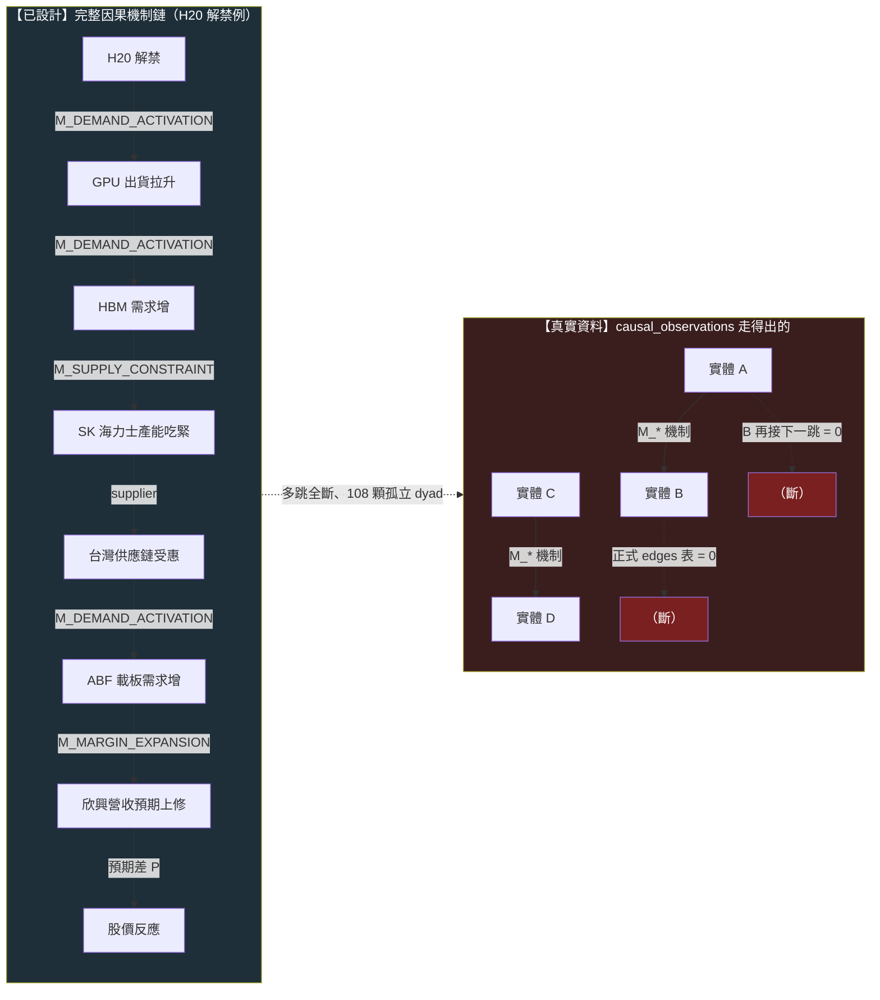

左邊是設計該連通的八跳機制鏈，每跳掛一個 `M_*` 機制；右邊是資料真的有的——一堆兩點對，接不到第三點，正式邊表空。

## 修法：把因果鏈當進化目標，先填實一條

因果層的補法與 [[objective|進化目標]]的重構是同一步：

1. **換目標**：進化迴圈的適應度**加動能懲罰**（三份報告共同的 P0 行動），並把「勝出」的定義從「子代 Sharpe 高」改成「一條機制鏈的前瞻預測被市場證實」。沒有這步，[[exp-002-ablation|實驗 002]]／[[exp-003-graph-evolution|實驗 003]]的病會一直復發：優化績效永遠通向 beta。
2. **填實一條鏈、預註冊驗證窗**：選 ONE 條真鏈（H20/HBM 供應鏈或台電重電），把每一跳建成一條 `causal_observations` 帶機制與證據錨點的邊，**逐跳串連**（B 的 target 是 C 的 source），提升進正式 edges 表；再對鏈尾預註冊一個前瞻假說（沿 MIEE hypothesis 預註冊凍結：判準凍結、到期對帳），看它事後對不對。這就是 [[fw-temporal|時間層]]說的「進化目標的最終形態＝帶完整時間約束的時態因果模式」。
3. **先對齊機制詞彙**：擴鏈前把 mcm 的 9 個 `M_*` 與世界訊號的 30 個 `M_*` 建對映表（目前只 1 個 exact），否則兩套機制語言分岔、鏈接不起來。
4. **走薄縱切、不蓋 11 層**：因果層不獨立擴建，它是 [[world-model|世界]] → [[knowledge-layer|知識]] → 因果 → [[hypothesis-engine|假說]] 那條薄縱切的一段；為什麼不能一次把 [[research-os|Research OS 11 層]]都蓋出來，見 [[discipline|誠實紀律]]的 architecture-first 警告。

一句話收束：**因果層有機制詞彙、有傳導欄、有觀察表——唯獨沒有把觀察串成鏈的邊，也沒有一個會獎勵「學到因果」的目標**。實驗 002 已經證明：只要目標還是策略績效，這台引擎就只會一次次撿回動能 beta，永遠學不到 `H20 → HBM → 欣興` 那條鏈。

延伸閱讀：為什麼進化目標本身要重寫 → [[objective]]；一則新聞的知識子圖 → [[knowledge-layer]]；世界狀態當根 → [[world-model]]；消融如何拆穿動能 beta → [[exp-002-ablation]]；帶時間約束的時態因果模式 → [[fw-temporal]]；機制詞彙的兩套對映缺口 → [[fw-qual-engine]]。

---

<a name='research-loop'></a>
# 〔research-loop〕研究迴圈：W/O/B/P 分離，主線繞著現任冠軍轉

這一頁畫整套系統**真正的主軸**，它疊了兩層修正。**第二輪批評**修位階：真實世界 W 永遠不被我們更新，被更新的只有信念 B——W（世界）／O（觀測）／B（信念）／P（策略）必須乾淨分離。**第三輪批評**修主線：就算 W/O/B/P 分乾淨了，先前的迴圈仍然**斷成兩段**——一段是 owner 真錢在跑的最強策略 king2（wiki 幾乎不談），一段是信念契約支線（[[exp-004-belief-contract|實驗 004]] 結算的兩條 MIEE 事件信念，跟任何真實決策無關）。認知迴圈自轉得再誠實，不接到「冠軍該不該改」就只是旁觀。**修法＝把主線釘在現任冠軍上：凍結冠軍 → 決策殘差 → 世界假說 → 預註冊 → 挑戰者 → 樣本外對決 → 晉升，整條環繞著「當前已知最好的決策政策」轉。**

> **認知答案**：研究迴圈的骨架仍是四物件分離——**W 真實世界**（自己演化、不被我們碰）、**O 觀測**（帶雜訊、不完整、延遲的讀數）、**B 信念**（一切被證據更新的都是它）、**P 策略**（信念穿過現實約束後的決策政策）。第三輪補上的是：P 不是一團流動的候選，**P 有一個被凍結的現任冠軍 P\***（king2），它是所有 Δ 的分母；認知迴圈（O→B→H→E→回B）的**輸入端從冠軍殘差長出**（冠軍上次錯在哪＝天然決策相關的未知），**輸出端以挑戰者對決收口**（confirmed 信念 → C/E 臂 → 樣本外對決 → 晉升追加新列）。
>
> **行動答案**：判斷任何工作屬於哪一段，先問它動的是 W、O、B、H、E、P，再問它在冠軍挑戰環的哪一步。**投資賺的仍是 surprise ＝ 新觀測 − 市場預期**，已定價的部分賺不到。目前冠軍挑戰環真的完成的是凍結（`champion_registry` id=2）、殘差（5,409 列）與預註冊（[[exp-005-king2-prereg|實驗 005]] REGISTERED）；**假說尚未從殘差長出、零臂已跑、零次對決**。exp-004 在這張圖上的正確位置是**支線**：它驗證了 settle 機件真的 fail-closed，但它的信念不來自冠軍殘差——機件是主線要用的，內容不是主線的。

## 一、主線全圖：W/O/B/P 骨架 × 冠軍挑戰環

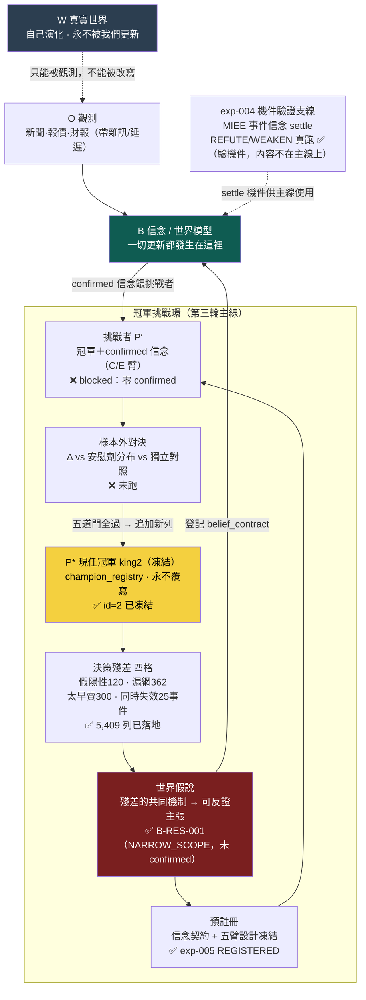

讀圖三個要點：**①更新箭頭全部收在 B 上**——世界只有那條虛線的「被觀測」，沒有任何「被更新」；**②冠軍挑戰環是 P 層的正確形狀**——策略不是一團互相覆寫的候選，是「一個凍結在位者＋排隊的挑戰者」，晉升＝追加新列，歷史分母永存；**③exp-004 掛在環外**——它是機件驗證支線，證明 settle 真的 fail-closed（該推翻的推翻），主線之後長出的殘差假說要走的就是這套機件，但它自己的兩條信念（MIEE 漲價事件）不在冠軍的決策鏈上。

## 二、四個物件為什麼要分開：W ≠ O ≠ B ≠ P（第二輪，仍然成立）

| 物件 | 是什麼 | 誰會改變它 | 分不清會犯的錯 |
|---|---|---|---|
| **W 真實世界** | 利率、產能、供需、資金流的客觀狀態 | **只有 W 自己**；研究碰不到它 | 以為「研究成立＝改寫了世界」 |
| **O 觀測** | 對 W 的一次讀數：新聞、報價、財報 | 由 W 產生，帶雜訊、不完整、延遲 | 把 O 當 W：新聞說了就當世界如此 |
| **B 信念** | 內部對 W 的最佳估計（機制、因果邊、信心版本） | **只有證據**：新觀測、到期對帳 | 把 B 當 W：對自己的地圖過度自信 |
| **P 策略** | B 穿過成本／beta／風險約束後的決策政策 | 決策迴圈；**在位者 P\* 只能被晉升取代、不能被覆寫** | 把 P 當 B 的免費投影；或讓 P 被悄悄改動、失去分母 |

W 是地形，O 是會糊掉的照片，B 是你畫的地圖，P 是你據地圖規劃的路線——第三輪多釘一句：**路線裡有一條是你此刻真的在走的（P\*），研究的第一優先是搞懂這條路線上次在哪裡跌倒。**

同一則新聞仍是三種不同的東西（改變世界／揭露既有狀態／只改市場信念），你能賺的仍然只有 **surprise ＝ 新觀測 O − 市場預期 E_market[O]**——這兩節的完整展開見 [[world-model|世界模型]]，此處不重複。冠軍殘差正是 surprise 邏輯在決策層的鏡像：**殘差＝冠軍的實際決策結果 − 冠軍規則的隱含預期**，殘差最大的地方，就是冠軍的世界模型跟真實世界差得最遠的地方。

## 三、三迴圈疊在冠軍環上：各自的裁判不變，輸入輸出被接上了

[[three-loops|三個迴圈]]（認知／決策／元研究，各自裁判、永不混用）在第三輪沒有被推翻，而是**被接上了頭尾**：

| 迴圈 | 第二輪的樣子 | 第三輪接上冠軍環之後 |
|---|---|---|
| 元研究（選題） | ResearchValue 排序抽象未知——分子自估可 game | **殘差優先**：選題從冠軍殘差四格長出，決策相關性是歷史事實不是自估；ResearchValue 退為殘差外補充（見 [[hypothesis-engine]]） |
| 認知（改信念） | 信念契約 settle——但信念內容與真實決策無關 | 殘差假說登記 belief_contract、前瞻對帳；**第一條 REINFORCE 就是 C 臂的解鎖鑰匙**——裁判仍是校準與反證，一字未變 |
| 決策（改策略） | 回測十閘裁決候選——但「更好」對誰比不明確 | **一切 Δ 以凍結冠軍為分母**；晉升要過五道門（樣本外增量、勝安慰劑分布、勝獨立對照、守門欄、人核）——裁判仍是 beta 中性後增量，但分母與門檻被制度化（見 [[exp-005-king2-prereg]]） |

## 四、逐節點誠實對帳：現在真的有資料在流嗎（2026-07-22）

| 節點 | 承載 | 現況 |
|---|---|---|
| **O 觀測** | [[fw-qual-engine|MIEE eventize]]（mcm 唯讀上游） | 有雛形：613 顆事件；新聞真歷史**僅 15 天** |
| **B 信念** | [[knowledge-layer]]／[[causal-layer]]／[[world-belief-contract|信念契約]] | 幾乎空殼：因果 edges 0 筆、信念僅 2 條真跑（皆負向：REFUTE／WEAKEN）、**confirmed＝0** |
| **H 假說** | [[hypothesis-engine|假說引擎]] | MIEE 有 3,412 筆前瞻預測帳；**從冠軍殘差長出的世界假說＝0 條** |
| **P\* 冠軍** | [[champion-challenger|champion_registry]] | ✅ **已凍結**（id=2，append-only 實打過，sha256 釘死） |
| **殘差** | `king2_residuals_dataset.parquet` | ✅ **已落地**：100 事件、5,409 列、四類計數＋具名案例（描述性分位口徑） |
| **預註冊** | [[exp-005-king2-prereg|實驗 005]] | ✅ REGISTERED：五臂＋五道門判準凍結、機件考卷 12/12；**零臂已跑** |
| **挑戰者／對決／晉升** | exp-005 C/E 臂→G1–G5 | ❌ C 臂 blocked（零 confirmed）、零對決、零晉升 |
| **E 對帳機件** | [[world-belief-contract|信念 settle]]／[[method-gates|十閘]] | 機件已由 exp-004 驗證 fail-closed；策略側 walk-forward 仍一輪未跑 |

一眼看懂：**冠軍環的地基三步（凍結、殘差、預註冊）是真的，中段（假說→confirmed→對決）整段是空的。** 這跟前兩輪「決策迴圈中段最肥、認知迴圈幾乎空」的診斷一致——第三輪沒有讓資料變多，它做的是把兩段敘事**接到同一條環上**，讓每個空格都有明確的下一步：下一步永遠是「從殘差長出第一條假說、settle 它」。

## 五、exp-004 的正確定位：機件驗證支線，不是主線第一格

前一版把 exp-004 稱為「分水嶺」，第三輪把這個定位修得更準：**它是認知迴圈的機件驗證支線。** 它證明的東西很真也很重要——信念可以預註冊、到期由純碼對帳、該推翻的真的被推翻（B-H-003 REFUTE 0.5→0.2256）、該削弱的只被削弱（B-H-001 WEAKEN 0.5→0.3913）、append-only 擋得住竄改。**主線之後的每一條殘差假說，走的都是這套機件。**但它不是主線本身：它的兩條信念來自 MIEE 漲價事件庫，不來自冠軍的任何一次決策；它們被推翻或削弱，冠軍一根汗毛都不會動。把「機件驗證成功」讀成「認知迴圈已接上決策」，正是第三輪批評點名的錯讀——機件是通用的，主線要的是**內容**（殘差長出的假說）流過這套機件。

## 六、誠實邊界（不得省略）

- **冠軍環七步只有①②④完成**（凍結、殘差、預註冊）；假說 0 條、confirmed 0 條、零臂已跑、零對決、零晉升。**不存在任何「世界信念已改善 king2」的證據**——那個命題目前連受試資格（C 臂解鎖）都還沒有。
- **殘差是描述性分位口徑**（p10／p90／p75），是研究線索的集合，不是因果結論。
- **認知側資料仍極薄**：新聞史 15 天、因果 edges 0 筆、世界狀態無逐日表——冠軍環給了認知側「該研究什麼」的準星，沒有變出資料。
- **冠軍是研究帳上的鏡像**，與真錢線有 9 條已知差異（記錄於 `engine/out/king2_residuals.json`）；真錢線對本研究帳唯讀，環上任何動詞都不自動觸及真錢。
- **策略側 walk-forward 仍未跑過**；exp-005 的 A 臂復算（Dev＋Val）會是第一次，官方口徑快照在那之前只是照抄。

一句話收束：**W/O/B/P 分離告訴你「什麼被更新」；冠軍挑戰環告訴你「繞著什麼更新」。** 前者第二輪修好了，後者第三輪剛把地基釘完——凍結的冠軍、落地的殘差、凍死的預註冊。下一步不是蓋更多環節，是讓第一條殘差假說真的走完「登記→對帳」，看它是成為第一把 C 臂鑰匙，還是誠實地死在 settle 上。

延伸：冠軍制度與殘差四格全貌見 [[champion-challenger|現任冠軍制度]]；五臂與晉升五道門見 [[exp-005-king2-prereg|實驗 005]]；殘差怎麼長成假說見 [[hypothesis-engine|假說引擎]]；settle 機件的真跑證據見 [[exp-004-belief-contract|實驗 004]] 與 [[world-belief-contract|信念契約]]；W/O/B 與 surprise 的完整論證見 [[world-model|世界模型]]；三迴圈裁判見 [[three-loops|三個迴圈]]；十一層架構與薄縱切紀律見 [[research-os|研究作業系統]]。

---

<a name='hypothesis-engine'></a>
# 〔hypothesis-engine〕假說引擎：研究問題從冠軍的殘差長出來

## 一句話：選題標準演化了三輪，終點是「殘差優先」

自動研究最容易長歪的地方，不是不會算，是**問錯了第一個問題**。這一頁的「第一個問題」已經被 owner 的三輪批評連續改寫，三個版本擺在一起看最清楚：

| 版本 | 第一個問題 | 死穴 |
|---|---|---|
| 第一輪 | 「今天**最大的知識缺口**是什麼？去收斂它」 | 會被鑽漏洞：製造容易收斂的假缺口再關掉它們，帳面漂亮、真未知一格沒動 |
| 第二輪 | 「**ResearchValue** 最高的未知是什麼？」（不確定×決策相關×可辨識×資訊增益÷成本時間） | 更好的排序啟發式，但分子三項全是**引擎自估**——DecisionRelevance 可以吹、Identifiability 可以吹、InfoGain 可以吹 |
| **第三輪（現行）** | 「**現任冠軍上一次真實決策，錯在哪裡？**」——從 [[champion-challenger|冠軍殘差四格]] 長出假說 | 殘差有限、只照亮冠軍附近的未知（見第四節誠實邊界）——所以 ResearchValue 退為**殘差之外**的補充選題器 |

第三輪的關鍵洞見：**殘差自帶 DecisionRelevance，不需要任何人打分。** 「2609 陽明在候選池排 43 落選、隨後超額 +128.2%」——這個問題值不值得研究，不用引擎自估「這攸關重大決策」，因為它**就是**一筆真實漏掉的錢。第二輪 ResearchValue 想用公式逼出來的性質（決策相關、可辨識、有資訊增益），殘差天然全有：它掛在一筆具體決策上（相關）、有明確的事前候選池與事後報酬（可辨識）、而冠軍還在場上每月做同型決策（解開就能用）。抽象的「最大未知」要靠自估撐腰；**具體的「上次做錯的事」自己就站得住。**

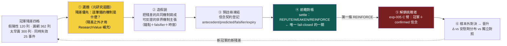

黃色那格（選題）決定研究**往哪裡花力氣**，現在由殘差餵；綠色那格（對帳）決定**帳能不能作假**，仍然是全迴圈唯一無法被自估膨脹的關卡；紅色那格（挑戰者）目前 blocked——帳上零條 confirmed 信念，見 [[exp-005-king2-prereg|實驗 005]]。

## 一、殘差四格怎麼長出假說：三個真案例走一遍

殘差不是抽象分類，是 5,409 列帶名字、帶日期、帶報酬的資料（口徑與計數見 [[champion-challenger|現任冠軍制度]]）。從殘差到假說的動作是：**找一格裡的重複形狀，把它寫成一條可反證的世界機制主張**。用三個已入帳的最重案例示範這條路怎麼走（以下「候選假說」是**示意方向，帳上尚未登記任何一條**）：

- **漏網（落選後大漲）→ 世界層假說。** 2609 陽明 2020-12-10 事件：score 只 0.649、池排 43 落選，隨後 +133.6%（航運超級週期）。這格的共同形狀若是「產業級供需反轉初期，個股月營收動能還沒跟上、但世界層事件已經確認」，候選假說就是一條世界機制主張：「當 X 型產業事件（運價／報價連續上行 N 週）確認時，該產業內營收動能排名偏低的成員在其後 M 週有正超額」——帶事前可查的錨點、帶 falsifier、可登記進 [[world-belief-contract|信念契約]] 做前瞻對帳。
- **假陽性（入選後大跌）→ 失效前兆假說。** 3147 於 2026-06-10 以池內第 3 名入選，隨後超額 −35.5%。若這格的共同形狀是「高分入選但某類世界層負訊號已出現」，候選假說就是「入選當下存在 Y 訊號者，主窗超額顯著低於無訊號組」——這正是 exp-005 **E 臂**（信念控曝險、不改選股）想吃的錢。
- **太早賣 → 持有層假說。** 1785 光洋科入選賺 +12.5% 出清後又漲 +41.4%。這格屬 [[fw-holding-lifecycle|持有期生命週期]] 的地盤：假說形如「出清時 Z 條件成立者，下輪進場前仍有正殘餘 Alpha」——退出規則的研究從此有了真資料的靶。

另有一條**已浮出但尚未成形**的線索：25 個「同時失效」事件裡只有 2 個發生在弱盤——集體失效集中在**盤面健康時**，代表 regime 覆蓋層已經接住弱盤，殘差指向健康盤的選股機制本身。這是目前最值得長出第一條假說的方向。

## 二、ResearchValue 退位：殘差之外的補充選題器

第二輪的 ResearchValue 公式沒有被丟掉，但位階變了——**從主選題器退為補充選題器**：

```
                 Uncertainty × DecisionRelevance × Identifiability × ExpectedInfoGain
ResearchValue ＝ ────────────────────────────────────────────────────────────────
                                      Cost × Time
```

它現在只管**殘差照不到的地方**：冠軍完全沒碰的錢（[[champion-challenger|冠軍四分支]]的「新策略」支）、與冠軍低相關的新研究線、基礎設施型問題（資料品質、口徑）。理由有二：

- **殘差優先勝在真值錨定。** ResearchValue 的分子三項全是自估、可被灌水；殘差的決策相關性是歷史事實。兩者都在手上時，永遠先用不會說謊的那個。
- **但殘差有照明範圍限制。** 殘差只照亮「冠軍附近」的未知——它會告訴你 king2 哪裡錯，不會告訴你「有一整類 king2 根本沒參與的機會存在」。全靠殘差選題，研究會收斂成「把冠軍修得更好」的局部搜索。所以殘差之外，仍需要一個排序啟發式，ResearchValue 是目前最好的候選——**用的時候要記得它可被 game，別把它當真值分數。**

## 三、真正的防線仍是信念到期對帳（fail-closed 錨）

選題標準換了三輪，這一條從第二輪起就沒變、也不該變：**無論問題怎麼選出來，最後都要落成一條預註冊、會到期、被真 outcome 打分的信念——settle 是整條迴圈唯一無法被自估膨脹的關卡。** 你可以把一格殘差的重要性講得天花亂墜，但你騙不了 settle：市場到期時要嘛付了錢、要嘛沒付，Wilson 下界是純碼算的，LLM 一個字都進不了裁決。

機件已被 [[exp-004-belief-contract|實驗 004]] 用真資料驗證：B-H-003 事前凍結靶（antecedent／predicted／falsifier／主窗 5 日、先驗 0.5），到期 86 筆對帳僅 27 命中、平均超額 −0.76%，兩條否證子句齊發，純碼判 REFUTE、信心 0.5 → 0.2256；同機制的 B-H-001 只發一條否證，判 WEAKEN、0.5 → 0.3913。**該推翻的推翻、該削弱的削弱，規則靠證據自己分流**——這就是殘差長出的假說未來要走的同一條對帳路。在冠軍制度裡它還多了一重意義：**第一條撐過對帳的 REINFORCE（confirmed）信念，就是解鎖 exp-005 C 臂的鑰匙**——挑戰者的資格不由任何人核發，由 settle 核發。

## 四、誠實對帳：機件現況（2026-07-22，讀 `data/aaro.sqlite`）

| 元件 | 狀態 | 事實 |
|---|---|---|
| `research_gap` 缺口表＋`next_agenda()` 純碼排序 | 【已設計・在用】 | schema 齊全、`priority DESC` 純碼排——紀律對，但排的還是策略調參題 |
| `closed_frontier` 死方向帳 | 【已設計・在用】 | 負結果同權入帳、查重閘擋重撞 |
| 冠軍殘差資料集 | 【已落地】 | 100 事件 5,409 列、四類計數齊、具名案例入 `king2_residuals.json` |
| **殘差 → 假說** | 【**1 條**（B-RES-001）】 | exp-007 已從落選殘差長出第一條世界假說並 settle＝`NARROW_SCOPE`；**未 confirmed**，見 [[exp-007-residual-belief]] |
| 信念契約 settle 機件 | 【已驗證】 | exp-004 兩條真 settle（REFUTE／WEAKEN）＋exp-007 一條（NARROW_SCOPE）；**confirmed＝0，C 臂因此 blocked** |
| ResearchValue 評分器 | 【未實作】 | 仍是設計；現行排序是單一 `priority` 欄 |

把帳上所有 `status='open'` 的缺口攤出來，它們**全部**仍是策略／因子層問題（`king_ablation`、`king_aaro_addon`、`lineage_R015`、`lineage_R011`）。第三輪重構之後，這張缺口帳的**正確餵法**已經確定——從殘差四格長題——但**餵的動作還沒發生**。

## 五、薄縱切已跨出：第一條殘差假說已 settle，下一步是「無人選題」

原本這一節的紅線是「別急著蓋自動選題引擎，先人工長出第一條殘差假說跑到 settle」——**那一刀已經砍完了**：exp-007 從落選殘差手工長出 B-RES-001，走完「殘差→假說→預註冊→對帳」，settle＝`NARROW_SCOPE`（見 [[exp-007-residual-belief]]）。這證明了鏈路可通、且系統有權拒絕自己的弱訊號。

但那一輪的關鍵研究跳躍（挑陽明、讀成航運超級週期、判缺產業需求、選 `IND_REVYOY_MED`、定 HIGH/LOW 切法、寫假說與否證條件）**全是人／LLM 做的**，純碼只在這些選擇之後接手結算。`wm/search_ledger.py` 因此把這一輪誠實記為 `autonomous=0`。真正的下一步不是再手工長 exp-008，而是**無人選題測試**：給系統凍結冠軍＋殘差集＋資料目錄＋特徵 DSL＋實驗預算＋**不可讀取的金庫**，讓它自己從殘差選出重複錯誤形狀、生 ≥3 競爭機制、查圖去重、列資料需求、選一條可辨識假說、生特徵與負對照、在看不到 HOLDOUT 前預註冊、純碼結算、據結果自己決定下一題，連跑數輪。通過條件不是每輪都找到 Alpha，而是**沒有人替它選題，它仍能自己提出合法問題、自己接受失敗、再決定下一步**。金庫（`wm/vault.py`）與搜尋帳（`wm/search_ledger.py`）就是為了讓這種反覆搜尋不會作弊而先建的兩件基礎。

## 六、誠實邊界（不得省略）

- **「殘差優先」已從宣告變成跑過一次的管線，但只跑過一次、且非自主。** 帳上現有 **1 條**從殘差長出的假說（B-RES-001）登記進信念契約並 settle（`NARROW_SCOPE`）；但它是人工選題（`search_ledger` 記 `autonomous=0`），且 `confirmed＝0`。本頁第一節的其餘候選假說仍是**示意方向**，不是已登記的主張。
- **殘差分類是描述性分位口徑**（p10／p90／p75），移動門檻計數就變；一列殘差＝一個值得研究的錯，不＝一個已定位的 bug。
- **殘差只照亮冠軍附近。** 全靠殘差選題會退化成局部搜索，這是 ResearchValue 保留為補充選題器的理由；但 ResearchValue 分子自估可 game 的老問題也原封不動地保留著——它是啟發式，不是真值。
- **殘差長出的假說可能全軍覆沒。** 第一批假說全被 REFUTE、C 臂長期 blocked，是完全合法的結局；一條 REFUTE 掉的信念本身就是知識（如 B-H-003），不保證換得到 Alpha。能跑 ≠ 有效。
- **「機制」一詞在兩層意思不同**：現行提案器 `gaps.py` 的「機制軸」指技術指標的 X 轉換（強勢怎麼算），本頁的「世界機制」指供需／傳導那一層。讀舊碼時別混淆。

延伸：冠軍制度、五角色與殘差四格全貌見 [[champion-challenger|現任冠軍制度]]；五臂預註冊與 C 臂 blocked 見 [[exp-005-king2-prereg|實驗 005]]；settle 機件與 B-H-003 全案見 [[world-belief-contract|信念契約]] 與 [[exp-004-belief-contract|實驗 004]]；主線全圖見 [[research-loop|研究迴圈]]；三迴圈各自的裁判見 [[three-loops|三個迴圈]]；現行提案器四軸枚舉的純碼細節見 [[method-evolution-loop|進化迴圈]]。

---

<a name='autonomous-research'></a>
# 〔autonomous-research〕自主研究：無人選題迴圈與兩件防作弊基礎

到 [[exp-007-residual-belief|exp-007]] 為止，這台引擎會「自動判卷」——預註冊、純碼結算、負結果入帳都成熟了——但還不會「自己出題」。exp-007 的關鍵研究跳躍（從殘差挑出陽明、讀成航運超級週期、判缺產業需求、選特徵、定切法、寫假說與否證條件）全是人／LLM 做的，純碼只在這些選擇之後接手。搜尋帳因此把那一輪誠實記為 `autonomous=0`。

這一頁記錄把「選題／機制／資料搜尋／下一議程」真正接進 agent 閉環的第一步，以及它必須先站在的兩塊地基：**不可偷看的資料金庫**與**全域搜尋帳**。沒有這兩塊，一個會自己反覆搜尋的系統只會越勤勞、越容易挖到假 Alpha。

<!--STATE-->
> **現況快照（自 `aaro.sqlite` 真相帳投影，非手寫；由 `wm/state_projector.py` 於 build 時注入）**
>
> - 編號實驗：**8 個**（000–007，每個都指回帳本證據）
> - 信念契約：**6 條**＝策展 3＋自主示範 3；從冠軍殘差長出的世界假說 **1 條** → B-RES-001（NARROW_SCOPE，信心 0.445182）
> - 已 confirmed（REINFORCE 過基準且來自 SEALED 段）：**0 條（C 臂維持 blocked）**
> - 預註冊凍結：**8 份**（H-DEV2、EXP-005、AUTO-AR-1-C-normal-revH-chipL、AUTO-AR-2-C-normal-revM-chipL、AUTO-AR-3-C-normal-revL-chipL、OPEN-3fe5914572bb10d4、CONFIRM-bb482590fefecfe9、EXP-007）
> - C 臂狀態：**blocked**（需一條 confirmed 信念才解鎖）
> - 金庫可授 confirmed 的 SEALED 段：**1 個** → LIVE_FORWARD（SEALED，0 筆，未來事件累積中）
> - 自主搜尋輪：**6 輪**（無人選題自主 **5 輪**，示範迴圈自轉，結算在 EXPOSED 段故不可 confirmed）
<!--/STATE-->

## 為什麼先要這兩塊地基

自主搜尋有兩個內建的作弊傾向，預註冊擋不住：

**其一：偷看金庫。** 預註冊只凍結「這一次」的假說，擋不住一個會反覆搜尋的 agent 事後根據看過的樣本外數字調整方向。exp-007 頁的初版就犯了這個錯——管線碼從不計算 2025+ 金庫，但**呈現層**把它的結果印上頁面（命中率、平均效應），封條就此破掉。教訓：資料隔離必須由**存取路徑**保證，不能靠誰記得「不要看」。

**其二：多重檢定。** 連測一百條假說、每條各自做顯著性檢定，最後挑一條剛好過關的，單看那一條「很顯著」，其實是運氣。預註冊擋單次改靶，擋不住「測一百次挑幸運者」。

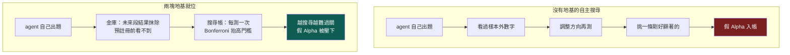

## 地基一：不可偷看的資料金庫（`wm/vault.py`）

金庫把每個樣本外分段釘進一張 append-only 的 `holdout_ledger`，狀態只能前進不能抹去：

| 狀態 | 意義 | 能否授予 confirmed |
|---|---|---|
| `SEALED` | 沒被用過、沒被看過結果 | **可以**（唯一合法來源） |
| `EXPOSED` | 已被結算用掉，或結果曾外洩（印上 wiki） | 永遠不行（燒毀） |
| `UNSEALED_ONCE` | 被最終晉升程序一次性讀取過 | 之後不行 |

對 king2 殘差集一鍵套用後，四段的真實狀態很說明問題：`TRAIN`（樣本內）、`HOLDOUT_2022_2024`（已用於 [[exp-007-residual-belief|B-RES-001]]）、`EXPOSED_2025`（曾印上 wiki）**全部 `EXPOSED`**；唯一 `SEALED` 的是 **`LIVE_FORWARD`**——封印日（2026-07-23）之後才會發生的事件，目前 0 筆。這如實說明一件事：**B-RES-001 要真 confirmed、C 臂要真解鎖，唯一乾淨的資料只能是未來累積出來的**，歷史全燒光了。未來事件天然不可偷看，是最乾淨的金庫。

金庫對外只給三種能力：`manifest()`（任何人可讀，但只回筆數／指紋／狀態，**永不回結果**）、`eligible_for_confirm()`（只有 SEALED 為真）、`unseal_once()`（僅晉升程序呼叫，讀完翻 `UNSEALED_ONCE`、入讀取帳、拒第二次）。另有 `agent_view()`：交給自主 harness 的資料視圖，把 SEALED／LIVE_FORWARD 段的結果欄抹成 NULL，harness 就算讀了 parquet 也看不到未來報酬。wiki build 還加了 **lint 閘**——任何頁面再出現燒毀分段的結果數字，`build.py` 直接失敗。

## 地基二：全域搜尋帳（`wm/search_ledger.py`）

搜尋帳記錄整個搜尋過程，讓「挑幸運者」現形並被懲罰：每輪產了幾條候選、拒了幾條、實測幾條、用了哪些資料段、屬哪個家族；每個樣本外段被查詢過幾次；每個家族累積實測幾條。

核心不是記帳好看，是**把記錄接進裁決**。`settle_corrected()` 依家族累積檢定數對 Wilson 下界用的 z 做 Bonferroni 放大——測越多，過 confirmed 的門檻越高：

| 家族第幾次檢定 | 等效 z′ | confidence（Wilson 下界） |
|---|---|---|
| 第 1 次 | 1.96 | 0.4452 |
| 第 3 次 | 2.39 | 0.4050 |
| 第 10 次 | 2.81 | 0.3691 |
| 第 30 次 | 3.14 | 0.3418 |

第 1 次退化回原結算（與 B-RES-001 記錄值一致）；越往後，同一組命中數換得的信心越低。**agent 越勤勞，單條假說要被相信就越難，而不是越容易。** 另有 `feature_overlap()` 純碼擋與既有特徵高度共線的「換皮」提案。

## 無人選題迴圈（`wm/autonomous_round.py`）

harness 把 exp-007 裡人做的跳躍接進閉環。確定性工作（聚類、去重、資料判定、評分、組特徵、預註冊、結算、決定下一題）全交純碼；只有「生競爭機制」這一步需要創意，交便宜本地模型（ornith:9b，對映 [[discipline|模型分級]]）。

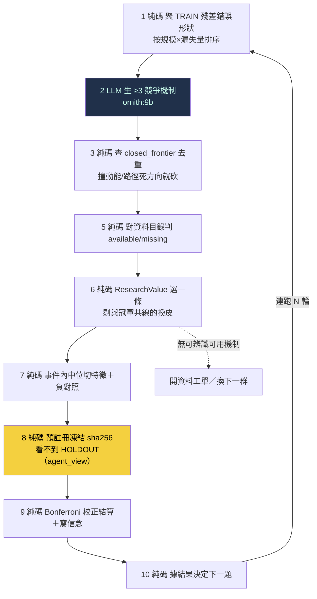

### 第一次真跑三輪：迴圈自轉，誠實拒絕薄資料

三輪都在**不同錯誤形狀**（normal regime × rev_rank 高／中／低帶）上跑完全部步驟，沒有人替它選題：

- **step1** 純碼從 TRAIN 殘差聚出 18 個錯誤形狀；**step2** 9b 對頭號形狀生 3–4 個競爭機制；**step3** 砍掉撞死方向的；**step6** ResearchValue 選中 chip 訊號（與 king2 的 rev_rank 共線僅 **0.019**，是真正的新軸，不是換皮動能）。
- **step8** 預註冊凍結（`autonomous=1`，凍結先於結算）；**step9** 把假說限縮到該形狀的條件（regime＋rev_band）測——每個條件只剩 **13–17 個** HOLDOUT 事件，低於 `min_n=20`，三輪全部落 **`HOLD_PRIOR`**；**step10** 純碼決定 `pick_next_cluster`。

這個結果不漂亮，但正是重點：**在被切細的具體條件下，殘差 holdout 太薄，系統誠實回「證據不足、不下結論」，然後自己換下一題。** 它自己出了合法問題、自己接受了「測不出來」、再自己決定下一步——這就是 [[hypothesis-engine|假說引擎]]要的自我探索，而不是硬把薄資料湊成 Alpha。

## 開放探索線：不繞著 king2 轉的第二條研究預算（`wm/open_exploration.py`）

只從 king2 殘差選題會退化成局部最佳化——把冠軍越修越複雜，卻永遠發現不了另一種更大的 Alpha。所以研究預算分兩條：**冠軍利用線**（上面的殘差迴圈）＋**開放探索線**（本節），後者刻意避開 king2 的軸（營收動能＋指紋＋籌碼＋品質），去價格／波動／量能／反轉裡找**與 king2 低相關**的新家族。

定義這條線的關鍵指標＝**對 king2 正交度**。既有評估器只檢定「對價格動能正交」，但 king2 的主軸是**基本面營收動能**（`RK(月營收YoY排名)` 佔 score 65%），一個對價格動能正交的特徵仍可能跟 king2 高度相關。所以本模組把 king2 主訊號當控制軸，算每個候選：①對 king2 的橫斷面相關 `corr_king2` ②控掉 king2 後前瞻報酬的偏 IC。一個「正交邊」＝有預測力（IC 顯著）**且**對 king2 低相關**且**控 king2 後偏 IC 仍在——才是 king2 沒有的新資訊，不是換皮營收動能。

第一輪真跑（`evaluator.harness` 真評 finlab 資料，dev tier，6 個非 king2 軸候選）：

| 候選家族 | IC(20日) | 對 king2 相關 | 對價格動能相關 | 裁決 |
|---|---|---|---|---|
| **low_vol_60**（低波動異象） | 0.071 (t=15) | −0.12 | −0.04 | **ORTHOGONAL_EDGE** |
| vol_compression（波動壓縮） | 0.036 (t=22) | −0.03 | −0.23 | ORTHOGONAL_EDGE |
| illiquidity_amihud（非流動性） | −0.032 (t=−16) | −0.11 | −0.16 | ORTHOGONAL_EDGE |
| volume_expansion（量能擴張） | −0.016 (t=−10) | +0.05 | +0.27 | ORTHOGONAL_EDGE |
| range_position_120（通道位置） | 0.046 (t=11) | +0.15 | **+0.81** | **MOMENTUM_BETA_CLOSED** |
| short_reversal_5（短期反轉） | 0.001 (t=0.5) | −0.06 | −0.04 | NO_EDGE |

兩個裁決最能說明這條線在做什麼：**range_position_120 對 king2 正交（相關僅 0.15）卻被擋下**——因為它對價格動能相關高達 0.81，就是 [[exp-002-ablation|exp-002]] 證過會滑進 beta 的已判死方向；「對 king2 正交」是必要非充分，還要不撞已知動能陷阱。**最強的真實發現＝low_vol_60（低波動異象）**：IC 0.071、對 king2 僅 −0.12、對動能僅 −0.04——對兩者都正交，是與 king2 營收動能真正不同的一條 Alpha 軸。

這正是開放探索線該給的東西：它找到一個 king2 結構上抓不到、也不是換皮動能的候選家族。但**這是發現階段的旗標，不是可交易結論**——見誠實邊界。

## 確認閘：把正交邊推過保留集＋成本，第一輪 0 條存活（`wm/edge_confirm.py`）

上面那些 `ORTHOGONAL_EDGE` 是 **dev tier 的發現階段旗標**——單特徵橫斷面 IC，t 大只因觀測多。確認閘把它們推過**沒被發現階段用過的 validation tier**（第一保留集，2022–2024）＋台股交易成本，跑六道門，全過才升「真挑戰者」：

| 門 | 檢什麼 |
|---|---|
| G1 PIT 乾淨 | `leak_probe`：毒化未來後特徵過去值逐位元不變（無前視） |
| G2 樣本外 IC | validation IC 顯著（`\|t\|≥2`）且與 dev 同號 |
| G3 淨成本存活 | 分位多空／多頭投組，扣來回成本（≈0.386%）×換手後，**多空淨 Sharpe≥0.5 且可交易多頭腿淨年化>0** |
| G4 控 size/動能 | 控動能+波動+規模後偏 IC 仍同號有量（不是 size/低波 beta 換皮） |
| G5 對 king2 正交 | 投組月報酬對 king2 研究鏡像報酬相關 <0.3 |
| G6 反 fishing | 候選＋協議先凍結 sha256 再看 validation；vault(2025+) 一律不碰 |

**第一輪結果：4 條正交邊，0 條通過。**

| 候選 | validation IC(t) | 多空毛→淨 Sharpe | 卡在 |
|---|---|---|---|
| **low_vol_60** | 顯著（t=12.83） | 0.05 → −0.06 | **G3 淨成本**（毛 Sharpe 近零，扣成本翻負） |
| illiquidity_amihud | 顯著（t=−4.27） | −0.52 → −0.71 | G3 淨成本 |
| volume_expansion | 顯著（t=−3.65） | 0.20 → −0.70 | G3（67% 換手把毛 0.20 吃成負） |
| vol_compression | 不足（t=1.51） | — | G2 樣本外 IC |

最關鍵的是 **low_vol_60**：它在 dev tier 的 IC 強到 t=15，樣本外 IC 也還顯著（t=12.83），**但扣成本後的多空頂/底分位價差就是不賺**。這正是 `IC 顯著 ≠ 可交易價差` 的典型落差——保留集＋成本紀律存在的全部理由，就是不讓一個發現階段旗標被誤當成 Alpha。

### 這個負結果是對抗查證過的（不是回測壞掉）

一個負結果只有在「管線本身沒 bug」時才有意義。我剛在確認閘裡修過一個 sign-handling bug，所以派了**四個獨立稽核鏡頭**（各自用真資料 re-run）來攻擊「0 通過」這個結論，綜合裁決＝**負結果可信（NEGATIVE_RESULT_TRUSTWORTHY，0 個影響結果的 bug）**：

- **健全性控制（決定性）**：同一套投組回測餵**已知強訊號**（價格動能）產出淨 Sharpe **+0.68**（毛 1.17）、餵**垃圾常數**得 **−0.66**——管線能乾淨分開「真有可交易 alpha／垃圾／高 IC 但不可交易」，不是把一切壓負。
- **成本稽核**：成本歸零後，四條邊最好的毛 Sharpe 也只有 0.20——擋住 G3 的是「樣本外根本沒有毛 alpha」，不是過度成本。
- **tier/洩漏**：validation 與 dev 零重疊、面板健康（37 次換股、每期約 1300 檔）、leak_probe 逐位元乾淨。
- **方向/腿別**：翻號後多空毛 Sharpe +0.52↔−0.52 完美反對稱，證明定向沒搞反；兩個方向都不過 G3。

稽核同時揪出兩個**不影響本結論、但已修**的隱患：`_portfolio` 的 hmask 參數缺型別防呆（誤傳字串會靜默變 0 換股）——已加 `_as_hmask` 擋下；G3 門名的文字與實際門檻（≥0.5）不一致——已對齊。

## 兩種成功，這一輪屬於哪一種

自主 Alpha 閉環有兩種不同的成功，不能混為一談：

| 成功類型 | 判準 | 本輪 |
|---|---|---|
| **知識成功** | 信念被確認／限縮／否證，或誠實判定證據不足，世界模型更準 | **✅ 冠軍利用線自轉三輪誠實 HOLD_PRIOR；開放探索線找到正交邊、又用確認閘證明它們扣成本後不存活** |
| **Alpha 成功** | 對 king2 有樣本外增量，扣 beta／成本／容量後仍可交易 | ❌ 尚無（4 條正交邊 0 條過確認閘） |

**兩條線都是知識成功，都不是 Alpha 成功。** 冠軍利用線證明「第二套能自己轉」；開放探索線更進一步——它不只找到與 king2 正交的候選，還誠實地把自己找到的候選推過保留集＋成本，證明它們**還不能交易**。系統對自己的發現一樣嚴格：找得到 ≠ 賺得到，而它有能力分辨這兩者。這比「找到一條 Alpha」更能證明整套紀律在誠實運作。

## 誠實邊界（不得省略）

- **結算跑在 EXPOSED 段，不可 confirmed。** 歷史三段已全燒毀，自主輪的 HOLDOUT 結算只是「迴圈自轉」的示範；任何 confirmed 都只能來自 `LIVE_FORWARD`（目前 0 筆）。三條 `B-AUTO-*` 信念在真相帳裡標 `confirmable=False`，[[research-loop|狀態投影]]永不把它們算進 confirmed。
- **特徵文法太窄。** 目前只有「事件內中位切某可用欄」一種切法，可用欄限資料集內。不同機制常收斂到同一個 chip 切分；產業營收／運價指數／籌碼流向等外部 PIT 源不在手，機制正確落 `missing`、開資料工單——這如實示範「自主系統會自己發現手上缺什麼資料」，但也代表它現在能測的假說種類很少。
- **機制品質＝9b 弱模型。** 競爭機制由便宜模型生，多數偏泛；`world_feature` 命名靠關鍵詞對到資料欄，是啟發式，不是語意理解。
- **開放探索線只跑了發現階段，不是可交易結論。** 上面那些 `ORTHOGONAL_EDGE`（如 low_vol_60）是 dev tier 的橫斷面單特徵 IC，t 值大是因為觀測多、**不代表可交易**：沒扣成本／換手／容量、沒做保留集 walk-forward、不是投組回測。真要成為挑戰者，得過金庫的保留集 tier＋成本＋容量閘。這條線目前證明「找得到與 king2 正交的候選」，還沒證明「其中有能扣完成本還賺的」。
- **對 king2 正交＝用 `RK(月營收YoY排名)` 當代理，非完整 king2。** king2 是 0.65·營收動能＋0.35·tilt（指紋＋籌碼）；本輪只控了 65% 的主軸，tilt 那 35% 還沒控。所以「對 king2 正交」目前是對其主軸正交，不是對整個 king2 正交。
- **無人選題只跑過一輪三代，尚非常駐。** 排程自轉、跨輪 seen-set 防重、資料工單自動觸發取數，都還沒接。這是能自轉的**證明**，不是已經在自轉的**系統**。

延伸：這一輪在三迴圈裡的位置見 [[research-loop|研究迴圈]]；為什麼選題只能從殘差長出、下一步為何是「無人選題測試」見 [[hypothesis-engine|假說引擎]]；金庫與 confirmed 慢路的設計見 [[world-belief-contract|信念契約]]；第一條人工殘差假說見 [[exp-007-residual-belief|實驗 007]]；為什麼策略級裸績效量不了這種認知結果見 [[objective|演化的目標]]；歷次實驗血統見 [[exp-index|實驗索引]]。

---

<a name='world-belief-contract'></a>
# 〔world-belief-contract〕世界信念契約：被更新的是信念，不是世界

這一頁回答 owner 深層批評的第一點——**世界（World）、觀測（Observation）、信念（Belief）、策略（Policy）必須徹底分開**。前面幾頁（[[world-model|世界模型]]、[[objective|進化目標]]）已經把「世界是狀態、不是新聞流」講清楚，但還混著一個更根本的位階錯誤：把「更新世界」跟「更新信念」當成同一件事。它們不是。

先給認知答案與行動答案，其餘證據都服務這條主軸。

> **認知答案**：**真實世界永遠不會被我們「更新」**。一次 86 筆預測的到期對帳，改變的**不是世界怎麼運作**，而是**我們對某條機制的信心**——從 0.5 掉到 0.2256。會被版本化、被結算、被推翻的，只有**信念（B）**這一層；世界（W）自己演化、與我們的帳本無關，觀測（O）只是世界狀態的到達，策略（P）是信念進入成本與風險約束後的下游決策。投資裡唯一有價值的輸入，是**驚訝（surprise）＝新觀測 O − 市場預期 E[O]**；信念契約就是「把驚訝累積成對機制的信心、並純碼結算」的那張表。
>
> **行動答案**：任何一次實驗做完，都要能回答一個分水嶺問題——**「哪一條信念、因為哪一份證據、從哪一版更新到哪一版？」**。這不是修辭，是一張 append-only 表的五個欄位（`belief_id` × `version` × `confidence_before` → `confidence_after` × `evidence_ids` × `update_action`）就能答出的事實。真例已經跑出來了：見 [[exp-004-belief-contract|實驗 004]]，B-H-003 被 86 筆真證據推翻、B-H-001 被 636 筆削弱但存活。

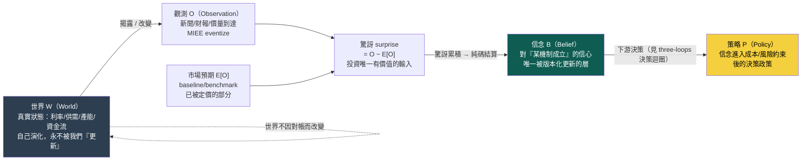

這張圖最容易被讀漏的，是那條從 W 繞回 W 的虛線：**世界對帳完之後還是原來的世界。** 我們的帳本裡唯一動了的，是綠色那格「信念」的信心數字。把 W 跟 B 混在一起，就會犯「新聞一到、世界就變了、策略就該改」這種位階錯亂；分開之後，因果鏈才對得起來——世界改變或揭露 → 產生觀測 → 觀測減市場預期得到驚訝 → 驚訝累積更新信念 → 信念進約束變策略。

## 一、四層各是什麼、誰會動、誰不會動

owner 的分法可以逐層對到這台引擎現有（或該有）的承載點：

| 層 | 是什麼 | 誰承載 | 會不會被「更新」 |
|---|---|---|---|
| **世界 W** | 利率、美元、供需、產能、DRAM/HBM 循環、ETF 資金流等真實狀態變數 | [[world-model|世界模型層]]（目前近乎空殼） | **不會**：世界自己演化，我們的對帳不改變它 |
| **觀測 O** | 新聞、財報、價量等世界狀態的到達訊號 | [[fw-qual-engine|MIEE eventize]]（mcm 唯讀上游） | 不適用：O 只是「到達」，不是被更新的對象 |
| **信念 B** | 對「某條機制成立」的信心，帶適用範圍、否證條件、信心版本 | **本頁的 `belief_contract` 表** | **會，且只有它會**：append-only 一版一版更新 |
| **策略 P** | 把信念排序、加成本/風險約束後的下單政策 | [[method-strategy-spec|策略基因]]／[[three-loops|決策迴圈]] | 會，但由**另一個迴圈**、用**另一套裁判**改（見 [[three-loops]]） |

一眼看懂這張表的重點：**只有「信念」這一層是信念契約負責版本化的對象**。世界不歸它管（歸 [[world-model]]，而且世界不被「更新」），策略也不歸它管（歸 [[three-loops|決策迴圈]]，用 beta 中性後增量當裁判）。把三件事塞進同一個「進化」動作裡，正是 [[objective|進化目標]] 那頁揭露的病根；信念契約是把「信念更新」這一件事**單獨切出來、單獨結算**的機制。

## 二、一則新聞的三種身分：別把三件事混成「事件觸發」

owner 點名的第二個混淆：現行引擎把每一則新聞都當成「事件 → 觸發訊號 → 生策略」的同一種東西。但**一則觀測 O 至少有三種完全不同的身分**，對信念的作用天差地遠：

| 觀測的身分 | 例子 | 它動了哪一層 | 對信念 B 的作用 |
|---|---|---|---|
| **① 改變世界狀態** | Fed 真的降了一碼、台積電真的開出 CoWoS 新產能 | 動了 **W**（真實狀態變了） | 世界變了 → 未來觀測分佈改變；信念的**適用前提**可能要重畫 |
| **② 揭露既有狀態** | 財報公佈上季營收（營收早就發生，只是現在才被看到） | 沒動 W，只是 **O 讓既有 W 可見** | 這是最純的「驚訝」來源：O − 市場預期，直接餵信念結算 |
| **③ 只改市場信念** | 分析師喊目標價、傳聞、情緒 | 沒動 W，只動了**市場的 B**（不是我們的 B） | 改變的是 baseline 定價；我們要問的是「市場信念的移動有沒有 over/under 反應真實 W」 |

這三種身分不分清楚，就會把「世界變了」跟「別人以為世界變了」當成同一件事下注。信念契約的 `predicted_outcome` 欄刻意寫成 **`cost_adjusted_excess_return_vs_baseline`（相對 baseline 的成本後超額）**——因為 baseline（benchmark）就是「市場已經定價的預期 E[O]」，超額就是驚訝。信念在賭的從來不是「新聞說了什麼」，而是「**這則觀測相對市場預期的驚訝，會不會在預測方向上兌現**」。這正是 owner 那句「投資最重要的是 surprise」的資料結構化身。

## 三、14 欄信念契約 schema：一版信念的完整地址

一條信念的一個版本，就是 `belief_contract` 表的一列。除了 `(belief_id, version)` 這組 append-only 版本鍵，owner 設計的內容欄共 **14 欄**，每一欄都讓這條信念可被別的 LLM 逐欄稽核。下表用 [[exp-004-belief-contract|實驗 004]] 的真實信念 B-H-003（v2 對帳列）當具體例子，不是抽象 schema：

| # | 欄位 | 說明 | B-H-003 v2 真值 |
|---|---|---|---|
| 1 | `as_of` | 此信念狀態的截止時點（v1=假說誕生、v2=最後對帳日） | 2026-07-17 19:00:51 |
| 2 | `mechanism` | 因果機制（來自 MIEE `causal_mechanism`） | 漲價反映供需吃緊超出市場預期，未預先反應標的在事件後數日內遲滯重定價 |
| 3 | `scope` | 適用範圍：觸發事件＋進場條件＋主窗 | 觸發＝price_increase(min_conf 0.5)｜進場＝pre_event_runup_20d_max≤0.1｜主窗 5 日 |
| 4 | `antecedent` | 前件：什麼成立才觸發 | `{"pre_event_runup_20d_max":0.1}` |
| 5 | `predicted_outcome` | 預測後果：方向＋成本後超額（＝驚訝的操作化） | direction=positive、cost_adjusted_excess_return_vs_baseline、主窗 5 日 |
| 6 | `lag_distribution` | 時滯分佈：horizons＋主窗 | horizons=[5,10,20,60]，主窗 5 日 |
| 7 | `baseline` | 對照基準（＝市場已定價的預期 E[O]） | benchmark_index |
| 8 | `falsifier` | 否證條件（MIEE 原文，逐字保留） | 主窗成本後平均超額≤0，或 p_noise>0.05，或 n<20 判 insufficient |
| 9 | `confidence_before` | 更新前信心（v1＝先驗 0.5；v2＝v1 的 after） | 0.5 |
| 10 | `evidence_ids` | 證據指針：`prediction_outcome.id` 清單＋n/k | id 87..172、n=86、k=27 |
| 11 | `settlement_rule` | 純碼結算規則＋輸入（可據此重算 after） | wilson_lower_bound_95_vs_coinflip；wilson_lo=0.2256、hi=0.4182 |
| 12 | `confidence_after` | 更新後信心（純碼算：Wilson 95% 命中率下界） | **0.225612** |
| 13 | `update_action` | 更新動作（由規則決定，非人填） | **REFUTE** |
| 14 | `source_hypothesis` | 指回 MIEE（`miee:H-00x`） | miee:H-003 |

三件事讓這 14 欄不只是欄位，而是一條**可被否證、可被重算**的信念：

- **驚訝寫死在 5、7 兩欄**：`predicted_outcome`（超額）減 `baseline`（市場預期）就是驚訝；信念賭的是這個驚訝而非新聞本身。
- **否證寫死在 8 欄、且逐字保留 MIEE 原文**：一條信念沒有 `falsifier` 就不准入帳——這沿 [[fw-world-signal|世界訊號]] 的「反證必填」與 [[discipline|誠實紀律]]。
- **信心的移動（9→12）由 11 欄的純碼規則決定，13 欄記動作**：`confidence_after` 是命中率的 Wilson 95% 下界，`update_action` 由 `decide_action()` 決策樹判（見下節），**LLM 一個字都不進這兩欄**。

## 四、對照 MIEE：缺的從來不是預測，是「信心的版本化」

一個誠實的問題：這張信念表是不是重造輪子？不是。上游的 [[fw-qual-engine|MIEE]] 早就有一大半——它有 `hypothesis`（假說＝機制、範圍、否證）、`prediction`（前瞻預測帳）、`prediction_outcome`（到期真結算）。**MIEE 唯一沒有的，是把「同一條信念的信心怎麼隨證據一版一版變動」記成 append-only 的版本鏈。** 信念契約補的就是這一格。

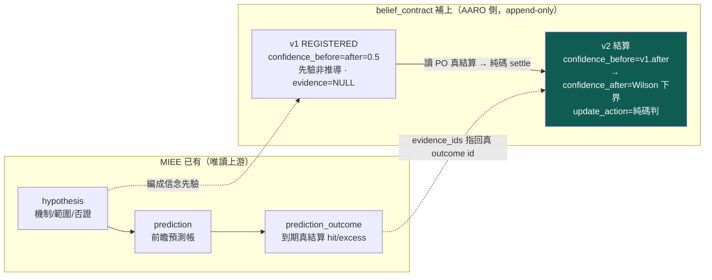

版本鏈的紀律有三條，全部 append-only、全部純碼：

1. **v1 是先驗、不是推導**：註冊時 `confidence_before = confidence_after = 0.5`，`evidence_ids = NULL`，`update_action = REGISTERED`。0.5 是「方向擲硬幣」的無資訊基準，明說是先驗，不假裝從資料算出來。
2. **v2 的 before 鏈接 v1 的 after**：`confidence_before(v2) = confidence_after(v1)`，讓信心的移動是一條可追的鏈，不是憑空跳。
3. **改信念＝寫新版本，不改舊列**：表上有 `trg_belief_no_update` / `trg_belief_no_delete` 兩個觸發器，任何 UPDATE/DELETE 直接 `RAISE(ABORT)`。信念史只增不改——這樣「從哪版到哪版」永遠查得到。

`update_action` 的五種值由 `decide_action()` 決策樹純碼判定，對映 `falsifier` 的 OR 子句：

- `HOLD_PRIOR`：n < min_n，證據不足，維持先驗不更新；
- `REFUTE`：命中率 95% 上界仍不過 0.5 **且** 平均超額 ≤ 0（兩條否證子句齊發）→ 推翻；
- `REINFORCE`：命中率 95% 下界都過 0.5 **且** 超額 > 0 → 強化；
- `WEAKEN`：任一否證跡象（命中率 ≤ 0.5 或 超額 ≤ 0）→ 削弱但存活；
- `NARROW_SCOPE`：點估計過基準但不顯著 → 保留並限縮範圍待更多證據。

這五態就是「信念被證據怎麼對待」的完整詞彙。[[exp-004-belief-contract|實驗 004]] 一次就打出兩種：B-H-003 兩子句齊發判 REFUTE、B-H-001 只有命中率一側不過（超額仍正）判 WEAKEN——同一套規則、同一個機制、只差主窗與樣本，結局就從「推翻」變「削弱」。

## 五、分水嶺問題：實驗做完，能不能答出「哪條信念、因哪證據、從哪版到哪版」

這是整張表存在的理由，也是 owner 拿來驗收的那一句。把 [[exp-004-belief-contract|實驗 004]] 兩條信念的答案並排，就是這張表要交付的東西：

| 分水嶺問句 | B-H-003（推翻） | B-H-001（削弱） |
|---|---|---|
| 哪一條信念？ | B-H-003（機制：漲價超預期、遲滯重定價，主窗 5 日） | B-H-001（同機制，主窗 20 日） |
| 因為哪一份證據？ | `prediction_outcome` id 87..172 共 86 筆、命中 27（31.40%）、平均超額 −0.0076 | id 1..845 中 636 筆、命中 273（42.92%）、平均超額 +0.0018 |
| 從哪一版到哪一版？ | v1 → v2 | v1 → v2 |
| 信心怎麼變？ | 0.5 → **0.225612** | 0.5 → **0.391315** |
| 更新動作？ | **REFUTE**（wilson_hi 0.4182≤0.5 且 超額≤0，兩子句齊發） | **WEAKEN**（命中率≤0.5 但 超額>0，只一子句） |

這五列全部是資料庫裡查得到的**事實**，不是敘事。這就是把「信念更新」做成一等公民的意義：**下一個 LLM 不用相信我的話，直接讀 `belief_contract` 五個欄位，就能複述整條信心是怎麼被哪份證據推動的。**

## 六、誠實邊界（不得省略）

- **只做到「到期對帳 → 信念更新」，沒做「決策是否因此改變」**。信念被削弱/推翻之後，下游策略要不要停用、縮倉、重畫適用範圍——那是閉環的後半段，屬於 [[three-loops|決策迴圈]]，留 exp-005，**現在完全沒做**。信念動了，策略沒動。
- **`confidence_before` 是明說的先驗（0.5），不是從資料推導**。只有 `confidence_after` 是純碼從真實命中數算的 Wilson 下界。先驗選 0.5 是「方向擲硬幣」基準，換一個先驗、後面的信心軌跡就不同——這是設計選擇，不是客觀真值。
- **MIEE 假說不是完整的世界機制信念**。它是**事件驅動**（漲價事件後短窗超額）的可證偽預測，是目前**唯一**有真到期結算數的真資料，所以拿它當第一條信念的證據來源；但它**不等於** owner 病灶 3 講的「升息壓估值」那種常駐世界模型節點。信念契約的殼是對的，但現在裝的內容還停在事件層，不在世界狀態層——與 [[world-model|世界模型]] 的空殼互為因果。
- **信心＝命中率 Wilson 下界，是一種口徑選擇**。把「信念的信心」定義成「方向命中率的 95% 下界」只是眾多可能結算器之一；它對「命中率」敏感、對「賺賠幅度」只透過 `avg_excess` 的否證子句進來。換一個結算器（如直接用超額的 t 值），信心數字會不同——這條沿 [[method-gates|證據閘]] 的「門檻未校準」誠實線。
- **`n` 是跨時窗匯總、非只主窗**：信念的證據把該假說在各 horizon 的 outcome 匯總成一個命中率（見 [[exp-004-belief-contract|實驗 004]] 誠實邊界），這也是為什麼 B-H-001 在信念契約判 WEAKEN、而 MIEE 自身狀態標 `insufficient`——兩者用不同口徑結算，B-H-003 的 REFUTE 則與 MIEE `refuted` 一致。這個口徑差是最該被下一位 LLM 攻擊的接縫（見 [[for-llm-review|給 LLM 評審]]）。

一句話收束：**世界不會因為我們對了帳就改變；改變的永遠只是我們對世界的信心。** 把「信念」從「世界」和「策略」裡切出來、單獨版本化、純碼結算，才問得出那句分水嶺問題——哪條信念、因哪證據、從哪版到哪版。

延伸：世界層為何是根、為何空殼見 [[world-model|世界模型]]；三個迴圈為何要分開裁判、策略為何是決策政策而非投影見 [[three-loops|三迴圈]]；整條研究迴圈骨架見 [[research-loop|研究迴圈]]；把提問抬到世界未知層見 [[hypothesis-engine|假說引擎]]；這張表的第一次真跑見 [[exp-004-belief-contract|實驗 004]]；不認得的詞查 [[glossary|詞彙表]]。

---

<a name='three-loops'></a>
# 〔three-loops〕三個迴圈：認知、決策、元研究，各有各的裁判

這一頁修正 [[objective|進化目標]] 那頁可能被讀過頭的一句話。那頁說「該演化的是世界模型、不是策略」——這句話的**病灶診斷是對的**（優化策略級 Sharpe 只會重新發現動能 beta），但如果被讀成「**只**演化世界模型、策略是可有可無的投影」，就矯枉過正了。owner 的重構把它講清楚：不是把一個錯的單一目標換成另一個單一目標，而是**拆成三個分開裁決的迴圈**。

先給認知答案與行動答案。

> **認知答案**：一台會研究、會下注、又會改進自己的引擎，其實同時在跑**三個不同的迴圈**，各改一種東西、各用一套裁判，**絕不能共用同一個分數**：**認知迴圈**改世界模型（裁判＝預測校準／樣本外 log score／反證）、**決策迴圈**改策略（裁判＝beta 中性後的增量／成本後效用／風險）、**元研究迴圈**改「怎麼選問題」（裁判＝單位成本的資訊增益／重複研究率／失敗歸因）。策略**不是**世界模型的投影，而是「**世界信念進入現實約束（成本、風險、流動性、部位）後的決策政策**」——它是第一公民的決策迴圈，只是**不該用裸 Sharpe 當裁判**。
>
> **行動答案**：任何一項研究工作，先問它屬於哪個迴圈、該用哪個裁判驗收。用錯裁判是這台引擎最貴的錯——[[objective|進化目標]] 揭露的病，本質就是**拿「決策迴圈的裸績效」去當「認知迴圈的裁判」**：把「策略在樣本內賺多少」誤當成「世界模型多懂一分」。三個迴圈分家、各用各的裁判，這個誤用才會被結構性擋掉。

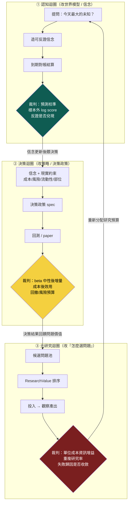

這張圖的重點是三個菱形（三套裁判）**顏色不同、內容不同**。三個迴圈會互相餵資料（認知更新完的信念餵決策、決策的結果回饋問題價值、元研究重新分配研究預算），但**驗收各自的成敗時，用的是各自的裁判，永不混用**。混用就是 [[objective|進化目標]] 那頁的病。

## 一、為什麼「只演化世界模型」是矯枉過正

[[objective|進化目標]] 的診斷沒錯：現行迴圈拿「子代策略級指標勝父代」當適應度，放手優化就一路滑進動能 beta（[[exp-002-ablation|實驗 002]] 判 conflicting、[[exp-003-graph-evolution|實驗 003]] gen3 Sharpe 衝到 2.06）。但那頁的**修法句**若被讀成「所以策略不重要、只要演化世界模型」，會掉進兩個坑：

- **策略被降格成投影，但投影不會下單**。世界信念再準，最終要**在成本、風險、流動性、部位限制下變成一個可執行的決策政策**才碰得到真錢。把策略當「世界模型的自動投影」，等於假設「懂了世界就自動會下對單」——這在有交易成本、有風險預算、有容量上限的現實裡是假的。決策本身是一個要獨立優化、獨立驗收的迴圈。
- **一個單一目標換成另一個單一目標，還是單一目標**。把「最大化 Sharpe」換成「最大化世界模型預測力」，仍然是**一個分數統治全局**。但「這條信念的預測準不準」跟「這個部位配置划不划算」跟「這個問題值不值得研究」，是三種**不可通約**的判斷。硬塞進一個分數，一定又有一個維度被另外兩個維度綁架——就像現在績效綁架了認知。

所以正解不是「只留一個迴圈」，是「**認清本來就有三個迴圈、把它們的裁判分開**」。[[objective|進化目標]] 抓對了病（裁判用錯層），這一頁補上完整的藥（三層各自的裁判）。

## 二、三迴圈分開裁決表：被改的東西 × 裁判 × 現況

| 迴圈 | 被改的東西 | 裁判（驗收標準） | 對映承載 | 現況（2026-07-22） |
|---|---|---|---|---|
| **① 認知迴圈** | 世界模型／信念（機制成不成立、信心多少） | **預測校準**、**樣本外 log score**、**反證是否兌現**——問「這條信念的可反證預測撐不撐得過未見資料」 | [[world-belief-contract|信念契約]]（到期對帳結算）／[[hypothesis-engine|假說引擎]]／[[fw-qual-engine|MIEE 預測帳]] | **首次真跑**：[[exp-004-belief-contract|實驗 004]] 兩條信念到期結算（REFUTE／WEAKEN）；但只到「信念更新」，未接下游 |
| **② 決策迴圈** | 策略／決策政策（選誰、抱多久、多大部位、何時退） | **beta 中性後的增量**、**成本後效用**、**風險預算/回撤**——問「扣掉能免費拿到的 beta，這個決策還多賺嗎、成本後划算嗎、風險吃得下嗎」 | [[method-strategy-spec|策略基因]]／[[method-gates|證據閘]]／[[fw-holding-lifecycle|持有期生命週期]] | **機件成熟但裁判待補**：回測/十閘/paper 都在跑，但**動能 beta 中性化尚未進適應度**（[[exp-003-graph-evolution|實驗 003]] 列為 P0） |
| **③ 元研究迴圈** | 「怎麼選問題」（研究預算往哪投） | **單位成本資訊增益**、**重複研究率**、**失敗歸因是否收斂**——問「今天這一份資源，消除了最多、最能被辨識的決策相關未知嗎」 | [[hypothesis-engine|假說引擎]] `research_gap`／`closed_frontier`／下節 ResearchValue | **殼有內容錯層**：缺口帳＋純碼排序＋死方向入帳都在，但排序準則仍是「策略調參優先級」，非 ResearchValue |

這張表把三件事一次講完：**三個迴圈都真實存在、都有承載、但都只做了一半**。認知迴圈剛跑出第一個真例（信念被真證據推翻）；決策迴圈機件最成熟卻還用著錯的裁判（裸績效，未做 beta 中性）；元研究迴圈的殼在、但裝的還是策略調參的優先級。

## 三、策略不是投影，是「信念進入現實約束後的決策政策」

這一節要把 owner 最容易被忽略的一句話講死：**策略是決策政策，不是世界模型的投影。** 兩者的差別在「約束」：

- **世界信念**回答的是 `E[未來報酬 | 世界狀態]`——一個對世界的**條件期望**，沒有成本、沒有部位上限、沒有風險預算。它是認知迴圈的產物。
- **決策政策**回答的是「**在有交易成本、有流動性上限、有風險預算、有既有部位的現實裡，此刻該對哪些標的、下多大單、抱多久、何時退**」。同一個世界信念，在不同成本結構、不同資金規模、不同風險胃納下，會投影出**完全不同**的決策政策。

換句話說，從信念到策略之間隔著一整層「現實約束」的最適化，那一層本身就是一個要獨立研究、獨立驗收的問題——它不是把信念「照抄」下來。這就是為什麼決策迴圈要有自己的裁判：**beta 中性後的增量**（扣掉市場免費給的 beta，這個決策政策還有沒有超額）、**成本後效用**（交易成本、衝擊成本吃完還剩多少）、**風險預算/回撤**（這個部位配置在最壞路徑上活不活得下來）。

用裸 Sharpe 當決策迴圈的裁判會壞，不是因為「策略不該被優化」，而是因為**裸 Sharpe 沒有扣掉 beta、沒有扣掉成本、沒有看風險路徑**——它把「這段多頭樣本免費發的動能 beta」算進了決策的功勞裡。[[exp-002-ablation|實驗 002]] 就是這件事的直接證據：純動能自己 Sharpe 1.52，等於「營收＋強勢」1.52，決策層的「綜效」是零。**這是「對現行目標函數存在動能捷徑」的直接實驗證據——不是「所有策略演化必然收斂到 beta」的證明。** 把裁判換成 beta 中性後增量，這條捷徑就被堵死，決策迴圈才會去找「beta 之外還多賺」的東西。

## 四、元研究迴圈：把「知識缺口收斂」換成防鑽漏洞的 ResearchValue

owner 對元研究迴圈的批評很尖：早期版本把目標寫成「知識缺口收斂」，這**會被鑽漏洞**——只要製造一堆容易收斂的假缺口、或把一個缺口拆成十個，「收斂速度」這個分數就能被灌水。正解是把「今天該研究什麼」換成一個**不能靠灌缺口刷分**的量：

```
ResearchValue = (Uncertainty × DecisionRelevance × Identifiability × ExpectedInfoGain)
                ─────────────────────────────────────────────────────────────────────
                                    (Cost × Time)
```

問題不再是「今天有哪些新聞」，也不是「今天缺口收斂了幾格」，而是：**「今天最值得花資源去消除、而且能被辨識、又和決策相關的未知是哪一個？」** 四個分子項各擋一種灌水：

- **Uncertainty（不確定性）**：這個未知現在的信心離 0.5 有多遠——已經很確定的事不值得再研究。
- **DecisionRelevance（決策相關性）**：解開它會不會**改變任何一個決策**——不會改變下單的知識再有趣也不投資源（防「刷有趣但沒用的缺口」）。
- **Identifiability（可辨識性）**：這個未知**能不能用現有資料被乾淨地識別**——識別不出來的問題，投再多資源也只會得到糊掉的答案（防「拆一堆識別不了的假缺口」）。
- **ExpectedInfoGain（期望資訊增益）**：一次實驗**期望能把信心移動多少**——移不動的問題不值得跑。

分母 `Cost × Time` 讓「貴且慢」的問題自動退位。而元研究迴圈的裁判——**單位成本資訊增益、重複研究率、失敗歸因是否收斂**——就是回頭驗收「ResearchValue 排得準不準」：如果重複研究率高（一直在撞同一個死方向）、或失敗歸因發散（每次失敗都歸到不同層、學不到東西），代表選問題的策略本身要改。這一層改的是「怎麼選問題」，不是「解某個問題」——它是[[hypothesis-engine|假說引擎]]的上位裁判。

## 五、三個裁判為什麼不能混用

把三套裁判並排，就看得出它們量的是**不可通約**的三件事，硬混一定出事：

```
認知迴圈裁判  →  量「信念準不準」   →  單位是 校準度 / log score / 反證兌現率
決策迴圈裁判  →  量「配置划不划算」 →  單位是 beta 中性後增量 / 成本後效用 / 回撤
元研究裁判    →  量「問題選得好不好」→ 單位是 單位成本資訊增益 / 重複率 / 歸因收斂
```

- **拿決策裁判去驗認知**（現行病）：世界模型的價值被「它讓某策略賺多少」綁架，結果引擎只會去找「這段樣本裡最會付錢的暴露」，也就是動能 beta——[[objective|進化目標]] 與 [[exp-002-ablation|實驗 002]] 的直接證據。
- **拿認知裁判去驗決策**：一條信念校準得再好，也不代表「照它下單、扣掉成本與 beta 後還賺」；預測準 ≠ 配置划算。
- **拿決策/認知裁判去驗元研究**：用「這次研究賺了多少/準不準」回頭定「該不該研究這個問題」，會讓引擎只敢碰穩賺的舊題、不碰高不確定但高價值的新題——正好扼殺研究最該做的探索。

所以三個迴圈分家的真正意義，是**讓每一種進步都用對它自己的尺**：世界模型用「可反證預測力」量、策略用「beta 中性後增量」量、選題用「單位成本資訊增益」量。這也是為什麼「只演化世界模型」不夠——你還需要另外兩把尺，去分別驗收另外兩種、無法被世界模型分數代表的進步。

## 六、誠實邊界（不得省略）

- **三個迴圈目前都只做了一半，且互相餵資料的箭頭幾乎沒接**。認知迴圈首次真跑（[[exp-004-belief-contract|實驗 004]]）只到「信念更新」，**沒有**把更新後的信念餵給決策迴圈；決策迴圈的 beta 中性裁判**尚未進適應度**；元研究迴圈的 ResearchValue **是設計、未落成排序器**。圖上三條互餵箭頭，目前大多是斷的。
- **裁判的具體算法多數還沒寫成程式**。「樣本外 log score」「beta 中性後增量」「單位成本資訊增益」現在是**方向與公式**，不是 `evolutor` 裡跑著的評分函式。唯一真跑成純碼的，是認知迴圈裡信念契約的 Wilson 下界結算（見 [[world-belief-contract|信念契約]]、[[exp-004-belief-contract|實驗 004]]）。
- **別把「三迴圈」當成「蓋三台大引擎」的許可**。把三個迴圈的裁判都做成完整系統，正是 [[discipline|誠實紀律]] 點名的 architecture-first 陷阱。修法仍是薄縱切：先把**認知迴圈**這一條（信念契約已跑出第一例）接到決策迴圈一次，證明「信念更新真的改變了一個決策」，再談另外兩個迴圈。先走通一條互餵，不要先擺三個空迴圈。
- **這是對 [[objective|進化目標]] 的補充，不是推翻**。那頁「別拿策略級績效當適應度」的診斷完全成立；本頁只是補上「那要換成什麼」——不是換成單一的世界模型目標，而是三個分家的裁判。兩頁一起讀才完整。

一句話收束：**這台引擎最貴的錯，是用決策迴圈的裸績效去當認知迴圈的裁判。** 把認知、決策、元研究三個迴圈分家，各用各的尺——世界模型用可反證預測力、策略用 beta 中性後增量、選題用單位成本資訊增益——「優化 Sharpe 卻以為在懂世界」這個誤用才會被結構性擋掉。

延伸：為什麼裸績效當適應度會壞見 [[objective|進化目標]]；整條世界→知識→假說→驗證主軸見 [[research-loop|研究迴圈]]；信念這一層怎麼被版本化結算見 [[world-belief-contract|信念契約]]；認知迴圈的第一個真例見 [[exp-004-belief-contract|實驗 004]]；決策迴圈的 beta 捷徑直接證據見 [[exp-002-ablation|實驗 002]]；選題器現況見 [[hypothesis-engine|假說引擎]]；為何不能一次蓋滿見 [[discipline|誠實紀律]]。

---

<a name='champion-challenger'></a>
# 〔champion-challenger〕現任冠軍制度：凍結 king2，讓所有研究繞著真決策轉

這一頁承載 owner **第三輪批評**（2026-07-22）的核心修正。前兩輪把「演化什麼」（世界模型不是策略）與「怎麼分開裁決」（三迴圈）修對了，但整份 wiki 的主線仍然**斷成兩段**：一段是 owner 手上真的在賺錢的最強策略 king2（活在王牌真錢線，wiki 幾乎不談它）；另一段是信念契約支線（[[exp-004-belief-contract|實驗 004]] 拿 MIEE 事件假說跑通了到期對帳——但那兩條信念跟任何真實決策都沒有關係）。兩段各自成立、互不相接。**修法＝建立「現任冠軍」制度：把 king2 凍結成研究帳上的冠軍基準，讓每一個研究問題從冠軍的決策殘差長出來、每一個挑戰者以冠軍為分母對決、晉升只以追加新列發生——冠軍永不覆寫。**

> **認知答案**：一個活的研究系統需要一個「現任冠軍」——當前已知最好、被凍結、不可被悄悄改動的決策政策——因為只有對照冠軍，「更好」才有明確定義（Δ＝挑戰者 − 冠軍），研究問題才有天然的決策相關性（冠軍上次真實決策錯在哪，就是最值得研究的未知）。
>
> **行動答案**：主線＝**凍結冠軍 → 決策殘差 → 世界假說 → 預註冊 → 挑戰者 → 樣本外對決 → 晉升**。目前真的完成的是前兩步加預註冊（凍結列 `champion_registry` id=2、殘差資料集 5,409 列、[[exp-005-king2-prereg|實驗 005]] 五臂預註冊）；假說尚未從殘差長出、零個挑戰臂跑過、零次對決、零次晉升。**不要把本頁讀成「世界信念已經改善了 king2」——那一步一次都還沒發生。**

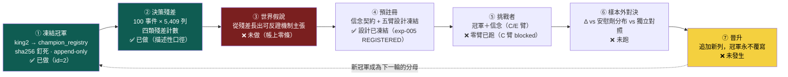

## 一、為什麼需要「現任冠軍」：把兩段敘事接回一條主線

前兩輪重構後的系統有一個沒被說破的尷尬：**它研究的東西跟 owner 真正下注的東西無關。** 信念契約結算的是 MIEE 漲價事件假說（B-H-001／B-H-003），而 owner 的真錢跑的是 king2——一條月頻營收動能策略。就算認知迴圈把一百條事件信念結算得再漂亮，只要沒有一條接到「king2 該不該改、怎麼改」，研究就只是在旁邊自轉。

「現任冠軍」制度一次解決三個問題：

- **「更好」有了定義。** 沒有冠軍，任何新策略的好壞只能對抽象基準（大盤、隨機）比；有了凍結冠軍，一切增量都是 Δ＝挑戰者 − 冠軍，同資料、同成本口徑、同窗。
- **研究問題有了天然的決策相關性。** [[hypothesis-engine|假說引擎]] 第二輪用 ResearchValue 的 DecisionRelevance 項防「研究不改變任何決策的問題」——但那一項是引擎自估的，可以吹。冠軍殘差不用估：**每一列殘差都是一筆真的虧掉或漏掉的錢**。「2609 陽明在候選池排 43 落選、隨後三週漲 133%」這個問題的決策相關性不需要任何人打分。
- **改進不會汙染基準。** 冠軍凍結且 append-only，挑戰者贏了也只能「追加新列」成為新冠軍，舊冠軍列永遠留著當歷史分母——不存在「悄悄改一個參數、回頭聲稱一直都這樣」的路。

## 二、冠軍是誰：king2 的精確規則（研究鏡像口徑）

冠軍不是一個名字，是一份逐字規則。真相源＝`/media/liao/MyHDD/舊機遷移資料/recursive_temporal_cognitive_grid/finlab_usage_guide/s994_str_enhanced.py`（`STR_king2` 於 line 49、`STR_king2_deploy` 於 line 171），且 `king2_deploy ≡ STR_king2(adv_floor=0.3, top_k=12, harden_gates=True)`。骨架如下（逐字條文已全文存入凍結列的 `rule_spec_json`）：

| 部件 | 內容 | 備註 |
|---|---|---|
| 分數（傾斜非過濾） | `score = 0.65 × rev + 0.35 × tilt` | rev＝月營收去年同月增減%的橫斷面百分位（`RK`＝`rank(axis=1, pct=True)`） |
| tilt 傾斜 | `(指紋 + 籌碼) / 2` | 2017 前集保缺資料時各分量 `.fillna(0.5)` 自動中性 |
| 指紋（5 分量等權） | 低券資比、低 60 日波動、120 日區間位置高、5 日均線偏離、5−20 日動能差 | `C_MI_MX_C(df,w) = (df−rolling_min)/(rolling_max−df+1e-10)`（區間位置比）；用**未還原收盤價**（只有 regime 覆蓋層用 `etl:adj_close`） |
| 籌碼（4 分量等權） | 集保結構：散戶佔比（<10 張、<5 張）下降、大戶（>1000 張）佔比上升 | 週頻集保 ffill 到日頻 |
| 品質/動能四閘（AND） | b1＝(ROE＋營益率＋淨利率百分位)/3 > 0.3（皆 `.deadline()` 防前視）；b2＝200 日區間位置門檻；b3/b4 逐字條文見真相源 | **除壞不選好**：閘只剔除，不加分 |
| 組合 | 過閘者按 score 取 top-12，月頻換股錨，`pre_days=5` 以碼為準 | 成本口徑（S_IND/RP）逐字入 `rule_spec_json` |

績效快照（**照抄官方口徑含出處，本管線尚未復算**，不可當本管線驗證數字）：king2 全史 Sharpe 2.843／CAGR 87.8%／Calmar 3.51／MDD −25.0%（s994 檔頭）；king2_deploy 現況全期 Sharpe 2.71／CAGR 81.4%／Calmar 3.48／MDD −23.4%（docstring 2026-07 對帳）；另有一組早期研究期＋f1.5 槓桿的 104%／5.74／−18.2，凍結列裡已明標「**勿當現況**」。

## 三、凍結怎麼做：champion_registry，冠軍永不覆寫

凍結不是「複製一份檔案」，是把冠軍的**身份**做成可重算的內容雜湊，釘進 append-only 帳：

- **表**：`data/aaro.sqlite` 的 `champion_registry`，append-only 觸發器鎖 UPDATE／DELETE（**實打過**，不是宣稱）。
- **凍結列**（id=2）：lineage＝`king2-freeze`、champ_id＝`CHAMP-king2-freeze-0850252de625`——這串 id **就是內容雜湊**（name＋version＋四檔 sha256＋規則全文，重算相等）；name＝「凍結版 king2（研究鏡像凍結・殘差資料集基準）」、version＝`deploy`、data_cutoff＝2026-07-22（finlab_db `price:收盤價` 末日）、frozen_at＝2026-07-22 22:33:29。
- **來源檔 sha256**：`s994_str_enhanced.py`＝`3b3bffd0c93e666b…`、`s0_basedata.py`＝`a401d8dc1eb32901…`、`s993_str_for_import.py`＝`01e9d2e91373c2a8…`、`DEPLOYMENT_SPEC.md`＝`fc81e60d2f077963…`。
- **冠軍永不覆寫**：晉升唯一的寫入方式是**追加新列**。任何人（包括引擎自己）都不能改動 id=2 那一列——想換冠軍，就得留下一列新的、帶自己內容雜湊的登記，歷史分母永遠可回查。

**誠實標記，不得省略：這是「研究帳上的冠軍鏡像」，不是真錢線本體。** 王牌真錢線（king-deploy 堆疊）對本研究帳**唯讀**——研究這邊凍結、殘差、對決、晉升，全部只發生在研究帳；真錢線一個位元都不動，晉升結論要進真錢永遠要過 owner 人核與 CA 閘。研究鏡像與真錢線之間已知的 **9 條鏡像差異**逐條記錄在 `engine/out/king2_residuals.json`——鏡像復算與官方口徑數字對不齊時，先查那 9 條，不要急著懷疑哪邊造假。

## 四、五角色：冠軍對決的完整棋盤

owner 給的制度不是「冠軍 vs 挑戰者」兩個角色，是五個——因為「挑戰者贏了」這句話要成立，得先排除兩種假贏（搜尋偏誤、複雜度紅利）：

| 角色 | 定義 | 存在的理由 | 對應 [[exp-005-king2-prereg]] 的臂 |
|---|---|---|---|
| **champion 現任冠軍** | 凍結版 king2，sha256 釘死、永不覆寫 | 一切 Δ 的分母；沒有它，「更好」無定義 | A 臂（本管線復算 Dev＋Val） |
| **placebo 安慰劑** | 冠軍＋**隨機內容**的假信念（同介面，seed 0..19 成分布） | 量出「隨便加一條信念也能碰運氣贏多少」的**搜尋偏誤地板**——挑戰者至少要贏過這個分布的 95 百分位 | B 臂 |
| **belief_augmented 信念增強** | 冠軍＋**已確認**（confirmed）的世界信念 | 主挑戰者：檢驗「世界知識」到底有沒有增量 | C 臂（目前 **blocked**：帳上零條 confirmed） |
| **independent 獨立對照** | 冠軍＋同等複雜度的**純價量**條件 | 歸因對照：把「世界知識的功勞」跟「多加一個濾網的功勞」拆開 | D 臂 |
| **challenger 挑戰者** | 有晉升資格的候選（本輪限 C／E 臂；E＝信念只控曝險/退出、不改選股，名單與 A 逐日相同） | 晉升門檻的受試者：連過五道門才能追加新列成為新冠軍 | C／E 臂 |

## 五、研究問題從冠軍長出：四條分支

有了冠軍，「今天研究什麼」不再從抽象的「最大未知」出發，而是從冠軍身上長出四條具體分支：

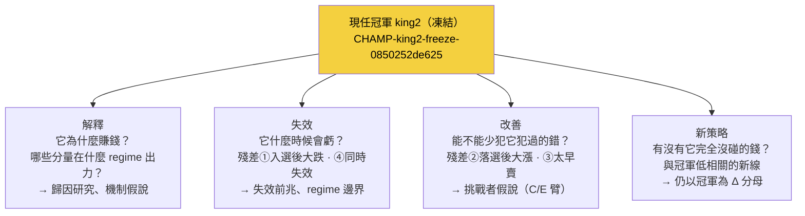

四條分支的優先序不是拍腦袋：**改善與失效兩支直接踩在殘差資料上**（每列都是真錢的錯），先走；解釋是它們的地基（不懂為什麼賺，就不知道哪些錯是本質的）；新策略最後（它連分母都還要借冠軍的）。這就是 [[hypothesis-engine|假說引擎]] 第三版「殘差優先、ResearchValue 退為補充」的制度來源。

## 六、殘差四格：冠軍真實決策的錯，逐列入帳

殘差＝把凍結冠軍在歷史上每一次月頻換股決策攤開，對照事後真實報酬（超額＝對加權報酬指數同窗），問四個問題。真實計數（**100 個換股事件、5,409 樣本列、候選池中位 51.5 檔、入選 1,200 列**；逐列資料集＝`engine/out/king2_residuals_dataset.parquet`，明細與 top-5 案例＝`king2_residuals.json`）：

| 殘差類 | 定義（描述性分位口徑） | 計數 | 最重具名案例 |
|---|---|---|---|
| **① 入選後大跌**（假陽性） | 入選列超額低於入選組 p10（−9.36%） | 120 列 | 3147 於 2026-06-10 以池內第 3 名入選，06-11→07-08 跌 −28.9%、超額 −35.5% |
| **② 落選後大漲**（漏網） | 候選池落選列超額高於 p90（+16.65%） | 362 列 | 2609 陽明 2020-12-10 在候選池排 43 落選（score 0.649 不進 top-12），12-11→01-05 漲 +133.6%、超額 +128.2%（航運超級週期） |
| **③ 選對但太早賣** | 入選且獲利出清後、至下輪進場前再漲超過 p75（+2.65%） | 300 列 | 1785 光洋科 2026-03-10 入選（池排 4），持有窗賺 +12.5%，出清後至下輪進場又漲 +41.4% |
| **④ 同時失效** | 單一事件的入選股**過半**負超額 | 25／100 事件（共 300 入選列） | — |

對應 [[exp-005-king2-prereg|實驗 005]] 預註冊的「殘差四格（選中×漲跌）」：長假說的來源限定在**做錯決策的兩格**——假陽性（選中且跌＝①）與漏網（沒選且漲＝②）；③屬持有層（接 [[fw-holding-lifecycle|持有期生命週期]] 的地盤）、④屬 regime 層。

一個已經浮出的機制線索（描述性，不是結論）：100 事件中 26 個發生在弱盤（0050<MA50），但 25 個「同時失效」事件裡**只有 2 個在弱盤**——集體失效多發生在**盤面健康時**。這說明弱盤風險已被 regime 覆蓋層另行減碼擋掉，**殘差集中在健康盤的選股本身**——這正是值得長出第一條世界假說的地方。

## 七、誠實邊界（不得省略）

- **主線七步只完成①②④三步。** 假說尚未從殘差長出（帳上零條）、C 臂 blocked（零條 confirmed 信念）、零個挑戰臂跑過、零次對決、零次晉升。本頁描述的是**制度**與**已凍結的地基**，不是已運轉的閉環。
- **殘差分類是描述性分位口徑，不是因果判定。** p10／p90／p75 門檻是入選組與候選池的經驗分位——移動門檻，計數就變。「120 列入選後大跌」讀作「有 120 個值得研究的錯」，不能讀作「king2 有 120 個 bug」。
- **績效快照是照抄，不是復算。** 三組官方口徑數字連出處抄進凍結列，本管線的 A 臂 Dev＋Val 復算尚未跑；復算對不齊時要先對那 9 條鏡像差異。
- **同一冠軍有兩個登記名。** 預註冊文件以 `CHAMP-king2-v1` 釘冠軍、凍結列（id=2）champ_id＝`CHAMP-king2-freeze-0850252de625`，兩者指向同一組來源檔 sha256（`3b3bffd0…`／`a401d8dc…`）。一個是人讀版本名、一個是內容雜湊——這條命名縫應該收斂成一條對照紀錄，目前尚未收斂，先明講。
- **研究帳的冠軍是鏡像，真錢線唯讀。** 本頁任何動詞（凍結、對決、晉升）都只發生在研究帳；王牌真錢線不因本制度自動改變任何一分部位。

延伸：五臂設計、晉升五道門與 blocked 誠實原因見 [[exp-005-king2-prereg|實驗 005]]；殘差怎麼變成研究問題見 [[hypothesis-engine|假說引擎]]；冠軍挑戰環怎麼疊在 W/O/B/P 主軸上見 [[research-loop|研究迴圈]]；信念的預註冊與到期對帳機件（本制度的④⑥兩步所依賴）見 [[world-belief-contract|信念契約]] 與 [[exp-004-belief-contract|實驗 004]]；三迴圈各自的裁判見 [[three-loops|三個迴圈]]。

## 附註一：冠軍登記帳的兩列（誠實正名）

2026-07-22 當日兩條平行工作線各自向 `champion_registry` 註冊了一列凍結 king2（append-only 不刪不改，照實留）：`CHAMP-king2-v1`（實驗 005 預註冊所引用的正名列）與 `CHAMP-king2-freeze-0850…`（殘差資料集的基準列，rule_spec 較完整）。兩列釘的是**同一組來源檔 sha256**（核心規則檔逐位相同），凍結物一致、無矛盾；日後引用以 `CHAMP-king2-v1` 為冠軍正名、freeze 列為殘差基準紀錄。

## 附註二：冠軍選對公司之後——載具層

冠軍制度回答「要不要看多這家公司」；選對之後「用什麼報酬形狀表達」是另一層決策，見 [[instrument-router|載具路由器]]（股票／權證／CB／CBAS 的路由原則）與 [[exp-006-cb-router-prereg|實驗 006]]（CB 載具路由第一實驗，構想級）。

---

<a name='instrument-router'></a>
# 〔instrument-router〕載具路由器：king2 決定看多誰，路由器決定用什麼報酬形狀表達

這一頁承載 owner 對「多載具」的核心鐵律，先把它一字不差地立起來：**king2 回答的問題是「要不要看多這家公司」；載具（股票／權證／CB／CBAS）回答的是「用什麼報酬形狀表達這個信念」。這是兩個不同的問題，四種商品不得混進同一個選股分數。** 載具路由器（Instrument Router）永遠站在 [[champion-challenger|冠軍 king2]] 選出標的**之後**——它不改名單、不改信念，只改表達方式。

> **認知答案**：選股與選載具是兩層獨立決策。第一層（king2）產出「對哪些公司、多強的看多信念、什麼時窗」；第二層（路由器）拿著這個信念分布，去每種載具的**條款與市況**下估「表達這份信念的淨效用」，選效用最高者。把 CB 折價、權證隱波、CBAS 槓桿倒進選股分數裡，會讓「公司好不好」跟「這張紙划不划算」互相汙染——那正是舊 CB 研究線用 #73 實驗證明過的死路（CB 選股 alpha＝動能換皮，FALSIFIED，詳見 [[cb-cbas]]）。
>
> **行動答案**：目前**路由器本體一行代碼都不存在**，存在的是它的地基：king2 凍結在 `champion_registry`（[[champion-challenger]]）、851 檔 CB 活面板每天更新、下單 app 已有「權證模式」證明「標的→衍生品映射＋權重沿用」可行（[[order-execution-ui]]）。owner 已裁決的推進順序＝①凍結股票冠軍 → ②建 CB 完整 PIT 條款行情 → ③先測「股票 vs CB」二載具路由 → ④再測 CB 市場當 king2 新資訊特徵 → ⑤最後才拆 CBAS 兩端 → ⑥權證只作短時窗催化劑支線。實驗設計見 [[exp-006-cb-router-prereg]]。

## 一、K→D→U→V→R：路由器的完整資料流

owner 給的路由器不是一個 if-else，是一條五站管線。K（冠軍信念）在最上游、R（路由決策）在最下游，中間三站各自獨立可驗證：

```mermaid
flowchart TB
    K["K 冠軍信念<br/>king2 凍結規則選出標的<br/>（要不要看多這家公司）<br/>✅ 已凍結：champion_registry id=2"]
    D["D 信念分布<br/>不只『看多』一個 bit：<br/>強度×時窗×確信度×下行容忍<br/>❌ 未建：目前 king2 只輸出 top-12 名單＋權重"]
    U["U 載具全集<br/>該標的當下可用的表達工具：<br/>股票｜權證｜CB｜CBAS兩端<br/>⚠️ 半建：CB 活面板有、權證評分器有、CBAS 全缺"]
    V["V 條款估值<br/>每載具在其條款下的淨報酬形狀：<br/>債底/轉換價/隱波/時間價值/流動性<br/>⚠️ 半建：CB 六維覆蓋見 cb-cbas 頁"]
    R["R 路由決策<br/>max InstrumentUtility<br/>（不是 max 槓桿）<br/>❌ 未建：零代碼"]
    K --> D --> U --> V --> R
    R -.->|"預設退路：資料不足 → 股票"| STOCK["股票＝預設載具"]
    style K fill:#0f5c52,color:#fff
    style D fill:#7a1f1f,color:#fff
    style U fill:#8a6d1a,color:#fff
    style V fill:#8a6d1a,color:#fff
    style R fill:#7a1f1f,color:#fff
```

五站各自的責任邊界：

- **K（冠軍信念）**：king2 的凍結規則產出「看多誰」。路由器對 K **唯讀**——任何路由結果都不得回流去改選股名單，否則兩層又混回一鍋。
- **D（信念分布）**：把「看多」展開成有形狀的信念：多強（分數距離門檻多遠）、多久（月頻換股窗 vs 事件催化時窗）、多確信（歷史同型事件的命中分布）、能吞多少下行。**這一站是目前最大的概念缺口**——king2 今天只給名單與權重，沒有給分布；沒有 D，路由器只能退化成「全部買股票」。
- **U（載具全集）**：逐標的枚舉當下真的存在、真的能成交的表達工具。注意是「這檔公司此刻有沒有活著的 CB／權證／可承作的 CBAS」，不是理論上的四選一——台股多數標的**只有股票一種載具**，路由器多數時候無事可做，這是常態不是缺陷。
- **V（條款估值）**：對每個候選載具，在**它自己的條款**下算報酬形狀：CB 要算債底與轉換溢價（[[cb-cbas]] 三式）、權證要算隱波與時間價值衰減、CBAS 要算權利金與提前終止條款。條款資料不足＝該載具直接出局，不得用假設值硬估（fail-closed）。
- **R（路由決策）**：用下一節的效用函數比大小。**預設退路永遠是股票**——股票是唯一無條款、無到期、無對手方的載具，任何一站資料不足都應塌縮回股票。

## 二、效用函數：InstrumentUtility，四個懲罰項缺一不可

路由決策的比較基準是同一個效用函數：

```
InstrumentUtility = E[條款後淨報酬]
                  − 風險懲罰（下行形狀：權證歸零風險、CB 信用風險）
                  − 流動性懲罰（成交得掉嗎：CB 僅 61–75% 日成交、權證靠造市商報價）
                  − 估值不確定懲罰（條款資料缺多少、模型假設多重）

CBAS 兩端在上式之外再扣三項：
                  − 交易對手懲罰（店頭契約，對手是券商不是交易所）
                  − 契約不透明懲罰（條款逐案議定，無公開標準）
                  − 提前終止懲罰（券商可依契約提前終止，路徑依賴）
```

三件事必須說破：

1. **「路由器不是選槓桿最高。」** 這句是 owner 的原話等級紅線。權證與 CBAS 選擇權端的 E[報酬] 項在看對時遠大於股票，但四個懲罰項（尤其估值不確定與流動性）會把大多數情境的效用打回股票之下。一個只看第一項的路由器＝一台自動買權證的賭博機。
2. **估值不確定懲罰是 fail-closed 的數學形式。** 缺賣回價→債底估不出→CB 的估值不確定懲罰趨近無限大→路由塌回股票。這讓「資料缺口」自動變成「不路由」，而不是「硬估後路由錯」。
3. **懲罰項的權重是研究對象，不是拍腦袋常數。** [[exp-006-cb-router-prereg]] 的設計就是先預註冊懲罰結構、再用歷史數據回填量級——順序不能反。

## 三、五載具對照：本質、適合的信念、主要代價

| 載具 | 本質 | 適合表達的信念 | 主要代價 |
|---|---|---|---|
| **股票** | 公司所有權，線性報酬，無到期日 | 預設載具：中長期看多、時窗不確定、要吃股息與長尾 | 資金占用 100%；下行無地板（跌多少賠多少） |
| **權證** | 交易所掛牌的短天期選擇權，時間價值每天流失 | **短時窗、有明確催化劑、方向確信度高**的信念（見第五節：僅作支線） | 時間價值衰減；深價外歸零；隱波由發行商定價；到期日硬切 |
| **CB（可轉債）** | 信用調整債底＋轉換選擇權（拆解見 [[cb-cbas]]） | 看多但要下行地板：「漲我跟、跌我退回債底附近」的凸性信念 | 轉換溢價（買貴選擇權）；流動性差（僅六至七成日成交）；債底依賴發行人償債能力 |
| **CBAS 選擇權端** | 把 CB 拆開後的純轉換選擇權，權利金≈CB 市價−債底 | 極高確信、願付權利金換高槓桿、且接受店頭對手風險的信念 | 權利金歸零風險；店頭契約三重懲罰（對手／不透明／提前終止）；無公開行情 |
| **CBAS 固定收益端** | 把 CB 拆開後的債底現金流，收固定收益、讓渡轉換權 | 不看多股價、只賺信用利差的信念——**與 king2 的看多信念正交**，基本不在路由範圍 | 承擔發行人信用風險；流動性鎖死到期；同樣是店頭契約 |

讀表的方式：五行不是五個平行選項。股票是地板，CB 是「付溢價買凸性」，權證是「付時間價值買短爆發」，CBAS 兩端是「付店頭三重懲罰把 CB 的凸性拆到極致」。**沿表往下走，每一行都是拿更多懲罰項去換更尖的報酬形狀**——路由器的工作就是判斷 D 站的信念形狀值不值得付這個交換。

## 四、什麼情況 CB 比股票適合：八列情境

「CB 優於股票」不是 CB 便宜（折價）就成立——那是折溢價套利的思路，已判死（見 [[cb-cbas]] 已判死清單）。CB 勝出的條件是**信念形狀**與 CB 的凸性對得上：

| # | 情境 | 為什麼 CB 較適合 | 前提條款 |
|---|---|---|---|
| 1 | 看多但公司波動極大，下行超出容忍 | 債底提供地板，凸性「漲跟跌不跟」 | 債底可信（信用無虞＋賣回價可算） |
| 2 | 信念時窗長於權證壽命、短於永久持有 | CB 存續期 3–5 年，介於權證與股票之間 | 距到期／賣回日還有足夠時間價值 |
| 3 | 轉換溢價率低（CB 市價貼近轉換價值） | 幾乎用股票的價格買到「股票＋地板」 | 溢價率低不是因為流動性死水造成的假價 |
| 4 | 正股接近轉換價、Delta 在中段（0.3–0.7） | 凸性最值錢的區段：上行開始跟、下行還有墊 | Delta 口徑用實證分箱（px2delta）非純 BS |
| 5 | 預期有下修轉換價事件 | 下修＝選擇權履約價免費調低，股票拿不到這個 | 需追蹤 `cb_reset_distance` 與公司下修動機 |
| 6 | 大盤 regime 走弱但個股信念仍在 | 股票端會被 regime 閘減碼；CB 天然自帶減碼形狀 | 與 [[order-execution-ui]] 的 regime 閘互動需先定義清楚 |
| 7 | 賣回日近且賣回收益率為正（YTP>0） | 最壞情境變成「持有到賣回收年化正報酬」 | **賣回價資料——正是目前最大缺口，此列今天算不出來** |
| 8 | 部位大到股票市場衝擊成本可觀 | CB 另一個池子分流（但 CB 池更淺，僅限中大型券） | 需查該檔 CB 日成交額；多數 CB 比正股更淺 |

誠實邊界：**這張表是路由器的假說清單，不是已驗證結論。** 八列裡每一列都要在 [[exp-006-cb-router-prereg]] 的框架下逐列變成可反證的實驗；尤其第 7 列在歷史賣回價資料源補齊之前根本不可測。

## 五、權證：短時窗催化劑支線，不是月頻預設替代

權證在這套系統裡被明確**降級為支線**：它不參與月頻換股的預設路由，只在「明確催化劑＋短時窗＋高確信」三條件同時成立時作為戰術表達。理由有三：

- **時間結構對不上。** king2 是月頻持有策略，權證的時間價值衰減按日計費——拿按日燒錢的工具去表達按月結算的信念，衰減成本直接吃掉月頻信念的期望值。
- **定價權在對面。** 權證隱波由發行商報價，散戶端沒有隱波談判力；造市品質參差是證交所自己列名的風險之一。
- **歸零是常態結局。** 深價外權證到期歸零，「看對方向、看錯時點」在權證上是全損，在股票上只是套牢。

下單系統現況（誠實歸戶）：王牌下單 app 已有可跑的權證模式（權證模式：每檔標的映射到 權證評分器 評分最高的認購權證、權重沿用、走同一個 送單漏斗（唯一送單函式） 送單漏斗，見 [[order-execution-ui]]）——**這是「標的→衍生品映射」的工程存證，不是權證支線已被驗證有效的證據**。催化劑判定、時窗控制、隱波過濾，全部未建。

官方風險來源（證交所）：

https://twse-regulation.twse.com.tw/m/LawContent.aspx?FID=FL007293

https://shl.twse.com.tw/page/land/commodity/4.html

（前者為證交所認購（售）權證風險預告書樣本之法規頁；後者為證交所宅在家學習網的權證投資風險教材。兩連結 2026-07-22 驗證可開；證交所權證教育宣導舊網址已隨官網改版失效，故以此二頁為準。）

## 六、兩條研究線，嚴禁互相汙染

CB 相關研究只有兩條合法路線，路由器只屬於第一條：

```mermaid
flowchart LR
    subgraph LINE1["研究線 1：CB_as_instrument（載具替代）"]
        A1["king2 選出標的"] --> B1["路由器：股票 or CB？"] --> C1["裁判＝同一信念下<br/>條款後淨報酬形狀比較"]
    end
    subgraph LINE2["研究線 2：CB_as_information（資訊特徵）"]
        A2["CB 市場狀態<br/>（cb_delta／溢價壓縮／下修事件）"] --> B2["當 king2 的新資訊特徵"] --> C2["裁判＝king2 增量<br/>（Δ vs 冠軍，走 exp-005 五臂框架）"]
    end
    LINE1 -.->|"禁止：路由結果回改選股分數"| X["✗"]
    LINE2 -.->|"禁止：資訊特徵偷渡成選券理由"| X
    style X fill:#7a1f1f,color:#fff
```

- **線 1（載具替代）**：名單不變，問「這個信念用 CB 表達會不會更好」。裁判是報酬形狀比較，實驗場在 [[exp-006-cb-router-prereg]]。
- **線 2（資訊改善）**：CB 市場整體狀態（全市場 cb_delta、溢價壓縮、下修潮）當成 king2 的**候選新特徵**，問「加了它，冠軍的樣本外增量是多少」。裁判是 Δ vs 冠軍，必須走 [[champion-challenger]] 的五臂對決框架，不得另立山頭。
- 兩線共用資料（同一批 CB 面板與條款），**不共用結論**：線 1 成立不代表線 2 成立，反之亦然。舊研究線的教訓正是把兩線混在一起——「CB 折價」既被當選券理由又被當市場訊號，最後兩頭都證偽。

## 七、已有 vs 缺口：路由器的誠實資產負債表

| 部件 | 已有 | 缺口 |
|---|---|---|
| K：冠軍信念 | king2 凍結（champion_registry id=2，sha256 釘死） | — |
| D：信念分布 | 無 | 全缺：king2 只出名單＋權重，強度／時窗／確信度分布未定義 |
| U：載具枚舉 | CB 活面板 851 檔每日更新；下單 app 權證評分器 評分器 | CBAS 可承作性零資料；「哪檔標的有活 CB」的映射表未固化 |
| V：條款估值 | CB 六維中三維全套、兩維半套（詳表在 [[cb-cbas]]） | 歷史賣回價無源→債底時序不可得；權證隱波史未收；CBAS 十項承作資料全缺 |
| R：路由決策 | 無 | 全缺：效用函數零代碼，懲罰權重零校準 |
| 執行腿 | 送單漏斗（唯一送單函式） 漏斗載具無關；權證模式已跑通 | CB 能否直接走 主券商 API 的股票合約腿**未查證**（面額 10 萬／單位不同）；CBAS 無 API、券商櫃檯業務 |

下一步唯一合法入口＝[[exp-006-cb-router-prereg]]：先預註冊「股票 vs CB」二載具路由的判準與懲罰結構，在賣回價資料源補齊之前，只做不依賴債底時序的那部分。

相關頁：[[champion-challenger]]｜[[cb-cbas]]｜[[order-execution-ui]]｜[[exp-006-cb-router-prereg]]

---

<a name='cb-cbas'></a>
# 〔cb-cbas〕CB 與 CBAS：債底加選擇權的合體，與拆開賣的兩端

這一頁是 [[instrument-router|載具路由器]] 的商品知識層：把可轉債（CB）與可轉債資產交換（CBAS）拆到機制見骨，並對這台機器上**已經存在的厚重 CB 遺產**做誠實歸戶。先立一件事：**CB 研究在這裡不是從零開始——它是一條已有定版判決的研究線（含一張今天還在每日更新的 851 檔活面板），而且有一份已判死清單。** 本頁任何規劃都必須先過這兩關：已有的不重蓋、判死的不重跑。

> **認知答案**：CB ≈ **信用調整債底 ＋ 轉換選擇權**。一張紙同時是「發行人欠你錢的債」與「用約定價格換股票的權利」，它的報酬形狀因此是凸的——正股漲時像股票、跌時退向債底。CBAS 則是把這兩個成分**拆開賣給兩種人**的店頭契約：固定收益端拿債底現金流、選擇權端花權利金拿轉換權。拆開後各自的本質都變純了，但代價是從交易所商品變成券商櫃檯契約——多出交易對手、契約不透明、提前終止三重風險。
>
> **行動答案**：路由研究的順位裡（見 [[instrument-router]]），CB 排第 2–4 步、CBAS 排最後第 5 步。CB 端曾經的**唯一致命缺口＝歷史賣回價**現在已實質補上——賣回價其實是每日面板 2009→2026、956/1,803 檔曾有值，已建 `data/cb_putprice.sqlite`，債底時序（債底＝PV(賣回價)）做得出來（見 [[exp-006-cb-router-prereg]]）；殘留限制是折現率單一假設與嚴格 PIT 只 2023-12 起，仍待清。CBAS 端＝零代碼、零資料源、零通路，規劃文件已裁決**觀察區**：在十項承作資料拿到之前，只能做理論研究，不得宣稱可部署。

## 一、CB 的解剖：一張紙、兩個成分、三條公式

```mermaid
flowchart TB
    CB["CB 可轉換公司債<br/>面額 NT$100,000／報價以面額100為基準"]
    CB --> BOND["債底成分<br/>發行人承諾：到期還本、<br/>期中可按賣回價賣回<br/>價值＝未來現金流折現<br/>（折現率＝無風險利率＋信用利差）"]
    CB --> OPT["轉換選擇權成分<br/>權利：按轉換價把債換成股票<br/>價值隨正股價、波動、剩餘期限變動"]
    BOND --> FLOOR["債底＝下行地板<br/>（前提：發行人還得出錢）"]
    OPT --> UP["凸性上行<br/>（正股漲，CB 跟漲）"]
    FLOOR --> SHAPE["合體報酬形狀：<br/>漲時像股票、跌時退向債底"]
    UP --> SHAPE
    style CB fill:#0f5c52,color:#fff
    style SHAPE fill:#8a6d1a,color:#fff
```

三條公式（全線通用口徑，台灣 CB 面額 10 萬、報價以面額 100 為基準）：

```
轉換比率   ＝ 面額 ÷ 轉換價                    （一張 CB 能換幾股）
轉換價值   ＝ 正股股價 × 轉換比率              （現在就換股，值多少）
轉換溢價率 ＝ CB 市價 ÷ 轉換價值 − 1           （為凸性多付了幾成）
```

一個真實量級的例子（示意數字）：轉換價 50 元的 CB，轉換比率＝100,000÷50＝2,000 股；正股 45 元時轉換價值＝45×2,000＝90,000（報價口徑 90）；若 CB 市價 102，轉換溢價率＝102÷90−1≈13.3%——你為「跌有地板」這個保險多付了 13.3%。路由器（[[instrument-router]]）判斷 CB 是否優於股票，本質上就是在判斷**這筆保費划不划算**。

## 二、六維欄位：描述一張 CB 需要哪些資料

| 維度 | 內容 | 為什麼路由器需要它 |
|---|---|---|
| 股票選擇權 | 轉換價、轉換比率、Delta、隱含波動、下修條款距離 | 決定「漲時跟多少」 |
| 債券價值 | 債底（賣回價／到期值折現）、YTP 賣回收益率、票面利率 | 決定「跌時墊多高」 |
| 發行條款 | 轉換起迄、賣回權起迄與**賣回價**、強制贖回條件、發行餘額 | 條款事件（下修／強贖／賣回）直接改變報酬形狀 |
| 市場品質 | 日成交張數／金額、報價新鮮度、買賣價差、持有集中度 | 成交不掉的效用是紙上效用 |
| 公司風險 | 發行人信用（償債能力、負債結構） | 債底的成色：信用出事，地板消失 |
| 時間狀態 | 距到期日、距賣回日、距強贖觸發、剩餘存續期 | 同一張 CB 在生命週期不同段是不同商品 |

## 三、六維現況覆蓋：這台機器已經有什麼（偵察定版，2026-07-22）

| 維度欄位 | 覆蓋 | 現況明細 |
|---|---|---|
| 轉換比率／轉換價 | ✅ 全套 | finlab `cb_published_info` 每日面板：1,803 檔 CB、2009→今、含逐日轉換價與下次生效日（可追下修史）；今天 20:03 剛更新 |
| 轉換溢價 | ✅ 全套 | 同表有轉債參考價＋標的股價＋轉換價，逐日溢價面板現成算法已存在（舊實驗 exp_cb_arb_feasibility 寫過） |
| Delta | ✅ 兩套 | 實證分箱 px2delta（#104 研究：CB 價格分箱對正股實測 delta 0.15→0.88）＋ BS 連續 delta／overhang／下修距離（BS 連續 delta 實作） |
| 債底 | ✅ **可算（帶 caveat）** | **時序做得出來了**：PV(賣回價) 計算範本存在，且歷史賣回價已補齊——賣回價其實是每日面板 2009→2026、956/1,803 檔曾有值（見 [[exp-006-cb-router-prereg]]），已建 `data/cb_putprice.sqlite`。債底＝PV(賣回價) 的歷史時序因此可算。兩個限制：折現率是單一假設（非市場推導、信用維度全缺）、嚴格 PIT 只 2023-12 起（之前為重建、未對 TPEx 歷史檔對帳） |
| 條款 | ⚠️ 大半（賣回價已補） | 轉換價／轉換賣回強贖起迄／餘額／票面利率齊；**賣回「價格」已補**——偵察抽查誤判「僅 3/86 檔有值」，實為每日面板 2009→2026、956/1,803 檔曾有值，已建 `data/cb_putprice.sqlite`（見 [[exp-006-cb-router-prereg]]）；仍缺條款全文層（下修公式、擔保與否） |
| 流動性 | ✅ 全套 | twdata 鏡像 CB 量價七欄（開高低收／張數／筆數／金額）2007→今；P2 可交易性 harness 六指標（新鮮度／死券尾／價差 proxy／HHI／容量掃描）已寫好 |

三個補充誠實標記：

- **價格面板是活的**：851 檔 CB 日收盤面板 2021→今天，掛在真錢線日終排程 增量更新（它是真錢線 真錢線監看行程 的 live 依賴——研究要改抓取邏輯請另起腳本複用 URL pattern，勿動原檔）。
- **PIT 要分段誠實**：`cb_published_info` 的爬取時戳只從 2023-12 起有佐證；之前的歷史段是回填，嚴格 PIT 實驗要對 TPEx 歷史每日檔抽查對帳後才能用。
- **第七維（信用）全缺**：無 TCRI／信評資料（付費品、無免費源）、無台灣公債殖利率曲線、無個券信用利差——債底就算補齊賣回價，折現率端仍是假設值。可行替代＝用財報負債／償債欄位自建信用 proxy。

## 四、債底不是保證

「跌有地板」這句話有四個前提，每一個都可能失效，寫在這裡防止任何後續研究把債底當成無風險下限：

1. **地板站在發行人的償債能力上。** 發 CB 的常是中小型上櫃公司；公司出事時，債底跟著股價一起塌。舊研究線做過誠實檢查（消失券最後價分布、不 clip 的違約尾版本回測）——**重跑任何 sleeve 類回測必須帶上這兩個檢查**，否則就是在 survivorship 淨化過的樣本上自欺。
2. **地板的位置今天算不準。** 債底＝PV(賣回價)。歷史賣回價已補（956 檔 2009→2026，見 [[exp-006-cb-router-prereg]]），但折現率端仍缺曲線（單一假設折現率、信用維度全缺）——目前債底數字是「賣回價＋假設折現率」的近似，不是信用調整後的精確值。
3. **地板附近沒有成交量。** CB 只有六至七成的日子有成交；價格跌向債底時往往正是流動性蒸發時，帳面地板 ≠ 賣得掉的地板。停滯報價已被舊審計證實會把 CB 報酬平滑度**高估約 3 倍**——任何用收盤面板算的風險數字都要配次筆成交標價法重估。
4. **地板可以被條款移走。** 強制贖回觸發後發行人可贖回，持有人被迫在時窗內轉換或被贖，凸性戛然而止。

## 五、已判死清單（勿重跑）

舊 CB 研究線留下的定版判決。這張表的存在意義＝**任何新實驗撞到同型設計時，直接引用判決、不重新燒算力**：

| 假說 | 判決 | 理由摘要 |
|---|---|---|
| CB 選股 alpha（用 CB 指標選正股） | **FALSIFIED**（#73） | 動能換皮：控制正股動能後增量歸零 |
| CB 折溢價套利 | **判死** | 折價 >3% 且可成交的機會每年個位數，容量玩具級 |
| CB 債券區 sleeve（價 90–110 等權） | **PASS_SIGNAL_ONLY** | 凸性分散為真（真實標價下 beta≈0.04、2022 仍正），但招牌平滑被停滯報價放大 ~3×；當年淨 carry 因「賣回價幾乎全缺」無法證實——**註：該前提已被 [[exp-006-cb-router-prereg]] 推翻**（賣回價實為 956/1,803 檔可得、非「83/86 缺」），淨 carry 現可重驗，惟本 sleeve 判決尚未據此重跑 |
| 三投降合流 timing（離高×外資×CB 投降） | **FORWARD_WATCH** | 僅 7 個獨立 episode，樣本太小，只准前瞻觀察 |
| CB 生命週期研究 | **描述層歸宿** | 事件標籤（強贖／賣回／下修等 7 型）映射回正股當描述用途，不是 alpha |

sleeve 那行要多讀一遍：SIGNAL_ONLY 的意思是「訊號成分被證實、可交易性未被證實」——升級成 PASS_TRADABLE 的路線圖已寫在舊判決書裡（floored 45 檔、每日真實標價 mark、跑 3–6 個月前瞻紙上實單），**那個前瞻實驗至今未啟動**，帳上的 holdings 快照是 2026-06-26 的一次性輸出，不是在跑的實驗。

## 六、兩條研究線分開走（與路由器共用的紅線）

- **CB_as_instrument（載具替代）**：king2 名單不變，問「這個信念改用 CB 表達是否更好」。裁判＝條款後淨報酬形狀。入口＝[[exp-006-cb-router-prereg]]。
- **CB_as_information（資訊特徵）**：全市場 CB 狀態（cb_delta、溢價壓縮、下修潮）當 king2 的候選特徵，問「冠軍加了它的樣本外增量」。裁判＝Δ vs 冠軍，走 [[champion-challenger]] 五臂框架。
- 兩線共用資料、不共用結論；已判死清單對兩線同時生效（第一線不得復活折溢價套利、第二線不得復活 CB 選股 alpha）。

## 七、CBAS：把 CB 拆成兩端的店頭契約

```mermaid
flowchart LR
    CB["一張 CB<br/>（債底＋轉換選擇權）"]
    CB -->|"券商拆解"| FI["固定收益端<br/>本質＝債底現金流<br/>買方：收固定收益，<br/>承擔發行人信用風險，<br/>讓渡轉換選擇權"]
    CB -->|"券商拆解"| OP["選擇權端<br/>本質＝純轉換選擇權<br/>買方：付權利金<br/>（≈CB市價−債底），<br/>高槓桿曝險正股上行"]
    FI -.-> OTC["店頭契約紅線：<br/>交易對手＝券商<br/>條款逐案議定<br/>可提前終止<br/>無公開行情、無 API"]
    OP -.-> OTC
    style CB fill:#0f5c52,color:#fff
    style OTC fill:#7a1f1f,color:#fff
```

兩端各自的本質：

- **固定收益端**：買方等於「買了發行人的信用、賣了轉換選擇權」。報酬＝固定收益（高於同天期定存的利差），風險＝發行人違約。它與 king2 的看多信念**正交**——路由器基本不會路由到這端，它存在的意義是讓選擇權端有人接債底。
- **選擇權端**：買方付權利金（約等於 CB 市價超出債底的部分）取得轉換選擇權，等於**把 CB 的凸性用幾倍到十幾倍的槓桿買下來**。看對時報酬率遠超正股；看錯時權利金全損。它是台灣市場最接近「長天期個股選擇權」的工具——這也是它在路由器順位裡被放到**最後一步**的原因：報酬形狀最尖、但契約風險最厚。

**店頭契約紅線**：CBAS 不在交易所掛牌，是券商櫃檯業務。這代表三件在交易所商品上不存在的事——你的對手是券商本身（交易對手風險）、契約條款逐案議定且無公開標準（不透明）、契約可依約定提前終止（路徑依賴）。[[instrument-router]] 的效用函數對 CBAS 額外扣的三個懲罰項，對應的就是這三條。

### 承作資料十項清單（缺一＝只能理論研究，不得宣稱可部署）

任何「CBAS 可以怎麼用」的研究，在寫下結論前必須逐項確認以下十項**真實承作資料**是否在手：

1. 承作券商（誰真的做這筆）
2. 報價時間戳（報價存在於哪個時刻）
3. 權利金（真實報價，非理論值）
4. 名目本金與最小承作單位
5. 到期日與提前終止條款
6. 結算方式（現金／實物、觸發條件）
7. Greeks 的輸入參數（券商用什麼波動率與利率報的價）
8. 費用與買賣價差
9. 交易對手與其信用條件
10. 當時可承作性（那個時點券商是否真的接單）

**CBAS 現況＝零代碼、零資料源、零通路，十項全缺。** 規劃文件已裁決進**觀察區**、不建假卡；升格條件寫死＝拿到賣回價資料源＋券商 CBAS 承作通路（CBAS 無 API，通路只能是券商櫃檯）。在那之前，本 wiki 關於 CBAS 的一切內容都是機制描述，不是可部署能力。

## 八、交易制度與官方來源

台灣 CB 的交易制度基本盤：面額 10 萬元為一交易單位、報價以面額 100 為基準、除息交易、漲跌幅比照股票；委託人初次買賣轉換公司債應簽具風險預告書（專業機構投資人除外）。

官方來源（皆 2026-07-22 驗證可開）：

證交所轉換公司債買賣辦法（含風險預告書規定與交易單位條文）：

https://twse-regulation.twse.com.tw/m/LawContent.aspx?FID=FL007146

櫃買中心 CB 每日行情（轉（交）換公司債個別債券日資訊）：

https://www.tpex.org.tw/zh-tw/bond/info/statistics-cb/day-quotes.html

櫃買中心每日行情 CSV 直抓源（cp950 編碼、民國年、含等價＋議價兩軌 OHLC／筆數／金額，已實抓驗證；`{Y}/{YM}/{YMD}` 代日期）：

https://www.tpex.org.tw/storage/bond_zone/tradeinfo/cb/{Y}/{YM}/RSta0113.{YMD}-C.csv

櫃買中心衍生性商品交易資訊儲存庫（日交易資訊，含資產交換選擇權端交易行情報表——CBAS 端唯一的公開統計窗口）：

https://www.tpex.org.tw/zh-tw/derivative/tpex-derivative/statistics/tr/day.html

轉換公司債承銷與衍生性商品交易法令遵循宣導（櫃買中心法遵教材，證基會載點 PDF；內含發行公司內部人 CBAS 交易之禁止規範）：

https://webline.sfi.org.tw/download/edd_ftp/webDoc/(%E5%9B%9B)%E8%BD%89%E6%8F%9B%E5%85%AC%E5%8F%B8%E5%82%B5%E6%89%BF%E9%8A%B7%E8%88%87%E8%A1%8D%E7%94%9F%E6%80%A7%E5%95%86%E5%93%81%E4%BA%A4%E6%98%93%E6%B3%95%E4%BB%A4%E9%81%B5%E5%BE%AA%E5%AE%A3%E5%B0%8E.pdf

相關頁：[[instrument-router]]｜[[champion-challenger]]｜[[exp-006-cb-router-prereg]]｜[[order-execution-ui]]｜[[discipline]]

---

<a name='order-execution-ui'></a>
# 〔order-execution-ui〕下單執行與作戰 UI：從訊號到真單的協調機制（全系統零自動送單）

這一頁描述研究線的最末端：信念如何變成真實資金部位。前面所有頁在講「研究怎麼產生可信的決策」，這一頁講「決策怎麼安全地變成券商委託單」。它存在的目的是讓檢視的 LLM 能審這套**協調設計**——因為 [[instrument-router|載具路由器]] 若讓 CB 進入實盤，CB 腿要掛的就是這條鏈，而這條鏈目前是為股票（與權證）設計的。

> **認知答案**：這套執行系統的本質是「一條收斂的漏斗＋一串只會擋不會衝的閘」——所有真單收斂到唯一一個送單函式，函式之前排一串閘，每道閘只有兩種失效方向：fail-closed（資料有問題就不出單）或 fail-soft（只減碼、不阻擋），而且**全系統沒有任何自動送單路徑**，排程只產建議與推播，真單必經人手兩段擊發。
>
> **行動答案**：檢視這一頁時，請把注意力放在「多載具加入後哪些閘的假設會破」——容差閘以股數為單位、四方對帳以股票庫存為口徑、風險倍率作用在單一資金池，這三個假設在 CB 腿加入後都需要泛化，具體問題列在頁尾。

**去識別化聲明**：本頁一律用角色名——「作戰台」＝唯讀聚合看板、「下單 app」＝唯一會碰券商寫入的行程、「送單漏斗」＝唯一送單函式、「主券商／監看券商」＝兩家實體券商的角色。不含部署位址、埠號、檔名與服務名；檢視協調邏輯不需要那些。

## 雙塔分工：看的行程與送的行程物理分離

系統由兩個常駐行程組成，職責以「會不會碰券商寫入」一刀切開：

- **作戰台（唯讀聚合看板）**：聚合健康燈號（市場 regime／策略衰減／資料新鮮度）、建議單、委託回報、帳務庫存、四方對帳與淨值卡。它**絕不引入下單模組**——程式層面就不具備送單能力；使用者在作戰台按的任何下單動作，都只是經一層帶驗證的代理轉發給下單 app，作戰台自己永遠送不出單。
- **下單 app（唯一寫入行程）**：持有券商連線，負責產生建議單、試算、真送、改價、刪單與回報查詢。全部 API 都有存取憑證閘。平時以 API 金鑰登入券商，這種登入**只有唯讀能力**（查庫存／報價／委託）；真送需要另外啟用交易憑證（見閘鏈）。
- **送單漏斗（唯一送單函式）**：所有真單——不論股票整張、盤中零股、盤後零股、權證——最終收斂到同一個函式，只有 `dry_run=False` 才真送。**試算路徑恆為 dry_run**，UI 上的「試算」按鈕在程式上不可能變成真送。

這個分工的取捨：看板可以放心加功能、放心壞，因為它壞掉的最壞結果是「看不到」，不是「送錯單」。

## 訊號怎麼變成目標部位

上游是 [[champion-challenger|現任冠軍策略]] 的回測部位（月頻換股、停損後部位），換算成每檔權重。之後三步：

1. **籃子凍結鎖**：換股窗內凍結籃子的代號與權重，凍結粒度已下沉到「本窗已建股數」——窗內不因價格波動重算目標，防止日內漂移引發反覆進出。
2. **券商庫存差額**：目標市值（部署資金 × 權重）對照券商實際庫存，差額才產生買賣建議單。系統對帳的是券商回報的真實庫存，不是自己記的帳。
3. **容差閘（防 churn）**：差額市值小於「目標市值 1% 與一個小額門檻取大者」就視為已達成、不出單；容差內的零股微修賣單一律不產生（零股當日不可回補，微修反而製造風險）。

## 閘鏈：真單之前的每一道閘（依序）

| # | 閘 | 性質 | 行為 |
|---|---|---|---|
| 1 | 存取憑證閘 | 硬擋 | 下單 app 全部 API 需存取憑證；作戰台的代理入口自行驗證、不自動補發（防區網內的偽造請求直達送單端點） |
| 2 | regime 閘 | **fail-closed 硬擋** | 大盤代表 ETF 收盤價對自身 50 日均線，只用決策時點之前的資料（無前視）。資料取不到、歷史不足、或最新收盤距決策超過 7 個日曆天 → **BLOCKED：不產生任何訂單**，畫面顯示原因，絕不悄悄滿倉。正常時：跌破均線曝險 ×0.3、站上 ×1.0 |
| 3 | 回撤閘 | fail-soft 只減碼 | 策略自身近期報酬落入自身歷史低分位 → 曝險再 ×0.5；**算不出來就回 ×1.0，不阻擋**。總倍率＝regime × 回撤，部署資金＝使用者輸入 × 總倍率 |
| 4 | 槓桿紀律 | 指引非強制 | 槓桿上限（f ≤ 2.3）只是指引，系統**永不自動套用槓桿、不借錢**——要用槓桿由使用者自行輸入含槓桿資金 |
| 5 | 交易憑證閘（CA） | UI ＋ 券商層雙擋 | 未啟用交易憑證時：真送按鈕**根本不渲染進頁面**（不是灰掉），且就算繞過 UI，券商端也會拒單。憑證狀態只存行程記憶體，服務重啟即消失＝每次重啟後真送前都要由人重新啟用 |
| 6 | 兩段擊發 | 人工 | 武裝 toggle 撥開 → 3 秒倒數 → 才出現真實送出；送出請求還需帶明確的 confirm 旗標，缺一即拒 |
| 7 | 券商模式互鎖 | 硬擋 | 讀端切到監看券商模式時，真送一律被擋——防止「看 A 券商的畫面、把單送進 B 券商」 |
| 8 | 盤後時窗閘 | 伺服器端硬擋 | 盤後零股單只在法定時窗（13:40–14:30）內受理，時窗外伺服器直接拒絕 |

送出前 UI 還有兩道輔助檢查：檢查清單四綠（regime 非 BLOCKED／策略健康非警報／資料新鮮／憑證已啟用）與送前餘額對照（本批買進金額超過現金即紅框擋下）。

```mermaid
flowchart TB
    S["冠軍策略回測部位<br/>（月頻換股・停損後權重）"] --> P["目標部位計算<br/>籃子凍結鎖・券商庫存差額・容差閘"]
    CRON["排程（日終）<br/>只產建議單＋推播<br/>❌ 無送單能力"] -.->|"建議內容一致"| P
    P --> G2{"regime 閘（fail-closed）<br/>指數 vs 50 日均線<br/>資料舊於 7 天？"}
    G2 -->|"BLOCKED"| STOP["不出單・畫面標明原因"]
    G2 -->|"OK ×0.3 或 ×1.0"| G3["回撤閘（fail-soft）<br/>只減碼不阻擋"]
    G3 --> DRAFT["下單草稿<br/>人工逐列勾選・改量・改限價"]
    DRAFT --> PRE["試算（恆 dry_run）"]
    DRAFT --> CA{"交易憑證已啟用？"}
    CA -->|"否"| NOBTN["真送鈕不存在於頁面<br/>＋券商層拒單"]
    CA -->|"是"| ARM["武裝 toggle → 3 秒倒數<br/>→ 真實送出（confirm 必帶）"]
    ARM --> LOCK{"券商模式互鎖<br/>盤後時窗閘"}
    LOCK --> F["送單漏斗（唯一送單函式）<br/>dry_run=False 才真送"]
    F --> B["券商 API<br/>整張｜盤中零股拆腿｜盤後零股"]
    B --> REC["意圖紀錄＋成交紀錄<br/>背景回填已成量（缺值記 null 不假造）"]
    REC --> AUDIT["四方對帳<br/>計畫／已送／成交／庫存"]
```

## 零自動送單與 dead-man 紀律

自動化的邊界劃得很清楚。排程做的事：開盤前預跑資料與回測快取；收盤後跑健康檢查、產生**建議單並推播通知**——同樣走 fail-closed 紀律，但**不送單**。行程內自動的事：regime 與回撤計算、差額計算、唯讀連線斷線自癒重登（送單路徑不自動重登）、成交量背景回填。**造成資金變動的每一個動作都是人工的。**

dead-man 紀律把「沉默」變成訊號：日終線每一步檢查結束碼，失敗即推播告警；規則是「每個交易日必有一則推播，整天無聲＝管線死了」。缺席本身就是告警，不需要另一個監控器來監控監控器。

## 四方對帳

每筆真送寫入兩類紀錄：意圖紀錄（送單／取消／改價／盤後，統一格式）與成交紀錄；背景執行緒輪詢券商委託回報，回填已成交量——查不到成交均價就記 null，**不假造數字**。作戰台的四方對帳卡比對四個口徑：**計畫**（建議單要達成的部位）、**已送**（實際送出的委託）、**成交**（券商回報成交）、**庫存**（券商帳上實際持有），任兩方對不上即高亮。這是事後發現「單送了但沒成交」「成交了但與計畫偏離」的唯一機制。

## 人工確認點總表

| 時點 | 人做什麼 |
|---|---|
| 開工 | 選策略、輸入部署資金（含是否用槓桿的決策——系統不代做） |
| 產單 | 按「產生建議單」、逐列勾選／改量／改限價 |
| 授權 | 啟用交易憑證（每次服務重啟後皆需重做） |
| 真送 | 武裝 toggle → 3 秒倒數 → 真實送出 |
| 盤中 | 改價、刪單、原子改價（刪舊未成量→重掛新價，與真送同憑證紀律） |
| 切換 | 券商模式切換（切到監看券商即封鎖真送） |
| 盤後 | 盤後零股批次確認（受伺服器時窗閘限制） |

## 多載具擴充：現成的接點與已知障礙

CB 載具若通過 [[exp-006-cb-router-prereg|實驗 006]] 的驗證要進實盤，不是重寫一套執行系統，而是掛進上述漏斗。現成的接點有四個：

1. **送單漏斗的表格格式已載具無關**：欄位是「代號／動作／下單別／下單價／下單數量」，新載具＝新增一種「下單別」分支＋對應的合約解析，漏斗本身不用動。
2. **券商接觸面已抽象成適配層藍圖**：與券商互動的 15 個動作（登入、查庫存、送單、改價……）已有介面設計（正規化單位、統一欄名），多載具應搭這層一起做，而不是在漏斗裡塞 if。
3. **權證模式是現成前例**：權證模式證明了「標的→衍生品映射＋權重沿用」的模式可行——每檔入選標的換成評分最高的衍生品、沿用原權重、走同一個漏斗。CB 可複製同一模式。
4. **持股 CB 風險偵測已在跑**：下單 app 已有唯讀的持股 CB 偵測（轉換價／價內外／delta／強贖賣回下修旗標），CB 腿的資訊面有底子。

已知障礙（誠實列出，皆未解）：

- **CB 能否直接走現有股票合約腿真送，未查證**——CB 的單位、面額、tick 都與股票不同，這是第一個要驗的事實問題。
- **容差閘以股數為單位**，CB 以張（面額）計價，「差額 1%」的口徑需要泛化，否則容差閘對 CB 若不是失效就是誤擋。
- **單一全域狀態＝一次一策略一模式**，股票與 CB 並行需要 per-載具的管線狀態。
- **執行環境是序列式單線程**，行情訂閱與載具增加會互相阻塞。
- **監看券商「登入即帶憑證」、無唯讀連線**——若未來以該券商執行，唯讀／可寫的天然分離消失，兩段擊發＋存取憑證閘變成唯一防線，這是兩券商間最重要的安全差異。

## 誠實邊界（本頁描述的可信度）

本頁依據對執行系統原始碼與部署契約的唯讀偵察寫成，以下幾點偵察時**未逐行核實**：籃子凍結鎖的「本窗已建股數」由哪個環節在何時寫入（讀取端已確認會用，寫入端進度未核實）；日終建議單的完整演算法（只確認了 fail-closed 與不送單的定位）；作戰台前端行為依據的是 UI 規格文件而非逐行讀前端碼。檢視時若某個結論依賴這三處細節，請把它當「大概率如此」而非「已證實」。

## 請 LLM 檢視的協調問題

1. **容差閘單位**：CB 腿加入後，容差閘應以「面額」「張數」還是「等效 delta 股數」計？若以等效 delta 計，delta 口徑日日變動，容差閘會不會自己製造 churn？
2. **四方對帳如何擴**：同一標的同時持有股票與 CB 時，「計畫／已送／成交／庫存」四方要按載具分列還是按標的合併？合併的話用什麼共同單位不失真？
3. **風險預算跨載具怎麼分**：regime × 回撤總倍率目前作用在單一資金池；股票與 CB 並存時，倍率該作用在各載具資金、還是作用在合計等效曝險？CB 的債底是否應讓它在 regime BLOCKED 時享有不同待遇（例如只擋新增、不擋既有 CB）？
4. **籃子凍結鎖凍什麼**：股票凍「本窗已建股數」；CB 若因強贖或下修導致條款中途變動，凍結的目標還成立嗎？條款事件應不應該是合法的窗內解凍理由？
5. **閘鏈完備性**：現有八道閘是為股票日內流動性設計的；CB 成交稀疏（歷史上僅約六到七成交易日有成交），「限價單掛著不成交」的狀態會在容差閘與四方對帳間製造長期懸掛差異，需不需要一道「懸掛委託老化」閘？
6. **fail-soft 的邊界**：回撤閘「算不出來就不減碼」對股票合理（缺資料時保守方向不明確）；對 CB，缺的若是債底資料，保守方向其實明確（當純股票風險處理），fail-soft 的預設方向是否應按載具分別定義？
7. **dead-man 覆蓋面**：CB 資料管線（條款面板、收盤面板）加入後，dead-man 的「每日必有推播」是否要按管線分列，避免股票線活著掩蓋 CB 線死了？

---

<a name='lang-quant'></a>
# 〔lang-quant〕量化結構組成語言（總覽）

這一整組頁面回答一個問題：**要讓機器自動進化出 Alpha，策略必須先能被拆解成合法的、可組合的、可驗證的語言單元**——不能是一段任人寫的 Python，也不能是一串不透明的因子字串。[[overview|總覽]]講的是「為什麼要有進化迴圈」，這裡講的是「進化迴圈拿什麼當基因」。

先給一句認知主軸：**策略不是「條件→動作」，而是「世界狀態 S → 對未來報酬的期望 E[R|S] → 排序 → 政策 → 組合」**（詳見 [[overview|策略本體論]]）。這條映射的每一段，都需要一種專門的語言來描述，否則機器只能盲目回測、無法歸因「這一代到底改了什麼、改的是哪一層」。五層語言就是為這五段各配一種文法。

## 整體架構：五層語言由下而上

這五層不是嚴格堆疊的塔（它們最終都餵進同一份 [[method-strategy-spec|StrategySpec 策略基因]]），但用「由下而上」的方式理解它們最省力——下層是上層的積木：

```mermaid
flowchart BT
    F["① 特徵代數 Feature Algebra<br/>數學轉換語言：每個特徵一個地址 B+X+W+R+O<br/>close/high/vol → 算子鏈 → date×stock panel"]
    W["② 世界訊號 World Signal<br/>世界判斷語言：WS = D+V+M+A+T+P+E+τ<br/>事件→機制→公司捕獲→反證→九態狀態機"]
    H["③ 持有期生命週期 Holding Lifecycle<br/>持有管理語言：H_t 六向量→剩餘 Alpha→退出狀態機 H0–H5"]
    C["④ 研究雙語 Research Bilingual<br/>研究↔認知翻譯：實驗規格→證據級 E0–E4→固定順序人類報告"]
    T["⑤ 時間層 Temporal<br/>橫貫全部：四種時間分離＋時間關係邊＋五時鐘＋雙視角"]

    F --> W
    F --> H
    W --> H
    F --> C
    W --> C
    H --> C
    T -.橫貫.-> F
    T -.橫貫.-> W
    T -.橫貫.-> H
    T -.橫貫.-> C

    C --> S["StrategySpec：把四層拼成一份完整策略基因"]
```

一句話讀懂這張圖：**特徵代數是最底層文法（一切數字都是它算出來的）；世界訊號把「世界判斷」也升級成同樣可組合可反證的語言；持有期生命週期用底下兩層的特徵去管「入選後怎麼抱」；研究雙語把上面所有實驗編譯成人能讀、能判斷的報告；時間層則橫貫這四層，確保每一個判斷都站在「當時真的能知道」的資訊上。**

## 五層各自負責什麼

| 層 | 頁面 | 回答的問題 | 核心單位 | 現況 |
|---|---|---|---|---|
| ① 數學轉換 | [[fw-feature-algebra|特徵代數]] | 這個特徵到底怎麼算出來的？ | 地址 `B+X+W+R+O` | 已上線（systemd 8983），零改動沿用＋擴造策略層 |
| ② 世界判斷 | [[fw-world-signal|世界訊號]] | 這家公司在什麼世界機制裡、市場定價到哪、什麼會證明我錯？ | 地址 `D+V+M+A+T+P+E+τ` → 九態 | 引擎已上線（systemd 8986），但世界層數值是示意佔位、未接真資料源 |
| ③ 持有管理 | [[fw-holding-lifecycle|持有期生命週期]] | 月頻選股入選後，這檔的「剩餘 Alpha」還有多少、何時該退？ | 持有狀態向量 `H_t` 六組 → `H0–H5` | 骨架上線＋研究問題一已真跑（finlab 覆核）；A/B/C/D 完整比較未做 |
| ④ 研究↔認知 | [[fw-research-bilingual|研究雙語]] | 這份實驗的證據到哪一級、語氣能不能超過證據、人該怎麼行動？ | 證據級 `E0–E4`＋行動十態 | 編譯器已上線（systemd 8987）；尚未成為所有實驗必經出口 |
| ⑤ 時間 | [[fw-temporal|時間層]] | 什麼事在什麼時候發生、傳導多久、現在走到哪個階段、當時能不能做這判斷？ | 時態邏輯節點（十塊 schema） | 大部分為設計；只有事件錨＋t+1、`qual_edge` 時效欄已落地，其餘標「待補」 |

## 為什麼是「語言」而不是「特徵集合」

這是整個專案最容易被誤解的地方。傳統量化平台把因子當成一堆字串（`"RK((PCTCHG(close,1)>0).rolling(120).mean())"`），再用 AST 白名單事後擋掉非法的。問題是：**字串的表達空間無限大，白名單只能被動防守，LLM 可以寫出任何看起來合理但機制錯亂的字串。**

五層語言反過來做——**用型別化算子建構，能表達的空間「就是」合法空間**。於是 LLM 的角色從「自由造詞」被壓縮成「在合法文法裡組合」：它只投稿結構化的 spec 片段，判決永遠是純程式碼。這條信條（[[discipline|LLM 只提案、判決純碼]]）貫穿全部五層，也是進化迴圈能自我否證、而不是自我催眠的根本原因（見 [[exp-003-graph-evolution|實驗 003]]：機器對自己生的漂亮結果判了 conflicting）。

## 這五層怎麼被進化迴圈用

五層語言是「基因的文法」；[[method-strategy-spec|StrategySpec]] 是「一條具體基因」；[[method-evolution-loop|進化迴圈]] 則是「讓基因一次改一個字母、比較父子、把成敗寫回記憶」的機制。一次進化的最小動作是：沿某一層的某一個軸做**受控變異**（一次一變因），編譯成新的 StrategySpec，過 [[method-gates|十道證據閘]]，由 [[fw-research-bilingual|研究雙語]] 編譯成報告，再寫回 [[graph-knowledge|知識圖譜]]。

已經真跑過的例子直接展示了這條鏈：[[exp-000-engine-first-run|實驗 000]] 只變異「退出時點」這一個部件（用到 [[fw-holding-lifecycle|持有期]] 的 H5）；[[exp-001-candidate-c|實驗 001]] 只變異「選股」一個部件（用到 [[fw-feature-algebra|特徵代數]] 組出 250 日價格強勢濾網）；兩者都被誠實封頂在 provisional／E2、不改真錢。

## 誠實邊界

- 這五層裡，只有 [[fw-feature-algebra|特徵代數]] 是「零改動沿用」的成熟件；[[fw-world-signal|世界訊號]] 的世界層數值是示意佔位、且缺探索通道（方向裁決點名的真缺口）；[[fw-holding-lifecycle|持有期]] 只有研究問題一真跑過；[[fw-research-bilingual|研究雙語]] 的種子實驗數字是示意；[[fw-temporal|時間層]] 幾乎整層是設計、大量欄位標「待補」。
- 這五層目前**沒有一層被證明有「增量效度」**——也就是「加了這層是否勝過只用簡單基準」尚未有 A/B 對照數據。方向裁決把這件事立為總體 kill criteria：三條真研究線、100 筆真案例後若無增量，沒有增量的層要被拆除。
- 質化側的語言（新聞→世界模型→特徵）另見 [[lang-qual|質化結構組成語言]]，不在本組五頁內。

下一步請往下走：先讀最底層的 [[fw-feature-algebra|特徵代數]]，它是理解其餘四層的前提。詞彙不熟可隨時查 [[glossary|詞彙表]]。

---

<a name='fw-feature-algebra'></a>
# 〔fw-feature-algebra〕框架：特徵代數

**特徵代數（Feature Algebra）**是[[lang-quant|五層量化語言]]的最底層文法。它做一件事：把量化特徵從「一串不透明字串」變成「一棵型別化、可組合、可驗證、可運算的轉換樹」。所有上層語言——[[fw-world-signal|世界訊號]]的觀測、[[fw-holding-lifecycle|持有期]]的六組狀態向量、[[fw-research-bilingual|研究雙語]]假說裡的 features 欄——最終都得用它的地址來表達，否則就是散字串、不可 PIT、不可驗算。

服務已上線：systemd 8983，入口 `tailscale /featalg`（tailnet-only），程式碼在 `FOR_AGENT/feature-algebra/`。

## 核心觀察：L（抽象層）只是標籤，真正區分特徵的是 X（Transform）

先看一個會讓人卡住的問題。「創新高、移動平均、報酬率、波動率、分位數」——這幾個特徵，如果只用「抽象層 L」來描述，它們可能全都是 L1 或 L2。但它們的**運算機制完全不同**。所以 L 這個標籤根本沒有區分力：

> 「L 一樣不代表特徵一樣；真正區分它們的是 X（Transform，做了什麼數學轉換）。」

這就是為什麼一個特徵不能只有一個名字或一個層級，而要拆成一個**完整地址**：

```
Feature = B + X + W + R + O           （L 只是抽象深度的標籤，不是完整公式）

  B  Base Input     原始輸入是什麼？     close / high / low / open / vol / amount
  X  Transform      做了什麼運算？       聚合 XA / 關係 XR / 正規化 XN / 時間 XT
  W  Window         用多長的窗口？       250 / 120 / 20 …
  R  Reference      跟什麼基準比較？     自身歷史高 / 自身均線 / 橫斷面同儕 …
  O  Output Type    最後輸出什麼型態？   布林 / 0–1 / 連續 / 計數
```

`X`（轉換算子）是這個地址的靈魂。它分四類：**聚合類 XA**（RollMax/RollMean/RollMin…）、**關係類 XR**（GE/RatioMinus1…）、**正規化類 XN**（MinMaxScale/RankPct…）、**時間類 XT**（TimeSinceEvent…）。同一個 Base 加同一個 Window，換一個 X 就是完全不同的特徵：

| 特徵 | Base | Transform 鏈（X） | Output | 公式 |
|---|---|---|---|---|
| 250 日創新高 | Close | RollMax → GE | 布林 | `𝟙[Close ≥ Max(Close_{t-250:t-1})]` |
| MA250 | Close | RollMean | 連續 | `Mean(Close, 250)` |
| MA250 乖離 | Close | RollMean → RatioMinus1 | 連續 | `Close / Mean(Close, 250) − 1` |
| 250 日區間位置 | Close | RollMin → RollMax → MinMaxScale | 0–1 | `(Close − Min250)/(Max250 − Min250)` |

四個特徵的 B（Close）與 W（250）完全一樣，`L` 也可能一樣——但因為 X 鏈不同，它們是四個機制不同的特徵。這張表就是「L 只是標籤」的直接證明。

## 一個特徵怎麼從 DSL 變成可算的樹

架構的關鍵是：**能被文法建構出來的空間，就是合法特徵空間**。LLM 只投稿一段 DSL 字串，`from_dsl()` 負責驗證＋編譯成一棵轉換樹，非法（元數/窗口/分位/型別錯）就地拒絕：

```mermaid
flowchart TB
    A["finlab_db feather"] --> B["data.py<br/>建價量命名空間 close/high/low/open/vol/amount<br/>（離線、零登入）"]
    D["LLM 投稿 DSL 字串<br/>例：GE(close, RollMax(close, w=250, lag=1))"] --> E["algebra.from_dsl()<br/>AST 白名單 parser + 型別系統"]
    E -->|"非法組合被拒"| X["就地紅字：哪個節點哪個型別錯"]
    E -->|"合法"| F["Feature（一棵驗證過的轉換樹）"]
    B --> F
    F --> A1[".address()  L1·B_Close·X_RollMax→GE·W250·R_自身歷史高·O_布林"]
    F --> A2[".formula()  得到公式：Close ≥ Max(Close 前 250 日)"]
    F --> A3[".compute(ns)  對真資料算出 date×stock panel"]
    F --> A4[".to_spec()  標準格式：level / base / transform_chain / ..."]
    F --> A5[".variants()  沿六軸產生合法變體（特徵發現空間）"]
```

每棵樹的節點都會**推導 dtype**（型別），非法組合在建構期就被擋——這跟「先讓 LLM 亂寫字串、再用白名單事後過濾」是相反的方向。`.address()`／`.formula()`／`.tree()` 全部由樹結構純程式碼算出，不靠 LLM 判斷；這是「確定性的歸給程式」信條（見 [[discipline|誠實紀律]]）在特徵層的落地。

## PIT 安全靠構造，不靠事後檢查

Point-in-Time（PIT，只用當時真的能知道的資料）在這一層是**靠算子庫的設計保證的**，不是靠檢查器補救：

- 代數裡**沒有任何前視算子**（沒有 `shift(-w)` 這種能偷看未來的操作）。
- `lag=1` 的語意就是「不含當日」——250 日創新高比較的是 `Close_{t-250:t-1}`，不含 t 日自己。
- 洩漏探針（leakage probe）對 12 個種子目錄特徵 F001–F012 全數通過。

要強調的是：這裡保證的是**運算合法**（算子沒有前視），不等於**資訊合法**（那筆觀測在 as-of 時點是否真的以當時形態可得）。後者是資料版本契約的事，特徵代數目前只有運算層 as-of，缺 `ingested_at`／`revised_at`／`source_version` 等欄位——這是方向裁決點名的真缺口，歸 twdata 自建資料線與[[fw-temporal|時間層]]處理（見下方誠實邊界）。

## 沿六軸產生合法變體＝特徵發現空間

`.variants()` 是進化迴圈拿來當「特徵層變異生成器」的關鍵能力：給定一個特徵，沿窗口 W／算子 X／基準 R／輸出 O／門檻／時間軸六個軸，**系統化產生合法的變體**。這讓 [[method-evolution-loop|進化迴圈]]的變異不是「LLM 亂改一句話」，而是「沿代數軸一次改一個座標」——這正是[[method-strategy-spec|StrategySpec]]要求「特徵層的 MOVE 必須落成 B/X/W/R/O 的結構 diff」的底層能力。

## 這一層在哪些真實驗裡被用過

- **[[exp-001-candidate-c|實驗 001]]（生成候選 C）**：候選策略 C 的「250 日價格強勢濾網」，就是用特徵代數組出來的一條可執行、無前視的布林特徵。附錄記錄的真實 DSL 是 `GEc(RankPct(MinMaxScale(close, RollMin(close, w=250), RollMax(close, w=250))), c=0.5)`，地址＝「L3·B_Close·X_RollMin→RollMax→MinMaxScale→RankPct→GEc·W250·R_橫斷面同儕·O_布林」，fid=`2c2ad96b2d0b`。這證明了「用型別化算子組合，能表達真正想要的濾網，且自動帶完整推導樹」。
- **H-DEV2（特徵代數當變異生成器的那一代，AARO 帳內有紀錄）**：示範了「生成器忠實閘」——語言引擎的輸出 vs AARO 命名空間的實際計算，在已知切片上逐位元對帳，相關係數 `corr=1.000000`。這是[[method-gates|十道證據閘]]裡「生成器忠實閘」的原型做法。
- **[[exp-003-graph-evolution|實驗 003]]（圖驅動進化）**：自主迴圈的每一代都在變異特徵代數的算子（換強勢機制：高位持續性→動能 120→創新高 250），三代 genome 互異證明是真變異。但也暴露了一個教訓——放手讓迴圈追報酬，它會一路走進更純的動能暴露（見該實驗的 conflicting 裁決）。

## 誠實邊界

- **資訊版本契約未補**：特徵代數只保證運算層 PIT（算子無前視），缺七時戳資訊合法性契約（`event_time`/`published_at`/`available_at`/`ingested_at`/`revised_at`/`source_version`/`entity_mapping_version`）。拿不齊的欄位在 [[method-gates|資訊合法性閘]]一律標 blocked，不准用現值近似歷史可知值。此契約歸 twdata 資料線。
- **策略層算子不在本層**：特徵代數止於「產橫斷面 panel」，沒有 filter/top_n/weight/rebalance 這些策略層算子——那些是 `speclang/`（引擎 P0 已落地六算子）的新語言，見 [[method-strategy-spec|StrategySpec]]與 [[architecture|整體架構]]。
- **W 軸教訓入檔**：H-DEV2 的對照臂推翻了「窗長軸＝純調參可自動擋」的假設（|Δ|=0.0107 過門檻）——所以變異引擎的自動擋參規則要保守，調參軸不自動立案、但保留受控對照臂，不得寫死「參數軸一律無資訊」。

延伸閱讀：往上一層是把「世界判斷」也語言化的 [[fw-world-signal|世界訊號]]；特徵代數如何被拼進完整策略基因，見 [[method-strategy-spec|StrategySpec 九部件]]。

---

<a name='fw-world-signal'></a>
# 〔fw-world-signal〕框架：世界訊號

**世界訊號（World Signal）**是[[lang-quant|五層量化語言]]的第二層。[[fw-feature-algebra|特徵代數]]把「數學轉換」做成可組合可驗證的語言；世界訊號再往上一階，把**世界事件、經濟機制、公司位置、財務傳導、市場預期、反證條件**也做成同樣可組合、且**可反證**的語言。它要解決的是量化最難的一塊——「這家公司到底在什麼世界機制裡、市場定價到哪、什麼會證明我看錯了」。

服務已上線：systemd 8986，入口 `tailscale /wsignal`，程式碼在 `FOR_AGENT/world-signal/`。

## 核心差別：不要讓 LLM 寫人話標籤

量化最常見的失敗，是讓 LLM 產出「AI 需求很強／政策利多／公司受惠／市場尚未反映」這種**人話標籤**。它們不可計算、不可比較、不可反證——寫了等於沒寫。世界訊號的做法是把每個世界判斷拆成一個完整地址：

```
WS = D + V + M + A + T + P + E + τ

  D  Observation      看到什麼原始世界資料？    台電決標金額 34.5 億
  V  Event            發生什麼事件/轉折？        EV_ACCEL（連續加速）
  M  Mechanism        透過什麼機制改變經濟結構？  政策需求→認證門檻→產能受限→售價提升→毛利擴張
  A  Actor Exposure   哪家公司捕獲、捕獲多少？    曝險×資格×產能×配額×防禦力（幾何平均）
  T  Transmission     利益如何進入財報？          增量營收/毛利/營業利益/現金流橋接
  P  Pricing/Expect   市場已定價到哪？            預期差 = 研究估計增量利益 − 市場隱含
  E  Evidence         依據與反證是什麼？          支持/反對/缺料 + 可觸發的反證條件
  τ  Time             事件/可知/影響的時間結構？   觀測≤公開≤訊號≤影響（PIT）
```

八個欄位每一個都有**封閉詞彙**（見下）。LLM 只准從封閉字典裡組合，不准寫自由文字標籤——考卷實測會擋掉「AI 需求很強」這種不可計算標籤。

## 輸出不是「會漲/不會漲」，是行情演化狀態機

這是世界訊號最關鍵的設計判斷：**輸出不是一次性的選股標籤，而是一個描述「行情演化到哪」的狀態機**（九態，有序）。同一個衝擊在不同的捕獲程度、定價程度、時間點，會落到不同狀態——這才是行情演化，不是靜態貼標。

```mermaid
stateDiagram-v2
    [*] --> NO_SHOCK: 無衝擊
    NO_SHOCK --> SHOCK_UNCONFIRMED: 事件疑似發生，證據/機制不足
    SHOCK_UNCONFIRMED --> SHOCK_CONFIRMED_NO_CAPTURE: 世界變了但這家拿不到（無資格/產能/配額）
    SHOCK_CONFIRMED_NO_CAPTURE --> CAPTURE_CONFIRMED_ALREADY_PRICED: 會受惠但市場已充分反映
    SHOCK_CONFIRMED_NO_CAPTURE --> CAPTURE_CONFIRMED_EXPECTATION_GAP: 受惠且市場尚未定價（甜蜜點）
    CAPTURE_CONFIRMED_EXPECTATION_GAP --> REVISION_CYCLE_FORMING: 獲利預估開始上修（二階加速度）
    REVISION_CYCLE_FORMING --> REVISION_CYCLE_CONFIRMED: 上修連續且強度足夠（主升段條件）
    CAPTURE_CONFIRMED_EXPECTATION_GAP --> STRUCTURE_WEAKENING: 部分反證觸發
    STRUCTURE_WEAKENING --> STRUCTURE_BROKEN: 硬反證觸發，論點失效
```

九態的名稱與定義（`worldlang.state_machine()` 純函數推出，同輸入同輸出、附判決依據）：

| 狀態 | 白話 |
|---|---|
| `NO_SHOCK` | 沒有可辨識的世界事件 |
| `SHOCK_UNCONFIRMED` | 事件疑似發生但證據不足/機制未驗證 |
| `SHOCK_CONFIRMED_NO_CAPTURE` | 世界變了但這家拿不到（無資格/無產能/無配額） |
| `CAPTURE_CONFIRMED_ALREADY_PRICED` | 會受惠但市場已充分反映（無預期差） |
| `CAPTURE_CONFIRMED_EXPECTATION_GAP` | 受惠且市場尚未充分定價 ← **甜蜜點（可研究）** |
| `REVISION_CYCLE_FORMING` | 獲利預估開始上修（二階加速度正在形成） |
| `REVISION_CYCLE_CONFIRMED` | 上修連續且強度足夠（主升段條件） |
| `STRUCTURE_WEAKENING` | 部分反證觸發/機制減弱 |
| `STRUCTURE_BROKEN` | 硬反證觸發，論點失效 |

案例庫 WS001–WS006 用同一個衝擊（華城／台電強韌電網）示範了其中六種狀態，證明「同一衝擊、不同捕獲/定價/時間＝不同狀態」。

## 八欄位的封閉詞彙（節選）

封閉詞彙是這一層的鐵律。LLM 組世界訊號時只能從這些清單取值：

- **D 觀測型別**（9 種）：`Price` / `Quantity` / `Capacity` / `Demand` / `Competition` / `Policy` / `Technology` / `Finance` / `Market`。
- **V 事件算子**（11 種 `EV_*`）：`EV_CHANGE`（變化）/ `EV_ACCEL`（加速度，二階）/ `EV_THRESHOLD`（門檻突破）/ `EV_REGIME`（狀態切換）/ `EV_CONCENTRATION` / `EV_EXIT` / `EV_ENTRY` / `EV_SHORTAGE` / `EV_POLICY` / `EV_ADOPTION` / `EV_REPRICING`。
- **M 機制字典**（`M_*`，分需求/供給/價格/競爭/財務/認知六族）：如 `M_CAPACITY_CONSTRAINT`（產能受限）、`M_ASP_INCREASE`（售價提升）、`M_MARGIN_EXPANSION`（毛利擴張）、`M_EXPECTATION_GAP`（預期差）、`M_EARNINGS_REVISION`（獲利上修）等約 30 個。
- **A 公司捕獲**：分數 = 五因子**幾何平均**（曝險 revenue_purity × 產能 capacity_available × 配額 allocation_share × 資格 certification_status × 防禦力 replacement_risk）；捕獲門檻 `CAPTURE_FLOOR = 0.4`。幾何平均的用意是「任一因子為零則整體為零」——沒資格拿不到，其他再高也沒用。
- **R 事件基準**（6 種）：`absolute_threshold` / `own_5y_baseline` / `own_history` / `peer_median` / `prior_regime` / `sector_baseline`。
- **P 預期差型**（自動分類，5 種）：`direction`（方向差）/ `magnitude`（規模差）/ `duration`（時間差）/ `margin`（利潤差）/ `structural`（結構差）。

完整清單見程式碼 `worldlang.py`（真相源）與 `VOCAB.md`。

## 兩條硬規則：反證必填、PIT 靠時間結構

沿 [[fw-feature-algebra|特徵代數]]／[[discipline|AARO 同一信條]]：**LLM 只投稿結構化 spec，判決純碼**。其中兩條規則是這一層的命脈：

1. **可反證是硬性要求**：每個訊號必附可觸發的反證條件 `{id, metric, op, threshold, hard}`，`op ∈ {<,>,<=,>=,==}`，至少一條 `hard=true`。無反證的訊號**直接被拒**。反證一旦觸發，狀態機自動轉 `STRUCTURE_WEAKENING`/`STRUCTURE_BROKEN`。這條規則的意義：一個不能被證明錯的世界判斷，在這套語言裡不成立。
2. **PIT 靠時間結構**：`observation_time ≤ public_available_time ≤ signal_time`；`expected_start` 不早於 `public_available_time`（否則就是前視）。用未公開資料＝前視，擋。

## 兩層接在一起：世界層閘 + 技術層時機

世界訊號決定「參不參與」，[[fw-feature-algebra|特徵代數]]（真股價）決定「時機」。`combine.py` 把兩者合成 `LargeMoveWorldState`：**世界態先閘**（拿不到就不參與），再看技術態給時機判斷。

```
世界層（本專案）：世界衝擊確認 + 公司捕獲 + 有預期差 → 甜蜜點
      ↓ 世界態先閘（沒過就不參與）
技術層（特徵代數，真股價）：相對強度轉正 / 突破 / 量能 → 何時開始被市場交易
      ↓
甜蜜點 × 技術剛啟動 ＝ 最佳進場窗口
世界說主升段但價格沒動 ＝ 背離注意
```

## 這一層在真實驗裡怎麼被用

- **[[exp-001-candidate-c|實驗 001]]（候選 C）**：候選 C「月營收 × 250 日價格強勢」贏過父代的機制，報告是**用世界訊號的兩態語言來讀**的——偏向 `CAPTURE_CONFIRMED_EXPECTATION_GAP`（預期差尚未耗盡：市場還沒把營收訊號完全定價、價格強勢是再評價仍在進行的確認），而不是 `CAPTURE_CONFIRMED_ALREADY_PRICED`（買在已定價高點）。唯一輸年 2023（AI 爆發年）則落在 `already_priced` 態——等強勢確認等於在缺口收斂後才進場。這示範了九態語言可以把「為什麼會贏、什麼時候例外」講成可解釋的機制，而不是黑箱。但報告也誠實標注：這是**方向性讀法、非因果定案**。

## 誠實邊界

- **世界層數值是示意佔位**：案例庫（WS001–WS006）的世界層數值是示範 schema 與引擎用的**佔位資料**，不是即時抓取的真實世界資料，不得當投資依據。引擎本身（狀態機／影響比／預期差／反證／PIT）是真的、可驗證；股票代號真實、技術層用真股價。世界層**尚未接真資料源**。
- **缺探索通道（真缺口）**：現行 `worldlang` 的 `"unknown"` 只是捕獲評分的一個因子值，**不是**方向裁決要求的探索通道。封閉詞彙只適用生產通道；新現象需要一個 `UNKNOWN_EVENT`／`UNKNOWN_MECHANISM` 型別＋原始證據保留＋聚類＋累積後提案擴充本體的通道——這一塊全機零實作，是本體鎖死（ontology lock-in）的真風險。開工世界訊號完整因果鏈（引擎 P1）前，必須先補這個設計。
- **增量效度未證**：方向裁決明訂 P1 世界訊號的成功標準**不是**「至少一檔通過驗證閘」（那只證明系統會運作），而是「在一批正、負案例中，世界訊號相較簡單基準（只用價格/營收/產業）具有可量化的增量判別力」——目前這個增量為零、待證。
- **mcm 機制詞彙未對映**：世界訊號的 `M_*` 與新聞管線 mcm 的 `M_*` 不同源不同名（只有 `M_MARGIN_EXPANSION` 同名），擴圖前要先建對映表，見 [[fw-qual-engine|質化引擎]]。

延伸閱讀：世界訊號的九態與[[fw-holding-lifecycle|持有期]]的 Alpha 生命週期六階疑似同構（都在描述定價生命週期，尺度不同）——這條線索見 [[fw-holding-lifecycle|持有期生命週期]]。時間欄位 τ 的完整升級見 [[fw-temporal|時間層]]。

---

<a name='fw-holding-lifecycle'></a>
# 〔fw-holding-lifecycle〕框架：持有期生命週期

**持有期 Alpha 生命週期（Holding Lifecycle）**是[[lang-quant|五層量化語言]]的第三層，也是整個進化迴圈的 **P0 主場**——方向裁決指定「最接近真實資金決策的薄縱切」就是它（見 [[overview|總覽]]的薄縱切原則）。它回答一個被長期混淆的問題：**月頻選股入選之後、到下次換股之間，什麼時候繼續抱、什麼時候提前退、什麼時候降低曝險？**

權威真相源：`FOR_AGENT/holding-lifecycle/設計書_持有期Alpha生命週期_20260721.md`；機器 schema 在 `schema.py`，驗證閘 `holding_cli.py validate`。

## 最重要的心智模型：選股 vs 持有管理，兩件事分開

你其實一直在做兩件不同的事，過去把它們混在一起了：

- **選股（Selection）**：這個月該持有哪些股票？——月頻，決定持股**身份**，凍結不動。
- **持有管理（Holding）**：某檔入選後，從買進到換股之間怎麼處置？——日頻，觀察持股**狀態**，持續更新。

關鍵釐清是這一句：**加入每日資料，不等於每天重新改持股。** 月頻決定持股身份（在不在籃子裡，凍結）＋ 日頻觀察持股狀態（現在該全額持有、減碼、退出還是等待）。籃子凍結是整個制度的地基紅線——日頻是持有管理層，**不是第二套選股系統**。

所以一個完整策略拆成三層：

```mermaid
flowchart TB
    S["Selection Policy 選股<br/>這一期持有哪些股票？<br/>月營收→流動性篩→營收成長排序→Top N→凍結"]
    H["Holding Policy 持有 ★本制度要提升的層★<br/>入選後在本期內怎麼持有？<br/>買進持有 → 換股前約 3 日賣（現行）"]
    E["Execution Policy 執行<br/>決定要賣時實際怎麼賣？（之後的層）"]
    S -->|"月頻，本制度不動"| H
    H -->|"日頻，本制度提升這裡"| E
```

要提升的只有中間那層。現行「換股前約 3 天賣」很可能已經是好基準——所以真正值得研究的**不是**讓模型每天重新選股，而是把「持有期內狀態怎麼演化」描述得更精準，找出 Alpha 何時成熟、衰退或失效。

## 持有狀態向量 H_t：六組，各回答一個問題

某檔股票入選後，每天替它建一個持有狀態向量 `H_t`，拆成六組。每一組的每個特徵，都應該寫成 [[fw-feature-algebra|特徵代數]]的 `B+X+W+R+O` 地址（可組合、可 PIT、可驗算）：

| 組 | 回答的問題 | 代表特徵 |
|---|---|---|
| **① temporal 時間位置** | Alpha 出現在持有期前段/中段/尾段？ | `days_since_entry` `days_to_next_rebalance` `fraction_of_holding_cycle` `days_since_revenue_release` |
| **② price_path 價格路徑** | 不只看今天在哪，看它「怎麼走到今天」 | `return_since_entry` `drawdown_from_post_entry_peak` `trend_consistency` `new_high_count` `failed_breakout_count` |
| **③ signal_lifecycle 訊號生命週期** | 當初選它的理由還在增強嗎？ | `revenue_yoy` `revenue_acceleration` `signal_age` `signal_decay` `fundamental_confirmation` |
| **④ pricing_state 市場定價** | 這個利多被市場交易到什麼程度了？ | `price_response_to_signal` `valuation_expansion` `crowding` `peer_relative_performance` |
| **⑤ failure 失效與危險** | 這是「一般雜訊下跌」還是「假說失效」？ | `breakdown` `market_regime_shift` `fundamental_contradiction` `liquidity_deterioration` |
| **⑥ tradability 可交易性** | 即使該賣，實際賣不賣得掉？ | `position_to_adv` `estimated_slippage` `days_needed_to_exit` `limit_up_down_risk` |

第②組的意義最容易被低估：兩檔都累積 +10%，一檔緩漲、一檔先漲 25% 再回落——只看「今天在哪」（+10%）會判成一樣，看「怎麼走到今天」才知道持有狀態完全不同。第⑤組專門區分兩種下跌，不分清楚，每日管理就退化成追漲殺跌。

## 結果不能只有一個數：剩餘 Alpha

如果研究只證明「提前賣報酬更高」，那不夠。對每個 `H_t`，要研究的是一整個**未來結果向量 O_t**（未來 1 日/3 日/到換股日報酬、最大漲幅/最大回撤、正報酬機率、贏大盤機率、風險/流動性調整後報酬）。把它濃縮成一個概念——**剩餘 Alpha（Residual Alpha）**：

> Residual Alpha_t ＝ 從今天繼續持有到排程退出日的期望報酬。

於是每日研究的問法從「明天會漲還是跌」升級成「這檔股票的剩餘 Alpha 還有多少」。這是整個制度的認知主軸。

## 從「固定提前三天」升級為退出狀態機 H0–H5

現行規則等於只用了一個變數 `days_to_rebalance <= 3`。但不要一步跳到黑箱函數——先做成**可理解的退出狀態 H0–H5**（先狀態化再函數化）：

| 狀態 | 含義 | 預設動作 |
|---|---|---|
| **H0** Alpha 未展開 | 剛入選，價格尚未反映 | `HOLD` |
| **H1** Alpha 展開中 | 基本面與價格同步確認 | `HOLD` |
| **H2** Alpha 成熟 | 已有主要漲幅，剩餘報酬下降 | `REDUCE`（減碼） |
| **H3** Alpha 衰退 | 訊號老化、價格轉弱 | `EXIT_EARLY`（提前退出） |
| **H4** 假說失效 | 發生明確反證 | `INVALIDATE`（因假說失效退出） |
| **H5** 週期到期 | 接近固定換股日 | `EXIT_SCHEDULED`（排程退出） |

**你的「提前三天」其實就是 H5。** 要研究的核心問題是：**能不能用 H0–H4 補充 H5，而不是取代月頻策略？** 五個持有動作（`HOLD`/`REDUCE`/`EXIT_EARLY`/`EXIT_SCHEDULED`/`INVALIDATE`）就是狀態機的輸出詞彙。

## 三個該做的研究（是實驗設計，不是已有結論）

1. **Q1 剩餘 Alpha 曲線**：對所有歷史入選股票，畫「入選第 1–20 天，每天繼續持有到換股日的平均報酬」。
2. **Q2 條件化剩餘 Alpha**：把「倒數 N 天」再切成不同狀態（已大漲高位轉弱／尚未上漲但基本面強／剛突破／假說失效），各自的剩餘報酬。
3. **Q3 退出規則比較**：A 固定換股日／B 固定提前三天／C 狀態式提前退出／D 狀態式退出＋最晚提前三天，比 CAGR/Sharpe/MDD/勝大盤/換手/流動性。設計書預期**最後很可能是 D 最好**——平常固定持有、明確失效才提前退、無論如何最晚換股前三天退，保留月頻穩定性又加入有限度日頻智慧。

## 已真跑：研究問題一（已用 finlab 套件獨立驗證）

這一層不是紙上談兵——Q1 已於 2026-07-22 真跑並經 finlab 套件覆核（用真還原股價＋月營收 YoY 重建月頻策略：Top-20、流動性前 70%、2015–2026、138 期換股、PIT 安全）：

- **入選後 1–11 天大多是雜訊**，沒有平滑的 alpha 衰退曲線；扣掉市場的負報酬幾乎**全集中在「換股日當天」那一根**，跨 N（10/20/30/50）與時期都穩定。
- 這一根的下跌**幾乎全來自「新一期營收轉弱」的股票**——機制＝訊號生命週期失效（`signal_decay`）在退出日兌現＝**H4 假說失效**，不是「持有太久自然衰退」。新營收在換股日已公告、隔天才跌 → PIT 安全可交易。
- **finlab 官方資料重算**：退出日效應顯著——退出日 **−21bps（t=−3.92）**、新營收轉弱股 **−87bps（t=−7.69）**、仍強股 −6.6bps 不顯著。（手算是 −30bps，略偏大，以 finlab 的 −21bps 為準。）
- **含成本回測**：「提前三天出場」vs「抱到換股日」——**提前三天淨勝**：CAGR 7.43%→8.60%（+1.17pp）、Sharpe 0.40→0.49（MDD −43%→−45% 略升）。淨賺門通過。

**裁決**：五道研究門過四（效應存在／成因定位／PIT 安全／簡單規則淨賺 過；精準版 C「只出轉弱股」未回測，全樣本外級未過）。現行「提前三天」經 finlab 引擎背書可繼續用。

## 這一層在真實驗裡怎麼被用

- **[[exp-000-engine-first-run|實驗 000]]（引擎首輪 A/B 退出時點）**：策略引擎把現行月營收策略寫成創世基因，只變異「退出時點」一個部件生出子代——策略 A（抱到換股日）vs 策略 B（提前三天＝H5）。B 大勝（CAGR 20.22% vs 12.25%、Sharpe 1.08 vs 0.66、10/12 年勝），且與本層 Q1 的 finlab 版**方向互證成立**（限 CAGR/Sharpe）。這是兩條完全獨立管線都得到「提前三天較好」——正是進化迴圈「證據歸屬分離」想要的互證形態。
- **[[exp-001-candidate-c|實驗 001]]（候選 C）**：候選 C 沿用了本層的「提前三天退出（H5）」作為 holding_policy，只變異選股——證明持有規則可以被凍結、當作其他變異的乾淨背景。

## 誠實邊界

- **只有 Q1 真跑過**：Q3 的退出規則 A/B/C/D 完整比較（尤其 C「只精準出轉弱股」是否勝 B）、換股日下跌拆「賣壓 vs 資訊」、**樣本外 walk-forward** 都**還沒做**，且刻意不虛構。
- **量值不可跨管線引用**：[[exp-000-engine-first-run|實驗 000]] 的 B 多賺約 8pp，Q1 版只多 1.17pp——量值差 7 倍源自股票池與成本口徑不同，只有**方向**互證；**MDD 方向兩管線相反**（本輪 B 較淺、Q1 版 B 較深），「提前賣回撤較小」不成立為穩健結論。證據級封頂 E2（重複支持、尚無樣本外確認），provisional、不改真錢。
- **不虛構門檻**：最佳提前天數、H 狀態分類界線、剩餘 Alpha 估計式，都要研究得出——這條也寫進了 `schema.py`：機器 schema 只放已定義的結構，分類器與門檻**留白**。
- **不做黑箱**：先狀態化（H0–H5）再函數化成 Exit Score，那是後話。
- **Alpha 生命週期 ≈ 世界訊號九態（待驗證）**：本層的六階生命週期（訊號出生→市場辨識→價格展開→成熟→衰退→到期）與 [[fw-world-signal|世界訊號]]九態都在描述「定價生命週期」，只是尺度不同（事件 vs 持股期），**是否嚴格同構待驗證**。

延伸閱讀：這一層的結果（剩餘 Alpha）是 [[fw-research-bilingual|研究雙語]]評估四層與失效字典要量測、裁決的對象；退出決策的報告一律走 [[fw-research-bilingual|固定認知順序報告]]，用過門制而不是「該賣了」這種形容詞。時間位置向量（第①組）如何升級為[[fw-temporal|時間層]]的相對時間特徵，見時間層。

---

<a name='fw-research-bilingual'></a>
# 〔fw-research-bilingual〕框架：研究雙語與認知編譯器

**研究雙語（Research Bilingual / Research Ontology + Cognitive Compiler）**是[[lang-quant|五層量化語言]]的第四層，也是所有實驗的**出口**。它的名字裡的「雙語」很實在——系統其實同時需要兩種語言，中間靠一台確定性編譯器把兩邊接起來：

```
A. 研究語言（機器能研究）   市場世界 → 資料 → 特徵 → 策略 → 實驗 → 評估
B. 認知語言（人能理解行動） 事實 → 差異 → 機制 → 證據 → 判斷 → 行動

          研究物件 ──→ 認知編譯器 ──→ 人類報告
```

第一套語言防止**研究混亂**（LLM 亂造假說、亂比較），第二套防止**報告混亂**（把推論寫成事實、語氣超過證據）。前三層（[[fw-feature-algebra|特徵代數]]／[[fw-world-signal|世界訊號]]／[[fw-holding-lifecycle|持有期]]）都在講研究語言這一側；這一層額外補上認知語言，並用編譯器保證「同一份實驗自動編譯成固定認知順序的人類報告」。

服務已上線：systemd 8987，入口 `tailscale /compiler`（沙盒可貼 spec 即時編譯），程式碼在 `FOR_AGENT/research-ontology/`。

## 三層架構

```mermaid
flowchart TB
    subgraph L1["第一層 ontology.py — 研究語言（八本封閉字典）"]
      D1["1 市場實體 · 2 市場資料（質化必帶 PIT 三時戳）<br/>3 市場現象 Phenomenon≠Feature · 4 質化轉換 11 ops<br/>5 假說（statement+predicts+falsifiers 必填）<br/>6 策略操作（量化 10+質化 6）· 7 評估四層 · 8 失效字典 8 類"]
    end
    subgraph L2["第二層 cognitive.py — 認知語言"]
      D2["C0–C9 認知單元（十問，對映 fixed-order v2 節）<br/>主張八型（防推論寫成事實）· 證據五級 E0–E4<br/>不確定性七型 · 行動十態（PILOT 需 E3 / DEPLOY 需 E4）<br/>行動決策表 · lint_report（fail-closed 驗收閘）"]
    end
    subgraph L3["第三層 compiler.py — 研究→認知翻譯"]
      D3["compile_experiment(spec) → fixed-order v2 報告<br/>11 節 + 每節四格 + 五道決策門 + 階梯<br/>數字六要素（缺任一＝【不可解讀】）· 禁模糊詞<br/>同 spec 必出同報告（零 LLM）"]
    end
    L1 --> L3
    L2 --> L3
    L3 --> R["人類報告（給 owner 判斷、行動）"]
```

## 核心信條：語氣不得超過證據

這一層最重要的一條規則，是把「語氣」和「證據」綁死——**行動由門推出，不由語感**：

- **證據五級 E0–E4**：每個結論必標「有效到哪一級」。E0＝想法（沒回測）、E1＝樣本內、E2＝重複支持但無樣本外、E3＝樣本外確認、E4＝前瞻/實戰確認。這對映 [[overview|策略本體論]]的「回測是在提高期望的證據等級」。
- **語氣不得超過證據**：`PILOT`（小規模試行）需 E3、`DEPLOY`（部署）需 E4。E2 的實驗，編譯器**自動降級**成 `VERIFY`（先進組合層驗證）；手造的「超級報告」（語氣灌水）會被 `lint_report` 這道 fail-closed 閘擋下。
- **訊號層封頂 VERIFY**：只有 IC、沒有組合層結果的實驗，最高裁決＝「進入組合層驗證」，不直接 PILOT——防止「橫斷面相關性好」被當成「可交易」。
- **負結果也入庫**：候選輸給基準 → `ARCHIVE`（誠實歸檔，防重複試錯）。

**行動十態**是十種確定性的行動裁決（含 `REJECT`／`ARCHIVE`／`VERIFY`／`PILOT`／`DEPLOY`／`EXIT` 等；完整十種清單見 `cli_ro.py vocab`，此處不逐一虛構）。決策由五道門推出：證據門（E3+）／增量門／穩健門／成本門／容量門。

實測兩個種子（數字示意）：EX001 突破＋營收（組合層，E3）→ **PILOT 小規模試行**；EX002 regime 門控（訊號層，E3）→ **VERIFY 先進組合層**。同一個 E3，因為一個在組合層、一個只在訊號層，行動裁決就不同——這正是「語氣綁證據結構」的價值。

## 這一層是 fixed-order-report v2 的代碼化

全機有一套「固定認知順序報告協議 v2」（`/fixed-order-report`），規定所有給人看的報告都走固定的宏觀順序（0 決策首頁→1 現況→2 機制→…→10 機器附錄）＋段內固定四格（答案→證據→這代表什麼→目前限制）。那份協議是報告骨架的**憲法（prose 形式，靠自律遵守）**；本層把它**代碼化成一台可執行的編譯器＋lint 閘**——手寫報告靠自律，編譯報告靠閘。

這四台已真跑的引擎報告——[[exp-000-engine-first-run|實驗 000]]、[[exp-001-candidate-c|實驗 001]]、[[exp-002-ablation|實驗 002]]、[[exp-003-graph-evolution|實驗 003]]——全部按 fixed-order v2 骨架寫成，每一份都有「0 決策首頁／決策欄位表／一眼看懂／分命題信心／由門推出的裁決／升降級表」。它們是這一層要保證「所有實驗都長這樣」的活範例。特別值得看的是它們如何實踐「語氣不超過證據」：[[exp-001-candidate-c|實驗 001]]生出一個 33% 年化的漂亮結果，報告卻替它掛三張警告標籤、裁決 provisional——這就是編譯器該做的事（見 [[discipline|誠實紀律]]）。

## 這一層負責的兩本字典，值得單獨記住

- **評估四層（第 7 本字典）**：訊號證據／組合證據／穩健證據／認知證據——這是「一個 Alpha 的證據要分幾種來看」的封閉分類，[[fw-holding-lifecycle|持有期]]的剩餘 Alpha 就是要餵進這四層量測的對象。
- **失效字典（第 8 本，8 類）**：專門用來「攻擊自己的研究」——列出一個結論可能怎麼假。這對映進化迴圈的[[method-gates|攻擊閘]]與失敗歸因。

## 誠實邊界

- **種子實驗數字是示意佔位**：README 明載——種子實驗（EX001/EX002）的數字是示意，編譯器本身（驗證／門／閘／lint／渲染）是真的。接真實驗＝把 AARO/finlab 結果填進同一份 schema。
- **尚未成為所有實驗的必經出口**：H-DEV2 已把一次真實驗接進編譯器，但這一層**尚未成為所有實驗必經的出口**——四份引擎報告是按 fixed-order v2 骨架寫成、由冷讀驗收把關，並非每一份都已跑過 `compiler.py` 全自動編譯。方向裁決把「報告自動編譯（真實驗轉接器）」列為 P2、且延後——理由是報告自動化的價值建立在上游研究規格穩定，太早做會把尚未穩定的研究流程固化成文件格式。
- **本層不產生 Alpha，只保證誠實**：它管的是「研究語言不混亂、報告語氣不灌水」，不負責找 Alpha；它的功勞要記在「更快淘汰錯誤、降低人工審查、提高重現率」這類治理指標上，且這些同樣必須量化（A/B 功勞簿），否則「治理價值」也只是敘事。

延伸閱讀：這一層在整個引擎裡的位置見 [[method-strategy-spec|StrategySpec]]（假說的 features 欄存 [[fw-feature-algebra|特徵代數]] DSL、行動決策表吃 [[fw-world-signal|世界訊號]]九態）與 [[method-gates|十道證據閘]]。所有五層共用的誠實紀律見 [[discipline|方法論：誠實紀律]]。

---

<a name='fw-temporal'></a>
# 〔fw-temporal〕框架：時間層（時態邏輯節點）

**時間層（Temporal Layer）**是[[lang-quant|五層量化語言]]的第五層，也是最新、最未完成的一層（owner 2026-07-22 補充）。它橫貫其餘四層，做一件事：把時間從「一個欄位」升級成「圖的一級結構」。

先說清楚它為什麼是必要的。前四層——[[fw-feature-algebra|特徵代數]]、[[fw-world-signal|世界訊號]]、[[fw-holding-lifecycle|持有期]]、[[fw-research-bilingual|研究雙語]]——即使全部到位，畫出來的仍偏一張**靜態邏輯圖**。但投資從來不是判斷「A 與 B 有沒有關」，而是判斷：

> **什麼事在什麼時候發生、經過多久傳導、目前走到哪個階段、站在當時能不能做出這個判斷。**

所以核心單位從「邏輯節點」升級為**時態邏輯節點**，五層各司其職：

```
知識圖譜   保存「誰與誰有關」
超圖       保存「哪些條件共同成立」
時間圖     保存「以何種順序、速度與期限發生」     ← 本層新增
PIT 契約   保存「站在當時能知道什麼」
策略時鐘   決定「現在能不能行動」                 ← 本層新增
```

## 四種時間，混淆任一＝未來函數

「月營收年增率 47%」在量化上是**不完整**的——因為世界發生時間 ≠ 資訊發布時間 ≠ 市場可交易時間 ≠ 系統入庫時間。時間層要求每筆事實都分辨四種時間：

| 時間 | 回答的問題 | 既有承載 | 現況 |
|---|---|---|---|
| **valid_time** | 這個事實描述世界的哪段時間 | `qual_edge` 的 `valid_from`/`valid_to` 欄（[[fw-qual-engine|質化引擎]]，已落地） | 已有 |
| **event_time** | 事情實際何時發生 | MIEE `event.announced_at`/`effective_at`；[[fw-research-bilingual|研究雙語]] `occurred_at` | 已有 |
| **known_time** | 市場/系統何時第一次能知道 | [[fw-research-bilingual|研究雙語]] `knowable_at`（三時戳強制＋時序驗證已上線）；mcm `known_at` | 已有 |
| **system_time** | 資料何時入庫/修訂 | `ingested_at`/`revised_at`/`source_version` | **真缺**（全機零實作，歸 twdata 資料線） |

```mermaid
flowchart LR
    E["event_time<br/>事情發生"] --> K["known_time<br/>市場能知道"]
    K --> A["tradable<br/>可交易 t+1"]
    E -.-> V["valid_time<br/>描述世界哪段"]
    K --> S["system_time<br/>入庫/修訂（真缺）"]
    K --> C{"decision_cutoff<br/>判斷截止時點"}
    C -->|"known_time ≤ cutoff？"| G["✅ 可用"]
    C -->|"known_time > cutoff"| B["❌ blocked（未來函數）"]
```

**鐵律**：任何特徵引用資料都必過 `known_time ≤ decision_cutoff` 檢查。混淆任一種時間＝未來函數。要注意的是，[[fw-feature-algebra|特徵代數]]保證的「運算合法」（算子無前視）不等於「資訊合法」——修訂值、回填、事後分類、下市缺失仍可洩漏，`ingested_at` 與 `available_at` 的差正是偵測回填洩漏的關鍵欄。

## 時間關係邊：13 個封閉詞彙

「date: 2026-07-10」太弱——投資邏輯關心的是**時間關係**。時間關係邊的詞彙表（13 個，封閉治理，與[[graph-knowledge|知識圖譜]]的關係表同表、兩書不得各自擴詞）：

```
BEFORE / AFTER / OVERLAPS / DURING / STARTS / FINISHES / PERSISTS /
ACCELERATES / DECAYS / RECURS / LAGS / LEADS / INVALIDATES_AFTER
```

帶滯後分佈的例子（這才是投資真正關心的形狀）：

```
客戶需求增加 ─LEADS_BY_30~60D→ 營收加速 ─LEADS_BY_10~40D→ 法人上修 ─OVERLAPS→ 價格突破
產能開出 ─INVALIDATES_AFTER→ 產能短缺敘事
```

機器側落成 `temporal_edge` 表（框架書 T-P1 設計，含 13 詞彙的 `CHECK` 約束、`lag_lo_days`/`lag_hi_days`/`lag_basis`/`regime_note`）——注意 **lag 帶分佈不帶單值**：大波段線 E8 實驗的教訓是「lag 有 regime 依賴」（分半降級），不得寫死單一數字。

## 點事件、期間狀態、階段——三者不得混裝

- **點事件**（event_time 一刻）：公告訂單／月營收公告／政策通過／首次突破。
- **期間狀態**（valid_from→valid_to）：需求加速中／庫存下降中／價格尚未充分反應。
- **階段**（狀態帶生命週期）：形成前→初次出現→確認→加速→擴散→擁擠→鈍化→反轉→失效。

所以「AI 題材」不是布林值，而是「階段＝定價擴散中、開始於 5-12、已持續 71 天、位於歷史週期第 68 百分位、新聞仍增但價格反應開始鈍化」。歸戶：[[fw-world-signal|世界訊號]]九態就是「行情」這個對象的階段機、[[fw-qual-engine|MIEE]] hypothesis 狀態機是「假說」的階段機——本層要把階段語意**推廣為任何期間狀態的標準配備**（統一階段 schema，真缺）。

## 相對時間比絕對日期重要——時間本身是特徵

距事件天數、傳導延遲 vs 歷史中位、持續時間週期位置、一階/二階速度、證據新鮮度與半衰期權重——這五組**相對時間都是可回測的特徵**。歸戶：[[fw-holding-lifecycle|持有期]]的時間位置向量（`days_since_entry`/`days_to_next_rebalance`/`fraction_of_holding_cycle`/`days_since_revenue_release`）就是這個概念在持有域的落地；[[fw-feature-algebra|特徵代數]]已有 XT 類算子（`TimeSinceEvent`）當文法種子。

## 五時鐘：高頻新聞不得破壞低頻策略

每個策略有五個時鐘，混用它們就會讓「新聞今天轉弱」錯誤地觸發月頻策略賣出：

| 時鐘 | 管什麼 |
|---|---|
| **觀察時鐘** observation | 資料多快更新 |
| **判斷時鐘** decision | 何時重算決策 |
| **執行時鐘** execution | 何時真的下單 |
| **持有時鐘** holding | 抱多久 |
| **評估時鐘** evaluation | 多久結算對錯 |

「新聞今天轉弱」在月頻策略裡只改**觀察時鐘**的題材強度，不觸發賣出——除非命中預先定義的提前退出條件。歸戶：這是[[fw-holding-lifecycle|持有期]]三層拆分（Selection/Holding/Execution）的時間軸版；[[exp-000-engine-first-run|實驗 000]]的部位編譯器（`engine/compile_positions`）之事件錨＋t+1 已實作「判斷/執行時鐘分離」的最小版；[[fw-qual-engine|敘事卡]]「零影響策略」鐵律就是觀察/決策時鐘隔離的落地。真缺：五時鐘未在 [[method-strategy-spec|StrategySpec]] 明文成欄位。

## 雙視角隔離：當時視角與事後視角分開存，禁止回寫

事後看「4 月接單→5 月營收加速→6 月上修→7 月大漲」邏輯完整，但 4 月當時你不知道後三件事。每個節點兩個視圖：

- **Point-in-Time View**（`as_of` 當時已知/未知清單）
- **Retrospective View**（事後實現清單）

兩者分開儲存，**禁止事後資訊回寫成當時理由**。歸戶：[[fw-qual-engine|MIEE]] 預測帳就是這個隔離的既有實作（prediction 預註冊→settle 到期對帳，845 筆已對帳）；AARO 預註冊凍結同理。這也解釋了為什麼四份引擎報告都把「PIT 視圖」與「事後視圖」分欄呈現。

## 時態超邊：成員＋順序＋時窗，缺一不算共同成立

[[graph-hypergraph|超圖]]的交互超邊只說「哪些條件共同成立」——但五個條件分別發生在三年前不算共同成立。時態超邊必須帶時間約束：

```
H_REV_EXPECTATION_GAP ＝ { A 需求事件首現[t0], B 營收加速[t0+0~90d],
  C 同業確認[與 B 重疊≥30d], D 法人未上修[判斷日成立], E 價格未反應[判斷日成立] }
約束：A BEFORE B；C OVERLAPS B≥30d；D/E VALID_AT decision_cutoff；
      全部成員 known_time ≤ decision_cutoff
輸出：預期差成立，valid_from=判斷日，20 個交易日未再確認即過期
```

落地：`interaction_edge`（[[graph-hypergraph|交互超邊表]]）增 `constraints_json`（時間約束封閉語法，T-P2 起強制非空）；約束驗證是純碼（時間比較不需要 LLM）。

## 進化目標的最終形態：可驗證的時間因果模式

系統最後要找的 Alpha 不是「營收加速有效」，而是一條**帶完整時間約束的時態超邊＋預註冊的未來驗證窗**：

> 需求新聞首次出現後 30–70 日，月營收連續兩次加速，同業同步確認，但法人尚未上修且價格反應低於歷史正常幅度時，未來 20–60 日存在正向超額報酬。

這才是能被理解、被回測、被監控、能隨時間演化的完整投資邏輯。因此[[method-evolution-loop|進化迴圈]]的變異對象擴充——不只變異特徵與規則，也變異**時窗、順序約束與滯後假設**（各為獨立的單變因軸，同受一次一變因紀律）。

## 兩個圖家族的對帳（防詞彙撞名）

時間層橫貫兩個不同的圖家族，引用時必須指明是哪一家，不得混稱「四圖」：

- **世界模型側四圖**（[[fw-qual-engine|質化引擎]]的地盤，描述市場世界）：實體關係圖／條件超圖／**時間因果圖（本層新增）**／**決策狀態圖（本層新增）**。
- **研究記憶側四圖**（[[graph-knowledge|知識圖譜]]的地盤，描述研究過程）：定義／策略／證據／演化。

時間層對兩家族都生效：研究記憶側也要 PIT（已有）；世界模型側新增時間因果圖與決策狀態圖。超圖層同樣分家：世界側超邊＝`qual_hyperedge`（[[fw-qual-engine|題材超邊]]，已落地 159 條）、研究側超邊＝strategy_spec 基因超邊（已落地）＋`interaction_edge` 交互超邊（G-P2）。

## 誠實邊界：這一層幾乎整層是設計

這是全機最未完成的一層。誠實歸戶如下：

**已存在（對過碼）**：三時戳強制＋時序驗證（[[fw-research-bilingual|研究雙語]]）；τ 軸 PIT（[[fw-world-signal|世界訊號]]）；`valid_from`/`to` 欄（`qual_edge`）；時間位置向量（[[fw-holding-lifecycle|持有期]]）；XT 算子種子（[[fw-feature-algebra|特徵代數]]）；預測帳雙視角（[[fw-qual-engine|MIEE]]）；事件錨＋t+1（[[exp-000-engine-first-run|實驗 000]]引擎已實作）。

**真缺（本層新設計，全部標「待補」）**：
- 時間關係邊 13 詞彙表與 lag 分佈量測（`temporal_edge` 表，T-P1）
- **統一時態節點 schema**（十塊合體，含 `temporal_identity` 與 `next_expected_events` 節點欄）——目前只存在於對映表，**沒有任何一張表完整長這樣**（T-P2）
- 統一階段 schema（T-P2）
- 時態超邊 `constraints_json` 約束驗證器（T-P2）
- 五時鐘入 StrategySpec（T-P1）
- 對齊契約六欄入 data_contract（`sampling_frequency`/`availability_lag`/`alignment_rule`/`max_staleness`/`aggregation_window`/`decision_cutoff`，T-P1）
- `system_time` 層（`ingested`/`revised`/`version`，歸 twdata）
- 敘事十格模板與決策狀態圖（T-P3）

**分期**：T-P1 隨引擎 P1（五時鐘＋對齊契約欄＋敘事卡改十格＋`temporal_edge` 表與詞彙 CHECK）；T-P2（統一時態節點 schema＋時態超邊約束驗證器＋階段 schema＋lag 分佈量測，標 regime 依賴）；T-P3（決策狀態圖＋時間因果模式的變異軸開放）。時間層不獨立於薄縱切——**walk-forward 版 A/B**（[[exp-000-engine-first-run|實驗 000]]第 9 節行動一）本身就是第一個吃到五時鐘與對齊契約的實驗。

延伸閱讀：時間層的十塊 schema 如何對映回其餘四層，見上表；超圖側的時態約束見 [[graph-hypergraph|超圖]]；PIT 雙視角在報告層的呈現見 [[fw-research-bilingual|研究雙語]]與 [[discipline|誠實紀律]]。

---

<a name='lang-qual'></a>
# 〔lang-qual〕質化結構組成語言（總覽）

## 一句話先講清楚

量化語言棧（見 [[lang-quant]]）把價、量、財報拆成可組合的結構化特徵；**質化語言棧把「新聞」拆成四個彼此隔離的層**——理解、世界模型、研究、Alpha 工廠。這頁講的是這四層各做什麼、為什麼一定要分開，以及一條最硬的紅線：**新聞情緒分數這種單一數字，禁止直接當策略特徵**。它的實作面（qual_edge 證據邊、qual_hyperedge 題材超邊、敘事卡、機制詞彙對映）在 [[fw-qual-engine]]。

owner 2026-07-22 補充的關鍵裁決是：**新聞不是拿來取代量化，而是量化策略的「第二層世界模型」**。所以不能把新聞直接拿去篩股票，而要把它拆成完全不同用途的階段，一層一層過關才准影響決策。

## 四層在做什麼

```mermaid
flowchart TD
    News["原始新聞流<br/>（mcm 唯讀上游）"]
    L1["第一層 理解<br/>敘事卡：我到底買了什麼<br/>對策略決策零寫入"]
    L2["第二層 世界模型<br/>事件→影響誰→產業→供應鏈<br/>只建圖不打分"]
    L3["第三層 研究<br/>新聞才變特徵，且拆成<br/>多個可反證特徵"]
    L4["第四層 Alpha 工廠<br/>假說→事件研究→PIT 回測<br/>→有效留/無效淘汰→演化"]
    Gate{"十道證據閘<br/>與價量特徵完全同閘"}
    Strat["策略決策路徑"]

    News --> L1
    News --> L2
    L2 --> L3
    L3 --> Gate
    Gate -->|走完十閘才准進| Strat
    L3 --> L4
    L4 -->|supported 假說回流| Gate
    L1 -.->|鐵律：永不進策略| Strat
```

| 層 | 做的事 | 是否影響策略 | 對映 |
|---|---|---|---|
| 理解 | 每檔持股生成「為什麼可能會漲」的敘事卡，讓你每天知道買了什麼、不只有代號 | **完全不影響**——只解釋 | [[fw-qual-engine]] 敘事卡 |
| 世界模型 | 事件 → 影響誰 → 產業 → 公司 → 供應鏈，做成知識圖譜（不是「正面/負面」情緒，那太淺） | 只建圖、不打分 | [[graph-knowledge]] 在資訊域的延伸 |
| 研究 | 新聞這時才變成特徵，且拆成「一組」可反證特徵（不是單一 News Factor），過同一套十道證據閘 [[method-gates]] | 走完十閘才有資格進 | 特徵代數 [[fw-feature-algebra]] 型別＋PIT |
| Alpha 工廠 | 假說 → 事件研究 → PIT 回測 → 有效入因子庫／無效記失敗原因 → 下一輪演化 | 產出的特徵回流進化迴圈 | 雛形＝MIEE（見下） |

**MIEE**（市場訊息演化引擎，訊息→事件→假設→事件研究→預測帳→換代的既有系統）就是第四層工廠的現成雛形——它不是本專案新蓋的，本專案只是把它歸戶為工廠雛形，第四層的實作因此「不是新蓋工廠，是接兩條線」：MIEE 的 supported 假說編譯成特徵、特徵以候選身分進進化迴圈，與價量特徵同權同閘。

## 三階段分離是鐵律，不是建議

這是整個質化語言棧最重要的設計判斷。三條紀律缺一不可：

1. **理解層零影響策略**：敘事卡是純投影，對策略與裁決表**零寫入路徑**（[[fw-qual-engine]] 的敘事卡走 `mode=ro` 唯讀連線，考卷斷言它碰不到策略表）。理解層的任何輸出，永遠不進策略決策路徑。
2. **世界模型層只建圖不打分**：這層只把事件與供應鏈關係畫成帶證據的圖（見 [[graph-knowledge]]），不產生任何分數。
3. **研究層產出必須走完十閘**：只有研究層產出、且走完與價量特徵**完全相同**的 [[method-gates|十道證據閘]]的新聞特徵，才有資格進策略。

從這三條直接推出一條禁令：**「新聞情緒分數」這種單一數字，禁止直接當特徵**。owner 的原話研究紀律是——新聞的情緒、量、事件強度確實**可能**提供額外預測力，但是否**持續**產生 Alpha，必須經嚴格樣本外回測與交易成本驗證，不得直接假設有效。這正是 [[discipline]] 頁「生成即拒絕相信」的精神在資訊域的落地。

## 新聞特徵長什麼樣（不是一個，是一組）

第三層要把新聞拆成多個可反證特徵，各自過閘。owner 列的特徵與既有積木對映如下（**多數積木只有「即時快照版」，歷史序列版未建**）：

- **News Volume**（近 30 天新聞量）、**Novelty**（是不是以前沒發生過）、**Expectation Gap**（新聞很好但股價沒動＝市場還沒反應）——前二者 MIEE 已有近親，第三者對應 [[fw-world-signal|世界訊號]]的 P 預期差。
- **Supply Chain Coverage**（整條供應鏈是否開始講同一件事）——靠 mcm 的 supply_chain_score（全機唯一現成的每則新聞供應鏈相關度值）。
- **Consensus / Persistence / Narrative Strength / Cross Industry / Policy / Capital / World State**——多為即時版近親或未建。

## 誠實邊界（不得省略）

- **新聞真實歷史只有 15 天**：mcm（股市新聞管線，market-cognition，17,279 篇/九維分數）自 2026-07-07 起收，所以**新聞特徵目前沒有回測深度**。第三層的回測型研究因此**不開工**，直到歷史回填零件建成。兩條出路並行：①**前瞻驗證**（MIEE 的 ignition_snapshot 凍結快照就是為此建的往前驗記錄器）；②**歷史回填**（從歷史新聞抽日期/指標/值三元組，帶錨點閘，規劃中未建）。
- **敘事卡已有零 LLM 版但覆蓋極稀**：首輪對 20 檔最新籃子出卡，只有 **1/20 有內容**（2408 南亞科 3 事件錨點可回溯），其餘 19 檔誠實顯示「尚無邊」——正是 15 天新聞史的上游現實。細節見 [[exp-000-engine-first-run]] 與 [[fw-qual-engine]]。
- **世界模型層近乎空帳、機制詞彙兩套未對映**：見 [[fw-qual-engine]] 的三個誠實缺口。

分期（掛在引擎 P 序列之下）：P1 隨附敘事卡頁與機制詞彙對映表（零影響策略、不阻塞主線）；P2 才做新聞特徵編譯器與歷史回填、多階供應鏈拓撲；P2–P3 才做工廠全閉環。

下一站：實作面看 [[fw-qual-engine]]；世界模型層的圖結構看 [[graph-knowledge]]；名詞不熟看 [[glossary]]。

---

<a name='fw-qual-engine'></a>
# 〔fw-qual-engine〕框架：質化引擎（新聞→世界模型→特徵→Alpha工廠）

## 這頁在講什麼

[[lang-qual]] 講的是新聞四層的「為什麼」與「該分開」；這頁講**已經真跑落地的那一小塊**——2026-07-22 產出的 `qual/` 模組。它做了四件事，全部**零 LLM、對策略/裁決表零寫入、上游全程唯讀**：

1. **qual_edge**：從 MIEE 帳純碼投影出一階「事件→資產」證據邊（374 列）。
2. **qual_hyperedge**：從凍結快照投影出題材超邊（159 條）。
3. **敘事卡**：每檔資產一張「我到底買了什麼」的 JSON 卡。
4. **機制詞彙對映**：mcm 的機制詞 ↔ [[fw-world-signal|世界訊號]]的機制詞的人核對映表。

其中 MIEE＝市場訊息演化引擎、mcm＝股市新聞管線（market-cognition）——兩者都是既有真跑系統，質化引擎只用 `file:...?mode=ro` URI 唯讀連線，**永不寫入上游**（`db_qual.py` 把兩條唯讀連線字串寫死成常數，考卷 grep 級認這兩行）。

```mermaid
flowchart LR
    MIEE[("MIEE 帳<br/>miee.db（mode=ro）")]
    MCM[("mcm 新聞庫<br/>mcm.sqlite（mode=ro）")]
    AARO[("aaro.sqlite<br/>本域帳")]

    PE["project_edges.py<br/>純碼投影"]
    NAR["narrative.py<br/>敘事卡（零 LLM）"]
    VOC["vocab.py + vocab_map.yaml<br/>機制詞彙對映"]

    QE["qual_edge 374 列<br/>一階證據邊"]
    QH["qual_hyperedge 159 列<br/>題材超邊"]
    CARD["cards_YYYYMMDD.json<br/>敘事卡"]

    MIEE --> PE
    PE --> QE
    PE --> QH
    QE --> AARO
    QH --> AARO
    MIEE --> NAR
    MCM --> NAR
    AARO -.唯讀走鏈.-> NAR
    NAR --> CARD
    MCM --> VOC
```

## qual_edge：事件→資產的一階證據邊

**形狀沿 OCM**（組織圖譜，全機最完整的「帶證據帶時效」二元邊實作）的 typed edge：`src / rel / dst / valid_from / valid_to / evidence / status / source`。投影規則是純碼：讀 MIEE `market_mapping`（`approved=1` 人核過的）JOIN `event`，`src=event:事件id`、`rel=relation_type`、`dst=asset:代號`、`valid_from=event.announced_at`。

三個設計判斷值得注意：

- **內容尋址**：`edge_id = sha256(正規化內容)[:16]`。同內容重跑必得同 id，`INSERT OR IGNORE` 因此冪等；上游變了就長出**新列**（不原地改）。
- **無證據的邊不准存在**：`evidence` 欄有 `CHECK`，必須是**非空 JSON 陣列**（引用 `miee:event:id` 與 `miee:message:id`）。這是 [[graph-knowledge]] 第一鐵律「邊無證據列即非法」的欄位級落地。
- **狀態純碼判定**：`contested → conflicted`；多來源 → `corroborated`；單來源 → `observed`。不由人手填。
- **append-only**：兩個觸發器擋 UPDATE/DELETE——「圖＝帳的投影，改帳不改圖」。整張表可 DROP 後從 MIEE 帳重推，`content_hash()` 逐位元一致（考卷斷言）。

## qual_hyperedge：一筆快照＝一條題材超邊

題材是「多檔股票共同屬於同一敘事」的多元關係，二元邊表達不了，所以用超邊。投影來源＝MIEE `ignition_snapshot`（159 筆凍結快照）：一筆快照就是一條超邊，`kind` 封閉為 `theme/sector`，`members_json` 是成員代號集（原樣照抄、凍結），`heat/breadth` 記快照當下的新聞熱與廣度，`snapshot_ts` 保留原掃描時點。同樣 evidence 非空 CHECK、同樣 append-only。

這條「世界側題材超邊」與 [[graph-hypergraph]] 講的「研究側策略/交互超邊」**分屬不同家族、不得混稱**——世界側描述市場世界（質化引擎地盤），研究側描述研究過程（策略引擎地盤）。

## 敘事卡：每檔資產一張「我買了什麼」

`narrative.py` 為每檔資產產一張 JSON 卡，全部欄位是純碼投影，**LLM 敘事段誠實留 `null`**（標「LLM 敘事層未接」）。一張卡含：

- **事件（帶星級＋錨點引文）**：星級純碼判定（來源數為主、高信心加成、封頂 5★）；每個事件宣稱附**逐字錨點引文**與 `message_id`，機器可回溯原文（沿 MIEE eventize 的反捏造閘）。
- **mcm 九維分數摘要**：事件證據訊息 → `mcm:feed:id` → `title_scores` 九維平均（含 supply_chain_score）。
- **世界模型鏈**：沿 qual_edge 由 asset 節點反向走傳導路徑（多跳記全路徑）；**走不出就誠實回「尚無邊」**，不虛構。

紀律三條：敘事卡是投影、對策略表零寫入路徑（用 `connect_aaro_ro()` 唯讀）；每宣稱帶錨點 id；LLM 整理不帶任何行動建議語彙。

**15 天歷史的誠實邊界就在這裡最刺眼**：首輪對 20 檔最新籃子（2026-06-10 事件）出卡，只有 **1/20 有內容**（2408 南亞科 3 事件），其餘 19 檔顯示「尚無邊」；另一次對事件數前 12 檔出卡（104 顆錨點可回溯）。稀疏不是 bug，是 mcm 新聞只從 2026-07-07 起收的上游現實。詳見 [[exp-000-engine-first-run]]。

## 機制詞彙對映：擴圖前的前置件

要把新聞世界模型接上 [[fw-world-signal|世界訊號]]，先得對齊兩套機制詞彙——**mcm 的 M_\*（9 詞）與世界訊號的 M_\*（30 詞）不同源不同名**，全機唯一同名的只有 `M_MARGIN_EXPANSION`（毛利擴張）。`vocab.py` 用純碼查表，紀律極嚴：

- **只有 `exact/approved` 狀態才生效**；`proposed`（語意近似待人核）`map()` **預設不回傳**——不假裝已對上。本輪：1 條 exact 生效、3 條 proposed 待人核、其餘 unmapped 誠實列出。
- **全覆蓋校驗**：mcm 每個實際詞要嘛在 mappings、要嘛在 unmapped，**沉默漏掉即報錯**（`verify()` 吃這個）。例如 `M_MARGIN_COMPRESSION`（毛利壓縮）誠實列 unmapped，理由是「ws 只有擴張向、無壓縮向」，不硬映。

## 誠實邊界（三個世界模型層缺口）

- **供應鏈全機只有一階**（`supply_chain_distance` 幾乎全 0）；多階傳導拓撲不存在，要新建且每條邊要證據，禁畫想像全圖。
- **機制詞彙兩套僅 1 條 exact 生效**，3 條仍 proposed 待人核。
- **正式世界模型 edges 表近乎空帳**；填充靠第四層工廠的驗證產出回寫，不靠 LLM 一次畫滿。
- 這一切都仍卡在 [[lang-qual]] 的 15 天新聞史下——新聞特徵無回測深度，第三層回測型研究以歷史回填為前置條件。

驗收：`cd aaro/qual && python tests_qual.py` 九卷全綠。相鄰頁：語言層總覽 [[lang-qual]]、圖鐵律 [[graph-knowledge]]、超圖家族 [[graph-hypergraph]]、紀律 [[discipline]]、名詞 [[glossary]]。

---

<a name='graph-knowledge'></a>
# 〔graph-knowledge〕知識圖譜：四張圖

## 為什麼需要圖：血統鏈不夠

AARO（自治 Alpha 研究實驗室，本專案地基）的記憶已經是全機最強：append-only 帳＋已封閉前沿＋下一議程。但它的**關係結構只有 `generation_log.parent` 這條「單親字串鏈」**加少量鏡射回鏈，家族只是一個 `family_id` 字串標籤。這代表一整批問題**答不出來**：

- 這個特徵依賴哪些資料？哪些策略用過它？（定義/使用關係查不到）
- 哪些組合反覆失敗？共同包含什麼？（失敗模式交集查不到）
- A 和 B 各自有效但從未共測？（未測交互查不到）
- 「創新高＋營收加速＋低波動」三者同現才強、單獨都弱——這種**高階交互作用**無處存放（二元邊表達不了，要靠 [[graph-hypergraph|超圖]]）。

上一版迴圈（生成→回測→驗證→保留）因此只是自動化實驗平台；補上圖層，才是會累積市場知識、理解交互、據此演化的系統。

## 第一鐵律：圖是帳的投影，不是第二真相源

這是整個圖層最重要的設計判斷，繼承兩條既有憲法（世界模型基底「衍生欄現算、嚴禁落庫」；策略生命週期引擎書「用想像的邊餵傳播，比沒有邊還毒」）。落地規則有三：

1. **四圖全是 append-only 帳之上的衍生視圖或可重推表**——DROP 掉全部圖表，從帳重推必須**逐位元一致**（考卷斷言）。
2. **每一條邊必須能指回帳裡的證據列**；沒有證據列的邊不准存在（[[fw-qual-engine]] 的 qual_edge 用 `CHECK` 強制、演化圖用 `WHERE` 過濾強制）。
3. **LLM 只能「提案」邊**；提案只進候選佇列，成邊要嘛純碼從帳投影、要嘛靠實驗證據落地後自動成立。這是 [[discipline]] 頁反捏造紀律的圖版。

```mermaid
flowchart TD
    subgraph Ledger["append-only 帳（唯一真相源）"]
        GL["generation_log"]
        ME["mutation_edge"]
        EC["experiment_contract"]
        ER["experiment_result"]
        KE["knowledge_event"]
        SS["strategy_spec / spec_member"]
    end

    subgraph Graphs["四圖＝純 SQL 投影（可 DROP 重推）"]
        DEF["定義圖<br/>特徵怎麼算出來"]
        STR["策略圖<br/>特徵怎麼組成持股"]
        EVI["證據圖 v_evidence_graph<br/>主張有什麼證據"]
        EVO["演化圖 v_evolution_graph<br/>誰生了誰、哪種變異有效"]
    end

    SS --> DEF
    SS --> STR
    EC --> EVI
    ER --> EVI
    KE --> EVI
    GL --> EVO
    ME --> EVO
    Graphs -.DROP 後從帳重推逐位元一致.-> Ledger
```

## 四張圖：各回答什麼、從哪投影

| 圖 | 回答的問題 | 節點 | 邊（封閉詞彙） | 投影來源 | 狀態 |
|---|---|---|---|---|---|
| **定義圖** | 這個特徵到底怎麼算出來的？ | 資料欄、算子、參數、特徵、輸出型別 | uses_data / applies_transform / takes_parameter / produces / derived_from | 特徵代數 [[fw-feature-algebra]] 的 `to_spec()/tree()` 已含全部資訊，純碼展開 | 設計（視圖待補） |
| **策略圖** | 策略怎麼把特徵組成持股？ | 池狀態、特徵、算子、組合狀態、持有政策、執行政策 | consumes / transforms_state / ranks_by / selects / allocates / exits_by | StrategySpec [[method-strategy-spec]] 九部件結構，純碼展開 | 設計（視圖待補） |
| **證據圖** | 這個主張有什麼證據？ | 假說、實驗、指標、結果、反證、證據級 | supports / contradicts / tested_on / valid_under / replicates / supersedes | `experiment_contract × experiment_result ＋ knowledge_event` | **已落地** `v_evidence_graph`（36 邊） |
| **演化圖** | 誰生了誰、哪種變異在什麼條件有效？ | 策略世代節點 | mutation 邊（帶 parent/child/changed_component/before/after/多維 delta） | `generation_log` 字串血統 ＋ `mutation_edge` 結構化邊 | **已落地** `v_evolution_graph`（9 邊） |

**誠實狀態**（2026-07-22）：`graph_views.py` 目前只建了**證據圖與演化圖兩個視圖**（DDL 是固定字串常數，重推決定性）；**定義圖與策略圖仍是設計，視圖待補**。另有一張「節點帶狀態」視圖 `v_feature_node`（把特徵節點的已測實驗/正負/有效脈絡全部 SQL 現算，永不手填）列在框架書 G-P1，**尚未建成、標待補**——手填的節點狀態一定腐爛，現算的才永遠與帳一致。

## 三種關係都要存，不是只存正向

只存成功者的圖會讓系統反覆踩同樣的坑。三類關係同權入圖：

| 類 | 詞彙 | 例 |
|---|---|---|
| 支持 | supports / improves / synergizes_with / valid_under | Top10 —improves→ CAGR |
| 負向 | hurts / contradicts / fails_under / reduces_capacity | Top10 —hurts→ 流動性 |
| 不確定 | untested_with / weak_evidence / conflicting_results | Top10 —conflicting_effect_on→ Sharpe |

負向與不確定關係是 LLM 生成下一代時的「完整代價表」；**已封閉前沿（closed_frontier）就是現成的負向邊來源**——[[exp-003-graph-evolution]] 裡 gen1 被否決後就寫進了它，死方向不再重試。

## 圖驅動進化：六步閉環

圖不只是好看，它要改變「下一代該測什麼」的提案品質。六步閉環（詳見 [[method-evolution-loop]]）：

```
① Graph Retrieval    查已知：哪些測過、哪些反覆失敗、哪些機制只有初步證據
② Gap Detection      找空洞：已知 X 在低波動有效，未知 ＋Y 在高波動是否仍有效
③ Hyperedge Completion  LLM 提案候選超邊（只提案、不裁決）→ 見 graph-hypergraph
④ Controlled Mutation  候選超邊 → StrategySpec diff（一次只改少數成員）
⑤ Experiment         編譯 → 十閘 → 裁決 → 見 method-gates
⑥ Graph Writeback    結果→證據邊；ΔE→演化邊；消融齊備→交互超邊；死方向→封閉前沿負向邊
```

圖至少提供五個能力：避免重複實驗（查重閘，見 [[graph-hypergraph]]）、找鄰近變異（沿定義圖走一兩步）、找失敗模式（負向超邊交集）、找未測交互（步驟②）、建因果研究路徑（營收加速→預期上修→定價延遲，沿傳導鏈找替代代理）。

## 兩個圖家族不得混稱

**研究記憶側四圖**＝定義/策略/證據/演化（本頁，管實驗與策略的血統）；**世界模型側四圖**＝實體關係/條件超圖/時間因果/決策狀態（[[fw-qual-engine]] 與 [[fw-temporal]] 的地盤，管市場世界）。兩家族並存於不同層，引用時必須指明是哪一家族，不得只說「四圖」。同理超邊也分家：世界側是 qual_hyperedge、研究側是基因超邊＋交互超邊（見 [[graph-hypergraph]]）。

下一站：多條件共同作用怎麼存 → [[graph-hypergraph]]；策略的九部件基因 → [[method-strategy-spec]]；名詞 → [[glossary]]。

---

<a name='graph-hypergraph'></a>
# 〔graph-hypergraph〕超圖：策略基因超邊與交互超邊

## 為什麼要超圖

[[graph-knowledge]] 的四張二元邊圖存的是「可分解的已知關係」（A 依賴 B、X 支持 Y）。但 Alpha 的真實形狀常常是**多條件共同作用**——「創新高＋營收加速＋低波動環境」三者同現才強、單獨都弱。這種**高階交互**用二元邊表達不了，要用**超邊**（一條邊連一群節點）。研究側有兩種超邊，紀律完全不同：

- **策略超邊＝基因型**（已落地）：每份策略本身就是一條超邊。
- **交互超邊＝已驗證的高階交互知識**（G-P2 落地首例）：例如「A×B 有綜效」，但**必須靠消融實驗才能立**。

```mermaid
flowchart TD
    subgraph GeneEdge["策略基因超邊（strategy_spec）"]
        Spec["一份 StrategySpec<br/>= 一條超邊"]
        SpecID["spec_id = sha256(正規化九部件)[:16]<br/>= 超邊 id = 查重閘鍵"]
        GenomeID["genome_id = sha256(去 lineage 八部件)<br/>= 同基因重投硬擋"]
        Spec --> SpecID
        Spec --> GenomeID
    end

    subgraph IntEdge["交互超邊（interaction_edge）"]
        Arms["四臂消融 2×2<br/>neither / R / S / RxS"]
        Syn["synergy = [RxS − R] − [S − neither]<br/>純碼計算"]
        Rel{"decide_relation<br/>純碼判定"}
        Edge["interaction_edge<br/>四臂齊備才寫、evidence 非空"]
        Arms --> Syn --> Rel --> Edge
    end

    SpecID -.查重先於生成.-> Arms
```

## 策略基因超邊：spec_id 同時是身分與查重閘

每個 [[method-strategy-spec|StrategySpec]] 就是一條超邊：成員集依「member_kind ↔ 九部件對映表」定義（不自由列舉，防詞彙漂移），輸出＝結果向量＋證據級。實作上是 `strategy_spec` 表＋`spec_member` 成員索引表，概念上是超圖。兩個雜湊是靈魂：

- **`spec_id = sha256(正規化九部件)[:16]`**：這個內容尋址雜湊**同時充當超邊 id 與查重閘**——生成候選前先查「這個組合以前做過沒」（AARO `kb.check G0` 的圖版）。
- **`genome_id = sha256(去 lineage 的八部件)[:16]`**：八部件全同、只有血統/MOVE 名字不同的兩份 spec，genome 相同 → **同基因重投硬擋**（換個 MOVE 名字不算新策略）。

查重閘 `graph_views.graph_check(spec)` 四道判斷：①同 `spec_id`（一模一樣的九部件重投）→ **擋**；②同 `genome_id` → **擋**；③命中已封閉前沿方向 → **擋**；④成員 Jaccard 相似度 ≥0.8 → **只警示不擋**（取捨：避免誤殺合法的「只差評估口徑」對照實驗）。使用者在運算紙看到的是「此組合已於 EXP_xxx 測過，verdict=…」而非靜默失敗。

> 序列化陷阱（實測教訓）：帳上 B 的 selection DSL 以雙引號存、C 以單引號存，直接雜湊原始字串會讓「語意相同、序列化不同」的兩 spec 得到不同 genome，查重漏網。[[exp-003-graph-evolution]] 的提案器因此改成先走 speclang 重序列化（正規化）再算 genome，才是真的基因超邊查重。

## 交互超邊：不消融不准立綜效

交互超邊存「已驗證的高階交互知識」。**成立紀律（反捏造，比什麼都重要）**——LLM 覺得「應該有綜效」不能立，四要件缺一即拒：

1. 成員的**單獨效果**與**組合效果**都有入帳實驗（消融結構：單測各成員＋合測組合）；
2. 組合效果**顯著超過**成員邊際效果之和（判準凍結在 evaluator，純碼判定）；
3. `evidence` 欄引用的實驗 id **缺一即拒**；
4. 信心標 E 級，隨新證據升降（**追加事件，不覆寫**）。

`db_graph.py` 把這些寫成硬約束：`write_interaction_edge` 要求 `arms` 涵蓋四臂 `REQUIRED_ARMS=(neither,R,S,RxS)`，**缺臂直接 raise**；`evidence_exp_ids` 必為非空清單；`relation` 必在封閉四值內；`ablation_ok` 由「四臂是否齊備」**純碼算、不由呼叫端傳入**。DB 層再補兩道 `CHECK`（evidence 非空、`ablation_ok=0` 禁 `status=active`）與 append-only 觸發器。

**relation 四值封閉**：`synergistic`（綜效）／`antagonistic`（相剋）／`independent`（獨立）／`conflicting`（證據衝突）。判定純碼（`decide_relation`）：主指標 CAGR 綜效、Sharpe 綜效佐證；**兩指標方向相反且皆過門檻 → conflicting**；否則依 CAGR 綜效 >+門檻 synergistic／<−門檻 antagonistic／門檻內 independent。是哪個報哪個，**嚴禁湊正綜效**。

## conflicting 裁決的意義（首例 INT_0107e94c9f2c）

G-P2 落地的第一條、也是唯一一條交互超邊，就給了 owner 一記漂亮的自我否證。詳細逐環拆解在 [[exp-002-ablation]]，這裡講它為什麼重要：

- **成員**＝{月營收 rev_yoy, 250 日 range-position 價格強勢}，即 [[exp-001-candidate-c|候選 C]]「月營收×價格強勢」的綜效故事。
- **四臂全樣本（2015-01→2026-06，138 事件）**：純動能自己 Sharpe 就 1.52，和「營收＋強勢」的 1.52 **一模一樣**；加強勢給營收股 +13.0pp ≈ 加給基準 +12.3pp（CAGR）。
- **synergy**：CAGR **+0.74pp**（勉強過噪音門檻）、Sharpe **−0.12**（負）——**兩指標方向相反** → 純碼判 **`conflicting`**。

**這代表什麼**：`conflicting` 不是「找到綜效」，是**「證據衝突、不足以斷言真綜效」**——C 的優勢幾乎全是動能 beta 相加，不是「月營收 × 價格強勢」的真綜效。強勢的貢獻與有沒有做營收選股無關，是相加不是綜效。這條邊以 `ablation_ok=1`、`evidence_level=E2`、`status=provisional` 永久保留在正典帳（四筆 gate_result 為證據），**證據級封頂 E2**（全樣本描述性、無樣本內外、無 walk-forward），語氣封頂「方向」，不構成部署裁決。獨立重算員逐位吻合、確認**沒把相加凹成綜效**。

這就是本專案「拒絕相信自己」（見 [[discipline]]）最具體的一次兌現：機器對自己上一輪剛生出的「漂亮 33%」候選，跑了乾淨消融、主動判它非綜效。

## 治理位置與時態邊界

- **超邊留在 AARO 域內 DB**（aaro.sqlite 新表），**不**向世界模型基底註冊「第九種物件」（八物件鎖是憲法）；只把裁決摘要鏡射出去。
- **時態約束 `constraints_json`**：交互/預期差類超邊理論上必帶時間約束（順序＋時窗＋VALID_AT，見 [[fw-temporal]]），**T-P2 起強制非空**；**本輪 G-P2 允許 NULL**——時態超邊的約束驗證器仍待補。
- **交互超邊只此一條**：消融模組目前只硬綁「月營收×250 日強勢」這一組；迴圈子代一旦把強勢機制變異掉就離開覆蓋範圍，**依反捏造紀律不虛構**新綜效邊——所以 [[exp-003-graph-evolution]] 的後代沒有生新交互超邊。

## 別和世界側超邊搞混

本頁講的是**研究側超邊**（`strategy_spec` 基因超邊＋`interaction_edge` 交互超邊，管研究過程）。[[fw-qual-engine]] 的 **qual_hyperedge 題材超邊（159 條）是世界側**（管市場世界的題材/類股）。兩者同名「超邊」但分屬不同家族、不同 DB 語意，引用時必須指明家族。

驗收：`cd aaro && python -m engine.tests_ablation`（六卷）與 `python -m engine.tests_engine`（九卷含基因超邊查重）全綠。下一站：消融逐環審 → [[exp-002-ablation]]；自主迴圈 → [[exp-003-graph-evolution]]；二元邊四圖 → [[graph-knowledge]]。

---

<a name='method-strategy-spec'></a>
# 〔method-strategy-spec〕方法：策略基因（StrategySpec 九部件）

## 一句話：進化的最小單位不是一條公式，是一份完整規格

這台引擎不把「一段回測腳本」或「一個因子字串」當策略。每個父代與子代都必須先成為一份不可變的 **StrategySpec**（策略規格）——把整份策略拆成**九個部件**的結構化文件，經驗證後以內容雜湊入只增不改的帳。這麼做換來一個關鍵能力：系統能**先做結構差異、再做績效比較**——若一個子代宣稱「只改了退出規則」，但規格 diff 顯示資料或股票池也一起變了，編譯階段就拒絕，不讓多個變因包成一個漂亮結果。這就是 [[method-components|部件從哪取用]] 的上層契約，也是 [[graph-hypergraph|策略基因超邊]] 的物理載體：一份 spec ＝一條超邊，它的雜湊同時是查重鍵。

真相源：引擎冊《設計書_語言原生自動進化量化策略引擎》的「進化的最小單位是一份完整策略規格」表，實作在 `engine/spec.py`。

## 九部件：每個回答一個問題、各有語言來源

`spec.py` 的 `COMPONENTS` 常數把九部件寫死，`validate_spec()` 逐部件檢查、缺一或多一即 `SpecValidationError`（fail-closed）：

| 部件 | 回答什麼 | 語言／來源 | 進 [[graph-hypergraph|超邊成員]]？ |
|---|---|---|---|
| research_claim | 想證明什麼；屬 timing／ranking／filter／conditional 哪型主張 | [[fw-research-bilingual|strategy-dev 預註冊契約]] | 否（只進雜湊） |
| validity_domain | 哪個市場、期間、可交易時點與不適用範圍 | AARO contract | 否 |
| world_hypothesis | 外部衝擊、機制、公司捕獲與反證（**可為空 dict**） | [[fw-world-signal|世界訊號]] | 是→regime 成員 |
| data_contract | 每欄來源、PIT 可知時間與版本 | 新增資訊合法性契約 | 否 |
| selection_policy | 這一期哪些股票有持有資格 | [[fw-feature-algebra|特徵代數]]＋[[method-components|speclang]] | 是→universe/feature/operator/param |
| holding_policy | 入選後 HOLD／EXIT／INVALIDATE 的規則 | [[fw-holding-lifecycle|持有期生命週期]]＋特徵代數 | 是→holding/exit |
| execution_policy | t 何時形成訊號、t+1 如何成交、成本、容量 | AARO evaluator 契約 | 否 |
| evaluation_contract | 基準、主指標、walk-forward、否證集合 | strategy-dev＋AARO | 否 |
| lineage | 父代、變異 MOVE、唯一改動、生成器版本 | Ladder／LCEI／generation_log | 否 |

**四個部件不進成員索引**（research_claim／data_contract／execution_policy／evaluation_contract／lineage），只進 `spec_json` 全文與 spec_id 雜湊——這是為了讓「只差評估口徑」的兩份 spec 不被誤判成同一策略。對映規則見 [[graph-hypergraph|超邊]] 與框架書 2.4。

## 兩個雜湊：spec_id 認「整份規格」、genome_id 認「基因型」

內容尋址沿 [[fw-feature-algebra|特徵代數]] 的 fid 慣例：

- `spec_id = sha256(canonical(九部件))[:16]`——整份規格的指紋，也是查重鍵與超邊 id。
- `genome_id = sha256(canonical(八部件，去掉 lineage))[:16]`——**去掉血統後**的基因指紋。八部件全同、只有 lineage（換個 MOVE 名字）不同 ＝ **同一基因**，[[method-gates|查重閘]] 據此擋掉「換個名字重投既測組合」。

`canonical()` 用 `sort_keys=True`、無多餘空白、UTF-8 原文序列化，保證同規格必出同字串。

## diff 閘：一次一變因的代碼化

這是九部件設計最硬的一道護欄，實作在 `spec.diff()` 與 `spec.diff_gate()`：

```
diff(parent, child):  逐部件比對（lineage 除外，因親代與 MOVE 必然不同）
                      → 回「實際變更部件」集合
diff_gate(parent, child):
    claimed = child.lineage.claimed_changes   # 子代宣稱改了哪些部件
    actual  = diff(parent, child)             # 實際 diff 出來的部件
    if claimed != actual:  raise SpecDiffError  # 宣稱≠實際即拒
```

它的白話意義：**你說你只動了選股，帳就必須驗證你真的只動了選股**。[[exp-001-candidate-c|實驗 001]] 生成候選 C 時，diff 閘證明 C 對父代 B 只有 `selection_policy` 一個部件變更，差異因此可乾淨歸因到「加了價格強勢濾網」——這是後續 [[exp-002-ablation|消融]] 能拆穿它的前提。

## 驗證流程圖

```mermaid
flowchart TD
    IN["候選 spec dict"] --> K{"九部件鍵齊備<br/>且無多餘？"}
    K -- 否 --> X1["SpecValidationError：九部件不齊"]
    K -- 是 --> C{"逐部件內容檢查"}
    C --> C1["research_claim.claim_type ∈<br/>timing/ranking/filter/conditional"]
    C --> C2["validity_domain 日期 YYYY-MM-DD<br/>且 start<end"]
    C --> C3["data_contract.fields 每欄有 source+pit_note"]
    C --> C4["selection_policy.dsl 含 Universe/RankBy/TopN/Weight<br/>且不含 RebalanceOn/ExitRule"]
    C --> C5["holding_policy.exit_rule ∈ A/B（C/D 拒收）"]
    C --> C6["execution_policy.anchor 登記錨；lag_days 凍結=1"]
    C1 & C2 & C3 & C4 & C5 & C6 --> FS{"full_strategy：組譯完整六算子鏈<br/>（selection 外包 RebalanceOn/ExitRule）"}
    FS -- 鏈不完整 --> X2["SpecValidationError：策略鏈不完整"]
    FS -- 合法 --> NORM["canonical 正規化<br/>→ spec_id / genome_id"]
    NORM --> DG{"diff_gate：claimed_changes<br/>== 實際 diff？"}
    DG -- 否 --> X3["SpecDiffError：非單變因"]
    DG -- 是 --> OK["合法 spec 入帳<br/>（strategy_spec + spec_member）"]
```

`full_strategy()` 是驗證的收尾：它把 `selection_policy.dsl`（四算子鏈）外包上 `RebalanceOn`（execution 部件的錨）與 `ExitRule`（holding 部件的規則），組成完整六算子鏈丟給 [[method-components|speclang]] 再驗一次——確保九部件不只各自合法，還能**組譯成一條可執行策略**。

## 誠實邊界（不得省略）

- **world_hypothesis 可為空**：多數薄縱切代不押世界假設，空 dict 是合法值。四層語言不是每次都要全塞進策略，[[fw-world-signal|世界訊號]]只在研究問題需要 regime 時才進場。
- **單變因 vs 語意描述的已知張力**：[[exp-001-candidate-c|候選 C]] 為了守 diff 閘，`research_claim` 欄逐字沿用了父代 B 的文字（仍在談退出時點），C 的真實主題只記在 `lineage.move`——只讀 claim 欄的人會誤判主題。這是框架承認的一個接縫，列給 [[for-llm-review|LLM 評審]]。
- **ExitRule C/D 留白**：`holding_policy.exit_rule` 只收 A（固定換股日）／B（提前 N 日），狀態式 C/D 明確拒收——持有狀態分類器依 [[fw-holding-lifecycle|持有期設計書]]尚未研究得出，不虛構。
- **時間層擴欄未實作**：總綱第五部設計的 data_contract 對齊契約六欄、execution_policy 五時鐘欄（T-P1）皆為設計，`spec.py` 尚未加。目前 `lag_days` 硬凍結為 1（錨日訊號、隔一交易日執行），見 [[fw-temporal|時間層]]。
- **資訊合法性只到字串**：`data_contract.fields` 目前只強制 `source` 與 `pit_note` 兩個字串欄，七時戳的機器檢查器未建，缺欄的 spec 由 [[method-gates|資訊合法性閘]]標 blocked，不准用現值近似歷史可知值。

下一步：這九個部件**具體從哪個檔案、哪個命名空間取用、怎麼一步步組裝成部位**，見 [[method-components]]。

---

<a name='method-components'></a>
# 〔method-components〕方法：部件從哪取用、怎麼啟用

## 這一頁要回答什麼

[[method-strategy-spec|上一頁]]說了策略基因由九部件組成、由 diff 閘守單變因。這一頁把「規格」落到「真的能算出一張持股表」——一步步走過：一條**特徵代數 DSL 字串**怎麼被驗證成合法特徵、**speclang 六算子**怎麼把這些特徵組成一條策略、**finlab_db 價量命名空間**從哪裡餵資料進來、**事件錨＋t+1** 怎麼把訊號變成無前視的部位。這是整台引擎唯一「碰真資料」的地方，別的層都是它的投影。

真相源：`engine/speclang.py`（六算子）、`engine/spec.py`（九部件組譯）、`engine/compile_positions.py`（部位編譯）、以及唯讀匯入的 [[fw-feature-algebra|feature-algebra]] `algebra.py`／`data.py`。

## 組裝流程圖：原始資料 → 特徵 → 算子 → 規格 → 部位

```mermaid
flowchart TD
    subgraph D["① 原始資料（finlab_db，唯讀）"]
      D1["close = etl:adj_close（還原收盤）"]
      D2["amount = price:成交金額"]
      D3["rev_yoy = monthly_revenue:去年同月增減(%)<br/>索引=公告日"]
    end
    D1 & D2 --> FA["② 特徵代數 algebra.from_dsl(字串)<br/>白名單 AST→型別推導→內容尋址 fid<br/>過濾式須 dtype=bool；排序鍵須數值"]
    FA --> UNI["Universe(布林過濾式交集)<br/>→ universe_state（候選池遮罩）"]
    D3 --> RK
    UNI --> RK["RankBy(池, key)<br/>→ ordered_state（排序後池）"]
    RK --> TN["TopN(池, n) → portfolio_state"]
    TN --> WT["Weight(池, 'equal') → portfolio_state"]
    WT --> SEL["selection_policy.dsl（四算子鏈）"]
    SEL --> SPEC["③ StrategySpec 九部件<br/>full_strategy 外包 RebalanceOn+ExitRule"]
    D3 --> RB["RebalanceOn(anchor='rev_announce')<br/>換股事件錨"]
    RB --> SPEC
    HP["holding_policy.exit_rule=A/B"] --> ER["ExitRule(rule, days)"]
    ER --> SPEC
    SPEC --> CP["④ compile_positions：逐錨日 as-of 取列<br/>→ 池∩排序→TopN→等權→t+1 執行日、排程退出日"]
    CP --> POS["⑤ 部位表：一列=一次換股事件的一檔目標持股<br/>(event_date, exec_date, exit_date, code, rank, weight)"]
```

下面把每一步拆開講。

## ① 特徵代數 DSL：一條字串怎麼被驗證成合法特徵

`selection_policy` 裡的每一條過濾式與排序鍵都是 [[fw-feature-algebra|特徵代數]]的 DSL 原文字串。speclang **不自己解析特徵**，一律轉手 `algebra.from_dsl()`：

- **白名單 AST parser**：只准算子呼叫、常數、白名單節點，禁任意 Python。
- **型別推導**：每個特徵算出 dtype。`Universe` 的過濾式**必須 dtype=bool**（`_check_universe` 逐條檢查，非布林即拒），因為池篩選是布林事件面板的交集；`RankBy` 的排序鍵**必須數值**（布林不可排序）。
- **內容尋址 fid**：合法特徵回一個 `sha256(正規化 DSL)` 的 fid，進 spec_member 供查重。
- **PIT 靠構造**：特徵代數的算子庫沒有前視算子（例如 `RollMax(close, w=250, lag=1)` 的 lag 是刻意設計），所以「運算合法」由文法保證。

真實例子（[[exp-001-candidate-c|候選 C]] 的價格強勢濾網）：

```
GEc(RankPct(MinMaxScale(close, RollMin(close,w=250), RollMax(close,w=250))), c=0.5)
```

讀法：close 對 250 日區間做 MinMaxScale（現價在近一年高低點的相對位置）→ RankPct（橫斷面排名分位）→ GEc(c=0.5)（分位≥0.5 為真）＝「250 日區間位置排在市場前段」的布林事件面板。dtype=bool，可當 Universe 過濾式。若把 `GEc` 拿掉（輸出變數值），拿去當過濾式就會被 `_check_universe` 擋下。

## ② speclang 六算子：型別鏈怎麼組成一條策略

`speclang.py` 在特徵代數的 dtype 系統上**再擴三個策略層型別**：`universe_state`（候選池遮罩）→ `ordered_state`（排序後池）→ `portfolio_state`（帶權重持股）。六個算子是宣告式 `SOp`（宣告 accepts→returns 型別、參數種類與 `check_fn`），型別必須逐級銜接，接不上就 `StratValidationError`：

| 算子 | accepts → returns | 白話 | 詞彙約束（封閉） |
|---|---|---|---|
| Universe | (布林過濾式…) → universe_state | 池篩選：分位>0.8 ∧ 量前50% | 過濾式走特徵代數驗證、須 bool |
| RankBy | (universe_state, key) → ordered_state | 事件日按月營收 YoY 排序 | key ∈ EVENT_FIELDS 或數值特徵；order ∈ asc/desc |
| TopN | (ordered_state, n) → portfolio_state | 取前 20 | n 為 ≥1 整數 |
| Weight | (portfolio_state, scheme) → portfolio_state | 等權 | scheme 只有 `equal`（第一版） |
| RebalanceOn | (portfolio_state, anchor) → portfolio_state | 錨定月營收公布日，隔日執行 | anchor ∈ EVENT_ANCHORS |
| ExitRule | (portfolio_state, rule) → portfolio_state | 掛退出規則 | rule ∈ A／B；C/D 明確拒收 |

算子集**第一版刻意小**——夠表達現行月營收策略與 A/B 退出即可，膨脹靠之後的世代逼出來。同樣沿特徵代數紀律：AST 白名單 parser（`_ALLOWED` 節點）、`SNode.make` 把參數排序存放保證同構同序列化、`Strategy.sid = sha256(正規化 DSL)`。

**部件與算子的分工**（`spec.py` 強制）：`selection_policy.dsl` 只准含 Universe/RankBy/TopN/Weight**四**算子，**不准**含 RebalanceOn/ExitRule——後兩者分屬 `execution_policy` 與 `holding_policy` 部件。組譯時 `full_strategy()` 才把它們外包回來拼成完整六算子鏈：

```
ExitRule( RebalanceOn( <selection 四算子鏈>, anchor='rev_announce' ), rule='B', days=3 )
```

這個切分讓 [[method-strategy-spec|diff 閘]]能分辨「改選股」與「改退出」是兩個不同部件的變異。

## ③ finlab_db 價量命名空間：資料從哪裡進來

speclang 把封閉詞彙表寫死，不許自由字串亂接欄位：

- **日頻價量**走特徵代數 `data.py` 命名空間：`close = finlab_db etl:adj_close`（還原收盤）、`amount = finlab_db price:成交金額`。`compile_positions` 呼叫 `fa.namespace(bases)` 只載入該策略真正引用的 base 欄位。
- **事件錨定欄位**走 `EVENT_FIELDS`：`rev_yoy = monthly_revenue:去年同月增減(%)`——**索引是公告日**（每月 10 日順延），不是交易日，該日值當日可知。這與日頻欄位分開，因為它是事件面板。
- **換股事件錨**走 `EVENT_ANCHORS`：`rev_announce = 月營收公告日`，語意是「錨日訊號、隔一交易日執行」，內建無 lag 參數可調（`execution_policy.lag_days` 硬凍結為 1）。

## ④ 事件錨＋t+1：怎麼把訊號變成無前視的部位

`compile_positions.py` 是編譯主迴圈，逐個換股事件日產一張目標權重表。關鍵三步都是 PIT（point-in-time，只用當時可知資料）靠構造：

1. **as-of 取列**（`_asof_row`）：在事件日 d，取池遮罩與排序鍵面板中**索引 ≤ d 的最新一列**——絕不看未來。月營收公告表因此取「d 當天已公告的最新一期」。
2. **t+1 執行**（`_next_trading_day`）：訊號在錨日 d 形成，執行日是 d 之後**第一個交易日**（`searchsorted(d, side="right")`）——當天訊號不當天成交。
3. **排程退出日**（`exit_date`）：規則 A ＝下一事件的執行日；規則 B ＝下一事件執行日**往前 N 個交易日**（且不早於本次執行日）。區間內最後一個事件無下一錨時，`exit_date` 誠實留 `NaT`，不虛構。

輸出的**樣本單位紅線**（總綱鐵律 6）：一列 ＝ 一次決策事件的一檔目標持股，事件軸是公告日，不是交易日。這保證了 [[method-gates|部署同形閘]]裡「回測資料集行數 ＝ 決策事件數」的斷言（[[exp-000-engine-first-run|實驗 000]] 跑出 138 個換股事件、[[method-gates|事件樣本卷]]驗的就是它）。

## 九部件各自從哪個框架「取用、啟用」

把上面串起來，九部件在啟用時各自向哪個既有資產借力：

- **selection_policy** ← [[fw-feature-algebra|特徵代數]]（合法特徵、fid）＋ speclang 四算子鏈。
- **holding_policy** ← [[fw-holding-lifecycle|持有期生命週期]]的退出規則（A/B 已啟用、C/D 留白）＋特徵代數（未來狀態式退出的特徵）。
- **execution_policy** ← AARO evaluator 契約：錨、t+1、成本口徑（沿 AARO config 凍結值）。
- **data_contract** ← 新增資訊合法性契約：每欄 source＋pit_note（七時戳為設計，見 [[fw-temporal|時間層]]）。
- **world_hypothesis** ← [[fw-world-signal|世界訊號]]（薄縱切代多為空）。
- **research_claim／evaluation_contract** ← [[fw-research-bilingual|strategy-dev 預註冊契約]]（主張型別、基準、否證集合）。
- **validity_domain** ← AARO contract（市場、期間、宇宙）。
- **lineage** ← Ladder／LCEI／generation_log（父代、MOVE、生成器版本）。

## 誠實邊界（不得省略）

- **有些真過濾表達不了**：現行月營收策略原本還有「非 ETF／上市滿一年／非全額交割」三個過濾，這三欄不在特徵代數 FIELDS 詞彙內，本版**無法表達**——`example_spec()` 誠實記在 `data_contract.gaps`，不硬塞、不虛構。這是 [[method-gates|語言編譯閘]]的能力邊界，不是 bug。
- **pit_note 只是字串**：資料的可知時間目前靠人寫的 `pit_note` 字串宣告，機器尚未逐欄驗證七時戳（event/published/available/ingested/revised/source_version/entity_mapping_version）——這是 twdata 自建資料線的活，缺的欄由 [[method-gates|資訊合法性閘]]標 blocked。
- **成本不在編譯層**：`compile_positions` 只到部位編譯，不算績效；成本、滑價、淨值走 [[method-gates|部署同形閘]]的 NAV 引擎（`run_ab`），成本是換手比例一次性扣減的**向量化近似**，非逐筆撮合。
- **停牌以陳價出場**：[[exp-000-engine-first-run|實驗 000]] 中持有期停牌以陳價出場共 19 檔次（占比不到 0.5%，已誠實計數）。
- **Weight 只有等權**：`WEIGHT_SCHEMES = ('equal',)`，市值權重等其他配權尚未進詞彙。

下一步：組出來的部位要過哪十道關卡才准算數，見 [[method-gates]]；引擎怎麼自己提案下一個 spec，見 [[method-evolution-loop]]。

---

<a name='method-gates'></a>
# 〔method-gates〕方法：證據閘（十道關卡）

## 一句話：先確定沒作弊，再問有沒有用

一個候選 [[method-strategy-spec|StrategySpec]] 組出來之後，不是直接看它賺多少，而是**依成本由低到高**串過一排證據閘。設計紀律只有一句：**前一關失敗，不花後一關的預算**——DSL 都編譯不過就別浪費一次完整回測。每道閘輸出一筆機器結果 `GateResult{verdict, metrics_json, evidence_refs}` 落 `gate_result` 表，報告層只引用結果 id 與判決理由，**永不由報告層重算**。

真相源：引擎冊「證據閘：先確定沒作弊，再問有沒有用」十條表＋框架書 2.2 的實作歸戶；實作在 `engine/run_ab.py`／`run_c.py`／`ablation.py`（寫 gate_result）與 `engine/graph_views.py`（查重閘）。

## 十道閘：擋什麼、成本序、現況

```mermaid
flowchart TD
    S["候選 spec（過 diff 閘的單變因子代）"] --> G0["查重閘（graph_check）<br/>同 spec_id / 同 genome_id / 封閉方向 → 擋"]
    G0 -- 過 --> G1["① 語言編譯閘<br/>DSL/型別/詞彙/diff 合法"]
    G1 -- 過 --> G2["② 資訊合法性閘<br/>as-of 可得？修訂/回填/版本可追？"]
    G2 -- 過/blocked --> G3["③ 生成器忠實閘<br/>語言引擎輸出 == AARO 命名空間計算"]
    G3 -- 過 --> G4["④ 行為 smoke 閘<br/>觸發率/籃子/變體非恆等/手算樣本"]
    G4 -- 過 --> G5["⑤ Dev 殺傷閘<br/>固定基準/噪音地板/多重檢定債"]
    G5 -- 過 --> G6["⑥ 部署同形閘<br/>跑完整策略，不用 IC 代理"]
    G6 -- 過 --> G7["⑦ Walk-forward 閘<br/>選擇只在訓練窗，樣本外只裁決"]
    G7 -- 過 --> G8["⑧ 攻擊閘<br/>時間置換/隨機特徵/參數鄰域/成本容量"]
    G8 -- 過 --> G9["⑨ Vault 閘<br/>耗配額、必須人核"]
    G9 -- 過 --> G10["⑩ 前瞻紙上閘<br/>真實未來到期對帳"]
    G1 -. 敗 .-> KILL["落 gate_result(fail/blocked)<br/>後關不跑，省預算"]
    G2 -. 敗 .-> KILL
    G4 -. 敗 .-> KILL
```

| # | 閘 | 擋什麼（fail 的長相） | 現況（來自三份實驗報告） |
|---|---|---|---|
| 0 | 查重閘（G0） | 同 spec_id／同 genome_id／封閉前沿方向重投 | ✅ 已實作 `graph_check`；見 [[graph-hypergraph|超邊]] |
| 1 | 語言編譯閘 | DSL 語法、型別鏈、封閉詞彙、本體版本、策略 diff 不合法 | ✅ 已實作（gate_name=`compile`；= [[method-strategy-spec|validate_spec]]＋speclang.parse＋diff_gate） |
| 2 | 資訊合法性閘 | 觀測在 as-of 時點不可得；修訂值、回填、實體映射版本無法追 | ◐ 部分：pit_note 字串已在，**七時戳機器檢查器未建**；缺欄標 blocked，不硬過（twdata 線的活） |
| 3 | 生成器忠實閘 | 語言引擎輸出 ≠ AARO 命名空間實際計算 | ◐ 示範級：H-DEV2 已示範 corr=1.000000 的做法；三份報告的**獨立純 pandas 逐位重算**代行此職，常駐 gate 函式未寫 |
| 4 | 行為 smoke 閘 | 觸發率、覆蓋、持股數、成本、變體恆等（子代其實等同父代）、手算樣本錯 | ✅ 已實作（gate_name=`smoke`） |
| 5 | Dev 殺傷閘 | 輸給固定基準、掉進噪音地板、未做多重檢定調整 | ◐ 設計：沿用 AARO `harness.judge`＋噪音地板＋`debt_ledger`；本輪 E2 未跑 Dev/OOS 切分 |
| 6 | 部署同形閘 | 用全橫斷面 IC 冒充可交易；改集中策略卻沒跑集中策略 | ✅ 已實作（gate_name=`deploy_shape`；NAV 引擎跑完整月頻選股＋日頻持有＋t+1） |
| 7 | Walk-forward／Validation 閘 | 選擇偷看樣本外；訓練窗外做了調參 | ❌ **未跑**（E2 封頂，裁決上限 provisional）；三份報告的 P0 行動一 |
| 8 | 攻擊閘 | 時間置換、隨機特徵、參數鄰域、子期、成本容量敏感度扛不住 | ◐ 雛形：`evolve_loop._subperiod_robust`（時間子期鄰域穩健）是其中一項；全套武器未建（AARO 自列 L-08） |
| 9 | Vault 閘 | 反覆偷看最終保留集 | 設計：沿用 AARO `vault_usage` 消耗帳，須人核 |
| 10 | 前瞻紙上閘 | 真實未來資料到期對帳未過（研究畢業的最後證據） | 設計：沿 MIEE `ignition_snapshot` 前瞻帳前例；依權力表永不自動 |

**額外一道：消融閘**（gate_name=`ablation`）。它是部署同形閘的延伸，專證「交互超邊是真綜效還是相加」——[[exp-002-ablation|實驗 002]] 對候選 C 跑四臂 2×2 消融，純碼算 synergy＝[R×S−R]−[S−neither]，判 relation。四臂齊備、證據非空才准寫 [[graph-hypergraph|交互超邊]]（`ablation_ok=1` 才可 active），這是反捏造紀律的硬鎖。

## 三道 P0 真的在寫 gate_result 的閘

現況要說清楚：十道閘裡，**目前真正執行並落 gate_result 的只有三道**——`compile`（①語言編譯）、`smoke`（④行為）、`deploy_shape`（⑥部署同形），加上消融的 `ablation`。這三道就是 [[exp-000-engine-first-run|實驗 000]] 帳上「gate_result 6 列（compile/smoke/deploy_shape × A,B）」的來源。其餘七道要嘛是設計（Dev/攻擊/Vault/前瞻），要嘛降級代行（資訊合法性用 pit_note 字串、生成器忠實用獨立重算），要嘛明確未跑（walk-forward）。

這也是為什麼所有實驗的證據級都**封頂 E2**（全樣本部署同形描述性對照、無 IS/OOS、無 walk-forward），裁決上限只能到 `provisional`，[[method-evolution-loop|進化迴圈]]永不自己發 `supported`——那需要第 7 道閘。

## gate verdict=pass 的準確含義（容易誤讀）

`gate_result` 的 verdict 欄寫 `pass`，**不代表策略優劣**。程式碼在 `metrics_json.note` 裡明說：「pass 僅代表閘已執行且指標完整，不代表策略優劣裁決」。策略的優劣裁決（supported／provisional／rejected／blocked）不進 gate_result，進 [[graph-hypergraph|演化邊 mutation_edge]] 的 verdict 欄。兩者分開，是為了不讓「閘跑完了」被誤讀成「策略是好的」。

## 硬閘之後才做 Pareto

引擎的裁決不是單一分數：先做 claim-level verdict，只有通過硬閘的候選才進父子比較；倖存者之間看 Pareto 關係（報酬／風險／回撤／換手／容量／複雜度／證據級／穩定性）。**若新策略只多 0.1% 報酬卻增加一倍換手與三個資料源，預設不升級——複雜度必須由明確增量支付。** 這道原則在 [[exp-003-graph-evolution|實驗 003]] 裡尤其關鍵：迴圈被放手追 CAGR 時一路走進更深動能，每一代都被如實封頂 provisional、標過度擬合，沒有一代被單一高 Sharpe 誤判為可部署。

## 誠實邊界（不得省略）

- **十道閘只三道真跑**：如上，其餘為設計／降級代行／未跑，不得宣稱「十閘全建」。框架書七誠實邊界原文：「未落地＝gates 十閘全建（僅三閘）」。
- **E2 是天花板不是及格線**：E2 只是「重複支持、尚無樣本外」；它擋不住過擬合，[[exp-001-candidate-c|C 的 33%]] 過了三道閘照樣被 [[exp-002-ablation|消融]]拆穿是動能 beta。閘通過 ≠ 事實確認。
- **資訊合法性的真缺口**：ingested_at／revised_at／source_version／entity_mapping_version 全機零實作；能過的只是「運算合法」（無前視算子），不是「資訊合法」（該筆觀測在 as-of 時點真的以當時形態可得）。回填洩漏目前防不住。
- **攻擊閘只有一項**：`_subperiod_robust` 只做時間子期對半切的鄰域穩健，時間置換／隨機特徵／參數鄰域全掃描等武器未建。
- **忠實閘靠人力代行**：目前每輪靠一名獨立重算員寫純 pandas 腳本逐位對帳，不是常駐 gate；一旦不跑獨立重算，忠實性就沒有自動保證。

下一步：這排閘怎麼被裝進「提案→變異→過閘→裁決→寫回→回流」的自動迴圈，見 [[method-evolution-loop]]。

---

<a name='method-evolution-loop'></a>
# 〔method-evolution-loop〕方法：進化迴圈（圖提案→變異→裁決→回流）

## 一句話：會自己轉、而且第一個否證的是自己

前面三頁講的是靜態零件：[[method-strategy-spec|策略基因]]、[[method-components|部件組裝]]、[[method-gates|十道閘]]。這一頁把它們接成一個**會自己轉的閉環**——引擎讀圖找出「最值得測的下一個單變因變異」，自動組成子代、過閘、用純碼裁決勝負、把結果（含負結果）寫回演化圖，再回流讓下一代看到。全程**零大模型裁決**：LLM 一個字都不寫進 verdict 欄。

它的成功標準不是「一直找到更高 Sharpe」，而是用固定研究預算**更快排除假發現**。[[exp-002-ablation|實驗 002]]／[[exp-003-graph-evolution|實驗 003]] 已真跑一輪：迴圈轉出來的第一個結論，是拆穿它自己上一輪剛生出的漂亮候選 C。

真相源：`engine/gaps.py`（提案器）、`engine/evolve_loop.py`（主閉環）、`engine/ablation.py`（交互超邊）；對映總綱 3.7「圖驅動進化：六步閉環」。

## 六步閉環：對映總綱 3.7

```mermaid
flowchart TD
    A["① Graph Retrieval 查已知<br/>current_best：演化階梯最高的 spec<br/>（provisional>基線>rejected）"] --> B["② Gap Detection 找空洞<br/>沿四軸枚舉「當前最佳的未測單變因變異」<br/>機制/結構/參數/退出"]
    B --> C["③ Hyperedge Completion 提案<br/>（設計：LLM 提案候選組合）<br/>現況：純碼機制庫枚舉代行"]
    C --> D["④ Controlled Mutation 受控變異<br/>_build_child：深拷父代、改一個部件<br/>lineage 宣稱單變因 → diff 閘"]
    D --> E["⑤ Experiment 實驗<br/>過閘（查重→編譯→部署同形 NAV）<br/>→ decide_verdict 純碼裁決"]
    E --> F["⑥ Graph Writeback 寫回<br/>register_spec→gate_result→mutation_edge(ΔE)<br/>rejected→closed_frontier；R×S→interaction_edge"]
    F -->|"回流：鏈尖前移到剛評估子代"| A
    E -->|"stopped?"| STOP["停止：提案枯竭 / 連續2代無增益 / 達 max_gen"]
```

`gaps.py` 負責 ①②④ 的純碼骨幹；`evolve_loop.py` 負責 ⑤⑥ 與回流。裁決永遠不在提案器裡——提案器只提案，成立與否是別處的純碼對帳（總綱 3.4 反捏造紀律）。

## 步驟一：查已知（current_best，純碼定義）

`gaps.current_best()` 不靠人指定「當前最佳」，用一個純碼**演化階梯**：`provisional`（勝出）> 基線（genesis／無入邊）> `rejected` > `refuted`。同級以「入邊 ΔE（Sharpe, CAGR）」破平，再以血統鏈深度、spec_id 決定性破平。未知裁決保守落基線層（fail-closed，不擠上 provisional）。

## 步驟二＋三：找空洞、提案（四軸枚舉＋三閘 dedup）

`gaps.propose_next()` 沿四條封閉軸枚舉「當前最佳的未測單變因變異」，按**優先度階梯**排序（鐵律 9「變異＝換方向非調參」）：

```
PRIORITY_RANK = {mechanism:0, structure:1, parameter:2, exit:3}   # 機制 > 結構 > 參數 > 退出
```

- **機制軸**（最高優先）：換強勢濾網的 X 轉換——機制庫 `STRENGTH_MECHANISMS` 五筆，每筆是**不同 X 轉換＝不同機制**（區間位置／趨勢一致性／創新高／高位持續性／原始動能）。機制庫在提案器檔、**不在迴圈檔**，所以「下一代測什麼」是圖提的、不是硬編清單。
- **結構軸**：拆掉強勢濾網（filter-then-rank → 純 rank），對照濾網是否真有增量。
- **參數軸**（低優先）：同機制不同門檻 c／窗口 w／TopN n／提前賣天數。
- **退出軸**（最低優先）：A↔B 翻轉——但這方向已測。

枚舉後過**三閘 dedup**（純碼）：①**基因超邊查重**（正規化 genome 命中帳上任一 spec ＝重跑既測組合）；②**封閉前沿方向命中**（死方向不重提）；③**退出軸已測方向**（A vs B 已於演化邊比過）。任一命中即 dropped 並附白話理由——使用者在運算紙看到的是「此組合已於 EXP_xxx 測過」，不是靜默失敗。

> 序列化陷阱（實測 2026-07-22，寫進 `gaps.py` docstring）：帳上 B 的 selection DSL 以雙引號存、C 以單引號存，直接雜湊原始字串會讓語意相同的兩 spec 得到不同 genome、查重漏網。`gaps` 一律先把 DSL 走 speclang **重序列化正規化**再算 genome，才是真的基因超邊查重。

## 步驟四＋五：受控變異、過閘、純碼裁決

`_build_child` 深拷父代、只改一個部件、lineage 宣稱單變因，先過 [[method-strategy-spec|diff 閘]]（實際 diff 必為單一部件）與 [[graph-hypergraph|查重閘]]。過關才呼 `_nav_for` 跑 [[method-gates|部署同形]] NAV 引擎（真 finlab_db、同成本、同 PIT），事件數 ≠ 錨日數即 fail-loud。

裁決在 `decide_verdict()`，純碼、E2 封頂：

```
任一指標非有限（CAGR/Sharpe）      → blocked（無法裁決）
CAGR 或 Sharpe 不如父代            → rejected（負結果，如實入帳）
CAGR 與 Sharpe 皆勝父代 + 子期穩健  → provisional（方向有證據，待 walk-forward）
皆勝但鄰域不穩（單點傾向）          → provisional（弱證據，標記鄰域不穩）
```

**永不發 supported**——那需要 [[method-gates|walk-forward 閘]]，本迴圈沒有。鄰域穩健由 `_subperiod_robust` 判：重疊期間對半切，子代兩半 CAGR 皆勝父代才算穩健，任一半無法定義就保守回 not robust（避免把單點寫成最佳）。

## 步驟六：寫回演化圖（負結果也寫）

`_writeback()` 一代寫回：`register_spec`（strategy_spec＋spec_member 同交易）→ `gate_result`（compile／deploy_shape）→ `mutation_edge`（含多維 ΔE：ΔCAGR／ΔSharpe／ΔMDD／Δ年勝率＋子期佐證＋`evidence_level_cap=E2`）。`rejected` 也寫，並把死方向記進 `closed_frontier`（負結果入帳，下一代不再重試）；子代若為消融覆蓋的 R×S 組合，呼 `ablation.ledger` 寫 [[graph-hypergraph|交互超邊]]。

## 回流與停止：探索式血統鏈

這裡有一個**誠實揭露的結構限制**（寫在 `evolve_loop.py` docstring）：候選 C 的邊際巨大（相對 B 的 ΔSharpe≈0.44），`current_best` 的演化階梯同級以入邊 ΔE 破平 → current_best **永遠釘在 C**，任何真實子代都擠不過。若每代都問 current_best，鏈永遠 parent=C、不是真血統鏈。

所以迴圈改採**探索式血統鏈**：鏈尖每代前移到剛評估的子代（無論裁決），下一代對鏈尖提案（第二代起走 `_proposals_for` 同一提案引擎、只把鏈尖顯式當親代參數化，提案仍由圖枚舉）。爬山式「只保留真實增益」由 `best_so_far` **另行追蹤、不污染鏈**。停止條件三個：提案枯竭／連續 2 代無增益（`NO_GAIN_STOP`）／達 `max_gen`。

## 迴圈真跑一輪：三代發生了什麼（實驗 003）

```
種子 C（62a1ab99, Sharpe 1.52）
  ↓ gen1：換「250日高位持續性」機制 → CAGR −7.95pp 輸父代
     → REJECTED，寫 closed_frontier=strength_high_position_persistence_250d
  ↓ gen2：換「120日動能」→ provisional（CAGR 34.0%/Sharpe 1.50）
  ↓ gen3：換「250日創新高」→ provisional（Sharpe 2.06，標「幾乎肯定過度擬合」）
```

三代 genome 互異＝真變異，連跑兩次血統逐字一致＝決定性。但這條「越換越高」的軌跡，配上 [[exp-002-ablation|消融]]結論說的是同一件事：**放手讓迴圈追報酬，它就一路走進更純的動能暴露**——因為在這段多頭樣本裡動能就是會付錢。機器對每一代都如實封頂 provisional、標過擬合，沒有一代被誤判為可部署。

## 誠實邊界（不得省略）

- **③ Hyperedge Completion 的 LLM 未接入**：引擎冊設計「LLM 提案候選超邊」，但 `evolve_loop` 全純碼、零 LLM。目前用純碼機制庫枚舉代行「提案」，這是刻意的保守選擇，不是完整實作。引擎冊設計的**歸因路由表**（Dev 強 OOS 崩→過擬合類 等七列）也只以四軸優先度階梯近似，未全代碼化。
- **迴圈世代已回滾**：[[exp-003-graph-evolution|實驗 003]] 的三代對真帳跑通、驗證後**外科回滾**，正典帳只留乾淨的 A/B/C＋兩個消融臂。回滾原因：完整三代會把 current_best 前移到疑過擬合的 gen3。
- **回滾與「負結果入帳」的張力**：gen1 是負結果，理想上該永久留；本輪它隨整批回滾了（有暫存證據副本）——這是一個**誠實的張力，不是乾淨的執行**。修法（真發現與追動能世代分軌落帳）是明列的下一步。
- **適應度未加動能懲罰**：迴圈目前優化 CAGR，不扣動能 beta，所以「放手優化只會一再重新發現 beta」。加動能懲罰是三份報告共同的 P0 行動。
- **E2 封頂**：全迴圈無 walk-forward／樣本外，裁決上限 provisional；迴圈追出的高報酬**沒有任何樣本外意義**，很可能只是動能 beta 在多頭樣本的重複發現。

延伸：三個實驗的逐環透明拆解見 [[exp-index|實驗索引]]，方法論紀律見 [[discipline|誠實紀律]]，接縫清單見 [[for-llm-review|給 LLM 評審]]。

---

<a name='exp-index'></a>
# 〔exp-index〕實驗索引：每一輪真跑，逐環節攤開

這一頁是所有實驗的總帳。每一列是一次「真的跑過、由純程式碼裁決、經獨立管線複算」的實驗（或一份**在任何臂開跑前凍結**的預註冊），不是計畫草稿。點進任何一列，你會看到同一套八段透明結構：**假說 → 取用哪些部件 → 怎麼組成 → 演算步驟 → 過了哪些閘 → 結果 → 裁決 → 獨立驗證**。這樣別的 LLM 才能逐環節找出哪裡做錯、哪裡可改——這是整份 wiki 存在的理由。

本專案是 [[overview|Alpha 進化迴圈]]（AARO＝Autonomous Alpha Research OS 的語言原生進化層）的實驗記錄。所有實驗共用同一套機件：[[method-strategy-spec|策略基因 StrategySpec]] 當可比較的最小單位、[[method-gates|證據閘]] 當關卡、[[method-evolution-loop|進化迴圈]] 當調度、[[discipline|誠實紀律]] 當總守則。第三輪重構後，上位主線＝[[champion-challenger|現任冠軍制度]]：凍結冠軍 → 決策殘差 → 世界假說 → 預註冊 → 挑戰者 → 樣本外對決 → 晉升。

## 到目前為止跑了什麼：一條策略血統、一條機件支線、一條冠軍軌

八個編號不是八個孤立實驗，而是五條線：**策略軌**（000–003，同一條血統連續四刀，後一刀常拆穿前一刀）；**機件支線**（004，驗證信念 settle 機件 fail-closed，內容不在冠軍決策鏈上）；**冠軍軌**（005，第三輪主線的第一份預註冊——凍結 king2、攤開殘差、五臂設計凍結，**零臂已跑**）；**載具軌**（006，冠軍選對公司後「用什麼報酬形狀表達信念」——CB 載具路由第一實驗，構想級，見 [[instrument-router|載具路由器]]）；**認知軌**（007，冠軍軌解鎖鏈的第一步真的邁出——從 king2 決策殘差長出第一條世界假說 B-RES-001，第一次樣本外裁決 NARROW_SCOPE，見 [[exp-007-residual-belief]]）。

```mermaid
flowchart TB
    subgraph STRAT["策略軌（exp-000〜003）：生出漂亮 Alpha，再拒絕相信它"]
      A["A 創世基因<br/>月營收 Top-20"] -->|"exp-000 改退出<br/>provisional：B 勝"| B2["B 提前三天退出"]
      B2 -->|"exp-001 改選股<br/>provisional：C 大勝＋三警告"| C["C 營收×價格強勢"]
      C -->|"exp-002 四臂消融<br/>conflicting：動能相加非綜效"| C
      C -->|"exp-003 自主三代<br/>越追越深動能 → 回滾"| G3["gen3 疑過擬合"]
    end
    subgraph MECH["機件支線（exp-004）"]
      E4["MIEE 事件信念 settle 真跑<br/>B-H-003 REFUTE · B-H-001 WEAKEN<br/>＝settle 機件 fail-closed 的證明"]
    end
    subgraph KING["冠軍軌（exp-005〜）：第三輪主線"]
      K1["凍結 king2 ✅<br/>champion_registry id=2"] --> K2["殘差四格 ✅<br/>100 事件 5,409 列"] --> K3["五臂預註冊 ✅<br/>REGISTERED · 零臂已跑"] --> K4["殘差→假說 ✅（exp-007 B-RES-001）<br/>→confirmed→C臂解鎖→對決→晉升<br/>⏳ 卡在 confirmed（NARROW_SCOPE）"]
    end
    E4 -.->|"settle 機件供冠軍軌使用"| K4
    STRAT -.->|"教訓：策略級指標是髒目標<br/>→ 對決分母改成凍結冠軍"| KING
```

## 實驗總表

> 表格欄位的 `[[連結]]` 因產生器限制只能用裸 slug 形式；框架中文全名在括號內同列。點代號即到該實驗頁。

| 編號 | 假說（一句話） | 取用核心部件 | 裁決 | 一句結論 | 頁面 |
|---|---|---|---|---|---|
| 000 | 月營收策略「提前三個交易日賣」勝過抱到固定換股日 | 持有期生命週期 [[fw-holding-lifecycle]] 的 holding_policy | provisional（E2） | B 全樣本勝（CAGR +8pp、Sharpe +0.42），與 finlab 獨立管線方向互證——但只到方向為止 | [[exp-000-engine-first-run]] |
| 001 | 月營收名單再加「250 日價格強勢」濾網會更好 | 特徵代數 [[fw-feature-algebra]] 的 selection_policy | provisional（E2） | C 全樣本大勝（CAGR 33.2%、Sharpe 1.52）——但「越嚴越好」是動能指紋、該被懷疑 | [[exp-001-candidate-c]] |
| 002 | C 的優勢是真綜效還是兩者相加 | 交互超邊 [[graph-hypergraph]] ＋四臂消融 | conflicting（E2） | 拆穿：C 是動能 beta 相加，不是綜效——「現行目標函數存在動能捷徑」的直接證據 | [[exp-002-ablation]] |
| 003 | 讓圖自己提案、自主連跑數代，能否找到新 Alpha | 進化迴圈 [[method-evolution-loop]] ＋圖記憶 [[graph-knowledge]] | 機件證實，世代回滾 | 迴圈會轉、會記負結果；放手追報酬就走進更深動能（gen3 疑過擬合），外科回滾 | [[exp-003-graph-evolution]] |
| 004 | 信念契約能否純碼、可重算地結算真信念（**機件驗證支線**） | 信念契約 [[world-belief-contract]] ＋ MIEE 唯讀對帳 | REFUTE／WEAKEN（純碼） | settle 機件 fail-closed 證實：B-H-003 被 86 筆真對帳推翻（0.5→0.2256）、B-H-001 削弱存活（0.5→0.3913）——但兩條信念都不在冠軍決策鏈上 | [[exp-004-belief-contract]] |
| 005 | 已確認世界信念加到凍結冠軍上，樣本外有超過安慰劑與獨立對照的增量（**預註冊，未驗證**） | 冠軍制度 [[champion-challenger]] ＋信念契約 [[world-belief-contract]] | **REGISTERED（零臂已跑）** | 冠軍凍結（sha256 釘死、永不覆寫）＋殘差四格落地＋五臂與晉升五道門判準凍結；C 臂 blocked（帳上零 confirmed 信念）；機件考卷 12/12 | [[exp-005-king2-prereg]] |
| 006 | king2 選對公司但不確定發動時間時，CB 能否用較好的下行形狀保留 Alpha（載具路由第一實驗） | 載具路由器 [[instrument-router]] ＋CB 知識 [[cb-cbas]] | **構想級（判準未凍結、零臂已跑）** | 四臂設計成文（A 冠軍全股票／B 無腦 CB 替代／C 合格閘替代=主挑戰臂／D 風險預算配置）；**第一工項（歷史賣回價）實質達成**——推翻「3/86」，賣回價實為 956 檔 2009→2026，已建 `cb_putprice.sqlite`，C 臂「債底合格」現可算（caveat：折現率假設／PIT 2023-12 起） | [[exp-006-cb-router-prereg]] |
| 007 | king2 落選股中，當時所屬產業月營收 YoY 中位（PIT）高者，持有窗殘差顯著為正（產業／世界需求衝擊是個股特質分數的漏項） | 冠軍殘差 [[champion-challenger]] ＋信念契約 [[world-belief-contract]] | **NARROW_SCOPE（E2）** | 第一條真正從冠軍決策殘差長出的世界假說 B-RES-001；HOLDOUT n=25 方向對（命中 0.64、平均超額 +0.715%/事件）但不顯著（t=0.73、CI [−1.19%,+2.60%] 含 0），confidence 0.5→0.445，既未確認也未否證——C 臂維持 blocked，下一閘獨立 walk-forward | [[exp-007-residual-belief]] |

## 怎麼讀這張表

四件事必須先講清楚，否則會誤讀整張表：

**第一，所有策略裁決都封頂在 E2。** 000–003 全部是全樣本描述性對照，walk-forward 一輪都沒跑；每個漂亮數字只能在「全樣本、E2、本口徑」三個限定詞下閱讀，不可當可部署預期。詳見 [[discipline|誠實紀律]]。

**第二，`provisional`、`conflicting`、`REGISTERED` 是引擎詞彙，不是形容詞。** provisional＝方向有證據但缺必要關卡；conflicting＝證據互斥不足斷言；**REGISTERED＝設計已凍結、一個結果都還沒有**——005 那一列的「結論」欄寫的是預註冊完成了什麼，不是假說被驗證了什麼。

**第三，004 是機件支線、005 是主線地基，兩者相加也不等於「認知迴圈已接上決策」。** 004 證明 settle 機件會誠實裁決；005 把冠軍、殘差、判準凍結好。中間缺的那段——從殘差長出假說、拿到第一條 confirmed、解鎖 C 臂——**第一步（殘差長出假說）已由 007 邁出，但 B-RES-001 卡在 NARROW_SCOPE、還沒拿到 confirmed，C 臂仍未解鎖**。

**第四，沒有任何實驗改動過真錢。** 全部寫在 append-only 實驗帳；冠軍是研究帳鏡像、真錢線唯讀，晉升結論進真錢永遠要過 owner 人核與 CA 閘。

## 007 之後：無人選題迴圈與兩件防作弊基礎

007 證明「殘差→假說→對帳」鏈路可通，但那一輪的選題與機制全是人做的（搜尋帳記 `autonomous=0`）。之後補的不是第八個編號實驗，而是讓**第二套（冠軍認知迴圈）自己轉**的基礎建設與第一次無人選題真跑，記在 [[autonomous-research|自主研究]]：

- **不可偷看的資料金庫**（`wm/vault.py`）：把樣本外分段釘進 append-only 狀態機，只有 `SEALED` 段可授 confirmed。king2 殘差四段裡歷史三段已全 `EXPOSED`（含修掉的 exp-007 wiki 破封），唯一 `SEALED` 是未來累積的 `LIVE_FORWARD`——B-RES-001 的 confirmed 從此只能來自未來。
- **全域搜尋帳**（`wm/search_ledger.py`）：記每輪候選／實測／家族／HOLDOUT 查詢次數，並以 Bonferroni 把「測越多、門檻越高」接進結算，擋「連測一百次挑幸運者」。
- **無人選題迴圈第一次真跑三輪**：純碼選題／去重／資料判定／評分／組特徵／預註冊／結算／決定下一題，只有生機制交 9b；三輪都自轉完成、都誠實判 `HOLD_PRIOR`（切細後每條件只剩 13–17 事件）。**這是知識成功（迴圈能自轉），不是 Alpha 成功。**

## 這張表會一直長下去

實驗索引是**累積的活文件**。007 已把「從殘差四格長出第一條世界假說、登記信念契約、跑到 settle」這一步真的邁出（B-RES-001＝NARROW_SCOPE）；之後又把選題本身接進 agent 閉環（見上）。下一列可預期的內容因此有兩條：**B-RES-001 的獨立 walk-forward**（決定它能否升 confirmed、解鎖 C 臂，但真 confirmed 只能等 LIVE_FORWARD 累積），以及**開放探索線**（與 king2 低相關的新 Alpha 家族，避免只把冠軍越修越複雜）；策略側則仍欠著 walk-forward 與 exp-005 的 A 臂復算。若你是來評審的 LLM，最有價值的攻擊點收在 [[for-llm-review|給 LLM 評審]]；每個實驗頁末尾的「誠實邊界」逐條列出作者自己都不確定的接縫。詞彙不熟先查 [[glossary|詞彙表]]。

---

<a name='exp-000-engine-first-run'></a>
# 〔exp-000-engine-first-run〕實驗 000：引擎首輪 A/B 退出時點

這是進化引擎的**第一次真跑一整輪**，也是後面所有實驗的地基。它做的事其實很小：把你現行的月營收策略正式寫成「創世基因」入帳，然後只改一個部件——退出時點——生出一個子代，比較「抱到固定換股日（A）」和「提前三個交易日賣（B）」。結論是 B 勝，但**只到「方向」為止**。真正的成果不是那 8 個百分點，而是證明了 [[architecture|整條迴路]]（規格→驗證→查重→編譯→對照→入帳→圖投影）端到端真的能走完，而且走完後帳是自洽的。

> 資料截止 2026-07-22｜回測 2015-01→2026-06，138 個換股事件｜裁決 provisional（E2）｜真相源＝`報告_引擎首輪運轉_20260722.md`

## 假說

**「月營收 Top-20 策略，在每次換股前提前三個交易日全賣出，長期績效會勝過抱到固定換股日。」**

這不是憑空的公式，是 owner 多年的經驗法則——本輪第一次把這個經驗放上可稽核的天平。假說屬於 [[method-strategy-spec|StrategySpec]] 分類裡的 **timing（時點）主張**：不改買什麼，只改什麼時候賣。

## 取用哪些部件、從哪裡來

單變因實驗的關鍵是「只有一個部件不同」。本輪動用的部件與來源：

| 部件 | 這輪的內容 | 語言／來源框架 |
|---|---|---|
| selection_policy（選股） | 月營收 YoY 排序取 Top-20、等權；池＝月營收可得 ∩ 20日均額前 70% | [[fw-feature-algebra]] 承載，兩檔共用、完全相同 |
| holding_policy（持有／退出） | **唯一變因**：A＝抱到換股日；B＝提前 3 個交易日全賣 | [[fw-holding-lifecycle]] 的退出動作 |
| execution_policy（執行） | trade_at=close、公告錨日 t+1 進場、換手比例扣成本 | AARO evaluator 契約 |
| lineage（血統） | B 的父代＝A，MOVE＝改 holding_policy | [[method-evolution-loop]] generation log |

其餘七個部件 A 與 B 逐字相同——這正是 diff 閘要保證的：聲稱只改退出，就真的只有退出變。取用規則的細節見 [[method-components|部件從哪取用]]。

## 怎麼組成

兩檔策略被構造成兩份不可變的 [[method-strategy-spec|StrategySpec]]：

- **A（創世基因 genesis）**：`spec_id=d5899cced7a49652`、`genome=f80773fabebcdadc`。
- **B（子代）**：`spec_id=d59b18dc7c96d348`、`parent=A`、`genome=8506920f3d6a6a54`。

因為 selection_policy 相同，A 和 B 每個月買的是**完全相同的 20 檔籃子**，差別只在晚三天還是早三天離場。所以任何績效差異，全部來自「持有期最後三個交易日」的報酬——這是一個乾淨的單變因實驗。

## 演算步驟

```mermaid
flowchart TB
    S["月營收 YoY ∩ 流動性前70% → Top-20 等權籃子<br/>（A/B 共用同一籃子）"]
    S --> A["A：抱到固定換股日退出"]
    S --> B["B：換股日前 3 交易日全賣"]
    A --> NAV["部署同形 NAV 引擎<br/>run_ab.py：t+1 進場、換手比例扣成本、期末強制平倉"]
    B --> NAV
    NAV --> M["逐事件、逐年重算指標<br/>CAGR / Sharpe / MDD / 年勝率 / 換手"]
    M --> G["過閘 → 裁決 → 寫入 append-only 實驗帳"]
    G --> AUDIT["獨立純 pandas 重算 + 逐檔抽查"]
```

逐步展開：①月初凍結籃子（PIT：只用當時可知的營收與流動性）；②A/B 各自套用退出規則；③丟進部署同形淨值引擎 `engine/run_ab.py`——不是用 IC 當替身，而是真的跑完整月頻選股＋日頻持有＋t+1 執行，成本＝手續費 0.1425%×0.3 折買賣各計＋賣出證交稅 0.3%；④跑完 2015→2026 共 138 個換股事件；⑤逐年、逐事件算出指標；⑥過閘、裁決、入帳。

## 過了哪些閘

依 [[method-gates|證據閘]]，本輪是實驗運轉型，決策門通過情形：

| 決策門 | 通過條件 | 本輪 |
|---|---|---|
| 帳務門 | 淨值經獨立重算一致 | ✅ 過（誤差 ≤1e-14） |
| 複現門 | 選股與退出可由另一人獨立重現 | ✅ 過（兩事件日 20/20 逐檔命中） |
| 互證門 | 與獨立管線方向一致 | ◐ **部分過**（CAGR/Sharpe 過；MDD 方向相反） |
| 樣本外門 | walk-forward／IS-OOS 裁決 | ❌ **未過**（未跑） |
| 實戰門 | 紙上前瞻→人核 | ❌ 未過（依權力表永不自動） |

編譯閘、行為 smoke 閘（觸發率、換手、持股數、交易日差為 3）、部署同形閘皆通過；六筆閘結果（compile/smoke/deploy_shape × A,B）入帳，全 pass。**注意**：閘 pass 只代表「閘已執行」，不代表策略優劣裁決——這句話明文寫進了 `deploy_shape.metrics_json.note`。

## 結果

期間 2015-01→2026-06，138 事件，等權 Top-20：

| 指標 | A 固定換股日 | B 提前三天 | Δ(B−A) | 能用來做什麼 |
|---|---|---|---|---|
| 年化報酬 CAGR | 12.25% | 20.22% | **+7.97pp** | 只證明本口徑方向；量值不可引用 |
| Sharpe | 0.664 | 1.083 | **+0.42** | 同上 |
| 最大回撤 MDD | −35.7% | −30.1% | B 淺 5.6pp | **不可引用**——Q1 管線方向相反 |
| 年度勝率 | 8/12 | 10/12 | +2 年 | B 輸掉 2022 等 2 年，非每年必勝 |
| 年換手（單邊） | 6.5 | 11.5 | +5.0 | B 每月全清全買，多付約 2pp/年仍勝出 |

機制上，B 的優勢**不是省成本省出來的**（它成本更重），而是避開了「換股尾端虧損」——[[fw-holding-lifecycle|持有期研究線]]（Q1）已定位這段尾端負報酬集中在換股日當天、且集中在新營收轉弱的股票。

**代表案例（含反例）**：2022-10 事件——10-10 公告錨、10-11 買進 20 檔，A 抱到 11-11、B 在 11-08 出場（驗證員確認是交易日差非日曆日差）。但 2022 全年 B 反而**輸**（−13.3% vs A 的 −11.1%）：空頭年提前出場再全額買回，成本與時點都不利。「提前三天」贏在長期平均，不是每年都對。

## 裁決

**provisional（E2）、不改真錢、不改現行操作。** 由五道門直接推出：帳務與複現過、互證部分過、樣本外未過。演化邊（A→B）記 `verdict=provisional`、`changed_component=holding_policy`。

決策階梯目前位置：帳務正確 → 規則可重現 → **方向互證（部分）← 在這裡** → 樣本外裁決 → 紙上前瞻 → 改變操作。

## 獨立驗證（可由另一人複核）

- **數字獨立重算員**：用完全獨立的純 pandas 腳本（零 import 本引擎計算函式）全期重算，誤差 ≤1e-14；兩個事件日逐檔抽查 20/20 命中。PASS（3 個 minor：換手彙總捨入 2.6e-6、MDD 翻向未列入 gaps 已補、公告錨順延措辭）。
- **帳面紅線複核員**：以引擎規格重算兩個基因雜湊、演化邊六維差異全部命中。PASS。
- **第二條管線互證**：五天前的 [[fw-holding-lifecycle|持有期研究線]] 用 finlab 官方套件跑同題——A 年化 7.43%/Sharpe 0.3975、B 8.60%/0.4923，**方向一致**（B 的 CAGR 與 Sharpe 都較高）。但量值差 7 倍（Δ +1.17pp vs 本輪 +7.97pp，口徑不同：本輪多了流動性前 70% 過濾、成本計法不同）；MDD 方向相反（Q1 版 B 較深 −45.44% vs A −43.39%）。

重現指令：`cd /media/liao/MyHDD/FOR_AGENT/aaro && /home/liao/finlab_env/bin/python -m engine.run_ab`。

## 誠實邊界（不得省略）

- **無樣本外**：所有數字都「看過全部歷史」，證據級封頂 E2。這是還不能行動的根本原因。
- **量值不可引用**：兩管線量值差 7 倍、MDD 方向相反——只有「提前三天方向為正」互證成立。流動性過濾可能就是量值差主因，值得單獨立案。
- **只測了 0 與 3 天**：沒證明「三天」是最優天數。owner 原設計的 0/1/2/3/4/5 日掃描尚未跑。
- **預註冊不完整**：本輪只有世代宣告，帳內無凍結雜湊（`contract_hash` 空）——描述性對照不越線，但下輪要升級語氣必須先凍結判準。
- **敘事層尚早**：[[fw-qual-engine|質化引擎]]同輪為最新籃子出卡，20 檔只有 1 檔（南亞科）有內容，其餘 19 檔誠實顯示「尚無邊」——上游新聞真歷史只有 15 天，這是現實不是故障。

下一輪唯一主菜：先凍結判準，再跑 walk-forward 版 A/B——過了才有資格談改退出規則。這條線的接續是 [[exp-001-candidate-c|實驗 001]]（改選股）。攻擊接縫收在 [[for-llm-review|給 LLM 評審]]。

---

<a name='exp-001-candidate-c'></a>
# 〔exp-001-candidate-c〕實驗 001：生成候選 C（月營收 × 價格強勢）

這是「用框架生成一條策略」的第一個實例。生成的不是憑空寫的公式，是 owner 對話裡的第一個念頭——月營收成長選股，先用 250 日價格強勢過濾。框架把它構造成一條基因（候選 C＝[[exp-000-engine-first-run|實驗 000]] 的最佳策略 B 再加一層價格強勢濾網），過完全套閘、兩路獨立驗證，全部通過。結果**驚人地好**：年化 33.2%、Sharpe 1.52。但這一頁真正的價值不是那個 33%，是**框架當場給這個漂亮結果掛了三張警告標籤**——引擎生成了一個看起來像 Alpha 的東西，同時拒絕相信它。

> 資料截止 2026-07-22｜回測 2015-01→2026-06，138 事件｜裁決 provisional（E2）｜真相源＝`報告_生成策略C_月營收價格強勢_20260722.md`

## 假說

**「在一份本來就高月營收成長的名單裡，先剔掉『價格不強』的個股（250 日 range-position 橫斷面排名、強在前），選股會更好。」**

用 [[fw-world-signal|世界訊號]] 的語言讀，這個假說偏向「**預期差尚未耗盡**（expectation_gap）」——市場還沒把營收訊號完全定價，價格強勢是再評價仍在進行的確認；而不是「買在已定價高點（already_priced）」。假說屬 [[method-strategy-spec|StrategySpec]] 分類的 **filter／ranking（選股）主張**。

## 取用哪些部件、從哪裡來

延續 [[exp-000-engine-first-run|實驗 000]] 的 B，只改一個部件：

| 部件 | 這輪的內容 | 語言／來源框架 |
|---|---|---|
| holding_policy | 沿用 B：提前三天退出（不變） | [[fw-holding-lifecycle]] |
| selection_policy（選股） | **唯一變因**：在月營收 Top-20 之上，先加 250 日價格強勢濾網（門檻 0.5） | [[fw-feature-algebra]] 的可執行結構地址 |
| 新特徵成員 | 250 日價格強勢＝`RankPct(MinMaxScale(close, RollMin(close,250), RollMax(close,250)))`，`GEc(·, 0.5)`，輸出 bool | [[fw-feature-algebra]]，`fid=2c2ad96b2d0b` |

價格強勢的完整結構地址（[[fw-feature-algebra|特徵代數]] 的 B+X+W+R+O 五段命名）：`L3·B_Close·X_RollMin→RollMax→MinMaxScale→RankPct→GEc·W250·R_橫斷面同儕·O_布林`。這個地址本身就證明它只回看、無前視。取用細節見 [[method-components|部件從哪取用]]。

## 怎麼組成

構造成第三條 [[method-strategy-spec|StrategySpec]]：`spec_id=62a1ab99429db876`、`genome=c82af190c11ab151`、`parent=d59b18dc7c96d348(B)`。三代血統 A→B→C，基因指紋全不同。selection_policy 全式：

`Weight(TopN(RankBy(Universe('流動性濾網', '250日價格強勢濾網'), key='rev_yoy', order='desc'), n=20), scheme='equal')`

關鍵：C 的 `research_claim` 欄為了守單變因 diff 閘而**逐字沿用了 B 的文字**（仍在談退出時點），C 的真實研究主題只記在 `lineage.move`——這是框架「單變因 diff vs 語意描述」的已知張力，只讀 claim 欄會誤判主題。

## 演算步驟

```mermaid
flowchart TB
    U["月營收可得 ∩ 流動性前70% 全池"]
    U --> F["加 250日價格強勢濾網：RankPct ≥ 0.5 才留"]
    F --> R["按月營收 YoY 排序取 Top-20 等權"]
    R --> H["提前三天退出（沿用 B 的 holding_policy）"]
    H --> NAV["run_c.py：與 run_ab 同一 NAV 引擎、同成本口徑"]
    NAV --> ROB["鄰域穩健：門檻 0.3 / 0.5 / 0.7 各跑一次"]
    ROB --> G["過閘 → 裁決 → 入帳"]
    G --> AUDIT["獨立純 pandas 逐位重現 + 籃子重疊抽查"]
```

因為只改選股，A/B/C 共用同一個 NAV 引擎、同一套成本，唯一變因是 selection_policy——保證差異可乾淨歸因。

## 過了哪些閘

| 決策門 | 通過條件 | 本輪 |
|---|---|---|
| 帳務門 | 淨值經獨立重算一致 | ✅ 過（誤差 0） |
| 複現門 | 選股/退出可由另一人獨立重現 | ✅ 過（濾網、籃子逐檔重現） |
| 穩健門 | 鄰域非單點尖峰 | ✅ 過（三門檻皆勝且單調）——但單調本身是保留（見下） |
| 樣本外門 | walk-forward／IS-OOS 裁決 | ❌ 未過（未跑） |
| 歸因門 | 能區分真 Alpha 與動能 beta | ❌ 未過（本輪無法分離） |

diff 閘證明只有 selection_policy 變；資訊合法性閘確認濾網只回看、as-of≤公告日、t+1 執行；抽 2023-06-10 事件確認 Top-20 全部 250 日強勢 RankPct≥0.5（濾網真在作用、非空轉）。詳見 [[method-gates|證據閘]]。

## 結果

期間 2015-01→2026-06，138 事件，等權 Top-20，主門檻 0.5：

| 指標 | A 創世 | B 提前三天 | C 月營收×強勢 | 決策意義 |
|---|---|---|---|---|
| 年化報酬 | 12.25% | 20.22% | **33.22%** | 只證明本口徑方向；量值不可引用 |
| Sharpe | 0.66 | 1.08 | **1.52** | 同上 |
| 最大回撤 | −35.7% | −30.1% | −29.2% | **不可引用**——本引擎 MDD 曾與獨立管線相反 |
| 年度勝率 | 8/12 | 10/12 | **11/12** | C 唯一負報酬年＝2022 |
| 鄰域穩健（thr 0.3/0.5/0.7 CAGR） | — | — | 30.9%／33.2%／43.0% | 三門檻皆勝 B、單調遞增 |

C 全樣本大勝 B、十二年贏十一年、鄰域穩健。**唯一輸 B 的年份是 2023**（C +45.4% vs B +79.2%）——AI／半導體爆發性動能年，「要求已成形的 250 日強勢」等於缺口部分收斂後才進場，錯過早段爆發。這正是 already_priced 機制的現身：爆發動能 regime 下，等強勢確認會太慢。

## 該被懷疑的三個裂縫

這一節是**框架替你先做的懷疑**，不是事後找碴。C 的勝出至少有三條路可能是假象：

1. **單調 ＝ 動能指紋**：「濾網越嚴（top 30%）報酬越高（43%）」的乾淨單調，恰恰是「價格強勢＝動能 beta」在 2015–2026 這段友善多頭 regime 付錢的典型形狀。結果越單調，樣本外反而越該小心。
2. **MDD 脆弱**：[[exp-000-engine-first-run|實驗 000]] 已發現本引擎 MDD 方向會與 finlab 管線相反（已記 `mdd_caveat`）。C 對 B 的 MDD 優勢僅 +0.9pp，**不得**據此宣稱「C 回撤較淺」。
3. **籃子半重構、但強勢效果平均很小**：C 與 B 的 Top-20 全期平均只重疊 10.14/20（約半數換掉）；然而抽驗（2023-06-10）顯示 B 與 C 持股的 250 日強勢中位數幾乎一樣（0.70 vs 0.71）——因為高營收成長股本就多屬強勢。「濾網平均而言幾乎沒改變持股有多強，卻靠重排半個籃子壓出 33% vs 20% 的大差距」——這種「對選股切點高度敏感、訊號平均效果卻微弱」的組合，是過擬合的常見長相。

三個裂縫都指向同一個未知：**C 的優勢是真 Alpha，還是動能 beta 在多頭剛好付錢？** 本輪無法分離——這正是 [[exp-002-ablation|實驗 002]] 要拆的。

## 裁決

**provisional（E2）、不改真錢、不當可用策略、不入封閉前沿**（那是給失敗方向的，C 是正向結果，方向保持開放待樣本外）。演化邊（B→C）記 `verdict=provisional`、`changed_component=selection_policy`、`evidence_level_cap=E2`。

決策階梯位置：帳務正確 → 可重現 → 鄰域穩健 → **方向有全樣本證據（provisional）← 在這裡** → 樣本外裁決 → 歸因確認 → 改變操作。

## 獨立驗證

- **數字獨立重算員**：用完全獨立的純 pandas（自寫濾網/錨定/退出/成本引擎，零 import 本引擎函式）逐位元重現 A/B/C 全部指標、12 年逐年報酬、11/12 勝年、鄰域三門檻、籃子重疊 10.14/20 與 C⊄B（0%），多數吻合到小數第六位；確認強勢濾網只回看、as-of≤公告日、t+1 執行，無前視。PASS，無 blocker。
- **帳面紅線複核員**：確認三代血統自洽、C 只改 selection_policy、基因雜湊重算一致、正負結果入帳規則正確。PASS。

**注意**：兩路驗證都是「同資料同口徑」的正確性驗證，重現的是「同一份全樣本計算」，**不觸及樣本外有效性**——那是 walk-forward 的事。可信的是數字，不是結論。

重現指令：`/home/liao/finlab_env/bin/python -m engine.run_c`。

## 誠實邊界（不得省略）

- **無樣本外、E2 封頂**：33% 這個絕對值很可能被全樣本＋多頭偏樣本嚴重高估。
- **無法區分真 Alpha 與動能 beta**：三個裂縫都指向這個未知，本輪拆不開。
- **claim 欄語意錯置**：C 的 research_claim 逐字沿用 B（守 diff 閘的代價），真實主題只在 lineage.move。
- **鄰域穩健 ≠ 有效**：三門檻皆勝且單調——但「單調」本身既可解讀為穩健，也可解讀為動能指紋，這是保留不是背書。

下一步唯一主菜：凍結判準 → walk-forward + regime 拆解，專門拆「C 是真的捕捉了尚未定價的營收預期，還是只是動能 beta 剛好付錢」。這件事由 [[exp-002-ablation|實驗 002]] 的四臂消融正面回答。

---

<a name='exp-002-ablation'></a>
# 〔exp-002-ablation〕實驗 002：交互超邊消融

[[exp-001-candidate-c|實驗 001]] 生出一個漂亮的 33% 候選 C，並替它掛了三張警告標籤，其中第二張是「單調＝動能指紋」。這一輪就是**正面拆穿那張標籤**：用一個乾淨的四臂消融（ablation，逐個拿掉因子看貢獻），問一個尖銳的問題——C 的優勢是「月營收 × 價格強勢」的**真綜效**，還是兩個因子各自貢獻的**相加**？機器對自己上一輪剛生出的最好結果，判了 `conflicting`：C 幾乎全是動能 beta 相加，不是真綜效。這一頁是本專案「引擎拒絕相信自己」最鋒利的一次。

> 資料截止 2026-07-22｜回測 2015-01→2026-06，138 事件｜裁決 conflicting（E2）｜真相源＝`報告_圖驅動進化與交互超邊_20260722.md`

## 假說

**「候選 C（月營收 × 250 日價格強勢）勝過父代 B，是因為兩個因子產生了真綜效——價格強勢『特別』幫月營收股，而不只是強勢誰都幫的相加效果。」**

這是一個關於 [[graph-hypergraph|交互超邊]] 的假說：超邊（hyperedge）連結兩個以上的節點，斷言它們**共同**產生效果。要證明綜效存在，不能只看「C 贏了」，得證明「1+1 > 2」。

## 取用哪些部件、從哪裡來

| 部件／機件 | 這輪的內容 | 來源檔案 |
|---|---|---|
| 四臂消融器 | 2×2 設計：都沒有／只有營收／只有強勢／兩者都有 | `engine/ablation.py`（本輪新增，考卷 `tests_ablation.py` 六卷綠） |
| 交互超邊表 | 把消融結果寫成一條交互超邊入帳 | `engine/db_graph.py`（interaction_edge 表遷移） |
| NAV 引擎 | 四臂共用同一部署同形淨值引擎、同成本 | 沿用 [[exp-000-engine-first-run]] 的 `run_ab.py` |
| 純碼 relation 判定 | synergy 過門檻與方向一致性 → synergistic / conflicting / additive | `ablation.py`，LLM 零涉入 |

四臂的 spec 都是既有基因，非新造：基準（等權流動性全池）、R=[[exp-000-engine-first-run|B]]、S only（純動能）、R×S=[[exp-001-candidate-c|C]]。

## 怎麼組成：2×2 消融的邏輯

判斷「真綜效 vs 相加」的方法，是比較兩個「加強勢的增益」：

```mermaid
flowchart TB
    N["① 都沒有（基準）<br/>等權流動性全池"]
    R["② 只有營收（=B）"]
    S["③ 只有強勢（純動能）"]
    RS["④ 營收+強勢（=C）"]
    N -->|"加營收選股"| R
    N -->|"加強勢 = 改成按強勢排序"| S
    R -->|"加強勢 = 加濾網"| RS
    S -->|"加營收選股"| RS
    RS --> SYN{"綜效 = 加強勢給營收股的增益<br/>減 加強勢給基準的增益<br/>= 「④−②」−「③−①」"}
    SYN -->|"明顯 > 0 且兩指標一致"| YES["真綜效 synergistic"]
    SYN -->|"≈ 0 或兩指標打架"| NO["相加 / conflicting"]
```

若「把強勢加到營收股上」的增益，明顯大於「把強勢加到基準上」的增益，才是綜效（強勢特別幫營收股）；若兩者差不多，就是相加（強勢誰都幫，跟營收無關）。

## 演算步驟

①用同一 NAV 引擎跑四臂（提前三天退出四臂一致，構成乾淨 2×2）；②算各臂 CAGR / Sharpe / 對基準超額；③算兩個「加強勢增益」——`add_S given R`（在營收股上加）與 `add_S given not-R`（在基準上加）；④綜效＝兩者之差＝`[R×S − R] − [S only − 基準]`；⑤對 CAGR 綜效與 Sharpe 綜效各設門檻（CAGR 0.5pp／Sharpe 0.10），純碼判 relation；⑥寫成一條交互超邊入帳；⑦獨立管線複算。

## 過了哪些閘

| 決策門 | 通過條件 | 本輪 |
|---|---|---|
| 機件門 | 消融模組考卷全綠、決定性 | ✅ 過（六卷綠） |
| 消融門 | 四臂齊備、synergy 純碼可重算、獨立複現 | ✅ 過 |
| 綜效門 | synergy 顯著為正且兩指標一致 | ❌ **未過**（conflicting，判為相加） |
| 樣本外門 | walk-forward 裁決 | ❌ 未過（E2 封頂） |

消融紀律硬閘：缺任一臂、或證據為空，直接拒絕入帳——這道紀律真的擋得住（獨立紅線員驗證）。詳見 [[method-gates|證據閘]]。

## 結果：純動能自己就解釋了 C 的絕大部分

2015-01→2026-06，138 事件，等權 Top-20，提前三天退出，同一 NAV 引擎與成本：

| 組合 | 年化報酬 | Sharpe | 對基準超額(CAGR) |
|---|---|---|---|
| ① 都沒有（基準，等權流動性全池） | 14.61% | 0.96 | — |
| ② 只有營收選股（＝父代 B） | 20.22% | 1.08 | +5.60pp |
| ③ 只有價格強勢（純動能） | 26.87% | **1.52** | +12.26pp |
| ④ 營收＋強勢（＝候選 C） | 33.22% | **1.52** | +18.60pp |
| **綜效**＝[④−②]−[③−①] | — | — | CAGR **+0.74pp**／Sharpe **−0.12** |

三個關鍵讀數：

- **加強勢給營收股 ＝ 加給基準**：`add_S given R` CAGR +13.0pp vs `add_S given not-R` +12.3pp——幾乎一樣。強勢的貢獻與有沒有做營收選股**無關**，是相加。
- **風險調整面歸零**：純動能 Sharpe 1.52 ＝ 營收＋強勢 Sharpe 1.52。有了動能之後，再加營收選股，對 Sharpe 的邊際貢獻是**零**。
- **兩指標方向相反**：synergy CAGR +0.74pp（勉強過噪音門檻）、synergy Sharpe −0.12（負）——證據衝突，判 `conflicting`。

值得注意：一個天真的「只看 CAGR」判定會給出 `synergistic`（因為 +0.74pp 過了 0.5pp 門檻），但引擎同時看 Sharpe 綜效為負，主動判 conflicting——**沒有把相加凹成綜效**。

## 裁決

**交互超邊 `conflicting`（C 非綜效，是動能 beta 相加）、不改真錢。** 由決策門推出，不由「C 有 33%」推出。這條交互超邊 `INT_0107e94c9f2c`（成員＝月營收 rev_yoy + 250 日 range-position 價格強勢，relation=conflicting，四臂齊備，E2）**永久保留在正典帳**——負結果／衝突結果也是知識。

決策階梯位置：機件正確 → 消融可信 → **綜效被否決（判為動能 beta）← 在這裡** → 樣本外裁決 → 迴圈常態落帳。

這證實了 [[exp-001-candidate-c|實驗 001]] 替 C 掛的第二張警告標籤：那個漂亮的 33%，拆開來大部分是動能 beta 在多頭樣本付錢。

## 獨立驗證

- **數字獨立重算員**：用完全獨立的純 pandas（不 import 消融/回測函式）重建四臂 total_return 與 CAGR（差 <1e-14）、對基準超額、synergy 的差異中之差（synergy_cagr +0.007447、synergy_sharpe −0.1218，與存檔差 0）、relation 邏輯（獨立重寫得 conflicting），全部吻合。PASS，無 blocker，並特別確認**運轉手沒有把相加凹成綜效**。
- **紅線員**：確認四條紅線全 CLEAN——圖驅動是真的（非硬編）、消融紀律真的擋（缺臂/空證據被拒）、負結果真的入帳、無偷碰真錢。

重現指令：`/home/liao/finlab_env/bin/python -m engine.tests_ablation`（六卷）。

## 誠實邊界：這個實驗不能證明什麼（語氣不超過證據）

這一頁最容易被讀過頭。它是一個**乾淨、可重算、負結果如實入帳**的消融，但它的證據力有明確天花板——把裁決講得比證據更滿，本身就是這份 wiki 要示範的反例（見 [[discipline|誠實紀律]]）。逐條列出它**不能**支撐的推論：

1. **不能證明「這組因子普遍無綜效」——僅特定候選**：只否決了「月營收 × 250 日 range-position 強勢」這一組、在這個口徑下的綜效。換別的營收定義、別的強勢窗口、別的持有規則，綜效可能重現。
2. **不能證明「動能在別的市場狀態也主宰」——多頭偏樣本**：2015–2026 這段單一路徑本身偏多頭，動能就是這段最會付錢的暴露。這個 `conflicting` 是「**在這段樣本裡**」的結論，不是跨 regime 的結論。
3. **不能當可下注結論——未 walk-forward、E2 封頂**：全樣本回測、零樣本外。synergy +0.74pp CAGR 在 11 年單一路徑裡遠低於噪音水平；conflicting 是誠實裁決，不是可部署訊號。
4. **judgment 依賴未校準門檻——synergy 門檻未校準**：綜效門檻（CAGR 0.5pp／Sharpe 0.10）是實作預設、未經研究校準，而 synergy 剛好落在門檻附近。門檻一動，`conflicting` 與 `synergistic` 可能互換。
5. **兩臂操作不完全對稱——消融兩臂不對稱**：「加強勢」在營收側是加濾網（filter），在基準側是改成按強勢排序 Top-20（ranker + 集中），非完全同一操作（已在證據 `interpretation_caveat` 標注）；synergy 的差異中之差須連同此不對稱一起讀。此外未存日報酬序列，Sharpe 綜效只驗了算術組合、未重驗輸入。

這五條合起來界定了本頁裁決的**合法射程**：一句話——「這個目標函數、這段樣本、這一組因子，有一條會被正確迴圈利用的動能捷徑」。射程之外的全稱結論（例如「動能永遠贏」「所有策略演化必收斂到 beta」）本頁**不背書**。

## 更深一層：這是「現行目標函數存在動能捷徑」的直接實驗證據

到這裡為止，本頁講的都是「C 不是綜效」。把鏡頭拉遠一格，這次消融連同姊妹實驗 [[exp-003-graph-evolution|實驗 003]]，一起指向一個更上游的觀察——但這個觀察的**份量要拿捏準，第一版 wiki 把它講成「鐵證／坐實了演化目標本身錯了」，那是說太滿**。owner 第二輪批評直接點名這一點，這裡把它降級到證據撐得住的講法。

**能講到的**：在**現行的目標函數**（適應度＝子代策略級指標 Sharpe／CAGR 勝父代）與**這段樣本**下，一台機件完全正確、決定性可重現的進化迴圈，會找到一條**動能捷徑（momentum shortcut）**——exp-002 把「營收＋強勢」拆穿成動能相加（純動能 Sharpe 1.52 ＝ 組合 1.52），exp-003 放手追報酬則三代滑進更純的動能（gen3 創新高 250、Sharpe 2.06，機器自標「幾乎肯定過度擬合」）。這是**對「現行目標函數存在動能捷徑」的直接實驗證據**——不是紙上臆測，是被自己的帳本記下來的兩筆。

**不能講到的**：這**不**等於「所有策略演化都必然收斂到 beta」。要下那個全稱結論，得先補上前一節誠實邊界列的五個缺口——跨 regime 樣本、walk-forward、對稱消融、校準門檻、多組候選。目前證據只支撐「**這個目標 × 這段樣本，有一條會被正確迴圈利用的動能捷徑**」，僅此而已。這個「語氣不超過證據」的收斂，本身就是這份 wiki 想示範的紀律。

```mermaid
flowchart LR
    O["現行目標函數＝子代策略級 Sharpe 勝父代"]
    O --> G["這段樣本裡，最會付錢的暴露＝動能"]
    G --> B["exp-002：組合 Sharpe＝純動能 Sharpe 1.52<br/>exp-003：三代滑進創新高 Sharpe 2.06"]
    B --> SHORT["結論（限定版）：現行目標函數<br/>存在一條動能捷徑"]
    SHORT -.->|"不可外推"| NO["✗ 不能說：所有策略演化必收斂到 beta"]
    SHORT -.->|"修法（見下）"| F["不是『只演化世界模型』<br/>而是三迴圈分裁 + ResearchValue 選題"]
    style SHORT fill:#e67e22,color:#fff
    style NO fill:#7f8c8d,color:#fff
    style F fill:#2ecc71,color:#000
```

## 那修法是什麼：不是「只演化世界模型」，是三個分開裁決的迴圈

第一版 wiki 的修法寫成「把演化目標從策略改成世界模型」。owner 第二輪批評指出這也是**矯枉過正**：策略不是可有可無的投影，它是「**世界信念進入現實約束（成本、beta、風險、容量）之後的決策政策**」，本身必須被單獨演化與裁決。正確的修法是把一個迴圈拆成**三個目標不同、裁判不同、分開結算**的迴圈：

- **認知迴圈**（改世界模型）：裁判＝預測校準／樣本外 log score／反證是否觸發。本頁揭露的動能捷徑，正是「認知迴圈的裁判被誤用成策略級績效」的後果。
- **決策迴圈**（改策略）：裁判＝**beta 中性化後的增量**、成本後效用、風險。exp-003 P0 的「動能 beta 懲罰」其實就是這條迴圈裁判的雛形——把動能中性化後還剩多少，才算策略的真增量。
- **元研究迴圈**（改怎麼選問題）：裁判＝單位成本資訊增益／重複研究率／失敗歸因。它取代舊版「知識缺口收斂」這個**會被鑽漏洞**的目標（缺口可以被無限細分刷數量），改用 `ResearchValue`＝(不確定性 × 決策相關性 × 可辨識性 × 期望資訊增益) ÷ (成本 × 時間) 來選題。

三迴圈的完整設計見 [[three-loops|三個進化迴圈]]，世界／觀測／信念／策略的乾淨分離見 [[world-model|世界模型]] 與 [[world-belief-contract|信念契約]]。exp-004 已把認知迴圈的後半段（到期對帳 → 信念更新）用真資料跑通一次——信念 B-H-003 因 86 筆對帳僅 27 命中，信心從 0.5 純碼更新到 0.2256、判 REFUTE，見 [[exp-004-belief-contract|實驗 004]]。

一句話收束：這一輪只否決了**這一組因子、這個樣本**的綜效，並提供「**現行適應度函數有動能捷徑**」的直接證據——它不是說迴圈永遠找不到真訊號（exp-003 行動二允許「扣掉動能後仍有子代勝出」翻案），也不是說策略該被廢除（它反而是三迴圈裡獨立的決策迴圈）。同一份報告的另一半——讓圖自己提案、自主連跑數代——記在 [[exp-003-graph-evolution|實驗 003]]。

---

<a name='exp-003-graph-evolution'></a>
# 〔exp-003-graph-evolution〕實驗 003：圖驅動自主進化三代

前面幾輪的每一代變異都是**人手指定**的（改退出、加濾網）。這一輪補上進化最缺的一塊：**讓圖自己提案下一個該測的變異、讓結果回流、自主連跑數代**——不是我挑。三件機件都落地、都真跑、都由純程式碼裁決。結論分兩層：機件層，迴圈**是真的會自己轉**、會記負結果；但結果層，一旦放手讓它追報酬，它就一路走進更深的動能暴露（某代 Sharpe 衝到 2.06、疑過擬合）。所以世代最後**外科回滾**，正典帳保持乾淨。這一頁證明的東西很重要，但它證明的恰好是「自主迴圈目前找不到真 Alpha，只會重新發現動能 beta」。

> 資料截止 2026-07-22｜回測 2015-01→2026-06，138 事件｜裁決 機件證實、世代回滾｜真相源＝`報告_圖驅動進化與交互超邊_20260722.md`

## 假說

**「讓 [[graph-knowledge|知識圖]] 自己讀出『下一個最該測的變異』並自主連跑數代，進化迴圈能找到勝過現有基因的新 Alpha。」**

這是對整套 [[method-evolution-loop|進化迴圈]] 的可否證檢驗：不是問「某一條策略好不好」，是問「這台會自己提案、自己跑、自己記帳的機器，放手之後會產出什麼」。

## 取用哪些部件、從哪裡來

本輪新增四個純碼模組，各自帶考卷：

| 機件 | 做什麼 | 來源檔案 |
|---|---|---|
| ① gap 提案器 | 讀真帳排出「下一個該測的變異」，機制清單在提案器檔、不在迴圈檔（非硬編） | `engine/gaps.py`（`propose_next`，`tests_gaps.py` 五卷綠） |
| ② 交互超邊消融 | 見 [[exp-002-ablation]] | `engine/ablation.py` |
| ③ 自主迴圈 | 每代父代＝上一代子代、跑通、記帳、續接 | `engine/evolve_loop.py`（`run_evolution`，`tests_loop.py` 全綠） |
| 圖記憶表遷移 | interaction_edge 與封閉前沿落表 | `engine/db_graph.py` |

種子＝[[exp-001-candidate-c|候選 C]]。所有裁決由純程式碼執行，LLM 零涉入提案與判決。

## 怎麼組成：迴圈為什麼算「自主」

迴圈算自主，關鍵在**每一代要測什麼，來自讀圖的提案器、不是寫死的清單**。從 C 出發，提案器提出「換一個強勢機制」，迴圈就把 selection 裡的強勢定義換掉，跑回測，比較父子，寫回血統，再讓子代當下一代的父代。

```mermaid
flowchart TB
    C["種子 = 候選 C（62a1ab99）"]
    C --> P["gap 提案器讀真帳<br/>排出下一個變異（gaps.py）"]
    P --> M["生成子代：換一個強勢機制"]
    M --> BT["部署同形回測（同 NAV 引擎）"]
    BT --> J{"純碼裁決：勝過父代？"}
    J -->|"否 gen1"| CF["寫入封閉前沿<br/>closed_frontier · 不再重試"]
    J -->|"是 gen2/gen3"| NEXT["子代成為下一代父代<br/>封頂 provisional、標過擬合"]
    NEXT --> P
    CF --> STOP["迴圈續跑或停止"]
    NEXT --> STOP
```

## 演算步驟：迴圈跑了哪三代

從 C 出發，提案器連續提案、迴圈連跑三代（對即時父代的差）：

| 代 | 變異 | CAGR | Sharpe | 裁決 |
|---|---|---|---|---|
| gen1 | 250 日**高位持續性** | 25.26% | 1.28 | **輸給父代（CAGR −7.95pp）→ 被否決 → 寫入封閉前沿** |
| gen2 | 120 日**動能** | 34.00% | 1.50 | provisional |
| gen3 | 250 日**創新高** | 55.80% | **2.06** | provisional、標「幾乎肯定過度擬合」 |

三代 genome 互異＝真變異；連跑兩次血統逐字一致＝決定性可重現。這條「越換越高」的軌跡，配上 [[exp-002-ablation|實驗 002]] 的消融結論，說的是同一件事：**放手讓迴圈追報酬，它就一路走進更純的動能暴露**——因為在這段多頭樣本裡，動能就是會付錢。機器對每一代都如實封頂 provisional、標過度擬合，沒有一代被誤判為可部署。

## 過了哪些閘

| 決策門 | 通過條件 | 本輪 |
|---|---|---|
| 機件門 | 三件模組考卷全綠、決定性 | ✅ 過（提案器五卷、消融六卷、迴圈全綠、既有引擎九卷） |
| 消融門 | 見 [[exp-002-ablation]] | ✅ 過 |
| 樣本外門 | walk-forward 裁決 | ❌ 未過（E2 封頂） |
| 落帳門 | 迴圈世代乾淨落帳（真發現留、追動能標記） | ◐ **半過**（回滾了、非乾淨落帳） |

## 結果與裁決

**三件機件全部證實可運作**：圖真的自己提案（gen1 的變異＝提案器對真帳排出的第一名，可重現、基因指紋相符）、迴圈真的會回流（每代父代＝上一代子代）、負結果真的入帳（gen1 被否決後寫進封閉前沿、不再重試）。

**但世代結果回滾。** 自主迴圈那 3 代是真跑通、對真帳查證後**外科回滾**，正典帳保持乾淨的 A/B/C ＋ 兩個消融控制臂。回滾原因：完整 3 代會把「當前最佳」前移到疑過擬合的 gen3、並 regress 一個脆弱考卷——與其把追動能的 provisional 世代永久寫進只增不改的帳，不如保持正典乾淨、把它們當一次可重現的演練，證據副本留在暫存區。

正典帳現況：策略基因 5 條（A、B、C ＋ 消融兩臂）、[[graph-hypergraph|交互超邊]] 1 條（conflicting）、演化邊 2 條（A→B、B→C）、gate_result 13。

決策階梯位置：機件正確 → 消融可信 → 綜效被否決 → **機件證實但世代回滾 ← 在這裡** → 樣本外裁決 → 迴圈常態落帳。

## 獨立驗證

- **數字獨立重算員**：重建四臂與 synergy（見 [[exp-002-ablation|實驗 002]]）逐位吻合。**但迴圈三代子代的原始指標未持久化**（隨回滾移出正典帳、證據副本在暫存），重算員只能就「對父代的差分」對帳、無法獨立重算子代本身。
- **紅線員**：FAIL → 修復後解除。四條紅線最終全 CLEAN（圖驅動非硬編、消融紀律真的擋、負結果入帳、無偷碰真錢）；FAIL 僅因「考卷當下紅＋孤兒根目錄 .sqlite（迴圈真跑落點）」，兩者已修（`tests_gaps.py` 自我命中的禁字問題＋補出生標注；孤兒檔移入暫存）。

重現指令：`/home/liao/finlab_env/bin/python -m engine.tests_gaps`（五卷）＋`engine.tests_loop`。

## 誠實邊界（不得省略）

- **迴圈追的是動能、不是真訊號**：它產出的高報酬很可能就是動能 beta 在多頭樣本的重複發現。gen3 的 2.06 幾乎肯定是集中度過擬合。「自主迴圈能找到真 Alpha」這個命題信心**低**。
- **回滾與「負結果入帳」鐵律有張力**：gen1 是負結果，理想上該永久留；本輪它隨整批回滾了（雖有暫存證據副本）。這是一個**誠實的張力，不是乾淨的執行**——迴圈要常態運轉，需要一個「把追動能世代與真發現分開落帳」的機制，目前是全批回滾的粗處理。
- **消融覆蓋範圍有限**：交互超邊消融目前只硬綁「月營收 × 250 日 range-position 強勢」這一組；迴圈子代一旦把強勢機制變異掉就離開覆蓋範圍，依 [[discipline|反捏造紀律]]不虛構、無法為新機制補消融——所以本輪沒為迴圈後代生新綜效邊。
- **綜效門檻可能翻動判定**：見 [[exp-002-ablation|實驗 002]]。

下一步三件，對準同一件事——**別讓迴圈變成動能 beta 發現器**：①凍結判準後跑 walk-forward 樣本外消融；②給自主迴圈的適應度加一道「動能 beta 懲罰」（如對純動能因子中性化後才計分），否則放手優化 CAGR 只會一再重新發現 beta；③修迴圈落帳，把「真發現」與「追動能／疑過擬合世代」分軌，讓負結果永久留、追動能世代標記而非全批回滾。整條實驗線的總帳見 [[exp-index|實驗索引]]，最該被攻擊的接縫收在 [[for-llm-review|給 LLM 評審]]。

---

<a name='exp-004-belief-contract'></a>
# 〔exp-004-belief-contract〕實驗 004：世界信念契約首度到期對帳

前三輪實驗都在做同一類事：生策略、回測、拆穿它是不是動能 beta（[[exp-000-engine-first-run|000]]～[[exp-003-graph-evolution|003]]）。這一輪換一條線——**第一次不評策略、而評「信念」**。它把 [[fw-qual-engine|MIEE]] 兩條事件驅動假說編成 append-only 的世界信念版本，讀真實的到期結算數，純碼把信心從先驗 0.5 更新到證據下界，並判一個 `update_action`。結果是本專案第一次**一條信念被真證據推翻**：B-H-003 因 86 筆對帳只命中 27 筆（31.40%），信心 0.5 → 0.2256，判 `REFUTE`；作為對照，同機制、主窗較長的 B-H-001 被 636 筆削弱但存活（`WEAKEN`，0.5 → 0.3913）。這一頁是[[three-loops|三迴圈]]裡**認知迴圈**的第一個真跑實例。

> 資料截止 2026-07-22｜信念 v1 註冊 2026-07-17、v2 對帳 2026-07-17～19｜證據源＝MIEE `prediction_outcome`（唯讀）｜裁決 REFUTE / WEAKEN（純碼）｜真相源＝`aaro/wm/belief.py`＋`data/aaro.sqlite` `belief_contract` 表

## 假說

這一輪要驗的不是「某策略會不會賺」，而是一個**方法學假說**：

**「把 MIEE 已到期對帳的假說編成帶版本的信念契約，能否純碼地、可重算地回答那句分水嶺問題——哪一條信念、因為哪一份證據、從哪一版更新到哪一版？而且，當證據夠差時，這套規則會不會真的把一條信念判成推翻（而不是凹成成立）？」**

要證明這件事成立，光看「有沒有寫進表」不夠，得看兩個對照結局：一條**該被推翻**的信念真的被判 `REFUTE`、一條**只該被削弱**的信念真的被判 `WEAKEN`——同一套純碼規則，靠證據品質自己分流。

## 取用哪些部件、從哪裡來

| 部件／機件 | 這輪的內容 | 來源檔案 |
|---|---|---|
| 信念契約 schema | 14 欄 append-only 信念表＋兩個防改防刪觸發器 | `wm/belief.py` `SCHEMA_SQL`（詳見 [[world-belief-contract|信念契約]]） |
| MIEE 讀取（唯讀） | `hypothesis` 讀機制/範圍/否證；`prediction_outcome` 讀真實 hit/excess | `wm/belief.py` `connect_miee_ro()`（`?mode=ro` 結構性擋寫） |
| Wilson 下界結算器 | 由命中數 k/n 算方向命中率 95% 區間，`confidence_after`＝下界 | `wm/belief.py` `wilson_interval()`／`settle()`（純函式、無隨機） |
| 純碼決策樹 | 由 (n, k, avg_excess, wilson_lo/hi) 判五態動作，LLM 零涉入 | `wm/belief.py` `decide_action()` |
| 證據源 | 兩條假說的 MIEE 前瞻預測到期結算 | MIEE `miee.db`（H-001 / H-003，真到期數） |

兩條信念的來源假說都是既有 MIEE 假說，非本輪新造：B-H-003 ← `miee:H-003`（主窗 5 日）、B-H-001 ← `miee:H-001`（主窗 20 日）。兩者機制幾乎相同（漲價反映供需吃緊超出市場預期、未預先反應標的遲滯重定價），差別只在主窗與樣本。

## 怎麼組成：先驗列 → 讀真證據 → 純碼結算 → 版本列

```mermaid
flowchart LR
    H["MIEE 假說<br/>H-003 / H-001<br/>機制 · 範圍 · 否證"]
    V1["v1 REGISTERED<br/>confidence_before=after=0.5<br/>先驗非推導 · evidence=NULL"]
    PO["MIEE prediction_outcome<br/>真實到期 hit / excess<br/>（唯讀）"]
    SET["settle()：純碼<br/>Wilson 下界 + decide_action()"]
    V2["v2 版本列<br/>confidence_before=v1.after<br/>→ confidence_after=Wilson 下界<br/>update_action=規則判"]

    H -->|"register_belief()"| V1
    V1 --> SET
    PO -->|"evidence_ids 指回真 id"| SET
    SET --> V2
    V2 -.->|"REFUTE / WEAKEN"| OUT["信心軌跡入 append-only 帳<br/>可逐欄重算"]
    style V1 fill:#20201a,color:#e08a8a
    style V2 fill:#0f5c52,color:#fff
```

判斷「推翻 vs 削弱」的邏輯，全在 `decide_action()` 這棵純碼決策樹，對映 MIEE `falsifier` 的 OR 子句（`min_n` 為 MIEE 假說原生門檻）：

```
n < min_n                          → HOLD_PRIOR   證據不足，維持先驗
wilson_hi ≤ 0.5  且  avg_excess ≤ 0 → REFUTE       兩否證子句齊發 → 推翻
wilson_lo > 0.5  且  avg_excess > 0 → REINFORCE    連下界都過基準且超額為正 → 強化
hit_rate ≤ 0.5   或  avg_excess ≤ 0 → WEAKEN       任一否證跡象 → 削弱但存活
其餘（點估計過基準但不顯著）        → NARROW_SCOPE  保留並限縮範圍待更多證據
```

`REFUTE` 與 `WEAKEN` 的唯一分水嶺，就是**否證子句是「齊發」還是「只發一條」**：命中率上界不過基準是共同的第一條，第二條「平均超額 ≤ 0」發不發，決定推翻或只是削弱。

## 演算步驟

① `register_belief()` 把 MIEE 假說編成 v1 先驗列（`confidence_before=after=0.5`、`evidence_ids=NULL`、`update_action=REGISTERED`）；② `fetch_reconciled()` 唯讀讀該假說所有 `prediction_outcome`，聚合 `n`（總對帳數）、`k`（命中數）、`avg_excess`（平均成本後超額），並回逐筆 outcome id 當證據指針；③ `wilson_interval(k,n)` 算方向命中率的 95% 區間 `(lo, hi)`，`confidence_after = round(lo, 6)`；④ `decide_action()` 由 `(n, k, avg_excess, min_n, lo, hi)` 判 `update_action`；⑤ 寫 v2 版本列，`confidence_before(v2)=confidence_after(v1)`（鏈接）、`evidence_ids` 存 outcome id 清單與 n/k、`settlement_rule` 存可重算的規則 JSON；⑥ append-only：改信念＝寫新 version，觸發器擋任何 UPDATE/DELETE；⑦ 冪等——同一組 (n,k) 重跑不灌新版本。

## 過了哪些閘

| 決策門 | 通過條件 | 本輪 |
|---|---|---|
| 機件門 | 信念契約考卷全綠、決定性、可重算 | ✅ 過（`tests_belief.py` **5/5 PASS**） |
| 重算門 | `confidence_after` 純碼可重算，且對得上 MIEE 真實 hit 數 | ✅ 過（考卷①；獨立手算見下） |
| append-only 門 | 觸發器實擋 UPDATE/DELETE，信念史只增不改 | ✅ 過（考卷②：UPDATE/DELETE 均 RAISE ABORT） |
| 純碼裁決門 | `update_action` 由規則決定、非人填、LLM 零涉入 | ✅ 過（考卷③） |
| 上游零寫入門 | 全程對 MIEE 零寫入 | ✅ 過（考卷④：`miee.db` sha256 前後不變 `e269e644…`） |
| 決策改變門 | 信念更新後，下游策略是否據此改變 | ❌ **未做**（留 exp-005，見誠實邊界） |

前五道全綠，最後一道**刻意不做**——這一輪只走到「信念更新」，不碰「決策改變」。

## 結果：一條被推翻、一條被削弱，同一套規則自己分流

兩條信念的 v2 對帳列，逐欄都是 `belief_contract` 表裡查得到的事實：

| 信念 | 主窗 | n（對帳） | k（命中） | 命中率 | 平均超額 | Wilson 下界／上界 | 信心 before→after | update_action |
|---|---|---|---|---|---|---|---|---|
| **B-H-003** | 5 日 | 86 | 27 | **31.40%** | **−0.00760** | 0.2256 ／ 0.4182 | 0.5 → **0.225612** | **REFUTE** |
| **B-H-001** | 20 日 | 636 | 273 | 42.92% | **+0.00180** | 0.3913 ／ 0.4680 | 0.5 → **0.391315** | **WEAKEN** |

三個關鍵讀數：

- **B-H-003 兩否證子句齊發 → 推翻**：命中率 95% 上界 0.4182 仍不過 0.5（第一條），**且** 平均超額 −0.0076 為負（第二條）——兩條齊發，判 `REFUTE`。這是本專案第一次一條信念被真證據推翻。
- **B-H-001 只發一條 → 削弱但存活**：命中率上界 0.4680 也不過 0.5（第一條發），**但** 平均超額 +0.0018 為正（第二條沒發）——只一條否證跡象，命中率又 ≤ 0.5，判 `WEAKEN`。信心從 0.5 掉到 0.3913，信念沒被推翻、只是變弱。
- **同機制、只差主窗與樣本，結局就分流**：兩條信念機制幾乎相同，一條 REFUTE、一條 WEAKEN，完全由證據品質經同一套純碼規則自己決定——沒有人手動指定誰被推翻。

這正是假說要的兩個對照結局：該推翻的推翻、該削弱的削弱，規則靠證據自己分流。

## 裁決

**信念 B-H-003 判 `REFUTE`（推翻）、B-H-001 判 `WEAKEN`（削弱），皆由 `decide_action()` 純碼規則推出、非人填。** B-H-003 的 `REFUTE` 與 MIEE 自身 `status='refuted'` 一致——兩套獨立系統對同一條假說得到同向結論。方法學假說**成立**：信念契約能純碼、可重算地回答分水嶺問題，且證據夠差時真的會判推翻。

決策階梯位置：機件正確 → 重算可信 → append-only 擋改 → **信念更新落帳（REFUTE/WEAKEN）← 在這裡** → 決策是否據此改變（未做，exp-005）。

一句話收斂：**信念 B-H-003，因 86 筆對帳僅 27 命中（outcome id 87..172），信心 from v1=0.5 → v2=0.225612，update_action=REFUTE。** 世界沒有改變，改變的是我們對這條機制的信心。

## 獨立驗證

- **考卷五道全綠（`tests_belief.py` 5/5 PASS）**：①`confidence_after` 純碼可重算且對得上 MIEE 真實 hit 數；②append-only 觸發器實擋 UPDATE/DELETE；③`update_action` 由規則決定非人填；④MIEE `miee.db` sha256 前後不變（`e269e644a7e3cd0b…`），全程零寫入；⑤每個 `def` 出生標注齊備。
- **Wilson 下界手算複核（獨立於模組）**：B-H-003 k=27/n=86 → center 0.32191、margin 0.09630 → lo **0.22561**、hi 0.41820，與存檔 0.225612／0.418206 吻合（差 <1e-4，四捨五入）；B-H-001 k=273/n=636 → lo **0.39131**、hi 0.46803，與存檔 0.391315／0.468025 吻合。confidence_after 確實是命中率的 Wilson 95% 下界，非任何人手填。
- **決策動作獨立重判**：以 `(wilson_hi≤0.5 且 avg_excess≤0)` 手判 B-H-003＝REFUTE、以 `(hit_rate≤0.5 且 avg_excess>0)` 手判 B-H-001＝WEAKEN，與存檔 `update_action` 一致。

重現指令：`/home/liao/finlab_env/bin/python /media/liao/MyHDD/FOR_AGENT/aaro/wm/tests_belief.py`（五卷）；跑信念生命：`/home/liao/finlab_env/bin/python /media/liao/MyHDD/FOR_AGENT/aaro/wm/belief.py`。

## 誠實邊界（不得省略）

- **只做「到期對帳 → 信念更新」，沒做「決策是否因此改變」**。信念被推翻/削弱後，下游策略要不要停用、縮倉、重畫適用範圍——閉環後半段完全沒做，留 exp-005。這一輪信念動了，策略一動也沒動；所以它證明的是「認知迴圈能結算」，**不是**「這條信念的推翻已經影響任何一分真錢或任何一條策略」。
- **`confidence_before` 是明說的先驗 0.5，不是從資料推導**。只有 `confidence_after` 純碼算。先驗選 0.5（方向擲硬幣基準）是設計選擇；換先驗、信心軌跡就不同。
- **`n` 是跨時窗匯總、非只主窗**：`fetch_reconciled()` 把該假說在各 horizon（[5,10,20,60]）的 outcome 全匯總成一個命中率。這是一個**該被攻擊的口徑**——把不同時窗的命中混池成單一 hit_rate，並不乾淨。這也是為什麼 B-H-001 在信念契約判 `WEAKEN`（n=636 匯總），而 MIEE 自身 `status` 標 `insufficient`（其主窗口徑樣本不足）——兩套系統用不同結算口徑，B-H-003 的 REFUTE 才與 MIEE `refuted` 對得上。這條不一致必須明講，不能只報對得上的那條。
- **信心＝命中率 Wilson 下界，對「賺賠幅度」不敏感**：結算器只讓 `avg_excess` 透過否證子句（正負）進來，沒把超額的**大小**放進信心。一條命中率低但每次命中賺很大的信念，會被這個口徑低估。換結算器（如超額 t 值）結論可能不同。
- **MIEE 假說不是完整世界機制信念**：它是事件驅動（漲價後短窗）的可證偽預測，是目前**唯一**有真到期結算數的真資料，才拿它當第一條信念的證據；它**不等於**「升息壓估值」那種常駐世界模型節點。信念契約的殼對了，內容還停在事件層——與 [[world-model|世界模型]] 空殼互為因果。
- **兩條信念、單一對帳時點，不是統計勢力**：這是「機制能不能跑通」的首例，不是「這套結算在多條信念、多次對帳上都穩」的證明。要看它在更多信念、跨時間重複對帳的表現，才談得上信心。

延伸：這 14 欄 schema 與 W/O/B/P 四層分開的完整論證見 [[world-belief-contract|信念契約]]；這一輪屬於三迴圈裡的認知迴圈、為何認知裁判不能用決策裸績效見 [[three-loops|三迴圈]]；決策迴圈的動能 beta 捷徑直接證據見 [[exp-002-ablation|實驗 002]]；把提問抬到世界未知層見 [[hypothesis-engine|假說引擎]]；四輪策略實驗的血統見 [[exp-index|實驗索引]]；最該被攻擊的接縫收在 [[for-llm-review|給 LLM 評審]]。

---

<a name='exp-005-king2-prereg'></a>
# 〔exp-005-king2-prereg〕實驗 005：king2 冠軍—挑戰者五臂預註冊（REGISTERED，零臂已跑）

這一頁與前五個實驗頁性質不同：**它不報結果，因為還沒有結果。** 它是 [[champion-challenger|現任冠軍制度]] 第一次落成一份可執行的預註冊——冠軍凍結、五臂設計、晉升五道門、判準八維度，全部在任何一臂跑之前寫死。狀態＝**REGISTERED，零臂已跑**。之後補跑任何一臂，都只能對照本頁凍結的設計驗收；跑完發現不合意再回頭改門檻，就是作弊，本頁存在的目的就是讓那條路走不通。

> 預註冊凍結 2026-07-22｜冠軍凍結列＝`champion_registry` id=2（append-only 觸發器實打過）｜殘差資料集＝100 事件 5,409 列｜機件考卷＝`engine/tests_exp005.py` **12 題全綠（fail-closed 真跑）**｜**已跑的臂數＝0**

## 假說（預註冊的，不是已驗證的）

**「把已確認的世界信念（confirmed belief）加到凍結冠軍 king2 上，能在樣本外產生超過搜尋偏誤地板、且不可被『多一個濾網』解釋的成本後增量。」**

這句話的每個限定詞都對應一個臂或一道門：「凍結冠軍」＝A 臂分母；「搜尋偏誤地板」＝B 臂安慰劑分布；「不可被多一個濾網解釋」＝D 臂獨立對照；「樣本外」「成本後」＝晉升門 G1。**本頁不主張這個假說為真**——它完全可能被 B 或 D 臂打掉，那也是合法結局。

## 取用哪些部件、從哪裡來

| 部件 | 內容 | 來源 |
|---|---|---|
| 冠軍凍結 | king2 規則全文＋四檔 sha256 釘入 `champion_registry`（預註冊以 `CHAMP-king2-v1` 稱之；凍結列 id=2 champ_id＝`CHAMP-king2-freeze-0850252de625`，內容雜湊可重算） | `data/aaro.sqlite`；真相源 `s994_str_enhanced.py`（sha256 `3b3bffd0…`）＋`s0_basedata.py`（`a401d8dc…`） |
| 殘差資料集 | 100 換股事件、5,409 樣本列、候選池中位 51.5 檔、入選 1,200 列；四類殘差計數 | `engine/out/king2_residuals.json`＋`king2_residuals_dataset.parquet`（見 [[champion-challenger]]） |
| 信念契約 | C 臂的信念來源與 confirmed 判定機制（六動詞、到期對帳） | [[world-belief-contract]]／`wm/belief.py`（機件由 [[exp-004-belief-contract]] 驗證） |
| 機件考卷 | 預註冊機件 fail-closed 驗證 12 題 | `engine/tests_exp005.py`（12/12 PASS） |

## 五臂設計

```mermaid
flowchart TB
    K["凍結冠軍 king2<br/>champion_registry · 永不覆寫"]
    A["A 臂＝冠軍基準<br/>本管線復算 Dev+Val<br/>一切 Δ 的分母"]
    B["B 臂＝安慰劑<br/>A＋隨機內容假信念<br/>seed 0..19 → 分布<br/>搜尋偏誤地板"]
    C["C 臂＝信念增強（主挑戰者）<br/>A＋confirmed 世界信念<br/>🔒 blocked：首條候選 B-RES-001<br/>裁決 NARROW_SCOPE・未達 confirmed"]
    D["D 臂＝獨立對照<br/>A＋同複雜度純價量條件<br/>歸因：世界知識 vs 多一個濾網"]
    E["E 臂＝曝險控制<br/>信念只控曝險/退出<br/>不改選股（名單與 A 逐日相同）"]
    K --> A
    K --> B
    K --> C
    K --> D
    K --> E
    A & B & C & D & E --> G["樣本外對決<br/>晉升五道門 G1–G5<br/>晉升資格限 C / E"]
    G -->|"全過 → 追加新列"| NEW["新冠軍列（append）<br/>舊冠軍列永存當歷史分母"]
    style C fill:#7a1f1f,color:#fff
    style K fill:#f4d03f,color:#000
```

| 臂 | 角色（[[champion-challenger]] 五角色） | 是什麼 | 回答什麼問題 | 可晉升？ |
|---|---|---|---|---|
| **A** | champion | 凍結 king2，本管線復算 Dev＋Val | Δ 的分母；順帶驗鏡像與官方口徑對不對得齊 | —（它就是在位者） |
| **B** | placebo | A＋隨機內容假信念（同介面，seed 0..19 成**分布**） | 隨便塞一條信念、碰運氣能贏多少？（搜尋偏誤地板） | 否 |
| **C** | belief_augmented（主挑戰者） | A＋**已確認**世界信念改選股 | 世界知識對選股有沒有真增量？ | 是 |
| **D** | independent | A＋同等複雜度純價量條件 | C 若贏，是「知識」還是「多一個濾網」？ | 否 |
| **E** | challenger（曝險型） | 信念只控曝險／退出，**不改選股**（名單與 A 逐日相同） | 世界知識就算選不了股，能不能管好「抱多大、何時退」？ | 是 |

## C 臂為什麼仍 blocked：首條候選信念 B-RES-001 未達 confirmed

C 臂的定義是「冠軍＋**已確認**的世界信念」。信念帳的狀態剛從「冠軍決策鏈上零候選」推進到「第一條候選」。先前兩條真跑信念（B-H-003 判 REFUTE 0.5→0.2256、B-H-001 判 WEAKEN 0.5→0.3913，見 [[exp-004-belief-contract|實驗 004]]）是 MIEE 事件線的、不在冠軍決策鏈上；**B-RES-001 才是第一條真正從 king2 決策殘差長出的世界假說**——king2 落選股中，當時所屬產業月營收 YoY 中位（PIT）高者，持有窗 forward 殘差方向為正（見 [[exp-007-residual-belief|實驗 007]]）。

但 B-RES-001 的第一次樣本外裁決是 **NARROW_SCOPE**——HOLDOUT 方向對（n=25、命中 0.64、平均超額 +0.715%/事件）卻不顯著（t=0.73、bootstrap 95% CI [−1.19%, +2.60%] 含 0、2023 年 −1.05%），confidence 只從 0.5 微降到 0.445（Wilson 下界），**既未確認也未否證**。confirmed 門檻要 confidence 過 0.5 且樣本外顯著，B-RES-001 兩條都沒到，所以**帳上仍是零條 confirmed、C 臂維持 blocked**，下一閘＝獨立 walk-forward。

這裡刻意選了**誠實的慢路**而不是方便的快路：快路是「隨便挑條聽起來合理的信念、標成 confirmed、把 C 臂跑起來」，那會讓 C 臂從第一天就建立在自我認證上。慢路是 blocked 等貨真價實的解鎖鏈：**殘差四格（選中×漲跌）的假陽性與漏網兩格 → 長出世界假說 → 登記 belief_contract → 前瞻對帳 → 第一條 REINFORCE（confirmed）→ C 臂解鎖**。B-RES-001 是這條慢路的第一次嘗試、停在 NARROW_SCOPE——C 臂什麼時候能跑，取決於殘差線什麼時候長出第一條**撐過樣本外對帳**的信念，不取決於任何人的耐心。

## 晉升五道門（判準凍結）

晉升限 C／E 臂，**五道門全過**才追加新冠軍列，缺一即敗：

| 門 | 內容 | 擋什麼 |
|---|---|---|
| **G1** | 樣本外主指標：Val 成本後、beta 中性年化增量的 bootstrap 下界 > 0 | 樣本內好看、樣本外歸零；動能 beta 假增量 |
| **G2** | 超過 B 臂安慰劑分布的 95 百分位 | 搜尋偏誤：隨機信念也能碰運氣贏 |
| **G3** | Δ ≥ D 臂的 Δ | 複雜度紅利：贏的不是知識，是「多一個濾網」 |
| **G4** | 守門欄：尾損／最差 regime／換手容量／集中度 | 平均變好、極端變爛的隱性交換 |
| **G5** | Vault 人核同號 | 機器自我晉升；真錢線永遠隔一道人 |

判準共**八維度、預註冊時凍結**。有一個誠實的例外要明講：G4 的**具體守門數值**目前刻意留白，帶明標「A 臂＋B 分布跑出後、挑戰臂跑前」以 **EXP-005-CAL** 二段凍結——因為合理的尾損／容量門檻要參照 A 臂復算的實際分布，現在硬填就是瞎編。二段凍結的紀律是：**校準只准看 A 與 B，任何挑戰臂（C/D/E）跑出任何數字之後，門檻永久鎖死。**

## 過了哪些閘（目前只有機件閘）

| 閘 | 內容 | 狀態 |
|---|---|---|
| 機件門 | `engine/tests_exp005.py` 12 題，fail-closed 真跑 | ✅ 12/12 全綠 |
| 冠軍凍結門 | champion_registry append-only 觸發器實擋 UPDATE/DELETE；champ_id 內容雜湊重算相等 | ✅ 過 |
| 殘差資料門 | 四類計數與逐列 parquet 落地、口徑寫明 | ✅ 過（描述性口徑） |
| G1–G5 晉升門 | 五臂對決後的晉升裁決 | ❌ **一道都還沒開始**（零臂已跑） |

機件考卷驗的是「這套預註冊制度會不會壞」：凍結列改不動、雜湊重算相等、blocked 狀態擋得住 C 臂偷跑、門檻凍結後改不了——**它完全不驗「假說對不對」**。12/12 全綠的意思是「棋盤擺好了」，不是「棋下贏了」。

## 結果・裁決

**無。狀態＝REGISTERED。** 零臂已跑、零個 Δ 存在、零次晉升。本頁的「結果」欄要等 A 臂與 B 分布跑出、EXP-005-CAL 二段凍結完成、C 臂解鎖並對決之後才會有內容——且屆時只能按本頁凍結的判準驗收。

## 誠實邊界（不得省略）

- **這是預註冊，不是實驗報告。** 任何「五臂已跑」「世界信念已改善 king2」的讀法都是誤讀——目前真實存在的只有三樣：凍結冠軍、殘差資料集、這份預註冊。
- **C 臂可能長期 blocked。** 解鎖鏈的每一步（殘差→假說→對帳→REINFORCE）都可能失敗。第一條候選 B-RES-001 已把這個風險演一遍——它方向對、但樣本外不顯著，停在 NARROW_SCOPE（既未 confirmed 也未 REFUTE）；一次樣本外 E2 不足以 confirmed，需獨立 walk-forward。在它（或後續候選）真正撐過樣本外對帳之前，C 臂誠實地維持 blocked，這個實驗就停在那裡。
- **A 臂復算可能對不齊官方口徑。** 凍結列的績效快照是照抄（Sharpe 2.843／2.71 兩組口徑），研究鏡像有 9 條已知差異在 `king2_residuals.json`；A 臂跑出來若有落差，先對帳差異清單、再修口徑、不准回頭改官方數字。
- **G4 數值二段凍結是一個可被攻擊的縫。** 「跑完 A/B 再定守門值」在紀律上是必要之惡（不看分布就定值＝瞎編），但它留下一個「校準時偷看方向」的理論縫——防線是校準規則本身也要在 EXP-005-CAL 落地時寫成純碼與書面理由，供事後稽核。
- **E 臂與 [[fw-holding-lifecycle|持有期生命週期]] 的邊界未定稿。** E 臂「信念控曝險/退出」與持有層 H0–H5 狀態機在概念上重疊，實作時誰管哪段要先劃清，否則會出現同一決策兩套規則。

延伸：冠軍制度全貌與殘差四格見 [[champion-challenger|現任冠軍制度]]；殘差怎麼長成假說見 [[hypothesis-engine|假說引擎]]；confirmed 的判定機件見 [[world-belief-contract|信念契約]] 與 [[exp-004-belief-contract|實驗 004]]（本實驗的機件驗證支線）；主線全圖見 [[research-loop|研究迴圈]]；歷次實驗索引見 [[exp-index]]。

---

<a name='exp-006-cb-router-prereg'></a>
# 〔exp-006-cb-router-prereg〕實驗 006：CB 載具路由四臂預註冊（構想級——判準未凍結、未入帳、零臂已跑）

這一頁比 [[exp-005-king2-prereg|實驗 005]] 更早期。005 是「已凍結入帳、待跑」的預註冊；**本頁只是構想級預註冊——四臂設計與紀律已寫成文字，但判準尚未凍結入帳、資料前置未完成、零臂已跑。** 依預註冊紀律，判準必須在任何一臂跑之前凍結進研究帳，本頁目前不滿足這個條件；它的作用是把設計先攤開給 LLM 檢視，升格條件列在頁尾。

實驗問的問題屬於 [[instrument-router|載具路由器]] 的第一條研究線（**CB_as_instrument，載具替代**）：king2 已經回答「要不要看多這家公司」之後，改用 CB 而非股票來表達這個信念，報酬形狀會不會更好？它**不是**第二條線（CB_as_information，CB 市場訊號改善 king2 選股）——那條線不在本實驗範圍，兩條線的資料可以共用、結論不可互相引用。

> **認知答案**：這是一個「換載具、不換信念」的實驗——四臂共用同一份凍結的 king2 入選名單，唯一的差別是每檔標的用股票還是 CB 來持有；因此任何臂間差異只能歸因於載具的報酬形狀，不能歸因於選股。
>
> **行動答案**：第一工項（補歷史賣回價資料）**已實質達成**——推翻偵察「3/86」的悲觀結論：finlab `cb_published_info` 的「最近賣回權價格」其實是 2009→2026 每日面板，**956/1,803 檔曾有賣回價**（在每個賣回窗口前約一年填入，窗外稀疏／0 是經濟正確——賣回底只在賣回日附近綁定）。已建 `data/cb_putprice.sqlite`，**歷史債底時序（債底＝PV(賣回價)）做得出來**，C 臂的「債底合格」條件現在可以算了（帶兩個誠實 caveat：折現率單一假設、嚴格 PIT 只 2023-12 起，見下）。本實驗整體仍**還不能跑**——判準未凍結入帳、零臂已跑；剩下的是凍判準、補其餘合格閘，最後才跑。

## 假說（構想級，未入帳）

**「在完整保留 king2 原始 Alpha（同名單、同時點、同風險預算）的前提下，對『條款、流動性、溢價、債底皆合格』的入選標的以 CB 替代股票持有，能改善左尾回撤與成本後效用。」**

限定詞逐一對應設計：「完整保留原始 Alpha」＝路由器只在選股之後動作、A 臂是分母；「合格」＝C 臂的閘，且 B 臂（一律換）存在就是為了證明合格閘有價值；「左尾與成本後效用」＝驗收口徑，明確**排除 CAGR 比大小**。

## 四臂設計

| 臂 | 內容 | 回答什麼 |
|---|---|---|
| **A（冠軍基準）** | 凍結 king2 名單，全部以股票持有——即現狀 | 一切 Δ 的分母 |
| **B（無腦替代）** | 同名單，凡當時存在對應 CB 就一律換成 CB | 「CB 天生比較好」的天真主張——B 若不輸 A，合格閘就是多餘；B 預期會輸（流動性與溢價成本），它是 C 的對照下界 |
| **C（合格閘替代）** | 同名單，僅當該檔 CB 通過**條款、信用、流動性、溢價、債底**五項合格檢查才替代，否則維持股票 | 主挑戰臂：「挑過的 CB」是否改善報酬形狀 |
| **D（風險預算配置）** | 同名單，股票與合格 CB 並存，按風險預算（非金額）在兩載具間配置 | 「全有全無替代」與「連續配置」哪個是對的路由粒度 |

```mermaid
flowchart TB
    K["凍結 king2 月度入選名單<br/>（champion_registry 同源・四臂共用）"] --> R{"載具路由器<br/>選股之後才動作"}
    R --> A["A 臂＝全股票<br/>冠軍基準（分母）"]
    R --> B["B 臂＝有 CB 一律換<br/>天真替代（對照下界）"]
    R --> C["C 臂＝合格閘替代<br/>條款·信用·流動性·溢價·債底<br/>債底時序可算（賣回價 956 檔已建）<br/>caveat：折現率假設・PIT 2023-12 起"]
    R --> D["D 臂＝股票＋合格 CB<br/>風險預算配置（非等金額）"]
    A & B & C & D --> J["同 PIT・同風險預算<br/>真實價差成本・walk-forward"]
    J --> V{"驗收：對 A 臂的<br/>左尾回撤＋成本後效用<br/>（不是 CAGR）"}
    V -->|"通過且可歸因"| N["才有資格談第二階段（CBAS）"]
    V -->|"未通過"| F["合法結局：載具替代不成立<br/>king2 維持全股票"]
```

## 紀律（跑之前就要寫死的規則）

1. **同名單**：四臂共用同一份凍結 king2 名單，載具決策不得回饋到選股——否則測的就不是載具了。
2. **同 PIT**：替代決策只用決策時點可得的資訊。
3. **同風險預算、非同金額**：CB 的 delta 小於 1，等金額替代等於偷偷降曝險，左尾自然變好——那是降槓桿的功勞不是 CB 的。各臂配等風險，用當時可算的 delta 口徑折算。
4. **真實價差成本**：CB 歷史上僅約六至七成交易日有成交，收盤中價假設會把成本低估、平滑高估（既有審計已證實停滯報價把平滑高估約 3 倍）；成本用真實標價／次筆成交法。
5. **當時實際存在的 CB**：替代只考慮決策日已發行、未到期、可交易的 CB，排除事後才發行者（survivorship）。
6. **當時版本的轉換價與條款**：轉換價會下修，用最新值回填歷史等於前視；一律用當時生效版本。
7. **Walk-forward**：合格閘的任何參數只用過去窗估計、下一窗驗證。
8. **Beta／產業／規模中性檢查**：臂間 Δ 若能被曝險漂移解釋（CB 臂實質 beta 較低、或替代集中在特定產業規模），歸因不成立。

## 驗收問題（口徑先釘死）

**在保留 king2 原始 Alpha 的前提下，CB 替代是否改善「左尾回撤」與「成本後效用」——不是 CAGR 比較高。** CB 的理論賣點是債底提供的凸性（下跌有底、上漲跟漲），這個賣點如果為真，會顯現在回撤分布的左尾與風險調整後的效用，不會、也不需要顯現在平均報酬。若某臂 CAGR 較高但左尾沒有改善，視為未通過；若左尾改善但成本吃掉全部效用增量，同樣未通過。

## 已有 vs 缺口（誠實歸戶——這不是從零設計）

CB 線在這台機器上有一條**已定版判決的完整研究遺產**與活著的資料資產。本實驗是在遺產上疊新問題，不是新開荒。逐項標明：

| 項目 | 狀態 | 內容 |
|---|---|---|
| CB 收盤價面板 | ✅ 已有且活著 | 851 檔 CB 日收盤 2021→今，每日自動增量更新；另有鏡像庫七欄完整量價（開高低收／張數／筆數／金額）2007→今 |
| 條款日面板 | ✅ 大半已有 | 每日 per-CB 條款面板 1,803 檔 2009→今：轉換價（含下次生效日，可追下修）、賣回／強贖起迄、餘額、票面利率、標的股價 |
| 轉換溢價 PIT 算法 | ✅ 已有 | 逐日溢價面板的現成算法（條款面板的轉換價＋標的股價） |
| Delta 口徑 | ✅ 已有兩套 | 實證價格分箱映射（歷史研究 #104）＋ BS 連續 delta 與 overhang；風險預算折算（紀律 3）有現成口徑可選，選哪套需在凍結時寫死 |
| 流動性合格檢查 | ✅ 已有 | 六指標 harness 現成：新鮮度／死券尾／價差 proxy／集中度／容量地板／週轉成本 |
| **賣回價歷史（債底時序）** | ✅ **已建（帶 caveat）** | **推翻偵察「3/86」結論**：`cb_published_info`「最近賣回權價格」是每日面板 2009→2026，956/1,803 檔曾有賣回價（賣回窗口前約一年填入，窗外稀疏／0 是經濟正確）。已建 `data/cb_putprice.sqlite`：`putprice_history_finlab` 286,576 列（40,308 列嚴格 PIT 有 2023-12 起爬取時戳、246,268 列重建標 `pit_verified=0`）＋`putprice_snapshot_openapi` 390 列（TPEx 當前快照，可每日增量往前累積）；考卷 6/6＋openapi 交叉 64/65。**歷史債底時序做得出來**。caveat＝折現率單一假設＋嚴格 PIT 只 2023-12 起（見下段） |
| 債底折現端 | ❌ 缺 | 無公債殖利率曲線、無個券信用利差；近似債底（固定折現率）可算，精確債底要新抓 |
| 信用維度 | ❌ 全缺 | 無信評資料且無免費源；C 臂的「信用合格」只能用財報欄位自建 proxy，凍結時必須誠實標明這是 proxy 而非信評 |
| 條款全文層 | ❌ 缺 | 下修公式與頻率、擔保與否不在任何表；要新抓公開發行資訊 |
| PIT 品質警示 | ⚠️ 要抽查 | 條款面板的爬取時戳僅 2023-12 起；之前為回填，嚴格 PIT 段需對公開歷史檔抽查對帳 |

**已判死清單（勿重跑，直接引用判決）**：CB 選股 alpha＝FALSIFIED（動能換皮，歷史研究 #73）；CB 折溢價套利＝判死（折價可成交機會每年個位數、容量玩具級）；CB 債券區 sleeve＝PASS_SIGNAL_ONLY（凸性為真、carry 未證）。本實驗的四臂**都不與這三條重疊**——它不選股（名單來自 king2）、不套利（不做折溢價交易）、不做獨立 sleeve（CB 只作為既有信念的載具）——但檢視時請驗證這個「不重疊」宣稱本身。

## 第一工項（歷史賣回價）：實質達成

第一工項不是回測代碼，是建賣回價資料源——沒有它，C 臂的「債底合格」條件算不出、主挑戰臂直接缺席，實驗跑了也只剩 A/B/D 的殘缺對決。這一工項現在**實質達成**（考卷 6/6＋openapi 交叉 64/65）：

- **推翻偵察的「3/86」悲觀結論**：先前抽查以為賣回價欄幾乎全空，實情是 finlab `cb_published_info` 的「最近賣回權價格」是一張 **2009→2026 每日面板、956/1,803 檔曾有賣回價**。它在每個賣回窗口前約一年才填入，窗口外稀疏或為 0——這不是缺資料，是經濟正確：賣回底只在賣回日附近綁定。
- **落地成 `data/cb_putprice.sqlite`**：`putprice_history_finlab` 286,576 列（其中 40,308 列有 2023-12 起的爬取時戳＝嚴格 PIT，246,268 列為重建、標 `pit_verified=0`）＋`putprice_snapshot_openapi` 390 列（TPEx 當前快照，可每日增量往前累積）。
- **歷史債底時序（債底＝PV(賣回價)）因此做得出來**，C 臂「債底合格」條件從「算不出」變成「可計算」。

兩個誠實限制必須跟結論一起讀：

1. **折現率是單一假設、信用維度全缺**：債底＝PV(賣回價) 的折現率端用單一 `DISCOUNT_RATE`，不是市場推導；openapi 的評等欄 390/390 全空，信用維度無資料。算得出來的是「賣回價現值」的近似，不是信用調整後的精確債底。
2. **嚴格 PIT 只從 2023-12 起、之前是重建**：只有 40,308 列有爬取時戳佐證嚴格 PIT，更早的段是重建。賣回價是發行時固定的條款（不像轉換價會逐年下修），重建大致合法，但目前只標 `pit_verified=0`、**尚未對 TPEx 歷史每日檔對帳**。

行情面的自由資料源也已驗證可用（櫃買中心每日 CB 行情 CSV，無需登入，含等價與議價兩軌完整欄位）：

https://www.tpex.org.tw/storage/bond_zone/tradeinfo/cb/{年}/{年月}/RSta0113.{年月日}-C.csv

（民國年格式，日期解析需處理；其餘官方來源見 [[cb-cbas]]。）

## CBAS 第二階段：三個解鎖條件

CBAS（可轉債資產交換——把 CB 拆成純債端與選擇權端分別交易）目前**零代碼、零資料源、零下單通路**，既有規劃文件已裁決進觀察區。它被刻意排在本實驗**之後**，因為拆解一個東西的前提是先證明整體有價值。三個解鎖條件，全過才啟動 CBAS 研究：

```mermaid
flowchart LR
    E6["實驗 006 完成<br/>（四臂跑完・判準過門）"] --> U1{"① king2 信念<br/>在 CB 載具上兌現<br/>（C 或 D 臂通過驗收）"}
    U1 -->|"否"| X["CBAS 不啟動<br/>整體都不成立・拆解無意義"]
    U1 -->|"是"| U2{"② 轉換選擇權端<br/>提供可重現增量<br/>（歸因到選擇權而非債底）"}
    U2 -->|"否"| X
    U2 -->|"是"| U3{"③ 固定收益端<br/>非主要績效源<br/>（否則做的是債不是 alpha）"}
    U3 -->|"否"| X
    U3 -->|"是"| GO["才啟動 CBAS 兩端拆解研究<br/>（另需資料源＋券商通路，皆未有）"]
```

注意條件 ②③ 的方向：如果 CB 臂的好處主要來自債底（固定收益端），那正確結論是「買債」而不是「拆 CBAS」；只有當增量可歸因到轉換選擇權，付出 CBAS 的通路成本去單獨持有選擇權端才有意義。

## 升格為 REGISTERED 的條件

本頁從「構想級」升為 005 那樣的「REGISTERED」，需要全部完成：

1. 歷史賣回價資料源落地，債底時序可算（第一工項）。✅ **實質達成**——`data/cb_putprice.sqlite`（956 檔 2009→2026、考卷 6/6＋openapi 交叉 64/65）；殘留 caveat＝折現率單一假設／信用維度缺、嚴格 PIT 只 2023-12 起（前段為重建、未對 TPEx 歷史檔對帳）。
2. 五項合格閘的具體門檻、delta 折算口徑、成本模型逐一寫死並凍結入研究帳（信用維度誠實標為財報 proxy）。
3. 四臂共用的 king2 名單快照與 sha 釘死，與 [[champion-challenger|冠軍登記簿]] 同源。
4. 機件考卷（fail-closed 驗證）全綠。

在那之前，**本頁的任何內容都不是可引用的實驗結論**——它是一份等待凍結的設計。

## 相關頁

[[instrument-router]]｜[[cb-cbas]]｜[[champion-challenger]]｜[[exp-005-king2-prereg]]

---

<a name='exp-007-residual-belief'></a>
# 〔exp-007-residual-belief〕實驗 007：king2 殘差第一條世界假說——落選股的產業需求殘差

前面的實驗要嘛評策略（[[exp-000-engine-first-run|000]]～[[exp-003-graph-evolution|003]]）、要嘛驗信念 `settle` 機件本身會不會壞（[[exp-004-belief-contract|004]]，內容是 MIEE 事件假說，不在冠軍決策鏈上）、要嘛還沒開跑（[[exp-005-king2-prereg|005]]／[[exp-006-cb-router-prereg|006]] 都是零臂已跑的預註冊）。**這一輪第一次拿一條「關於真實世界怎麼運作」的假說**，從凍結、純碼結算，一路走到信念更新，把 [[research-loop|研究迴圈]]裡的認知迴圈用**真實世界機制**跑滿一整圈。而它最值得記下來的，不是它成功了——**是它不漂亮，而系統誠實地接受了不漂亮**：樣本外方向對、但不顯著（t=0.73、bootstrap 95% 信賴區間含 0），純碼規則判 `NARROW_SCOPE`（保留並限縮範圍），沒有把一個弱訊號湊成 alpha，也沒解鎖 [[exp-005-king2-prereg|EXP-005]] 的 C 臂。

> 預註冊凍結 **2026-07-23 07:34:16**（`prereg_freeze` 表，sha256 `f907efe7…`）｜信念結算 **07:36:35**（`belief_contract` `ts`）——**凍結早於結算 129 秒，這是防 fishing 的物理證據**｜殘差資料集＝`king2_residuals_dataset.parquet`（sha256 `2a7ea63d…`，唯讀）｜裁決＝`NARROW_SCOPE`（E2）｜信心 0.5 → **0.445182**（Wilson 下界，純碼）｜考卷＝`wm/tests_residual_hypothesis.py`

## 從哪條殘差長出來：陽明 2609 落選卻 +133.6%

這條假說不是憑空想的，是從冠軍的**決策殘差**逼出來的。[[champion-challenger|現任冠軍制度]]把 king2 凍結後，攤開它每次換股的殘差四格（選中×漲跌），其中「**落選卻大漲**（missed_soar）」那一格的榜首是**陽明 2609——落選、但持有窗 +133.6%**。這不是隨機噪音：2020–2021 是航運超級週期，整個航運產業的需求在爆炸，而 king2 當下看不見。

順著這個個案問一句「king2 到底漏看了什麼」，答案指向一個結構性缺口，而不是一次運氣。這正是 [[hypothesis-engine|假說引擎]]的職責：研究問題從冠軍的殘差長出來，不從研究員的靈感長出來。

## 機制動機：king2 的分數是「個股特質的」，看不到產業世界衝擊

king2 給每檔股票打的分數是純個股特質的——`score = (1−0.35)×RK(個股月營收 YoY) + 0.35×(指紋+籌碼)/2`，四道閘（品質／位階／動能／流動性）也全部逐檔算。**它把每檔股票當一個孤立的點打分，沒有任何一項讀「這檔所在的產業，整體需求是不是正在加速」。**

於是航運超級週期這種**產業／世界層的需求衝擊**發生時，會出現一個系統性盲點：個股的月營收 YoY 要落後好幾個月才反映產業需求，而 king2 當下只看得到還沒跟上的個股訊號，就把「身處熱產業、但個股數字還沒發動」的股票排到 top-12 之外。陽明就是這個盲點的旗艦反例。

**機制先驗釘死了方向**：如果這個盲點是真的，那麼落選股裡「所屬產業需求高」的一組，forward 殘差應該**顯著為正**——而且方向必然是 `HIGH > LOW`，不是資料挑出來的，是機制推出來的。

## 預註冊：把假說、特徵、否證條件在跑之前全部寫死

要讓「順著陽明這個個案挖出來的假說」不淪為事後合理化，唯一的辦法是**在看到任何結算數字之前，把整套判準凍結**。這一輪凍結了三樣東西：

**假說（一句話）**：king2 候選池中「落選（四閘＋流動性地板全過、但 `score` 非 top-12）」的股票裡，當時所屬產業的月營收 YoY 中位數高者，持有窗 forward 殘差（對大盤超額）**顯著為正**。

**特徵 `IND_REVYOY_MED`（產業層月營收 YoY 需求，as-of 決策日）**：對每個換股事件日 `d`，用 finlab_db 的 `monthly_revenue:去年同月增減(%)` 面板取索引 ≤ `d` 的**最後一列**（`.loc[:d].iloc[-1]`，嚴格無前視），把各代號的 YoY% 按 `security_categories` 的產業歸屬分組，取**產業中位數**當作該股所處產業的「需求溫度」。

**否證條件（`falsifier`）**：HOLDOUT 段事件級 `diff_e` 的方向命中率，Wilson 95% 上界 ≤ 0.5 且平均 `diff_e` ≤ 0 → `REFUTE`；命中率 ≤ 0.5 或平均 ≤ 0 → `WEAKEN`。**這些門檻寫在跑之前，跑完不准搬。**

凍結靠 `prereg_freeze` 表落地：預註冊檔的 sha256（`f907efe7…`）連同 `frozen_at` 時戳一起 append 進表；之後任何一次改檔，裁決時重算 hash 對不上就被稽核抓到。**這就是防 fishing 的機制——不是靠自律，是靠一個「凍結先於結算」的時戳可以被獨立驗證。**

## 怎麼組成：三段切分，只有 HOLDOUT 有權更新信念

```mermaid
flowchart TB
    FREEZE["預註冊凍結 07:34:16<br/>假說 · IND_REVYOY_MED · falsifier<br/>sha256 f907efe7… 入 prereg_freeze"]
    DS["king2 殘差資料集（唯讀）<br/>sha256 2a7ea63d…<br/>落選子集 selected=False"]
    FEAT["build_feature()：逐事件 as-of<br/>產業月營收 YoY 中位（PIT）"]
    EV["compute_event_stats()<br/>事件內中位切 HIGH>med / LOW<med<br/>diff_e = mean(HIGH) − mean(LOW)"]
    TRAIN["TRAIN dev 2014-2021<br/>n=60 · 只估計方向<br/>不決定信念"]
    HOLD["HOLDOUT val 2022-2024<br/>n=25 · 第一次樣本外<br/>唯一決定信念的段"]
    VAULT["2025+ 段<br/>本頁舊版曾印出其結果<br/>→ 標記 EXPOSED（燒毀）"]
    SET["belief.settle()：純碼<br/>Wilson 下界 + decide_action()"]
    V["B-RES-001 v1→v2<br/>0.5 → 0.445182<br/>NARROW_SCOPE"]

    FREEZE --> EV
    DS --> FEAT --> EV
    EV --> TRAIN
    EV --> HOLD
    EV --> VAULT
    HOLD -->|"只有這段餵結算器"| SET
    SET --> V
    style HOLD fill:#0f5c52,color:#fff
    style VAULT fill:#20201a,color:#8a8ae0
    style FREEZE fill:#f4d03f,color:#000
    style V fill:#7a1f1f,color:#fff
```

切分沿用 `config.HOLDOUTS` 的凍結邊界，三段各司其職、權責不同：

| 段 | 事件窗 | 事件數 | 角色 |
|---|---|---|---|
| **TRAIN（樣本內）** | dev 2014-01 … 2021-12 | 60 | **只估計方向、報告樣本內效應**——不決定任何信念動作 |
| **HOLDOUT（第一次樣本外）** | validation 2022-01 … 2024-12 | 25 | **唯一決定信念的段**——`confidence_after` 只由這 25 個事件算出 |
| **2025+（原設為金庫）** | 2025-01 以後 | — | ⚠ **已標記 EXPOSED（燒毀）**——見〈誠實邊界〉「金庫污染」條，永不作為 confirmed 依據 |

這個「只有 HOLDOUT 決定信念」的紀律是整套結算誠實性的地基：方向由機制先驗釘死（§機制動機），TRAIN 只用來看樣本內效應與同號檢查，**信念的信心值只准由第一次真正的樣本外資料產生**。

**關於 2025+ 段的重要更正**：本頁的初版把它當「未動用金庫」，卻在下方表格印出了它的結果數字——這個動作本身就撕開了封條（看過就是消耗）。管線碼從未偷看它（`residual_hypothesis.py` 只算 TRAIN＋HOLDOUT），是**呈現層**破的封。現在它已由 `wm/vault.py` 標記為 `EXPOSED`，永遠不能再授予 confirmed。B-RES-001 要 confirmed，唯一合法來源是封印日（2026-07-23）之後累積的 **LIVE_FORWARD** 段——未來事件，天然不可偷看。詳見 [[world-belief-contract|信念契約]]。

## 演算步驟與純碼結算規則

① `build_feature()` 為落選子集逐事件算 `IND_REVYOY_MED`（as-of 產業月營收 YoY 中位，PIT）；② `compute_event_stats()` 在**每個事件內**以該事件的 `IND_REVYOY_MED` 中位數切 `HIGH`（>中位）/`LOW`（<中位），算 `diff_e = mean(excess|HIGH) − mean(excess|LOW)`、`hit_e = 1 if diff_e>0`（對映預註冊方向 HIGH>LOW），只留兩組皆非空的合格事件——**事件內分組把時間與 regime 控掉**，比較的永遠是同一天同一批落選股裡的兩組；③ `segment_stats()` 按三段切分匯總，得每段的 `n`（合格事件數）、`k`（Σ`hit_e`）、`avg_excess`（`diff_e` 平均）；④ 只把 HOLDOUT 段餵 `belief.settle()`（沿用 [[exp-004-belief-contract|004]] 同一支純函式，零改動），`confidence_after` ＝命中率的 Wilson 95% 下界；⑤ `decide_action()` 由 `(n, k, avg_excess, min_n, lo, hi)` 純碼判動作；⑥ 寫 `belief_contract` 的 v1 先驗列與 v2 結算列，append-only 觸發器擋任何 UPDATE/DELETE。

判「該保留還是該推翻」的邏輯全在 `decide_action()` 這棵純碼決策樹（`min_n=20` 凍結）：

```
n < 20                              → HOLD_PRIOR    證據不足，維持先驗
wilson_hi ≤ 0.5  且  avg_excess ≤ 0 → REFUTE        兩否證子句齊發 → 推翻
wilson_lo > 0.5  且  avg_excess > 0 → REINFORCE     連下界都過基準且效應為正 → 強化
hit_rate ≤ 0.5   或  avg_excess ≤ 0 → WEAKEN        任一否證跡象 → 削弱但存活
其餘（點估計過基準但不顯著）        → NARROW_SCOPE   保留並限縮範圍待更多證據
```

**LLM 在這一步完全沒有涉入**——把 25 個事件的 `(n,k,avg_excess)` 丟進這棵樹，落到哪個枝，就是哪個裁決。

## 過了哪些閘

| 閘 | 內容 | 狀態 |
|---|---|---|
| 凍結先於結算門 | `prereg_freeze(EXP-007).frozen_at` 早於 B-RES-001 v2 的 `ts` | ✅ 過（07:34:16 < 07:36:35，早 129 秒） |
| 重算門 | 重跑結算函式，`n`／`k`／`avg_excess` 與 `belief_contract` 帳上逐欄一致 | ✅ 過（考卷②；獨立手算見下） |
| 證據指針門 | v2 `evidence_ids` 指回真殘差子集：HOLDOUT 事件日存在於凍結 parquet、dataset sha256 一致 | ✅ 過（`2a7ea63d…`） |
| 上游零寫入門 | 王牌線兩檔 sha256 前後不變（＝EXP-005 champion_registry 釘住值） | ✅ 過 |
| 出生標注門 | `wm/residual_hypothesis.py` docstring 首行「標題｜一句話」齊備 | ✅ 過 |
| C 臂解鎖門 | 這條信念是否夠格把 EXP-005 C 臂從 blocked 打開 | ❌ **不夠格**（見裁決，非機件失敗而是證據等級不足） |

前五道全綠證明的是「這套結算制度沒壞、且沒作弊」——**它完全不證明「假說對」**。最後一道刻意標紅：機件全過，不等於證據夠格解鎖真決策。

## 結果：方向對，但不顯著

三段切分逐欄都是 `belief_contract` 查得到的事實：

| 段 | n（事件） | k（命中） | 命中率 | 平均 diff_e | Wilson 下界／上界 | 角色 |
|---|---|---|---|---|---|---|
| **TRAIN**（2014-2021） | 60 | 35 | 0.583 | **+1.487%** | — | 只估計，不決定信念 |
| **HOLDOUT**（2022-2024） | 25 | 16 | **0.640** | **+0.715%** | 0.4452 ／ 0.7975 | **唯一決定信念** |
| 2025+（EXPOSED） | 封印 | 封印 | 封印 | 封印 | — | 結果不公布（金庫已燒毀，見誠實邊界） |

HOLDOUT 這 25 個事件是唯一有裁決權的一段，三個關鍵讀數決定了它的命運：

- **方向對**：命中率 0.64 > 0.5，平均 `diff_e` +0.715% 為正——「產業需求高組殘差更好」這個方向，在第一次樣本外站得住。
- **但不顯著**：25 個事件的 `diff_e` 平均對 0 做 t 檢定，**t=0.73**；10,000 次 bootstrap 的 95% 信賴區間 ≈ **[−1.19%, +2.60%]，跨過 0**。逐年拆開更清楚——2022 年 +1.15%、2024 年 +2.14%，但 **2023 年是 −1.05%**（9 事件裡只有 5 個命中），效應完全不穩定。
- **關鍵的一步：Wilson 下界沒過基準**。命中率 0.64 的樣本雖然點估計漂亮，但 25 個事件的不確定性讓 95% 下界只到 **0.4452 < 0.5**——連下界都過不了擲硬幣基準，`REINFORCE` 的第一個條件（`wilson_lo > 0.5`）就不成立。

## 信念 B-RES-001：0.5 → 0.445，NARROW_SCOPE

把 HOLDOUT 的 `(n=25, k=16, avg_excess=+0.715%)` 丟進 `decide_action()`，走的是這條路徑：`n=25 ≥ 20`（不是 HOLD_PRIOR）→ 上界 0.7975 > 0.5（不是 REFUTE）→ **下界 0.4452 ≤ 0.5（不是 REINFORCE）** → 命中率 0.64 > 0.5 且效應為正（不是 WEAKEN）→ 落到 **`NARROW_SCOPE`**。

信念 **B-RES-001** 於是從 v1 先驗列（`confidence 0.5`、`REGISTERED`、無證據）更新到 v2 結算列：`confidence 0.5 → 0.445182`（Wilson 下界，純碼算，非人填），`update_action = NARROW_SCOPE`。信心**掉了一點**（0.5 → 0.445）——不是因為假說被推翻，是因為「一個點估計為正、但下界過不了基準」的證據，理性的反應就是「留著、限縮範圍、等更多證據」，而不是「相信它」。

這正是這一頁存在的理由。`NARROW_SCOPE` 比 `REINFORCE` 誠實：面對一個「看起來會賺、但統計上撐不住」的訊號，**系統有權拒絕自己的假說**。如果這裡硬把它標成 `REINFORCE`、去解鎖 C 臂，那才是把弱訊號湊成 alpha——而整套預註冊＋純碼結算的存在，就是為了讓那條路走不通。

## 裁決

**B-RES-001 判 `NARROW_SCOPE`、證據等級 E2——既未確認、亦未否證。** 方向在第一次樣本外對了（命中率 0.64、效應為正），但不顯著（t=0.73、bootstrap CI 含 0、Wilson 下界 0.445 < 0.5、2023 年逆向）。這是一個「方向站得住、力道站不住」的結果。

**它不足以真解鎖 [[exp-005-king2-prereg|EXP-005]] 的 C 臂。** C 臂的定義是「冠軍＋**已確認**（confirmed）的世界信念」，而一次第一次樣本外的 E2 結果不是 confirmed；帳上 `REINFORCE` 依舊是 **0**，C 臂維持 `blocked`。要把 B-RES-001 升成 confirmed，需要的是**獨立的 walk-forward**（逐年 PIT、樣本外串接、block-bootstrap 下界 > 0），那是下一道閘，不是這一輪能給的。

決策階梯位置：機制動機成立 → 預註冊凍結（先於結算）→ 純碼結算可重算 → **信念落帳 NARROW_SCOPE ← 在這裡** → 獨立 walk-forward（未做）→ confirmed → C 臂解鎖（未發生）。

一句話收斂：**落選股的產業需求殘差，在第一次樣本外方向對但不顯著（25 事件、命中率 0.64、t=0.73、CI 含 0），信念 B-RES-001 從 0.5 更新到 0.445，判 NARROW_SCOPE——系統沒有把一個弱訊號湊成 alpha。**

## 獨立驗證

- **Wilson 下界手算複核（獨立於模組）**：k=16／n=25 → center 0.62135、margin 0.17617 → lo **0.44518**、hi 0.79752，與存檔 0.445182／0.797523 吻合（差 <1e-4）。`confidence_after` 確實是命中率的 Wilson 95% 下界。
- **裁決路徑獨立重判**：以 `n≥20`、`wilson_hi 0.7975>0.5`、`wilson_lo 0.4452≤0.5`、`hit_rate 0.64>0.5 且 avg_excess>0` 逐條手判，落點＝`NARROW_SCOPE`，與存檔 `update_action` 一致。
- **顯著性獨立重算**：25 個 HOLDOUT `diff_e` 對 0 的 t=0.732；10,000 次 bootstrap 95% CI 跨 0；逐年 2022 +1.15%／2023 −1.05%／2024 +2.14%——三項都由 `king2_residuals_dataset.parquet` 重跑得出。
- **凍結先於結算可稽核**：`prereg_freeze` 的 `frozen_at`＝2026-07-23 07:34:16、`belief_contract` B-RES-001 v2 的 `ts`＝07:36:35，時戳差 129 秒且 sha256 可重算對帳。

重現指令：`cd /media/liao/MyHDD/FOR_AGENT/aaro && /home/liao/finlab_env/bin/python -m wm.residual_hypothesis`（純碼結算）；`/home/liao/finlab_env/bin/python -m wm.tests_residual_hypothesis`（考卷）。

## 誠實邊界（不得省略）

- **一次第一次樣本外＝E2，不是 confirmed。** 即使這次結算是 `REINFORCE`，也不足以解鎖 C 臂——遑論實際只到 `NARROW_SCOPE`。C 臂真解鎖要獨立 walk-forward，這是[[world-belief-contract|信念契約]]刻意設的「誠實的慢路」：confirmed 要撐過的不只一道閘。
- **殘差是研究鏡像，不是真實入選紀錄。** 資料集是研究鏡像重建（承襲上游 `MIRROR_DEVIATIONS`：王牌線 `deploy_logs` 僅 2026-06-29 起，全史殘差只能鏡像重建）。這裡研究的是「king2 規則若照跑會漏掉誰」，不是「king2 當年真的漏掉誰」。
- **`IND_REVYOY_MED` 與個股 `rev_rank` 的共線性未剝離。** 產業月營收 YoY 中位，與 king2 自己就在用的個股月營收 YoY 排名，天然相關。這次沒有把「產業層需求」從「個股層動能」裡乾淨切開——所以就算方向顯著，也還分不清賺的是「世界知識」還是「同一個動能換個包裝」。這要靠後續的控制實驗（把個股 `rev_rank` 當共變量迴歸掉）才說得清，是這條線的下一個問題。
- **產業成員身分用當前快照（輕微成員 look-ahead）。** `security_categories` 是當前快照，非歷史逐時；產業「數值」（月營收 YoY as-of d）嚴格 PIT，但「哪檔屬哪個產業」用了今天的分類。產業成員屬準靜態，影響小，但確實是一個縫。
- **口徑是毛超額，不含手續費／滑價。** `excess` 為對大盤毛報酬超額，與王牌線官方含滑價口徑不互比——這條線量的是「訊號在不在」，不是「扣完成本還賺不賺」。
- **金庫污染（本頁初版的真實錯誤，公開記錄）。** 本頁初版宣稱「2025+ 是未動用金庫」，卻在結果表印出了它的 `n`／命中率／平均效應——**看過就是消耗，印出來就是破封**。管線碼一直清白（`residual_hypothesis.py` 只算 TRAIN＋HOLDOUT，2025+ 從不計算），是呈現層撕開了封條。教訓：自我進化系統會反覆搜尋，資料隔離必須由「存取路徑」保證，不能靠作者記得「不要看」。修法已落地——`wm/vault.py` 把 2025+ 標為 `EXPOSED`（永不授 confirmed），並開一個封印日（2026-07-23）後的 `LIVE_FORWARD` 段當真金庫（未來事件天然不可偷看）；wiki build 加了 lint 閘，任何頁面再出現那些燒毀數字就直接 build 失敗。B-RES-001 的 confirmed，從此只能來自 LIVE_FORWARD。
- **本輪不是自主研究，搜尋帳如實記為 `autonomous=0`。** 假說（陽明→航運超級週期→產業需求漏項→選 `IND_REVYOY_MED` 特徵→HIGH/LOW 切法）是人／LLM 手工長出的，純碼只負責結算與防 fishing。`wm/search_ledger.py` 把這一輪記為「候選 1、實測 1、家族 IND_REV、HOLDOUT_2022_2024 查詢 1 次、autonomous=0」——它誠實承認「系統還不會自己出題」，也記下這是 IND_REV 家族的第 1 次檢定（之後同家族再測，Bonferroni 校正會自動抬高 confirmed 門檻）。

延伸：這條殘差怎麼從冠軍決策長出來、殘差四格的完整定義見 [[champion-challenger|現任冠軍制度]]；為什麼「被更新的是信念不是世界」、confirmed 的慢路怎麼設計見 [[world-belief-contract|信念契約]]；這條信念要餵給哪一臂、C 臂為何仍 blocked 見 [[exp-005-king2-prereg|實驗 005]]；研究問題為何只能從殘差長出見 [[hypothesis-engine|假說引擎]]；本輪在三迴圈裡的位置見 [[research-loop|研究迴圈]]；為什麼策略級裸績效量不了這種認知結果、要靠信念層裁判見 [[objective|演化的目標]]；歷次實驗血統見 [[exp-index|實驗索引]]。

---

<a name='discipline'></a>
# 〔discipline〕方法論：誠實紀律（拒絕相信自己）

自動化研究最大的失敗模式不是「找不到 Alpha」，是「一直生子代，總能找到漂亮結果，然後相信它」。這一頁把整套用來對抗這件事的紀律攤開——它們不是口號，每一條都對應到具體的程式閘、帳本結構或考卷斷言。核心信條一句話：

> 系統必須有權拒絕自己的改進，否則是變異累積、不是進化。

最能說明這件事的，是引擎生成過一個 CAGR 33% 的候選（[[exp-001-candidate-c|實驗 001]]），然後親手把它拆成 `conflicting`、判定那 33% 幾乎全是動能 beta 相加（[[exp-002-ablation|實驗 002]]）。**生成一個看起來像 Alpha 的東西、同時拒絕相信它——這才是它該做的事。** 但拒絕相信一條策略還不夠：如果整台引擎瞄準的目標本身就錯了，再誠實的自我否證也只是在一個「找 beta 的過程」裡篩來篩去（第二條）。

```mermaid
flowchart TB
    G["生成候選（LLM/規則提案）"] --> H1{"作弊了嗎？\n編譯/資訊合法/忠實/smoke"}
    H1 -->|"敗"| BLK["blocked：不進回測"]
    H1 -->|"過"| H2{"贏得了噪音地板嗎？\nDev 殺傷 + 多重檢定債"}
    H2 -->|"敗"| REJ["rejected → closed_frontier"]
    H2 -->|"過"| H3{"樣本外撐得住嗎？\nwalk-forward（目前全未跑）"}
    H3 -->|"未跑"| PROV["provisional：封頂 E2，不改真錢"]
    H3 -->|"過"| SUP["supported：才有資格談改操作"]
    PROV -.->|"下一步唯一主菜"| H3
    style PROV fill:#f4d03f,color:#000
    style BLK fill:#e74c3c,color:#fff
    style REJ fill:#e74c3c,color:#fff
```

這張圖的重點是那個黃色的 `provisional`：**目前所有四輪實驗都停在這裡**，因為 walk-forward 一輪都還沒跑。這不是卡關，是紀律——沒過樣本外門，就沒資格宣稱有用。

## 一、拒絕相信自己：生成 ≠ 相信

引擎把「生成一條策略」和「相信一條策略」徹底分開。生成很便宜（構造基因、過閘、入帳），相信很貴（要過樣本外門與歸因門）。所以每份漂亮結果交付時，報告的主體不是那個數字，而是**替你先做好的懷疑**——[[exp-001-candidate-c|實驗 001]] 的 C 一交付就掛三張警告：越嚴越好是動能指紋、MDD 脆弱、籃子半重構但訊號平均效果微弱。這不是事後找碴，是框架內建的動作。

## 二、拒絕相信錯的目標：演化目標必須對準世界模型，不是策略級 Sharpe

上一條講「別相信你生成的那條策略」。但還有一層更上游的陷阱：**就算引擎誠實地拒絕每一條子代，只要它拒絕與否是拿「策略級 Sharpe／CAGR 有沒有更高」當尺，整套迴圈仍會穩定地收斂到 beta。** 自我否證擋得住「相信一條爛策略」，擋不住「對準一個錯的目標」——後者是把整片梯度指錯方向，每一代都合規、每一代都在往下坡走。

這不是理論擔憂，是我們自己的實驗當場證明的。[[exp-002-ablation|實驗 002]] 的四臂消融顯示：這段 2015–2026 多頭樣本裡，**純動能自己的 Sharpe 就是 1.52**，和「月營收＋價格強勢」的 1.52 一模一樣——動能就是這段樣本裡最會付錢的暴露。於是只要適應度獎勵「績效更高」，梯度必然指向動能。[[exp-003-graph-evolution|實驗 003]] 把迴圈放手去追報酬，它三代就一路滑進更純的動能（gen3 Sharpe 2.06），機器每代都如實標「幾乎肯定過度擬合」。兩者合起來是同一句話：**優化策略級指標，只會一再重新發現 beta。**

```mermaid
flowchart TB
    subgraph W["錯置的目標（現行隱含）"]
      O1["max 子代策略級 Sharpe/CAGR"] --> B1["梯度指向本樣本最會付錢的暴露"] --> BETA["收斂到動能 beta<br/>（exp-002 判 conflicting；exp-003 gen3 Sharpe 2.06）"]
    end
    subgraph R["該對準的目標"]
      O2["max 世界模型可反證預測力<br/>＋ 知識缺口收斂"] --> B2["梯度指向『下一個答不出來的世界問題』"] --> KNOW["收斂到可被樣本外否證的因果知識"]
    end
    style BETA fill:#e74c3c,color:#fff
    style KNOW fill:#2ecc71,color:#000
```

所以這條紀律把演化目標本身立為可反證對象：**迴圈每一代要最大化的，必須是世界模型的可反證預測力（對「世界處於什麼狀態、會傳導出什麼」的預測能否經樣本外一再否證仍站得住）與知識缺口的收斂（是否填掉一塊先前答不出的交互／機制／時序空洞），不是任何策略級 Sharpe。** 策略只是這條研究鏈末端的一個節點，不是演化的 root（世界→事件→知識→假說→Alpha→回測→部署→交易→驗證→更新世界模型，完整論證見 [[objective|演化目標]]）。

**誠實邊界（不得省略）**：這條紀律目前是**已寫進紀律、尚未寫進程式**的狀態。現行迴圈的操作性目標仍是策略級績效——實驗 003 的適應度就是「子代績效勝父代」，這也正是它滑向 beta 的原因。要把目標換成「世界模型預測力／知識收斂」，前提是先有一個能被否證的世界模型，而那一層目前**近乎空殼**：正式因果 edges 表 0 筆、mcm 因果觀察僅約 108 筆（活管線，隨查詢時點變動）、供應鏈只到一階（`supply_chain_distance` 幾乎全 0）、質化題材超邊雖有 159 條但新聞真歷史只有 15 天、時間層 [[fw-temporal]] 幾乎整層未實作（見 [[world-model]]／[[knowledge-layer]]／[[causal-layer]]）。所以本條的修法**不是**「馬上把 11 個引擎蓋出來」（那正是第七條薄縱切紀律警告的 architecture-first 陷阱），而是：**現在就把演化目標的敘事與尺規改對，並先在一條薄縱切上把「世界→知識→假說→驗證」的預測力真的量出來**。實驗 003 行動二（給適應度加一道動能懲罰）就是這條紀律的第一個最小落地——它讓「扣掉 beta 之後迴圈還找不找得到勝出子代」變成一個可回答、可否證的問題。

## 三、provisional 封頂：證據級不能跳級

裁決詞彙只有四種，且**由門推出、不由語感推出**：

- `supported`：主張、否證、樣本外、增量與部署同形測試都支持。
- `provisional`：方向有證據，但缺 Vault、前瞻、容量或其他必要關卡。
- `rejected`：主要宣稱被否決、輸給基準或無法重現。
- `blocked`：資料、可知時間、樣本數或環境不足，尚不能判勝負。

配套的是證據級 **E0–E4**（見 [[fw-research-bilingual]]）：沒回測是 E0，樣本內是 E1，全樣本重複支持是 E2，樣本外確認才 E3。四輪實驗全部封頂 **E2**——因為它們都是「看過全部歷史」的全樣本描述性對照，沒有一段是留出來、事後才碰的樣本外。任何報告只要提到績效數字，就必須帶「全樣本、E2、本口徑」三個限定詞，量值不可跨口徑引用。

## 四、負結果同權入帳：只存成功者的圖會反覆踩坑

`closed_frontier`（封閉前沿）、`fails_under`、`reduces_capacity` 與正向知識**同等入圖**。負向與不確定關係是 LLM 生成下一代時的「完整代價表」；只存正向的圖會讓系統反覆踩同樣的坑。[[exp-003-graph-evolution|實驗 003]] 裡，迴圈的 gen1（改用「250 日高位持續性」機制）回測輸給父代，就被否決並寫進 `closed_frontier` 不再重試——這是負結果入帳的正面示範。

但這裡有一個**誠實的張力，我們不掩蓋**：實驗 003 為了不讓「越追越深的動能世代」污染只增不改的正典帳，把整批三代（含 gen1 這個負結果）外科回滾了。理想上 gen1 該永久留，本輪它隨批回滾（雖有暫存證據副本）——這是負結果入帳鐵律的一次不乾淨執行，已在該實驗第 5 節標明，也列進 [[for-llm-review]] 請你檢視。

## 五、圖是帳的投影，不是第二真相源

這是圖記憶層最重要的設計判斷（見 [[graph-knowledge]]）。四張圖全部是 append-only 帳之上的衍生視圖或可重推表：**DROP 掉全部圖表、從帳重推，必須逐位元一致**（考卷斷言）。每一條邊必須能指回帳裡的證據列，**沒有證據列的邊不准存在**。這條紀律擋掉一個典型陷阱——「用想像的邊餵傳播，比沒有邊還毒」。LLM 可以提案邊與超邊，但提案只進候選佇列，成邊要嘛靠純碼從帳投影、要嘛靠實驗證據落地後自動成立。

## 六、LLM 只提案，純碼裁決

貫穿全系統的權力邊界：**評分器唯一，且不可被進化對象自改**。LLM 在整條流水線裡只出現在兩個地方——歸因判不出來時提案解讀、圖提案下一個該測哪組（Hyperedge Completion）；輸出一律是結構化 spec 片段，過驗證器，非法即拒。所有評分與裁決是**零 LLM 純碼**。[[exp-002-ablation|實驗 002]] 的 `conflicting` 就是純碼判的：synergy CAGR 只 +0.74pp（勉強過噪音門檻）、synergy Sharpe −0.12（負），兩指標方向相反 → 判 conflicting。獨立重算員特別確認：運轉手**沒有**把「相加」凹成「綜效」。

## 七、薄縱切優先：先打通一條最小鏈，不先擴建任何單層

上位方向裁決的第一鐵律：任何語言層的橫向擴建（批量擴詞、新資料源、新層、新服務）之前，必須先存在一條走完「真實事件源 → 可投資假說 → PIT 特徵 → 負對照 → 持有規則 → 報告 → 一次紙上決策」的**薄型垂直鏈**。P0 選的薄縱切是持有期退出時點（[[exp-000-engine-first-run|實驗 000]]），因為它最接近真實資金決策：有真策略、真入選日、真持有名單、真股價、真換股規則。**架構先於價值驗證（architecture-first）是被點名的致命盲點**——四層同時建成，日後研究失敗就無法歸因到哪一層。第二條要求「把演化目標對準世界模型」時，這條紀律是它的煞車：對準世界模型**不等於**現在就去蓋 11 個空引擎，而是先在一條薄縱切上把世界模型的預測力量出來。

## 八、三效度閘：別把「能跑」當「有效」

對語言棧的任何「有效」宣稱，必須標明效度種類：

- **結構效度／執行效度**（考卷全綠、服務活著）＝已證明，但**不得冒充**下面三者。
- **判別效度**：不同未來結果的案例，事前能否區分？
- **增量效度**：加入某層（如世界訊號）是否勝過只用價格／營收／產業基準？
- **決策效度**：照狀態行動是否改善淨報酬／回撤／資金效率？

只有後三者算研究價值，而目前**三者皆零**。這條擋住一個陰險的錯誤：一個錯誤的經濟模型，也可以百分之百確定性地、穩定可重現地輸出錯誤結論——**把確定性當有效性**是被點名的高危盲點。

## 九、證據歸屬分離：語言棧的功勞只能用 A/B 記帳

「凍結判準、負對照、負結果入帳」是一般研究紀律，不需要語言棧也做得到。所以語言棧不能把「大波段線的紀律成功」記到自己頭上。它唯一合法的功勞簿＝**同一研究問題的 A/B 對照**（舊流程 vs 棧流程），逐案記錄七項：可執行率／通過第一輪比率／樣本外通過率／被資料洩漏淘汰的比率／平均研究工時／owner 人工介入次數／結論在新資料加入後翻轉次數。這也解釋為什麼即使策略沒改善，若治理效率有可量化增量，該層仍可能保留。

## 十、其他貫穿性紅線（濃縮）

- **事件樣本紅線**：任何回測資料集一列＝一次決策事件，不是一天；日頻資料只服務持有狀態觀察，不得偷改成日頻選股（[[method-strategy-spec]]）。
- **雙視角隔離**：Point-in-Time 視圖與事後視圖分開儲存，**禁止把事後資訊回寫成當時理由**；報告與敘事卡必分欄呈現。
- **反捏造錨點**：每個新聞事件宣稱必附錨點引文，引文必須是原文逐字子字串且 ≥8 字，違者整顆丟審查佇列（[[fw-qual-engine]]）。
- **四時分離**：valid／event／known／system 四種時間不得混用；任何特徵引用資料必過「known_time ≤ decision_cutoff」檢查——混淆任一即未來函數（[[fw-temporal]]）。
- **交互超邊要消融**：無單獨／組合對照實驗不得立綜效邊，判準凍結、純碼判定（[[graph-hypergraph]]）。
- **真錢永不自動**：自動迴圈 PASS 上限 shadow、production 人按、真錢永不自動。

## 十一、總體 kill criteria：語言棧自己也要可反證

紀律的最上層，是連「這整套語言棧值不值得存在」都設了出口。在**累計 3 條真實研究線、至少 100 筆真案例**之後，若相較舊流程未能達成以下**任一**項，就暫停一切擴建、拆除沒有增量的層：

- 假錯誤提早發現率提升；
- owner 審查時間降低三成（三成為 owner 給定值，其餘門檻待 A/B 記帳跑出基準值後補上，依「不虛構門檻」紅線先記口徑不填數）；
- 可重現研究比例提高；
- 樣本外通過率提高；
- 從假說到裁決的時間縮短。

局部失效照各專案失效表修補，但**修補不得無限迴圈替代整體裁決**——「詞彙不足就擴詞、抽取不好就修抽取」這種無限修補、卻沒有「整體假說失敗」的出口，是被點名的中危盲點。圖層若只是好看、沒改變下一代提案品質，一樣拆。這條與第二條互為表裡：kill criteria 管「這整套語言棧該不該活」，第二條管「就算活著，它瞄準的目標對不對」——兩個出口都設好，系統才既拒絕得了爛策略，也拒絕得了錯目標。

想知道這些紀律最容易在哪裡被鑽漏、哪些接縫最值得攻擊，接著讀 [[for-llm-review]]。

---

<a name='for-llm-review'></a>
# 〔for-llm-review〕給 LLM 評審：請攻擊這些接縫

這一頁是給你的——另一個來讀這份 wiki、幫我們找錯的 LLM。整套系統的設計目標就是**可被逐環節否證**，所以最有價值的回饋不是「看起來很嚴謹」，而是「第 N 步你其實可以這樣騙過自己」。下面把我自己最不放心的接縫逐條列出，每條都告訴你：我們宣稱了什麼、為什麼它可疑、你該去哪一頁用什麼證據攻擊它。

**攻擊前先建立的共識**：目前四輪策略實驗全部封頂 E2、全部 provisional、walk-forward 一輪都沒跑（見 [[discipline]]）。所以「沒有樣本外驗證」我們已經承認，不必再指出；請往更深一層攻擊——攻擊那些**我們自以為已經處理好、其實可能沒有**的地方。而**最上游的一條（接縫 0）不是任何單一實驗算錯，而是整套敘事的位階與目標**——owner 已經打了兩輪，第二輪一次開四槍，wiki 都已改寫回應（見下）；但「已回應」不等於「已修對」，請把火力對準**修正後**的接縫。那比所有樣本外問題都更根本，請先攻擊它。

```mermaid
flowchart LR
    R["評審 LLM（你）"]
    R --> S0["接縫0（owner 第二輪已修正）：W/O/B 分離 · 三迴圈分裁 · ResearchValue 選題 · exp-002 降級\n請攻擊修正本身 → three-loops / world-belief-contract / objective"]
    R --> S1["接縫1：動能 beta 還有別的過擬合嗎？\n→ exp-002 / exp-003 / exp-001"]
    R --> S2["接縫2：封閉詞彙的代價\n→ lang-quant / fw-world-signal"]
    R --> S3["接縫3：圖邊的選擇性引用\n→ graph-knowledge / graph-hypergraph"]
    R --> S4["接縫4：自我一致 ≠ 樣本外有效\n→ method-gates / 全部實驗頁"]
    R --> S5["接縫5：口徑差 7 倍與 MDD 翻向\n→ exp-000"]
    R --> S6["接縫6：回滾 vs 負結果入帳的張力\n→ exp-003 / discipline"]
    R --> S7["接縫7：綜效門檻未經校準\n→ exp-002 / method-evolution-loop"]
    R --> S8["接縫8：新聞史僅 15 天\n→ fw-qual-engine / lang-qual"]
    style S0 fill:#f4d03f,color:#000
```

## 接縫 0（owner 第二輪已修正）：四點修正，請攻擊修正本身

這一條是整份 wiki 最上游的接縫，也是 owner **兩輪**批評都打在同一處的地方。第一輪的診斷是「演化對象設錯位階——該演化世界模型而非策略」；第二輪 owner 進一步指出，**連第一輪的修法本身都太粗**，並一次開了四槍。這四槍**已經反映進 wiki**（新增 [[world-belief-contract|信念契約]]、[[three-loops|三迴圈]] 兩頁，改寫 [[world-model]] 與 [[exp-002-ablation]]），但「已修正」不等於「已證明修對」——請把火力對準修正後的接縫。

| owner 第二輪指出 | 原本的錯 | 已如何修正 | **請攻擊修正本身** |
|---|---|---|---|
| ① W／O／B 沒分開 | 把「世界」「觀測」「信念」混成一個 delta；真實世界不會被新聞更新，被更新的是信念 | [[world-model]] 新增 W／O／B 三層分離＋新聞三型（改變世界／揭露狀態／只改信念）＋ surprise＝O−市場預期 | 三型在真資料上**可判別嗎**？一則新聞常同時是三型的混合，你要怎麼把 surprise 從敘事雜訊裡乾淨切出來？ |
| ② 「只演化世界模型」矯枉過正 | 把策略當可有可無的投影 | [[three-loops|三迴圈]]：認知（改世界模型）／決策（改策略）／元研究（改選題）分開裁決；策略＝世界信念進入現實約束後的決策政策 | 三迴圈的**裁判都可觀測嗎**？「預測校準」「beta 中性後增量」「單位成本資訊增益」哪個目前有真的計分器？還是又是三個口號？ |
| ③ 「知識缺口收斂」會被鑽漏洞 | 缺口可被無限細分刷數量，收斂變成灌水 | 改用 `ResearchValue`＝(不確定性 × 決策相關性 × 可辨識性 × 期望資訊增益) ÷ (成本 × 時間) 選題 | ResearchValue 的**每一項都要估**——不確定性、可辨識性、期望資訊增益全是主觀輸入，這會不會只是把「鑽漏洞」從一個指標搬到五個指標？ |
| ④ exp-002 說太滿 | 講成「鐵證／坐實了策略演化必然收斂到 beta」 | [[exp-002-ablation]] 降級為「**現行目標函數存在動能捷徑的直接實驗證據**」，明列五個不能證明的缺口 | 降級後夠誠實了嗎？還是連「動能捷徑」都言過其實（單一路徑、未對稱消融、門檻未校準）？ |

**最該打的兩個接縫**（owner 第二輪的續攻邀請）：

- **信念契約真能防 ResearchValue 被 game 嗎？** ResearchValue 是選題目標，會不會被反向利用——研究員（人或 agent）專挑「ResearchValue 算出來很高、但其實無關緊要」的題目來刷分？[[world-belief-contract|信念契約]] 想用「每條信念可版本化、可對帳、事後被真觀測 O 打分」來鎖住這件事（exp-004 已跑通「到期對帳 → 信念更新」的後半段：B-H-003 因 86 筆對帳僅 27 命中，信心 0.5 → 0.2256、判 REFUTE），但契約鎖的是**信念的結算**，不是**選題的動機**——這中間有沒有縫？
- **三迴圈的裁判是否真的可觀測？** 三個迴圈分開裁決，前提是三個裁判都能獨立算出分數。認知迴圈的「樣本外 log score」在 [[exp-004-belief-contract|exp-004]] 有雛形（Wilson 下界對帳），但決策迴圈的「beta 中性後增量」與元研究迴圈的「單位成本資訊增益」**目前都還沒有計分器**。如果裁判不可觀測，三迴圈就退化回一個含混的大迴圈——請論證這個風險有多大。

**仍然成立的原始攻擊點**（第二輪沒有取消）：（a）就算三迴圈對，把它們**建出來**會不會誘使我們去蓋 11 個空引擎（World Model／Knowledge／Hypergraph／Time／Causal／Hypothesis／Experiment／Alpha／Portfolio／Execution／Self-Evolution），正好落進 [[discipline]] 第七條警告的 architecture-first（架構先於價值驗證）陷阱？（b）「該演化世界模型」這個大方向，有沒有一種量化研究反例——演化對象真的就該是策略而非世界模型？主戰場仍在 [[objective|演化目標]]、[[three-loops|三迴圈]]、[[world-belief-contract|信念契約]]。

**分三態誠實對帳（別被我們自己的辯護騙過）**：【已設計】世界模型／知識層／因果層／時間層／信念契約都在設計或已改寫（[[world-model]]／[[knowledge-layer]]／[[causal-layer]]／[[fw-temporal]]／[[world-belief-contract]]）；【幾乎空殼】實際資料量極薄——正式因果 `edges` 表 **0 筆**、mcm 因果觀察僅**約 108 筆**、供應鏈只到**一階**、新聞真歷史只有 **15 天**、時間層 [[fw-temporal]] **幾乎整層未實作**；【已跑通前半】exp-004 唯一真正落地的是認知迴圈的「到期對帳 → 信念更新」——**前半（觀測 → 假說 → 預測）與選題（ResearchValue）都還沒接真管線**。

## 接縫 1：動能 beta 被拆穿一次，但它會不會換皮再來？

**我們宣稱**：[[exp-002-ablation|實驗 002]] 用四臂消融把候選 C 判成 `conflicting`，證明它是動能 beta 相加而非綜效——純動能自己的 Sharpe 就 1.52，等於「營收＋強勢」的 1.52，加營收選股對 Sharpe 貢獻是零。

**為什麼還可疑**：這只拆穿了「月營收 × 250 日 range-position 強勢」**這一組、這個樣本**。更麻煩的是 [[exp-003-graph-evolution|實驗 003]]——放手讓迴圈追報酬，它就一路走進更純的動能暴露（gen2 動能 120、gen3 創新高 250，Sharpe 衝到 2.06），因為這段 2015–2026 是多頭偏樣本，動能就是會付錢。這與接縫 0 是同一件事在實驗層的落點：**在這段樣本裡**，只要目標是策略級績效，動能就一再換皮回來（是否跨 regime 皆如此，未證——見 [[exp-002-ablation]] 降級後的誠實邊界）。

**請攻擊**：（a）消融的「加強勢」在營收側是加濾網、在基準側是改成用強勢排序，**兩者不是完全同一操作**（實驗 002 已標注）——這個不對稱會不會讓 `conflicting` 的判定本身有偏？（b）迴圈的動能懲罰（把純動能因子中性化後才計分）還沒裝上，你能不能設計一個「就算扣掉動能仍站得住」的反例，或反過來論證「扣掉動能後 C 其實什麼都不剩」？（c）[[exp-001-candidate-c|實驗 001]] 用「濾網越嚴報酬越高的乾淨單調」當動能指紋的證據——單調性真的是動能的充分指紋嗎，還是也可能來自真訊號的濃度效應？相關證據級與數字在三份實驗頁，詞彙定義見 [[glossary]] 的「動能 beta」。

## 接縫 2：封閉詞彙的代價——本體鎖死

**我們宣稱**：策略層 DSL、機制詞彙、關係詞彙全部封閉（清單外即拒），這讓 LLM 只能組合法組合、垃圾組合空間被文法擋掉（見 [[lang-quant]]、[[fw-world-signal]]）。

**為什麼還可疑**：封閉詞彙的代價是**本體鎖死（ontology lock-in）**——新現象會被拒絕，或被硬塞進舊分類、語義扭曲。方向裁決要求另設「探索通道」（允許 `UNKNOWN_EVENT`／`UNKNOWN_MECHANISM`，保留原始證據、聚類後提案擴詞），但這條探索通道**目前尚未實作**（排在 P2）；現行 world-signal 的 "unknown" 只是一個捕獲評分因子值，不是真的探索通道。

**請攻擊**：找一個真實市場現象，論證它**無法**被現有封閉詞彙表達、且會被硬塞成錯的既有類別。或者反過來：論證「封閉 + 事後擴詞」這個設計，在什麼情況下會系統性地漏掉一整類 Alpha。機制詞彙還有一個具體裂縫——mcm 的 `M_*` 與世界訊號的 `M_*` 兩套機制語言不同源不同名，目前只有一個詞同名（見 [[fw-qual-engine]]），對映表尚未建。

## 接縫 3：圖邊的選擇性引用

**我們宣稱**：圖是帳的投影，沒有證據列的邊不准存在，DROP 可重推逐位元一致（見 [[graph-knowledge]]）。交互超邊的成立要件極嚴：單獨效果與組合效果都要入帳、組合效果要顯著超過邊際和、evidence 欄引用的實驗 id 缺一即拒（見 [[graph-hypergraph]]）。

**為什麼還可疑**：「每條邊都有證據列」不等於「證據列被無偏地選中」。**哪些實驗被拿來當某條邊的 evidence，本身是一個選擇**。如果提案器（[[method-evolution-loop]] 的 `gaps.py`）系統性地只去測某類組合，那圖上的邊雖然條條有據，整張圖的形狀仍可能是被搜尋策略塑造出來的偏誤，而不是市場的真實結構。

**請攻擊**：檢查 [[exp-003-graph-evolution|實驗 003]] 的提案器排序邏輯（機制 > 參數），論證它會不會系統性地錯過某類交互；或指出「證據非空 CHECK」擋得住捏造、但擋不住「選擇性只呈報支持某結論的實驗」。

## 接縫 4：自我一致 ≠ 樣本外有效

**我們宣稱**：每個數字都被一條完全獨立的純 pandas 管線逐位元重現（誤差 ≤1e-14），帳務與 PIT 乾淨（見各實驗頁的「獨立驗證」節與 [[method-gates]]）。

**為什麼還可疑**：這是整份 wiki 最需要你盯著的一句話——**獨立重算重現的是「同一份全樣本計算」，不是「另一段時間的重現」**。兩路驗證都是「同資料同口徑」的正確性驗證，完全不觸及樣本外有效性。一個過擬合的結果可以百分之百通過獨立重算，因為它算得對、只是沒用。系統內部越自洽、越決定性可重現，越容易讓人誤把「算得對」當成「策略好」。

**請攻擊**：這是提醒也是邀請——凡是看到「獨立重算 PASS」「決定性可重現」「考卷全綠」，請主動在心裡替換成「這只證明沒算錯，沒證明有用」，然後追問：這一步如果換成真正留出來的樣本外資料，會不會直接陣亡？

## 接縫 5：口徑差 7 倍與 MDD 方向翻向

**我們宣稱**：[[exp-000-engine-first-run|實驗 000]] 的「提前三天賣（B）較好」與獨立的 finlab 管線（Q1）**方向互證**。

**為什麼還可疑**：兩管線量值差 7 倍（本輪 B 多賺約 8 個百分點，Q1 版只多 1.2 個百分點），而且**最大回撤方向相反**（本輪 B 回撤較淺、Q1 版 B 較深）。已查到的口徑差：本輪多了流動性前 70% 過濾（Q1 完全沒有）、成本計法不同、對齊細節不同。所以嚴格說，互證的是「各自口徑下的同方向」，不是同一實驗的重現。

**請攻擊**：論證「流動性過濾本身」可能就是量值差的主要來源（值得單獨立案，而不是混在退出研究裡）；或指出當 MDD 這種二階特徵方向都能翻，「方向互證」還剩多少可信度。

## 接縫 6：回滾與「負結果入帳」的張力

**我們宣稱**：負結果同權入帳，[[exp-003-graph-evolution|實驗 003]] 的 gen1 被否決後寫進 `closed_frontier`。

**為什麼還可疑**：實驗 003 為了不污染正典帳，把整批三代（含負結果 gen1）**外科回滾**了。gen1 理想上該永久留，本輪它隨批回滾（雖有暫存證據副本）——這是一次不乾淨的執行，我們自己標成「誠實的張力」。

**請攻擊**：這是明擺著的接縫，請直接判：把追動能世代與真發現分軌落帳的機制還沒有（目前是全批回滾的粗處理），這會不會讓「負結果入帳」在迴圈常態運轉後名存實亡？該怎麼設計才能讓迴圈連跑而正典帳不被污染、負結果又永久留？

## 接縫 7：綜效門檻是實作預設，未經研究校準

**我們宣稱**：[[exp-002-ablation|實驗 002]] 判 C 為 `conflicting`。

**為什麼還可疑**：綜效門檻（CAGR 0.5pp／Sharpe 0.10）是**實作預設、未經研究校準**，而 C 的 synergy 剛好落在門檻附近（synergy CAGR +0.74pp、synergy Sharpe −0.12）。門檻若調整，判定可能翻動。

**請攻擊**：這正是需要 walk-forward 的理由，但在那之前——一個未經校準、靠拍腦袋定的門檻，能承載「C 不是綜效」這麼強的結論嗎？請論證門檻該怎麼校準，或指出「兩指標方向相反就判 conflicting」這個規則本身在門檻附近的脆弱性。

## 接縫 8：新聞史只有 15 天，質化層沒有回測深度

**我們宣稱**：質化引擎（[[fw-qual-engine]]）端到端通了，敘事卡反捏造紀律真的在執行（錨點逐字可回溯）。

**為什麼還可疑**：mcm 真實新聞歷史**只有 15 天**（2026-07-07 起收），全機沒有「新聞 → date×asset 可回測 PIT 特徵矩陣」的實作。[[exp-000-engine-first-run|實驗 000]] 的敘事卡覆蓋率是 1/20——不是故障，是上游現實。所以第三層（新聞當可反證特徵）目前**沒有任何回測深度**。這也是接縫 0 的物證之一：世界模型層設計得很完整，資料量卻近乎空殼。

**請攻擊**：這一層我們已經標成「回測型研究以歷史回填為前置條件」，請幫我們判斷：在只有 15 天史的情況下，敘事卡（零影響策略、純投影）是唯一能先行的低風險件——這個判斷對嗎？還是連敘事卡都不該在這麼薄的資料上做？

## 給你的地圖：每個接縫去哪一頁查證據

| 接縫 | 核心可疑點 | 去這幾頁 |
|---|---|---|
| 0 位階與目標（owner 第二輪已修正） | W/O/B 分離、三迴圈分裁、ResearchValue 選題、exp-002 降級——請攻擊修正本身 | [[three-loops]]／[[world-belief-contract]]／[[objective]]／[[world-model]]／[[exp-002-ablation]]／[[exp-004-belief-contract]] |
| 1 動能 beta | 拆穿一次不代表拆穿全部；懲罰未裝 | [[exp-002-ablation]]／[[exp-003-graph-evolution]]／[[exp-001-candidate-c]] |
| 2 封閉詞彙 | 本體鎖死；探索通道未建 | [[lang-quant]]／[[fw-world-signal]]／[[fw-qual-engine]] |
| 3 圖邊選擇性引用 | 條條有據 ≠ 無偏選中 | [[graph-knowledge]]／[[graph-hypergraph]] |
| 4 自我一致 | 重現的是同一份全樣本計算 | [[method-gates]]＋全部實驗頁 |
| 5 口徑差／MDD | 方向互證的邊界 | [[exp-000-engine-first-run]] |
| 6 回滾張力 | 負結果入帳名存實亡風險 | [[exp-003-graph-evolution]]／[[discipline]] |
| 7 綜效門檻 | 未校準門檻承載強結論 | [[exp-002-ablation]]／[[method-evolution-loop]] |
| 8 新聞史 15 天 | 質化層無回測深度 | [[fw-qual-engine]]／[[lang-qual]] |

想先理解整套紀律的設計意圖，回 [[discipline]]；想從頭讀敘事，回 [[overview]]；不認得某個詞，查 [[glossary]]。

---

<a name='glossary'></a>
# 〔glossary〕詞彙表

這份 wiki 的代號在首現處都會展開，但如果你跳著讀，這一頁一次把關鍵詞說清楚——每個詞一句話定義，並連到它的主場頁去看細節。下面這張圖先讓你看到這些詞**住在流水線的哪一段**，再往下查定義。

```mermaid
flowchart LR
    subgraph STATE["狀態層"]
      A1["狀態的期望"]
      A2["決策事件樣本"]
      A3["B+X+W+R+O"]
      A4["九態"]
      A5["H0-H5"]
    end
    subgraph EVAL["證據層"]
      B1["E0-E4"]
      B2["walk-forward"]
      B3["provisional"]
      B4["薄縱切"]
    end
    subgraph GRAPH["圖記憶層"]
      C1["genome"]
      C2["交互超邊"]
      C3["closed_frontier"]
    end
    subgraph ABL["消融與陷阱"]
      D1["消融"]
      D2["synergy"]
      D3["conflicting"]
      D4["動能 beta"]
    end
    STATE --> EVAL --> GRAPH --> ABL
```

## 狀態層：策略是什麼

**狀態的期望**（`E[未來報酬 | S]`）
策略的本質——某檔股票現在的完整狀態 S 對未來報酬的**條件期望值**；策略不是「條件 → 動作」而是「狀態 → 期望 → 排序 → 政策」，回測的作用是提高這個期望的證據等級。機器學習只負責估這個期望，其餘（池、事件、頻率、配置）全是政策層。主場：[[overview]]、[[method-strategy-spec]]。

**決策事件樣本**
回測資料集的一列＝一次**決策事件**（例如月營收公布日 7/10 才有一筆決策，下一筆是 8/10），不是「一天一列」。硬塞成日頻樣本會稀釋訊號、汙染標籤——這是很多量化平台卡住的地方，也是本系統貫穿全實驗的紅線。主場：[[method-strategy-spec]]、[[overview]]。

**B+X+W+R+O**
[[fw-feature-algebra|特徵代數]]把每個特徵拆成的完整地址：原始輸入 **B**（如收盤價）＋轉換算子鏈 **X**（如 RollMin→RollMax→MinMaxScale→RankPct）＋窗口 **W**（如 250 日）＋比較基準 **R**（如橫斷面同儕）＋輸出型別 **O**（如布林）。關鍵：抽象層 L 不能區分特徵，真正區分靠 X 轉換。主場：[[fw-feature-algebra]]。

**九態**
[[fw-world-signal|世界訊號]]輸出的**行情演化九個狀態**（甜蜜點／主升段／破壞……）狀態機，取代「會漲／不會漲」這種二元判斷——世界訊號描述的是行情走到哪個階段，不是漲跌預測。主場：[[fw-world-signal]]。

**H0–H5**
[[fw-holding-lifecycle|持有期生命週期]]的**退出狀態機六態**：H0 未展開／H1 展開中／H2 成熟／H3 衰退／H4 假說失效／H5 週期到期。它取代「固定提前三天賣」這種單一規則，配五個持有動作（HOLD／REDUCE／EXIT_EARLY／EXIT_SCHEDULED／INVALIDATE）。主場：[[fw-holding-lifecycle]]。

## 證據層：一個結論可信到什麼程度

**E0–E4**
[[fw-research-bilingual|研究雙語]]的證據級階梯：**E0** 想法（沒回測）→ **E1** 樣本內 → **E2** 全樣本重複支持（尚無樣本外確認）→ **E3** 樣本外確認 → **E4** 最高級（前瞻對帳等真實驗證）。目前四輪實驗**全部封頂 E2**——因為都是看過全部歷史的全樣本對照。主場：[[fw-research-bilingual]]。

**walk-forward**
樣本外驗證法：所有選擇（挑參數、挑規則）只在訓練窗完成，樣本外只做裁決、不再回頭優化。這是把 provisional 升成 supported 的唯一途徑，而目前**一輪都還沒跑**——它是所有實驗頁「下一步唯一主菜」。主場：[[method-gates]]、[[discipline]]。

**provisional**
四種純碼裁決之一（另三種：`supported`／`rejected`／`blocked`）——方向有證據，但缺 Vault、前瞻或樣本外等必要關卡。四輪實驗**全部停在 provisional**，一律不改真錢。裁決由門推出、不由語感推出。主場：[[method-gates]]、[[discipline]]。

**薄縱切**（thin vertical slice）
先把一條最小策略從「資料 → 假說 → PIT 特徵 → 負對照 → 持有規則 → 報告 → 一次紙上決策」整條打通，**不先擴建任何單層**。這是上位方向裁決的第一鐵律，用來對抗「架構先於價值驗證」——四層同時建成，日後失敗就無法歸因到哪一層。主場：[[discipline]]、[[overview]]。

## 圖記憶層：知識怎麼存

**genome**
策略基因的**內容雜湊**：`genome_id` ＝去掉血統（lineage）部件後的八部件雜湊，用來認定「這是不是同一個基因」——同基因重投會被硬擋（改血統也擋）。與 `spec_id`（完整九部件雜湊）區分：兩份 spec 只差評估口徑時 spec_id 不同、genome 可能相同。主場：[[graph-hypergraph]]、[[method-strategy-spec]]。

**交互超邊**（`interaction_edge`）
超圖裡存「**多條件共同作用**」的超邊，記錄已被消融驗證的高階綜效知識（例如「創新高＋營收加速＋低波動同現才強」）。成立要件極嚴：單獨與組合效果都要入帳、組合要顯著超過邊際和、引用的實驗 id 缺一即拒。主場：[[graph-hypergraph]]。

**closed_frontier**（封閉前沿）
負向邊帳：同型方向已被充分否決，除非有新資料、新機制或新識別方法才能重開。查重閘命中封閉方向會直接擋掉生成，避免系統反覆踩同一個坑。[[exp-003-graph-evolution|實驗 003]] 的 gen1 被否決後就寫進這裡。主場：[[method-evolution-loop]]、[[discipline]]。

## 消融與陷阱：怎麼分辨真 Alpha 和假象

**消融**（ablation）
一個 **2×2 對照**：分別測「都沒有／只有 A／只有 B／兩者都有」，再看「把 B 加到 A 上」的增益是否明顯大於「把 B 加到基準上」的增益——若差不多就是相加，若前者明顯更大才是綜效。這是分辨真綜效與假綜效的硬工具。主場：[[exp-002-ablation]]、[[method-evolution-loop]]。

**synergy**（綜效值）
消融算出的**差異中之差**：`[組合 − 只有A] − [只有B − 基準]`。候選 C 的 synergy CAGR 只 +0.74pp（勉強過噪音門檻）、synergy Sharpe −0.12（負）——兩指標方向相反。主場：[[exp-002-ablation]]。

**conflicting**
交互超邊四種關係之一（另三種：`synergistic` 綜效／`antagonistic` 相剋／`independent` 獨立）——**證據衝突**，兩指標方向相反、綜效近噪音，判為「相加不是綜效」。候選 C 就被判 conflicting。主場：[[exp-002-ablation]]、[[graph-hypergraph]]。

**動能 beta**（momentum beta）
「價格強勢 ≒ 動能因子暴露」在多頭偏樣本裡剛好付錢的那部分報酬，它會**冒充成 Alpha**。指紋是「濾網越嚴、報酬越單調上升」——結果越乾淨，越該懷疑是動能 beta 而非真訊號。[[exp-001-candidate-c|實驗 001]] 的 C 有這個指紋，[[exp-002-ablation|實驗 002]] 證實它幾乎全是動能 beta 相加。主場：[[exp-001-candidate-c]]、[[exp-002-ablation]]、[[for-llm-review]]。

## 其他常見代號（首現速查）

- **AARO**（自治 Alpha 研究實驗室）：既有且真跑過十個研究世代的實驗帳＋唯一評分器系統，本專案的地基；細節散見 [[architecture]]。
- **StrategySpec**：進化的最小單位＝一份完整策略基因，九部件；主場 [[method-strategy-spec]]。
- **MOVE**：受控變異動作的封閉詞彙（調參／換機制／條件化／分解／重組……），一次只改一個部件；主場 [[method-evolution-loop]]。
- **Vault**：最上層樣本外保留集，每次動用都記一筆消耗帳、需人核，防反覆偷看；見 [[method-gates]]。
- **PIT**（Point-in-Time）：只使用「站在當時真的已知」的資料；四時分離與雙視角隔離見 [[fw-temporal]]。
- **provisional/E2 封頂的意義**：見 [[discipline]]——機件會轉、帳務可信、能自我否證，但沒有任何一條策略撐過樣本外。

要看這些詞怎麼在真實驗裡運作，去 [[exp-index]]；要理解它們背後的紀律，去 [[discipline]]。

---
