# Alpha 進化迴圈研究 Wiki — 全文合輯

> 整個研究 wiki 的單檔匯出（共 32 頁），供 LLM 一次讀完、逐環節審閱。
> 章節間以 slug 雙向連結；每章開頭 anchor 對應該 slug。

---

<a name='index'></a>
# 〔index〕首頁：Alpha 進化迴圈研究 Wiki

這是一份**攤在陽光下請人來拆的研究筆記**。它記錄一台自動進化引擎：把每次實驗當可否證證據、把累積知識當可查詢圖，讓另一個 LLM 能指著某一步說「這裡做錯了」或「這裡可以更好」。凡是裁決，都能被別人用同一份資料重算出同一個結論——它**不是黑箱**。

而這一輪，這份 wiki 自己被拆了一次。**owner 2026-07-22 的深層批評指出：整份敘事把「策略」當成被演化的東西，但對量化投資而言，真正該演化的是「世界模型」——我們對『市場如何運作』的一組可反證信念；策略只是世界模型的一個投影。** 這不是小修辭，是把整套敘事的 root 換掉。最有力的證據是引擎自己的一次實驗（實驗 002）：當我們讓它去優化策略級指標（子代 Sharpe 勝父代），它只會一再重新發現**動能 beta**，而不是真正的市場理解。這份 wiki 因此新增一整組「Research OS 主軸」頁，排在最前面，專門承載這個重構。

先講最重要的一件事，免得你被兩種印象帶偏：①別被漂亮數字帶走——引擎生成過一個年化 33% 的策略（實驗 001），然後自己動手把它拆穿是 beta 相加（實驗 002）；②也別被「機件很誠實」帶走——機件誠實，但它演化的對象（策略）與目標（策略級指標）擺錯了，這才是這一輪要修的。

如果你只有三分鐘，讀 總覽：真正該演化的不是策略，是世界模型（重構後的敘事總覽）→ 進化的目標設錯了（病灶六）（演化目標為什麼是最關鍵的一處錯）→ 整體架構與資料流（重構後的架構大圖）→ 給 LLM 評審：請攻擊這些接縫（我最想被你攻擊的接縫）。

```mermaid
flowchart TB
    IDX["index 本頁：內容地圖"]
    subgraph ROS["Research OS 主軸（本輪依 owner 批評重構）"]
      RO["research-os 十一層與 architecture-first 警告"]
      OB["objective 演化目標錯置（核心）"]
      WM["world-model 世界模型＝真正的 root"]
      KL["knowledge-layer 知識層"]
      CL["causal-layer 因果與供應鏈傳導"]
      RL["research-loop 世界→假說→驗證→回寫"]
      HE["hypothesis-engine 假說引擎"]
    end
    subgraph ENTRY["入口"]
      OV["overview 敘事總覽"]
      AR["architecture 架構與資料流"]
    end
    subgraph QUANT["量化語言（策略投影的文法）"]
      LQ["lang-quant 量化語言總覽"]
      FA["fw-feature-algebra 特徵代數"]
      WS["fw-world-signal 世界訊號"]
      HL["fw-holding-lifecycle 持有期生命週期"]
      RB["fw-research-bilingual 研究雙語"]
      TP["fw-temporal 時間層"]
    end
    subgraph QUAL["質化語言（新聞→世界模型→特徵）"]
      LU["lang-qual 質化語言總覽"]
      QE["fw-qual-engine 質化引擎"]
    end
    subgraph GRAPH["圖與超圖（記憶結構）"]
      GK["graph-knowledge 四張圖"]
      GH["graph-hypergraph 超邊"]
    end
    subgraph METHOD["方法（引擎怎麼運作）"]
      MS["method-strategy-spec 策略基因九部件"]
      MC["method-components 部件從哪取用"]
      MG["method-gates 十道證據閘"]
      ME["method-evolution-loop 進化迴圈"]
    end
    subgraph EXP["實驗（真跑紀錄）"]
      EI["exp-index 實驗索引"]
      E0["exp-000 引擎首輪 A/B"]
      E1["exp-001 候選 C"]
      E2["exp-002 消融（目標錯置的鐵證）"]
      E3["exp-003 圖驅動進化"]
    end
    subgraph DISC["方法論（誠實與審查）"]
      DI["discipline 誠實紀律"]
      LR["for-llm-review 請攻擊這些接縫"]
      GL["glossary 詞彙表"]
    end
    IDX --> ROS --> ENTRY --> QUANT --> QUAL --> GRAPH --> METHOD --> EXP --> DISC
```

## 這份 wiki 怎麼長大，以及這一輪為什麼重構

它是**會持續增長的實驗 wiki**，不是一次寫完的定稿。目前引擎跑完了四輪真實驗（000／001／002／003），每多跑一輪就在對應群組多一頁或更新既有頁。所以你看到的數字都帶「資料截止 2026-07-22」與證據級標記；凡尚未實作或尚未驗證的部分，頁內一律明標「待補」或標成 provisional，不假裝完成。

這一輪的重構是**敘事層的，不是又蓋了十一個引擎**。owner 同時警告：把研究迴圈拆成十一層是對的，但「真的把十一個引擎都蓋出來」正是 方法論：誠實紀律（拒絕相信自己） 方向裁決點名的頭號陷阱 architecture-first。所以修法是兩條腿：**①敘事與演化目標現在就重構（便宜、正確、不寫新引擎碼）；②建置永遠只准一條薄縱切（先填滿一條真實的世界→知識→假說→驗證機制鏈）。** 「Research OS 主軸」那一組頁是在做①，不是在宣稱②已完成——完整說明在 研究作業系統：11 層與「別蓋空引擎」。

## 內容地圖（分群 × 一句話）

### Research OS 主軸（本輪依 owner 批評重構）
- 研究作業系統：11 層與「別蓋空引擎」 — 把研究迴圈重構成十一層，以及「別因此掉進 architecture-first 陷阱」的兩腿修法（敘事現在重構、建置只走薄縱切）。
- 進化的目標設錯了（病灶六） — **本輪核心**：演化目標錯置。優化策略級指標只會找到動能 beta（實驗 002：交互超邊消融 的鐵證）；該優化的是世界模型的可反證預測力與知識缺口收斂。
- 世界模型：世界不是新聞，新聞是世界狀態的 delta — 世界模型＝真正的 root：對「市場如何運作」的可反證信念；策略只是它的一個投影。
- 知識層：一則新聞展開成一張知識子圖 — 知識層：把事件與傳導沉澱成可查詢的圖與超圖，量測「還有多少洞沒填」。
- 因果層：新聞→事件→供需→公司→財報→預期→價格 — 因果與供應鏈傳導：事件傳到誰、隔幾階；誠實面對 causal_observations 約 108 筆、正式 edges 0 筆、供應鏈只一階。
- 研究迴圈：世界→知識→假說→驗證→更新世界模型 — 主迴圈：世界→事件→企業→定價→知識→假說→策略→回測→部署→回寫世界模型，一個回到自己的閉環。
- 假說引擎：從「今天有哪些新聞」到「今天最大的未知是什麼」 — 假說引擎：從知識缺口長出帶時窗、可打臉的預測（MIEE 雛形），對 beta 免疫的演化目標載體。

### 入口
- 總覽：真正該演化的不是策略，是世界模型 — 從「生成策略即拒絕相信」升級到「真正該演化的是世界模型；策略只是投影」的敘事總覽，用 exp-002 當目標錯置的證據。
- 整體架構與資料流 — 一張大圖看懂重構後的世界模型閉環、每一格對應哪一頁，並誠實對帳哪些格是真的、哪些是空殼、哪些擺錯位置。

### 量化語言（策略投影的文法）
- 量化結構組成語言（總覽） — 四層量化語言的總覽：它們是「把世界模型的一條信念寫成可執行投影」的文法，不是演化的對象本身。
- 框架：特徵代數 — 特徵代數：把每個特徵拆成 `B+X+W+R+O` 完整地址，用型別化轉換樹取代不透明字串。
- 框架：世界訊號 — 世界訊號：把世界事件／機制／公司位置拆成可反證的世界模型，輸出行情演化九態（世界層數值目前為示意佔位）。
- 框架：持有期生命週期 — 持有期生命週期：月頻選股「入選之後怎麼抱到賣」的持有管理層，退出狀態機 H0–H5。
- 框架：研究雙語與認知編譯器 — 研究雙語與認知編譯器：證據級 E0–E4、結果向量、把研究規格編譯成人類報告。
- 框架：時間層（時態邏輯節點） — 時間層：把時間從欄位升級為圖的一級結構；`temporal_edge` 連表都還沒建，幾乎整層未實作。

### 質化語言（新聞怎麼變成可反證特徵）
- 質化結構組成語言（總覽） — 質化語言總覽：新聞的四層用法（理解 → 世界模型 → 研究 → Alpha 工廠），三階段嚴格分離。
- 框架：質化引擎（新聞→世界模型→特徵→Alpha工廠） — 質化引擎：mcm 新聞管線 → MIEE 事件帳 → 敘事卡 → 供應鏈圖的既有雛形與誠實缺口（新聞真實歷史只有 15 天）。

### 圖與超圖（記憶結構）
- 知識圖譜：四張圖 — 四張圖（定義／策略／證據／演化），全部是 append-only 帳的投影，DROP 可重推。
- 超圖：策略基因超邊與交互超邊 — 超邊：策略基因超邊（每份 StrategySpec 一條）與交互超邊（消融證明的高階綜效知識，目前正典帳 1 條、判 conflicting）。

### 方法（引擎怎麼運作）
- 方法：策略基因（StrategySpec 九部件） — 進化的最小單位＝一份完整策略基因 StrategySpec 九部件（它是投影的載體，不是 root）。
- 方法：部件從哪取用、怎麼啟用 — 九部件各自從哪個框架／哪個檔案取用、怎麼啟用、目前哪些是空值。
- 方法：證據閘（十道關卡） — 十道證據閘：先確定沒作弊，再問有沒有用；前一關敗，不花後一關預算。
- 方法：進化迴圈（圖提案→變異→裁決→回流） — 進化迴圈六步：圖提案 → 受控變異 → 十閘 → 純碼裁決 → 回流寫圖。

### 實驗（真跑紀錄）
- 實驗索引：每一輪真跑，逐環節攤開 — 四輪實驗的索引與血統：A→B→C 三代基因＋一條交互超邊＋三代已回滾的迴圈世代。
- 實驗 000：引擎首輪 A/B 退出時點 — 引擎首輪 A/B 退出時點對照：提前三天賣（B）全樣本勝，方向與獨立管線互證，但只到「方向」為止。
- 實驗 001：生成候選 C（月營收 × 價格強勢） — 生成候選 C（月營收 × 250 日價格強勢）：一個漂亮到該被懷疑的 33% 結果，框架當場掛三張警告。
- 實驗 002：交互超邊消融 — **目標錯置的鐵證**：機器判 C 為 `conflicting`，拆穿它是動能 beta 相加、不是綜效；優化策略級指標只能爬到 beta。
- 實驗 003：圖驅動自主進化三代 — 圖驅動自主進化三代：迴圈會轉、會記負結果，但放手追報酬只會一路走進更深的動能暴露。

### 方法論（誠實與審查）
- 方法論：誠實紀律（拒絕相信自己） — 誠實紀律：拒絕相信自己、provisional 封頂、負結果入帳、圖是帳的投影、薄縱切、architecture-first 警告、總體 kill criteria。
- 給 LLM 評審：請攻擊這些接縫 — 給評審 LLM：我最希望你攻擊的接縫在哪，每個接縫對應到哪一頁去查。
- 詞彙表 — 詞彙表：狀態的期望、世界模型、投影、演化目標、決策事件樣本、B+X+W+R+O、九態、H0–H5、E0–E4、genome、交互超邊、消融、conflicting、provisional、walk-forward、closed_frontier、薄縱切、architecture-first、動能 beta。

## 一句話總綱

> 讓實驗成為可否證的證據、讓知識成為可查詢的圖——**下一代研究問題從圖的空洞裡長出來，不從 LLM 的靈感裡長出來；而被演化的是世界模型的可反證預測力，不是策略的 Sharpe。**

目前這台引擎最誠實的狀態，分三態說完：**機件會轉、帳務可信、能自我否證**（真的、有料，構成策略進化薄縱切）；**但演化對象與目標擺錯了**（該是世界模型與其可反證預測力，現在是策略與策略級指標）；**而世界模型閉環的其餘層多為空殼**（因果邊 108 筆、正式 edges 0 筆、供應鏈一階、新聞史 15 天、時間層 `temporal_edge` 未建）。所有策略裁決封頂在 E2、真錢一律不動。細節見 進化的目標設錯了（病灶六）、方法論：誠實紀律（拒絕相信自己） 與 給 LLM 評審：請攻擊這些接縫。

---

<a name='overview'></a>
# 〔overview〕總覽：真正該演化的不是策略，是世界模型

這一頁用一條敘事線把整個系統串起來，但它是**被 owner 的深層批評重寫過的版本**。上一版的主軸是「一台會拒絕相信自己剛生出的漂亮結果的引擎」——那件事是真的、也很珍貴，機件確實會生成、會回測、會消融、會自我否證。但 owner 2026-07-22 指出：那整條敘事回答的是「**怎麼**演化」，卻沒回答「**演化什麼**」。而在量化投資裡，答錯後者比答錯前者致命得多。

一句話總綱：**這台引擎目前把「策略」當演化對象，但策略只是世界模型的一個投影；真正該被演化的，是我們對「市場如何運作」的那組可反證信念。最有力的證據，是引擎自己的一次實驗——當我們讓它去優化策略級指標，它只會一再重新發現動能 beta。**

## 第一步：好的紀律，答錯了問題

先肯定舊主軸沒錯的部分。這台引擎真的轉了四輪，而且一邊生成一邊拒絕相信自己：實驗 000 把 owner 現行月營收策略寫成創世基因、只改退出時點生子代；實驗 001 生成第一條新策略 C（月營收 × 250 日價格強勢），漂亮到 CAGR 33%、Sharpe 1.52，而框架當場替它掛三張警告標籤。這套「生成 ≠ 相信」的紀律是真本事，完整條文在 方法論：誠實紀律（拒絕相信自己）。

但請看這件事的**高度**：它全部發生在「策略」這個層次。它問的永遠是「這條策略的評分有沒有勝過上一條」。這就像 AlphaEvolve 那類系統去優化「最小化 Loss／FLOPs」——那樣做沒問題，因為它的優化目標本身定義得很乾淨。**問題在於，一條策略的 Sharpe 或 CAGR，並不是一個乾淨的優化目標。** 它混著市場 beta、混著樣本期的運氣、混著過擬合。你越用力優化它，越可能優化到那些混進去的東西，而不是真正的市場理解。舊主軸把全副精神放在「怎麼嚴格地演化策略」，卻沒問「策略級指標到底該不該是演化目標」——這就是被批評的**目標錯置**，完整展開在 進化的目標設錯了（病灶六）。

## 第二步：我們自己的實驗，親手證明了目標錯置

這不是紙上推論。**引擎自己跑出了目標錯置的鐵證**，就在 實驗 002。

把實驗 001 那個 33% 的候選 C 拿去做乾淨的 2×2 消融（都沒有／只有營收／只有強勢／兩者都有），純碼判定關係是 **`conflicting`**——C 的優勢幾乎全是動能 beta 相加，不是它宣稱的「月營收 × 價格強勢」綜效。證據硬到不留情面：純動能自己的 Sharpe 就已經 1.52，和「營收＋強勢」的 1.52 一模一樣；把強勢加到營收股上的增益（+13.0pp），和加到隨便一個基準上的增益（+12.3pp）幾乎一樣大——強勢的貢獻跟有沒有做營收選股無關，是相加不是綜效。

然後看 實驗 003：讓圖自己提案下一代、自主連跑三代。放手讓它追報酬，它就一路走進更純的動能暴露（某代 Sharpe 衝到 2.06）。引擎每一代都如實封頂 provisional、標「幾乎肯定過度擬合」，沒有一代被誤判為可部署——**機件是誠實的**。但請看它在誠實的同時做了什麼：**只要優化目標是「策略級指標勝過父代」，它就會一次又一次地走回動能 beta。** 因為在這段多頭樣本裡，動能就是會付錢，而策略級指標分不清「賺到 beta」和「理解了市場」。

這就是目標錯置的臨床證據：**不是機件不夠嚴格，是它被要求去爬一座錯的山。** 把演化目標設成「子代 Sharpe 勝父代」，能得到的最好結果就是「更純的 beta 暴露」。這一段是整份重構最重要的一根釘子，也是 進化的目標設錯了（病灶六） 的開場證據。

## 第三步：正確的 root——策略只是世界模型的投影

那該演化什麼？先把「策略是什麼」想清楚。舊主軸有一個很好的第一原理，它依然成立：

> 策略的本質是**對狀態的期望**。「某檔股票符合某些條件」＝它現在的狀態 S；「未來很可能大漲」＝對這個狀態的期望 `E[未來報酬 | S]`；回測的作用是提高這個期望的證據等級。

但再往下追一層：**那個「狀態 S」和「為什麼 S 會對應到大漲」，本身是從哪來的？** 它來自一組關於世界如何運作的信念——「AI 需求推升 CoWoS 產能 → 散熱與重電供應鏈受惠 → 這些公司月營收會加速 → 市場定價會延遲反映」。**這組信念就是世界模型。** 策略只是把世界模型的某條信念，兌現成一個可下單、可回測的形狀——它是投影，不是本體。

所以四種語言（量化語言 的 特徵代數／世界訊號／持有期／研究雙語，加上質化的 質化引擎）該被重新理解：**它們是「把世界模型的一條信念寫成可執行投影」的文法，不是「演化的對象」本身。** 演化的對象在它們背後——是那組信念。這個 root 的重構，是 世界模型：世界不是新聞，新聞是世界狀態的 delta 這一頁的主題。

## 第四步：該演化的目標，換成世界模型的可反證預測力

一旦 root 換成世界模型，演化目標就跟著換。不再是「找到更高 Sharpe 的策略」，而是兩件可以誠實計量、又不會退化成 beta 的事：

- **世界模型的可反證預測力**——世界模型不是一堆好聽的因果故事，它必須吐出**帶時窗、可被打臉的預測**（「需求新聞首現後 30–70 日、營收連兩次加速、同業確認、法人尚未上修且價格未反應時，未來 20–60 日有正超額」），然後真的去對帳它對不對。這條路的雛形是 MIEE 假說引擎（假說引擎：從「今天有哪些新聞」到「今天最大的未知是什麼」），它已經真跑過前瞻預測與到期結算。
- **知識缺口的收斂**——下一代研究問題不從 LLM 的靈感裡長，而是**從知識圖的空洞裡長**（知識層：一則新聞展開成一張知識子圖）：哪組條件從沒共測過、哪條供應鏈傳導只有一階、哪個機制只有初步證據。演化的進度，用「圖上還有多少沒被填的洞」來衡量，而不是用「最高 Sharpe」。

這兩個目標的共同好處是：**它們對 beta 免疫。** 一條「營收加速領先價格突破 30 天」的可反證預測，就算最後被否證，也是知識；而它不會因為多頭樣本裡動能付錢就被誤判成有效——因為它的裁判是「預測有沒有兌現」，不是「策略級指標有沒有變好」。至於世界事件怎麼傳導到企業、隔幾階、有沒有證據，是 因果層 的地盤；整套「世界→事件→知識→假說→驗證→回寫世界模型」怎麼串成一個閉環，是 研究迴圈：世界→知識→假說→驗證→更新世界模型。


## 第五步：但別因此去蓋十一個引擎

把 root 換成世界模型、把研究迴圈拆成十一層（世界模型／知識／超圖／時間／因果／假說／實驗／Alpha／組合／執行／自我進化），這個拆法是對的。**但「既然要以世界模型為主軸，那就把十一層都蓋起來」——這句話會直接把你推進 方法論：誠實紀律（拒絕相信自己） 方向裁決點名的頭號致命陷阱：architecture-first（架構先於價值驗證）。** 十一層同時建成，日後研究失敗就無法歸因到哪一層；那是精緻的空轉。

所以修法是兩條腿分開走（完整說明在 研究作業系統：11 層與「別蓋空引擎」）：**①敘事與演化目標現在就重構**——這件事便宜、正確、不寫一行新引擎程式碼，這一頁與 進化的目標設錯了（病灶六） 就是在做它；**②建置永遠只准一條薄縱切**——不蓋十一個空引擎，而是先把一條真實的世界→知識→假說→驗證機制鏈（例如台電強韌電網與 CoWoS 擴產那條供應鏈）填滿走完，再談任何擴建。重構是免費的，建置是昂貴的——把兩者混為一談，就是掉進陷阱。

## 這台引擎現在到底處於什麼狀態

一句話：**機件會轉、帳務可信、能自我否證——但它演化的是策略，不是世界模型；而構成世界模型閉環的層，多半是設計好的空殼。** 誠實三態（資料截止 2026-07-22）：

- **真的、有料**（策略進化薄縱切）：strategy_spec 5 條基因、四輪實驗、消融判 conflicting、樣本外一輪都還沒跑（全封頂 E2）。這一段紮實。
- **設計了、幾乎空殼**：世界側因果邊 causal_observations 約 108 筆、正式 `edges` 表 0 筆、供應鏈只有一階；新聞真實歷史只有 15 天（無回測深度）；時間層 的 `temporal_edge` 連表都沒建。
- **擺錯位階**：現行 wiki 敘事以策略為中心，世界模型像側邊功能——這一頁與 整體架構與資料流 正在修的就是這個。

這不是失敗，是**誠實成功的下半場**：上半場證明了「機件能自我否證」，下半場要證明的是「把演化對象換成世界模型後，它能不能找到不是 beta 的東西」。我最希望你去攻擊的接縫（策略級目標到底能不能被世界模型目標取代、可反證預測力會不會只是換一種過擬合、知識缺口收斂能不能量化、薄縱切會不會又悄悄擴建成十一層）整理在 給 LLM 評審：請攻擊這些接縫。

想看它怎麼被重新拼起來、資料怎麼流、哪一層對應哪一頁，接著讀 整體架構與資料流；想直接讀「演化目標為什麼是最關鍵的一處錯」，去 進化的目標設錯了（病灶六）。

---

<a name='architecture'></a>
# 〔architecture〕整體架構與資料流

這一頁給你一張總圖，但它跟上一版不一樣。上一版把「策略基因」放在圖的中心——資料流進來、變成策略、被進化引擎生成與裁決；策略是那個「被演化的東西」。**owner 2026-07-22 的深層批評說這張圖的 root 擺錯了**：對量化投資而言，真正該被演化的不是策略，是**世界模型**（我們對「市場如何運作」的一組可反證信念）。策略只是世界模型的一個**投影**——把某條世界信念兌現成可下單、可回測的形狀，用來檢驗那條信念對不對。這一頁按這個重構後的主軸重畫，並且**誠實標出哪些層是真的、哪些是空殼、哪些只是擺錯位置**。若你想先讀完整敘事再看結構，先去 總覽：真正該演化的不是策略，是世界模型；想理解為什麼「演化目標」是最關鍵的一處錯，去 進化的目標設錯了（病灶六）；想看整套重構主軸怎麼站成一排，去 研究作業系統：11 層與「別蓋空引擎」。

一句話定位：**這台引擎的機件（生成→回測→消融→裁決→記憶）是真的、會轉、能自我否證；但它目前只把「策略」當演化對象，而策略只是世界模型的一個節點。把 root 換回世界模型，是這份 wiki 這一輪最重要的修正。**

## 重構後的主軸：研究迴圈是一個世界模型的閉環

先看該長成什麼樣子。研究的主迴圈不是「資料→策略→回測」，而是一條回到自己的環：世界怎麼運作（信念）→ 世界發生了什麼（事件）→ 傳導到誰（企業與供應鏈）→ 市場反映多少（定價與預期差）→ 沉澱成可查詢的知識 → 從知識缺口長出可反證的假說 → 把假說編譯成一個策略去下注 → 回測與樣本外驗證 → 紙上部署與交易 → 用驗證結果**回寫世界模型的信念與缺口**。策略在這條環裡只是第⑦格。

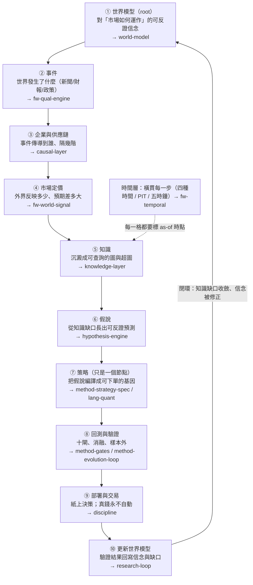

這張圖跟舊圖最大的差別，是箭頭的**終點回到了起點**。舊圖的終點是「實驗頁留下血統」，是一條開口的管線；新圖的終點是「更新世界模型」，是一個閉環。**進化的對象因此從「策略」換成「世界模型」**——每一輪不是問「有沒有生出更高 Sharpe 的策略」，而是問「世界模型的哪條信念被證實、哪條被否證、哪個知識缺口被填上」。整套主軸的完整說明在 研究迴圈：世界→知識→假說→驗證→更新世界模型，每一層各自展開在下面標的頁。

## 誠實對帳：這十格，哪些是真的、哪些是空殼、哪些擺錯位置

這是這一頁最重要的一節，不能跳過。上面那張漂亮的閉環圖，**目前絕大多數格子是「設計了、但幾乎沒有資料、而且在現行 wiki 敘事裡被擺到側邊」**。把每一格拆成三態誠實標記（資料截止 2026-07-22，數字為當日實查）：

| 迴圈格 | 【已設計】哪一頁/框架定義了它 | 【幾乎空殼】實際資料量（實查） | 【擺錯位階】現行 wiki 怎麼對待它 |
|---|---|---|---|
| ① 世界模型 root | 世界模型：世界不是新聞，新聞是世界狀態的 delta（本輪新頁）＋世界模型基底六動詞已上線 | wm_state 只鏡射研究側裁決摘要，**沒有一組「市場如何運作」的本體信念被顯式建模** | 舊圖裡根本沒有這一格；世界模型是「側邊功能」不是 root |
| ② 事件 | 框架：質化引擎（新聞→世界模型→特徵→Alpha工廠）（mcm 唯讀 → MIEE 事件帳） | 新聞真實歷史**只有 15 天**（mcm 2026-07-07 起收）；事件帳雖多，可回測深度＝0 | 被歸為「質化語言」的一個框架，不是主迴圈入口 |
| ③ 企業與供應鏈 | 因果層：新聞→事件→供需→公司→財報→預期→價格（本輪新頁）＋mcm causal_observations | causal_observations 約 **108 筆**（活管線，晨快照記 77）、正式 `edges` 表 **0 筆**、供應鏈**只有一階**（distance≈0）；多階傳導拓撲不存在 | 舊圖完全沒有這一格 |
| ④ 市場定價 | 框架：世界訊號（九態、P 預期差） | 世界層數值是**示意佔位**，未接真資料源（設計書自述） | 被歸為「量化語言」的第二個框架，P1 之後才進場 |
| ⑤ 知識 | 知識層：一則新聞展開成一張知識子圖／知識圖譜：四張圖／超圖：策略基因超邊與交互超邊 | 研究側圖有料（qual_edge 374、qual_hyperedge 159、strategy_spec 5、interaction_edge 1）；但**世界側知識圖近乎空帳** | 舊圖有「圖記憶」，但它記的是研究血統，不是世界知識 |
| ⑥ 假說 | 假說引擎：從「今天有哪些新聞」到「今天最大的未知是什麼」（MIEE hypothesis 狀態機） | MIEE 機件真跑過（109/109 考卷綠、3,412 筆前瞻預測），但**假說是從新聞事件長的，不是從世界模型缺口長的** | 被歸為第四部資訊層的一個雛形 |
| ⑦ 策略 | 方法：策略基因（StrategySpec 九部件）／量化結構組成語言（總覽）／進化引擎 | **這一格是真的**：strategy_spec 5、mutation_edge 2、gate_result 13，真跑過四輪實驗 | **舊圖把它當 root**——這正是被批評的擺錯位階 |
| ⑧ 回測與驗證 | 方法：證據閘（十道關卡）／方法：進化迴圈（圖提案→變異→裁決→回流）／實驗索引：每一輪真跑，逐環節攤開 | **這一格也是真的**：十閘建了幾道、消融真跑、樣本外一輪都還沒跑（全封頂 E2） | 位置正確，是全系統最紮實的一段 |
| ⑨ 部署與交易 | 方法論：誠實紀律（拒絕相信自己） | 只有紙上決策；真錢永不自動（天然護欄） | 位置正確 |
| ⑩ 更新世界模型 | 研究迴圈：世界→知識→假說→驗證→更新世界模型（本輪新頁）＋wm_mirror 六動詞 | 目前只鏡射研究側裁決；**沒有「世界信念被修正」的回寫路徑** | 舊圖沒有閉環這一格 |
| 時間層（橫貫） | 框架：時間層（時態邏輯節點） | `temporal_edge` **連表都還沒建**；四種時間、五時鐘、階段 schema 幾乎整層未實作 | 被標為「最未完成的一層」，位置正確但幾乎是空的 |

一句話讀完這張表：**真正有程式與資料撐著的，是⑦策略、⑧回測、⑨部署這一小段——也就是「策略進化的薄縱切」；而①②③⑤⑥⑩這些構成「世界模型閉環」的格子，多半是設計好的空殼。** 所以這不是「wiki 說有世界模型、其實完全沒有」的謊言，而是「世界模型層設計了、幾乎沒填、而且在敘事裡被擺到策略旁邊當配角」的三重實情。這個判斷本身就是 進化的目標設錯了（病灶六） 與 研究作業系統：11 層與「別蓋空引擎」 兩頁的出發點。

## 一個關鍵警告：不要因為圖漂亮就去蓋十一個引擎

owner 同時提了另一個重構視角——把整套研究迴圈拆成 **Research OS 十一層**（世界模型／知識／超圖／時間／因果／假說／實驗／Alpha／組合／執行／自我進化）。這個拆法是對的，它把「該演化世界模型」這件事講清楚了。**但「真的把十一個引擎都蓋出來」，正是 方法論：誠實紀律（拒絕相信自己） 方向裁決裡被點名的頭號致命盲點：architecture-first（架構先於價值驗證）。** 四層同時建成、日後研究失敗就無法歸因到哪一層——這句話對十一層一樣成立，而且更嚴重。

所以這份 wiki 的修法是**兩條腿分開走**，細節在 研究作業系統：11 層與「別蓋空引擎」：

1. **現在就重構敘事主軸與演化目標**——把 root 從策略換回世界模型、把演化目標從「策略級指標」換成「世界模型的可反證預測力／知識缺口收斂」。這件事便宜、正確、不寫一行新引擎程式碼，這一頁與 總覽：真正該演化的不是策略，是世界模型／進化的目標設錯了（病灶六） 就是在做它。
2. **建置仍走薄縱切**——不蓋十一個空引擎，而是先把**一條**世界→知識→假說→驗證的真實機制鏈填滿（例如「台電強韌電網／CoWoS 擴產→散熱與重電供應鏈→月營收加速→定價延遲」這一條），讓它整條走完再談擴建。這正是方向裁決鐵律一「薄縱切優先」。

換句話說：**敘事重構是免費且該立刻做的；引擎建置永遠只准一條縱切在跑。** 把這兩件事混為一談——「既然要以世界模型為主軸，那就把十一層都蓋起來」——就是掉進 architecture-first 陷阱。

## 後端在做什麼：真相層的模組（＝⑦⑧那一小段的實體）

上面那條閉環是**該有的樣子**；下面這張表是**真的存在的程式碼**。它們全部長在 `aaro/`，寫進同一個 `aaro.sqlite`（07-22 兩引擎落地後 30 表）。看清楚它們在閉環裡的位置：**它們幾乎全部落在第⑦格（策略）與第⑧格（回測驗證）**——這正說明「已建置的部分＝策略進化薄縱切」，而不是整個世界模型閉環。

| 目錄／檔案 | 角色 | 在閉環的位置 | 狀態 |
|---|---|---|---|
| `engine/speclang.py` | 策略層 DSL 六算子（Universe/RankBy/TopN/Weight/RebalanceOn/ExitRule） | ⑦ 策略 | 07-22 已落地、九卷考卷綠 |
| `engine/spec.py` | StrategySpec 九部件驗證器＋單變因 diff 閘 | ⑦ 策略 | 已落地 |
| `engine/db_strategy.py`／`db_graph.py` | 四新表＋append-only 觸發器＋證據非空 CHECK；交互超邊表 | ⑤ 知識（研究側） | 已落地 |
| `engine/graph_views.py` | 四圖投影 SQL 視圖（DROP 可重推逐位元一致） | ⑤ 知識（研究側） | 已落地兩圖視圖 |
| `engine/compile_positions.py` | 真 finlab_db 事件樣本部位編譯器（月營收公告日錨、t+1） | ⑦→⑧ | 已落地 |
| `engine/run_ab.py`／`run_c.py` | 部署同形淨值引擎 | ⑧ 回測 | 已落地 |
| `engine/gaps.py`／`ablation.py`／`evolve_loop.py` | 圖提案器／四臂消融／自主迴圈 | ⑧ 驗證（見 方法：進化迴圈（圖提案→變異→裁決→回流）） | 07-22 落地 |
| `evaluator/harness.py` | **全系統唯一評分器**：rank IC/t、噪音地板、控動能增量、三態 judge | ⑧ 純碼裁決 | 沿用、零改動 |
| `kb.py` | 實驗記憶／接手摘要／查重閘 G0／預註冊 sha256 凍結 | ⑤→⑩ | 沿用＋擴 writeback |
| `wm_mirror.py` | 世界模型六動詞鏡射（分域分庫、同一契約） | ⑩ 更新世界模型（目前只鏡射研究側） | 沿用 |
| `qual/`（`db_qual.py`／`narrative.py`／`vocab.py`／`project_edges.py`） | 質化引擎：機制詞彙對映／`qual_edge`／`qual_hyperedge`／敘事卡 | ②③ 事件與傳導（雛形） | 07-22 落地、九卷綠，見 框架：質化引擎（新聞→世界模型→特徵→Alpha工廠） |
| `report → :8987 /compiler` | 研究雙語把裁決編成固定順序人類報告 | 全鏈輸出 | 沿用 |

三條不可混淆的邊界（後端 code review 的紅線）：**LLM 與規則可提案、永不寫裁決欄；回測產知識、永不產真錢部位；UI 是投影、永不回灌計算。** 這三條在重構後一字不改——它們保護的是機件的誠實，與 root 是誰無關。

## 資料流：策略節點內部怎麼端到端跑完一輪

下面是⑦⑧兩格內部的一輪進化資料流——也就是「已建置薄縱切」的實際管線。放在這裡是要提醒你：**這條管線很紮實，但它是閉環裡的一小段，不是閉環本身。** 每一步都落帳，前一關敗、後一關不跑（省預算）：

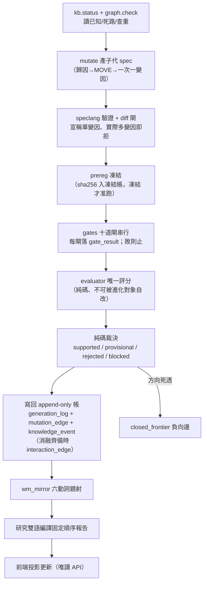

這條流水線裡有三個設計不可退讓：**預註冊在看結果之前凍結**（方法：證據閘（十道關卡））、**評分器唯一且不可被進化對象自改**（方法論：誠實紀律（拒絕相信自己））、**裁決是純碼不是 LLM**（LLM 只在「unknown 歸因解讀」與「交互超邊候選提案」兩處出現，輸出一律過驗證器，非法即拒）。

**但要注意這條管線的裁判是誰**：它問的是「子代 spec 的評分有沒有勝過父代」。實驗 002 已經證明，當你用這個裁判去放手優化，引擎會一路走進動能 beta——因為在多頭樣本裡，動能就是會付錢。這不是機件壞了，是**裁判問錯了問題**。要問對問題，裁判得換成「世界模型的可反證預測有沒有被證實」，而不是「策略級指標有沒有變好」。這個「目標錯置」是整份重構的核心證據，完整寫在 進化的目標設錯了（病灶六）。

## 前端：投影層

前端全部是投影，資料只走唯讀 API（`serve.py`，回應加 `no-store` 防舊快取假故障）。主使用者是 owner，手機經 tailscale 進入，三分鐘回答「在研究什麼／為何選這步／花了多少／卡在哪／要不要我介入」。核心頁：候選閘門管線頁（每列一候選、十閘燈、點開逐閘履歷）、血統樹（父→子沿 MOVE 展開、失敗旁支灰色保留）、A/B 功勞簿（舊流程 vs 語言棧流程七項 meta 記帳，見 方法論：誠實紀律（拒絕相信自己） 證據歸屬分離）、每日持股敘事卡（框架：質化引擎（新聞→世界模型→特徵→Alpha工廠））。另有一個對外報告站 `pub/`（`serve_report.py:8996`，公開網址

https://alpha.7706210988.uk

自包含、去識別化，就是為了貼給 LLM 讀並邀請對抗批判；這份 wiki 就住在它下面。

## 現況與邊界

架構圖上不是每一塊都已實作，而且重構之後這件事更該被講清楚：**已落地的是「策略進化薄縱切」（⑦⑧⑨），構成「世界模型閉環」的其餘格子（①②③⑤⑥⑩）多為設計空殼。** 逐項狀態見上面的三態對帳表。具體到程式層——**已落地**（07-22）：speclang／spec 驗證器／diff 閘／四新表＋觸發器／兩圖視圖／查重閘／部位編譯／run_ab 與 run_c 部署同形對照／qual 兩表／敘事卡 v1／圖提案器＋消融＋自主迴圈。**未落地**：十道證據閘只建了其中幾道、mutate 完整路由、前端全部頁面、時間層 的 `temporal_edge`／五時鐘／對齊契約、因果層 的正式 edges 表與多階供應鏈、世界模型：世界不是新聞，新聞是世界狀態的 delta 的世界信念本體、假說 從知識缺口生成的路徑。各層對應頁的「誠實邊界」節與 給 LLM 評審：請攻擊這些接縫 有逐項展開；為什麼「先重構敘事、再薄縱切填一條鏈」而不是「蓋齊十一層」，見 研究作業系統：11 層與「別蓋空引擎」。

---

<a name='research-os'></a>
# 〔research-os〕研究作業系統：11 層與「別蓋空引擎」

這一頁把 owner 對整套系統的**結構重構**攤開：這不該是「一台進化策略的引擎」，而該是一個以**世界模型為根**的研究作業系統（Research OS），共 11 層——World Model／Knowledge／Hypergraph／Time／Causal／Hypothesis／Experiment／Alpha／Portfolio／Execution／Self-Evolution。

但這一頁同時要做一件**誠實對帳**的事，因為它最容易被誤讀成「所以我們要去把 11 層都蓋出來」。先給兩個答案：

> **認知答案**：11 層架構是對的**敘事與目標重構**——它把「策略」從研究的根，降級成迴圈裡的一個節點，把「世界模型」擺回根的位置（為什麼是根，見 進化目標 與 研究迴圈）。但這 11 層**目前的真實狀態**大多是「設計了、幾乎空殼、而且擺錯位階」，不是「已經蓋好」。
>
> **行動答案**：修法分兩半，**只做第一半是便宜且正確的，第二半必須忍住**。①**現在就重構敘事主軸與演化目標**——這只要改文件與評分方向，便宜、無風險、且直接對；②**建置仍走薄縱切**——先把**一條**真實的「世界→知識→假說→驗證」機制鏈填滿（例如台電強韌電網、或 CoWoS 擴產這種有真新聞、真傳導、真標的的鏈），**而不是把 11 個空引擎都蓋出來**。因為「真的把 11 層都蓋出來」正是 owner 自己在 誠實紀律 裡點名的 **architecture-first 致命陷阱**。

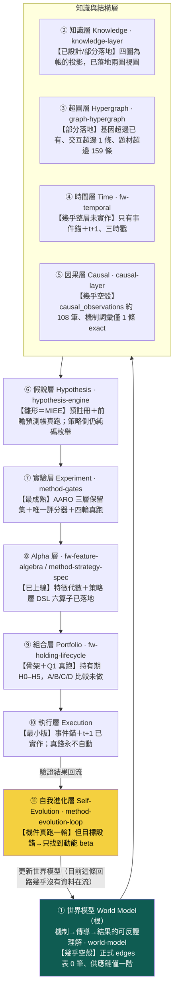

## 一、11 層各自是什麼、現在真的長什麼樣（三態對帳）

下面這張表是本頁的骨幹。每一層標三件事：**【已設計】**它在哪個既有頁或框架已被定義；**【幾乎空殼】**它實際的資料量／實作到哪；**這一層對應的頁**。誠實邊界不得省——owner 說「沒有 Knowledge／World State／Time／Causal Layer」，更精確的真相是「這些**設計了但幾乎是空殼、而且擺錯位階**」，不是完全沒有。

| 層 | 這一層做什麼 | 【已設計】 | 【幾乎空殼／真實資料量】 | 頁 |
|---|---|---|---|---|
| ① 世界模型 | 機制→產業→公司→供應鏈的可反證理解，是全迴圈的根 | 設計書第四部＋`wm_mirror` 六動詞鏡射介面 | **正式 edges 表 0 筆**；供應鏈只有一階（`supply_chain_distance` 幾乎全 0）；新聞真歷史僅 15 天 | 世界模型：世界不是新聞，新聞是世界狀態的 delta |
| ② 知識 | 定義／策略／證據／演化四張圖，記「誰與誰有關、誰生了誰」 | 知識圖譜：四張圖 第一鐵律「圖是帳的投影」 | 已落地演化圖／證據圖兩個 SQL 視圖；定義／策略圖為 spec 展開 partial | 知識層：一則新聞展開成一張知識子圖 |
| ③ 超圖 | 存「多條件共同作用」的高階交互 | 超圖：策略基因超邊與交互超邊（基因超邊＋交互超邊消融紀律） | 基因超邊已落地；交互超邊**只 1 條**（conflicting）；世界側題材超邊 `qual_hyperedge` 159 條 | 超圖：策略基因超邊與交互超邊 |
| ④ 時間 | 把時間從欄位升級為圖的一級結構（四種時間／時態超邊／五時鐘） | 框架：時間層（時態邏輯節點）（十塊 schema 完整設計） | **幾乎整層未實作**；只有事件錨＋t+1、三時戳、`qual_edge` 時效欄 | 框架：時間層（時態邏輯節點） |
| ⑤ 因果 | 事件→影響→傳導的因果邊與機制身份 | 因果層：新聞→事件→供需→公司→財報→預期→價格；mcm `causal_observations`＋MIEE `market_mapping` | `causal_observations` **約 108 筆**（活管線日更、浮動）；機制詞彙兩套僅 **1 條 exact 生效**、3 條待人核 | 因果層：新聞→事件→供需→公司→財報→預期→價格 |
| ⑥ 假說 | 從缺口提出**可反證**的假說，預註冊凍結 | 假說引擎：從「今天有哪些新聞」到「今天最大的未知是什麼」；MIEE 假說機（預註冊凍結＋落准觸發器） | MIEE 有 3,412 筆前瞻預測帳（真跑）；但**策略側**的「下一代測什麼」仍是純碼機制庫枚舉，非真假說引擎 | 假說引擎：從「今天有哪些新聞」到「今天最大的未知是什麼」 |
| ⑦ 實驗 | 十道證據閘＋唯一評分器＋三層保留集，判真假 | 方法：證據閘（十道關卡）；AARO harness | **全機最成熟一層**：四輪實驗真跑、獨立重算、E2 封頂 | 方法：證據閘（十道關卡） |
| ⑧ Alpha | 把世界狀態寫成可組合的特徵與策略基因 | 框架：特徵代數＋方法：策略基因（StrategySpec 九部件） | 特徵代數已上線；策略層 DSL 六算子已落地 | 框架：特徵代數 |
| ⑨ 組合 | 入選之後怎麼抱到賣（持有管理） | 框架：持有期生命週期（H0–H5＋剩餘 Alpha） | 骨架＋研究問題一真跑（finlab 覆核）；A/B/C/D 完整比較未做 | 框架：持有期生命週期 |
| ⑩ 執行 | 事件錨、t+1、成本滑價、真錢閘 | 框架書執行層；`engine/compile_positions` | 事件錨＋t+1 已實作；**真錢永不自動**（人按 CA 閘） | 研究迴圈：世界→知識→假說→驗證→更新世界模型 |
| ⑪ 自我進化 | 讓迴圈自己提案、變異、裁決、回流 | 方法：進化迴圈（圖提案→變異→裁決→回流）；evolution-loop 憲法 | 機件真跑一輪（實驗 003）；**但目標設錯→只找到動能 beta**（進化的目標設錯了（病灶六）） | 方法：進化迴圈（圖提案→變異→裁決→回流） |

## 二、「擺錯位階」到底錯在哪

三態裡最隱形、也最該修的是第三態——**擺錯位階**。目前這份 wiki 的敘事骨架（總覽／架構／量化語言）是**以策略為中心**排的：策略基因 → 語言棧 → 圖記憶 → 進化迴圈 → 實驗。世界模型（新聞、供應鏈、因果、時間）像是掛在旁邊的一組**側邊功能**（質化語言那一支），而不是整條研究迴圈的**根**。

這個排法本身就在複製病灶六。當敘事把「策略」放在中央，讀者、以及演化目標，都會自然地去優化「策略好不好」——於是就一路滑向 實驗 002 那個結局：動能 beta。owner 的重構要求把位階倒過來：**世界模型是根，策略只是世界模型在某個決策時點的一個投影/下游節點**（見 研究迴圈 的主軸）。這一步**不需要寫任何新引擎**，只需要重排敘事與重設目標——所以它是「便宜且正確」的第一半修法。

## 三、關鍵 caveat：別把「重構」做成「蓋 11 個空引擎」

這是全頁最重要的一句提醒，因為 11 層架構圖**太容易被讀成一張施工藍圖**。

owner 自己在 誠實紀律 的方向裁決裡，把 **architecture-first（架構先於價值驗證）** 列為**致命盲點**：四層同時建成，日後研究失敗就無法歸因到哪一層；精緻空轉。11 層比 4 層更危險——如果讀完這頁的反應是「那我們把 World Model、Knowledge、Causal、Time 四個空引擎都建起來」，那就正好踩進 owner 親手畫的地雷。

正確的第二半修法是**薄縱切**（thin vertical slice，方法論：誠實紀律（拒絕相信自己） 第六節）：

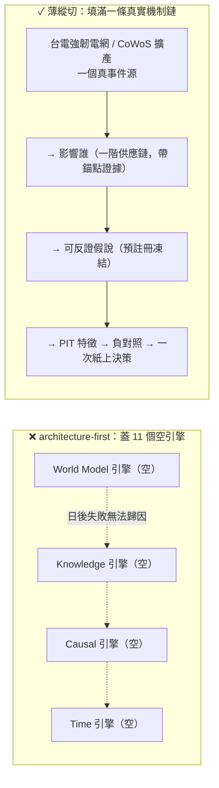

薄縱切的意思是：**先只打通一條**「真實事件源 → 影響誰 → 可反證假說 → PIT 特徵 → 負對照 → 持有規則 → 報告 → 一次紙上決策」的完整垂直鏈，讓這一條鏈**真的有資料在世界模型、知識、假說、驗證之間流動**。把 11 層各建一點點、卻沒有任何一條端到端跑通，是最差的結果——那是 11 個都是空殼，只是每個都「有了」。用一條真鏈把「世界→知識→假說→驗證」走通，遠比 11 個空引擎有價值，也才符合上位方向裁決的第一鐵律。

（為什麼選台電強韌電網 / CoWoS 這種鏈當第一條薄縱切：它們有真新聞、有可辨識的一階供應鏈、有可反證的傳導假說——正好是把因果層與世界模型層從「約 108 筆觀察／0 筆正式邊」推到「一條有證據的完整鏈」所需要的最小真實案例，而不是憑空畫想像的全圖。）

## 四、誠實邊界（不得省略）

- **本頁講的是結構重構，不是「已完成 11 層」**。表中每一層的【幾乎空殼】欄就是它的真實資料量：正式世界模型 edges 表 0 筆、因果觀察約 108 筆、供應鏈一階、交互超邊 1 條、時間層幾乎整層未實作、新聞史 15 天。這些數字是 2026-07-22 晨偵察快照，會隨活管線浮動。
- **11 層不是新蓋 11 個系統**。多數層是把**既有資產歸戶**進來：實驗層＝既有 AARO harness、Alpha 層＝既有特徵代數、組合層＝既有持有期、自我進化層＝既有進化迴圈。真正**近乎零實作**的是世界模型層、因果層、時間層，以及「策略側」的假說層。
- **第一半修法（重構敘事與目標）可以現在做；第二半（建置）必須走薄縱切**。把兩半混為一談、直接開工蓋四個空引擎，就是 architecture-first 復發。
- **11 層本身也在總體 kill criteria 之下**。若薄縱切跑完、A/B 記帳證明某層沒有增量，那一層照樣拆——把它蓋出來不構成保留它的理由（見 方法論：誠實紀律（拒絕相信自己） 第十節）。

一句話收束：**11 層是對的地圖，不是對的施工順序。** 現在就把世界模型擺回根、把目標從策略級績效換成世界模型的可反證預測力（進化的目標設錯了（病灶六））；然後只挑一條真鏈，把世界→知識→假說→驗證走通一次，再談要不要擴。

延伸：這條迴圈的完整主軸見 研究迴圈；為什麼世界模型該當根、策略級目標為何會壞見 進化目標；把假說變成可反證一等公民的機制見 假說引擎；世界模型層與因果層的真實空殼狀態見 世界模型：世界不是新聞，新聞是世界狀態的 delta 與 因果層：新聞→事件→供需→公司→財報→預期→價格；architecture-first 與薄縱切的完整條文見 誠實紀律。

---

<a name='objective'></a>
# 〔objective〕進化的目標設錯了（病灶六）

這一頁講整套系統**最深的一個 bug**。前面的頁都在談「進化（Evolution）」怎麼跑得更好——圖怎麼提案、消融怎麼判、迴圈怎麼回流。但 owner 的批評指到更下面一層：問題不在**演化的機制**，在**演化的目標（Objective）設錯了**。

先給認知答案與行動答案，其餘證據都服務這條主軸。

> **認知答案**：目前這台引擎（以及大多數「自動找 Alpha」的系統）把**策略／程式／prompt** 當成演化對象，去優化一個策略級指標（子代 Sharpe 勝過父代）。這是照抄 AlphaEvolve 那類「優化一個可機械驗證的目標」的範式——但在量化投資裡，那個目標是**過擬合代理**，不是你真正要的東西。真正該被演化、該當這條研究迴圈之根的，是**世界模型（World Model）**：對「什麼機制驅動什麼結果」的可反證理解。
>
> **行動答案**：不要再把適應度設成「策略績效贏過父代」。那個目標我們**已經實測過會壞**——見下面 實驗 002。新目標要換成**世界模型的可反證預測力**與**知識缺口的收斂**；而第一步不是重寫評分器，是先給現行迴圈的適應度加一道「動能 beta 懲罰」（實驗 003 的 P0 行動），擋住「放手優化 CAGR 只會一再重新發現 beta」這個已被證實的陷阱。

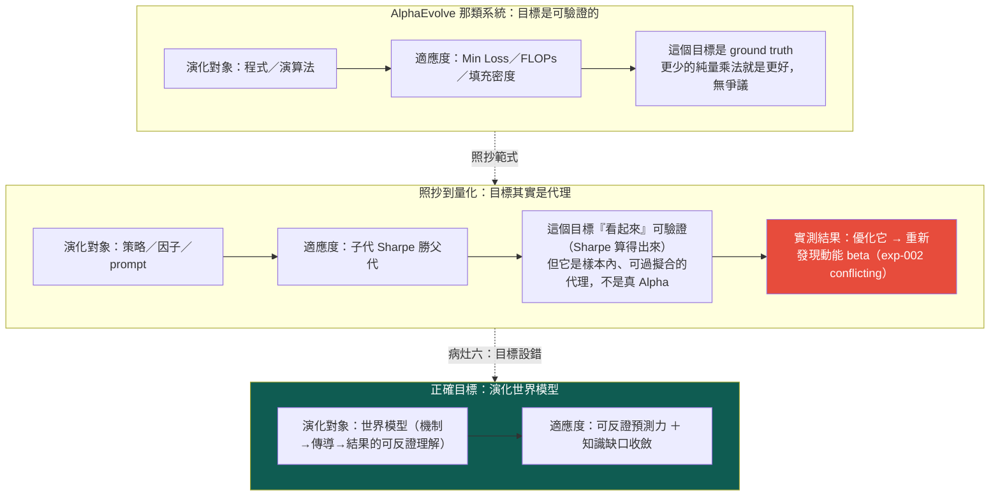

## 一、AlphaEvolve 為什麼能用：因為它的目標無可爭議

先講清楚被照抄的範式為什麼在它自己的場域裡有效。AlphaEvolve 這類演化式程式合成系統的核心前提是：**適應度函數是一個可機械驗證的 ground-truth 指標**——一個矩陣乘法演算法用了幾次純量乘法、一個模型的 loss 是多少、一種裝箱方式的填充密度多高。這些數字**就是你要的東西本身**，不是它的代理：更少的乘法次數，客觀上就是更好的演算法，沒有「它看起來好但其實沒用」的空間。

有了這種目標，演化就有一個**不會騙自己的裁判**。你可以放手讓它變異幾百萬代，因為每一代的分數都直接對應真實價值。這是 AlphaEvolve 範式成立的全部基礎。

## 二、照抄到量化，目標就從「真值」退化成「代理」

問題出在把這個範式搬到量化投資時，**目標的性質變了，但抄的人沒注意到**。

「子代策略的 Sharpe 勝過父代」看起來也像個可驗證的目標——Sharpe 確實算得出來、確實決定性可重現、確實能寫進純碼裁決。整套 進化迴圈 的 `decide_verdict()` 現在就是這樣判的：`CAGR 與 Sharpe 皆勝父代 → provisional`。表面上跟 AlphaEvolve 一樣嚴謹。

但它跟 FLOPs 有一個致命差別：**樣本內的策略績效不是 ground truth，是一個高度可過擬合的代理**。你真正要的是「這條策略在未來、在你沒看過的市場狀態下還會賺錢」，而樣本內 Sharpe 對這件事只是一個**有偏、可被搜尋策略反向利用**的估計。當你把它當適應度去大量優化，演化不會去找「真正理解市場」的策略，它會去找「在這段歷史上剛好 Sharpe 高」的策略——而在一段多頭偏樣本裡，那幾乎必然是**動能 beta**。

這不是理論擔憂。這台引擎自己撞上了。

## 三、鐵證：優化策略級指標，就只會重新發現動能 beta

這是本頁最硬的一塊，也是為什麼「目標設錯」不是抽象批評、而是已被實驗證實的病灶。

實驗 002 對這台引擎自己剛生出的漂亮候選 C（月營收 × 250 日價格強勢，CAGR 33%、Sharpe 1.52）跑了一個乾淨的四臂消融，問：C 的優勢是「月營收 × 價格強勢」的**真綜效**，還是兩個因子各自貢獻的**相加**？純碼判定的答案是 `conflicting`——**幾乎全是動能 beta 相加**：

| 組合 | Sharpe | 對基準超額(CAGR) |
|---|---|---|
| 都沒有（基準，等權流動性全池） | 0.96 | — |
| 只有營收選股（＝父代 B） | 1.08 | +5.60pp |
| 只有價格強勢（純動能） | **1.52** | +12.26pp |
| 營收＋強勢（＝候選 C） | **1.52** | +18.60pp |

三個讀數把「策略級目標會壞」講死了：

- **加強勢給營收股（+13.0pp）≈ 加給基準（+12.3pp）**——價格強勢的貢獻與有沒有做營收選股**無關**，是相加不是綜效。
- **純動能 Sharpe 1.52 ＝ 營收＋強勢 Sharpe 1.52**——有了動能之後，再加營收選股，對風險調整報酬的邊際貢獻是**零**。
- synergy CAGR 只 +0.74pp（勉強過噪音門檻）、synergy Sharpe −0.12（負），兩指標方向相反 → `conflicting`。

然後 實驗 003 把這件事演成完整的悲劇：讓圖自己提案、自主連跑三代，**放手讓迴圈去追報酬**，它就一路走進更純的動能暴露——gen2 換 120 日動能（Sharpe 1.50）、gen3 換 250 日創新高（Sharpe **2.06**，標「幾乎肯定過度擬合」）。迴圈的機件全部正確運作、決定性可重現、負結果如實入帳——**但它找到的每一樣東西都是動能 beta 在多頭樣本重複付錢**。

把這兩個實驗合起來看，結論很尖銳：**當適應度＝策略級績效勝過父代，一台機件完全正確的進化迴圈，會可靠地、決定性地收斂到動能 beta。** 不是因為它壞了，是因為你叫它優化的那個目標，本來就是動能 beta 分數最高。這就是病灶六——**Evolution 沒問題，Objective 設錯了**。

## 四、正確的目標：世界模型的可反證預測力與知識缺口收斂

如果策略級績效是錯的目標，什麼是對的？owner 的重構把根從「策略」搬到「世界模型」：這條研究迴圈真正該演化的，是系統對「**什麼機制、在什麼條件下、經過多久、驅動什麼結果**」的可反證理解（見 研究迴圈 的主軸與 世界模型層）。對應地，適應度也要換成兩個服務世界模型的量：

- **可反證預測力**：一條知識不是用「它讓某策略 Sharpe 變高」來評分，而是用「它事前下了一個**會被證偽**的預測、後來對帳成立」來評分。這正是 MIEE 預測帳（預註冊 → 到期 settle 對帳）與 假說引擎 在做的事——目標從「績效」換成「**這個世界模型能不能在事前、對未見過的事件、做出對的可反證預測**」。系統要找的 Alpha 的最終形態，不是「營收加速有效」，而是一條**帶完整時間約束、附預註冊未來驗證窗的時態因果模式**（見 時間層 5.12）——那才是可被理解、被監控、能隨時間演化的完整投資邏輯。
- **知識缺口收斂**：進化的每一步該問「這一代**消除了世界模型的哪一個未知**」，而不是「這一代 Sharpe 高了多少」。知識圖 的 gap detection（已知「創新高在低波動有效」、未知「＋營收加速在高波動是否仍有效」）就是缺口的來源——好的變異是去**測那個未知**，不是去多頭樣本裡多刷一次動能。這也是為什麼下一代研究問題該**從圖的空洞裡長出來，不從 LLM 的靈感裡長出來**。

換句話說：AlphaEvolve 的裁判是「更少的 FLOPs」，這套系統對的裁判該是「**世界模型更能事前反證地預測市場，且更少未測的知識缺口**」——而不是「這條策略在看過的歷史上分數更高」。

## 五、誠實邊界（不得省略）

這一頁講的是**目標的重構**，屬於敘事與設計層，必須誠實標明哪些還沒兌現：

- **新目標尚未成為可計算的適應度函數**。「可反證預測力」與「知識缺口收斂」目前是**方向**，不是 `evolutor` 裡跑著的評分器。現行迴圈的 `decide_verdict()` 仍在比子代對父代的 CAGR/Sharpe——也就是**錯的目標仍在線上**。把它換成世界模型目標是設計，未實作。
- **第一步是打補丁，不是換引擎**。三份報告共同的 P0 行動是給現行適應度加「動能 beta 懲罰」（對純動能因子中性化後才計分），這只是**擋住已知的最大過擬合來源**，讓迴圈至少不再是純動能 beta 發現器；它本身**不等於**演化世界模型。真正的目標轉向要靠 假說引擎 與預測帳把「可反證預測」變成一等公民。
- **這是重構，不是推翻已跑的實驗**。exp-000～003 的機件、消融、帳務全部有效且經獨立重算；本頁不改它們的數字，只是指出它們**優化的目標**是錯的——這恰恰是那些實驗**自己證明出來的**。
- **別把目標重構升級成「蓋 11 個引擎」**。把根搬到世界模型是對的敘事，但「真的把世界模型層、知識層、因果層都蓋出來」正是 owner 在 誠實紀律 裡點名的 architecture-first 陷阱——修法走薄縱切，先填一條真的世界→知識→假說→驗證鏈，細節見 研究作業系統。

一句話收束：**這台引擎最有價值的一次自我否證（exp-002），同時也是對它自己目標函數的起訴書。** 機件會轉、帳務可信、能拒絕相信自己——但只要目標還是「策略級績效勝父代」，它會非常誠實地、非常可重現地，把力氣全花在重新發現動能 beta 上。

延伸：這條迴圈真正的主軸見 研究迴圈；11 層架構與「別蓋空引擎」的紀律見 研究作業系統；把「可反證預測」變成一等公民的機制見 假說引擎；紀律總條文見 誠實紀律；不認得的詞查 詞彙表。

---

<a name='world-model'></a>
# 〔world-model〕世界模型：世界不是新聞，新聞是世界狀態的 delta

這一頁是 owner 深層批評的**病灶 3**。批評很短、但足以掀掉整份 wiki 的敘事主軸：

> 這台引擎把「新聞流」當成世界的樣子——一則一則事件進來、觸發訊號、生成策略。但**世界不是一串新聞**。世界是一組緩慢與快速移動的狀態變數：利率、美元、能源價格、航運費率、AI 資本支出、記憶體（DRAM/HBM）循環、PCB 稼動、CoWoS 產能、ETF 資金流……**一則新聞之所以有意義，是因為它是這些世界狀態的一個 delta（變化量）**。「Fed 降息」不是一個孤立事件，它的意義是：`Fed 利率 ↓ → 美元 ↓ → 借貸成本 ↓ → 科技股評價 ++`。沒有那個世界狀態當背景，這則新聞不可讀。

換句話說，投資判斷的根不是「新聞說了什麼」，而是「世界現在是什麼狀態、這則新聞把哪個狀態變數推向哪裡」。策略只是這個世界狀態的一個下游函數——`E[未來報酬 | 世界狀態]`（見 進化目標、總覽的策略本體論）。

## 認知答案與行動答案（先講結論）

- **認知答案**：世界模型（world model）在這台引擎裡**被設計了、但幾乎是空殼、而且擺錯了位階**。它不是「完全沒有」——世界訊號的九態狀態機、本體論的 `狀態 → 期望` 公式都在描述世界狀態；但世界層的**數值全是示意佔位、沒接任何一條真實的世界狀態序列**，而且整份 wiki 的敘事把「策略基因的進化」當主軸、把世界模型降格成量化語言棧的一個側邊框架。
- **行動答案**：分兩步，且順序不能顛倒。①**現在就重構敘事主軸與進化目標**——把世界模型放回根、策略放回下游節點（便宜且正確，只改敘事與目標函數）；②**建置仍走薄縱切**——先把 **ONE** 條「世界狀態 → 知識 → 假說 → 驗證」的真實機制鏈（如台電強韌電網、CoWoS 產能）從頭填滿，**而不是**把 Research OS 11 層的十一個引擎都蓋成空殼。後者正是 誠實紀律點名的 architecture-first 致命陷阱。

## 三態誠實對帳：世界模型現在到底存在到什麼程度

owner 說「沒有世界狀態層」——精確講不是完全沒有，是三種狀態混在一起。攤開如下。

### 【已設計】哪些既有頁/框架已經定義了世界狀態的語言

- 世界訊號把世界判斷拆成 `WS = D + V + M + A + T + P + E + τ` 的完整地址，其中 **D（Observation）的九種觀測型別**——`Price / Quantity / Capacity / Demand / Competition / Policy / Technology / Finance / Market`——就是「世界狀態變數」的封閉詞彙雛形；輸出是**行情演化九態狀態機**（無衝擊 → 甜蜜點 → 主升段 → 破壞），這是「世界走到哪個階段」的語言。
- 本體論／總覽把策略定義成 `世界狀態 S → E[未來報酬 | S]`——這條公式本身就把世界狀態立為第一位、策略立為它的期望函數。
- AARO（自治 Alpha 研究實驗室，本專案地基）的 regime 概念（波動 regime 決定順勢/反轉輪動，已真跑 H-R001）是「世界處於哪個狀態」影響策略的既有實例。

### 【幾乎空殼】實際上世界狀態有多少真數據

- **世界訊號的世界層數值是示意佔位**：案例庫 WS001–WS006 用同一個衝擊（華城／台電強韌電網）示範九態，但那些世界層數值是**示範 schema 用的佔位資料，不是即時抓取的真實世界資料**（見 框架：世界訊號 誠實邊界）。引擎機件（狀態機／影響比／預期差／反證／PIT）是真的、可驗證；但世界層**尚未接任何真資料源**。
- **九態不是 owner 講的那個世界狀態**：這裡有一個必須說清楚的位階落差。世界訊號的九態，描述的是「**某個特定衝擊 × 某家公司**」演化到哪——它是**個股行情**的階段機。而 owner 病灶 3 講的世界狀態，是**利率／美元／能源／航運／DRAM／PCB／CoWoS／ETF 這些總體變數本身**當一級物件、每天有值、彼此有傳導。**這一層——把總體世界變數物化成一張「今天世界長什麼樣」的狀態表——全機零實作、連 schema 都還沒定**。九態是「行情對某衝擊的反應」，不是「世界本身的狀態」。
- **沒有任何一張表叫「世界狀態」**：你在整台機器裡找不到一列「2026-07-22：Fed 利率 x%、美元指數 y、BDI 航運 z、HBM 現貨 w、CoWoS 稼動 v」。世界狀態目前只存在於敘事與佔位案例裡，不存在於資料裡。

### 【擺錯位階】wiki 敘事把策略當根、世界模型當側邊

- 首頁與 總覽的敘事線是「策略＝狀態的期望 → 四種語言 → 圖記憶 → **進化引擎生成/否證策略**」——主角是**策略基因（StrategySpec）**，進化迴圈變異的是策略、裁決的是策略的 Sharpe/CAGR。
- 世界模型出現在哪？出現在量化語言棧的**第二層框架**（框架：世界訊號），與特徵代數、持有期並列，是「五層語言之一」，而且資產歸戶總表明講它「**P1 後才進場**」（Gen5 regime 門控才需要）——被排到最後。
- 這正是病灶 3 的核心：**世界模型像側邊功能，不像根**。owner 的重構要求把這個位階倒過來——世界狀態是根，策略是「站在某個世界狀態下、對某群股票的期望」這個下游節點。

## 一張圖看懂：世界狀態當根，新聞是它的 delta

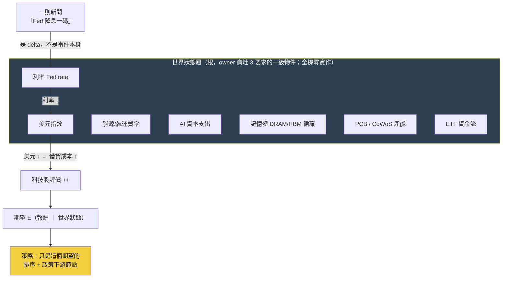

讀法：新聞（「Fed 降息」）不是圖的起點，它是**打在世界狀態變數上的一個 delta**；世界狀態沿傳導鏈改變評價，評價改變條件期望，策略才在最下游依期望排序、套政策。目前這台引擎的實作把箭頭方向搞反了——從新聞直接跳到策略訊號，中間那層深藍色的「世界狀態」是空的。

## 修法：先重構目標，再薄縱切填一條真鏈

病灶 3 的修法不是「趕快把世界狀態表建出來」，那會掉進兩個坑：一是 architecture-first（先蓋空層、日後研究失敗無法歸因到哪層，見 方法論：誠實紀律（拒絕相信自己） 第六條）；二是「用想像的邊餵傳播，比沒有邊還毒」（知識圖譜：四張圖第一鐵律）。正確順序是：

1. **敘事與目標先改（便宜且正確）**：把 進化目標從「子代 Sharpe 勝父代」改成「世界模型的可反證預測力提升／知識缺口收斂」。這件事一行代碼不用動世界狀態表，就能擋掉 實驗 002 揭露的病——優化策略級指標，只會反覆重新發現動能 beta。
2. **薄縱切填一條真鏈（不蓋 11 個空引擎）**：選 **ONE** 個世界狀態變數當起點（例如「台電強韌電網政策 → 重電設備需求」或「CoWoS 產能循環」），把 `世界狀態 → 知識子圖 → 假說 → PIT 驗證` 這條窄鏈**填滿真數據、每條邊帶證據錨點**，跑完一次前瞻驗證窗。這條薄鏈的知識展開見 知識層，機制傳導見 因果層，11 層為何不能一次蓋見 Research OS。

一句話收束：**世界模型的問題不是「沒做」，是「做成了佔位樣品、還擺在側邊」**。把它搬回根、先填實一條，比把十一層都畫成空圖有價值得多。

延伸閱讀：一則新聞如何展開成知識子圖 → 知識層：一則新聞展開成一張知識子圖；世界事件如何沿機制傳導到股價 → 因果層：新聞→事件→供需→公司→財報→預期→價格；為什麼進化目標本身錯了 → 進化的目標設錯了（病灶六）；九態世界訊號的完整設計與誠實邊界 → 框架：世界訊號；11 層重構為何要走薄縱切 → 研究作業系統：11 層與「別蓋空引擎」。

---

<a name='knowledge-layer'></a>
# 〔knowledge-layer〕知識層：一則新聞展開成一張知識子圖

這一頁是 owner 深層批評的**病灶 2**。它問的是：當一則新聞進來，這台引擎把它變成了什麼？

> 一則新聞不該只被打成「正面／負面情緒」——那太淺，等於沒讀。一則新聞應該**展開成一張知識子圖**：`台電（發包方）→ 設備類別（重電/電網/變壓器）→ 受惠公司（華城/士電/中興電）→ 產品線 → 營收貢獻 → 歷史事件（2022 也發過標）→ 上游供應商（矽鋼片）→ 競爭者 → 歷史案例（上次決標後股價怎麼走）`。有了這張子圖，你才知道「這則新聞到底牽動了誰、透過什麼、以前發生過沒、可以拿什麼當代理」。這是把新聞當**世界模型的第二層**用，不是當情緒指標用。

知識層是 世界模型（病灶 3）往下走一步的具體化：世界狀態告訴你「世界現在是什麼」，知識層告訴你「這個事件在世界的關係網裡連到誰」。

## 認知答案與行動答案（先講結論）

- **認知答案**：知識子圖**已經有完整的設計語言、也真的建了一張圖表出來，但那張圖幾乎是平的**——374 條邊全部是同一種「這則事件講的是這檔股票」的一階關係，`台電 → 設備 → 公司 → 供應商 → 競爭者` 這種**多跳知識子圖，在真實資料裡不存在**。正式的世界模型邊表是 0 筆空帳。所以病灶 2 精確講不是「沒有知識層」，是「知識層退化成一張事件指向單一資產的星狀圖」。
- **行動答案**：不要一次把整張想像的供應鏈圖畫出來（圖鐵律：用想像的邊餵傳播比沒有邊還毒）。**選一條真鏈、逐邊帶證據錨點填深**——例如台電強韌電網那條，從發包方一路建到上游供應商與歷史案例，每一跳都指得回一則有逐字引文的新聞。填實一條，勝過畫十張空圖。

## 三態誠實對帳：知識子圖現在到底有多少邊

### 【已設計】哪些框架已經定義了「一則新聞→知識子圖」的語言

- 質化引擎的 **qual_edge** 沿 OCM（組織圖譜，全機最完整的「帶證據帶時效」二元邊實作）的 typed edge 形狀：`src / rel / dst / valid_from / valid_to / evidence / status / source`。每條邊必須指回帳裡的證據列（`evidence` 欄有 `CHECK`，非空 JSON 陣列，否則整條邊非法）。這正是「知識子圖的每條邊都要能溯源」的欄位級落地。
- 四張圖定義了知識如何從 append-only 帳投影成可查詢的圖，第一鐵律「圖是帳的投影、不是第二真相源」保證圖不會長出想像的邊。
- **關係詞彙已存在**：MIEE（市場訊息演化引擎）的 `market_mapping.relation_type` 有 `subject / supplier / customer / peer`——這就是「事件→設備→公司→供應商→競爭者」多跳所需的邊型別詞彙。
- 敘事卡的「世界模型鏈」設計會沿 qual_edge 從 asset 節點**反向多跳走傳導路徑**，走不出就誠實回「尚無邊」——多跳查詢的機制本身已寫好。

### 【幾乎空殼】實際資料量（2026-07-22 查得，活管線會漂）

這是病灶 2 最刺眼的地方，數字攤開：

| 資料表 | 應該裝什麼 | 實際 | 意義 |
|---|---|---|---|
| AARO `qual_edge` | 事件↔公司↔供應鏈的多型別知識邊 | **374 筆，rel 全部是 `subject`** | 全是「這事件講的是這檔」，**零 supplier/customer/competitor 邊**——圖是平的星狀 |
| MIEE `market_mapping`（approved=1） | 人核過、可用的關係邊 | **374 筆全是 subject，supply_chain_distance 全 0** | 人核過的傳導邊＝**0**；唯一 1 筆 supplier 邊還沒核准 |
| mcm 正式 `edges` 表 | 提升為正典的因果/關係邊 | **0 筆** | 世界模型邊表是**空帳** |
| mcm `causal_observations` | 帶機制的因果觀察 | 108 筆（`company_role` 全空、單一 `proof_grade`） | 是**原始觀察料**，不是連成圖的邊 |
| mcm `nodes` | 知識圖節點 | 155 個 | 有節點、**沒有邊把它們連起來** |

翻成白話：**「一則新聞 → 台電 → 設備 → 華城 → 產品 → 營收 → 供應商 → 競爭者」這條子圖，在資料裡走不出第一跳**。qual_edge 的 374 條邊，每一條都只是「事件 e 指向資產 a」，沒有第二跳。敘事卡首輪對 20 檔最新籃子出卡，只有 **1/20 有內容**（2408 南亞科 3 事件），其餘 19 檔的世界模型鏈都誠實顯示「尚無邊」。稀疏不是 bug，是 mcm 新聞只從 2026-07-07 起收、**真實歷史只有 15 天**的上游現實，加上多跳邊根本還沒被投影出來。

### 【擺錯位階】wiki 把研究記憶圖當主角、世界知識圖當延伸

- 四張圖（定義／策略／證據／演化）講得很完整，但它們是**研究記憶側**——管實驗與策略的血統，不是 owner 病灶 2 講的世界知識子圖。
- owner 要的那張圖是**世界模型側**（實體關係／條件超圖／時間因果／決策狀態），它在 wiki 裡只出現在 質化語言的「第二層世界模型」一段，被描述成「只建圖不打分」的中間層，且落地狀態是三個誠實缺口（框架：質化引擎（新聞→世界模型→特徵→Alpha工廠））。**最完整的圖是研究側，最空的圖是世界側**——而 owner 要當根用的，恰好是最空的那張。

## 一張圖看懂：設計 vs 真實

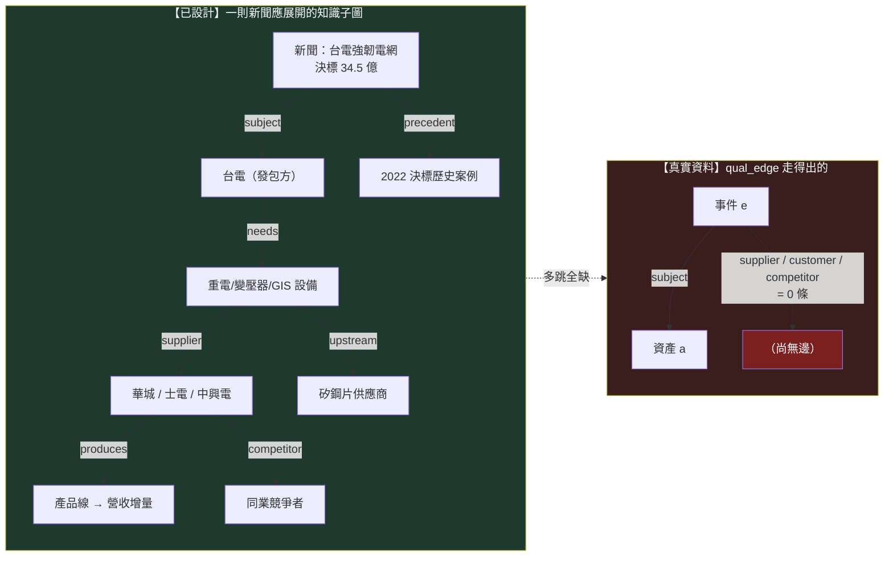

左邊是設計該長成的子圖（八類節點、五種關係、帶歷史案例）；右邊是資料庫真的走得出的——一條 subject 邊到底，剩下全是「尚無邊」。病灶 2 就是這張圖左右的落差。

## 修法：填深一條，不畫寬十條

知識層的正確補法，繼承 圖鐵律與 誠實紀律的薄縱切原則：

1. **選一條真鏈填深**：拿台電強韌電網（或 CoWoS）這一條，把 `subject / supplier / customer / competitor / precedent` 五種邊**逐條建出來**，每條邊 `evidence` 欄引用一則帶逐字錨點引文（≥8 字原文子字串，MIEE 反捏造閘）的新聞。目標是這一條鏈**能從新聞多跳走到上游供應商與歷史案例**，而不是 374 條 subject 邊再加一堆想像箭頭。
2. **邊靠證據落地、不靠 LLM 畫滿**：LLM 只能**提案**候選邊（進候選佇列），成邊要嘛純碼從帳投影、要嘛靠人核 approved（知識圖譜：四張圖第三鐵律）。目前 4,350 筆未核准的 distance-1 對映就是候選料——它們該經人核逐條轉正，不是直接當邊用。
3. **接回世界狀態與因果**：這條知識子圖不是孤立的，它上接 世界狀態（台電政策是能源/基建世界狀態的 delta），下接 因果層（設備需求 → 營收 → 預期 → 股價的機制傳導）。三層填的是同一條薄縱切。

一句話收束：**知識層有完整的邊語言、有反捏造的證據閘、有多跳查詢機制——唯獨沒有多跳的邊**。病灶 2 的解不是再蓋一套圖框架，是把已有的框架**灌進一條真實、帶證據、走得出多跳的鏈**。

延伸閱讀：知識邊的機制傳導（H20→GPU→HBM→股價）→ 因果層：新聞→事件→供需→公司→財報→預期→價格；世界狀態當根 → 世界模型：世界不是新聞，新聞是世界狀態的 delta；qual_edge 的實作與三個缺口 → 框架：質化引擎（新聞→世界模型→特徵→Alpha工廠）；圖為什麼是帳的投影 → 知識圖譜：四張圖；為什麼不能一次蓋 11 層 → 研究作業系統：11 層與「別蓋空引擎」。

---

<a name='causal-layer'></a>
# 〔causal-layer〕因果層：新聞→事件→供需→公司→財報→預期→價格

這一頁是 owner 深層批評的**病灶 5**。如果 知識層（病灶 2）問「一則新聞連到誰」，因果層問的是更硬的一題：**這則新聞為什麼會讓那檔股票漲——經過哪些機制、哪一步傳到財報、市場的預期在哪一步落後？**

> 一條完整的投資因果鏈長這樣：`新聞 → 事件 → 供需變化 → 公司 → 財報 → 市場預期 → 價格`。舉一個真的例子：`H20 解禁 → 中國可買 GPU → GPU 出貨拉升 → HBM（高頻寬記憶體）需求增 → SK 海力士產能吃緊 → 台灣供應鏈受惠 → ABF 載板需求增 → 欣興營收預期上修 → 股價反應`。每一個箭頭都是一個**機制（mechanism）**——需求活化、供給受限、成本轉嫁、毛利擴張、預期修正。找到 Alpha，本質是找到「某條機制鏈上，市場的預期還沒追上基本面」的那個時點。

因果層是三頁世界模型重構的收束：世界狀態是根、知識子圖是關係網、**因果層是關係網上帶方向與機制的傳導**。

## 認知答案與行動答案（先講結論）

- **認知答案**：機制鏈的**詞彙已經設計得相當完整**（mcm 9 個 `M_*`、世界訊號 30 個 `M_*`、世界訊號的 T 傳導欄），**但那些機制目前是一顆顆孤立的觀察，沒有被串成鏈**。`H20 → GPU → HBM → SK → 台灣 → ABF → 欣興 → 股價` 這種多跳因果鏈，在資料裡一步都走不通——正式因果邊表 0 筆、機制觀察 108 筆全是孤立的兩點對、兩套機制詞彙只有 1 個對得上。
- **行動答案**：因果層的補法和進化目標綁死。**目前引擎優化的是策略級指標（子代 Sharpe 勝父代），這個目標會讓系統反覆重新發現動能 beta、而不是學到任何一條因果機制**——這正是 實驗 002 親手證明的。所以因果層的真正修法，是把進化目標從「策略績效」換成「**一條機制鏈的可反證預測力**」：填實 ONE 條鏈、預註冊它的前瞻驗證窗、看它事後對不對。詳見 進化目標。

## 核心證據串接：為什麼「優化 Sharpe」永遠學不到因果

這是本頁最重要的一段，把 owner 的病灶 5 和我們自己的實驗接在一起。

實驗 002 做了一件事：對引擎自己生出的漂亮候選 C（月營收 × 250 日價格強勢，CAGR 33%）跑乾淨的 2×2 消融，問「這是真綜效，還是兩個因子相加」。純碼裁決是 **`conflicting`**——證據硬到不留情面：

- 純動能自己的 Sharpe 就已經 **1.52**，和「營收＋強勢」的 1.52 **一模一樣**；
- 把強勢加到營收股上的增益（+13.0pp），和加到隨便一個基準上的增益（+12.3pp）**幾乎一樣大**——強勢的貢獻與有沒有做營收選股**無關**。

**這對因果層的意義**：當你把進化目標設成「子代績效贏父代」，搜尋空間裡最容易撿到的、最穩定付錢的東西，就是**動能 beta**（在多頭樣本裡動能就是會漲）。實驗 003 放手讓迴圈自主追報酬，它就一路走進更純的動能暴露（某代 Sharpe 衝到 2.06）。系統不是在學「H20 解禁如何透過 HBM 傳導到欣興」這種因果機制，它是在**一遍遍重新發現「漲的會繼續漲」**。**優化策略級指標 → 找到 beta；要學到因果 → 必須把目標換成機制鏈的可反證預測力、知識缺口的收斂**。因果層空、和進化目標錯，是同一個病的兩面。

## 三態誠實對帳：機制鏈現在到底連通到什麼程度

### 【已設計】哪些框架已經定義了機制傳導的語言

- **機制詞彙 M_\* 兩套都在**：mcm（股市新聞管線）有 9 個——`M_DEMAND_ACTIVATION`（需求活化）／`M_SUPPLY_CONSTRAINT`（供給受限）／`M_COST_PRESSURE`（成本壓力）／`M_MARGIN_EXPANSION`（毛利擴張）／`M_MARGIN_COMPRESSION`／`M_VALUE_TRANSFER`（價值轉移）／`M_CAPITAL_ROTATION`（資金輪動）／`M_EXPECTATION_CONFIRMATION`／`M_EXPECTATION_CONTRADICTION`；世界訊號有約 30 個（`M_CAPACITY_CONSTRAINT`／`M_ASP_INCREASE`／`M_EXPECTATION_GAP`／`M_EARNINGS_REVISION`…），分需求/供給/價格/競爭/財務/認知六族。
- **傳導欄已設計**：世界訊號的 **T（Transmission）欄**專門記「利益如何進入財報」——增量營收/毛利/營業利益/現金流橋接；**P（Pricing）欄**記「市場預期落後多少」＝預期差。這正是 `供需 → 財報 → 預期` 那三步的語言。
- **因果觀察表已存在**：mcm `causal_observations` 有 `source_entity → target_entity`、`mechanism_id`、`input_state / output_state`、`evidence_text`、`known_at`——一條機制邊該有的欄位都在。

### 【幾乎空殼】機制鏈的實際連通度（2026-07-22 查得）

| 資料表/資產 | 應該裝什麼 | 實際 | 意義 |
|---|---|---|---|
| mcm `causal_observations` | 串成鏈的因果邊 | **108 筆孤立兩點對**（`company_role` 全空、單一 `proof_grade=mapped_v1`） | 每筆是「A —機制→ B」的**孤立 dyad**，沒有 B 再接 C——**多跳鏈不存在** |
| mcm 正式 `edges` 表 | 提升為正典的因果邊 | **0 筆** | 因果圖是**空帳**；108 筆觀察沒有一筆被提升成正典邊 |
| 機制詞彙對映 | mcm M_\* ↔ 世界訊號 M_\* | **僅 1 個 exact**（`M_MARGIN_EXPANSION`），3 個 proposed 待人核 | 兩套機制語言**幾乎沒對上**，擴鏈前分岔 |
| 供應鏈拓撲 | 多階「誰供給誰、距幾階」 | MIEE 全庫 **supplier 邊僅 1 筆、還沒核准**；approved 邊 supply_chain_distance 全 0 | 供應鏈**只有一階、且是空的**——`SK → 台灣 → ABF → 欣興` 這種跨階傳導拓撲不存在 |

翻成白話：`H20 解禁 → GPU → HBM → SK → 台灣供應鏈 → ABF → 欣興 → 股價` 這條八跳鏈，資料庫裡**一跳都串不起來**。有的是 108 顆散落的「某因 → 某果」觀察料，彼此不相連；正式的因果邊表是 0；連把兩套機制詞彙對齊都還沒做完。機制鏈是設計出來的語言，不是跑得通的圖。

### 【擺錯位階】因果傳導被排到語言棧最後

- owner 病灶 5 的因果鏈（`新聞 → … → 價格`）是他心中投資邏輯的**主軸**；但在 wiki 裡，機制傳導是 世界訊號的一個欄位（T/P），而世界訊號本身被歸戶為「**P1 後才進場**」（Gen5 regime 門控才需要）——排在特徵代數、持有期之後。
- 進化迴圈變異的是**策略基因**、裁決的是**策略績效**（方法：進化迴圈（圖提案→變異→裁決→回流）），因果機制從來不是被優化的對象。因果層被當成「事後用來解釋策略為什麼有效」的裝飾，不是「被系統主動學習、驗證、演化」的根。這就是病灶 5 與病灶 6（目標錯了）是同一件事的原因。

## 一張圖看懂：設計的因果鏈 vs 真實的孤立觀察

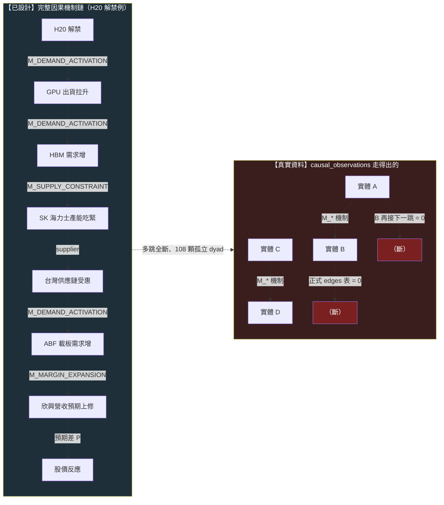

左邊是設計該連通的八跳機制鏈，每跳掛一個 `M_*` 機制；右邊是資料真的有的——一堆兩點對，接不到第三點，正式邊表空。

## 修法：把因果鏈當進化目標，先填實一條

因果層的補法與 進化目標的重構是同一步：

1. **換目標**：進化迴圈的適應度**加動能懲罰**（三份報告共同的 P0 行動），並把「勝出」的定義從「子代 Sharpe 高」改成「一條機制鏈的前瞻預測被市場證實」。沒有這步，實驗 002／實驗 003的病會一直復發：優化績效永遠通向 beta。
2. **填實一條鏈、預註冊驗證窗**：選 ONE 條真鏈（H20/HBM 供應鏈或台電重電），把每一跳建成一條 `causal_observations` 帶機制與證據錨點的邊，**逐跳串連**（B 的 target 是 C 的 source），提升進正式 edges 表；再對鏈尾預註冊一個前瞻假說（沿 MIEE hypothesis 預註冊凍結：判準凍結、到期對帳），看它事後對不對。這就是 時間層說的「進化目標的最終形態＝帶完整時間約束的時態因果模式」。
3. **先對齊機制詞彙**：擴鏈前把 mcm 的 9 個 `M_*` 與世界訊號的 30 個 `M_*` 建對映表（目前只 1 個 exact），否則兩套機制語言分岔、鏈接不起來。
4. **走薄縱切、不蓋 11 層**：因果層不獨立擴建，它是 世界 → 知識 → 因果 → 假說 那條薄縱切的一段；為什麼不能一次把 Research OS 11 層都蓋出來，見 誠實紀律的 architecture-first 警告。

一句話收束：**因果層有機制詞彙、有傳導欄、有觀察表——唯獨沒有把觀察串成鏈的邊，也沒有一個會獎勵「學到因果」的目標**。實驗 002 已經證明：只要目標還是策略績效，這台引擎就只會一次次撿回動能 beta，永遠學不到 `H20 → HBM → 欣興` 那條鏈。

延伸閱讀：為什麼進化目標本身要重寫 → 進化的目標設錯了（病灶六）；一則新聞的知識子圖 → 知識層：一則新聞展開成一張知識子圖；世界狀態當根 → 世界模型：世界不是新聞，新聞是世界狀態的 delta；消融如何拆穿動能 beta → 實驗 002：交互超邊消融；帶時間約束的時態因果模式 → 框架：時間層（時態邏輯節點）；機制詞彙的兩套對映缺口 → 框架：質化引擎（新聞→世界模型→特徵→Alpha工廠）。

---

<a name='research-loop'></a>
# 〔research-loop〕研究迴圈：世界→知識→假說→驗證→更新世界模型

這一頁畫出整套系統**真正的主軸**。前面那些頁——進化迴圈、十道閘、各實驗頁——講的是「策略怎麼被生成、回測、裁決」。那些都對，但它們只是這條更大迴圈的**一小段下游**。owner 的重構要求把主軸講清楚：

> **認知答案**：研究迴圈的主軸是一個**以世界模型為根**的循環——**世界 → 事件 → 知識 → 假說 → Alpha → 回測 → Paper → 部署 → 交易 → 驗證 → 更新世界模型**。策略（Alpha）只是這條鏈上的**一個節點**，不是根；prompt、workflow、agent 這些東西全都是**工具**，不是被研究的對象。真正被研究、被演化的核心是那條最短的因果脊椎：**世界 → 知識 → 假說 → 驗證**。
>
> **行動答案**：判斷任何一項工作屬於研究還是雜務，就問它服務的是「世界→知識→假說→驗證」哪一段。目前這條迴圈**只有下游的一小段（Alpha→回測→驗證）真的有資料在流**，上游（世界→事件→知識→假說）幾乎是空的——所以下一步不是把下游優化得更漂亮，是把上游一條真鏈接起來（見 研究作業系統 的薄縱切）。

```mermaid
flowchart LR
    W["世界 World<br/>world-model · 機制與傳導"]
    E["事件 Event<br/>新聞抽取 · MIEE eventize"]
    K["知識 Knowledge<br/>knowledge-layer / causal-layer"]
    H["假說 Hypothesis<br/>hypothesis-engine · 預註冊凍結"]
    A["Alpha<br/>特徵→策略基因"]
    BT["回測 Backtest<br/>唯一評分器＋十閘"]
    PA["Paper<br/>模擬帳演習"]
    DP["部署 Deploy<br/>shadow / production"]
    TR["交易 Trade<br/>真錢永不自動"]
    VF["驗證 Verify<br/>settle 對帳 / walk-forward"]

    W --> E --> K --> H --> A --> BT --> PA --> DP --> TR --> VF
    VF -->|"更新世界模型"| W
    style W fill:#0f5c52,color:#fff
    style K fill:#20201a,color:#e08a8a
    style H fill:#20201a,color:#e08a8a
```

上圖用綠色標根（世界模型）、用暗色標**目前幾乎空殼**的兩段（知識、假說）。這張圖最重要的一件事，是那條從**驗證回到世界模型**的箭頭：一次研究的產出，最終要**改寫系統對世界怎麼運作的理解**，而不只是新增一條策略。這條回路目前幾乎沒有資料在流——那正是整台機器最大的缺口。

## 一、逐節點：這是什麼、誰承載、現在有沒有資料在流

| 節點 | 是什麼 | 誰承載 | 現在真的在流嗎 |
|---|---|---|---|
| **世界** | 對「什麼機制驅動什麼結果、怎麼傳導」的可反證理解 | 世界模型：世界不是新聞，新聞是世界狀態的 delta（設計書第四部＋`wm_mirror` 六動詞鏡射） | **幾乎沒有**：正式 edges 表 0 筆、供應鏈僅一階 |
| **事件** | 從新聞抽出帶錨點引文的結構化事件 | MIEE eventize（mcm 唯讀上游） | 有雛形：MIEE 613 顆事件；但新聞真歷史**僅 15 天** |
| **知識** | 事件→影響→傳導落成帶證據的圖與因果邊 | 知識層：一則新聞展開成一張知識子圖／因果層：新聞→事件→供需→公司→財報→預期→價格 | **幾乎空殼**：`causal_observations` 約 108 筆、正式因果 edges 0 筆 |
| **假說** | 從知識缺口提出**可反證**、預註冊凍結的假說 | 假說引擎：從「今天有哪些新聞」到「今天最大的未知是什麼」（MIEE 假說機為雛形） | 部分：MIEE 有 3,412 筆前瞻預測帳；策略側仍純碼枚舉 |
| **Alpha** | 把世界狀態寫成可組合的特徵與策略基因 | 特徵代數→策略基因 | **在流**：特徵代數上線、DSL 六算子落地 |
| **回測** | 部署同形淨值引擎＋唯一評分器＋十閘 | 方法：證據閘（十道關卡）（AARO harness） | **在流**：四輪實驗真跑（000～003） |
| **Paper** | 畢業策略先進模擬帳演習，與真錢零耦合 | 框架書 paper-account | 有雛形：AARO 畢業策略可餵模擬帳；自動投遞未接 |
| **部署** | shadow → production 的權力階梯 | 人機權力表 | **未到**：全部封頂 provisional，無一升 supported |
| **交易** | 真實下單、成本、CA 閘 | 框架書執行層 | **未到**：真錢永不自動（人按 CA 閘是天然護欄） |
| **驗證** | 預測到期對帳、walk-forward 樣本外 | MIEE settle／walk-forward | 部分：MIEE 845 筆已對帳；策略側 **walk-forward 一輪都沒跑** |
| **更新世界模型** | 驗證結果回寫、改寫系統對世界的理解 | wm_mirror 六動詞 | **幾乎沒有**：這條回路目前只鏡射裁決摘要，未改寫世界模型本身 |

一眼看懂這張表：**中段（Alpha→回測）是全機最成熟、資料最密的一段**——那也是為什麼過去所有漂亮成果都集中在這裡。但研究迴圈的**頭（世界→事件→知識→假說）和尾（驗證→更新世界模型）幾乎是空的**。系統很會生成與回測策略，卻幾乎不會「從世界長出假說」，也幾乎不會「把驗證結果回饋成對世界的新理解」。

## 二、prompt／workflow／agent 只是工具，不是被研究的對象

這條主軸還澄清了一個常見的位階混淆。做這套系統時，會用到大量 prompt、workflow、多 agent 編排——但**它們都是工具，不是研究的對象**。把 prompt 調得更好、把 workflow 串得更順，本身不產生任何 Alpha，也不改寫任何一條對世界的理解；它們只是讓「世界→知識→假說→驗證」這條脊椎跑得更省力的器械。

這一點直接呼應 進化目標 那頁的病灶：如果把「被演化的東西」設成策略／程式／prompt，你就是在優化工具，不是在優化理解。AlphaEvolve 演化程式是對的，因為在它的場域裡**程式就是產品**；在量化裡，產品是**對市場的可反證理解**，prompt 和 workflow 只是通往它的路。判斷一項工作值不值得做，永遠回到那條脊椎——**它讓世界模型變得更能被反證地預測了嗎？還是只是把工具磨亮了？**

## 三、被慶祝的「進化迴圈」，其實只是這條主軸的下游片段

這是本頁對既有敘事最直接的修正。進化迴圈那頁講的六步——Graph Retrieval → Gap Detection → Hyperedge Completion → Controlled Mutation → Experiment → Graph Writeback——是一個**很漂亮、機件也真的會轉**的閉環。但把它疊到上面那條主軸上就會看清楚：**它整個活在「Alpha → 回測 → 驗證」這一小段裡**。

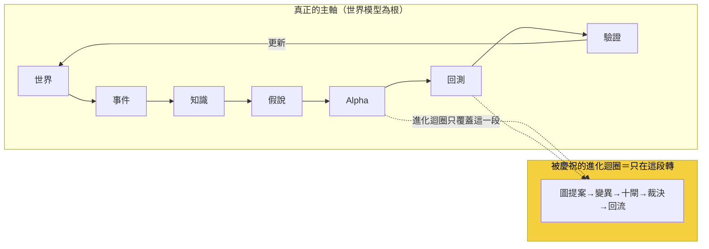

它是策略層的一個**子迴圈**：在既定的特徵與規則空間裡，變異出下一條策略、回測、比父子、寫回。它完全**不碰**「世界→事件→知識→假說」這條上游——它的「Gap Detection」找的是**策略空間**的空洞（哪組因子沒共測過），不是**世界模型**的空洞（哪條傳導機制還沒被反證地理解）。這正是為什麼放手讓它跑，它只會在策略空間裡愈鑽愈深，最後鑽到動能 beta（實驗 003）——因為它的搜尋範圍裡，根本沒有「世界」這個維度。

所以「策略只是一個節點、不是根」不是修辭：**被當成整台引擎的進化迴圈，位階上只是主軸的一段下游子迴圈。** 把它誤當主軸，就會一直優化下游、永遠不碰上游。

## 四、誠實邊界（不得省略）

- **這條主軸目前只有中段真的在流**。世界、知識、假說（頭）與驗證、更新世界模型（尾）幾乎空殼——具體資料量：世界模型正式 edges 0 筆、因果觀察約 108 筆、供應鏈一階、新聞史 15 天、策略側 walk-forward 未跑、真錢未動。這些是 2026-07-22 快照，隨活管線浮動。
- **上游不是靠「多蓋幾個引擎」補起來**。把世界模型層、知識層、因果層各建一個空殼，正是 研究作業系統 警告的 architecture-first 陷阱。補法是薄縱切：挑**一條**真鏈（如台電強韌電網／CoWoS 擴產），讓資料真的從世界一路流到驗證、再回寫世界模型一次。
- **「更新世界模型」這條回路是最大缺口，也最難**。目前 `wm_mirror` 只把裁決摘要鏡射進世界模型基底，並**未真的改寫**系統對世界怎麼運作的理解。讓驗證結果回饋成新的因果邊、新的機制身份、新的時態超邊——那才是這條迴圈之所以叫「迴圈」的原因，而它現在幾乎是斷的。
- **既有實驗全部有效、但都在中段**。exp-000～003 的機件、消融、帳務都真跑且經獨立重算；本頁不改它們，只是把它們**定位回主軸的下游片段**，並指出頭尾兩端才是下一步。

一句話收束：**這台引擎很會走中間那段路（生成、回測、驗證策略），但研究迴圈的頭（從世界長出假說）和尾（把驗證寫回世界模型）幾乎還沒開始走。** 把主軸擺正、把目標換成世界模型的可反證預測力，然後用一條薄縱切把整條脊椎走通一次——這比把下游子迴圈再優化十遍都重要。

延伸：為什麼世界模型該當根、策略級目標為何會壞見 進化目標；11 層架構與「別蓋空引擎」的紀律見 研究作業系統；世界模型層與因果層的真實空殼見 世界模型：世界不是新聞，新聞是世界狀態的 delta／因果層：新聞→事件→供需→公司→財報→預期→價格／知識層：一則新聞展開成一張知識子圖；把假說變成可反證一等公民見 假說引擎；下游子迴圈的機件細節見 進化迴圈；四輪真跑實驗見 實驗索引。

---

<a name='hypothesis-engine'></a>
# 〔hypothesis-engine〕假說引擎：從「今天有哪些新聞」到「今天最大的未知是什麼」

## 一句話：把研究的第一個動作從「蒐集」換成「提問」

自動研究最容易長歪的地方，不是不會算，是**問錯了第一個問題**。一台每天問「今天有哪些新聞、哪個因子又漲了」的引擎，會不停地蒐集、比對、找出「這段樣本裡誰付錢」——然後把「誰付錢」誤當成「我懂了什麼」。假說引擎要換掉的就是這個第一動作：每天先問一句**「對這個市場，我現在最大的未知是什麼？」**，再讓整條研究線去解那個未知。

這一頁是 owner 病灶清單第六條（進化的**目標**定義錯了）的解法面。病灶本身寫在 進化目標，整條研究迴圈的骨架寫在 研究迴圈，本頁只負責一件事：**把「知識缺口 → 假說 → 實驗設計 → 回測 → 成立? → 更新知識」這個閉環講清楚，並誠實對帳它現在到底做到哪、缺在哪一層。**

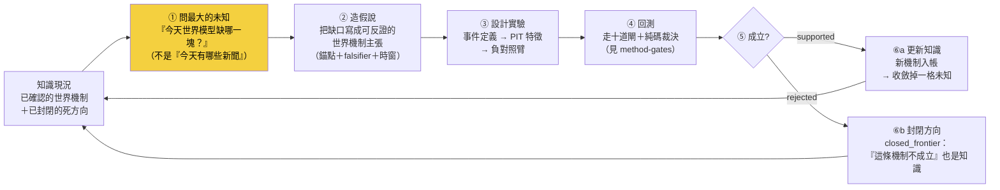

黃色那格是全頁的重點。**引擎的價值不由「找到多少 Alpha」決定，而由「每天問對哪個未知、收斂掉哪一格未知」決定。**Alpha 是這個閉環轉動時掉出來的副產品，不是它瞄準的目標。

## 病灶六：目前這台引擎問的是「該換哪個濾網」，不是「該解哪個世界機制」

owner 的批評很尖：wiki 把「策略／程式／prompt」當成進化對象（像 AlphaEvolve 那樣優化 Min Loss／FLOPs），於是進化迴圈每天問的其實是「當前最佳策略的下一個單變因變異該試哪個」。這在 進化迴圈 裡是明擺著的：`gaps.propose_next()` 沿四條軸枚舉——

- **機制軸**：換一個強勢濾網的 X 轉換（區間位置／趨勢一致性／創新高／高位持續性／原始動能）；
- **結構軸**：拆掉濾網、看純 rank 有沒有增量；
- **參數軸**：同機制換門檻／窗口／TopN；
- **退出軸**：提前賣天數 A↔B 翻轉。

四條軸全部是**策略內部的變異方向**。它問的是「這台策略機器的下一顆螺絲該換哪一顆」，而**不是**「這個市場我還有哪一塊機制沒搞懂」。這就是病灶六在假說層的具體長相：**提案器活在「特徵／策略變異層」，不在「世界未知層」。**

## 誠實對帳：已經有什麼、其實是空殼、擺錯在哪一層

不能說「完全沒有假說引擎」——骨架是有的，而且是全機最完整的研究記憶之一。但也不能說「已經在解世界未知」——它解的全是策略變異。三態攤開：

| 元件 | 狀態 | 事實（資料截止 2026-07-22，讀 `data/aaro.sqlite`） |
|---|---|---|
| `research_gap` 缺口表 | 【已設計・在用】 | schema 齊全（gid／question／source／family／priority／rationale／status），有真資料在跑 |
| `next_agenda()` 純碼排序 | 【已設計・在用】 | `kb.py`：讀 `research_gap` 取 `status='open'`、按 `priority DESC` 排序，**純碼排、非 LLM 觀感**——這條紀律是對的 |
| `closed_frontier` 死方向帳 | 【已設計・在用】 | 死方向入帳、查重閘 `check()` 會擋重撞（負結果同權入帳） |
| `gaps.propose_next()` 提案器 | 【已設計・在用，但擺錯位階】 | 四軸枚舉全在策略變異層（見上節） |
| **缺口內容的層級** | **【擺錯位階】** | **這是最誠實的一格，見下** |
| 世界機制缺口提案 | 【幾乎空殼】 | 帳上**沒有任何一條** gap 是在問「世界機制未知」 |

第五、六格是要害。把帳上目前所有還沒解的缺口（`status='open'`）攤出來看，它們**全部**是策略／因子層的問題：

| gid | 問的其實是什麼 | 家族 | 這是哪一層的問題 |
|---|---|---|---|
| `king_ablation` | 王牌 king2 策略的成分（rev／指紋／籌碼／四閘）各貢獻多少 | king2 | 策略內部歸因 |
| `king_aaro_addon` | AARO 的營收過濾／低換手能不能對 king2 加值 | king2 | 因子疊加 |
| `lineage_R015` | 低波動品質 × 營收過濾動能 做低相關組合、分散後 Sharpe | interaction | 因子交互 |
| `lineage_R011` | 已確認的營收過濾動能純多頭接真前瞻帳 | growth×momentum | 驗證換真對帳 |

**連那條資料庫裡真的被標成 `source='knowledge_gap'`（知識缺口）的條目，內容也是「兩條確認線相關應低、分散可能提升 Sharpe」——依然是因子相關性的問題，不是世界機制的問題。**這不是找碴：它精準印證了病灶六。提案器有一個叫「知識缺口」的欄位，但欄位裡裝的仍是策略調參層的內容。`closed_frontier` 也一樣——已封閉的三個方向（`regime_gated_cost_after`／`path_quality_over_momentum`／`institutional_cross_sectional`）全是因子家族的死路，沒有一條是「某個世界機制被證偽」。

一句話收斂這個對帳：**假說引擎的「殼」是好的（缺口帳＋純碼排序＋死方向入帳），但它裝的「內容」全在策略變異層。要升級的不是重寫殼，是把提問抬高一層。**

## 為什麼「子代 Sharpe 勝父代」是錯的進化目標

這不是空談，我們自己的實驗正面撞上了它。進化迴圈 目前的適應度就是「子代 CAGR／Sharpe 是否勝過父代」。把這個目標交給自主迴圈放手優化，實驗 002 的結果一點都不客氣：

- 迴圈從候選 C 出發，一路換強勢機制，報酬越換越高（某代 Sharpe 衝到 2.06）；
- 但對 C 跑乾淨的四臂消融，判定 **`conflicting`**——C 的優勢**幾乎全是動能 beta 相加**，不是「月營收 × 價格強勢」的真綜效。純動能自己的 Sharpe 就已經 1.52，和「營收＋強勢」一模一樣；
- 結論：**放手讓迴圈優化策略級指標，它就一路走進更純的動能暴露**——因為在這段多頭樣本裡，動能就是會付錢。

這正是病灶六的證據。優化「策略級指標」（Sharpe 勝父代）的終點，是**重新發現一個大家早就知道的 beta**，而不是多懂一分這個市場。要優化的目標應該換成**世界模型的可反證預測力／知識缺口的收斂速度**——問「這條機制假說撐不撐得過樣本外」，而不是問「這顆螺絲換完 Sharpe 有沒有比較高」。目標一換，同一台迴圈機器追的東西就從「beta 換皮」變成「可被否證的世界機制」。詳細的目標重構論證在 進化目標。

## 升級的樣子：把提案器抬到「世界未知層」

現況與目標並排，差別就是提問的高度：

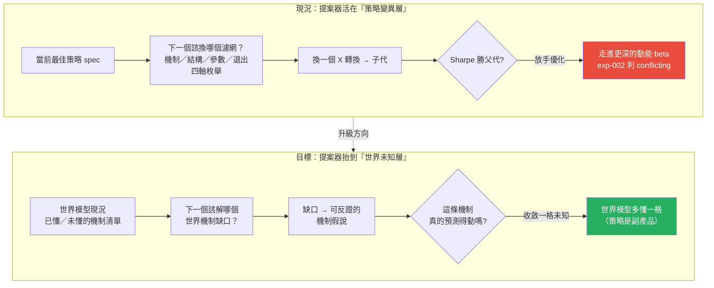

具體升級成什麼樣，就是把本頁頂上那個閉環真的接起來：

1. **問未知**：`propose_next()` 的枚舉來源，從「當前最佳策略的四軸變異」換成「世界模型帳上標記為未懂／低信心的機制節點」。缺口不再是「該換哪個濾網」，而是「營收加速 → 法人上修 之間的傳導延遲，我到底知不知道？」。
2. **造假說**：缺口編譯成一條**可反證的世界機制主張**，帶錨點引文、falsifier、時窗（沿 世界訊號 反證必填與 質化引擎 錨點紀律）。
3. **設計實驗**：假說自動展開成事件定義 → PIT 特徵 → 負對照臂（這一段的機件其實已經有——見 十道閘、消融）。
4. **回測＋裁決**：走完與價量特徵完全相同的十閘與純碼裁決，LLM 一個字都不進 verdict 欄。
5. **成立? → 更新知識**：`supported` 就把新機制寫進世界模型、收斂掉一格未知；`rejected` 就把「這條機制不成立」寫進 `closed_frontier`——**兩種結果都讓世界模型多懂一分**。

換句話說：**閉環的每一步機件幾乎都已經存在，缺的只是把第①步的提問來源從「策略 spec」換成「世界模型的未知清單」。**這是位階的搬移，不是從零蓋一套新引擎。

## 薄縱切紅線：不要為了這個升級去蓋一台「世界未知提案器」大工程

這裡有一個必須先說清楚、否則會直接踩雷的地方。把提案器抬到世界未知層，**聽起來**像是要蓋一套「掃描全世界機制缺口 → 自動排序 → 自動提假說」的宏大系統。**別。**那正是 誠實紀律 第六條點名的 architecture-first 致命盲點——先把大架構鋪滿、日後研究失敗卻無法歸因到哪一層。

正確的修法分兩刀，成本與正確性完全不同：

- **第一刀（現在就做，便宜且正確）**：重構敘事主軸與進化目標。把 wiki 的問題從「該換哪個濾網」改寫成「該解哪個世界機制未知」，把適應度從「子代 Sharpe 勝父代」改成「機制假說的可反證預測力」。這只動觀念與目標函數，不動架構。
- **第二刀（走薄縱切，不蓋空引擎）**：**只挑一條**真實的「世界 → 知識 → 假說 → 驗證」機制鏈，把它從頭填滿——例如 CoWoS 擴產 → 台積電產能 → 相關供應鏈的傳導，或台電強韌電網 → 受惠標的的傳導。用這一條真鏈把假說引擎的閉環走通一次，證明「問世界未知」真的比「問策略變異」多找到東西，**再**談要不要推廣。**先把一條鏈填滿，不要先把十一個引擎的殼擺滿。**

這兩刀的順序不能顛倒：沒有第一刀，第二刀填出來的鏈仍會被舊目標拉回去追 beta；沒有第二刀只有第一刀，敘事對了但沒有任何真證據證明升級有價值。

## 誠實邊界（不得省略）

- **本頁描述的閉環尚未以「世界未知」為輸入真跑過**。頂部那張 缺口→假說→實驗→更新 圖，第②–⑤步的機件（假說、事件研究、PIT 特徵、十閘、純碼裁決）在 實驗 002 已對**策略層**假說真跑；但第①步「以世界機制未知為提問來源」目前**沒有**任何真資料——帳上零條世界機制缺口。
- **`research_gap` 的內容全在策略／因子層**，連 `source='knowledge_gap'` 的那條也是因子相關性問題。這是本頁最重要的誠實對帳，不是修辭。
- **提案器的「機制軸」名字會誤導**：`gaps.py` 裡的「機制軸」指的是換一個**技術指標的 X 轉換**（強勢怎麼算），不是換一個**世界機制**（供應鏈怎麼傳導）。同一個「機制」詞，在策略變異層與世界未知層意思完全不同，讀 方法：進化迴圈（圖提案→變異→裁決→回流） 時要分清楚。
- **升級沒有把握一定找得到東西**：即使把提問抬到世界未知層，也完全可能「解完那格未知、發現它對報酬沒有增量」。這是合法結局——收斂掉一格未知本身就是知識，不保證換得到 Alpha。這條沿 誠實紀律 的三效度閘：能跑 ≠ 有效。
- **與世界模型層的空殼互為因果**：假說引擎問不出世界未知，一部分原因是世界模型層本身近乎空帳（正式 edges 表 0 筆、供應鏈只 1 階）——見 世界模型。兩層要一起薄縱切，不能只補一層。

延伸：進化目標為什麼錯、該換成什麼，讀 進化目標；整條研究迴圈的骨架，讀 研究迴圈；現行提案器的純碼細節與四軸枚舉，讀 進化迴圈；那條 exp-002 的 conflicting 證據，讀 實驗 002。

---

<a name='lang-quant'></a>
# 〔lang-quant〕量化結構組成語言（總覽）

這一整組頁面回答一個問題：**要讓機器自動進化出 Alpha，策略必須先能被拆解成合法的、可組合的、可驗證的語言單元**——不能是一段任人寫的 Python，也不能是一串不透明的因子字串。總覽講的是「為什麼要有進化迴圈」，這裡講的是「進化迴圈拿什麼當基因」。

先給一句認知主軸：**策略不是「條件→動作」，而是「世界狀態 S → 對未來報酬的期望 E[R|S] → 排序 → 政策 → 組合」**（詳見 策略本體論）。這條映射的每一段，都需要一種專門的語言來描述，否則機器只能盲目回測、無法歸因「這一代到底改了什麼、改的是哪一層」。五層語言就是為這五段各配一種文法。

## 整體架構：五層語言由下而上

這五層不是嚴格堆疊的塔（它們最終都餵進同一份 StrategySpec 策略基因），但用「由下而上」的方式理解它們最省力——下層是上層的積木：

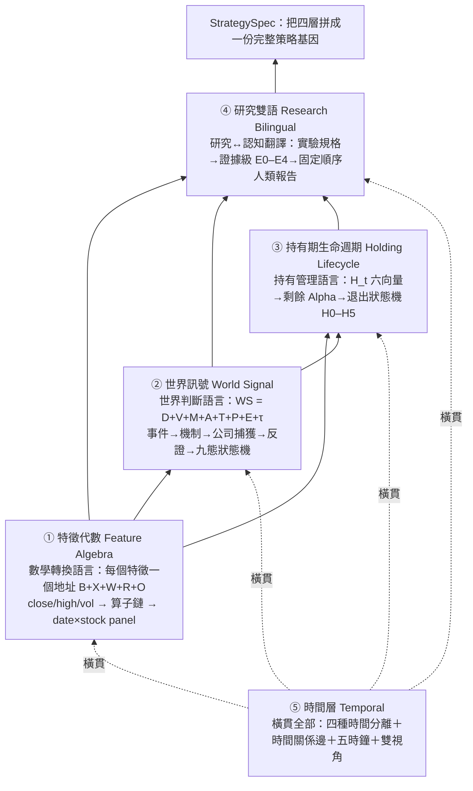

一句話讀懂這張圖：**特徵代數是最底層文法（一切數字都是它算出來的）；世界訊號把「世界判斷」也升級成同樣可組合可反證的語言；持有期生命週期用底下兩層的特徵去管「入選後怎麼抱」；研究雙語把上面所有實驗編譯成人能讀、能判斷的報告；時間層則橫貫這四層，確保每一個判斷都站在「當時真的能知道」的資訊上。**

## 五層各自負責什麼

| 層 | 頁面 | 回答的問題 | 核心單位 | 現況 |
|---|---|---|---|---|
| ① 數學轉換 | 特徵代數 | 這個特徵到底怎麼算出來的？ | 地址 `B+X+W+R+O` | 已上線（systemd 8983），零改動沿用＋擴造策略層 |
| ② 世界判斷 | 世界訊號 | 這家公司在什麼世界機制裡、市場定價到哪、什麼會證明我錯？ | 地址 `D+V+M+A+T+P+E+τ` → 九態 | 引擎已上線（systemd 8986），但世界層數值是示意佔位、未接真資料源 |
| ③ 持有管理 | 持有期生命週期 | 月頻選股入選後，這檔的「剩餘 Alpha」還有多少、何時該退？ | 持有狀態向量 `H_t` 六組 → `H0–H5` | 骨架上線＋研究問題一已真跑（finlab 覆核）；A/B/C/D 完整比較未做 |
| ④ 研究↔認知 | 研究雙語 | 這份實驗的證據到哪一級、語氣能不能超過證據、人該怎麼行動？ | 證據級 `E0–E4`＋行動十態 | 編譯器已上線（systemd 8987）；尚未成為所有實驗必經出口 |
| ⑤ 時間 | 時間層 | 什麼事在什麼時候發生、傳導多久、現在走到哪個階段、當時能不能做這判斷？ | 時態邏輯節點（十塊 schema） | 大部分為設計；只有事件錨＋t+1、`qual_edge` 時效欄已落地，其餘標「待補」 |

## 為什麼是「語言」而不是「特徵集合」

這是整個專案最容易被誤解的地方。傳統量化平台把因子當成一堆字串（`"RK((PCTCHG(close,1)>0).rolling(120).mean())"`），再用 AST 白名單事後擋掉非法的。問題是：**字串的表達空間無限大，白名單只能被動防守，LLM 可以寫出任何看起來合理但機制錯亂的字串。**

五層語言反過來做——**用型別化算子建構，能表達的空間「就是」合法空間**。於是 LLM 的角色從「自由造詞」被壓縮成「在合法文法裡組合」：它只投稿結構化的 spec 片段，判決永遠是純程式碼。這條信條（LLM 只提案、判決純碼）貫穿全部五層，也是進化迴圈能自我否證、而不是自我催眠的根本原因（見 實驗 003：機器對自己生的漂亮結果判了 conflicting）。

## 這五層怎麼被進化迴圈用

五層語言是「基因的文法」；StrategySpec 是「一條具體基因」；進化迴圈 則是「讓基因一次改一個字母、比較父子、把成敗寫回記憶」的機制。一次進化的最小動作是：沿某一層的某一個軸做**受控變異**（一次一變因），編譯成新的 StrategySpec，過 十道證據閘，由 研究雙語 編譯成報告，再寫回 知識圖譜。

已經真跑過的例子直接展示了這條鏈：實驗 000 只變異「退出時點」這一個部件（用到 持有期 的 H5）；實驗 001 只變異「選股」一個部件（用到 特徵代數 組出 250 日價格強勢濾網）；兩者都被誠實封頂在 provisional／E2、不改真錢。

## 誠實邊界

- 這五層裡，只有 特徵代數 是「零改動沿用」的成熟件；世界訊號 的世界層數值是示意佔位、且缺探索通道（方向裁決點名的真缺口）；持有期 只有研究問題一真跑過；研究雙語 的種子實驗數字是示意；時間層 幾乎整層是設計、大量欄位標「待補」。
- 這五層目前**沒有一層被證明有「增量效度」**——也就是「加了這層是否勝過只用簡單基準」尚未有 A/B 對照數據。方向裁決把這件事立為總體 kill criteria：三條真研究線、100 筆真案例後若無增量，沒有增量的層要被拆除。
- 質化側的語言（新聞→世界模型→特徵）另見 質化結構組成語言，不在本組五頁內。

下一步請往下走：先讀最底層的 特徵代數，它是理解其餘四層的前提。詞彙不熟可隨時查 詞彙表。

---

<a name='fw-feature-algebra'></a>
# 〔fw-feature-algebra〕框架：特徵代數

**特徵代數（Feature Algebra）**是五層量化語言的最底層文法。它做一件事：把量化特徵從「一串不透明字串」變成「一棵型別化、可組合、可驗證、可運算的轉換樹」。所有上層語言——世界訊號的觀測、持有期的六組狀態向量、研究雙語假說裡的 features 欄——最終都得用它的地址來表達，否則就是散字串、不可 PIT、不可驗算。

服務已上線：systemd 8983，入口 `tailscale /featalg`（tailnet-only），程式碼在 `FOR_AGENT/feature-algebra/`。

## 核心觀察：L（抽象層）只是標籤，真正區分特徵的是 X（Transform）

先看一個會讓人卡住的問題。「創新高、移動平均、報酬率、波動率、分位數」——這幾個特徵，如果只用「抽象層 L」來描述，它們可能全都是 L1 或 L2。但它們的**運算機制完全不同**。所以 L 這個標籤根本沒有區分力：

> 「L 一樣不代表特徵一樣；真正區分它們的是 X（Transform，做了什麼數學轉換）。」

這就是為什麼一個特徵不能只有一個名字或一個層級，而要拆成一個**完整地址**：

```
Feature = B + X + W + R + O           （L 只是抽象深度的標籤，不是完整公式）

  B  Base Input     原始輸入是什麼？     close / high / low / open / vol / amount
  X  Transform      做了什麼運算？       聚合 XA / 關係 XR / 正規化 XN / 時間 XT
  W  Window         用多長的窗口？       250 / 120 / 20 …
  R  Reference      跟什麼基準比較？     自身歷史高 / 自身均線 / 橫斷面同儕 …
  O  Output Type    最後輸出什麼型態？   布林 / 0–1 / 連續 / 計數
```

`X`（轉換算子）是這個地址的靈魂。它分四類：**聚合類 XA**（RollMax/RollMean/RollMin…）、**關係類 XR**（GE/RatioMinus1…）、**正規化類 XN**（MinMaxScale/RankPct…）、**時間類 XT**（TimeSinceEvent…）。同一個 Base 加同一個 Window，換一個 X 就是完全不同的特徵：

| 特徵 | Base | Transform 鏈（X） | Output | 公式 |
|---|---|---|---|---|
| 250 日創新高 | Close | RollMax → GE | 布林 | `𝟙[Close ≥ Max(Close_{t-250:t-1})]` |
| MA250 | Close | RollMean | 連續 | `Mean(Close, 250)` |
| MA250 乖離 | Close | RollMean → RatioMinus1 | 連續 | `Close / Mean(Close, 250) − 1` |
| 250 日區間位置 | Close | RollMin → RollMax → MinMaxScale | 0–1 | `(Close − Min250)/(Max250 − Min250)` |

四個特徵的 B（Close）與 W（250）完全一樣，`L` 也可能一樣——但因為 X 鏈不同，它們是四個機制不同的特徵。這張表就是「L 只是標籤」的直接證明。

## 一個特徵怎麼從 DSL 變成可算的樹

架構的關鍵是：**能被文法建構出來的空間，就是合法特徵空間**。LLM 只投稿一段 DSL 字串，`from_dsl()` 負責驗證＋編譯成一棵轉換樹，非法（元數/窗口/分位/型別錯）就地拒絕：

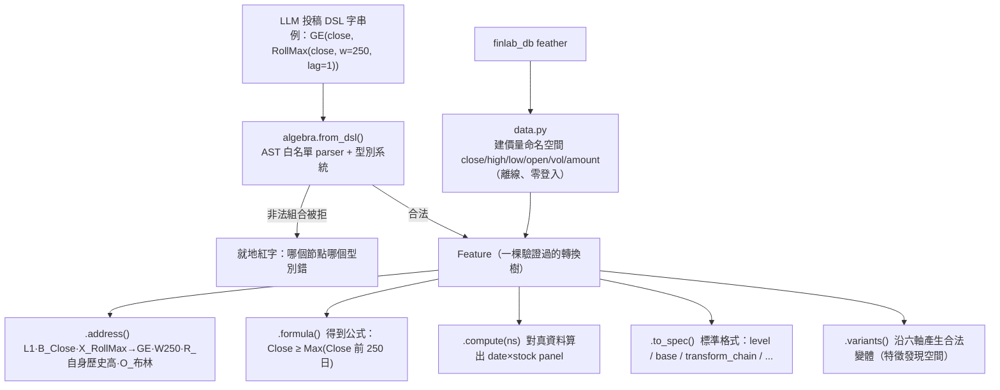

每棵樹的節點都會**推導 dtype**（型別），非法組合在建構期就被擋——這跟「先讓 LLM 亂寫字串、再用白名單事後過濾」是相反的方向。`.address()`／`.formula()`／`.tree()` 全部由樹結構純程式碼算出，不靠 LLM 判斷；這是「確定性的歸給程式」信條（見 誠實紀律）在特徵層的落地。

## PIT 安全靠構造，不靠事後檢查

Point-in-Time（PIT，只用當時真的能知道的資料）在這一層是**靠算子庫的設計保證的**，不是靠檢查器補救：

- 代數裡**沒有任何前視算子**（沒有 `shift(-w)` 這種能偷看未來的操作）。
- `lag=1` 的語意就是「不含當日」——250 日創新高比較的是 `Close_{t-250:t-1}`，不含 t 日自己。
- 洩漏探針（leakage probe）對 12 個種子目錄特徵 F001–F012 全數通過。

要強調的是：這裡保證的是**運算合法**（算子沒有前視），不等於**資訊合法**（那筆觀測在 as-of 時點是否真的以當時形態可得）。後者是資料版本契約的事，特徵代數目前只有運算層 as-of，缺 `ingested_at`／`revised_at`／`source_version` 等欄位——這是方向裁決點名的真缺口，歸 twdata 自建資料線與時間層處理（見下方誠實邊界）。

## 沿六軸產生合法變體＝特徵發現空間

`.variants()` 是進化迴圈拿來當「特徵層變異生成器」的關鍵能力：給定一個特徵，沿窗口 W／算子 X／基準 R／輸出 O／門檻／時間軸六個軸，**系統化產生合法的變體**。這讓 進化迴圈的變異不是「LLM 亂改一句話」，而是「沿代數軸一次改一個座標」——這正是StrategySpec要求「特徵層的 MOVE 必須落成 B/X/W/R/O 的結構 diff」的底層能力。

## 這一層在哪些真實驗裡被用過

- **實驗 001（生成候選 C）**：候選策略 C 的「250 日價格強勢濾網」，就是用特徵代數組出來的一條可執行、無前視的布林特徵。附錄記錄的真實 DSL 是 `GEc(RankPct(MinMaxScale(close, RollMin(close, w=250), RollMax(close, w=250))), c=0.5)`，地址＝「L3·B_Close·X_RollMin→RollMax→MinMaxScale→RankPct→GEc·W250·R_橫斷面同儕·O_布林」，fid=`2c2ad96b2d0b`。這證明了「用型別化算子組合，能表達真正想要的濾網，且自動帶完整推導樹」。
- **H-DEV2（特徵代數當變異生成器的那一代，AARO 帳內有紀錄）**：示範了「生成器忠實閘」——語言引擎的輸出 vs AARO 命名空間的實際計算，在已知切片上逐位元對帳，相關係數 `corr=1.000000`。這是十道證據閘裡「生成器忠實閘」的原型做法。
- **實驗 003（圖驅動進化）**：自主迴圈的每一代都在變異特徵代數的算子（換強勢機制：高位持續性→動能 120→創新高 250），三代 genome 互異證明是真變異。但也暴露了一個教訓——放手讓迴圈追報酬，它會一路走進更純的動能暴露（見該實驗的 conflicting 裁決）。

## 誠實邊界

- **資訊版本契約未補**：特徵代數只保證運算層 PIT（算子無前視），缺七時戳資訊合法性契約（`event_time`/`published_at`/`available_at`/`ingested_at`/`revised_at`/`source_version`/`entity_mapping_version`）。拿不齊的欄位在 資訊合法性閘一律標 blocked，不准用現值近似歷史可知值。此契約歸 twdata 資料線。
- **策略層算子不在本層**：特徵代數止於「產橫斷面 panel」，沒有 filter/top_n/weight/rebalance 這些策略層算子——那些是 `speclang/`（引擎 P0 已落地六算子）的新語言，見 StrategySpec與 整體架構。
- **W 軸教訓入檔**：H-DEV2 的對照臂推翻了「窗長軸＝純調參可自動擋」的假設（|Δ|=0.0107 過門檻）——所以變異引擎的自動擋參規則要保守，調參軸不自動立案、但保留受控對照臂，不得寫死「參數軸一律無資訊」。

延伸閱讀：往上一層是把「世界判斷」也語言化的 世界訊號；特徵代數如何被拼進完整策略基因，見 StrategySpec 九部件。

---

<a name='fw-world-signal'></a>
# 〔fw-world-signal〕框架：世界訊號

**世界訊號（World Signal）**是五層量化語言的第二層。特徵代數把「數學轉換」做成可組合可驗證的語言；世界訊號再往上一階，把**世界事件、經濟機制、公司位置、財務傳導、市場預期、反證條件**也做成同樣可組合、且**可反證**的語言。它要解決的是量化最難的一塊——「這家公司到底在什麼世界機制裡、市場定價到哪、什麼會證明我看錯了」。

服務已上線：systemd 8986，入口 `tailscale /wsignal`，程式碼在 `FOR_AGENT/world-signal/`。

## 核心差別：不要讓 LLM 寫人話標籤

量化最常見的失敗，是讓 LLM 產出「AI 需求很強／政策利多／公司受惠／市場尚未反映」這種**人話標籤**。它們不可計算、不可比較、不可反證——寫了等於沒寫。世界訊號的做法是把每個世界判斷拆成一個完整地址：

```
WS = D + V + M + A + T + P + E + τ

  D  Observation      看到什麼原始世界資料？    台電決標金額 34.5 億
  V  Event            發生什麼事件/轉折？        EV_ACCEL（連續加速）
  M  Mechanism        透過什麼機制改變經濟結構？  政策需求→認證門檻→產能受限→售價提升→毛利擴張
  A  Actor Exposure   哪家公司捕獲、捕獲多少？    曝險×資格×產能×配額×防禦力（幾何平均）
  T  Transmission     利益如何進入財報？          增量營收/毛利/營業利益/現金流橋接
  P  Pricing/Expect   市場已定價到哪？            預期差 = 研究估計增量利益 − 市場隱含
  E  Evidence         依據與反證是什麼？          支持/反對/缺料 + 可觸發的反證條件
  τ  Time             事件/可知/影響的時間結構？   觀測≤公開≤訊號≤影響（PIT）
```

八個欄位每一個都有**封閉詞彙**（見下）。LLM 只准從封閉字典裡組合，不准寫自由文字標籤——考卷實測會擋掉「AI 需求很強」這種不可計算標籤。

## 輸出不是「會漲/不會漲」，是行情演化狀態機

這是世界訊號最關鍵的設計判斷：**輸出不是一次性的選股標籤，而是一個描述「行情演化到哪」的狀態機**（九態，有序）。同一個衝擊在不同的捕獲程度、定價程度、時間點，會落到不同狀態——這才是行情演化，不是靜態貼標。

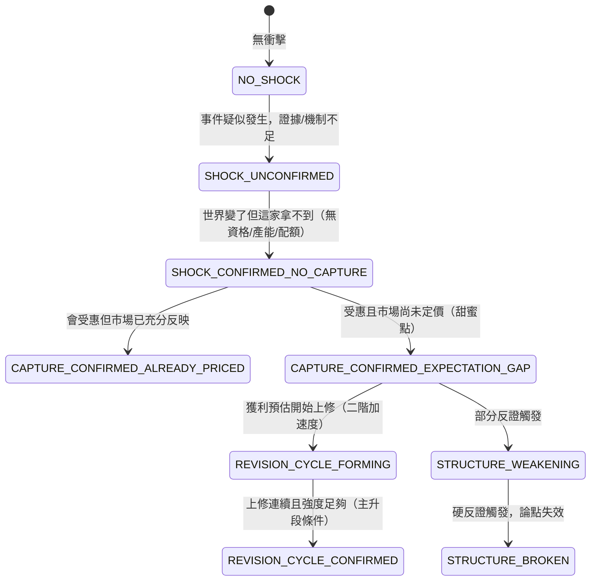

九態的名稱與定義（`worldlang.state_machine()` 純函數推出，同輸入同輸出、附判決依據）：

| 狀態 | 白話 |
|---|---|
| `NO_SHOCK` | 沒有可辨識的世界事件 |
| `SHOCK_UNCONFIRMED` | 事件疑似發生但證據不足/機制未驗證 |
| `SHOCK_CONFIRMED_NO_CAPTURE` | 世界變了但這家拿不到（無資格/無產能/無配額） |
| `CAPTURE_CONFIRMED_ALREADY_PRICED` | 會受惠但市場已充分反映（無預期差） |
| `CAPTURE_CONFIRMED_EXPECTATION_GAP` | 受惠且市場尚未充分定價 ← **甜蜜點（可研究）** |
| `REVISION_CYCLE_FORMING` | 獲利預估開始上修（二階加速度正在形成） |
| `REVISION_CYCLE_CONFIRMED` | 上修連續且強度足夠（主升段條件） |
| `STRUCTURE_WEAKENING` | 部分反證觸發/機制減弱 |
| `STRUCTURE_BROKEN` | 硬反證觸發，論點失效 |

案例庫 WS001–WS006 用同一個衝擊（華城／台電強韌電網）示範了其中六種狀態，證明「同一衝擊、不同捕獲/定價/時間＝不同狀態」。

## 八欄位的封閉詞彙（節選）

封閉詞彙是這一層的鐵律。LLM 組世界訊號時只能從這些清單取值：

- **D 觀測型別**（9 種）：`Price` / `Quantity` / `Capacity` / `Demand` / `Competition` / `Policy` / `Technology` / `Finance` / `Market`。
- **V 事件算子**（11 種 `EV_*`）：`EV_CHANGE`（變化）/ `EV_ACCEL`（加速度，二階）/ `EV_THRESHOLD`（門檻突破）/ `EV_REGIME`（狀態切換）/ `EV_CONCENTRATION` / `EV_EXIT` / `EV_ENTRY` / `EV_SHORTAGE` / `EV_POLICY` / `EV_ADOPTION` / `EV_REPRICING`。
- **M 機制字典**（`M_*`，分需求/供給/價格/競爭/財務/認知六族）：如 `M_CAPACITY_CONSTRAINT`（產能受限）、`M_ASP_INCREASE`（售價提升）、`M_MARGIN_EXPANSION`（毛利擴張）、`M_EXPECTATION_GAP`（預期差）、`M_EARNINGS_REVISION`（獲利上修）等約 30 個。
- **A 公司捕獲**：分數 = 五因子**幾何平均**（曝險 revenue_purity × 產能 capacity_available × 配額 allocation_share × 資格 certification_status × 防禦力 replacement_risk）；捕獲門檻 `CAPTURE_FLOOR = 0.4`。幾何平均的用意是「任一因子為零則整體為零」——沒資格拿不到，其他再高也沒用。
- **R 事件基準**（6 種）：`absolute_threshold` / `own_5y_baseline` / `own_history` / `peer_median` / `prior_regime` / `sector_baseline`。
- **P 預期差型**（自動分類，5 種）：`direction`（方向差）/ `magnitude`（規模差）/ `duration`（時間差）/ `margin`（利潤差）/ `structural`（結構差）。

完整清單見程式碼 `worldlang.py`（真相源）與 `VOCAB.md`。

## 兩條硬規則：反證必填、PIT 靠時間結構

沿 特徵代數／AARO 同一信條：**LLM 只投稿結構化 spec，判決純碼**。其中兩條規則是這一層的命脈：

1. **可反證是硬性要求**：每個訊號必附可觸發的反證條件 `{id, metric, op, threshold, hard}`，`op ∈ {<,>,<=,>=,==}`，至少一條 `hard=true`。無反證的訊號**直接被拒**。反證一旦觸發，狀態機自動轉 `STRUCTURE_WEAKENING`/`STRUCTURE_BROKEN`。這條規則的意義：一個不能被證明錯的世界判斷，在這套語言裡不成立。
2. **PIT 靠時間結構**：`observation_time ≤ public_available_time ≤ signal_time`；`expected_start` 不早於 `public_available_time`（否則就是前視）。用未公開資料＝前視，擋。

## 兩層接在一起：世界層閘 + 技術層時機

世界訊號決定「參不參與」，特徵代數（真股價）決定「時機」。`combine.py` 把兩者合成 `LargeMoveWorldState`：**世界態先閘**（拿不到就不參與），再看技術態給時機判斷。

```
世界層（本專案）：世界衝擊確認 + 公司捕獲 + 有預期差 → 甜蜜點
      ↓ 世界態先閘（沒過就不參與）
技術層（特徵代數，真股價）：相對強度轉正 / 突破 / 量能 → 何時開始被市場交易
      ↓
甜蜜點 × 技術剛啟動 ＝ 最佳進場窗口
世界說主升段但價格沒動 ＝ 背離注意
```

## 這一層在真實驗裡怎麼被用

- **實驗 001（候選 C）**：候選 C「月營收 × 250 日價格強勢」贏過父代的機制，報告是**用世界訊號的兩態語言來讀**的——偏向 `CAPTURE_CONFIRMED_EXPECTATION_GAP`（預期差尚未耗盡：市場還沒把營收訊號完全定價、價格強勢是再評價仍在進行的確認），而不是 `CAPTURE_CONFIRMED_ALREADY_PRICED`（買在已定價高點）。唯一輸年 2023（AI 爆發年）則落在 `already_priced` 態——等強勢確認等於在缺口收斂後才進場。這示範了九態語言可以把「為什麼會贏、什麼時候例外」講成可解釋的機制，而不是黑箱。但報告也誠實標注：這是**方向性讀法、非因果定案**。

## 誠實邊界

- **世界層數值是示意佔位**：案例庫（WS001–WS006）的世界層數值是示範 schema 與引擎用的**佔位資料**，不是即時抓取的真實世界資料，不得當投資依據。引擎本身（狀態機／影響比／預期差／反證／PIT）是真的、可驗證；股票代號真實、技術層用真股價。世界層**尚未接真資料源**。
- **缺探索通道（真缺口）**：現行 `worldlang` 的 `"unknown"` 只是捕獲評分的一個因子值，**不是**方向裁決要求的探索通道。封閉詞彙只適用生產通道；新現象需要一個 `UNKNOWN_EVENT`／`UNKNOWN_MECHANISM` 型別＋原始證據保留＋聚類＋累積後提案擴充本體的通道——這一塊全機零實作，是本體鎖死（ontology lock-in）的真風險。開工世界訊號完整因果鏈（引擎 P1）前，必須先補這個設計。
- **增量效度未證**：方向裁決明訂 P1 世界訊號的成功標準**不是**「至少一檔通過驗證閘」（那只證明系統會運作），而是「在一批正、負案例中，世界訊號相較簡單基準（只用價格/營收/產業）具有可量化的增量判別力」——目前這個增量為零、待證。
- **mcm 機制詞彙未對映**：世界訊號的 `M_*` 與新聞管線 mcm 的 `M_*` 不同源不同名（只有 `M_MARGIN_EXPANSION` 同名），擴圖前要先建對映表，見 質化引擎。

延伸閱讀：世界訊號的九態與持有期的 Alpha 生命週期六階疑似同構（都在描述定價生命週期，尺度不同）——這條線索見 持有期生命週期。時間欄位 τ 的完整升級見 時間層。

---

<a name='fw-holding-lifecycle'></a>
# 〔fw-holding-lifecycle〕框架：持有期生命週期

**持有期 Alpha 生命週期（Holding Lifecycle）**是五層量化語言的第三層，也是整個進化迴圈的 **P0 主場**——方向裁決指定「最接近真實資金決策的薄縱切」就是它（見 總覽的薄縱切原則）。它回答一個被長期混淆的問題：**月頻選股入選之後、到下次換股之間，什麼時候繼續抱、什麼時候提前退、什麼時候降低曝險？**

權威真相源：`FOR_AGENT/holding-lifecycle/設計書_持有期Alpha生命週期_20260721.md`；機器 schema 在 `schema.py`，驗證閘 `holding_cli.py validate`。

## 最重要的心智模型：選股 vs 持有管理，兩件事分開

你其實一直在做兩件不同的事，過去把它們混在一起了：

- **選股（Selection）**：這個月該持有哪些股票？——月頻，決定持股**身份**，凍結不動。
- **持有管理（Holding）**：某檔入選後，從買進到換股之間怎麼處置？——日頻，觀察持股**狀態**，持續更新。

關鍵釐清是這一句：**加入每日資料，不等於每天重新改持股。** 月頻決定持股身份（在不在籃子裡，凍結）＋ 日頻觀察持股狀態（現在該全額持有、減碼、退出還是等待）。籃子凍結是整個制度的地基紅線——日頻是持有管理層，**不是第二套選股系統**。

所以一個完整策略拆成三層：

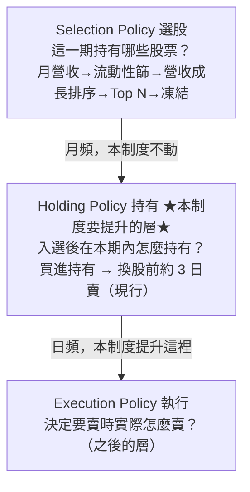

要提升的只有中間那層。現行「換股前約 3 天賣」很可能已經是好基準——所以真正值得研究的**不是**讓模型每天重新選股，而是把「持有期內狀態怎麼演化」描述得更精準，找出 Alpha 何時成熟、衰退或失效。

## 持有狀態向量 H_t：六組，各回答一個問題

某檔股票入選後，每天替它建一個持有狀態向量 `H_t`，拆成六組。每一組的每個特徵，都應該寫成 特徵代數的 `B+X+W+R+O` 地址（可組合、可 PIT、可驗算）：

| 組 | 回答的問題 | 代表特徵 |
|---|---|---|
| **① temporal 時間位置** | Alpha 出現在持有期前段/中段/尾段？ | `days_since_entry` `days_to_next_rebalance` `fraction_of_holding_cycle` `days_since_revenue_release` |
| **② price_path 價格路徑** | 不只看今天在哪，看它「怎麼走到今天」 | `return_since_entry` `drawdown_from_post_entry_peak` `trend_consistency` `new_high_count` `failed_breakout_count` |
| **③ signal_lifecycle 訊號生命週期** | 當初選它的理由還在增強嗎？ | `revenue_yoy` `revenue_acceleration` `signal_age` `signal_decay` `fundamental_confirmation` |
| **④ pricing_state 市場定價** | 這個利多被市場交易到什麼程度了？ | `price_response_to_signal` `valuation_expansion` `crowding` `peer_relative_performance` |
| **⑤ failure 失效與危險** | 這是「一般雜訊下跌」還是「假說失效」？ | `breakdown` `market_regime_shift` `fundamental_contradiction` `liquidity_deterioration` |
| **⑥ tradability 可交易性** | 即使該賣，實際賣不賣得掉？ | `position_to_adv` `estimated_slippage` `days_needed_to_exit` `limit_up_down_risk` |

第②組的意義最容易被低估：兩檔都累積 +10%，一檔緩漲、一檔先漲 25% 再回落——只看「今天在哪」（+10%）會判成一樣，看「怎麼走到今天」才知道持有狀態完全不同。第⑤組專門區分兩種下跌，不分清楚，每日管理就退化成追漲殺跌。

## 結果不能只有一個數：剩餘 Alpha

如果研究只證明「提前賣報酬更高」，那不夠。對每個 `H_t`，要研究的是一整個**未來結果向量 O_t**（未來 1 日/3 日/到換股日報酬、最大漲幅/最大回撤、正報酬機率、贏大盤機率、風險/流動性調整後報酬）。把它濃縮成一個概念——**剩餘 Alpha（Residual Alpha）**：

> Residual Alpha_t ＝ 從今天繼續持有到排程退出日的期望報酬。

於是每日研究的問法從「明天會漲還是跌」升級成「這檔股票的剩餘 Alpha 還有多少」。這是整個制度的認知主軸。

## 從「固定提前三天」升級為退出狀態機 H0–H5

現行規則等於只用了一個變數 `days_to_rebalance <= 3`。但不要一步跳到黑箱函數——先做成**可理解的退出狀態 H0–H5**（先狀態化再函數化）：

| 狀態 | 含義 | 預設動作 |
|---|---|---|
| **H0** Alpha 未展開 | 剛入選，價格尚未反映 | `HOLD` |
| **H1** Alpha 展開中 | 基本面與價格同步確認 | `HOLD` |
| **H2** Alpha 成熟 | 已有主要漲幅，剩餘報酬下降 | `REDUCE`（減碼） |
| **H3** Alpha 衰退 | 訊號老化、價格轉弱 | `EXIT_EARLY`（提前退出） |
| **H4** 假說失效 | 發生明確反證 | `INVALIDATE`（因假說失效退出） |
| **H5** 週期到期 | 接近固定換股日 | `EXIT_SCHEDULED`（排程退出） |

**你的「提前三天」其實就是 H5。** 要研究的核心問題是：**能不能用 H0–H4 補充 H5，而不是取代月頻策略？** 五個持有動作（`HOLD`/`REDUCE`/`EXIT_EARLY`/`EXIT_SCHEDULED`/`INVALIDATE`）就是狀態機的輸出詞彙。

## 三個該做的研究（是實驗設計，不是已有結論）

1. **Q1 剩餘 Alpha 曲線**：對所有歷史入選股票，畫「入選第 1–20 天，每天繼續持有到換股日的平均報酬」。
2. **Q2 條件化剩餘 Alpha**：把「倒數 N 天」再切成不同狀態（已大漲高位轉弱／尚未上漲但基本面強／剛突破／假說失效），各自的剩餘報酬。
3. **Q3 退出規則比較**：A 固定換股日／B 固定提前三天／C 狀態式提前退出／D 狀態式退出＋最晚提前三天，比 CAGR/Sharpe/MDD/勝大盤/換手/流動性。設計書預期**最後很可能是 D 最好**——平常固定持有、明確失效才提前退、無論如何最晚換股前三天退，保留月頻穩定性又加入有限度日頻智慧。

## 已真跑：研究問題一（已用 finlab 套件獨立驗證）

這一層不是紙上談兵——Q1 已於 2026-07-22 真跑並經 finlab 套件覆核（用真還原股價＋月營收 YoY 重建月頻策略：Top-20、流動性前 70%、2015–2026、138 期換股、PIT 安全）：

- **入選後 1–11 天大多是雜訊**，沒有平滑的 alpha 衰退曲線；扣掉市場的負報酬幾乎**全集中在「換股日當天」那一根**，跨 N（10/20/30/50）與時期都穩定。
- 這一根的下跌**幾乎全來自「新一期營收轉弱」的股票**——機制＝訊號生命週期失效（`signal_decay`）在退出日兌現＝**H4 假說失效**，不是「持有太久自然衰退」。新營收在換股日已公告、隔天才跌 → PIT 安全可交易。
- **finlab 官方資料重算**：退出日效應顯著——退出日 **−21bps（t=−3.92）**、新營收轉弱股 **−87bps（t=−7.69）**、仍強股 −6.6bps 不顯著。（手算是 −30bps，略偏大，以 finlab 的 −21bps 為準。）
- **含成本回測**：「提前三天出場」vs「抱到換股日」——**提前三天淨勝**：CAGR 7.43%→8.60%（+1.17pp）、Sharpe 0.40→0.49（MDD −43%→−45% 略升）。淨賺門通過。

**裁決**：五道研究門過四（效應存在／成因定位／PIT 安全／簡單規則淨賺 過；精準版 C「只出轉弱股」未回測，全樣本外級未過）。現行「提前三天」經 finlab 引擎背書可繼續用。

## 這一層在真實驗裡怎麼被用

- **實驗 000（引擎首輪 A/B 退出時點）**：策略引擎把現行月營收策略寫成創世基因，只變異「退出時點」一個部件生出子代——策略 A（抱到換股日）vs 策略 B（提前三天＝H5）。B 大勝（CAGR 20.22% vs 12.25%、Sharpe 1.08 vs 0.66、10/12 年勝），且與本層 Q1 的 finlab 版**方向互證成立**（限 CAGR/Sharpe）。這是兩條完全獨立管線都得到「提前三天較好」——正是進化迴圈「證據歸屬分離」想要的互證形態。
- **實驗 001（候選 C）**：候選 C 沿用了本層的「提前三天退出（H5）」作為 holding_policy，只變異選股——證明持有規則可以被凍結、當作其他變異的乾淨背景。

## 誠實邊界

- **只有 Q1 真跑過**：Q3 的退出規則 A/B/C/D 完整比較（尤其 C「只精準出轉弱股」是否勝 B）、換股日下跌拆「賣壓 vs 資訊」、**樣本外 walk-forward** 都**還沒做**，且刻意不虛構。
- **量值不可跨管線引用**：實驗 000 的 B 多賺約 8pp，Q1 版只多 1.17pp——量值差 7 倍源自股票池與成本口徑不同，只有**方向**互證；**MDD 方向兩管線相反**（本輪 B 較淺、Q1 版 B 較深），「提前賣回撤較小」不成立為穩健結論。證據級封頂 E2（重複支持、尚無樣本外確認），provisional、不改真錢。
- **不虛構門檻**：最佳提前天數、H 狀態分類界線、剩餘 Alpha 估計式，都要研究得出——這條也寫進了 `schema.py`：機器 schema 只放已定義的結構，分類器與門檻**留白**。
- **不做黑箱**：先狀態化（H0–H5）再函數化成 Exit Score，那是後話。
- **Alpha 生命週期 ≈ 世界訊號九態（待驗證）**：本層的六階生命週期（訊號出生→市場辨識→價格展開→成熟→衰退→到期）與 世界訊號九態都在描述「定價生命週期」，只是尺度不同（事件 vs 持股期），**是否嚴格同構待驗證**。

延伸閱讀：這一層的結果（剩餘 Alpha）是 研究雙語評估四層與失效字典要量測、裁決的對象；退出決策的報告一律走 固定認知順序報告，用過門制而不是「該賣了」這種形容詞。時間位置向量（第①組）如何升級為時間層的相對時間特徵，見時間層。

---

<a name='fw-research-bilingual'></a>
# 〔fw-research-bilingual〕框架：研究雙語與認知編譯器

**研究雙語（Research Bilingual / Research Ontology + Cognitive Compiler）**是五層量化語言的第四層，也是所有實驗的**出口**。它的名字裡的「雙語」很實在——系統其實同時需要兩種語言，中間靠一台確定性編譯器把兩邊接起來：

```
A. 研究語言（機器能研究）   市場世界 → 資料 → 特徵 → 策略 → 實驗 → 評估
B. 認知語言（人能理解行動） 事實 → 差異 → 機制 → 證據 → 判斷 → 行動

          研究物件 ──→ 認知編譯器 ──→ 人類報告
```

第一套語言防止**研究混亂**（LLM 亂造假說、亂比較），第二套防止**報告混亂**（把推論寫成事實、語氣超過證據）。前三層（特徵代數／世界訊號／持有期）都在講研究語言這一側；這一層額外補上認知語言，並用編譯器保證「同一份實驗自動編譯成固定認知順序的人類報告」。

服務已上線：systemd 8987，入口 `tailscale /compiler`（沙盒可貼 spec 即時編譯），程式碼在 `FOR_AGENT/research-ontology/`。

## 三層架構

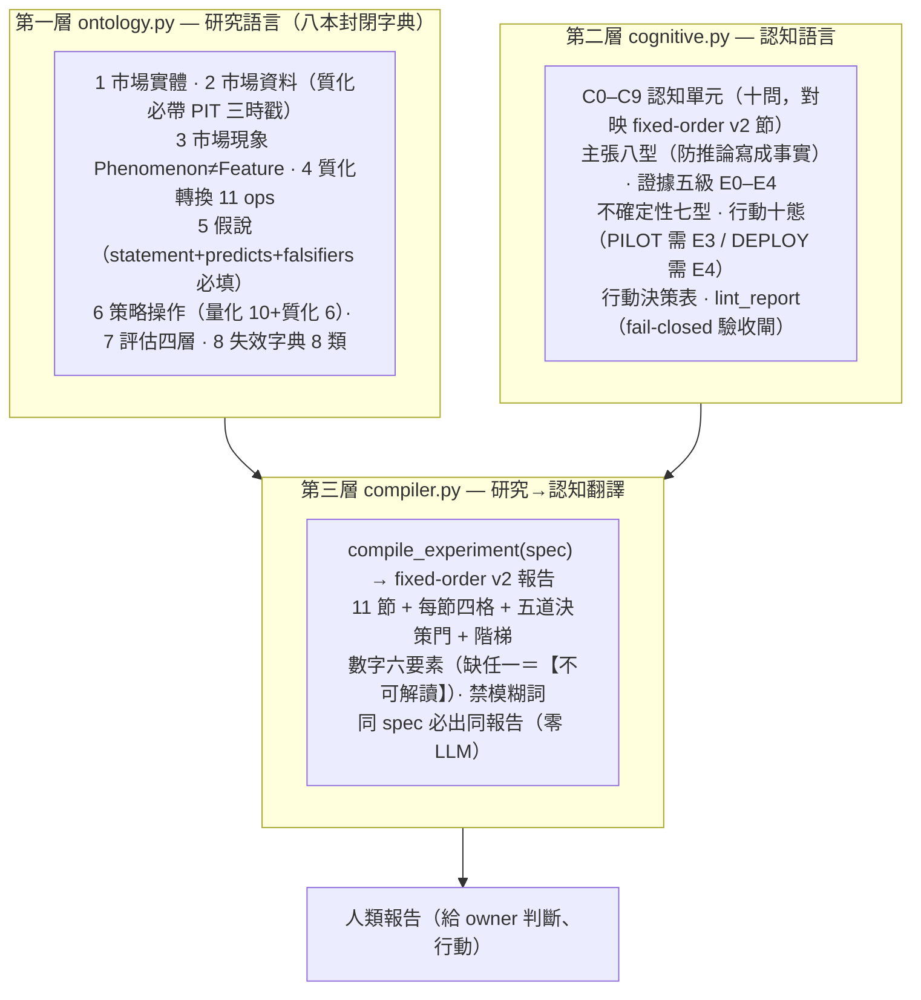

## 核心信條：語氣不得超過證據

這一層最重要的一條規則，是把「語氣」和「證據」綁死——**行動由門推出，不由語感**：

- **證據五級 E0–E4**：每個結論必標「有效到哪一級」。E0＝想法（沒回測）、E1＝樣本內、E2＝重複支持但無樣本外、E3＝樣本外確認、E4＝前瞻/實戰確認。這對映 策略本體論的「回測是在提高期望的證據等級」。
- **語氣不得超過證據**：`PILOT`（小規模試行）需 E3、`DEPLOY`（部署）需 E4。E2 的實驗，編譯器**自動降級**成 `VERIFY`（先進組合層驗證）；手造的「超級報告」（語氣灌水）會被 `lint_report` 這道 fail-closed 閘擋下。
- **訊號層封頂 VERIFY**：只有 IC、沒有組合層結果的實驗，最高裁決＝「進入組合層驗證」，不直接 PILOT——防止「橫斷面相關性好」被當成「可交易」。
- **負結果也入庫**：候選輸給基準 → `ARCHIVE`（誠實歸檔，防重複試錯）。

**行動十態**是十種確定性的行動裁決（含 `REJECT`／`ARCHIVE`／`VERIFY`／`PILOT`／`DEPLOY`／`EXIT` 等；完整十種清單見 `cli_ro.py vocab`，此處不逐一虛構）。決策由五道門推出：證據門（E3+）／增量門／穩健門／成本門／容量門。

實測兩個種子（數字示意）：EX001 突破＋營收（組合層，E3）→ **PILOT 小規模試行**；EX002 regime 門控（訊號層，E3）→ **VERIFY 先進組合層**。同一個 E3，因為一個在組合層、一個只在訊號層，行動裁決就不同——這正是「語氣綁證據結構」的價值。

## 這一層是 fixed-order-report v2 的代碼化

全機有一套「固定認知順序報告協議 v2」（`/fixed-order-report`），規定所有給人看的報告都走固定的宏觀順序（0 決策首頁→1 現況→2 機制→…→10 機器附錄）＋段內固定四格（答案→證據→這代表什麼→目前限制）。那份協議是報告骨架的**憲法（prose 形式，靠自律遵守）**；本層把它**代碼化成一台可執行的編譯器＋lint 閘**——手寫報告靠自律，編譯報告靠閘。

這四台已真跑的引擎報告——實驗 000、實驗 001、實驗 002、實驗 003——全部按 fixed-order v2 骨架寫成，每一份都有「0 決策首頁／決策欄位表／一眼看懂／分命題信心／由門推出的裁決／升降級表」。它們是這一層要保證「所有實驗都長這樣」的活範例。特別值得看的是它們如何實踐「語氣不超過證據」：實驗 001生出一個 33% 年化的漂亮結果，報告卻替它掛三張警告標籤、裁決 provisional——這就是編譯器該做的事（見 誠實紀律）。

## 這一層負責的兩本字典，值得單獨記住

- **評估四層（第 7 本字典）**：訊號證據／組合證據／穩健證據／認知證據——這是「一個 Alpha 的證據要分幾種來看」的封閉分類，持有期的剩餘 Alpha 就是要餵進這四層量測的對象。
- **失效字典（第 8 本，8 類）**：專門用來「攻擊自己的研究」——列出一個結論可能怎麼假。這對映進化迴圈的攻擊閘與失敗歸因。

## 誠實邊界

- **種子實驗數字是示意佔位**：README 明載——種子實驗（EX001/EX002）的數字是示意，編譯器本身（驗證／門／閘／lint／渲染）是真的。接真實驗＝把 AARO/finlab 結果填進同一份 schema。
- **尚未成為所有實驗的必經出口**：H-DEV2 已把一次真實驗接進編譯器，但這一層**尚未成為所有實驗必經的出口**——四份引擎報告是按 fixed-order v2 骨架寫成、由冷讀驗收把關，並非每一份都已跑過 `compiler.py` 全自動編譯。方向裁決把「報告自動編譯（真實驗轉接器）」列為 P2、且延後——理由是報告自動化的價值建立在上游研究規格穩定，太早做會把尚未穩定的研究流程固化成文件格式。
- **本層不產生 Alpha，只保證誠實**：它管的是「研究語言不混亂、報告語氣不灌水」，不負責找 Alpha；它的功勞要記在「更快淘汰錯誤、降低人工審查、提高重現率」這類治理指標上，且這些同樣必須量化（A/B 功勞簿），否則「治理價值」也只是敘事。

延伸閱讀：這一層在整個引擎裡的位置見 StrategySpec（假說的 features 欄存 特徵代數 DSL、行動決策表吃 世界訊號九態）與 十道證據閘。所有五層共用的誠實紀律見 方法論：誠實紀律。

---

<a name='fw-temporal'></a>
# 〔fw-temporal〕框架：時間層（時態邏輯節點）

**時間層（Temporal Layer）**是五層量化語言的第五層，也是最新、最未完成的一層（owner 2026-07-22 補充）。它橫貫其餘四層，做一件事：把時間從「一個欄位」升級成「圖的一級結構」。

先說清楚它為什麼是必要的。前四層——特徵代數、世界訊號、持有期、研究雙語——即使全部到位，畫出來的仍偏一張**靜態邏輯圖**。但投資從來不是判斷「A 與 B 有沒有關」，而是判斷：

> **什麼事在什麼時候發生、經過多久傳導、目前走到哪個階段、站在當時能不能做出這個判斷。**

所以核心單位從「邏輯節點」升級為**時態邏輯節點**，五層各司其職：

```
知識圖譜   保存「誰與誰有關」
超圖       保存「哪些條件共同成立」
時間圖     保存「以何種順序、速度與期限發生」     ← 本層新增
PIT 契約   保存「站在當時能知道什麼」
策略時鐘   決定「現在能不能行動」                 ← 本層新增
```

## 四種時間，混淆任一＝未來函數

「月營收年增率 47%」在量化上是**不完整**的——因為世界發生時間 ≠ 資訊發布時間 ≠ 市場可交易時間 ≠ 系統入庫時間。時間層要求每筆事實都分辨四種時間：

| 時間 | 回答的問題 | 既有承載 | 現況 |
|---|---|---|---|
| **valid_time** | 這個事實描述世界的哪段時間 | `qual_edge` 的 `valid_from`/`valid_to` 欄（質化引擎，已落地） | 已有 |
| **event_time** | 事情實際何時發生 | MIEE `event.announced_at`/`effective_at`；研究雙語 `occurred_at` | 已有 |
| **known_time** | 市場/系統何時第一次能知道 | 研究雙語 `knowable_at`（三時戳強制＋時序驗證已上線）；mcm `known_at` | 已有 |
| **system_time** | 資料何時入庫/修訂 | `ingested_at`/`revised_at`/`source_version` | **真缺**（全機零實作，歸 twdata 資料線） |

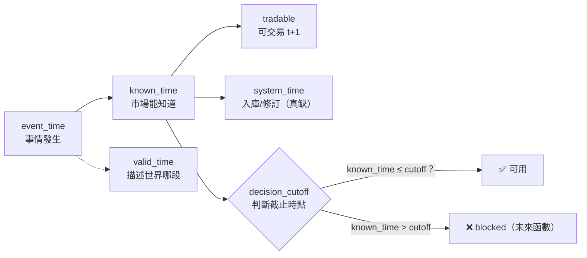

**鐵律**：任何特徵引用資料都必過 `known_time ≤ decision_cutoff` 檢查。混淆任一種時間＝未來函數。要注意的是，特徵代數保證的「運算合法」（算子無前視）不等於「資訊合法」——修訂值、回填、事後分類、下市缺失仍可洩漏，`ingested_at` 與 `available_at` 的差正是偵測回填洩漏的關鍵欄。

## 時間關係邊：13 個封閉詞彙

「date: 2026-07-10」太弱——投資邏輯關心的是**時間關係**。時間關係邊的詞彙表（13 個，封閉治理，與知識圖譜的關係表同表、兩書不得各自擴詞）：

```
BEFORE / AFTER / OVERLAPS / DURING / STARTS / FINISHES / PERSISTS /
ACCELERATES / DECAYS / RECURS / LAGS / LEADS / INVALIDATES_AFTER
```

帶滯後分佈的例子（這才是投資真正關心的形狀）：

```
客戶需求增加 ─LEADS_BY_30~60D→ 營收加速 ─LEADS_BY_10~40D→ 法人上修 ─OVERLAPS→ 價格突破
產能開出 ─INVALIDATES_AFTER→ 產能短缺敘事
```

機器側落成 `temporal_edge` 表（框架書 T-P1 設計，含 13 詞彙的 `CHECK` 約束、`lag_lo_days`/`lag_hi_days`/`lag_basis`/`regime_note`）——注意 **lag 帶分佈不帶單值**：大波段線 E8 實驗的教訓是「lag 有 regime 依賴」（分半降級），不得寫死單一數字。

## 點事件、期間狀態、階段——三者不得混裝

- **點事件**（event_time 一刻）：公告訂單／月營收公告／政策通過／首次突破。
- **期間狀態**（valid_from→valid_to）：需求加速中／庫存下降中／價格尚未充分反應。
- **階段**（狀態帶生命週期）：形成前→初次出現→確認→加速→擴散→擁擠→鈍化→反轉→失效。

所以「AI 題材」不是布林值，而是「階段＝定價擴散中、開始於 5-12、已持續 71 天、位於歷史週期第 68 百分位、新聞仍增但價格反應開始鈍化」。歸戶：世界訊號九態就是「行情」這個對象的階段機、MIEE hypothesis 狀態機是「假說」的階段機——本層要把階段語意**推廣為任何期間狀態的標準配備**（統一階段 schema，真缺）。

## 相對時間比絕對日期重要——時間本身是特徵

距事件天數、傳導延遲 vs 歷史中位、持續時間週期位置、一階/二階速度、證據新鮮度與半衰期權重——這五組**相對時間都是可回測的特徵**。歸戶：持有期的時間位置向量（`days_since_entry`/`days_to_next_rebalance`/`fraction_of_holding_cycle`/`days_since_revenue_release`）就是這個概念在持有域的落地；特徵代數已有 XT 類算子（`TimeSinceEvent`）當文法種子。

## 五時鐘：高頻新聞不得破壞低頻策略

每個策略有五個時鐘，混用它們就會讓「新聞今天轉弱」錯誤地觸發月頻策略賣出：

| 時鐘 | 管什麼 |
|---|---|
| **觀察時鐘** observation | 資料多快更新 |
| **判斷時鐘** decision | 何時重算決策 |
| **執行時鐘** execution | 何時真的下單 |
| **持有時鐘** holding | 抱多久 |
| **評估時鐘** evaluation | 多久結算對錯 |

「新聞今天轉弱」在月頻策略裡只改**觀察時鐘**的題材強度，不觸發賣出——除非命中預先定義的提前退出條件。歸戶：這是持有期三層拆分（Selection/Holding/Execution）的時間軸版；實驗 000的部位編譯器（`engine/compile_positions`）之事件錨＋t+1 已實作「判斷/執行時鐘分離」的最小版；敘事卡「零影響策略」鐵律就是觀察/決策時鐘隔離的落地。真缺：五時鐘未在 StrategySpec 明文成欄位。

## 雙視角隔離：當時視角與事後視角分開存，禁止回寫

事後看「4 月接單→5 月營收加速→6 月上修→7 月大漲」邏輯完整，但 4 月當時你不知道後三件事。每個節點兩個視圖：

- **Point-in-Time View**（`as_of` 當時已知/未知清單）
- **Retrospective View**（事後實現清單）

兩者分開儲存，**禁止事後資訊回寫成當時理由**。歸戶：MIEE 預測帳就是這個隔離的既有實作（prediction 預註冊→settle 到期對帳，845 筆已對帳）；AARO 預註冊凍結同理。這也解釋了為什麼四份引擎報告都把「PIT 視圖」與「事後視圖」分欄呈現。

## 時態超邊：成員＋順序＋時窗，缺一不算共同成立

超圖的交互超邊只說「哪些條件共同成立」——但五個條件分別發生在三年前不算共同成立。時態超邊必須帶時間約束：

```
H_REV_EXPECTATION_GAP ＝ { A 需求事件首現[t0], B 營收加速[t0+0~90d],
  C 同業確認[與 B 重疊≥30d], D 法人未上修[判斷日成立], E 價格未反應[判斷日成立] }
約束：A BEFORE B；C OVERLAPS B≥30d；D/E VALID_AT decision_cutoff；
      全部成員 known_time ≤ decision_cutoff
輸出：預期差成立，valid_from=判斷日，20 個交易日未再確認即過期
```

落地：`interaction_edge`（交互超邊表）增 `constraints_json`（時間約束封閉語法，T-P2 起強制非空）；約束驗證是純碼（時間比較不需要 LLM）。

## 進化目標的最終形態：可驗證的時間因果模式

系統最後要找的 Alpha 不是「營收加速有效」，而是一條**帶完整時間約束的時態超邊＋預註冊的未來驗證窗**：

> 需求新聞首次出現後 30–70 日，月營收連續兩次加速，同業同步確認，但法人尚未上修且價格反應低於歷史正常幅度時，未來 20–60 日存在正向超額報酬。

這才是能被理解、被回測、被監控、能隨時間演化的完整投資邏輯。因此進化迴圈的變異對象擴充——不只變異特徵與規則，也變異**時窗、順序約束與滯後假設**（各為獨立的單變因軸，同受一次一變因紀律）。

## 兩個圖家族的對帳（防詞彙撞名）

時間層橫貫兩個不同的圖家族，引用時必須指明是哪一家，不得混稱「四圖」：

- **世界模型側四圖**（質化引擎的地盤，描述市場世界）：實體關係圖／條件超圖／**時間因果圖（本層新增）**／**決策狀態圖（本層新增）**。
- **研究記憶側四圖**（知識圖譜的地盤，描述研究過程）：定義／策略／證據／演化。

時間層對兩家族都生效：研究記憶側也要 PIT（已有）；世界模型側新增時間因果圖與決策狀態圖。超圖層同樣分家：世界側超邊＝`qual_hyperedge`（題材超邊，已落地 159 條）、研究側超邊＝strategy_spec 基因超邊（已落地）＋`interaction_edge` 交互超邊（G-P2）。

## 誠實邊界：這一層幾乎整層是設計

這是全機最未完成的一層。誠實歸戶如下：

**已存在（對過碼）**：三時戳強制＋時序驗證（研究雙語）；τ 軸 PIT（世界訊號）；`valid_from`/`to` 欄（`qual_edge`）；時間位置向量（持有期）；XT 算子種子（特徵代數）；預測帳雙視角（MIEE）；事件錨＋t+1（實驗 000引擎已實作）。

**真缺（本層新設計，全部標「待補」）**：
- 時間關係邊 13 詞彙表與 lag 分佈量測（`temporal_edge` 表，T-P1）
- **統一時態節點 schema**（十塊合體，含 `temporal_identity` 與 `next_expected_events` 節點欄）——目前只存在於對映表，**沒有任何一張表完整長這樣**（T-P2）
- 統一階段 schema（T-P2）
- 時態超邊 `constraints_json` 約束驗證器（T-P2）
- 五時鐘入 StrategySpec（T-P1）
- 對齊契約六欄入 data_contract（`sampling_frequency`/`availability_lag`/`alignment_rule`/`max_staleness`/`aggregation_window`/`decision_cutoff`，T-P1）
- `system_time` 層（`ingested`/`revised`/`version`，歸 twdata）
- 敘事十格模板與決策狀態圖（T-P3）

**分期**：T-P1 隨引擎 P1（五時鐘＋對齊契約欄＋敘事卡改十格＋`temporal_edge` 表與詞彙 CHECK）；T-P2（統一時態節點 schema＋時態超邊約束驗證器＋階段 schema＋lag 分佈量測，標 regime 依賴）；T-P3（決策狀態圖＋時間因果模式的變異軸開放）。時間層不獨立於薄縱切——**walk-forward 版 A/B**（實驗 000第 9 節行動一）本身就是第一個吃到五時鐘與對齊契約的實驗。

延伸閱讀：時間層的十塊 schema 如何對映回其餘四層，見上表；超圖側的時態約束見 超圖；PIT 雙視角在報告層的呈現見 研究雙語與 誠實紀律。

---

<a name='lang-qual'></a>
# 〔lang-qual〕質化結構組成語言（總覽）

## 一句話先講清楚

量化語言棧（見 量化結構組成語言（總覽））把價、量、財報拆成可組合的結構化特徵；**質化語言棧把「新聞」拆成四個彼此隔離的層**——理解、世界模型、研究、Alpha 工廠。這頁講的是這四層各做什麼、為什麼一定要分開，以及一條最硬的紅線：**新聞情緒分數這種單一數字，禁止直接當策略特徵**。它的實作面（qual_edge 證據邊、qual_hyperedge 題材超邊、敘事卡、機制詞彙對映）在 框架：質化引擎（新聞→世界模型→特徵→Alpha工廠）。

owner 2026-07-22 補充的關鍵裁決是：**新聞不是拿來取代量化，而是量化策略的「第二層世界模型」**。所以不能把新聞直接拿去篩股票，而要把它拆成完全不同用途的階段，一層一層過關才准影響決策。

## 四層在做什麼

```mermaid
flowchart TD
    News["原始新聞流<br/>（mcm 唯讀上游）"]
    L1["第一層 理解<br/>敘事卡：我到底買了什麼<br/>對策略決策零寫入"]
    L2["第二層 世界模型<br/>事件→影響誰→產業→供應鏈<br/>只建圖不打分"]
    L3["第三層 研究<br/>新聞才變特徵，且拆成<br/>多個可反證特徵"]
    L4["第四層 Alpha 工廠<br/>假說→事件研究→PIT 回測<br/>→有效留/無效淘汰→演化"]
    Gate{"十道證據閘<br/>與價量特徵完全同閘"}
    Strat["策略決策路徑"]

    News --> L1
    News --> L2
    L2 --> L3
    L3 --> Gate
    Gate -->|走完十閘才准進| Strat
    L3 --> L4
    L4 -->|supported 假說回流| Gate
    L1 -.->|鐵律：永不進策略| Strat
```

| 層 | 做的事 | 是否影響策略 | 對映 |
|---|---|---|---|
| 理解 | 每檔持股生成「為什麼可能會漲」的敘事卡，讓你每天知道買了什麼、不只有代號 | **完全不影響**——只解釋 | 框架：質化引擎（新聞→世界模型→特徵→Alpha工廠） 敘事卡 |
| 世界模型 | 事件 → 影響誰 → 產業 → 公司 → 供應鏈，做成知識圖譜（不是「正面/負面」情緒，那太淺） | 只建圖、不打分 | 知識圖譜：四張圖 在資訊域的延伸 |
| 研究 | 新聞這時才變成特徵，且拆成「一組」可反證特徵（不是單一 News Factor），過同一套十道證據閘 方法：證據閘（十道關卡） | 走完十閘才有資格進 | 特徵代數 框架：特徵代數 型別＋PIT |
| Alpha 工廠 | 假說 → 事件研究 → PIT 回測 → 有效入因子庫／無效記失敗原因 → 下一輪演化 | 產出的特徵回流進化迴圈 | 雛形＝MIEE（見下） |

**MIEE**（市場訊息演化引擎，訊息→事件→假設→事件研究→預測帳→換代的既有系統）就是第四層工廠的現成雛形——它不是本專案新蓋的，本專案只是把它歸戶為工廠雛形，第四層的實作因此「不是新蓋工廠，是接兩條線」：MIEE 的 supported 假說編譯成特徵、特徵以候選身分進進化迴圈，與價量特徵同權同閘。

## 三階段分離是鐵律，不是建議

這是整個質化語言棧最重要的設計判斷。三條紀律缺一不可：

1. **理解層零影響策略**：敘事卡是純投影，對策略與裁決表**零寫入路徑**（框架：質化引擎（新聞→世界模型→特徵→Alpha工廠） 的敘事卡走 `mode=ro` 唯讀連線，考卷斷言它碰不到策略表）。理解層的任何輸出，永遠不進策略決策路徑。
2. **世界模型層只建圖不打分**：這層只把事件與供應鏈關係畫成帶證據的圖（見 知識圖譜：四張圖），不產生任何分數。
3. **研究層產出必須走完十閘**：只有研究層產出、且走完與價量特徵**完全相同**的 十道證據閘的新聞特徵，才有資格進策略。

從這三條直接推出一條禁令：**「新聞情緒分數」這種單一數字，禁止直接當特徵**。owner 的原話研究紀律是——新聞的情緒、量、事件強度確實**可能**提供額外預測力，但是否**持續**產生 Alpha，必須經嚴格樣本外回測與交易成本驗證，不得直接假設有效。這正是 方法論：誠實紀律（拒絕相信自己） 頁「生成即拒絕相信」的精神在資訊域的落地。

## 新聞特徵長什麼樣（不是一個，是一組）

第三層要把新聞拆成多個可反證特徵，各自過閘。owner 列的特徵與既有積木對映如下（**多數積木只有「即時快照版」，歷史序列版未建**）：

- **News Volume**（近 30 天新聞量）、**Novelty**（是不是以前沒發生過）、**Expectation Gap**（新聞很好但股價沒動＝市場還沒反應）——前二者 MIEE 已有近親，第三者對應 世界訊號的 P 預期差。
- **Supply Chain Coverage**（整條供應鏈是否開始講同一件事）——靠 mcm 的 supply_chain_score（全機唯一現成的每則新聞供應鏈相關度值）。
- **Consensus / Persistence / Narrative Strength / Cross Industry / Policy / Capital / World State**——多為即時版近親或未建。

## 誠實邊界（不得省略）

- **新聞真實歷史只有 15 天**：mcm（股市新聞管線，market-cognition，17,279 篇/九維分數）自 2026-07-07 起收，所以**新聞特徵目前沒有回測深度**。第三層的回測型研究因此**不開工**，直到歷史回填零件建成。兩條出路並行：①**前瞻驗證**（MIEE 的 ignition_snapshot 凍結快照就是為此建的往前驗記錄器）；②**歷史回填**（從歷史新聞抽日期/指標/值三元組，帶錨點閘，規劃中未建）。
- **敘事卡已有零 LLM 版但覆蓋極稀**：首輪對 20 檔最新籃子出卡，只有 **1/20 有內容**（2408 南亞科 3 事件錨點可回溯），其餘 19 檔誠實顯示「尚無邊」——正是 15 天新聞史的上游現實。細節見 實驗 000：引擎首輪 A/B 退出時點 與 框架：質化引擎（新聞→世界模型→特徵→Alpha工廠）。
- **世界模型層近乎空帳、機制詞彙兩套未對映**：見 框架：質化引擎（新聞→世界模型→特徵→Alpha工廠） 的三個誠實缺口。

分期（掛在引擎 P 序列之下）：P1 隨附敘事卡頁與機制詞彙對映表（零影響策略、不阻塞主線）；P2 才做新聞特徵編譯器與歷史回填、多階供應鏈拓撲；P2–P3 才做工廠全閉環。

下一站：實作面看 框架：質化引擎（新聞→世界模型→特徵→Alpha工廠）；世界模型層的圖結構看 知識圖譜：四張圖；名詞不熟看 詞彙表。

---

<a name='fw-qual-engine'></a>
# 〔fw-qual-engine〕框架：質化引擎（新聞→世界模型→特徵→Alpha工廠）

## 這頁在講什麼

質化結構組成語言（總覽） 講的是新聞四層的「為什麼」與「該分開」；這頁講**已經真跑落地的那一小塊**——2026-07-22 產出的 `qual/` 模組。它做了四件事，全部**零 LLM、對策略/裁決表零寫入、上游全程唯讀**：

1. **qual_edge**：從 MIEE 帳純碼投影出一階「事件→資產」證據邊（374 列）。
2. **qual_hyperedge**：從凍結快照投影出題材超邊（159 條）。
3. **敘事卡**：每檔資產一張「我到底買了什麼」的 JSON 卡。
4. **機制詞彙對映**：mcm 的機制詞 ↔ 世界訊號的機制詞的人核對映表。

其中 MIEE＝市場訊息演化引擎、mcm＝股市新聞管線（market-cognition）——兩者都是既有真跑系統，質化引擎只用 `file:...?mode=ro` URI 唯讀連線，**永不寫入上游**（`db_qual.py` 把兩條唯讀連線字串寫死成常數，考卷 grep 級認這兩行）。

```mermaid
flowchart LR
    MIEE[("MIEE 帳<br/>miee.db（mode=ro）")]
    MCM[("mcm 新聞庫<br/>mcm.sqlite（mode=ro）")]
    AARO[("aaro.sqlite<br/>本域帳")]

    PE["project_edges.py<br/>純碼投影"]
    NAR["narrative.py<br/>敘事卡（零 LLM）"]
    VOC["vocab.py + vocab_map.yaml<br/>機制詞彙對映"]

    QE["qual_edge 374 列<br/>一階證據邊"]
    QH["qual_hyperedge 159 列<br/>題材超邊"]
    CARD["cards_YYYYMMDD.json<br/>敘事卡"]

    MIEE --> PE
    PE --> QE
    PE --> QH
    QE --> AARO
    QH --> AARO
    MIEE --> NAR
    MCM --> NAR
    AARO -.唯讀走鏈.-> NAR
    NAR --> CARD
    MCM --> VOC
```

## qual_edge：事件→資產的一階證據邊

**形狀沿 OCM**（組織圖譜，全機最完整的「帶證據帶時效」二元邊實作）的 typed edge：`src / rel / dst / valid_from / valid_to / evidence / status / source`。投影規則是純碼：讀 MIEE `market_mapping`（`approved=1` 人核過的）JOIN `event`，`src=event:事件id`、`rel=relation_type`、`dst=asset:代號`、`valid_from=event.announced_at`。

三個設計判斷值得注意：

- **內容尋址**：`edge_id = sha256(正規化內容)[:16]`。同內容重跑必得同 id，`INSERT OR IGNORE` 因此冪等；上游變了就長出**新列**（不原地改）。
- **無證據的邊不准存在**：`evidence` 欄有 `CHECK`，必須是**非空 JSON 陣列**（引用 `miee:event:id` 與 `miee:message:id`）。這是 知識圖譜：四張圖 第一鐵律「邊無證據列即非法」的欄位級落地。
- **狀態純碼判定**：`contested → conflicted`；多來源 → `corroborated`；單來源 → `observed`。不由人手填。
- **append-only**：兩個觸發器擋 UPDATE/DELETE——「圖＝帳的投影，改帳不改圖」。整張表可 DROP 後從 MIEE 帳重推，`content_hash()` 逐位元一致（考卷斷言）。

## qual_hyperedge：一筆快照＝一條題材超邊

題材是「多檔股票共同屬於同一敘事」的多元關係，二元邊表達不了，所以用超邊。投影來源＝MIEE `ignition_snapshot`（159 筆凍結快照）：一筆快照就是一條超邊，`kind` 封閉為 `theme/sector`，`members_json` 是成員代號集（原樣照抄、凍結），`heat/breadth` 記快照當下的新聞熱與廣度，`snapshot_ts` 保留原掃描時點。同樣 evidence 非空 CHECK、同樣 append-only。

這條「世界側題材超邊」與 超圖：策略基因超邊與交互超邊 講的「研究側策略/交互超邊」**分屬不同家族、不得混稱**——世界側描述市場世界（質化引擎地盤），研究側描述研究過程（策略引擎地盤）。

## 敘事卡：每檔資產一張「我買了什麼」

`narrative.py` 為每檔資產產一張 JSON 卡，全部欄位是純碼投影，**LLM 敘事段誠實留 `null`**（標「LLM 敘事層未接」）。一張卡含：

- **事件（帶星級＋錨點引文）**：星級純碼判定（來源數為主、高信心加成、封頂 5★）；每個事件宣稱附**逐字錨點引文**與 `message_id`，機器可回溯原文（沿 MIEE eventize 的反捏造閘）。
- **mcm 九維分數摘要**：事件證據訊息 → `mcm:feed:id` → `title_scores` 九維平均（含 supply_chain_score）。
- **世界模型鏈**：沿 qual_edge 由 asset 節點反向走傳導路徑（多跳記全路徑）；**走不出就誠實回「尚無邊」**，不虛構。

紀律三條：敘事卡是投影、對策略表零寫入路徑（用 `connect_aaro_ro()` 唯讀）；每宣稱帶錨點 id；LLM 整理不帶任何行動建議語彙。

**15 天歷史的誠實邊界就在這裡最刺眼**：首輪對 20 檔最新籃子（2026-06-10 事件）出卡，只有 **1/20 有內容**（2408 南亞科 3 事件），其餘 19 檔顯示「尚無邊」；另一次對事件數前 12 檔出卡（104 顆錨點可回溯）。稀疏不是 bug，是 mcm 新聞只從 2026-07-07 起收的上游現實。詳見 實驗 000：引擎首輪 A/B 退出時點。

## 機制詞彙對映：擴圖前的前置件

要把新聞世界模型接上 世界訊號，先得對齊兩套機制詞彙——**mcm 的 M_\*（9 詞）與世界訊號的 M_\*（30 詞）不同源不同名**，全機唯一同名的只有 `M_MARGIN_EXPANSION`（毛利擴張）。`vocab.py` 用純碼查表，紀律極嚴：

- **只有 `exact/approved` 狀態才生效**；`proposed`（語意近似待人核）`map()` **預設不回傳**——不假裝已對上。本輪：1 條 exact 生效、3 條 proposed 待人核、其餘 unmapped 誠實列出。
- **全覆蓋校驗**：mcm 每個實際詞要嘛在 mappings、要嘛在 unmapped，**沉默漏掉即報錯**（`verify()` 吃這個）。例如 `M_MARGIN_COMPRESSION`（毛利壓縮）誠實列 unmapped，理由是「ws 只有擴張向、無壓縮向」，不硬映。

## 誠實邊界（三個世界模型層缺口）

- **供應鏈全機只有一階**（`supply_chain_distance` 幾乎全 0）；多階傳導拓撲不存在，要新建且每條邊要證據，禁畫想像全圖。
- **機制詞彙兩套僅 1 條 exact 生效**，3 條仍 proposed 待人核。
- **正式世界模型 edges 表近乎空帳**；填充靠第四層工廠的驗證產出回寫，不靠 LLM 一次畫滿。
- 這一切都仍卡在 質化結構組成語言（總覽） 的 15 天新聞史下——新聞特徵無回測深度，第三層回測型研究以歷史回填為前置條件。

驗收：`cd aaro/qual && python tests_qual.py` 九卷全綠。相鄰頁：語言層總覽 質化結構組成語言（總覽）、圖鐵律 知識圖譜：四張圖、超圖家族 超圖：策略基因超邊與交互超邊、紀律 方法論：誠實紀律（拒絕相信自己）、名詞 詞彙表。

---

<a name='graph-knowledge'></a>
# 〔graph-knowledge〕知識圖譜：四張圖

## 為什麼需要圖：血統鏈不夠

AARO（自治 Alpha 研究實驗室，本專案地基）的記憶已經是全機最強：append-only 帳＋已封閉前沿＋下一議程。但它的**關係結構只有 `generation_log.parent` 這條「單親字串鏈」**加少量鏡射回鏈，家族只是一個 `family_id` 字串標籤。這代表一整批問題**答不出來**：

- 這個特徵依賴哪些資料？哪些策略用過它？（定義/使用關係查不到）
- 哪些組合反覆失敗？共同包含什麼？（失敗模式交集查不到）
- A 和 B 各自有效但從未共測？（未測交互查不到）
- 「創新高＋營收加速＋低波動」三者同現才強、單獨都弱——這種**高階交互作用**無處存放（二元邊表達不了，要靠 超圖）。

上一版迴圈（生成→回測→驗證→保留）因此只是自動化實驗平台；補上圖層，才是會累積市場知識、理解交互、據此演化的系統。

## 第一鐵律：圖是帳的投影，不是第二真相源

這是整個圖層最重要的設計判斷，繼承兩條既有憲法（世界模型基底「衍生欄現算、嚴禁落庫」；策略生命週期引擎書「用想像的邊餵傳播，比沒有邊還毒」）。落地規則有三：

1. **四圖全是 append-only 帳之上的衍生視圖或可重推表**——DROP 掉全部圖表，從帳重推必須**逐位元一致**（考卷斷言）。
2. **每一條邊必須能指回帳裡的證據列**；沒有證據列的邊不准存在（框架：質化引擎（新聞→世界模型→特徵→Alpha工廠） 的 qual_edge 用 `CHECK` 強制、演化圖用 `WHERE` 過濾強制）。
3. **LLM 只能「提案」邊**；提案只進候選佇列，成邊要嘛純碼從帳投影、要嘛靠實驗證據落地後自動成立。這是 方法論：誠實紀律（拒絕相信自己） 頁反捏造紀律的圖版。

```mermaid
flowchart TD
    subgraph Ledger["append-only 帳（唯一真相源）"]
        GL["generation_log"]
        ME["mutation_edge"]
        EC["experiment_contract"]
        ER["experiment_result"]
        KE["knowledge_event"]
        SS["strategy_spec / spec_member"]
    end

    subgraph Graphs["四圖＝純 SQL 投影（可 DROP 重推）"]
        DEF["定義圖<br/>特徵怎麼算出來"]
        STR["策略圖<br/>特徵怎麼組成持股"]
        EVI["證據圖 v_evidence_graph<br/>主張有什麼證據"]
        EVO["演化圖 v_evolution_graph<br/>誰生了誰、哪種變異有效"]
    end

    SS --> DEF
    SS --> STR
    EC --> EVI
    ER --> EVI
    KE --> EVI
    GL --> EVO
    ME --> EVO
    Graphs -.DROP 後從帳重推逐位元一致.-> Ledger
```

## 四張圖：各回答什麼、從哪投影

| 圖 | 回答的問題 | 節點 | 邊（封閉詞彙） | 投影來源 | 狀態 |
|---|---|---|---|---|---|
| **定義圖** | 這個特徵到底怎麼算出來的？ | 資料欄、算子、參數、特徵、輸出型別 | uses_data / applies_transform / takes_parameter / produces / derived_from | 特徵代數 框架：特徵代數 的 `to_spec()/tree()` 已含全部資訊，純碼展開 | 設計（視圖待補） |
| **策略圖** | 策略怎麼把特徵組成持股？ | 池狀態、特徵、算子、組合狀態、持有政策、執行政策 | consumes / transforms_state / ranks_by / selects / allocates / exits_by | StrategySpec 方法：策略基因（StrategySpec 九部件） 九部件結構，純碼展開 | 設計（視圖待補） |
| **證據圖** | 這個主張有什麼證據？ | 假說、實驗、指標、結果、反證、證據級 | supports / contradicts / tested_on / valid_under / replicates / supersedes | `experiment_contract × experiment_result ＋ knowledge_event` | **已落地** `v_evidence_graph`（36 邊） |
| **演化圖** | 誰生了誰、哪種變異在什麼條件有效？ | 策略世代節點 | mutation 邊（帶 parent/child/changed_component/before/after/多維 delta） | `generation_log` 字串血統 ＋ `mutation_edge` 結構化邊 | **已落地** `v_evolution_graph`（9 邊） |

**誠實狀態**（2026-07-22）：`graph_views.py` 目前只建了**證據圖與演化圖兩個視圖**（DDL 是固定字串常數，重推決定性）；**定義圖與策略圖仍是設計，視圖待補**。另有一張「節點帶狀態」視圖 `v_feature_node`（把特徵節點的已測實驗/正負/有效脈絡全部 SQL 現算，永不手填）列在框架書 G-P1，**尚未建成、標待補**——手填的節點狀態一定腐爛，現算的才永遠與帳一致。

## 三種關係都要存，不是只存正向

只存成功者的圖會讓系統反覆踩同樣的坑。三類關係同權入圖：

| 類 | 詞彙 | 例 |
|---|---|---|
| 支持 | supports / improves / synergizes_with / valid_under | Top10 —improves→ CAGR |
| 負向 | hurts / contradicts / fails_under / reduces_capacity | Top10 —hurts→ 流動性 |
| 不確定 | untested_with / weak_evidence / conflicting_results | Top10 —conflicting_effect_on→ Sharpe |

負向與不確定關係是 LLM 生成下一代時的「完整代價表」；**已封閉前沿（closed_frontier）就是現成的負向邊來源**——實驗 003：圖驅動自主進化三代 裡 gen1 被否決後就寫進了它，死方向不再重試。

## 圖驅動進化：六步閉環

圖不只是好看，它要改變「下一代該測什麼」的提案品質。六步閉環（詳見 方法：進化迴圈（圖提案→變異→裁決→回流））：

```
① Graph Retrieval    查已知：哪些測過、哪些反覆失敗、哪些機制只有初步證據
② Gap Detection      找空洞：已知 X 在低波動有效，未知 ＋Y 在高波動是否仍有效
③ Hyperedge Completion  LLM 提案候選超邊（只提案、不裁決）→ 見 graph-hypergraph
④ Controlled Mutation  候選超邊 → StrategySpec diff（一次只改少數成員）
⑤ Experiment         編譯 → 十閘 → 裁決 → 見 method-gates
⑥ Graph Writeback    結果→證據邊；ΔE→演化邊；消融齊備→交互超邊；死方向→封閉前沿負向邊
```

圖至少提供五個能力：避免重複實驗（查重閘，見 超圖：策略基因超邊與交互超邊）、找鄰近變異（沿定義圖走一兩步）、找失敗模式（負向超邊交集）、找未測交互（步驟②）、建因果研究路徑（營收加速→預期上修→定價延遲，沿傳導鏈找替代代理）。

## 兩個圖家族不得混稱

**研究記憶側四圖**＝定義/策略/證據/演化（本頁，管實驗與策略的血統）；**世界模型側四圖**＝實體關係/條件超圖/時間因果/決策狀態（框架：質化引擎（新聞→世界模型→特徵→Alpha工廠） 與 框架：時間層（時態邏輯節點） 的地盤，管市場世界）。兩家族並存於不同層，引用時必須指明是哪一家族，不得只說「四圖」。同理超邊也分家：世界側是 qual_hyperedge、研究側是基因超邊＋交互超邊（見 超圖：策略基因超邊與交互超邊）。

下一站：多條件共同作用怎麼存 → 超圖：策略基因超邊與交互超邊；策略的九部件基因 → 方法：策略基因（StrategySpec 九部件）；名詞 → 詞彙表。

---

<a name='graph-hypergraph'></a>
# 〔graph-hypergraph〕超圖：策略基因超邊與交互超邊

## 為什麼要超圖

知識圖譜：四張圖 的四張二元邊圖存的是「可分解的已知關係」（A 依賴 B、X 支持 Y）。但 Alpha 的真實形狀常常是**多條件共同作用**——「創新高＋營收加速＋低波動環境」三者同現才強、單獨都弱。這種**高階交互**用二元邊表達不了，要用**超邊**（一條邊連一群節點）。研究側有兩種超邊，紀律完全不同：

- **策略超邊＝基因型**（已落地）：每份策略本身就是一條超邊。
- **交互超邊＝已驗證的高階交互知識**（G-P2 落地首例）：例如「A×B 有綜效」，但**必須靠消融實驗才能立**。

```mermaid
flowchart TD
    subgraph GeneEdge["策略基因超邊（strategy_spec）"]
        Spec["一份 StrategySpec<br/>= 一條超邊"]
        SpecID["spec_id = sha256(正規化九部件)[:16]<br/>= 超邊 id = 查重閘鍵"]
        GenomeID["genome_id = sha256(去 lineage 八部件)<br/>= 同基因重投硬擋"]
        Spec --> SpecID
        Spec --> GenomeID
    end

    subgraph IntEdge["交互超邊（interaction_edge）"]
        Arms["四臂消融 2×2<br/>neither / R / S / RxS"]
        Syn["synergy = [RxS − R] − [S − neither]<br/>純碼計算"]
        Rel{"decide_relation<br/>純碼判定"}
        Edge["interaction_edge<br/>四臂齊備才寫、evidence 非空"]
        Arms --> Syn --> Rel --> Edge
    end

    SpecID -.查重先於生成.-> Arms
```

## 策略基因超邊：spec_id 同時是身分與查重閘

每個 StrategySpec 就是一條超邊：成員集依「member_kind ↔ 九部件對映表」定義（不自由列舉，防詞彙漂移），輸出＝結果向量＋證據級。實作上是 `strategy_spec` 表＋`spec_member` 成員索引表，概念上是超圖。兩個雜湊是靈魂：

- **`spec_id = sha256(正規化九部件)[:16]`**：這個內容尋址雜湊**同時充當超邊 id 與查重閘**——生成候選前先查「這個組合以前做過沒」（AARO `kb.check G0` 的圖版）。
- **`genome_id = sha256(去 lineage 的八部件)[:16]`**：八部件全同、只有血統/MOVE 名字不同的兩份 spec，genome 相同 → **同基因重投硬擋**（換個 MOVE 名字不算新策略）。

查重閘 `graph_views.graph_check(spec)` 四道判斷：①同 `spec_id`（一模一樣的九部件重投）→ **擋**；②同 `genome_id` → **擋**；③命中已封閉前沿方向 → **擋**；④成員 Jaccard 相似度 ≥0.8 → **只警示不擋**（取捨：避免誤殺合法的「只差評估口徑」對照實驗）。使用者在運算紙看到的是「此組合已於 EXP_xxx 測過，verdict=…」而非靜默失敗。

> 序列化陷阱（實測教訓）：帳上 B 的 selection DSL 以雙引號存、C 以單引號存，直接雜湊原始字串會讓「語意相同、序列化不同」的兩 spec 得到不同 genome，查重漏網。實驗 003：圖驅動自主進化三代 的提案器因此改成先走 speclang 重序列化（正規化）再算 genome，才是真的基因超邊查重。

## 交互超邊：不消融不准立綜效

交互超邊存「已驗證的高階交互知識」。**成立紀律（反捏造，比什麼都重要）**——LLM 覺得「應該有綜效」不能立，四要件缺一即拒：

1. 成員的**單獨效果**與**組合效果**都有入帳實驗（消融結構：單測各成員＋合測組合）；
2. 組合效果**顯著超過**成員邊際效果之和（判準凍結在 evaluator，純碼判定）；
3. `evidence` 欄引用的實驗 id **缺一即拒**；
4. 信心標 E 級，隨新證據升降（**追加事件，不覆寫**）。

`db_graph.py` 把這些寫成硬約束：`write_interaction_edge` 要求 `arms` 涵蓋四臂 `REQUIRED_ARMS=(neither,R,S,RxS)`，**缺臂直接 raise**；`evidence_exp_ids` 必為非空清單；`relation` 必在封閉四值內；`ablation_ok` 由「四臂是否齊備」**純碼算、不由呼叫端傳入**。DB 層再補兩道 `CHECK`（evidence 非空、`ablation_ok=0` 禁 `status=active`）與 append-only 觸發器。

**relation 四值封閉**：`synergistic`（綜效）／`antagonistic`（相剋）／`independent`（獨立）／`conflicting`（證據衝突）。判定純碼（`decide_relation`）：主指標 CAGR 綜效、Sharpe 綜效佐證；**兩指標方向相反且皆過門檻 → conflicting**；否則依 CAGR 綜效 >+門檻 synergistic／<−門檻 antagonistic／門檻內 independent。是哪個報哪個，**嚴禁湊正綜效**。

## conflicting 裁決的意義（首例 INT_0107e94c9f2c）

G-P2 落地的第一條、也是唯一一條交互超邊，就給了 owner 一記漂亮的自我否證。詳細逐環拆解在 實驗 002：交互超邊消融，這裡講它為什麼重要：

- **成員**＝{月營收 rev_yoy, 250 日 range-position 價格強勢}，即 候選 C「月營收×價格強勢」的綜效故事。
- **四臂全樣本（2015-01→2026-06，138 事件）**：純動能自己 Sharpe 就 1.52，和「營收＋強勢」的 1.52 **一模一樣**；加強勢給營收股 +13.0pp ≈ 加給基準 +12.3pp（CAGR）。
- **synergy**：CAGR **+0.74pp**（勉強過噪音門檻）、Sharpe **−0.12**（負）——**兩指標方向相反** → 純碼判 **`conflicting`**。

**這代表什麼**：`conflicting` 不是「找到綜效」，是**「證據衝突、不足以斷言真綜效」**——C 的優勢幾乎全是動能 beta 相加，不是「月營收 × 價格強勢」的真綜效。強勢的貢獻與有沒有做營收選股無關，是相加不是綜效。這條邊以 `ablation_ok=1`、`evidence_level=E2`、`status=provisional` 永久保留在正典帳（四筆 gate_result 為證據），**證據級封頂 E2**（全樣本描述性、無樣本內外、無 walk-forward），語氣封頂「方向」，不構成部署裁決。獨立重算員逐位吻合、確認**沒把相加凹成綜效**。

這就是本專案「拒絕相信自己」（見 方法論：誠實紀律（拒絕相信自己））最具體的一次兌現：機器對自己上一輪剛生出的「漂亮 33%」候選，跑了乾淨消融、主動判它非綜效。

## 治理位置與時態邊界

- **超邊留在 AARO 域內 DB**（aaro.sqlite 新表），**不**向世界模型基底註冊「第九種物件」（八物件鎖是憲法）；只把裁決摘要鏡射出去。
- **時態約束 `constraints_json`**：交互/預期差類超邊理論上必帶時間約束（順序＋時窗＋VALID_AT，見 框架：時間層（時態邏輯節點）），**T-P2 起強制非空**；**本輪 G-P2 允許 NULL**——時態超邊的約束驗證器仍待補。
- **交互超邊只此一條**：消融模組目前只硬綁「月營收×250 日強勢」這一組；迴圈子代一旦把強勢機制變異掉就離開覆蓋範圍，**依反捏造紀律不虛構**新綜效邊——所以 實驗 003：圖驅動自主進化三代 的後代沒有生新交互超邊。

## 別和世界側超邊搞混

本頁講的是**研究側超邊**（`strategy_spec` 基因超邊＋`interaction_edge` 交互超邊，管研究過程）。框架：質化引擎（新聞→世界模型→特徵→Alpha工廠） 的 **qual_hyperedge 題材超邊（159 條）是世界側**（管市場世界的題材/類股）。兩者同名「超邊」但分屬不同家族、不同 DB 語意，引用時必須指明家族。

驗收：`cd aaro && python -m engine.tests_ablation`（六卷）與 `python -m engine.tests_engine`（九卷含基因超邊查重）全綠。下一站：消融逐環審 → 實驗 002：交互超邊消融；自主迴圈 → 實驗 003：圖驅動自主進化三代；二元邊四圖 → 知識圖譜：四張圖。

---

<a name='method-strategy-spec'></a>
# 〔method-strategy-spec〕方法：策略基因（StrategySpec 九部件）

## 一句話：進化的最小單位不是一條公式，是一份完整規格

這台引擎不把「一段回測腳本」或「一個因子字串」當策略。每個父代與子代都必須先成為一份不可變的 **StrategySpec**（策略規格）——把整份策略拆成**九個部件**的結構化文件，經驗證後以內容雜湊入只增不改的帳。這麼做換來一個關鍵能力：系統能**先做結構差異、再做績效比較**——若一個子代宣稱「只改了退出規則」，但規格 diff 顯示資料或股票池也一起變了，編譯階段就拒絕，不讓多個變因包成一個漂亮結果。這就是 部件從哪取用 的上層契約，也是 策略基因超邊 的物理載體：一份 spec ＝一條超邊，它的雜湊同時是查重鍵。

真相源：引擎冊《設計書_語言原生自動進化量化策略引擎》的「進化的最小單位是一份完整策略規格」表，實作在 `engine/spec.py`。

## 九部件：每個回答一個問題、各有語言來源

`spec.py` 的 `COMPONENTS` 常數把九部件寫死，`validate_spec()` 逐部件檢查、缺一或多一即 `SpecValidationError`（fail-closed）：

| 部件 | 回答什麼 | 語言／來源 | 進 超邊成員？ |
|---|---|---|---|
| research_claim | 想證明什麼；屬 timing／ranking／filter／conditional 哪型主張 | strategy-dev 預註冊契約 | 否（只進雜湊） |
| validity_domain | 哪個市場、期間、可交易時點與不適用範圍 | AARO contract | 否 |
| world_hypothesis | 外部衝擊、機制、公司捕獲與反證（**可為空 dict**） | 世界訊號 | 是→regime 成員 |
| data_contract | 每欄來源、PIT 可知時間與版本 | 新增資訊合法性契約 | 否 |
| selection_policy | 這一期哪些股票有持有資格 | 特徵代數＋speclang | 是→universe/feature/operator/param |
| holding_policy | 入選後 HOLD／EXIT／INVALIDATE 的規則 | 持有期生命週期＋特徵代數 | 是→holding/exit |
| execution_policy | t 何時形成訊號、t+1 如何成交、成本、容量 | AARO evaluator 契約 | 否 |
| evaluation_contract | 基準、主指標、walk-forward、否證集合 | strategy-dev＋AARO | 否 |
| lineage | 父代、變異 MOVE、唯一改動、生成器版本 | Ladder／LCEI／generation_log | 否 |

**四個部件不進成員索引**（research_claim／data_contract／execution_policy／evaluation_contract／lineage），只進 `spec_json` 全文與 spec_id 雜湊——這是為了讓「只差評估口徑」的兩份 spec 不被誤判成同一策略。對映規則見 超邊 與框架書 2.4。

## 兩個雜湊：spec_id 認「整份規格」、genome_id 認「基因型」

內容尋址沿 特徵代數 的 fid 慣例：

- `spec_id = sha256(canonical(九部件))[:16]`——整份規格的指紋，也是查重鍵與超邊 id。
- `genome_id = sha256(canonical(八部件，去掉 lineage))[:16]`——**去掉血統後**的基因指紋。八部件全同、只有 lineage（換個 MOVE 名字）不同 ＝ **同一基因**，查重閘 據此擋掉「換個名字重投既測組合」。

`canonical()` 用 `sort_keys=True`、無多餘空白、UTF-8 原文序列化，保證同規格必出同字串。

## diff 閘：一次一變因的代碼化

這是九部件設計最硬的一道護欄，實作在 `spec.diff()` 與 `spec.diff_gate()`：

```
diff(parent, child):  逐部件比對（lineage 除外，因親代與 MOVE 必然不同）
                      → 回「實際變更部件」集合
diff_gate(parent, child):
    claimed = child.lineage.claimed_changes   # 子代宣稱改了哪些部件
    actual  = diff(parent, child)             # 實際 diff 出來的部件
    if claimed != actual:  raise SpecDiffError  # 宣稱≠實際即拒
```

它的白話意義：**你說你只動了選股，帳就必須驗證你真的只動了選股**。實驗 001 生成候選 C 時，diff 閘證明 C 對父代 B 只有 `selection_policy` 一個部件變更，差異因此可乾淨歸因到「加了價格強勢濾網」——這是後續 消融 能拆穿它的前提。

## 驗證流程圖

```mermaid
flowchart TD
    IN["候選 spec dict"] --> K{"九部件鍵齊備<br/>且無多餘？"}
    K -- 否 --> X1["SpecValidationError：九部件不齊"]
    K -- 是 --> C{"逐部件內容檢查"}
    C --> C1["research_claim.claim_type ∈<br/>timing/ranking/filter/conditional"]
    C --> C2["validity_domain 日期 YYYY-MM-DD<br/>且 start<end"]
    C --> C3["data_contract.fields 每欄有 source+pit_note"]
    C --> C4["selection_policy.dsl 含 Universe/RankBy/TopN/Weight<br/>且不含 RebalanceOn/ExitRule"]
    C --> C5["holding_policy.exit_rule ∈ A/B（C/D 拒收）"]
    C --> C6["execution_policy.anchor 登記錨；lag_days 凍結=1"]
    C1 & C2 & C3 & C4 & C5 & C6 --> FS{"full_strategy：組譯完整六算子鏈<br/>（selection 外包 RebalanceOn/ExitRule）"}
    FS -- 鏈不完整 --> X2["SpecValidationError：策略鏈不完整"]
    FS -- 合法 --> NORM["canonical 正規化<br/>→ spec_id / genome_id"]
    NORM --> DG{"diff_gate：claimed_changes<br/>== 實際 diff？"}
    DG -- 否 --> X3["SpecDiffError：非單變因"]
    DG -- 是 --> OK["合法 spec 入帳<br/>（strategy_spec + spec_member）"]
```

`full_strategy()` 是驗證的收尾：它把 `selection_policy.dsl`（四算子鏈）外包上 `RebalanceOn`（execution 部件的錨）與 `ExitRule`（holding 部件的規則），組成完整六算子鏈丟給 speclang 再驗一次——確保九部件不只各自合法，還能**組譯成一條可執行策略**。

## 誠實邊界（不得省略）

- **world_hypothesis 可為空**：多數薄縱切代不押世界假設，空 dict 是合法值。四層語言不是每次都要全塞進策略，世界訊號只在研究問題需要 regime 時才進場。
- **單變因 vs 語意描述的已知張力**：候選 C 為了守 diff 閘，`research_claim` 欄逐字沿用了父代 B 的文字（仍在談退出時點），C 的真實主題只記在 `lineage.move`——只讀 claim 欄的人會誤判主題。這是框架承認的一個接縫，列給 LLM 評審。
- **ExitRule C/D 留白**：`holding_policy.exit_rule` 只收 A（固定換股日）／B（提前 N 日），狀態式 C/D 明確拒收——持有狀態分類器依 持有期設計書尚未研究得出，不虛構。
- **時間層擴欄未實作**：總綱第五部設計的 data_contract 對齊契約六欄、execution_policy 五時鐘欄（T-P1）皆為設計，`spec.py` 尚未加。目前 `lag_days` 硬凍結為 1（錨日訊號、隔一交易日執行），見 時間層。
- **資訊合法性只到字串**：`data_contract.fields` 目前只強制 `source` 與 `pit_note` 兩個字串欄，七時戳的機器檢查器未建，缺欄的 spec 由 資訊合法性閘標 blocked，不准用現值近似歷史可知值。

下一步：這九個部件**具體從哪個檔案、哪個命名空間取用、怎麼一步步組裝成部位**，見 方法：部件從哪取用、怎麼啟用。

---

<a name='method-components'></a>
# 〔method-components〕方法：部件從哪取用、怎麼啟用

## 這一頁要回答什麼

上一頁說了策略基因由九部件組成、由 diff 閘守單變因。這一頁把「規格」落到「真的能算出一張持股表」——一步步走過：一條**特徵代數 DSL 字串**怎麼被驗證成合法特徵、**speclang 六算子**怎麼把這些特徵組成一條策略、**finlab_db 價量命名空間**從哪裡餵資料進來、**事件錨＋t+1** 怎麼把訊號變成無前視的部位。這是整台引擎唯一「碰真資料」的地方，別的層都是它的投影。

真相源：`engine/speclang.py`（六算子）、`engine/spec.py`（九部件組譯）、`engine/compile_positions.py`（部位編譯）、以及唯讀匯入的 feature-algebra `algebra.py`／`data.py`。

## 組裝流程圖：原始資料 → 特徵 → 算子 → 規格 → 部位

```mermaid
flowchart TD
    subgraph D["① 原始資料（finlab_db，唯讀）"]
      D1["close = etl:adj_close（還原收盤）"]
      D2["amount = price:成交金額"]
      D3["rev_yoy = monthly_revenue:去年同月增減(%)<br/>索引=公告日"]
    end
    D1 & D2 --> FA["② 特徵代數 algebra.from_dsl(字串)<br/>白名單 AST→型別推導→內容尋址 fid<br/>過濾式須 dtype=bool；排序鍵須數值"]
    FA --> UNI["Universe(布林過濾式交集)<br/>→ universe_state（候選池遮罩）"]
    D3 --> RK
    UNI --> RK["RankBy(池, key)<br/>→ ordered_state（排序後池）"]
    RK --> TN["TopN(池, n) → portfolio_state"]
    TN --> WT["Weight(池, 'equal') → portfolio_state"]
    WT --> SEL["selection_policy.dsl（四算子鏈）"]
    SEL --> SPEC["③ StrategySpec 九部件<br/>full_strategy 外包 RebalanceOn+ExitRule"]
    D3 --> RB["RebalanceOn(anchor='rev_announce')<br/>換股事件錨"]
    RB --> SPEC
    HP["holding_policy.exit_rule=A/B"] --> ER["ExitRule(rule, days)"]
    ER --> SPEC
    SPEC --> CP["④ compile_positions：逐錨日 as-of 取列<br/>→ 池∩排序→TopN→等權→t+1 執行日、排程退出日"]
    CP --> POS["⑤ 部位表：一列=一次換股事件的一檔目標持股<br/>(event_date, exec_date, exit_date, code, rank, weight)"]
```

下面把每一步拆開講。

## ① 特徵代數 DSL：一條字串怎麼被驗證成合法特徵

`selection_policy` 裡的每一條過濾式與排序鍵都是 特徵代數的 DSL 原文字串。speclang **不自己解析特徵**，一律轉手 `algebra.from_dsl()`：

- **白名單 AST parser**：只准算子呼叫、常數、白名單節點，禁任意 Python。
- **型別推導**：每個特徵算出 dtype。`Universe` 的過濾式**必須 dtype=bool**（`_check_universe` 逐條檢查，非布林即拒），因為池篩選是布林事件面板的交集；`RankBy` 的排序鍵**必須數值**（布林不可排序）。
- **內容尋址 fid**：合法特徵回一個 `sha256(正規化 DSL)` 的 fid，進 spec_member 供查重。
- **PIT 靠構造**：特徵代數的算子庫沒有前視算子（例如 `RollMax(close, w=250, lag=1)` 的 lag 是刻意設計），所以「運算合法」由文法保證。

真實例子（候選 C 的價格強勢濾網）：

```
GEc(RankPct(MinMaxScale(close, RollMin(close,w=250), RollMax(close,w=250))), c=0.5)
```

讀法：close 對 250 日區間做 MinMaxScale（現價在近一年高低點的相對位置）→ RankPct（橫斷面排名分位）→ GEc(c=0.5)（分位≥0.5 為真）＝「250 日區間位置排在市場前段」的布林事件面板。dtype=bool，可當 Universe 過濾式。若把 `GEc` 拿掉（輸出變數值），拿去當過濾式就會被 `_check_universe` 擋下。

## ② speclang 六算子：型別鏈怎麼組成一條策略

`speclang.py` 在特徵代數的 dtype 系統上**再擴三個策略層型別**：`universe_state`（候選池遮罩）→ `ordered_state`（排序後池）→ `portfolio_state`（帶權重持股）。六個算子是宣告式 `SOp`（宣告 accepts→returns 型別、參數種類與 `check_fn`），型別必須逐級銜接，接不上就 `StratValidationError`：

| 算子 | accepts → returns | 白話 | 詞彙約束（封閉） |
|---|---|---|---|
| Universe | (布林過濾式…) → universe_state | 池篩選：分位>0.8 ∧ 量前50% | 過濾式走特徵代數驗證、須 bool |
| RankBy | (universe_state, key) → ordered_state | 事件日按月營收 YoY 排序 | key ∈ EVENT_FIELDS 或數值特徵；order ∈ asc/desc |
| TopN | (ordered_state, n) → portfolio_state | 取前 20 | n 為 ≥1 整數 |
| Weight | (portfolio_state, scheme) → portfolio_state | 等權 | scheme 只有 `equal`（第一版） |
| RebalanceOn | (portfolio_state, anchor) → portfolio_state | 錨定月營收公布日，隔日執行 | anchor ∈ EVENT_ANCHORS |
| ExitRule | (portfolio_state, rule) → portfolio_state | 掛退出規則 | rule ∈ A／B；C/D 明確拒收 |

算子集**第一版刻意小**——夠表達現行月營收策略與 A/B 退出即可，膨脹靠之後的世代逼出來。同樣沿特徵代數紀律：AST 白名單 parser（`_ALLOWED` 節點）、`SNode.make` 把參數排序存放保證同構同序列化、`Strategy.sid = sha256(正規化 DSL)`。

**部件與算子的分工**（`spec.py` 強制）：`selection_policy.dsl` 只准含 Universe/RankBy/TopN/Weight**四**算子，**不准**含 RebalanceOn/ExitRule——後兩者分屬 `execution_policy` 與 `holding_policy` 部件。組譯時 `full_strategy()` 才把它們外包回來拼成完整六算子鏈：

```
ExitRule( RebalanceOn( <selection 四算子鏈>, anchor='rev_announce' ), rule='B', days=3 )
```

這個切分讓 diff 閘能分辨「改選股」與「改退出」是兩個不同部件的變異。

## ③ finlab_db 價量命名空間：資料從哪裡進來

speclang 把封閉詞彙表寫死，不許自由字串亂接欄位：

- **日頻價量**走特徵代數 `data.py` 命名空間：`close = finlab_db etl:adj_close`（還原收盤）、`amount = finlab_db price:成交金額`。`compile_positions` 呼叫 `fa.namespace(bases)` 只載入該策略真正引用的 base 欄位。
- **事件錨定欄位**走 `EVENT_FIELDS`：`rev_yoy = monthly_revenue:去年同月增減(%)`——**索引是公告日**（每月 10 日順延），不是交易日，該日值當日可知。這與日頻欄位分開，因為它是事件面板。
- **換股事件錨**走 `EVENT_ANCHORS`：`rev_announce = 月營收公告日`，語意是「錨日訊號、隔一交易日執行」，內建無 lag 參數可調（`execution_policy.lag_days` 硬凍結為 1）。

## ④ 事件錨＋t+1：怎麼把訊號變成無前視的部位

`compile_positions.py` 是編譯主迴圈，逐個換股事件日產一張目標權重表。關鍵三步都是 PIT（point-in-time，只用當時可知資料）靠構造：

1. **as-of 取列**（`_asof_row`）：在事件日 d，取池遮罩與排序鍵面板中**索引 ≤ d 的最新一列**——絕不看未來。月營收公告表因此取「d 當天已公告的最新一期」。
2. **t+1 執行**（`_next_trading_day`）：訊號在錨日 d 形成，執行日是 d 之後**第一個交易日**（`searchsorted(d, side="right")`）——當天訊號不當天成交。
3. **排程退出日**（`exit_date`）：規則 A ＝下一事件的執行日；規則 B ＝下一事件執行日**往前 N 個交易日**（且不早於本次執行日）。區間內最後一個事件無下一錨時，`exit_date` 誠實留 `NaT`，不虛構。

輸出的**樣本單位紅線**（總綱鐵律 6）：一列 ＝ 一次決策事件的一檔目標持股，事件軸是公告日，不是交易日。這保證了 部署同形閘裡「回測資料集行數 ＝ 決策事件數」的斷言（實驗 000 跑出 138 個換股事件、事件樣本卷驗的就是它）。

## 九部件各自從哪個框架「取用、啟用」

把上面串起來，九部件在啟用時各自向哪個既有資產借力：

- **selection_policy** ← 特徵代數（合法特徵、fid）＋ speclang 四算子鏈。
- **holding_policy** ← 持有期生命週期的退出規則（A/B 已啟用、C/D 留白）＋特徵代數（未來狀態式退出的特徵）。
- **execution_policy** ← AARO evaluator 契約：錨、t+1、成本口徑（沿 AARO config 凍結值）。
- **data_contract** ← 新增資訊合法性契約：每欄 source＋pit_note（七時戳為設計，見 時間層）。
- **world_hypothesis** ← 世界訊號（薄縱切代多為空）。
- **research_claim／evaluation_contract** ← strategy-dev 預註冊契約（主張型別、基準、否證集合）。
- **validity_domain** ← AARO contract（市場、期間、宇宙）。
- **lineage** ← Ladder／LCEI／generation_log（父代、MOVE、生成器版本）。

## 誠實邊界（不得省略）

- **有些真過濾表達不了**：現行月營收策略原本還有「非 ETF／上市滿一年／非全額交割」三個過濾，這三欄不在特徵代數 FIELDS 詞彙內，本版**無法表達**——`example_spec()` 誠實記在 `data_contract.gaps`，不硬塞、不虛構。這是 語言編譯閘的能力邊界，不是 bug。
- **pit_note 只是字串**：資料的可知時間目前靠人寫的 `pit_note` 字串宣告，機器尚未逐欄驗證七時戳（event/published/available/ingested/revised/source_version/entity_mapping_version）——這是 twdata 自建資料線的活，缺的欄由 資訊合法性閘標 blocked。
- **成本不在編譯層**：`compile_positions` 只到部位編譯，不算績效；成本、滑價、淨值走 部署同形閘的 NAV 引擎（`run_ab`），成本是換手比例一次性扣減的**向量化近似**，非逐筆撮合。
- **停牌以陳價出場**：實驗 000 中持有期停牌以陳價出場共 19 檔次（占比不到 0.5%，已誠實計數）。
- **Weight 只有等權**：`WEIGHT_SCHEMES = ('equal',)`，市值權重等其他配權尚未進詞彙。

下一步：組出來的部位要過哪十道關卡才准算數，見 方法：證據閘（十道關卡）；引擎怎麼自己提案下一個 spec，見 方法：進化迴圈（圖提案→變異→裁決→回流）。

---

<a name='method-gates'></a>
# 〔method-gates〕方法：證據閘（十道關卡）

## 一句話：先確定沒作弊，再問有沒有用

一個候選 StrategySpec 組出來之後，不是直接看它賺多少，而是**依成本由低到高**串過一排證據閘。設計紀律只有一句：**前一關失敗，不花後一關的預算**——DSL 都編譯不過就別浪費一次完整回測。每道閘輸出一筆機器結果 `GateResult{verdict, metrics_json, evidence_refs}` 落 `gate_result` 表，報告層只引用結果 id 與判決理由，**永不由報告層重算**。

真相源：引擎冊「證據閘：先確定沒作弊，再問有沒有用」十條表＋框架書 2.2 的實作歸戶；實作在 `engine/run_ab.py`／`run_c.py`／`ablation.py`（寫 gate_result）與 `engine/graph_views.py`（查重閘）。

## 十道閘：擋什麼、成本序、現況

```mermaid
flowchart TD
    S["候選 spec（過 diff 閘的單變因子代）"] --> G0["查重閘（graph_check）<br/>同 spec_id / 同 genome_id / 封閉方向 → 擋"]
    G0 -- 過 --> G1["① 語言編譯閘<br/>DSL/型別/詞彙/diff 合法"]
    G1 -- 過 --> G2["② 資訊合法性閘<br/>as-of 可得？修訂/回填/版本可追？"]
    G2 -- 過/blocked --> G3["③ 生成器忠實閘<br/>語言引擎輸出 == AARO 命名空間計算"]
    G3 -- 過 --> G4["④ 行為 smoke 閘<br/>觸發率/籃子/變體非恆等/手算樣本"]
    G4 -- 過 --> G5["⑤ Dev 殺傷閘<br/>固定基準/噪音地板/多重檢定債"]
    G5 -- 過 --> G6["⑥ 部署同形閘<br/>跑完整策略，不用 IC 代理"]
    G6 -- 過 --> G7["⑦ Walk-forward 閘<br/>選擇只在訓練窗，樣本外只裁決"]
    G7 -- 過 --> G8["⑧ 攻擊閘<br/>時間置換/隨機特徵/參數鄰域/成本容量"]
    G8 -- 過 --> G9["⑨ Vault 閘<br/>耗配額、必須人核"]
    G9 -- 過 --> G10["⑩ 前瞻紙上閘<br/>真實未來到期對帳"]
    G1 -. 敗 .-> KILL["落 gate_result(fail/blocked)<br/>後關不跑，省預算"]
    G2 -. 敗 .-> KILL
    G4 -. 敗 .-> KILL
```

| # | 閘 | 擋什麼（fail 的長相） | 現況（來自三份實驗報告） |
|---|---|---|---|
| 0 | 查重閘（G0） | 同 spec_id／同 genome_id／封閉前沿方向重投 | ✅ 已實作 `graph_check`；見 超邊 |
| 1 | 語言編譯閘 | DSL 語法、型別鏈、封閉詞彙、本體版本、策略 diff 不合法 | ✅ 已實作（gate_name=`compile`；= validate_spec＋speclang.parse＋diff_gate） |
| 2 | 資訊合法性閘 | 觀測在 as-of 時點不可得；修訂值、回填、實體映射版本無法追 | ◐ 部分：pit_note 字串已在，**七時戳機器檢查器未建**；缺欄標 blocked，不硬過（twdata 線的活） |
| 3 | 生成器忠實閘 | 語言引擎輸出 ≠ AARO 命名空間實際計算 | ◐ 示範級：H-DEV2 已示範 corr=1.000000 的做法；三份報告的**獨立純 pandas 逐位重算**代行此職，常駐 gate 函式未寫 |
| 4 | 行為 smoke 閘 | 觸發率、覆蓋、持股數、成本、變體恆等（子代其實等同父代）、手算樣本錯 | ✅ 已實作（gate_name=`smoke`） |
| 5 | Dev 殺傷閘 | 輸給固定基準、掉進噪音地板、未做多重檢定調整 | ◐ 設計：沿用 AARO `harness.judge`＋噪音地板＋`debt_ledger`；本輪 E2 未跑 Dev/OOS 切分 |
| 6 | 部署同形閘 | 用全橫斷面 IC 冒充可交易；改集中策略卻沒跑集中策略 | ✅ 已實作（gate_name=`deploy_shape`；NAV 引擎跑完整月頻選股＋日頻持有＋t+1） |
| 7 | Walk-forward／Validation 閘 | 選擇偷看樣本外；訓練窗外做了調參 | ❌ **未跑**（E2 封頂，裁決上限 provisional）；三份報告的 P0 行動一 |
| 8 | 攻擊閘 | 時間置換、隨機特徵、參數鄰域、子期、成本容量敏感度扛不住 | ◐ 雛形：`evolve_loop._subperiod_robust`（時間子期鄰域穩健）是其中一項；全套武器未建（AARO 自列 L-08） |
| 9 | Vault 閘 | 反覆偷看最終保留集 | 設計：沿用 AARO `vault_usage` 消耗帳，須人核 |
| 10 | 前瞻紙上閘 | 真實未來資料到期對帳未過（研究畢業的最後證據） | 設計：沿 MIEE `ignition_snapshot` 前瞻帳前例；依權力表永不自動 |

**額外一道：消融閘**（gate_name=`ablation`）。它是部署同形閘的延伸，專證「交互超邊是真綜效還是相加」——實驗 002 對候選 C 跑四臂 2×2 消融，純碼算 synergy＝[R×S−R]−[S−neither]，判 relation。四臂齊備、證據非空才准寫 交互超邊（`ablation_ok=1` 才可 active），這是反捏造紀律的硬鎖。

## 三道 P0 真的在寫 gate_result 的閘

現況要說清楚：十道閘裡，**目前真正執行並落 gate_result 的只有三道**——`compile`（①語言編譯）、`smoke`（④行為）、`deploy_shape`（⑥部署同形），加上消融的 `ablation`。這三道就是 實驗 000 帳上「gate_result 6 列（compile/smoke/deploy_shape × A,B）」的來源。其餘七道要嘛是設計（Dev/攻擊/Vault/前瞻），要嘛降級代行（資訊合法性用 pit_note 字串、生成器忠實用獨立重算），要嘛明確未跑（walk-forward）。

這也是為什麼所有實驗的證據級都**封頂 E2**（全樣本部署同形描述性對照、無 IS/OOS、無 walk-forward），裁決上限只能到 `provisional`，進化迴圈永不自己發 `supported`——那需要第 7 道閘。

## gate verdict=pass 的準確含義（容易誤讀）

`gate_result` 的 verdict 欄寫 `pass`，**不代表策略優劣**。程式碼在 `metrics_json.note` 裡明說：「pass 僅代表閘已執行且指標完整，不代表策略優劣裁決」。策略的優劣裁決（supported／provisional／rejected／blocked）不進 gate_result，進 演化邊 mutation_edge 的 verdict 欄。兩者分開，是為了不讓「閘跑完了」被誤讀成「策略是好的」。

## 硬閘之後才做 Pareto

引擎的裁決不是單一分數：先做 claim-level verdict，只有通過硬閘的候選才進父子比較；倖存者之間看 Pareto 關係（報酬／風險／回撤／換手／容量／複雜度／證據級／穩定性）。**若新策略只多 0.1% 報酬卻增加一倍換手與三個資料源，預設不升級——複雜度必須由明確增量支付。** 這道原則在 實驗 003 裡尤其關鍵：迴圈被放手追 CAGR 時一路走進更深動能，每一代都被如實封頂 provisional、標過度擬合，沒有一代被單一高 Sharpe 誤判為可部署。

## 誠實邊界（不得省略）

- **十道閘只三道真跑**：如上，其餘為設計／降級代行／未跑，不得宣稱「十閘全建」。框架書七誠實邊界原文：「未落地＝gates 十閘全建（僅三閘）」。
- **E2 是天花板不是及格線**：E2 只是「重複支持、尚無樣本外」；它擋不住過擬合，C 的 33% 過了三道閘照樣被 消融拆穿是動能 beta。閘通過 ≠ 事實確認。
- **資訊合法性的真缺口**：ingested_at／revised_at／source_version／entity_mapping_version 全機零實作；能過的只是「運算合法」（無前視算子），不是「資訊合法」（該筆觀測在 as-of 時點真的以當時形態可得）。回填洩漏目前防不住。
- **攻擊閘只有一項**：`_subperiod_robust` 只做時間子期對半切的鄰域穩健，時間置換／隨機特徵／參數鄰域全掃描等武器未建。
- **忠實閘靠人力代行**：目前每輪靠一名獨立重算員寫純 pandas 腳本逐位對帳，不是常駐 gate；一旦不跑獨立重算，忠實性就沒有自動保證。

下一步：這排閘怎麼被裝進「提案→變異→過閘→裁決→寫回→回流」的自動迴圈，見 方法：進化迴圈（圖提案→變異→裁決→回流）。

---

<a name='method-evolution-loop'></a>
# 〔method-evolution-loop〕方法：進化迴圈（圖提案→變異→裁決→回流）

## 一句話：會自己轉、而且第一個否證的是自己

前面三頁講的是靜態零件：策略基因、部件組裝、十道閘。這一頁把它們接成一個**會自己轉的閉環**——引擎讀圖找出「最值得測的下一個單變因變異」，自動組成子代、過閘、用純碼裁決勝負、把結果（含負結果）寫回演化圖，再回流讓下一代看到。全程**零大模型裁決**：LLM 一個字都不寫進 verdict 欄。

它的成功標準不是「一直找到更高 Sharpe」，而是用固定研究預算**更快排除假發現**。實驗 002／實驗 003 已真跑一輪：迴圈轉出來的第一個結論，是拆穿它自己上一輪剛生出的漂亮候選 C。

真相源：`engine/gaps.py`（提案器）、`engine/evolve_loop.py`（主閉環）、`engine/ablation.py`（交互超邊）；對映總綱 3.7「圖驅動進化：六步閉環」。

## 六步閉環：對映總綱 3.7

```mermaid
flowchart TD
    A["① Graph Retrieval 查已知<br/>current_best：演化階梯最高的 spec<br/>（provisional>基線>rejected）"] --> B["② Gap Detection 找空洞<br/>沿四軸枚舉「當前最佳的未測單變因變異」<br/>機制/結構/參數/退出"]
    B --> C["③ Hyperedge Completion 提案<br/>（設計：LLM 提案候選組合）<br/>現況：純碼機制庫枚舉代行"]
    C --> D["④ Controlled Mutation 受控變異<br/>_build_child：深拷父代、改一個部件<br/>lineage 宣稱單變因 → diff 閘"]
    D --> E["⑤ Experiment 實驗<br/>過閘（查重→編譯→部署同形 NAV）<br/>→ decide_verdict 純碼裁決"]
    E --> F["⑥ Graph Writeback 寫回<br/>register_spec→gate_result→mutation_edge(ΔE)<br/>rejected→closed_frontier；R×S→interaction_edge"]
    F -->|"回流：鏈尖前移到剛評估子代"| A
    E -->|"stopped?"| STOP["停止：提案枯竭 / 連續2代無增益 / 達 max_gen"]
```

`gaps.py` 負責 ①②④ 的純碼骨幹；`evolve_loop.py` 負責 ⑤⑥ 與回流。裁決永遠不在提案器裡——提案器只提案，成立與否是別處的純碼對帳（總綱 3.4 反捏造紀律）。

## 步驟一：查已知（current_best，純碼定義）

`gaps.current_best()` 不靠人指定「當前最佳」，用一個純碼**演化階梯**：`provisional`（勝出）> 基線（genesis／無入邊）> `rejected` > `refuted`。同級以「入邊 ΔE（Sharpe, CAGR）」破平，再以血統鏈深度、spec_id 決定性破平。未知裁決保守落基線層（fail-closed，不擠上 provisional）。

## 步驟二＋三：找空洞、提案（四軸枚舉＋三閘 dedup）

`gaps.propose_next()` 沿四條封閉軸枚舉「當前最佳的未測單變因變異」，按**優先度階梯**排序（鐵律 9「變異＝換方向非調參」）：

```
PRIORITY_RANK = {mechanism:0, structure:1, parameter:2, exit:3}   # 機制 > 結構 > 參數 > 退出
```

- **機制軸**（最高優先）：換強勢濾網的 X 轉換——機制庫 `STRENGTH_MECHANISMS` 五筆，每筆是**不同 X 轉換＝不同機制**（區間位置／趨勢一致性／創新高／高位持續性／原始動能）。機制庫在提案器檔、**不在迴圈檔**，所以「下一代測什麼」是圖提的、不是硬編清單。
- **結構軸**：拆掉強勢濾網（filter-then-rank → 純 rank），對照濾網是否真有增量。
- **參數軸**（低優先）：同機制不同門檻 c／窗口 w／TopN n／提前賣天數。
- **退出軸**（最低優先）：A↔B 翻轉——但這方向已測。

枚舉後過**三閘 dedup**（純碼）：①**基因超邊查重**（正規化 genome 命中帳上任一 spec ＝重跑既測組合）；②**封閉前沿方向命中**（死方向不重提）；③**退出軸已測方向**（A vs B 已於演化邊比過）。任一命中即 dropped 並附白話理由——使用者在運算紙看到的是「此組合已於 EXP_xxx 測過」，不是靜默失敗。

> 序列化陷阱（實測 2026-07-22，寫進 `gaps.py` docstring）：帳上 B 的 selection DSL 以雙引號存、C 以單引號存，直接雜湊原始字串會讓語意相同的兩 spec 得到不同 genome、查重漏網。`gaps` 一律先把 DSL 走 speclang **重序列化正規化**再算 genome，才是真的基因超邊查重。

## 步驟四＋五：受控變異、過閘、純碼裁決

`_build_child` 深拷父代、只改一個部件、lineage 宣稱單變因，先過 diff 閘（實際 diff 必為單一部件）與 查重閘。過關才呼 `_nav_for` 跑 部署同形 NAV 引擎（真 finlab_db、同成本、同 PIT），事件數 ≠ 錨日數即 fail-loud。

裁決在 `decide_verdict()`，純碼、E2 封頂：

```
任一指標非有限（CAGR/Sharpe）      → blocked（無法裁決）
CAGR 或 Sharpe 不如父代            → rejected（負結果，如實入帳）
CAGR 與 Sharpe 皆勝父代 + 子期穩健  → provisional（方向有證據，待 walk-forward）
皆勝但鄰域不穩（單點傾向）          → provisional（弱證據，標記鄰域不穩）
```

**永不發 supported**——那需要 walk-forward 閘，本迴圈沒有。鄰域穩健由 `_subperiod_robust` 判：重疊期間對半切，子代兩半 CAGR 皆勝父代才算穩健，任一半無法定義就保守回 not robust（避免把單點寫成最佳）。

## 步驟六：寫回演化圖（負結果也寫）

`_writeback()` 一代寫回：`register_spec`（strategy_spec＋spec_member 同交易）→ `gate_result`（compile／deploy_shape）→ `mutation_edge`（含多維 ΔE：ΔCAGR／ΔSharpe／ΔMDD／Δ年勝率＋子期佐證＋`evidence_level_cap=E2`）。`rejected` 也寫，並把死方向記進 `closed_frontier`（負結果入帳，下一代不再重試）；子代若為消融覆蓋的 R×S 組合，呼 `ablation.ledger` 寫 交互超邊。

## 回流與停止：探索式血統鏈

這裡有一個**誠實揭露的結構限制**（寫在 `evolve_loop.py` docstring）：候選 C 的邊際巨大（相對 B 的 ΔSharpe≈0.44），`current_best` 的演化階梯同級以入邊 ΔE 破平 → current_best **永遠釘在 C**，任何真實子代都擠不過。若每代都問 current_best，鏈永遠 parent=C、不是真血統鏈。

所以迴圈改採**探索式血統鏈**：鏈尖每代前移到剛評估的子代（無論裁決），下一代對鏈尖提案（第二代起走 `_proposals_for` 同一提案引擎、只把鏈尖顯式當親代參數化，提案仍由圖枚舉）。爬山式「只保留真實增益」由 `best_so_far` **另行追蹤、不污染鏈**。停止條件三個：提案枯竭／連續 2 代無增益（`NO_GAIN_STOP`）／達 `max_gen`。

## 迴圈真跑一輪：三代發生了什麼（實驗 003）

```
種子 C（62a1ab99, Sharpe 1.52）
  ↓ gen1：換「250日高位持續性」機制 → CAGR −7.95pp 輸父代
     → REJECTED，寫 closed_frontier=strength_high_position_persistence_250d
  ↓ gen2：換「120日動能」→ provisional（CAGR 34.0%/Sharpe 1.50）
  ↓ gen3：換「250日創新高」→ provisional（Sharpe 2.06，標「幾乎肯定過度擬合」）
```

三代 genome 互異＝真變異，連跑兩次血統逐字一致＝決定性。但這條「越換越高」的軌跡，配上 消融結論說的是同一件事：**放手讓迴圈追報酬，它就一路走進更純的動能暴露**——因為在這段多頭樣本裡動能就是會付錢。機器對每一代都如實封頂 provisional、標過擬合，沒有一代被誤判為可部署。

## 誠實邊界（不得省略）

- **③ Hyperedge Completion 的 LLM 未接入**：引擎冊設計「LLM 提案候選超邊」，但 `evolve_loop` 全純碼、零 LLM。目前用純碼機制庫枚舉代行「提案」，這是刻意的保守選擇，不是完整實作。引擎冊設計的**歸因路由表**（Dev 強 OOS 崩→過擬合類 等七列）也只以四軸優先度階梯近似，未全代碼化。
- **迴圈世代已回滾**：實驗 003 的三代對真帳跑通、驗證後**外科回滾**，正典帳只留乾淨的 A/B/C＋兩個消融臂。回滾原因：完整三代會把 current_best 前移到疑過擬合的 gen3。
- **回滾與「負結果入帳」的張力**：gen1 是負結果，理想上該永久留；本輪它隨整批回滾了（有暫存證據副本）——這是一個**誠實的張力，不是乾淨的執行**。修法（真發現與追動能世代分軌落帳）是明列的下一步。
- **適應度未加動能懲罰**：迴圈目前優化 CAGR，不扣動能 beta，所以「放手優化只會一再重新發現 beta」。加動能懲罰是三份報告共同的 P0 行動。
- **E2 封頂**：全迴圈無 walk-forward／樣本外，裁決上限 provisional；迴圈追出的高報酬**沒有任何樣本外意義**，很可能只是動能 beta 在多頭樣本的重複發現。

延伸：三個實驗的逐環透明拆解見 實驗索引，方法論紀律見 誠實紀律，接縫清單見 給 LLM 評審。

---

<a name='exp-index'></a>
# 〔exp-index〕實驗索引：每一輪真跑，逐環節攤開

這一頁是所有實驗的總帳。每一列是一次「真的跑過、由純程式碼裁決、經獨立管線複算」的實驗，不是計畫、不是設計草稿。點進任何一列，你會看到同一套八段透明結構：**假說 → 取用哪些部件（從哪個框架／哪個檔案）→ 怎麼組成 → 演算步驟 → 過了哪些閘 → 結果 → 裁決 → 獨立驗證**。這樣別的 LLM 才能逐環節找出哪裡做錯、哪裡可改——這是整份 wiki 存在的理由。

本專案是 Alpha 進化迴圈（AARO＝Autonomous Alpha Research OS，自治 Alpha 研究實驗室 的語言原生進化層）的實驗記錄。所有實驗共用同一套機件：策略基因 StrategySpec 當可比較的最小單位、證據閘 當關卡、進化迴圈 當調度、誠實紀律 當總守則。上位方向由 方向裁決（語言棧可失敗實驗） 決定——先跑一條最接近真實資金決策的薄縱切，證明語言棧真有增量，否則拆掉沒增量的層。

## 到目前為止跑了什麼：一條血統，四次實驗

四次實驗不是四個孤立回測，而是**同一條策略血統上連續的四刀**，每一刀只改一個地方，而且後一刀常常在拆穿前一刀的結論。這是本專案最重要的形狀：引擎不斷生出看起來像 Alpha 的東西，然後拒絕相信它。

```mermaid
flowchart TB
    A["A 創世基因<br/>月營收 Top-20 · 固定換股日退出<br/>spec d5899cce"]
    B["B 提前三天退出<br/>spec d59b18dc"]
    C["C 月營收 × 250日價格強勢<br/>spec 62a1ab99"]
    G1["gen1 高位持續性<br/>被否決 → 封閉前沿"]
    G3["gen3 創新高250<br/>Sharpe 2.06 疑過擬合"]

    A -->|"exp-000 改 holding_policy<br/>裁決 provisional：方向 B 勝"| B
    B -->|"exp-001 改 selection_policy<br/>裁決 provisional：C 全樣本大勝但三警告"| C
    C -->|"exp-002 四臂消融<br/>裁決 conflicting：C 是動能相加非綜效"| C
    C -->|"exp-003 圖提案自主連跑三代<br/>越追越深動能 → 回滾"| G1
    G1 --> G3
```

## 實驗總表

> 表格欄位的 `連結` 因產生器限制只能用裸 slug 形式（顯示英文代號）；框架的中文全名在括號內同列。點代號即到該實驗頁。

| 編號 | 假說（一句話） | 取用核心部件（框架） | 裁決 | 一句結論 | 頁面 |
|---|---|---|---|---|---|
| 000 | 月營收策略「提前三個交易日賣」勝過抱到固定換股日 | 持有期生命週期 框架：持有期生命週期 的 holding_policy | provisional（E2） | B 全樣本勝（CAGR +8pp、Sharpe +0.42），且與 finlab 獨立管線方向互證——但只到方向為止，量值差 7 倍、MDD 方向相反 | 實驗 000：引擎首輪 A/B 退出時點 |
| 001 | 在月營收名單上再加一層「250 日價格強勢」濾網會更好 | 特徵代數 框架：特徵代數 的 selection_policy | provisional（E2） | C 全樣本大勝（CAGR 33.2%、Sharpe 1.52、11/12 年）——但「越嚴越好」是動能指紋、籃子半重構、該被懷疑 | 實驗 001：生成候選 C（月營收 × 價格強勢） |
| 002 | C 的優勢是「月營收 × 價格強勢」的真綜效，還是兩者相加 | 交互超邊 超圖：策略基因超邊與交互超邊 ＋四臂消融 | conflicting（E2） | 拆穿：加強勢給營收股 ≈ 加給基準，純動能自己 Sharpe 就 1.52——C 是動能 beta 相加，不是真綜效 | 實驗 002：交互超邊消融 |
| 003 | 讓圖自己提案下一代、自主連跑數代，能否找到新 Alpha | 進化迴圈 方法：進化迴圈（圖提案→變異→裁決→回流） ＋圖記憶 知識圖譜：四張圖 gap 提案器 | 機件證實，世代回滾 | 迴圈真的會自己轉、會記負結果；但放手追報酬就一路走進更深動能（gen3 Sharpe 2.06 疑過擬合），世代外科回滾、正典帳保持乾淨 | 實驗 003：圖驅動自主進化三代 |

## 怎麼讀這張表

三件事必須先講清楚，否則會誤讀整張表：

**第一，所有裁決都封頂在 E2。** 證據級 E2 ＝「重複支持，但尚無樣本外確認」。四次實驗全部是**全樣本描述性對照**，沒有一次跑過 walk-forward（樣本外滾動驗證）。所以表裡每一個漂亮數字（+8pp、33.2%、Sharpe 2.06）都只能在「全樣本、E2、本口徑」三個限定詞下閱讀，**不可當作可部署的預期**。全樣本又偏多頭的台股樣本，歷來嚴重高估可部署數字。詳見 誠實紀律。

**第二，`provisional` 和 `conflicting` 是引擎詞彙，不是形容詞。** `provisional`＝方向有證據但缺必要關卡（此處缺樣本外）；`conflicting`＝兩個指標方向相反、證據互斥，不足以斷言。裁決由 五道決策門 的通過情形推出，不由「看起來很棒」的語感推出——換一個人看同樣的門，會推出同樣的裁決。

**第三，沒有一次實驗改動過真錢。** 全部只在只增不改的實驗帳（append-only ledger）上寫入基因、演化邊與閘結果。真錢層永不自動，這是 架構 的硬邊界。

## 這張表會一直長下去

實驗索引是**累積的活文件**，不是一次性快照。接下來的第 004、005……會沿同一條血統（或新開研究線）繼續接續，每一次都補一列、寫一頁、走同一套八段透明結構。目前四次實驗共同指向同一個未解缺口——**樣本外（walk-forward）從未跑過**，這是每一份實驗報告第 9 節都排在 P0 的行動，也是下一批實驗最該先補的洞。

若你是來評審的 LLM，最有價值的攻擊點都收在 給 LLM 評審；每個實驗頁末尾的「誠實邊界」也逐條列出了作者自己都不確定的接縫。詞彙不熟先查 詞彙表。

---

<a name='exp-000-engine-first-run'></a>
# 〔exp-000-engine-first-run〕實驗 000：引擎首輪 A/B 退出時點

這是進化引擎的**第一次真跑一整輪**，也是後面所有實驗的地基。它做的事其實很小：把你現行的月營收策略正式寫成「創世基因」入帳，然後只改一個部件——退出時點——生出一個子代，比較「抱到固定換股日（A）」和「提前三個交易日賣（B）」。結論是 B 勝，但**只到「方向」為止**。真正的成果不是那 8 個百分點，而是證明了 整條迴路（規格→驗證→查重→編譯→對照→入帳→圖投影）端到端真的能走完，而且走完後帳是自洽的。

> 資料截止 2026-07-22｜回測 2015-01→2026-06，138 個換股事件｜裁決 provisional（E2）｜真相源＝`報告_引擎首輪運轉_20260722.md`

## 假說

**「月營收 Top-20 策略，在每次換股前提前三個交易日全賣出，長期績效會勝過抱到固定換股日。」**

這不是憑空的公式，是 owner 多年的經驗法則——本輪第一次把這個經驗放上可稽核的天平。假說屬於 StrategySpec 分類裡的 **timing（時點）主張**：不改買什麼，只改什麼時候賣。

## 取用哪些部件、從哪裡來

單變因實驗的關鍵是「只有一個部件不同」。本輪動用的部件與來源：

| 部件 | 這輪的內容 | 語言／來源框架 |
|---|---|---|
| selection_policy（選股） | 月營收 YoY 排序取 Top-20、等權；池＝月營收可得 ∩ 20日均額前 70% | 框架：特徵代數 承載，兩檔共用、完全相同 |
| holding_policy（持有／退出） | **唯一變因**：A＝抱到換股日；B＝提前 3 個交易日全賣 | 框架：持有期生命週期 的退出動作 |
| execution_policy（執行） | trade_at=close、公告錨日 t+1 進場、換手比例扣成本 | AARO evaluator 契約 |
| lineage（血統） | B 的父代＝A，MOVE＝改 holding_policy | 方法：進化迴圈（圖提案→變異→裁決→回流） generation log |

其餘七個部件 A 與 B 逐字相同——這正是 diff 閘要保證的：聲稱只改退出，就真的只有退出變。取用規則的細節見 部件從哪取用。

## 怎麼組成

兩檔策略被構造成兩份不可變的 StrategySpec：

- **A（創世基因 genesis）**：`spec_id=d5899cced7a49652`、`genome=f80773fabebcdadc`。
- **B（子代）**：`spec_id=d59b18dc7c96d348`、`parent=A`、`genome=8506920f3d6a6a54`。

因為 selection_policy 相同，A 和 B 每個月買的是**完全相同的 20 檔籃子**，差別只在晚三天還是早三天離場。所以任何績效差異，全部來自「持有期最後三個交易日」的報酬——這是一個乾淨的單變因實驗。

## 演算步驟

```mermaid
flowchart TB
    S["月營收 YoY ∩ 流動性前70% → Top-20 等權籃子<br/>（A/B 共用同一籃子）"]
    S --> A["A：抱到固定換股日退出"]
    S --> B["B：換股日前 3 交易日全賣"]
    A --> NAV["部署同形 NAV 引擎<br/>run_ab.py：t+1 進場、換手比例扣成本、期末強制平倉"]
    B --> NAV
    NAV --> M["逐事件、逐年重算指標<br/>CAGR / Sharpe / MDD / 年勝率 / 換手"]
    M --> G["過閘 → 裁決 → 寫入 append-only 實驗帳"]
    G --> AUDIT["獨立純 pandas 重算 + 逐檔抽查"]
```

逐步展開：①月初凍結籃子（PIT：只用當時可知的營收與流動性）；②A/B 各自套用退出規則；③丟進部署同形淨值引擎 `engine/run_ab.py`——不是用 IC 當替身，而是真的跑完整月頻選股＋日頻持有＋t+1 執行，成本＝手續費 0.1425%×0.3 折買賣各計＋賣出證交稅 0.3%；④跑完 2015→2026 共 138 個換股事件；⑤逐年、逐事件算出指標；⑥過閘、裁決、入帳。

## 過了哪些閘

依 證據閘，本輪是實驗運轉型，決策門通過情形：

| 決策門 | 通過條件 | 本輪 |
|---|---|---|
| 帳務門 | 淨值經獨立重算一致 | ✅ 過（誤差 ≤1e-14） |
| 複現門 | 選股與退出可由另一人獨立重現 | ✅ 過（兩事件日 20/20 逐檔命中） |
| 互證門 | 與獨立管線方向一致 | ◐ **部分過**（CAGR/Sharpe 過；MDD 方向相反） |
| 樣本外門 | walk-forward／IS-OOS 裁決 | ❌ **未過**（未跑） |
| 實戰門 | 紙上前瞻→人核 | ❌ 未過（依權力表永不自動） |

編譯閘、行為 smoke 閘（觸發率、換手、持股數、交易日差為 3）、部署同形閘皆通過；六筆閘結果（compile/smoke/deploy_shape × A,B）入帳，全 pass。**注意**：閘 pass 只代表「閘已執行」，不代表策略優劣裁決——這句話明文寫進了 `deploy_shape.metrics_json.note`。

## 結果

期間 2015-01→2026-06，138 事件，等權 Top-20：

| 指標 | A 固定換股日 | B 提前三天 | Δ(B−A) | 能用來做什麼 |
|---|---|---|---|---|
| 年化報酬 CAGR | 12.25% | 20.22% | **+7.97pp** | 只證明本口徑方向；量值不可引用 |
| Sharpe | 0.664 | 1.083 | **+0.42** | 同上 |
| 最大回撤 MDD | −35.7% | −30.1% | B 淺 5.6pp | **不可引用**——Q1 管線方向相反 |
| 年度勝率 | 8/12 | 10/12 | +2 年 | B 輸掉 2022 等 2 年，非每年必勝 |
| 年換手（單邊） | 6.5 | 11.5 | +5.0 | B 每月全清全買，多付約 2pp/年仍勝出 |

機制上，B 的優勢**不是省成本省出來的**（它成本更重），而是避開了「換股尾端虧損」——持有期研究線（Q1）已定位這段尾端負報酬集中在換股日當天、且集中在新營收轉弱的股票。

**代表案例（含反例）**：2022-10 事件——10-10 公告錨、10-11 買進 20 檔，A 抱到 11-11、B 在 11-08 出場（驗證員確認是交易日差非日曆日差）。但 2022 全年 B 反而**輸**（−13.3% vs A 的 −11.1%）：空頭年提前出場再全額買回，成本與時點都不利。「提前三天」贏在長期平均，不是每年都對。

## 裁決

**provisional（E2）、不改真錢、不改現行操作。** 由五道門直接推出：帳務與複現過、互證部分過、樣本外未過。演化邊（A→B）記 `verdict=provisional`、`changed_component=holding_policy`。

決策階梯目前位置：帳務正確 → 規則可重現 → **方向互證（部分）← 在這裡** → 樣本外裁決 → 紙上前瞻 → 改變操作。

## 獨立驗證（可由另一人複核）

- **數字獨立重算員**：用完全獨立的純 pandas 腳本（零 import 本引擎計算函式）全期重算，誤差 ≤1e-14；兩個事件日逐檔抽查 20/20 命中。PASS（3 個 minor：換手彙總捨入 2.6e-6、MDD 翻向未列入 gaps 已補、公告錨順延措辭）。
- **帳面紅線複核員**：以引擎規格重算兩個基因雜湊、演化邊六維差異全部命中。PASS。
- **第二條管線互證**：五天前的 持有期研究線 用 finlab 官方套件跑同題——A 年化 7.43%/Sharpe 0.3975、B 8.60%/0.4923，**方向一致**（B 的 CAGR 與 Sharpe 都較高）。但量值差 7 倍（Δ +1.17pp vs 本輪 +7.97pp，口徑不同：本輪多了流動性前 70% 過濾、成本計法不同）；MDD 方向相反（Q1 版 B 較深 −45.44% vs A −43.39%）。

重現指令：`cd /media/liao/MyHDD/FOR_AGENT/aaro && /home/liao/finlab_env/bin/python -m engine.run_ab`。

## 誠實邊界（不得省略）

- **無樣本外**：所有數字都「看過全部歷史」，證據級封頂 E2。這是還不能行動的根本原因。
- **量值不可引用**：兩管線量值差 7 倍、MDD 方向相反——只有「提前三天方向為正」互證成立。流動性過濾可能就是量值差主因，值得單獨立案。
- **只測了 0 與 3 天**：沒證明「三天」是最優天數。owner 原設計的 0/1/2/3/4/5 日掃描尚未跑。
- **預註冊不完整**：本輪只有世代宣告，帳內無凍結雜湊（`contract_hash` 空）——描述性對照不越線，但下輪要升級語氣必須先凍結判準。
- **敘事層尚早**：質化引擎同輪為最新籃子出卡，20 檔只有 1 檔（南亞科）有內容，其餘 19 檔誠實顯示「尚無邊」——上游新聞真歷史只有 15 天，這是現實不是故障。

下一輪唯一主菜：先凍結判準，再跑 walk-forward 版 A/B——過了才有資格談改退出規則。這條線的接續是 實驗 001（改選股）。攻擊接縫收在 給 LLM 評審。

---

<a name='exp-001-candidate-c'></a>
# 〔exp-001-candidate-c〕實驗 001：生成候選 C（月營收 × 價格強勢）

這是「用框架生成一條策略」的第一個實例。生成的不是憑空寫的公式，是 owner 對話裡的第一個念頭——月營收成長選股，先用 250 日價格強勢過濾。框架把它構造成一條基因（候選 C＝實驗 000 的最佳策略 B 再加一層價格強勢濾網），過完全套閘、兩路獨立驗證，全部通過。結果**驚人地好**：年化 33.2%、Sharpe 1.52。但這一頁真正的價值不是那個 33%，是**框架當場給這個漂亮結果掛了三張警告標籤**——引擎生成了一個看起來像 Alpha 的東西，同時拒絕相信它。

> 資料截止 2026-07-22｜回測 2015-01→2026-06，138 事件｜裁決 provisional（E2）｜真相源＝`報告_生成策略C_月營收價格強勢_20260722.md`

## 假說

**「在一份本來就高月營收成長的名單裡，先剔掉『價格不強』的個股（250 日 range-position 橫斷面排名、強在前），選股會更好。」**

用 世界訊號 的語言讀，這個假說偏向「**預期差尚未耗盡**（expectation_gap）」——市場還沒把營收訊號完全定價，價格強勢是再評價仍在進行的確認；而不是「買在已定價高點（already_priced）」。假說屬 StrategySpec 分類的 **filter／ranking（選股）主張**。

## 取用哪些部件、從哪裡來

延續 實驗 000 的 B，只改一個部件：

| 部件 | 這輪的內容 | 語言／來源框架 |
|---|---|---|
| holding_policy | 沿用 B：提前三天退出（不變） | 框架：持有期生命週期 |
| selection_policy（選股） | **唯一變因**：在月營收 Top-20 之上，先加 250 日價格強勢濾網（門檻 0.5） | 框架：特徵代數 的可執行結構地址 |
| 新特徵成員 | 250 日價格強勢＝`RankPct(MinMaxScale(close, RollMin(close,250), RollMax(close,250)))`，`GEc(·, 0.5)`，輸出 bool | 框架：特徵代數，`fid=2c2ad96b2d0b` |

價格強勢的完整結構地址（特徵代數 的 B+X+W+R+O 五段命名）：`L3·B_Close·X_RollMin→RollMax→MinMaxScale→RankPct→GEc·W250·R_橫斷面同儕·O_布林`。這個地址本身就證明它只回看、無前視。取用細節見 部件從哪取用。

## 怎麼組成

構造成第三條 StrategySpec：`spec_id=62a1ab99429db876`、`genome=c82af190c11ab151`、`parent=d59b18dc7c96d348(B)`。三代血統 A→B→C，基因指紋全不同。selection_policy 全式：

`Weight(TopN(RankBy(Universe('流動性濾網', '250日價格強勢濾網'), key='rev_yoy', order='desc'), n=20), scheme='equal')`

關鍵：C 的 `research_claim` 欄為了守單變因 diff 閘而**逐字沿用了 B 的文字**（仍在談退出時點），C 的真實研究主題只記在 `lineage.move`——這是框架「單變因 diff vs 語意描述」的已知張力，只讀 claim 欄會誤判主題。

## 演算步驟

```mermaid
flowchart TB
    U["月營收可得 ∩ 流動性前70% 全池"]
    U --> F["加 250日價格強勢濾網：RankPct ≥ 0.5 才留"]
    F --> R["按月營收 YoY 排序取 Top-20 等權"]
    R --> H["提前三天退出（沿用 B 的 holding_policy）"]
    H --> NAV["run_c.py：與 run_ab 同一 NAV 引擎、同成本口徑"]
    NAV --> ROB["鄰域穩健：門檻 0.3 / 0.5 / 0.7 各跑一次"]
    ROB --> G["過閘 → 裁決 → 入帳"]
    G --> AUDIT["獨立純 pandas 逐位重現 + 籃子重疊抽查"]
```

因為只改選股，A/B/C 共用同一個 NAV 引擎、同一套成本，唯一變因是 selection_policy——保證差異可乾淨歸因。

## 過了哪些閘

| 決策門 | 通過條件 | 本輪 |
|---|---|---|
| 帳務門 | 淨值經獨立重算一致 | ✅ 過（誤差 0） |
| 複現門 | 選股/退出可由另一人獨立重現 | ✅ 過（濾網、籃子逐檔重現） |
| 穩健門 | 鄰域非單點尖峰 | ✅ 過（三門檻皆勝且單調）——但單調本身是保留（見下） |
| 樣本外門 | walk-forward／IS-OOS 裁決 | ❌ 未過（未跑） |
| 歸因門 | 能區分真 Alpha 與動能 beta | ❌ 未過（本輪無法分離） |

diff 閘證明只有 selection_policy 變；資訊合法性閘確認濾網只回看、as-of≤公告日、t+1 執行；抽 2023-06-10 事件確認 Top-20 全部 250 日強勢 RankPct≥0.5（濾網真在作用、非空轉）。詳見 證據閘。

## 結果

期間 2015-01→2026-06，138 事件，等權 Top-20，主門檻 0.5：

| 指標 | A 創世 | B 提前三天 | C 月營收×強勢 | 決策意義 |
|---|---|---|---|---|
| 年化報酬 | 12.25% | 20.22% | **33.22%** | 只證明本口徑方向；量值不可引用 |
| Sharpe | 0.66 | 1.08 | **1.52** | 同上 |
| 最大回撤 | −35.7% | −30.1% | −29.2% | **不可引用**——本引擎 MDD 曾與獨立管線相反 |
| 年度勝率 | 8/12 | 10/12 | **11/12** | C 唯一負報酬年＝2022 |
| 鄰域穩健（thr 0.3/0.5/0.7 CAGR） | — | — | 30.9%／33.2%／43.0% | 三門檻皆勝 B、單調遞增 |

C 全樣本大勝 B、十二年贏十一年、鄰域穩健。**唯一輸 B 的年份是 2023**（C +45.4% vs B +79.2%）——AI／半導體爆發性動能年，「要求已成形的 250 日強勢」等於缺口部分收斂後才進場，錯過早段爆發。這正是 already_priced 機制的現身：爆發動能 regime 下，等強勢確認會太慢。

## 該被懷疑的三個裂縫

這一節是**框架替你先做的懷疑**，不是事後找碴。C 的勝出至少有三條路可能是假象：

1. **單調 ＝ 動能指紋**：「濾網越嚴（top 30%）報酬越高（43%）」的乾淨單調，恰恰是「價格強勢＝動能 beta」在 2015–2026 這段友善多頭 regime 付錢的典型形狀。結果越單調，樣本外反而越該小心。
2. **MDD 脆弱**：實驗 000 已發現本引擎 MDD 方向會與 finlab 管線相反（已記 `mdd_caveat`）。C 對 B 的 MDD 優勢僅 +0.9pp，**不得**據此宣稱「C 回撤較淺」。
3. **籃子半重構、但強勢效果平均很小**：C 與 B 的 Top-20 全期平均只重疊 10.14/20（約半數換掉）；然而抽驗（2023-06-10）顯示 B 與 C 持股的 250 日強勢中位數幾乎一樣（0.70 vs 0.71）——因為高營收成長股本就多屬強勢。「濾網平均而言幾乎沒改變持股有多強，卻靠重排半個籃子壓出 33% vs 20% 的大差距」——這種「對選股切點高度敏感、訊號平均效果卻微弱」的組合，是過擬合的常見長相。

三個裂縫都指向同一個未知：**C 的優勢是真 Alpha，還是動能 beta 在多頭剛好付錢？** 本輪無法分離——這正是 實驗 002 要拆的。

## 裁決

**provisional（E2）、不改真錢、不當可用策略、不入封閉前沿**（那是給失敗方向的，C 是正向結果，方向保持開放待樣本外）。演化邊（B→C）記 `verdict=provisional`、`changed_component=selection_policy`、`evidence_level_cap=E2`。

決策階梯位置：帳務正確 → 可重現 → 鄰域穩健 → **方向有全樣本證據（provisional）← 在這裡** → 樣本外裁決 → 歸因確認 → 改變操作。

## 獨立驗證

- **數字獨立重算員**：用完全獨立的純 pandas（自寫濾網/錨定/退出/成本引擎，零 import 本引擎函式）逐位元重現 A/B/C 全部指標、12 年逐年報酬、11/12 勝年、鄰域三門檻、籃子重疊 10.14/20 與 C⊄B（0%），多數吻合到小數第六位；確認強勢濾網只回看、as-of≤公告日、t+1 執行，無前視。PASS，無 blocker。
- **帳面紅線複核員**：確認三代血統自洽、C 只改 selection_policy、基因雜湊重算一致、正負結果入帳規則正確。PASS。

**注意**：兩路驗證都是「同資料同口徑」的正確性驗證，重現的是「同一份全樣本計算」，**不觸及樣本外有效性**——那是 walk-forward 的事。可信的是數字，不是結論。

重現指令：`/home/liao/finlab_env/bin/python -m engine.run_c`。

## 誠實邊界（不得省略）

- **無樣本外、E2 封頂**：33% 這個絕對值很可能被全樣本＋多頭偏樣本嚴重高估。
- **無法區分真 Alpha 與動能 beta**：三個裂縫都指向這個未知，本輪拆不開。
- **claim 欄語意錯置**：C 的 research_claim 逐字沿用 B（守 diff 閘的代價），真實主題只在 lineage.move。
- **鄰域穩健 ≠ 有效**：三門檻皆勝且單調——但「單調」本身既可解讀為穩健，也可解讀為動能指紋，這是保留不是背書。

下一步唯一主菜：凍結判準 → walk-forward + regime 拆解，專門拆「C 是真的捕捉了尚未定價的營收預期，還是只是動能 beta 剛好付錢」。這件事由 實驗 002 的四臂消融正面回答。

---

<a name='exp-002-ablation'></a>
# 〔exp-002-ablation〕實驗 002：交互超邊消融

實驗 001 生出一個漂亮的 33% 候選 C，並替它掛了三張警告標籤，其中第二張是「單調＝動能指紋」。這一輪就是**正面拆穿那張標籤**：用一個乾淨的四臂消融（ablation，逐個拿掉因子看貢獻），問一個尖銳的問題——C 的優勢是「月營收 × 價格強勢」的**真綜效**，還是兩個因子各自貢獻的**相加**？機器對自己上一輪剛生出的最好結果，判了 `conflicting`：C 幾乎全是動能 beta 相加，不是真綜效。這一頁是本專案「引擎拒絕相信自己」最鋒利的一次。

> 資料截止 2026-07-22｜回測 2015-01→2026-06，138 事件｜裁決 conflicting（E2）｜真相源＝`報告_圖驅動進化與交互超邊_20260722.md`

## 假說

**「候選 C（月營收 × 250 日價格強勢）勝過父代 B，是因為兩個因子產生了真綜效——價格強勢『特別』幫月營收股，而不只是強勢誰都幫的相加效果。」**

這是一個關於 交互超邊 的假說：超邊（hyperedge）連結兩個以上的節點，斷言它們**共同**產生效果。要證明綜效存在，不能只看「C 贏了」，得證明「1+1 > 2」。

## 取用哪些部件、從哪裡來

| 部件／機件 | 這輪的內容 | 來源檔案 |
|---|---|---|
| 四臂消融器 | 2×2 設計：都沒有／只有營收／只有強勢／兩者都有 | `engine/ablation.py`（本輪新增，考卷 `tests_ablation.py` 六卷綠） |
| 交互超邊表 | 把消融結果寫成一條交互超邊入帳 | `engine/db_graph.py`（interaction_edge 表遷移） |
| NAV 引擎 | 四臂共用同一部署同形淨值引擎、同成本 | 沿用 實驗 000：引擎首輪 A/B 退出時點 的 `run_ab.py` |
| 純碼 relation 判定 | synergy 過門檻與方向一致性 → synergistic / conflicting / additive | `ablation.py`，LLM 零涉入 |

四臂的 spec 都是既有基因，非新造：基準（等權流動性全池）、R=B、S only（純動能）、R×S=C。

## 怎麼組成：2×2 消融的邏輯

判斷「真綜效 vs 相加」的方法，是比較兩個「加強勢的增益」：

```mermaid
flowchart TB
    N["① 都沒有（基準）<br/>等權流動性全池"]
    R["② 只有營收（=B）"]
    S["③ 只有強勢（純動能）"]
    RS["④ 營收+強勢（=C）"]
    N -->|"加營收選股"| R
    N -->|"加強勢 = 改成按強勢排序"| S
    R -->|"加強勢 = 加濾網"| RS
    S -->|"加營收選股"| RS
    RS --> SYN{"綜效 = 加強勢給營收股的增益<br/>減 加強勢給基準的增益<br/>= 「④−②」−「③−①」"}
    SYN -->|"明顯 > 0 且兩指標一致"| YES["真綜效 synergistic"]
    SYN -->|"≈ 0 或兩指標打架"| NO["相加 / conflicting"]
```

若「把強勢加到營收股上」的增益，明顯大於「把強勢加到基準上」的增益，才是綜效（強勢特別幫營收股）；若兩者差不多，就是相加（強勢誰都幫，跟營收無關）。

## 演算步驟

①用同一 NAV 引擎跑四臂（提前三天退出四臂一致，構成乾淨 2×2）；②算各臂 CAGR / Sharpe / 對基準超額；③算兩個「加強勢增益」——`add_S given R`（在營收股上加）與 `add_S given not-R`（在基準上加）；④綜效＝兩者之差＝`[R×S − R] − [S only − 基準]`；⑤對 CAGR 綜效與 Sharpe 綜效各設門檻（CAGR 0.5pp／Sharpe 0.10），純碼判 relation；⑥寫成一條交互超邊入帳；⑦獨立管線複算。

## 過了哪些閘

| 決策門 | 通過條件 | 本輪 |
|---|---|---|
| 機件門 | 消融模組考卷全綠、決定性 | ✅ 過（六卷綠） |
| 消融門 | 四臂齊備、synergy 純碼可重算、獨立複現 | ✅ 過 |
| 綜效門 | synergy 顯著為正且兩指標一致 | ❌ **未過**（conflicting，判為相加） |
| 樣本外門 | walk-forward 裁決 | ❌ 未過（E2 封頂） |

消融紀律硬閘：缺任一臂、或證據為空，直接拒絕入帳——這道紀律真的擋得住（獨立紅線員驗證）。詳見 證據閘。

## 結果：純動能自己就解釋了 C 的絕大部分

2015-01→2026-06，138 事件，等權 Top-20，提前三天退出，同一 NAV 引擎與成本：

| 組合 | 年化報酬 | Sharpe | 對基準超額(CAGR) |
|---|---|---|---|
| ① 都沒有（基準，等權流動性全池） | 14.61% | 0.96 | — |
| ② 只有營收選股（＝父代 B） | 20.22% | 1.08 | +5.60pp |
| ③ 只有價格強勢（純動能） | 26.87% | **1.52** | +12.26pp |
| ④ 營收＋強勢（＝候選 C） | 33.22% | **1.52** | +18.60pp |
| **綜效**＝[④−②]−[③−①] | — | — | CAGR **+0.74pp**／Sharpe **−0.12** |

三個關鍵讀數：

- **加強勢給營收股 ＝ 加給基準**：`add_S given R` CAGR +13.0pp vs `add_S given not-R` +12.3pp——幾乎一樣。強勢的貢獻與有沒有做營收選股**無關**，是相加。
- **風險調整面歸零**：純動能 Sharpe 1.52 ＝ 營收＋強勢 Sharpe 1.52。有了動能之後，再加營收選股，對 Sharpe 的邊際貢獻是**零**。
- **兩指標方向相反**：synergy CAGR +0.74pp（勉強過噪音門檻）、synergy Sharpe −0.12（負）——證據衝突，判 `conflicting`。

值得注意：一個天真的「只看 CAGR」判定會給出 `synergistic`（因為 +0.74pp 過了 0.5pp 門檻），但引擎同時看 Sharpe 綜效為負，主動判 conflicting——**沒有把相加凹成綜效**。

## 裁決

**交互超邊 `conflicting`（C 非綜效，是動能 beta 相加）、不改真錢。** 由決策門推出，不由「C 有 33%」推出。這條交互超邊 `INT_0107e94c9f2c`（成員＝月營收 rev_yoy + 250 日 range-position 價格強勢，relation=conflicting，四臂齊備，E2）**永久保留在正典帳**——負結果／衝突結果也是知識。

決策階梯位置：機件正確 → 消融可信 → **綜效被否決（判為動能 beta）← 在這裡** → 樣本外裁決 → 迴圈常態落帳。

這證實了 實驗 001 替 C 掛的第二張警告標籤：那個漂亮的 33%，拆開來大部分是動能 beta 在多頭樣本付錢。

## 獨立驗證

- **數字獨立重算員**：用完全獨立的純 pandas（不 import 消融/回測函式）重建四臂 total_return 與 CAGR（差 <1e-14）、對基準超額、synergy 的差異中之差（synergy_cagr +0.007447、synergy_sharpe −0.1218，與存檔差 0）、relation 邏輯（獨立重寫得 conflicting），全部吻合。PASS，無 blocker，並特別確認**運轉手沒有把相加凹成綜效**。
- **紅線員**：確認四條紅線全 CLEAN——圖驅動是真的（非硬編）、消融紀律真的擋（缺臂/空證據被拒）、負結果真的入帳、無偷碰真錢。

重現指令：`/home/liao/finlab_env/bin/python -m engine.tests_ablation`（六卷）。

## 誠實邊界（不得省略）

- **無樣本外、E2 封頂**：conflicting 是誠實裁決，不是可下注結論；綜效 +0.74pp CAGR 在 11 年單一路徑回測裡遠低於噪音水平。
- **門檻未經校準**：綜效門檻（CAGR 0.5pp／Sharpe 0.10）是實作預設，synergy 剛好落在門檻附近——門檻若調整，判定可能翻動。這正是要 walk-forward 的理由。
- **消融不完全對稱**：「加強勢」在營收側是加濾網（filter），在基準側是改成按強勢排序 Top-20（ranker + 集中），兩者非完全同一操作——已在證據 `interpretation_caveat` 標注，綜效數值須連同此不對稱一起讀。
- **Sharpe 綜效未完全獨立重驗**：未存日報酬序列，重算員只驗了算術組合，未重驗 Sharpe 輸入。

## 更深一層：這一判也否證了「演化目標」本身

到這裡為止，本頁講的都是「C 不是綜效」。但把鏡頭拉遠一格，這次消融其實否證了一個比 C 更根本的東西——**這套迴圈的演化目標（objective，即迴圈每一代想最大化的那個量）擺錯了位階**。

現行迴圈的隱含目標是「子代的策略級指標（Sharpe／CAGR）勝過父代」。這個目標看似中性，其實內建一條下坡：在 2015–2026 這段多頭偏樣本裡，**純動能自己的 Sharpe 就是 1.52**，等於「營收＋強勢」的 1.52——動能就是這段樣本裡最會付錢的暴露。所以只要適應度函數獎勵「策略級績效更高」，梯度必然指向動能暴露，迴圈會一路滑進 beta，而不是滑向任何新知識。

```mermaid
flowchart LR
    O["演化目標＝子代策略級 Sharpe 勝父代"]
    O --> G["適應度梯度指向<br/>『這段樣本裡最會付錢的暴露』"]
    G --> B["多頭樣本 → 純動能 Sharpe 1.52<br/>＝ 營收＋強勢 1.52"]
    B --> R["迴圈滑進動能 beta<br/>（本頁判 conflicting；exp-003 gen3 Sharpe 2.06）"]
    R -.->|"修法"| F["改把目標對準<br/>世界模型可反證預測力／知識缺口收斂"]
    style R fill:#e74c3c,color:#fff
    style F fill:#2ecc71,color:#000
```

這不是臆測：姊妹實驗 實驗 003 把迴圈放手去追報酬，它三代就走進更純的動能（gen3 改「250 日創新高」、Sharpe 衝到 2.06），機器每一代都如實標「幾乎肯定過度擬合」。所以本頁的 `conflicting` 與實驗 003 的動能漂移，是同一件事的兩面：**優化策略級指標 → 一再重新發現 beta**——這是被我們自己的帳本坐實的，不是假設。

真正該被演化的，不是「哪條策略的 Sharpe 更高」，而是**世界模型的可反證預測力**（系統對「世界處於什麼狀態、接下來會傳導出什麼」的預測，能不能被樣本外事實一次次否證後仍站得住）與**知識缺口的收斂**（每一代是否填掉了一塊先前答不出來的交互／機制／時序空洞）。策略只是這條研究鏈末端的一個節點，不該是演化的 root。這條論證與它的修法，見 演化目標。

這一輪只否決了**這一組因子、這個樣本**的綜效，不能推論「月營收×價格強勢」在別的口徑下也無綜效；同樣地，「演化目標錯置」是對現行適應度函數的**結構性判斷**，不是說迴圈永遠找不到真訊號——實驗 003 的行動二（給適應度加一道動能懲罰）本身就允許「扣掉動能後仍有子代勝出」作為翻案結局。同一份報告的另一半——讓圖自己提案、自主連跑數代——記在 實驗 003。

---

<a name='exp-003-graph-evolution'></a>
# 〔exp-003-graph-evolution〕實驗 003：圖驅動自主進化三代

前面幾輪的每一代變異都是**人手指定**的（改退出、加濾網）。這一輪補上進化最缺的一塊：**讓圖自己提案下一個該測的變異、讓結果回流、自主連跑數代**——不是我挑。三件機件都落地、都真跑、都由純程式碼裁決。結論分兩層：機件層，迴圈**是真的會自己轉**、會記負結果；但結果層，一旦放手讓它追報酬，它就一路走進更深的動能暴露（某代 Sharpe 衝到 2.06、疑過擬合）。所以世代最後**外科回滾**，正典帳保持乾淨。這一頁證明的東西很重要，但它證明的恰好是「自主迴圈目前找不到真 Alpha，只會重新發現動能 beta」。

> 資料截止 2026-07-22｜回測 2015-01→2026-06，138 事件｜裁決 機件證實、世代回滾｜真相源＝`報告_圖驅動進化與交互超邊_20260722.md`

## 假說

**「讓 知識圖 自己讀出『下一個最該測的變異』並自主連跑數代，進化迴圈能找到勝過現有基因的新 Alpha。」**

這是對整套 進化迴圈 的可否證檢驗：不是問「某一條策略好不好」，是問「這台會自己提案、自己跑、自己記帳的機器，放手之後會產出什麼」。

## 取用哪些部件、從哪裡來

本輪新增四個純碼模組，各自帶考卷：

| 機件 | 做什麼 | 來源檔案 |
|---|---|---|
| ① gap 提案器 | 讀真帳排出「下一個該測的變異」，機制清單在提案器檔、不在迴圈檔（非硬編） | `engine/gaps.py`（`propose_next`，`tests_gaps.py` 五卷綠） |
| ② 交互超邊消融 | 見 實驗 002：交互超邊消融 | `engine/ablation.py` |
| ③ 自主迴圈 | 每代父代＝上一代子代、跑通、記帳、續接 | `engine/evolve_loop.py`（`run_evolution`，`tests_loop.py` 全綠） |
| 圖記憶表遷移 | interaction_edge 與封閉前沿落表 | `engine/db_graph.py` |

種子＝候選 C。所有裁決由純程式碼執行，LLM 零涉入提案與判決。

## 怎麼組成：迴圈為什麼算「自主」

迴圈算自主，關鍵在**每一代要測什麼，來自讀圖的提案器、不是寫死的清單**。從 C 出發，提案器提出「換一個強勢機制」，迴圈就把 selection 裡的強勢定義換掉，跑回測，比較父子，寫回血統，再讓子代當下一代的父代。

```mermaid
flowchart TB
    C["種子 = 候選 C（62a1ab99）"]
    C --> P["gap 提案器讀真帳<br/>排出下一個變異（gaps.py）"]
    P --> M["生成子代：換一個強勢機制"]
    M --> BT["部署同形回測（同 NAV 引擎）"]
    BT --> J{"純碼裁決：勝過父代？"}
    J -->|"否 gen1"| CF["寫入封閉前沿<br/>closed_frontier · 不再重試"]
    J -->|"是 gen2/gen3"| NEXT["子代成為下一代父代<br/>封頂 provisional、標過擬合"]
    NEXT --> P
    CF --> STOP["迴圈續跑或停止"]
    NEXT --> STOP
```

## 演算步驟：迴圈跑了哪三代

從 C 出發，提案器連續提案、迴圈連跑三代（對即時父代的差）：

| 代 | 變異 | CAGR | Sharpe | 裁決 |
|---|---|---|---|---|
| gen1 | 250 日**高位持續性** | 25.26% | 1.28 | **輸給父代（CAGR −7.95pp）→ 被否決 → 寫入封閉前沿** |
| gen2 | 120 日**動能** | 34.00% | 1.50 | provisional |
| gen3 | 250 日**創新高** | 55.80% | **2.06** | provisional、標「幾乎肯定過度擬合」 |

三代 genome 互異＝真變異；連跑兩次血統逐字一致＝決定性可重現。這條「越換越高」的軌跡，配上 實驗 002 的消融結論，說的是同一件事：**放手讓迴圈追報酬，它就一路走進更純的動能暴露**——因為在這段多頭樣本裡，動能就是會付錢。機器對每一代都如實封頂 provisional、標過度擬合，沒有一代被誤判為可部署。

## 過了哪些閘

| 決策門 | 通過條件 | 本輪 |
|---|---|---|
| 機件門 | 三件模組考卷全綠、決定性 | ✅ 過（提案器五卷、消融六卷、迴圈全綠、既有引擎九卷） |
| 消融門 | 見 實驗 002：交互超邊消融 | ✅ 過 |
| 樣本外門 | walk-forward 裁決 | ❌ 未過（E2 封頂） |
| 落帳門 | 迴圈世代乾淨落帳（真發現留、追動能標記） | ◐ **半過**（回滾了、非乾淨落帳） |

## 結果與裁決

**三件機件全部證實可運作**：圖真的自己提案（gen1 的變異＝提案器對真帳排出的第一名，可重現、基因指紋相符）、迴圈真的會回流（每代父代＝上一代子代）、負結果真的入帳（gen1 被否決後寫進封閉前沿、不再重試）。

**但世代結果回滾。** 自主迴圈那 3 代是真跑通、對真帳查證後**外科回滾**，正典帳保持乾淨的 A/B/C ＋ 兩個消融控制臂。回滾原因：完整 3 代會把「當前最佳」前移到疑過擬合的 gen3、並 regress 一個脆弱考卷——與其把追動能的 provisional 世代永久寫進只增不改的帳，不如保持正典乾淨、把它們當一次可重現的演練，證據副本留在暫存區。

正典帳現況：策略基因 5 條（A、B、C ＋ 消融兩臂）、交互超邊 1 條（conflicting）、演化邊 2 條（A→B、B→C）、gate_result 13。

決策階梯位置：機件正確 → 消融可信 → 綜效被否決 → **機件證實但世代回滾 ← 在這裡** → 樣本外裁決 → 迴圈常態落帳。

## 獨立驗證

- **數字獨立重算員**：重建四臂與 synergy（見 實驗 002）逐位吻合。**但迴圈三代子代的原始指標未持久化**（隨回滾移出正典帳、證據副本在暫存），重算員只能就「對父代的差分」對帳、無法獨立重算子代本身。
- **紅線員**：FAIL → 修復後解除。四條紅線最終全 CLEAN（圖驅動非硬編、消融紀律真的擋、負結果入帳、無偷碰真錢）；FAIL 僅因「考卷當下紅＋孤兒根目錄 .sqlite（迴圈真跑落點）」，兩者已修（`tests_gaps.py` 自我命中的禁字問題＋補出生標注；孤兒檔移入暫存）。

重現指令：`/home/liao/finlab_env/bin/python -m engine.tests_gaps`（五卷）＋`engine.tests_loop`。

## 誠實邊界（不得省略）

- **迴圈追的是動能、不是真訊號**：它產出的高報酬很可能就是動能 beta 在多頭樣本的重複發現。gen3 的 2.06 幾乎肯定是集中度過擬合。「自主迴圈能找到真 Alpha」這個命題信心**低**。
- **回滾與「負結果入帳」鐵律有張力**：gen1 是負結果，理想上該永久留；本輪它隨整批回滾了（雖有暫存證據副本）。這是一個**誠實的張力，不是乾淨的執行**——迴圈要常態運轉，需要一個「把追動能世代與真發現分開落帳」的機制，目前是全批回滾的粗處理。
- **消融覆蓋範圍有限**：交互超邊消融目前只硬綁「月營收 × 250 日 range-position 強勢」這一組；迴圈子代一旦把強勢機制變異掉就離開覆蓋範圍，依 反捏造紀律不虛構、無法為新機制補消融——所以本輪沒為迴圈後代生新綜效邊。
- **綜效門檻可能翻動判定**：見 實驗 002。

下一步三件，對準同一件事——**別讓迴圈變成動能 beta 發現器**：①凍結判準後跑 walk-forward 樣本外消融；②給自主迴圈的適應度加一道「動能 beta 懲罰」（如對純動能因子中性化後才計分），否則放手優化 CAGR 只會一再重新發現 beta；③修迴圈落帳，把「真發現」與「追動能／疑過擬合世代」分軌，讓負結果永久留、追動能世代標記而非全批回滾。整條實驗線的總帳見 實驗索引，最該被攻擊的接縫收在 給 LLM 評審。

---

<a name='discipline'></a>
# 〔discipline〕方法論：誠實紀律（拒絕相信自己）

自動化研究最大的失敗模式不是「找不到 Alpha」，是「一直生子代，總能找到漂亮結果，然後相信它」。這一頁把整套用來對抗這件事的紀律攤開——它們不是口號，每一條都對應到具體的程式閘、帳本結構或考卷斷言。核心信條一句話：

> 系統必須有權拒絕自己的改進，否則是變異累積、不是進化。

最能說明這件事的，是引擎生成過一個 CAGR 33% 的候選（實驗 001），然後親手把它拆成 `conflicting`、判定那 33% 幾乎全是動能 beta 相加（實驗 002）。**生成一個看起來像 Alpha 的東西、同時拒絕相信它——這才是它該做的事。** 但拒絕相信一條策略還不夠：如果整台引擎瞄準的目標本身就錯了，再誠實的自我否證也只是在一個「找 beta 的過程」裡篩來篩去（第二條）。

```mermaid
flowchart TB
    G["生成候選（LLM/規則提案）"] --> H1{"作弊了嗎？\n編譯/資訊合法/忠實/smoke"}
    H1 -->|"敗"| BLK["blocked：不進回測"]
    H1 -->|"過"| H2{"贏得了噪音地板嗎？\nDev 殺傷 + 多重檢定債"}
    H2 -->|"敗"| REJ["rejected → closed_frontier"]
    H2 -->|"過"| H3{"樣本外撐得住嗎？\nwalk-forward（目前全未跑）"}
    H3 -->|"未跑"| PROV["provisional：封頂 E2，不改真錢"]
    H3 -->|"過"| SUP["supported：才有資格談改操作"]
    PROV -.->|"下一步唯一主菜"| H3
    style PROV fill:#f4d03f,color:#000
    style BLK fill:#e74c3c,color:#fff
    style REJ fill:#e74c3c,color:#fff
```

這張圖的重點是那個黃色的 `provisional`：**目前所有四輪實驗都停在這裡**，因為 walk-forward 一輪都還沒跑。這不是卡關，是紀律——沒過樣本外門，就沒資格宣稱有用。

## 一、拒絕相信自己：生成 ≠ 相信

引擎把「生成一條策略」和「相信一條策略」徹底分開。生成很便宜（構造基因、過閘、入帳），相信很貴（要過樣本外門與歸因門）。所以每份漂亮結果交付時，報告的主體不是那個數字，而是**替你先做好的懷疑**——實驗 001 的 C 一交付就掛三張警告：越嚴越好是動能指紋、MDD 脆弱、籃子半重構但訊號平均效果微弱。這不是事後找碴，是框架內建的動作。

## 二、拒絕相信錯的目標：演化目標必須對準世界模型，不是策略級 Sharpe

上一條講「別相信你生成的那條策略」。但還有一層更上游的陷阱：**就算引擎誠實地拒絕每一條子代，只要它拒絕與否是拿「策略級 Sharpe／CAGR 有沒有更高」當尺，整套迴圈仍會穩定地收斂到 beta。** 自我否證擋得住「相信一條爛策略」，擋不住「對準一個錯的目標」——後者是把整片梯度指錯方向，每一代都合規、每一代都在往下坡走。

這不是理論擔憂，是我們自己的實驗當場證明的。實驗 002 的四臂消融顯示：這段 2015–2026 多頭樣本裡，**純動能自己的 Sharpe 就是 1.52**，和「月營收＋價格強勢」的 1.52 一模一樣——動能就是這段樣本裡最會付錢的暴露。於是只要適應度獎勵「績效更高」，梯度必然指向動能。實驗 003 把迴圈放手去追報酬，它三代就一路滑進更純的動能（gen3 Sharpe 2.06），機器每代都如實標「幾乎肯定過度擬合」。兩者合起來是同一句話：**優化策略級指標，只會一再重新發現 beta。**

```mermaid
flowchart TB
    subgraph W["錯置的目標（現行隱含）"]
      O1["max 子代策略級 Sharpe/CAGR"] --> B1["梯度指向本樣本最會付錢的暴露"] --> BETA["收斂到動能 beta<br/>（exp-002 判 conflicting；exp-003 gen3 Sharpe 2.06）"]
    end
    subgraph R["該對準的目標"]
      O2["max 世界模型可反證預測力<br/>＋ 知識缺口收斂"] --> B2["梯度指向『下一個答不出來的世界問題』"] --> KNOW["收斂到可被樣本外否證的因果知識"]
    end
    style BETA fill:#e74c3c,color:#fff
    style KNOW fill:#2ecc71,color:#000
```

所以這條紀律把演化目標本身立為可反證對象：**迴圈每一代要最大化的，必須是世界模型的可反證預測力（對「世界處於什麼狀態、會傳導出什麼」的預測能否經樣本外一再否證仍站得住）與知識缺口的收斂（是否填掉一塊先前答不出的交互／機制／時序空洞），不是任何策略級 Sharpe。** 策略只是這條研究鏈末端的一個節點，不是演化的 root（世界→事件→知識→假說→Alpha→回測→部署→交易→驗證→更新世界模型，完整論證見 演化目標）。

**誠實邊界（不得省略）**：這條紀律目前是**已寫進紀律、尚未寫進程式**的狀態。現行迴圈的操作性目標仍是策略級績效——實驗 003 的適應度就是「子代績效勝父代」，這也正是它滑向 beta 的原因。要把目標換成「世界模型預測力／知識收斂」，前提是先有一個能被否證的世界模型，而那一層目前**近乎空殼**：正式因果 edges 表 0 筆、mcm 因果觀察僅約 108 筆（活管線，隨查詢時點變動）、供應鏈只到一階（`supply_chain_distance` 幾乎全 0）、質化題材超邊雖有 159 條但新聞真歷史只有 15 天、時間層 框架：時間層（時態邏輯節點） 幾乎整層未實作（見 世界模型：世界不是新聞，新聞是世界狀態的 delta／知識層：一則新聞展開成一張知識子圖／因果層：新聞→事件→供需→公司→財報→預期→價格）。所以本條的修法**不是**「馬上把 11 個引擎蓋出來」（那正是第七條薄縱切紀律警告的 architecture-first 陷阱），而是：**現在就把演化目標的敘事與尺規改對，並先在一條薄縱切上把「世界→知識→假說→驗證」的預測力真的量出來**。實驗 003 行動二（給適應度加一道動能懲罰）就是這條紀律的第一個最小落地——它讓「扣掉 beta 之後迴圈還找不找得到勝出子代」變成一個可回答、可否證的問題。

## 三、provisional 封頂：證據級不能跳級

裁決詞彙只有四種，且**由門推出、不由語感推出**：

- `supported`：主張、否證、樣本外、增量與部署同形測試都支持。
- `provisional`：方向有證據，但缺 Vault、前瞻、容量或其他必要關卡。
- `rejected`：主要宣稱被否決、輸給基準或無法重現。
- `blocked`：資料、可知時間、樣本數或環境不足，尚不能判勝負。

配套的是證據級 **E0–E4**（見 框架：研究雙語與認知編譯器）：沒回測是 E0，樣本內是 E1，全樣本重複支持是 E2，樣本外確認才 E3。四輪實驗全部封頂 **E2**——因為它們都是「看過全部歷史」的全樣本描述性對照，沒有一段是留出來、事後才碰的樣本外。任何報告只要提到績效數字，就必須帶「全樣本、E2、本口徑」三個限定詞，量值不可跨口徑引用。

## 四、負結果同權入帳：只存成功者的圖會反覆踩坑

`closed_frontier`（封閉前沿）、`fails_under`、`reduces_capacity` 與正向知識**同等入圖**。負向與不確定關係是 LLM 生成下一代時的「完整代價表」；只存正向的圖會讓系統反覆踩同樣的坑。實驗 003 裡，迴圈的 gen1（改用「250 日高位持續性」機制）回測輸給父代，就被否決並寫進 `closed_frontier` 不再重試——這是負結果入帳的正面示範。

但這裡有一個**誠實的張力，我們不掩蓋**：實驗 003 為了不讓「越追越深的動能世代」污染只增不改的正典帳，把整批三代（含 gen1 這個負結果）外科回滾了。理想上 gen1 該永久留，本輪它隨批回滾（雖有暫存證據副本）——這是負結果入帳鐵律的一次不乾淨執行，已在該實驗第 5 節標明，也列進 給 LLM 評審：請攻擊這些接縫 請你檢視。

## 五、圖是帳的投影，不是第二真相源

這是圖記憶層最重要的設計判斷（見 知識圖譜：四張圖）。四張圖全部是 append-only 帳之上的衍生視圖或可重推表：**DROP 掉全部圖表、從帳重推，必須逐位元一致**（考卷斷言）。每一條邊必須能指回帳裡的證據列，**沒有證據列的邊不准存在**。這條紀律擋掉一個典型陷阱——「用想像的邊餵傳播，比沒有邊還毒」。LLM 可以提案邊與超邊，但提案只進候選佇列，成邊要嘛靠純碼從帳投影、要嘛靠實驗證據落地後自動成立。

## 六、LLM 只提案，純碼裁決

貫穿全系統的權力邊界：**評分器唯一，且不可被進化對象自改**。LLM 在整條流水線裡只出現在兩個地方——歸因判不出來時提案解讀、圖提案下一個該測哪組（Hyperedge Completion）；輸出一律是結構化 spec 片段，過驗證器，非法即拒。所有評分與裁決是**零 LLM 純碼**。實驗 002 的 `conflicting` 就是純碼判的：synergy CAGR 只 +0.74pp（勉強過噪音門檻）、synergy Sharpe −0.12（負），兩指標方向相反 → 判 conflicting。獨立重算員特別確認：運轉手**沒有**把「相加」凹成「綜效」。

## 七、薄縱切優先：先打通一條最小鏈，不先擴建任何單層

上位方向裁決的第一鐵律：任何語言層的橫向擴建（批量擴詞、新資料源、新層、新服務）之前，必須先存在一條走完「真實事件源 → 可投資假說 → PIT 特徵 → 負對照 → 持有規則 → 報告 → 一次紙上決策」的**薄型垂直鏈**。P0 選的薄縱切是持有期退出時點（實驗 000），因為它最接近真實資金決策：有真策略、真入選日、真持有名單、真股價、真換股規則。**架構先於價值驗證（architecture-first）是被點名的致命盲點**——四層同時建成，日後研究失敗就無法歸因到哪一層。第二條要求「把演化目標對準世界模型」時，這條紀律是它的煞車：對準世界模型**不等於**現在就去蓋 11 個空引擎，而是先在一條薄縱切上把世界模型的預測力量出來。

## 八、三效度閘：別把「能跑」當「有效」

對語言棧的任何「有效」宣稱，必須標明效度種類：

- **結構效度／執行效度**（考卷全綠、服務活著）＝已證明，但**不得冒充**下面三者。
- **判別效度**：不同未來結果的案例，事前能否區分？
- **增量效度**：加入某層（如世界訊號）是否勝過只用價格／營收／產業基準？
- **決策效度**：照狀態行動是否改善淨報酬／回撤／資金效率？

只有後三者算研究價值，而目前**三者皆零**。這條擋住一個陰險的錯誤：一個錯誤的經濟模型，也可以百分之百確定性地、穩定可重現地輸出錯誤結論——**把確定性當有效性**是被點名的高危盲點。

## 九、證據歸屬分離：語言棧的功勞只能用 A/B 記帳

「凍結判準、負對照、負結果入帳」是一般研究紀律，不需要語言棧也做得到。所以語言棧不能把「大波段線的紀律成功」記到自己頭上。它唯一合法的功勞簿＝**同一研究問題的 A/B 對照**（舊流程 vs 棧流程），逐案記錄七項：可執行率／通過第一輪比率／樣本外通過率／被資料洩漏淘汰的比率／平均研究工時／owner 人工介入次數／結論在新資料加入後翻轉次數。這也解釋為什麼即使策略沒改善，若治理效率有可量化增量，該層仍可能保留。

## 十、其他貫穿性紅線（濃縮）

- **事件樣本紅線**：任何回測資料集一列＝一次決策事件，不是一天；日頻資料只服務持有狀態觀察，不得偷改成日頻選股（方法：策略基因（StrategySpec 九部件））。
- **雙視角隔離**：Point-in-Time 視圖與事後視圖分開儲存，**禁止把事後資訊回寫成當時理由**；報告與敘事卡必分欄呈現。
- **反捏造錨點**：每個新聞事件宣稱必附錨點引文，引文必須是原文逐字子字串且 ≥8 字，違者整顆丟審查佇列（框架：質化引擎（新聞→世界模型→特徵→Alpha工廠））。
- **四時分離**：valid／event／known／system 四種時間不得混用；任何特徵引用資料必過「known_time ≤ decision_cutoff」檢查——混淆任一即未來函數（框架：時間層（時態邏輯節點））。
- **交互超邊要消融**：無單獨／組合對照實驗不得立綜效邊，判準凍結、純碼判定（超圖：策略基因超邊與交互超邊）。
- **真錢永不自動**：自動迴圈 PASS 上限 shadow、production 人按、真錢永不自動。

## 十一、總體 kill criteria：語言棧自己也要可反證

紀律的最上層，是連「這整套語言棧值不值得存在」都設了出口。在**累計 3 條真實研究線、至少 100 筆真案例**之後，若相較舊流程未能達成以下**任一**項，就暫停一切擴建、拆除沒有增量的層：

- 假錯誤提早發現率提升；
- owner 審查時間降低三成（三成為 owner 給定值，其餘門檻待 A/B 記帳跑出基準值後補上，依「不虛構門檻」紅線先記口徑不填數）；
- 可重現研究比例提高；
- 樣本外通過率提高；
- 從假說到裁決的時間縮短。

局部失效照各專案失效表修補，但**修補不得無限迴圈替代整體裁決**——「詞彙不足就擴詞、抽取不好就修抽取」這種無限修補、卻沒有「整體假說失敗」的出口，是被點名的中危盲點。圖層若只是好看、沒改變下一代提案品質，一樣拆。這條與第二條互為表裡：kill criteria 管「這整套語言棧該不該活」，第二條管「就算活著，它瞄準的目標對不對」——兩個出口都設好，系統才既拒絕得了爛策略，也拒絕得了錯目標。

想知道這些紀律最容易在哪裡被鑽漏、哪些接縫最值得攻擊，接著讀 給 LLM 評審：請攻擊這些接縫。

---

<a name='for-llm-review'></a>
# 〔for-llm-review〕給 LLM 評審：請攻擊這些接縫

這一頁是給你的——另一個來讀這份 wiki、幫我們找錯的 LLM。整套系統的設計目標就是**可被逐環節否證**，所以最有價值的回饋不是「看起來很嚴謹」，而是「第 N 步你其實可以這樣騙過自己」。下面把我自己最不放心的接縫逐條列出，每條都告訴你：我們宣稱了什麼、為什麼它可疑、你該去哪一頁用什麼證據攻擊它。

**攻擊前先建立的共識**：目前四輪實驗全部封頂 E2、全部 provisional、walk-forward 一輪都沒跑（見 方法論：誠實紀律（拒絕相信自己））。所以「沒有樣本外驗證」我們已經承認，不必再指出；請往更深一層攻擊——攻擊那些**我們自以為已經處理好、其實可能沒有**的地方。而**最上游的一條（接縫 0）不是任何單一實驗算錯，而是整套敘事可能把「演化對象」設錯了位階**——那比所有樣本外問題都更根本，請先攻擊它。

```mermaid
flowchart LR
    R["評審 LLM（你）"]
    R --> S0["接縫0（最上游）：演化目標定義錯了嗎？\n該演化世界模型還是策略？→ objective / exp-002 / exp-003"]
    R --> S1["接縫1：動能 beta 還有別的過擬合嗎？\n→ exp-002 / exp-003 / exp-001"]
    R --> S2["接縫2：封閉詞彙的代價\n→ lang-quant / fw-world-signal"]
    R --> S3["接縫3：圖邊的選擇性引用\n→ graph-knowledge / graph-hypergraph"]
    R --> S4["接縫4：自我一致 ≠ 樣本外有效\n→ method-gates / 全部實驗頁"]
    R --> S5["接縫5：口徑差 7 倍與 MDD 翻向\n→ exp-000"]
    R --> S6["接縫6：回滾 vs 負結果入帳的張力\n→ exp-003 / discipline"]
    R --> S7["接縫7：綜效門檻未經校準\n→ exp-002 / method-evolution-loop"]
    R --> S8["接縫8：新聞史僅 15 天\n→ fw-qual-engine / lang-qual"]
    style S0 fill:#f4d03f,color:#000
```

## 接縫 0：你該先攻擊的，是「演化目標」本身定義錯了嗎

**我們宣稱**（其實是整份 wiki 的敘事預設）：這是一套「Alpha 進化」系統——把策略／程式／規則當演化對象，一代一代變異、擇優、保留。

**為什麼最可疑**：這個框架把演化對象設在**策略層**——就像 AlphaEvolve 那類系統優化 Min Loss／FLOPs，優化的是一個工程指標。但量化投資真正該演化的不是策略，而是**世界模型（world model，系統對「世界處於什麼狀態、會傳導出什麼」的可反證表述）**。研究迴圈的主軸應該是：世界 → 事件 → 知識 → 假說 → Alpha → 回測 → 部署 → 交易 → 驗證 → **更新世界模型**——策略只是其中一個節點，不是 root。目前 wiki 的敘事與演化目標以策略為中心，世界模型像掛在旁邊的側功能。

這裡要對你誠實地分三態，不要被我們自己的辯護騙過：

- **【已設計】**：世界模型 / 知識層 / 因果層 / 時間層確實都在設計書裡定義過（世界模型：世界不是新聞，新聞是世界狀態的 delta／知識層：一則新聞展開成一張知識子圖／因果層：新聞→事件→供需→公司→財報→預期→價格／框架：時間層（時態邏輯節點）），不是完全沒有。
- **【幾乎空殼】**：但它們的實際資料量極薄——正式因果 `edges` 表 **0 筆**、mcm 因果觀察僅**約 108 筆**（活管線，隨查詢時點變動）、供應鏈只到**一階**（`supply_chain_distance` 幾乎全 0）、質化題材超邊雖有 **159 條**但新聞真歷史只有 **15 天**、時間層 框架：時間層（時態邏輯節點） **幾乎整層未實作**。
- **【擺錯位階】**：真正的病灶不是「缺功能」，是「位階錯」——本該當演化 root 的世界模型被放在側邊，而策略被放上了 root。

**而且我們自己的實驗坐實了這個病灶**：實驗 002 把演化目標設成「子代 Sharpe 勝父代」，迴圈就只重新發現了動能 beta（判 conflicting，純動能 Sharpe 1.52 ＝ 營收＋強勢 1.52）；實驗 003 放手追報酬，三代滑進更純動能（gen3 Sharpe 2.06）。**優化策略級指標 → 找到 beta**，這是被我們的帳本坐實的，不是紙上假設。

**請攻擊**：（a）論證「該演化世界模型而非策略」這個重構本身是否成立——有沒有一種量化研究，演化對象真的就該是策略而非世界模型？（b）就算重構對，「把演化目標改成世界模型的可反證預測力／知識缺口收斂」是否**可操作、可否證**，還是會退化成另一個無法量測的口號？（c）指出這個重構最大的執行風險——它會不會誘使我們去蓋 11 個空引擎（World Model／Knowledge／Hypergraph／Time／Causal／Hypothesis／Experiment／Alpha／Portfolio／Execution／Self-Evolution），正好落進 方法論：誠實紀律（拒絕相信自己） 自己第七條警告的 architecture-first（架構先於價值驗證）陷阱？攻擊的主戰場在 演化目標。

## 接縫 1：動能 beta 被拆穿一次，但它會不會換皮再來？

**我們宣稱**：實驗 002 用四臂消融把候選 C 判成 `conflicting`，證明它是動能 beta 相加而非綜效——純動能自己的 Sharpe 就 1.52，等於「營收＋強勢」的 1.52，加營收選股對 Sharpe 貢獻是零。

**為什麼還可疑**：這只拆穿了「月營收 × 250 日 range-position 強勢」**這一組、這個樣本**。更麻煩的是 實驗 003——放手讓迴圈追報酬，它就一路走進更純的動能暴露（gen2 動能 120、gen3 創新高 250，Sharpe 衝到 2.06），因為這段 2015–2026 是多頭偏樣本，動能就是會付錢。這與接縫 0 是同一件事在實驗層的落點：只要目標是策略級績效，動能就會換皮再來。

**請攻擊**：（a）消融的「加強勢」在營收側是加濾網、在基準側是改成用強勢排序，**兩者不是完全同一操作**（實驗 002 已標注）——這個不對稱會不會讓 `conflicting` 的判定本身有偏？（b）迴圈的動能懲罰（把純動能因子中性化後才計分）還沒裝上，你能不能設計一個「就算扣掉動能仍站得住」的反例，或反過來論證「扣掉動能後 C 其實什麼都不剩」？（c）實驗 001 用「濾網越嚴報酬越高的乾淨單調」當動能指紋的證據——單調性真的是動能的充分指紋嗎，還是也可能來自真訊號的濃度效應？相關證據級與數字在三份實驗頁，詞彙定義見 詞彙表 的「動能 beta」。

## 接縫 2：封閉詞彙的代價——本體鎖死

**我們宣稱**：策略層 DSL、機制詞彙、關係詞彙全部封閉（清單外即拒），這讓 LLM 只能組合法組合、垃圾組合空間被文法擋掉（見 量化結構組成語言（總覽）、框架：世界訊號）。

**為什麼還可疑**：封閉詞彙的代價是**本體鎖死（ontology lock-in）**——新現象會被拒絕，或被硬塞進舊分類、語義扭曲。方向裁決要求另設「探索通道」（允許 `UNKNOWN_EVENT`／`UNKNOWN_MECHANISM`，保留原始證據、聚類後提案擴詞），但這條探索通道**目前尚未實作**（排在 P2）；現行 world-signal 的 "unknown" 只是一個捕獲評分因子值，不是真的探索通道。

**請攻擊**：找一個真實市場現象，論證它**無法**被現有封閉詞彙表達、且會被硬塞成錯的既有類別。或者反過來：論證「封閉 + 事後擴詞」這個設計，在什麼情況下會系統性地漏掉一整類 Alpha。機制詞彙還有一個具體裂縫——mcm 的 `M_*` 與世界訊號的 `M_*` 兩套機制語言不同源不同名，目前只有一個詞同名（見 框架：質化引擎（新聞→世界模型→特徵→Alpha工廠）），對映表尚未建。

## 接縫 3：圖邊的選擇性引用

**我們宣稱**：圖是帳的投影，沒有證據列的邊不准存在，DROP 可重推逐位元一致（見 知識圖譜：四張圖）。交互超邊的成立要件極嚴：單獨效果與組合效果都要入帳、組合效果要顯著超過邊際和、evidence 欄引用的實驗 id 缺一即拒（見 超圖：策略基因超邊與交互超邊）。

**為什麼還可疑**：「每條邊都有證據列」不等於「證據列被無偏地選中」。**哪些實驗被拿來當某條邊的 evidence，本身是一個選擇**。如果提案器（方法：進化迴圈（圖提案→變異→裁決→回流） 的 `gaps.py`）系統性地只去測某類組合，那圖上的邊雖然條條有據，整張圖的形狀仍可能是被搜尋策略塑造出來的偏誤，而不是市場的真實結構。

**請攻擊**：檢查 實驗 003 的提案器排序邏輯（機制 > 參數），論證它會不會系統性地錯過某類交互；或指出「證據非空 CHECK」擋得住捏造、但擋不住「選擇性只呈報支持某結論的實驗」。

## 接縫 4：自我一致 ≠ 樣本外有效

**我們宣稱**：每個數字都被一條完全獨立的純 pandas 管線逐位元重現（誤差 ≤1e-14），帳務與 PIT 乾淨（見各實驗頁的「獨立驗證」節與 方法：證據閘（十道關卡））。

**為什麼還可疑**：這是整份 wiki 最需要你盯著的一句話——**獨立重算重現的是「同一份全樣本計算」，不是「另一段時間的重現」**。兩路驗證都是「同資料同口徑」的正確性驗證，完全不觸及樣本外有效性。一個過擬合的結果可以百分之百通過獨立重算，因為它算得對、只是沒用。系統內部越自洽、越決定性可重現，越容易讓人誤把「算得對」當成「策略好」。

**請攻擊**：這是提醒也是邀請——凡是看到「獨立重算 PASS」「決定性可重現」「考卷全綠」，請主動在心裡替換成「這只證明沒算錯，沒證明有用」，然後追問：這一步如果換成真正留出來的樣本外資料，會不會直接陣亡？

## 接縫 5：口徑差 7 倍與 MDD 方向翻向

**我們宣稱**：實驗 000 的「提前三天賣（B）較好」與獨立的 finlab 管線（Q1）**方向互證**。

**為什麼還可疑**：兩管線量值差 7 倍（本輪 B 多賺約 8 個百分點，Q1 版只多 1.2 個百分點），而且**最大回撤方向相反**（本輪 B 回撤較淺、Q1 版 B 較深）。已查到的口徑差：本輪多了流動性前 70% 過濾（Q1 完全沒有）、成本計法不同、對齊細節不同。所以嚴格說，互證的是「各自口徑下的同方向」，不是同一實驗的重現。

**請攻擊**：論證「流動性過濾本身」可能就是量值差的主要來源（值得單獨立案，而不是混在退出研究裡）；或指出當 MDD 這種二階特徵方向都能翻，「方向互證」還剩多少可信度。

## 接縫 6：回滾與「負結果入帳」的張力

**我們宣稱**：負結果同權入帳，實驗 003 的 gen1 被否決後寫進 `closed_frontier`。

**為什麼還可疑**：實驗 003 為了不污染正典帳，把整批三代（含負結果 gen1）**外科回滾**了。gen1 理想上該永久留，本輪它隨批回滾（雖有暫存證據副本）——這是一次不乾淨的執行，我們自己標成「誠實的張力」。

**請攻擊**：這是明擺著的接縫，請直接判：把追動能世代與真發現分軌落帳的機制還沒有（目前是全批回滾的粗處理），這會不會讓「負結果入帳」在迴圈常態運轉後名存實亡？該怎麼設計才能讓迴圈連跑而正典帳不被污染、負結果又永久留？

## 接縫 7：綜效門檻是實作預設，未經研究校準

**我們宣稱**：實驗 002 判 C 為 `conflicting`。

**為什麼還可疑**：綜效門檻（CAGR 0.5pp／Sharpe 0.10）是**實作預設、未經研究校準**，而 C 的 synergy 剛好落在門檻附近（synergy CAGR +0.74pp、synergy Sharpe −0.12）。門檻若調整，判定可能翻動。

**請攻擊**：這正是需要 walk-forward 的理由，但在那之前——一個未經校準、靠拍腦袋定的門檻，能承載「C 不是綜效」這麼強的結論嗎？請論證門檻該怎麼校準，或指出「兩指標方向相反就判 conflicting」這個規則本身在門檻附近的脆弱性。

## 接縫 8：新聞史只有 15 天，質化層沒有回測深度

**我們宣稱**：質化引擎（框架：質化引擎（新聞→世界模型→特徵→Alpha工廠））端到端通了，敘事卡反捏造紀律真的在執行（錨點逐字可回溯）。

**為什麼還可疑**：mcm 真實新聞歷史**只有 15 天**（2026-07-07 起收），全機沒有「新聞 → date×asset 可回測 PIT 特徵矩陣」的實作。實驗 000 的敘事卡覆蓋率是 1/20——不是故障，是上游現實。所以第三層（新聞當可反證特徵）目前**沒有任何回測深度**。這也是接縫 0 的物證之一：世界模型層設計得很完整，資料量卻近乎空殼。

**請攻擊**：這一層我們已經標成「回測型研究以歷史回填為前置條件」，請幫我們判斷：在只有 15 天史的情況下，敘事卡（零影響策略、純投影）是唯一能先行的低風險件——這個判斷對嗎？還是連敘事卡都不該在這麼薄的資料上做？

## 給你的地圖：每個接縫去哪一頁查證據

| 接縫 | 核心可疑點 | 去這幾頁 |
|---|---|---|
| 0 演化目標錯置 | 該演化世界模型還是策略；自己的實驗坐實了 | 進化的目標設錯了（病灶六）／實驗 002：交互超邊消融／實驗 003：圖驅動自主進化三代／世界模型：世界不是新聞，新聞是世界狀態的 delta |
| 1 動能 beta | 拆穿一次不代表拆穿全部；懲罰未裝 | 實驗 002：交互超邊消融／實驗 003：圖驅動自主進化三代／實驗 001：生成候選 C（月營收 × 價格強勢） |
| 2 封閉詞彙 | 本體鎖死；探索通道未建 | 量化結構組成語言（總覽）／框架：世界訊號／框架：質化引擎（新聞→世界模型→特徵→Alpha工廠） |
| 3 圖邊選擇性引用 | 條條有據 ≠ 無偏選中 | 知識圖譜：四張圖／超圖：策略基因超邊與交互超邊 |
| 4 自我一致 | 重現的是同一份全樣本計算 | 方法：證據閘（十道關卡）＋全部實驗頁 |
| 5 口徑差／MDD | 方向互證的邊界 | 實驗 000：引擎首輪 A/B 退出時點 |
| 6 回滾張力 | 負結果入帳名存實亡風險 | 實驗 003：圖驅動自主進化三代／方法論：誠實紀律（拒絕相信自己） |
| 7 綜效門檻 | 未校準門檻承載強結論 | 實驗 002：交互超邊消融／方法：進化迴圈（圖提案→變異→裁決→回流） |
| 8 新聞史 15 天 | 質化層無回測深度 | 框架：質化引擎（新聞→世界模型→特徵→Alpha工廠）／質化結構組成語言（總覽） |

想先理解整套紀律的設計意圖，回 方法論：誠實紀律（拒絕相信自己）；想從頭讀敘事，回 總覽：真正該演化的不是策略，是世界模型；不認得某個詞，查 詞彙表。

---

<a name='glossary'></a>
# 〔glossary〕詞彙表

這份 wiki 的代號在首現處都會展開，但如果你跳著讀，這一頁一次把關鍵詞說清楚——每個詞一句話定義，並連到它的主場頁去看細節。下面這張圖先讓你看到這些詞**住在流水線的哪一段**，再往下查定義。

```mermaid
flowchart LR
    subgraph STATE["狀態層"]
      A1["狀態的期望"]
      A2["決策事件樣本"]
      A3["B+X+W+R+O"]
      A4["九態"]
      A5["H0-H5"]
    end
    subgraph EVAL["證據層"]
      B1["E0-E4"]
      B2["walk-forward"]
      B3["provisional"]
      B4["薄縱切"]
    end
    subgraph GRAPH["圖記憶層"]
      C1["genome"]
      C2["交互超邊"]
      C3["closed_frontier"]
    end
    subgraph ABL["消融與陷阱"]
      D1["消融"]
      D2["synergy"]
      D3["conflicting"]
      D4["動能 beta"]
    end
    STATE --> EVAL --> GRAPH --> ABL
```

## 狀態層：策略是什麼

**狀態的期望**（`E[未來報酬 | S]`）
策略的本質——某檔股票現在的完整狀態 S 對未來報酬的**條件期望值**；策略不是「條件 → 動作」而是「狀態 → 期望 → 排序 → 政策」，回測的作用是提高這個期望的證據等級。機器學習只負責估這個期望，其餘（池、事件、頻率、配置）全是政策層。主場：總覽：真正該演化的不是策略，是世界模型、方法：策略基因（StrategySpec 九部件）。

**決策事件樣本**
回測資料集的一列＝一次**決策事件**（例如月營收公布日 7/10 才有一筆決策，下一筆是 8/10），不是「一天一列」。硬塞成日頻樣本會稀釋訊號、汙染標籤——這是很多量化平台卡住的地方，也是本系統貫穿全實驗的紅線。主場：方法：策略基因（StrategySpec 九部件）、總覽：真正該演化的不是策略，是世界模型。

**B+X+W+R+O**
特徵代數把每個特徵拆成的完整地址：原始輸入 **B**（如收盤價）＋轉換算子鏈 **X**（如 RollMin→RollMax→MinMaxScale→RankPct）＋窗口 **W**（如 250 日）＋比較基準 **R**（如橫斷面同儕）＋輸出型別 **O**（如布林）。關鍵：抽象層 L 不能區分特徵，真正區分靠 X 轉換。主場：框架：特徵代數。

**九態**
世界訊號輸出的**行情演化九個狀態**（甜蜜點／主升段／破壞……）狀態機，取代「會漲／不會漲」這種二元判斷——世界訊號描述的是行情走到哪個階段，不是漲跌預測。主場：框架：世界訊號。

**H0–H5**
持有期生命週期的**退出狀態機六態**：H0 未展開／H1 展開中／H2 成熟／H3 衰退／H4 假說失效／H5 週期到期。它取代「固定提前三天賣」這種單一規則，配五個持有動作（HOLD／REDUCE／EXIT_EARLY／EXIT_SCHEDULED／INVALIDATE）。主場：框架：持有期生命週期。

## 證據層：一個結論可信到什麼程度

**E0–E4**
研究雙語的證據級階梯：**E0** 想法（沒回測）→ **E1** 樣本內 → **E2** 全樣本重複支持（尚無樣本外確認）→ **E3** 樣本外確認 → **E4** 最高級（前瞻對帳等真實驗證）。目前四輪實驗**全部封頂 E2**——因為都是看過全部歷史的全樣本對照。主場：框架：研究雙語與認知編譯器。

**walk-forward**
樣本外驗證法：所有選擇（挑參數、挑規則）只在訓練窗完成，樣本外只做裁決、不再回頭優化。這是把 provisional 升成 supported 的唯一途徑，而目前**一輪都還沒跑**——它是所有實驗頁「下一步唯一主菜」。主場：方法：證據閘（十道關卡）、方法論：誠實紀律（拒絕相信自己）。

**provisional**
四種純碼裁決之一（另三種：`supported`／`rejected`／`blocked`）——方向有證據，但缺 Vault、前瞻或樣本外等必要關卡。四輪實驗**全部停在 provisional**，一律不改真錢。裁決由門推出、不由語感推出。主場：方法：證據閘（十道關卡）、方法論：誠實紀律（拒絕相信自己）。

**薄縱切**（thin vertical slice）
先把一條最小策略從「資料 → 假說 → PIT 特徵 → 負對照 → 持有規則 → 報告 → 一次紙上決策」整條打通，**不先擴建任何單層**。這是上位方向裁決的第一鐵律，用來對抗「架構先於價值驗證」——四層同時建成，日後失敗就無法歸因到哪一層。主場：方法論：誠實紀律（拒絕相信自己）、總覽：真正該演化的不是策略，是世界模型。

## 圖記憶層：知識怎麼存

**genome**
策略基因的**內容雜湊**：`genome_id` ＝去掉血統（lineage）部件後的八部件雜湊，用來認定「這是不是同一個基因」——同基因重投會被硬擋（改血統也擋）。與 `spec_id`（完整九部件雜湊）區分：兩份 spec 只差評估口徑時 spec_id 不同、genome 可能相同。主場：超圖：策略基因超邊與交互超邊、方法：策略基因（StrategySpec 九部件）。

**交互超邊**（`interaction_edge`）
超圖裡存「**多條件共同作用**」的超邊，記錄已被消融驗證的高階綜效知識（例如「創新高＋營收加速＋低波動同現才強」）。成立要件極嚴：單獨與組合效果都要入帳、組合要顯著超過邊際和、引用的實驗 id 缺一即拒。主場：超圖：策略基因超邊與交互超邊。

**closed_frontier**（封閉前沿）
負向邊帳：同型方向已被充分否決，除非有新資料、新機制或新識別方法才能重開。查重閘命中封閉方向會直接擋掉生成，避免系統反覆踩同一個坑。實驗 003 的 gen1 被否決後就寫進這裡。主場：方法：進化迴圈（圖提案→變異→裁決→回流）、方法論：誠實紀律（拒絕相信自己）。

## 消融與陷阱：怎麼分辨真 Alpha 和假象

**消融**（ablation）
一個 **2×2 對照**：分別測「都沒有／只有 A／只有 B／兩者都有」，再看「把 B 加到 A 上」的增益是否明顯大於「把 B 加到基準上」的增益——若差不多就是相加，若前者明顯更大才是綜效。這是分辨真綜效與假綜效的硬工具。主場：實驗 002：交互超邊消融、方法：進化迴圈（圖提案→變異→裁決→回流）。

**synergy**（綜效值）
消融算出的**差異中之差**：`[組合 − 只有A] − [只有B − 基準]`。候選 C 的 synergy CAGR 只 +0.74pp（勉強過噪音門檻）、synergy Sharpe −0.12（負）——兩指標方向相反。主場：實驗 002：交互超邊消融。

**conflicting**
交互超邊四種關係之一（另三種：`synergistic` 綜效／`antagonistic` 相剋／`independent` 獨立）——**證據衝突**，兩指標方向相反、綜效近噪音，判為「相加不是綜效」。候選 C 就被判 conflicting。主場：實驗 002：交互超邊消融、超圖：策略基因超邊與交互超邊。

**動能 beta**（momentum beta）
「價格強勢 ≒ 動能因子暴露」在多頭偏樣本裡剛好付錢的那部分報酬，它會**冒充成 Alpha**。指紋是「濾網越嚴、報酬越單調上升」——結果越乾淨，越該懷疑是動能 beta 而非真訊號。實驗 001 的 C 有這個指紋，實驗 002 證實它幾乎全是動能 beta 相加。主場：實驗 001：生成候選 C（月營收 × 價格強勢）、實驗 002：交互超邊消融、給 LLM 評審：請攻擊這些接縫。

## 其他常見代號（首現速查）

- **AARO**（自治 Alpha 研究實驗室）：既有且真跑過十個研究世代的實驗帳＋唯一評分器系統，本專案的地基；細節散見 整體架構與資料流。
- **StrategySpec**：進化的最小單位＝一份完整策略基因，九部件；主場 方法：策略基因（StrategySpec 九部件）。
- **MOVE**：受控變異動作的封閉詞彙（調參／換機制／條件化／分解／重組……），一次只改一個部件；主場 方法：進化迴圈（圖提案→變異→裁決→回流）。
- **Vault**：最上層樣本外保留集，每次動用都記一筆消耗帳、需人核，防反覆偷看；見 方法：證據閘（十道關卡）。
- **PIT**（Point-in-Time）：只使用「站在當時真的已知」的資料；四時分離與雙視角隔離見 框架：時間層（時態邏輯節點）。
- **provisional/E2 封頂的意義**：見 方法論：誠實紀律（拒絕相信自己）——機件會轉、帳務可信、能自我否證，但沒有任何一條策略撐過樣本外。

要看這些詞怎麼在真實驗裡運作，去 實驗索引：每一輪真跑，逐環節攤開；要理解它們背後的紀律，去 方法論：誠實紀律（拒絕相信自己）。

---
