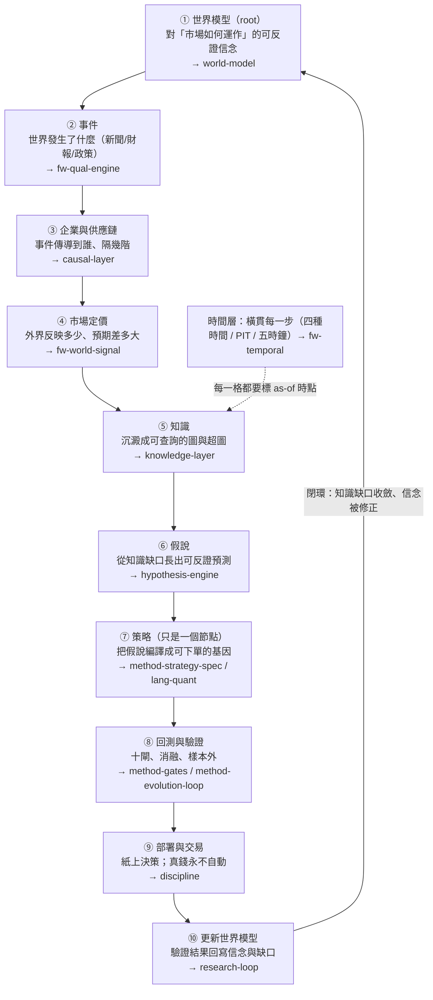
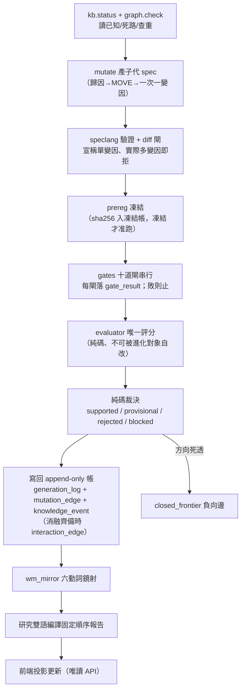

# 整體架構與資料流

這一頁給你一張總圖，但它跟上一版不一樣。上一版把「策略基因」放在圖的中心——資料流進來、變成策略、被進化引擎生成與裁決；策略是那個「被演化的東西」。**owner 2026-07-22 的深層批評說這張圖的 root 擺錯了**：對量化投資而言，真正該被演化的不是策略，是**世界模型**（我們對「市場如何運作」的一組可反證信念）。策略只是世界模型的一個**投影**——把某條世界信念兌現成可下單、可回測的形狀，用來檢驗那條信念對不對。這一頁按這個重構後的主軸重畫，並且**誠實標出哪些層是真的、哪些是空殼、哪些只是擺錯位置**。若你想先讀完整敘事再看結構，先去 [總覽：真正該演化的不是策略，是世界模型](overview.md)；想理解為什麼「演化目標」是最關鍵的一處錯，去 [進化的目標設錯了（病灶六）](objective.md)；想看整套重構主軸怎麼站成一排，去 [研究作業系統：11 層與「別蓋空引擎」](research-os.md)。

一句話定位：**這台引擎的機件（生成→回測→消融→裁決→記憶）是真的、會轉、能自我否證；但它目前只把「策略」當演化對象，而策略只是世界模型的一個節點。把 root 換回世界模型，是這份 wiki 這一輪最重要的修正。**

## 重構後的主軸：研究迴圈是一個世界模型的閉環

先看該長成什麼樣子。研究的主迴圈不是「資料→策略→回測」，而是一條回到自己的環：世界怎麼運作（信念）→ 世界發生了什麼（事件）→ 傳導到誰（企業與供應鏈）→ 市場反映多少（定價與預期差）→ 沉澱成可查詢的知識 → 從知識缺口長出可反證的假說 → 把假說編譯成一個策略去下注 → 回測與樣本外驗證 → 紙上部署與交易 → 用驗證結果**回寫世界模型的信念與缺口**。策略在這條環裡只是第⑦格。

這張圖跟舊圖最大的差別，是箭頭的**終點回到了起點**。舊圖的終點是「實驗頁留下血統」，是一條開口的管線；新圖的終點是「更新世界模型」，是一個閉環。**進化的對象因此從「策略」換成「世界模型」**——每一輪不是問「有沒有生出更高 Sharpe 的策略」，而是問「世界模型的哪條信念被證實、哪條被否證、哪個知識缺口被填上」。整套主軸的完整說明在 [研究迴圈：世界→知識→假說→驗證→更新世界模型](research-loop.md)，每一層各自展開在下面標的頁。

## 誠實對帳：這十格，哪些是真的、哪些是空殼、哪些擺錯位置

這是這一頁最重要的一節，不能跳過。上面那張漂亮的閉環圖，**目前絕大多數格子是「設計了、但幾乎沒有資料、而且在現行 wiki 敘事裡被擺到側邊」**。把每一格拆成三態誠實標記（資料截止 2026-07-22，數字為當日實查）：

| 迴圈格 | 【已設計】哪一頁/框架定義了它 | 【幾乎空殼】實際資料量（實查） | 【擺錯位階】現行 wiki 怎麼對待它 |
|---|---|---|---|
| ① 世界模型 root | [世界模型：世界不是新聞，新聞是世界狀態的 delta](world-model.md)（本輪新頁）＋世界模型基底六動詞已上線 | wm_state 只鏡射研究側裁決摘要，**沒有一組「市場如何運作」的本體信念被顯式建模** | 舊圖裡根本沒有這一格；世界模型是「側邊功能」不是 root |
| ② 事件 | [框架：質化引擎（新聞→世界模型→特徵→Alpha工廠）](fw-qual-engine.md)（mcm 唯讀 → MIEE 事件帳） | 新聞真實歷史**只有 15 天**（mcm 2026-07-07 起收）；事件帳雖多，可回測深度＝0 | 被歸為「質化語言」的一個框架，不是主迴圈入口 |
| ③ 企業與供應鏈 | [因果層：新聞→事件→供需→公司→財報→預期→價格](causal-layer.md)（本輪新頁）＋mcm causal_observations | causal_observations 約 **108 筆**（活管線，晨快照記 77）、正式 `edges` 表 **0 筆**、供應鏈**只有一階**（distance≈0）；多階傳導拓撲不存在 | 舊圖完全沒有這一格 |
| ④ 市場定價 | [框架：世界訊號](fw-world-signal.md)（九態、P 預期差） | 世界層數值是**示意佔位**，未接真資料源（設計書自述） | 被歸為「量化語言」的第二個框架，P1 之後才進場 |
| ⑤ 知識 | [知識層：一則新聞展開成一張知識子圖](knowledge-layer.md)／[知識圖譜：四張圖](graph-knowledge.md)／[超圖：策略基因超邊與交互超邊](graph-hypergraph.md) | 研究側圖有料（qual_edge 374、qual_hyperedge 159、strategy_spec 5、interaction_edge 1）；但**世界側知識圖近乎空帳** | 舊圖有「圖記憶」，但它記的是研究血統，不是世界知識 |
| ⑥ 假說 | [假說引擎：從「今天有哪些新聞」到「今天最大的未知是什麼」](hypothesis-engine.md)（MIEE hypothesis 狀態機） | MIEE 機件真跑過（109/109 考卷綠、3,412 筆前瞻預測），但**假說是從新聞事件長的，不是從世界模型缺口長的** | 被歸為第四部資訊層的一個雛形 |
| ⑦ 策略 | [方法：策略基因（StrategySpec 九部件）](method-strategy-spec.md)／[量化結構組成語言（總覽）](lang-quant.md)／進化引擎 | **這一格是真的**：strategy_spec 5、mutation_edge 2、gate_result 13，真跑過四輪實驗 | **舊圖把它當 root**——這正是被批評的擺錯位階 |
| ⑧ 回測與驗證 | [方法：證據閘（十道關卡）](method-gates.md)／[方法：進化迴圈（圖提案→變異→裁決→回流）](method-evolution-loop.md)／[實驗索引：每一輪真跑，逐環節攤開](exp-index.md) | **這一格也是真的**：十閘建了幾道、消融真跑、樣本外一輪都還沒跑（全封頂 E2） | 位置正確，是全系統最紮實的一段 |
| ⑨ 部署與交易 | [方法論：誠實紀律（拒絕相信自己）](discipline.md) | 只有紙上決策；真錢永不自動（天然護欄） | 位置正確 |
| ⑩ 更新世界模型 | [研究迴圈：世界→知識→假說→驗證→更新世界模型](research-loop.md)（本輪新頁）＋wm_mirror 六動詞 | 目前只鏡射研究側裁決；**沒有「世界信念被修正」的回寫路徑** | 舊圖沒有閉環這一格 |
| 時間層（橫貫） | [框架：時間層（時態邏輯節點）](fw-temporal.md) | `temporal_edge` **連表都還沒建**；四種時間、五時鐘、階段 schema 幾乎整層未實作 | 被標為「最未完成的一層」，位置正確但幾乎是空的 |

一句話讀完這張表：**真正有程式與資料撐著的，是⑦策略、⑧回測、⑨部署這一小段——也就是「策略進化的薄縱切」；而①②③⑤⑥⑩這些構成「世界模型閉環」的格子，多半是設計好的空殼。** 所以這不是「wiki 說有世界模型、其實完全沒有」的謊言，而是「世界模型層設計了、幾乎沒填、而且在敘事裡被擺到策略旁邊當配角」的三重實情。這個判斷本身就是 [進化的目標設錯了（病灶六）](objective.md) 與 [研究作業系統：11 層與「別蓋空引擎」](research-os.md) 兩頁的出發點。

## 一個關鍵警告：不要因為圖漂亮就去蓋十一個引擎

owner 同時提了另一個重構視角——把整套研究迴圈拆成 **Research OS 十一層**（世界模型／知識／超圖／時間／因果／假說／實驗／Alpha／組合／執行／自我進化）。這個拆法是對的，它把「該演化世界模型」這件事講清楚了。**但「真的把十一個引擎都蓋出來」，正是 [方法論：誠實紀律（拒絕相信自己）](discipline.md) 方向裁決裡被點名的頭號致命盲點：architecture-first（架構先於價值驗證）。** 四層同時建成、日後研究失敗就無法歸因到哪一層——這句話對十一層一樣成立，而且更嚴重。

所以這份 wiki 的修法是**兩條腿分開走**，細節在 [研究作業系統：11 層與「別蓋空引擎」](research-os.md)：

1. **現在就重構敘事主軸與演化目標**——把 root 從策略換回世界模型、把演化目標從「策略級指標」換成「世界模型的可反證預測力／知識缺口收斂」。這件事便宜、正確、不寫一行新引擎程式碼，這一頁與 [總覽：真正該演化的不是策略，是世界模型](overview.md)／[進化的目標設錯了（病灶六）](objective.md) 就是在做它。
2. **建置仍走薄縱切**——不蓋十一個空引擎，而是先把**一條**世界→知識→假說→驗證的真實機制鏈填滿（例如「台電強韌電網／CoWoS 擴產→散熱與重電供應鏈→月營收加速→定價延遲」這一條），讓它整條走完再談擴建。這正是方向裁決鐵律一「薄縱切優先」。

換句話說：**敘事重構是免費且該立刻做的；引擎建置永遠只准一條縱切在跑。** 把這兩件事混為一談——「既然要以世界模型為主軸，那就把十一層都蓋起來」——就是掉進 architecture-first 陷阱。

## 後端在做什麼：真相層的模組（＝⑦⑧那一小段的實體）

上面那條閉環是**該有的樣子**；下面這張表是**真的存在的程式碼**。它們全部長在 `aaro/`，寫進同一個 `aaro.sqlite`（07-22 兩引擎落地後 30 表）。看清楚它們在閉環裡的位置：**它們幾乎全部落在第⑦格（策略）與第⑧格（回測驗證）**——這正說明「已建置的部分＝策略進化薄縱切」，而不是整個世界模型閉環。

| 目錄／檔案 | 角色 | 在閉環的位置 | 狀態 |
|---|---|---|---|
| `engine/speclang.py` | 策略層 DSL 六算子（Universe/RankBy/TopN/Weight/RebalanceOn/ExitRule） | ⑦ 策略 | 07-22 已落地、九卷考卷綠 |
| `engine/spec.py` | StrategySpec 九部件驗證器＋單變因 diff 閘 | ⑦ 策略 | 已落地 |
| `engine/db_strategy.py`／`db_graph.py` | 四新表＋append-only 觸發器＋證據非空 CHECK；交互超邊表 | ⑤ 知識（研究側） | 已落地 |
| `engine/graph_views.py` | 四圖投影 SQL 視圖（DROP 可重推逐位元一致） | ⑤ 知識（研究側） | 已落地兩圖視圖 |
| `engine/compile_positions.py` | 真 finlab_db 事件樣本部位編譯器（月營收公告日錨、t+1） | ⑦→⑧ | 已落地 |
| `engine/run_ab.py`／`run_c.py` | 部署同形淨值引擎 | ⑧ 回測 | 已落地 |
| `engine/gaps.py`／`ablation.py`／`evolve_loop.py` | 圖提案器／四臂消融／自主迴圈 | ⑧ 驗證（見 [方法：進化迴圈（圖提案→變異→裁決→回流）](method-evolution-loop.md)） | 07-22 落地 |
| `evaluator/harness.py` | **全系統唯一評分器**：rank IC/t、噪音地板、控動能增量、三態 judge | ⑧ 純碼裁決 | 沿用、零改動 |
| `kb.py` | 實驗記憶／接手摘要／查重閘 G0／預註冊 sha256 凍結 | ⑤→⑩ | 沿用＋擴 writeback |
| `wm_mirror.py` | 世界模型六動詞鏡射（分域分庫、同一契約） | ⑩ 更新世界模型（目前只鏡射研究側） | 沿用 |
| `qual/`（`db_qual.py`／`narrative.py`／`vocab.py`／`project_edges.py`） | 質化引擎：機制詞彙對映／`qual_edge`／`qual_hyperedge`／敘事卡 | ②③ 事件與傳導（雛形） | 07-22 落地、九卷綠，見 [框架：質化引擎（新聞→世界模型→特徵→Alpha工廠）](fw-qual-engine.md) |
| `report → :8987 /compiler` | 研究雙語把裁決編成固定順序人類報告 | 全鏈輸出 | 沿用 |

三條不可混淆的邊界（後端 code review 的紅線）：**LLM 與規則可提案、永不寫裁決欄；回測產知識、永不產真錢部位；UI 是投影、永不回灌計算。** 這三條在重構後一字不改——它們保護的是機件的誠實，與 root 是誰無關。

## 資料流：策略節點內部怎麼端到端跑完一輪

下面是⑦⑧兩格內部的一輪進化資料流——也就是「已建置薄縱切」的實際管線。放在這裡是要提醒你：**這條管線很紮實，但它是閉環裡的一小段，不是閉環本身。** 每一步都落帳，前一關敗、後一關不跑（省預算）：

這條流水線裡有三個設計不可退讓：**預註冊在看結果之前凍結**（[方法：證據閘（十道關卡）](method-gates.md)）、**評分器唯一且不可被進化對象自改**（[方法論：誠實紀律（拒絕相信自己）](discipline.md)）、**裁決是純碼不是 LLM**（LLM 只在「unknown 歸因解讀」與「交互超邊候選提案」兩處出現，輸出一律過驗證器，非法即拒）。

**但要注意這條管線的裁判是誰**：它問的是「子代 spec 的評分有沒有勝過父代」。[實驗 002](exp-002-ablation.md) 已經證明，當你用這個裁判去放手優化，引擎會一路走進動能 beta——因為在多頭樣本裡，動能就是會付錢。這不是機件壞了，是**裁判問錯了問題**。要問對問題，裁判得換成「世界模型的可反證預測有沒有被證實」，而不是「策略級指標有沒有變好」。這個「目標錯置」是整份重構的核心證據，完整寫在 [進化的目標設錯了（病灶六）](objective.md)。

## 前端：投影層

前端全部是投影，資料只走唯讀 API（`serve.py`，回應加 `no-store` 防舊快取假故障）。主使用者是 owner，手機經 tailscale 進入，三分鐘回答「在研究什麼／為何選這步／花了多少／卡在哪／要不要我介入」。核心頁：候選閘門管線頁（每列一候選、十閘燈、點開逐閘履歷）、血統樹（父→子沿 MOVE 展開、失敗旁支灰色保留）、A/B 功勞簿（舊流程 vs 語言棧流程七項 meta 記帳，見 [方法論：誠實紀律（拒絕相信自己）](discipline.md) 證據歸屬分離）、每日持股敘事卡（[框架：質化引擎（新聞→世界模型→特徵→Alpha工廠）](fw-qual-engine.md)）。另有一個對外報告站 `pub/`（`serve_report.py:8996`，公開網址

https://alpha.7706210988.uk

自包含、去識別化，就是為了貼給 LLM 讀並邀請對抗批判；這份 wiki 就住在它下面。

## 現況與邊界

架構圖上不是每一塊都已實作，而且重構之後這件事更該被講清楚：**已落地的是「策略進化薄縱切」（⑦⑧⑨），構成「世界模型閉環」的其餘格子（①②③⑤⑥⑩）多為設計空殼。** 逐項狀態見上面的三態對帳表。具體到程式層——**已落地**（07-22）：speclang／spec 驗證器／diff 閘／四新表＋觸發器／兩圖視圖／查重閘／部位編譯／run_ab 與 run_c 部署同形對照／qual 兩表／敘事卡 v1／圖提案器＋消融＋自主迴圈。**未落地**：十道證據閘只建了其中幾道、mutate 完整路由、前端全部頁面、[時間層](fw-temporal.md) 的 `temporal_edge`／五時鐘／對齊契約、[因果層](causal-layer.md) 的正式 edges 表與多階供應鏈、[世界模型：世界不是新聞，新聞是世界狀態的 delta](world-model.md) 的世界信念本體、[假說](hypothesis-engine.md) 從知識缺口生成的路徑。各層對應頁的「誠實邊界」節與 [給 LLM 評審：請攻擊這些接縫](for-llm-review.md) 有逐項展開；為什麼「先重構敘事、再薄縱切填一條鏈」而不是「蓋齊十一層」，見 [研究作業系統：11 層與「別蓋空引擎」](research-os.md)。

---

**被連結自（反向連結）：** [實驗 000：引擎首輪 A/B 退出時點](exp-000-engine-first-run.md) · [實驗索引：每一輪真跑，逐環節攤開](exp-index.md) · [框架：特徵代數](fw-feature-algebra.md) · [研究作業系統：11 層與「別蓋空引擎」](research-os.md) · [總覽：真正該演化的不是策略，是世界模型](overview.md) · [詞彙表](glossary.md) · [首頁：Alpha 進化迴圈研究 Wiki](index.md)
