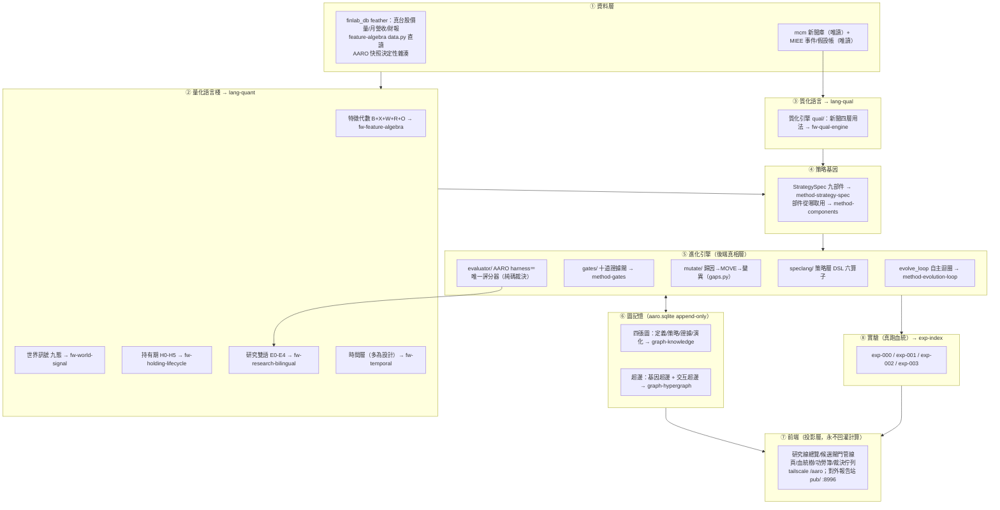
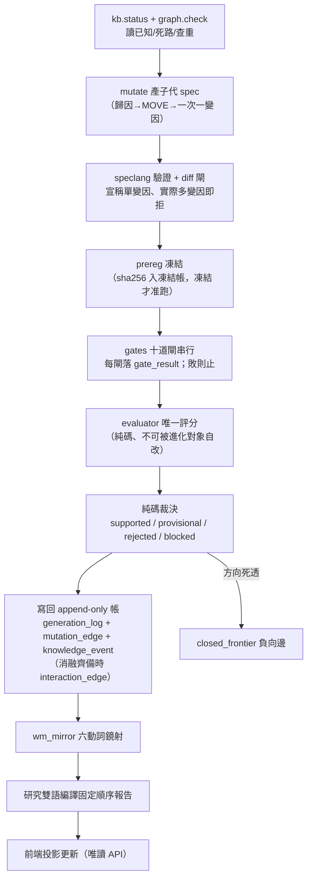

# 整體架構與資料流

這一頁給你一張總圖：資料從哪裡進來，經過量化語言棧與質化語言變成策略基因，落進圖記憶，被進化迴圈生成、驗證、裁決，最後在實驗頁留下可稽核的血統。每一塊都標了它在哪一頁展開。若你想先讀敘事再看結構，先去 [總覽：從一個念頭到一台會拒絕相信自己的引擎](overview.md)。

一句話定位（來自框架書）：**後端＝「在 AARO 的帳上長出策略文法、閘門管線與圖投影」；前端＝「owner 手機三分鐘看懂研究現場，每列候選點開看十閘履歷」。不另起第二套實驗室、不另起第二個家——一切長在 `aaro/`。** 這裡的 AARO（自治 Alpha 研究實驗室）是**既有且真跑過十個研究世代**的實驗帳＋唯一評分器系統，不是本專案要新蓋的東西；本專案是長在它上面的「語言原生進化層」。

## 整體架構大圖（每層對應哪一頁）

三條不可混淆的邊界（後端 code review 的紅線）：**LLM 與規則可提案、永不寫裁決欄；回測產知識、永不產真錢部位；UI 是投影、永不回灌計算。**

## 後端在做什麼：真相層的模組

後端全部長在 `aaro/`，寫進同一個 `aaro.sqlite`（07-22 晨快照 22 表 16 觸發器；兩引擎落地後現況 28 表 28 觸發器）。核心模組與歸戶：

| 目錄／檔案 | 角色 | 狀態 |
|---|---|---|
| `engine/speclang.py` | 策略層 DSL 六算子（Universe/RankBy/TopN/Weight/RebalanceOn/ExitRule），型別擴 `universe_state`／`ordered_state`／`portfolio_state` | 07-22 已落地、九卷考卷綠 |
| `engine/spec.py` | StrategySpec 九部件驗證器 + 單變因 diff 閘（宣稱變更集 ≠ 實際 diff 集即拒） | 已落地 |
| `engine/db_strategy.py`／`db_graph.py` | 四新表 + append-only 觸發器 + 證據非空 CHECK；交互超邊表遷移 | 已落地 |
| `engine/graph_views.py` | 四圖投影 SQL 視圖（DROP 可重推逐位元一致） | 已落地兩圖視圖 |
| `engine/compile_positions.py` | 真 finlab_db 事件樣本部位編譯器（月營收公告日錨、t+1 執行） | 已落地 |
| `engine/run_ab.py`／`run_c.py` | 部署同形淨值引擎（跑完整策略而非用 IC 代替） | 已落地 |
| `engine/gaps.py`／`ablation.py`／`evolve_loop.py` | 圖提案器／四臂消融／自主迴圈 | 07-22 落地，見 [方法：進化迴圈（圖提案→變異→裁決→回流）](method-evolution-loop.md) |
| `evaluator/harness.py` | **全系統唯一評分器**：rank IC/t、噪音地板、控動能增量、三態 judge | 沿用、零改動 |
| `kb.py` | 實驗記憶／接手摘要／查重閘 G0／預註冊 sha256 凍結 | 沿用＋擴 writeback |
| `wm_mirror.py` | 世界模型六動詞鏡射（分域分庫、同一契約） | 沿用 |
| `qual/`（`db_qual.py`／`narrative.py`／`vocab.py`／`project_edges.py`） | 質化引擎：機制詞彙對映／`qual_edge`／`qual_hyperedge`／敘事卡 | 07-22 落地、九卷綠，見 [框架：質化引擎（新聞→世界模型→特徵→Alpha工廠）](fw-qual-engine.md) |
| `report → :8987 /compiler` | 研究雙語把裁決編成固定順序人類報告 | 沿用 |

**鎖表裁決**只鎖新表：策略四表與 qual 兩表補 append-only 觸發器；既有表（`generation_log`／`closed_frontier`／`rsi_*`／`wm_*`）經 grep 實證有合法重建路徑（kb backfill 整批重建、rsi/evolve 週期重建、wm_mirror 鏡射維護），維持紀律性 append-only 不補鎖。這條「哪些鎖死、哪些紀律性」的取捨，是 [方法論：誠實紀律（拒絕相信自己）](discipline.md) 的一部分。

## 資料流：一輪進化怎麼端到端跑完

下面是框架書定義的一輪進化資料流。每一步都落帳，前一關敗、後一關不跑（省預算）：

這條流水線裡有三個設計不可退讓：**預註冊在看結果之前凍結**（[方法：證據閘（十道關卡）](method-gates.md)）、**評分器唯一且不可被進化對象自改**（[方法論：誠實紀律（拒絕相信自己）](discipline.md)）、**裁決是純碼不是 LLM**（LLM 只在「unknown 歸因解讀」與「交互超邊候選提案」兩處出現，輸出一律過驗證器，非法即拒）。

## 前端：投影層

前端全部是投影，資料只走唯讀 API（`serve.py`，回應加 `no-store` 防舊快取假故障）。主使用者是 owner，手機經 tailscale 進入，三分鐘回答「在研究什麼／為何選這步／花了多少／卡在哪／要不要我介入」。核心頁：

- **候選閘門管線頁**（pipeline-ledger 範式）：每列一候選，一條迷你管線條顯示十閘燈，點列展開逐閘履歷（GateResult 指標、失敗原因、證據 ref、耗時）。
- **血統樹**：父 → 子沿 MOVE 展開，失敗旁支灰色保留不隱藏。
- **A/B 功勞簿**：舊流程 vs 語言棧流程七項 meta 記帳並排——這是語言棧唯一合法的功勞簿（見 [方法論：誠實紀律（拒絕相信自己）](discipline.md) 證據歸屬分離）。
- **每日持股敘事卡**：每檔持股一張「為什麼可能會漲」卡，PIT 視圖與事後視圖分欄，純投影零寫入（[框架：質化引擎（新聞→世界模型→特徵→Alpha工廠）](fw-qual-engine.md)）。

另有一個**對外報告站** `pub/`（`serve_report.py:8996`，公開網址 https://alpha.7706210988.uk ）——自包含、去識別化，就是為了貼給 LLM 讀並邀請對抗批判；這份 wiki 就住在它下面。

## 現況與邊界

架構圖上不是每一塊都已實作。**已落地**（07-22）：speclang／spec 驗證器／diff 閘／四新表＋觸發器／兩圖視圖／查重閘／部位編譯／run_ab 與 run_c 部署同形對照／qual 兩表／敘事卡 v1／圖提案器＋消融＋自主迴圈。**未落地**：十道證據閘只建了其中幾道（gate_result 多為空表框架）、mutate 完整路由、前端全部頁面、[時間層](fw-temporal.md) 的 `temporal_edge`／五時鐘／對齊契約、質化語言的新聞特徵編譯器與多階供應鏈。逐項狀態與各層對應頁，見各框架頁的「誠實邊界」節，以及 [給 LLM 評審：請攻擊這些接縫](for-llm-review.md)。

---

**被連結自（反向連結）：** [實驗 000：引擎首輪 A/B 退出時點](exp-000-engine-first-run.md) · [實驗索引：每一輪真跑，逐環節攤開](exp-index.md) · [框架：特徵代數](fw-feature-algebra.md) · [總覽：從一個念頭到一台會拒絕相信自己的引擎](overview.md) · [詞彙表](glossary.md) · [首頁：Alpha 進化迴圈研究 Wiki](index.md)
