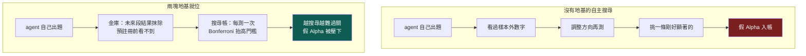
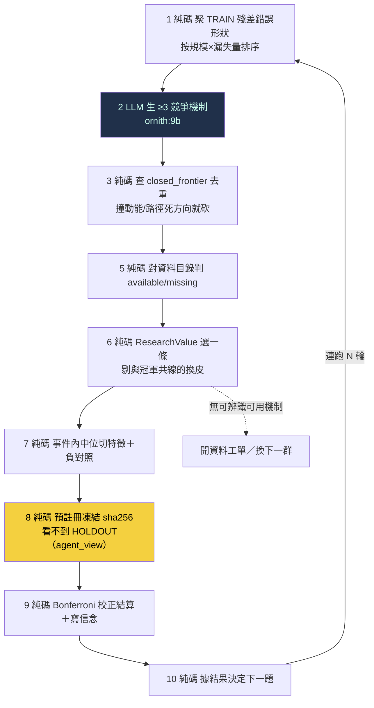

# 自主研究：無人選題迴圈與兩件防作弊基礎

到 [[exp-007-residual-belief|exp-007]] 為止，這台引擎會「自動判卷」——預註冊、純碼結算、負結果入帳都成熟了——但還不會「自己出題」。exp-007 的關鍵研究跳躍（從殘差挑出陽明、讀成航運超級週期、判缺產業需求、選特徵、定切法、寫假說與否證條件）全是人／LLM 做的，純碼只在這些選擇之後接手。搜尋帳因此把那一輪誠實記為 `autonomous=0`。

這一頁記錄把「選題／機制／資料搜尋／下一議程」真正接進 agent 閉環的第一步，以及它必須先站在的兩塊地基：**不可偷看的資料金庫**與**全域搜尋帳**。沒有這兩塊，一個會自己反覆搜尋的系統只會越勤勞、越容易挖到假 Alpha。

<!--STATE-->
> **現況快照（自 `aaro.sqlite` 真相帳投影，非手寫；由 `wm/state_projector.py` 於 build 時注入）**
>
> - 編號實驗：**8 個**（000–007，每個都指回帳本證據）
> - 信念契約：**6 條**＝策展 3＋自主示範 3；從冠軍殘差長出的世界假說 **1 條** → B-RES-001（NARROW_SCOPE，信心 0.445182）
> - 已 confirmed（REINFORCE 過基準且來自 SEALED 段）：**0 條（C 臂維持 blocked）**
> - 預註冊凍結：**6 份**（H-DEV2、EXP-005、AUTO-AR-1-C-normal-revH-chipL、AUTO-AR-2-C-normal-revM-chipL、AUTO-AR-3-C-normal-revL-chipL、EXP-007）
> - C 臂狀態：**blocked**（需一條 confirmed 信念才解鎖）
> - 金庫可授 confirmed 的 SEALED 段：**1 個** → LIVE_FORWARD（SEALED，0 筆，未來事件累積中）
> - 自主搜尋輪：**4 輪**（無人選題自主 **3 輪**，示範迴圈自轉，結算在 EXPOSED 段故不可 confirmed）
<!--/STATE-->

## 為什麼先要這兩塊地基

自主搜尋有兩個內建的作弊傾向，預註冊擋不住：

**其一：偷看金庫。** 預註冊只凍結「這一次」的假說，擋不住一個會反覆搜尋的 agent 事後根據看過的樣本外數字調整方向。exp-007 頁的初版就犯了這個錯——管線碼從不計算 2025+ 金庫，但**呈現層**把它的結果印上頁面（命中率、平均效應），封條就此破掉。教訓：資料隔離必須由**存取路徑**保證，不能靠誰記得「不要看」。

**其二：多重檢定。** 連測一百條假說、每條各自做顯著性檢定，最後挑一條剛好過關的，單看那一條「很顯著」，其實是運氣。預註冊擋單次改靶，擋不住「測一百次挑幸運者」。

## 地基一：不可偷看的資料金庫（`wm/vault.py`）

金庫把每個樣本外分段釘進一張 append-only 的 `holdout_ledger`，狀態只能前進不能抹去：

| 狀態 | 意義 | 能否授予 confirmed |
|---|---|---|
| `SEALED` | 沒被用過、沒被看過結果 | **可以**（唯一合法來源） |
| `EXPOSED` | 已被結算用掉，或結果曾外洩（印上 wiki） | 永遠不行（燒毀） |
| `UNSEALED_ONCE` | 被最終晉升程序一次性讀取過 | 之後不行 |

對 king2 殘差集一鍵套用後，四段的真實狀態很說明問題：`TRAIN`（樣本內）、`HOLDOUT_2022_2024`（已用於 [[exp-007-residual-belief|B-RES-001]]）、`EXPOSED_2025`（曾印上 wiki）**全部 `EXPOSED`**；唯一 `SEALED` 的是 **`LIVE_FORWARD`**——封印日（2026-07-23）之後才會發生的事件，目前 0 筆。這如實說明一件事：**B-RES-001 要真 confirmed、C 臂要真解鎖，唯一乾淨的資料只能是未來累積出來的**，歷史全燒光了。未來事件天然不可偷看，是最乾淨的金庫。

金庫對外只給三種能力：`manifest()`（任何人可讀，但只回筆數／指紋／狀態，**永不回結果**）、`eligible_for_confirm()`（只有 SEALED 為真）、`unseal_once()`（僅晉升程序呼叫，讀完翻 `UNSEALED_ONCE`、入讀取帳、拒第二次）。另有 `agent_view()`：交給自主 harness 的資料視圖，把 SEALED／LIVE_FORWARD 段的結果欄抹成 NULL，harness 就算讀了 parquet 也看不到未來報酬。wiki build 還加了 **lint 閘**——任何頁面再出現燒毀分段的結果數字，`build.py` 直接失敗。

## 地基二：全域搜尋帳（`wm/search_ledger.py`）

搜尋帳記錄整個搜尋過程，讓「挑幸運者」現形並被懲罰：每輪產了幾條候選、拒了幾條、實測幾條、用了哪些資料段、屬哪個家族；每個樣本外段被查詢過幾次；每個家族累積實測幾條。

核心不是記帳好看，是**把記錄接進裁決**。`settle_corrected()` 依家族累積檢定數對 Wilson 下界用的 z 做 Bonferroni 放大——測越多，過 confirmed 的門檻越高：

| 家族第幾次檢定 | 等效 z′ | confidence（Wilson 下界） |
|---|---|---|
| 第 1 次 | 1.96 | 0.4452 |
| 第 3 次 | 2.39 | 0.4050 |
| 第 10 次 | 2.81 | 0.3691 |
| 第 30 次 | 3.14 | 0.3418 |

第 1 次退化回原結算（與 B-RES-001 記錄值一致）；越往後，同一組命中數換得的信心越低。**agent 越勤勞，單條假說要被相信就越難，而不是越容易。** 另有 `feature_overlap()` 純碼擋與既有特徵高度共線的「換皮」提案。

## 無人選題迴圈（`wm/autonomous_round.py`）

harness 把 exp-007 裡人做的跳躍接進閉環。確定性工作（聚類、去重、資料判定、評分、組特徵、預註冊、結算、決定下一題）全交純碼；只有「生競爭機制」這一步需要創意，交便宜本地模型（ornith:9b，對映 [[discipline|模型分級]]）。

### 第一次真跑三輪：迴圈自轉，誠實拒絕薄資料

三輪都在**不同錯誤形狀**（normal regime × rev_rank 高／中／低帶）上跑完全部步驟，沒有人替它選題：

- **step1** 純碼從 TRAIN 殘差聚出 18 個錯誤形狀；**step2** 9b 對頭號形狀生 3–4 個競爭機制；**step3** 砍掉撞死方向的；**step6** ResearchValue 選中 chip 訊號（與 king2 的 rev_rank 共線僅 **0.019**，是真正的新軸，不是換皮動能）。
- **step8** 預註冊凍結（`autonomous=1`，凍結先於結算）；**step9** 把假說限縮到該形狀的條件（regime＋rev_band）測——每個條件只剩 **13–17 個** HOLDOUT 事件，低於 `min_n=20`，三輪全部落 **`HOLD_PRIOR`**；**step10** 純碼決定 `pick_next_cluster`。

這個結果不漂亮，但正是重點：**在被切細的具體條件下，殘差 holdout 太薄，系統誠實回「證據不足、不下結論」，然後自己換下一題。** 它自己出了合法問題、自己接受了「測不出來」、再自己決定下一步——這就是 [[hypothesis-engine|假說引擎]]要的自我探索，而不是硬把薄資料湊成 Alpha。

## 兩種成功，這一輪屬於哪一種

自主 Alpha 閉環有兩種不同的成功，不能混為一談：

| 成功類型 | 判準 | 本輪 |
|---|---|---|
| **知識成功** | 信念被確認／限縮／否證，或誠實判定證據不足，世界模型更準 | **✅ 迴圈自轉三輪、誠實 HOLD_PRIOR** |
| **Alpha 成功** | 對 king2 有樣本外增量，扣 beta／成本／容量後仍可交易 | ❌ 尚無 |

**本輪是知識成功，不是 Alpha 成功。** 它證明「第二套（冠軍認知迴圈）能自己轉」，沒有證明「系統能自主發現 Alpha」。

## 誠實邊界（不得省略）

- **結算跑在 EXPOSED 段，不可 confirmed。** 歷史三段已全燒毀，自主輪的 HOLDOUT 結算只是「迴圈自轉」的示範；任何 confirmed 都只能來自 `LIVE_FORWARD`（目前 0 筆）。三條 `B-AUTO-*` 信念在真相帳裡標 `confirmable=False`，[[research-loop|狀態投影]]永不把它們算進 confirmed。
- **特徵文法太窄。** 目前只有「事件內中位切某可用欄」一種切法，可用欄限資料集內。不同機制常收斂到同一個 chip 切分；產業營收／運價指數／籌碼流向等外部 PIT 源不在手，機制正確落 `missing`、開資料工單——這如實示範「自主系統會自己發現手上缺什麼資料」，但也代表它現在能測的假說種類很少。
- **機制品質＝9b 弱模型。** 競爭機制由便宜模型生，多數偏泛；`world_feature` 命名靠關鍵詞對到資料欄，是啟發式，不是語意理解。
- **只有殘差一條探索線。** 目前只從 king2 殘差選題（冠軍利用線），這會退化成局部最佳化——把 king2 修得越來越複雜卻發現不了另一種更大的 Alpha。還缺一條「與 king2 低相關、甚至完全不同資料源」的**開放探索線**，這是下一步。
- **無人選題只跑過一輪三代，尚非常駐。** 排程自轉、跨輪 seen-set 防重、資料工單自動觸發取數，都還沒接。這是能自轉的**證明**，不是已經在自轉的**系統**。

延伸：這一輪在三迴圈裡的位置見 [[research-loop|研究迴圈]]；為什麼選題只能從殘差長出、下一步為何是「無人選題測試」見 [[hypothesis-engine|假說引擎]]；金庫與 confirmed 慢路的設計見 [[world-belief-contract|信念契約]]；第一條人工殘差假說見 [[exp-007-residual-belief|實驗 007]]；為什麼策略級裸績效量不了這種認知結果見 [[objective|演化的目標]]；歷次實驗血統見 [[exp-index|實驗索引]]。
