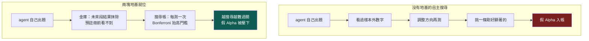
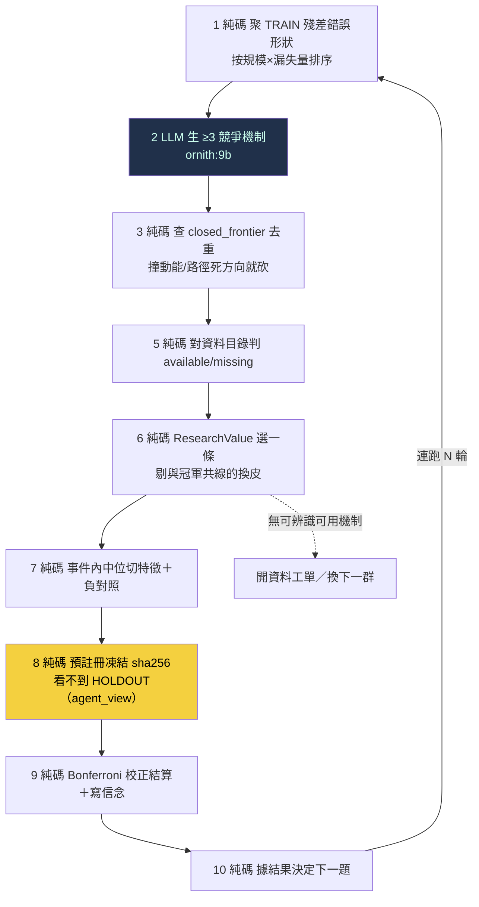

# 自主研究：無人選題迴圈與兩件防作弊基礎

到 [[exp-007-residual-belief|exp-007]] 為止，這台引擎會「自動判卷」——預註冊、純碼結算、負結果入帳都成熟了——但還不會「自己出題」。exp-007 的關鍵研究跳躍（從殘差挑出陽明、讀成航運超級週期、判缺產業需求、選特徵、定切法、寫假說與否證條件）全是人／LLM 做的，純碼只在這些選擇之後接手。搜尋帳因此把那一輪誠實記為 `autonomous=0`。

這一頁記錄把「選題／機制／資料搜尋／下一議程」真正接進 agent 閉環的第一步，以及它必須先站在的兩塊地基：**不可偷看的資料金庫**與**全域搜尋帳**。沒有這兩塊，一個會自己反覆搜尋的系統只會越勤勞、越容易挖到假 Alpha。

<!--STATE-->
> **現況快照（自 `aaro.sqlite` 真相帳投影，非手寫；由 `wm/state_projector.py` 於 build 時注入）**
>
> - 編號實驗：**8 個**（000–007，每個都指回帳本證據）
> - 信念契約：**6 條**＝策展 3＋自主示範 3；從冠軍殘差長出的世界假說 **1 條** → B-RES-001（NARROW_SCOPE，信心 0.445182）
> - 已 confirmed（REINFORCE 過基準且來自 SEALED 段）：**0 條（C 臂維持 blocked）**
> - 預註冊凍結：**18 份**（H-DEV2、EXP-005、AUTO-AR-1-C-normal-revH-chipL、AUTO-AR-2-C-normal-revM-chipL、AUTO-AR-3-C-normal-revL-chipL、OPEN-3fe5914572bb10d4、CONFIRM-bb482590fefecfe9、GRAPH-1ec53b3b9cf89dcf、GRAPH-21af02f1d9fdb6ee、EXP-007、GN2-66e7915251ddc51f、GN2-000f218c7bd3567a、GN2-07164ed6b26d6d89、GN2-8c7cff5da7e059bb、GN2-3e4f329d396af0bf、GN2-db1ce21c5ee6db42、GN2-44e152395ff9a7da、WORLD-ALPHA-56f9e9c88f29254d）
> - C 臂狀態：**blocked**（需一條 confirmed 信念才解鎖）
> - 金庫可授 confirmed 的 SEALED 段：**1 個** → LIVE_FORWARD（SEALED，0 筆，未來事件累積中）
> - 自主搜尋輪：**13 輪**（無人選題自主 **12 輪**，示範迴圈自轉，結算在 EXPOSED 段故不可 confirmed）
<!--/STATE-->

## 為什麼先要這兩塊地基

自主搜尋有兩個內建的作弊傾向，預註冊擋不住：

**其一：偷看金庫。** 預註冊只凍結「這一次」的假說，擋不住一個會反覆搜尋的 agent 事後根據看過的樣本外數字調整方向。exp-007 頁的初版就犯了這個錯——管線碼從不計算 2025+ 金庫，但**呈現層**把它的結果印上頁面（命中率、平均效應），封條就此破掉。教訓：資料隔離必須由**存取路徑**保證，不能靠誰記得「不要看」。

**其二：多重檢定。** 連測一百條假說、每條各自做顯著性檢定，最後挑一條剛好過關的，單看那一條「很顯著」，其實是運氣。預註冊擋單次改靶，擋不住「測一百次挑幸運者」。

## 地基一：不可偷看的資料金庫（`wm/vault.py`）

金庫把每個樣本外分段釘進一張 append-only 的 `holdout_ledger`，狀態只能前進不能抹去：

| 狀態 | 意義 | 能否授予 confirmed |
|---|---|---|
| `SEALED` | 沒被用過、沒被看過結果 | **可以**（唯一合法來源） |
| `EXPOSED` | 已被結算用掉，或結果曾外洩（印上 wiki） | 永遠不行（燒毀） |
| `UNSEALED_ONCE` | 被最終晉升程序一次性讀取過 | 之後不行 |

對 king2 殘差集一鍵套用後，四段的真實狀態很說明問題：`TRAIN`（樣本內）、`HOLDOUT_2022_2024`（已用於 [[exp-007-residual-belief|B-RES-001]]）、`EXPOSED_2025`（曾印上 wiki）**全部 `EXPOSED`**；唯一 `SEALED` 的是 **`LIVE_FORWARD`**——封印日（2026-07-23）之後才會發生的事件，目前 0 筆。這如實說明一件事：**B-RES-001 要真 confirmed、C 臂要真解鎖，唯一乾淨的資料只能是未來累積出來的**，歷史全燒光了。未來事件天然不可偷看，是最乾淨的金庫。

金庫對外只給三種能力：`manifest()`（任何人可讀，但只回筆數／指紋／狀態，**永不回結果**）、`eligible_for_confirm()`（只有 SEALED 為真）、`unseal_once()`（僅晉升程序呼叫，讀完翻 `UNSEALED_ONCE`、入讀取帳、拒第二次）。另有 `agent_view()`：交給自主 harness 的資料視圖，把 SEALED／LIVE_FORWARD 段的結果欄抹成 NULL，harness 就算讀了 parquet 也看不到未來報酬。wiki build 還加了 **lint 閘**——任何頁面再出現燒毀分段的結果數字，`build.py` 直接失敗。

## 地基二：全域搜尋帳（`wm/search_ledger.py`）

搜尋帳記錄整個搜尋過程，讓「挑幸運者」現形並被懲罰：每輪產了幾條候選、拒了幾條、實測幾條、用了哪些資料段、屬哪個家族；每個樣本外段被查詢過幾次；每個家族累積實測幾條。

核心不是記帳好看，是**把記錄接進裁決**。`settle_corrected()` 依家族累積檢定數對 Wilson 下界用的 z 做 Bonferroni 放大——測越多，過 confirmed 的門檻越高：

| 家族第幾次檢定 | 等效 z′ | confidence（Wilson 下界） |
|---|---|---|
| 第 1 次 | 1.96 | 0.4452 |
| 第 3 次 | 2.39 | 0.4050 |
| 第 10 次 | 2.81 | 0.3691 |
| 第 30 次 | 3.14 | 0.3418 |

第 1 次退化回原結算（與 B-RES-001 記錄值一致）；越往後，同一組命中數換得的信心越低。**agent 越勤勞，單條假說要被相信就越難，而不是越容易。** 另有 `feature_overlap()` 純碼擋與既有特徵高度共線的「換皮」提案。

## 無人選題迴圈（`wm/autonomous_round.py`）

harness 把 exp-007 裡人做的跳躍接進閉環。確定性工作（聚類、去重、資料判定、評分、組特徵、預註冊、結算、決定下一題）全交純碼；只有「生競爭機制」這一步需要創意，交便宜本地模型（ornith:9b，對映 [[discipline|模型分級]]）。

### 第一次真跑三輪：迴圈自轉，誠實拒絕薄資料

三輪都在**不同錯誤形狀**（normal regime × rev_rank 高／中／低帶）上跑完全部步驟，沒有人替它選題：

- **step1** 純碼從 TRAIN 殘差聚出 18 個錯誤形狀；**step2** 9b 對頭號形狀生 3–4 個競爭機制；**step3** 砍掉撞死方向的；**step6** ResearchValue 選中 chip 訊號（與 king2 的 rev_rank 共線僅 **0.019**，是真正的新軸，不是換皮動能）。
- **step8** 預註冊凍結（`autonomous=1`，凍結先於結算）；**step9** 把假說限縮到該形狀的條件（regime＋rev_band）測——每個條件只剩 **13–17 個** HOLDOUT 事件，低於 `min_n=20`，三輪全部落 **`HOLD_PRIOR`**；**step10** 純碼決定 `pick_next_cluster`。

這個結果不漂亮，但正是重點：**在被切細的具體條件下，殘差 holdout 太薄，系統誠實回「證據不足、不下結論」，然後自己換下一題。** 它自己出了合法問題、自己接受了「測不出來」、再自己決定下一步——這就是 [[hypothesis-engine|假說引擎]]要的自我探索，而不是硬把薄資料湊成 Alpha。

## 開放探索線：不繞著 king2 轉的第二條研究預算（`wm/open_exploration.py`）

只從 king2 殘差選題會退化成局部最佳化——把冠軍越修越複雜，卻永遠發現不了另一種更大的 Alpha。所以研究預算分兩條：**冠軍利用線**（上面的殘差迴圈）＋**開放探索線**（本節），後者刻意避開 king2 的軸（營收動能＋指紋＋籌碼＋品質），去價格／波動／量能／反轉裡找**與 king2 低相關**的新家族。

定義這條線的關鍵指標＝**對 king2 正交度**。既有評估器只檢定「對價格動能正交」，但 king2 的主軸是**基本面營收動能**（`RK(月營收YoY排名)` 佔 score 65%），一個對價格動能正交的特徵仍可能跟 king2 高度相關。所以本模組把 king2 主訊號當控制軸，算每個候選：①對 king2 的橫斷面相關 `corr_king2` ②控掉 king2 後前瞻報酬的偏 IC。一個「正交邊」＝有預測力（IC 顯著）**且**對 king2 低相關**且**控 king2 後偏 IC 仍在——才是 king2 沒有的新資訊，不是換皮營收動能。

第一輪真跑（`evaluator.harness` 真評 finlab 資料，dev tier，6 個非 king2 軸候選）：

| 候選家族 | IC(20日) | 對 king2 相關 | 對價格動能相關 | 裁決 |
|---|---|---|---|---|
| **low_vol_60**（低波動異象） | 0.071 (t=15) | −0.12 | −0.04 | **ORTHOGONAL_EDGE** |
| vol_compression（波動壓縮） | 0.036 (t=22) | −0.03 | −0.23 | ORTHOGONAL_EDGE |
| illiquidity_amihud（非流動性） | −0.032 (t=−16) | −0.11 | −0.16 | ORTHOGONAL_EDGE |
| volume_expansion（量能擴張） | −0.016 (t=−10) | +0.05 | +0.27 | ORTHOGONAL_EDGE |
| range_position_120（通道位置） | 0.046 (t=11) | +0.15 | **+0.81** | **MOMENTUM_BETA_CLOSED** |
| short_reversal_5（短期反轉） | 0.001 (t=0.5) | −0.06 | −0.04 | NO_EDGE |

兩個裁決最能說明這條線在做什麼：**range_position_120 對 king2 正交（相關僅 0.15）卻被擋下**——因為它對價格動能相關高達 0.81，就是 [[exp-002-ablation|exp-002]] 證過會滑進 beta 的已判死方向；「對 king2 正交」是必要非充分，還要不撞已知動能陷阱。**最強的真實發現＝low_vol_60（低波動異象）**：IC 0.071、對 king2 僅 −0.12、對動能僅 −0.04——對兩者都正交，是與 king2 營收動能真正不同的一條 Alpha 軸。（表中 t 為 naive 日頻 t——exp-008 稽核實錘重疊窗使 naive t 高估 3.5~4 倍，讀時打折；這批候選本就被成本閘擋下，結論不變。）

這正是開放探索線該給的東西：它找到一個 king2 結構上抓不到、也不是換皮動能的候選家族。但**這是發現階段的旗標，不是可交易結論**——見誠實邊界。

## 確認閘：把正交邊推過保留集＋成本，第一輪 0 條存活（`wm/edge_confirm.py`）

上面那些 `ORTHOGONAL_EDGE` 是 **dev tier 的發現階段旗標**——單特徵橫斷面 IC，t 大只因觀測多。確認閘把它們推過**沒被發現階段用過的 validation tier**（第一保留集，2022–2024）＋台股交易成本，跑六道門，全過才升「真挑戰者」：

| 門 | 檢什麼 |
|---|---|
| G1 PIT 乾淨 | `leak_probe`：毒化未來後特徵過去值逐位元不變（無前視） |
| G2 樣本外 IC | validation IC 顯著（`\|t\|≥2`）且與 dev 同號 |
| G3 淨成本存活 | 分位多空／多頭投組，扣來回成本（≈0.386%）×換手後，**多空淨 Sharpe≥0.5 且可交易多頭腿淨年化>0** |
| G4 控 size/動能 | 控動能+波動+規模後偏 IC 仍同號有量（不是 size/低波 beta 換皮） |
| G5 對 king2 正交 | 投組月報酬對 king2 研究鏡像報酬相關 <0.3 |
| G6 反 fishing | 候選＋協議先凍結 sha256 再看 validation；vault(2025+) 一律不碰 |

**第一輪結果：4 條正交邊，0 條通過。**

| 候選 | validation IC(t) | 多空毛→淨 Sharpe | 卡在 |
|---|---|---|---|
| **low_vol_60** | 顯著（t=12.83） | 0.05 → −0.06 | **G3 淨成本**（毛 Sharpe 近零，扣成本翻負） |
| illiquidity_amihud | 顯著（t=−4.27） | −0.52 → −0.71 | G3 淨成本 |
| volume_expansion | 顯著（t=−3.65） | 0.20 → −0.70 | G3（67% 換手把毛 0.20 吃成負） |
| vol_compression | 不足（t=1.51） | — | G2 樣本外 IC |

最關鍵的是 **low_vol_60**：它在 dev tier 的 IC 強到 t=15，樣本外 IC 也還顯著（t=12.83），**但扣成本後的多空頂/底分位價差就是不賺**。這正是 `IC 顯著 ≠ 可交易價差` 的典型落差——保留集＋成本紀律存在的全部理由，就是不讓一個發現階段旗標被誤當成 Alpha。

### 這個負結果是對抗查證過的（不是回測壞掉）

一個負結果只有在「管線本身沒 bug」時才有意義。我剛在確認閘裡修過一個 sign-handling bug，所以派了**四個獨立稽核鏡頭**（各自用真資料 re-run）來攻擊「0 通過」這個結論，綜合裁決＝**負結果可信（NEGATIVE_RESULT_TRUSTWORTHY，0 個影響結果的 bug）**：

- **健全性控制（決定性）**：同一套投組回測餵**已知強訊號**（價格動能）產出淨 Sharpe **+0.68**（毛 1.17）、餵**垃圾常數**得 **−0.66**——管線能乾淨分開「真有可交易 alpha／垃圾／高 IC 但不可交易」，不是把一切壓負。
- **成本稽核**：成本歸零後，四條邊最好的毛 Sharpe 也只有 0.20——擋住 G3 的是「樣本外根本沒有毛 alpha」，不是過度成本。
- **tier/洩漏**：validation 與 dev 零重疊、面板健康（37 次換股、每期約 1300 檔）、leak_probe 逐位元乾淨。
- **方向/腿別**：翻號後多空毛 Sharpe +0.52↔−0.52 完美反對稱，證明定向沒搞反；兩個方向都不過 G3。

稽核同時揪出兩個**不影響本結論、但已修**的隱患：`_portfolio` 的 hmask 參數缺型別防呆（誤傳字串會靜默變 0 換股）——已加 `_as_hmask` 擋下；G3 門名的文字與實際門檻（≥0.5）不一致——已對齊。

## 兩種成功，這一輪屬於哪一種

自主 Alpha 閉環有兩種不同的成功，不能混為一談：

| 成功類型 | 判準 | 本輪 |
|---|---|---|
| **知識成功** | 信念被確認／限縮／否證，或誠實判定證據不足，世界模型更準 | **✅ 冠軍利用線自轉三輪誠實 HOLD_PRIOR；開放探索線找到正交邊、又用確認閘證明它們扣成本後不存活** |
| **Alpha 成功** | 對 king2 有樣本外增量，扣 beta／成本／容量後仍可交易 | ❌ 尚無（4 條正交邊 0 條過確認閘） |

**兩條線都是知識成功，都不是 Alpha 成功。** 冠軍利用線證明「第二套能自己轉」；開放探索線更進一步——它不只找到與 king2 正交的候選，還誠實地把自己找到的候選推過保留集＋成本，證明它們**還不能交易**。系統對自己的發現一樣嚴格：找得到 ≠ 賺得到，而它有能力分辨這兩者。這比「找到一條 Alpha」更能證明整套紀律在誠實運作。

## 誠實邊界（不得省略）

- **結算跑在 EXPOSED 段，不可 confirmed。** 歷史三段已全燒毀，自主輪的 HOLDOUT 結算只是「迴圈自轉」的示範；任何 confirmed 都只能來自 `LIVE_FORWARD`（目前 0 筆）。三條 `B-AUTO-*` 信念在真相帳裡標 `confirmable=False`，[[research-loop|狀態投影]]永不把它們算進 confirmed。
- **特徵文法太窄。** 目前只有「事件內中位切某可用欄」一種切法，可用欄限資料集內。不同機制常收斂到同一個 chip 切分；產業營收／運價指數／籌碼流向等外部 PIT 源不在手，機制正確落 `missing`、開資料工單——這如實示範「自主系統會自己發現手上缺什麼資料」，但也代表它現在能測的假說種類很少。
- **機制品質＝9b 弱模型。** 競爭機制由便宜模型生，多數偏泛；`world_feature` 命名靠關鍵詞對到資料欄，是啟發式，不是語意理解。
- **開放探索線只跑了發現階段，不是可交易結論。** 上面那些 `ORTHOGONAL_EDGE`（如 low_vol_60）是 dev tier 的橫斷面單特徵 IC，t 值大是因為觀測多、**不代表可交易**：沒扣成本／換手／容量、沒做保留集 walk-forward、不是投組回測。真要成為挑戰者，得過金庫的保留集 tier＋成本＋容量閘。這條線目前證明「找得到與 king2 正交的候選」，還沒證明「其中有能扣完成本還賺的」。
- **對 king2 正交＝用 `RK(月營收YoY排名)` 當代理，非完整 king2。** king2 是 0.65·營收動能＋0.35·tilt（指紋＋籌碼）；本輪只控了 65% 的主軸，tilt 那 35% 還沒控。所以「對 king2 正交」目前是對其主軸正交，不是對整個 king2 正交。
- **無人選題只跑過一輪三代，尚非常駐。** 排程自轉、跨輪 seen-set 防重、資料工單自動觸發取數，都還沒接。這是能自轉的**證明**，不是已經在自轉的**系統**。

延伸：這一輪在三迴圈裡的位置見 [[research-loop|研究迴圈]]；為什麼選題只能從殘差長出、下一步為何是「無人選題測試」見 [[hypothesis-engine|假說引擎]]；金庫與 confirmed 慢路的設計見 [[world-belief-contract|信念契約]]；第一條人工殘差假說見 [[exp-007-residual-belief|實驗 007]]；為什麼策略級裸績效量不了這種認知結果見 [[objective|演化的目標]]；歷次實驗血統見 [[exp-index|實驗索引]]。
