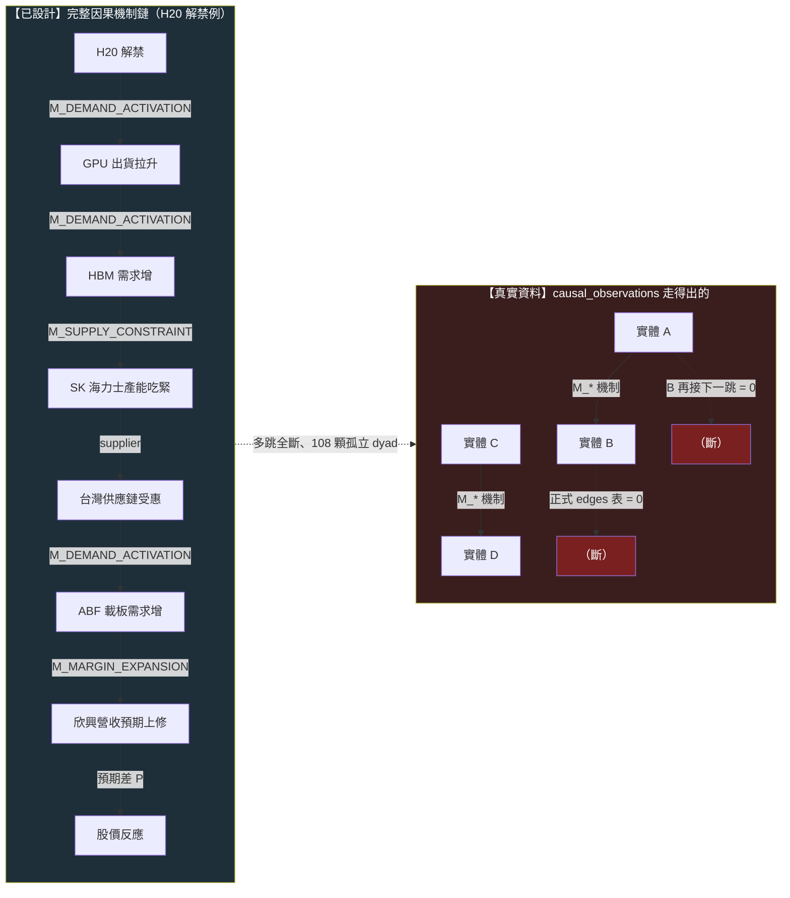

# 因果層：從世界事件到股價的那條機制鏈

這一頁是 owner 深層批評的**病灶 5**。如果 [知識層](knowledge-layer.md)（病灶 2）問「一則新聞連到誰」，因果層問的是更硬的一題：**這則新聞為什麼會讓那檔股票漲——經過哪些機制、哪一步傳到財報、市場的預期在哪一步落後？**

> 一條完整的投資因果鏈長這樣：`新聞 → 事件 → 供需變化 → 公司 → 財報 → 市場預期 → 價格`。舉一個真的例子：`H20 解禁 → 中國可買 GPU → GPU 出貨拉升 → HBM（高頻寬記憶體）需求增 → SK 海力士產能吃緊 → 台灣供應鏈受惠 → ABF 載板需求增 → 欣興營收預期上修 → 股價反應`。每一個箭頭都是一個**機制（mechanism）**——需求活化、供給受限、成本轉嫁、毛利擴張、預期修正。找到 Alpha，本質是找到「某條機制鏈上，市場的預期還沒追上基本面」的那個時點。

因果層是三頁世界模型重構的收束：[世界狀態](world-model.md)是根、[知識子圖](knowledge-layer.md)是關係網、**因果層是關係網上帶方向與機制的傳導**。

## 認知答案與行動答案（先講結論）

- **認知答案**：機制鏈的**詞彙已經設計得相當完整**（mcm 9 個 `M_*`、世界訊號 30 個 `M_*`、世界訊號的 T 傳導欄），**但那些機制目前是一顆顆孤立的觀察，沒有被串成鏈**。`H20 → GPU → HBM → SK → 台灣 → ABF → 欣興 → 股價` 這種多跳因果鏈，在資料裡一步都走不通——正式因果邊表 0 筆、機制觀察 108 筆全是孤立的兩點對、兩套機制詞彙只有 1 個對得上。
- **行動答案**：因果層的補法和進化目標綁死。**目前引擎優化的是策略級指標（子代 Sharpe 勝父代），這個目標會讓系統反覆重新發現動能 beta、而不是學到任何一條因果機制**——這正是 [實驗 002](exp-002-ablation.md) 親手顯示的。所以因果層的真正修法，是把進化目標從「策略績效」換成「**一條機制鏈的可反證預測力**」：填實 ONE 條鏈、預註冊它的前瞻驗證窗、看它事後對不對。詳見 [進化目標](objective.md)。

## 核心證據串接：為什麼「優化 Sharpe」永遠學不到因果

這是本頁最重要的一段，把 owner 的病灶 5 和我們自己的實驗接在一起。

[實驗 002](exp-002-ablation.md) 做了一件事：對引擎自己生出的漂亮候選 C（月營收 × 250 日價格強勢，CAGR 33%）跑乾淨的 2×2 消融，問「這是真綜效，還是兩個因子相加」。純碼裁決是 **`conflicting`**——證據硬到不留情面：

- 純動能自己的 Sharpe 就已經 **1.52**，和「營收＋強勢」的 1.52 **一模一樣**；
- 把強勢加到營收股上的增益（+13.0pp），和加到隨便一個基準上的增益（+12.3pp）**幾乎一樣大**——強勢的貢獻與有沒有做營收選股**無關**。

**這對因果層的意義**：當你把進化目標設成「子代績效贏父代」，搜尋空間裡最容易撿到的、最穩定付錢的東西，就是**動能 beta**（在多頭樣本裡動能就是會漲）。[實驗 003](exp-003-graph-evolution.md) 放手讓迴圈自主追報酬，它就一路走進更純的動能暴露（某代 Sharpe 衝到 2.06）。系統不是在學「H20 解禁如何透過 HBM 傳導到欣興」這種因果機制，它是在**一遍遍重新發現「漲的會繼續漲」**。**優化策略級指標 → 找到 beta；要學到因果 → 必須把目標換成機制鏈的可反證預測力、知識缺口的收斂**。因果層空、和進化目標錯，是同一個病的兩面。

## 三態誠實對帳：機制鏈現在到底連通到什麼程度

### 【已設計】哪些框架已經定義了機制傳導的語言

- **機制詞彙 M_\* 兩套都在**：mcm（股市新聞管線）有 9 個——`M_DEMAND_ACTIVATION`（需求活化）／`M_SUPPLY_CONSTRAINT`（供給受限）／`M_COST_PRESSURE`（成本壓力）／`M_MARGIN_EXPANSION`（毛利擴張）／`M_MARGIN_COMPRESSION`／`M_VALUE_TRANSFER`（價值轉移）／`M_CAPITAL_ROTATION`（資金輪動）／`M_EXPECTATION_CONFIRMATION`／`M_EXPECTATION_CONTRADICTION`；[世界訊號](fw-world-signal.md)有約 30 個（`M_CAPACITY_CONSTRAINT`／`M_ASP_INCREASE`／`M_EXPECTATION_GAP`／`M_EARNINGS_REVISION`…），分需求/供給/價格/競爭/財務/認知六族。
- **傳導欄已設計**：世界訊號的 **T（Transmission）欄**專門記「利益如何進入財報」——增量營收/毛利/營業利益/現金流橋接；**P（Pricing）欄**記「市場預期落後多少」＝預期差。這正是 `供需 → 財報 → 預期` 那三步的語言。
- **因果觀察表已存在**：mcm `causal_observations` 有 `source_entity → target_entity`、`mechanism_id`、`input_state / output_state`、`evidence_text`、`known_at`——一條機制邊該有的欄位都在。

### 【幾乎空殼】機制鏈的實際連通度（2026-07-22 查得）

| 資料表/資產 | 應該裝什麼 | 實際 | 意義 |
|---|---|---|---|
| mcm `causal_observations` | 串成鏈的因果邊 | **108 筆孤立兩點對**（`company_role` 全空、單一 `proof_grade=mapped_v1`） | 每筆是「A —機制→ B」的**孤立 dyad**，沒有 B 再接 C——**多跳鏈不存在** |
| mcm 正式 `edges` 表 | 提升為正典的因果邊 | **0 筆** | 因果圖是**空帳**；108 筆觀察沒有一筆被提升成正典邊 |
| 機制詞彙對映 | mcm M_\* ↔ 世界訊號 M_\* | **僅 1 個 exact**（`M_MARGIN_EXPANSION`），3 個 proposed 待人核 | 兩套機制語言**幾乎沒對上**，擴鏈前分岔 |
| 供應鏈拓撲 | 多階「誰供給誰、距幾階」 | MIEE 全庫 **supplier 邊僅 1 筆、還沒核准**；approved 邊 supply_chain_distance 全 0 | 供應鏈**只有一階、且是空的**——`SK → 台灣 → ABF → 欣興` 這種跨階傳導拓撲不存在 |

翻成白話：`H20 解禁 → GPU → HBM → SK → 台灣供應鏈 → ABF → 欣興 → 股價` 這條八跳鏈，資料庫裡**一跳都串不起來**。有的是 108 顆散落的「某因 → 某果」觀察料，彼此不相連；正式的因果邊表是 0；連把兩套機制詞彙對齊都還沒做完。機制鏈是設計出來的語言，不是跑得通的圖。

### 【擺錯位階】因果傳導被排到語言棧最後

- owner 病灶 5 的因果鏈（`新聞 → … → 價格`）是他心中投資邏輯的**主軸**；但在 wiki 裡，機制傳導是 [世界訊號](fw-world-signal.md)的一個欄位（T/P），而世界訊號本身被歸戶為「**P1 後才進場**」（Gen5 regime 門控才需要）——排在特徵代數、持有期之後。
- 進化迴圈變異的是**策略基因**、裁決的是**策略績效**（[方法：進化迴圈（圖提案→變異→裁決→回流）](method-evolution-loop.md)），因果機制從來不是被優化的對象。因果層被當成「事後用來解釋策略為什麼有效」的裝飾，不是「被系統主動學習、驗證、演化」的根。這就是病灶 5 與病灶 6（[目標錯了](objective.md)）是同一件事的原因。

## 一張圖看懂：設計的因果鏈 vs 真實的孤立觀察

左邊是設計該連通的八跳機制鏈，每跳掛一個 `M_*` 機制；右邊是資料真的有的——一堆兩點對，接不到第三點，正式邊表空。

## 修法：把因果鏈當進化目標，先填實一條

因果層的補法與 [進化目標](objective.md)的重構是同一步：

1. **換目標**：進化迴圈的適應度**加動能懲罰**（三份報告共同的 P0 行動），並把「勝出」的定義從「子代 Sharpe 高」改成「一條機制鏈的前瞻預測被市場證實」。沒有這步，[實驗 002](exp-002-ablation.md)／[實驗 003](exp-003-graph-evolution.md)的病會一直復發：優化績效永遠通向 beta。
2. **填實一條鏈、預註冊驗證窗**：選 ONE 條真鏈（H20/HBM 供應鏈或台電重電），把每一跳建成一條 `causal_observations` 帶機制與證據錨點的邊，**逐跳串連**（B 的 target 是 C 的 source），提升進正式 edges 表；再對鏈尾預註冊一個前瞻假說（沿 MIEE hypothesis 預註冊凍結：判準凍結、到期對帳），看它事後對不對。這就是 [時間層](fw-temporal.md)說的「進化目標的最終形態＝帶完整時間約束的時態因果模式」。
3. **先對齊機制詞彙**：擴鏈前把 mcm 的 9 個 `M_*` 與世界訊號的 30 個 `M_*` 建對映表（目前只 1 個 exact），否則兩套機制語言分岔、鏈接不起來。
4. **走薄縱切、不蓋 11 層**：因果層不獨立擴建，它是 [世界](world-model.md) → [知識](knowledge-layer.md) → 因果 → [假說](hypothesis-engine.md) 那條薄縱切的一段；為什麼不能一次把 [Research OS 11 層](research-os.md)都蓋出來，見 [誠實紀律](discipline.md)的 architecture-first 警告。

一句話收束：**因果層有機制詞彙、有傳導欄、有觀察表——唯獨沒有把觀察串成鏈的邊，也沒有一個會獎勵「學到因果」的目標**。實驗 002 已經證明：只要目標還是策略績效，這台引擎就只會一次次撿回動能 beta，永遠學不到 `H20 → HBM → 欣興` 那條鏈。

延伸閱讀：為什麼進化目標本身要重寫 → [演化的目標：一個目標函數量不了三種東西](objective.md)；一則新聞的知識子圖 → [知識層：一則新聞展開成一張知識子圖](knowledge-layer.md)；世界狀態當根 → [世界模型：世界不是新聞，新聞是世界狀態的 delta](world-model.md)；消融如何拆穿動能 beta → [實驗 002：交互超邊消融](exp-002-ablation.md)；帶時間約束的時態因果模式 → [框架：時間層（時態邏輯節點）](fw-temporal.md)；機制詞彙的兩套對映缺口 → [框架：質化引擎（新聞→世界模型→特徵→Alpha工廠）](fw-qual-engine.md)。

---

**被連結自（反向連結）：** [世界模型：世界不是新聞，新聞是世界狀態的 delta](world-model.md) · [整體架構與資料流](architecture.md) · [方法論：誠實紀律（拒絕相信自己）](discipline.md) · [知識層：一則新聞展開成一張知識子圖](knowledge-layer.md) · [研究作業系統：11 層與「別蓋空引擎」](research-os.md) · [研究迴圈：W/O/B/P 分離，主線繞著現任冠軍轉](research-loop.md) · [給 LLM 評審：請攻擊這些接縫](for-llm-review.md) · [總覽：真正該演化的不是策略，是世界模型](overview.md) · [首頁：Alpha 進化迴圈研究 Wiki](index.md)
