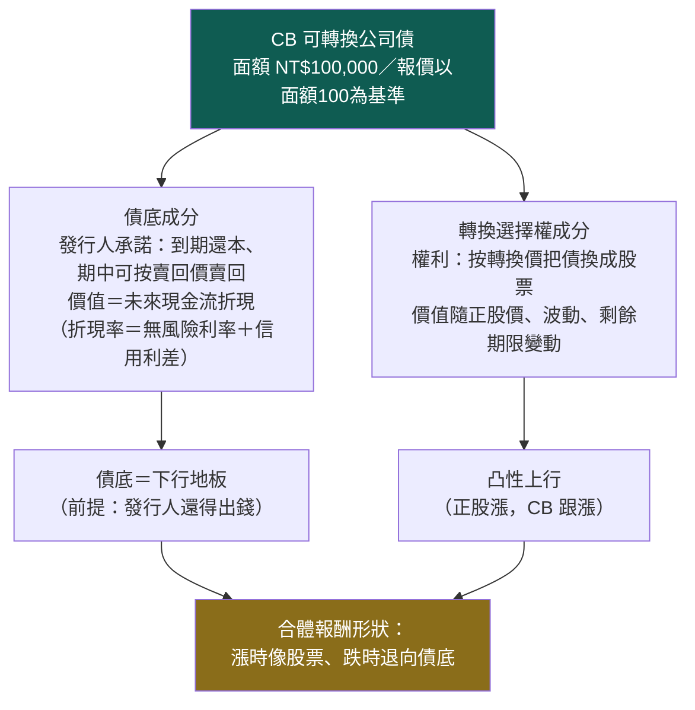
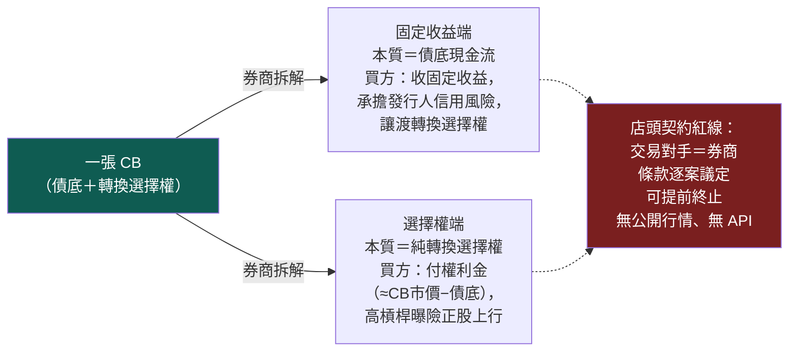

# CB 與 CBAS：債底加選擇權的合體，與拆開賣的兩端

這一頁是 [載具路由器](instrument-router.md) 的商品知識層：把可轉債（CB）與可轉債資產交換（CBAS）拆到機制見骨，並對這台機器上**已經存在的厚重 CB 遺產**做誠實歸戶。先立一件事：**CB 研究在這裡不是從零開始——它是一條已有定版判決的研究線（含一張今天還在每日更新的 851 檔活面板），而且有一份已判死清單。** 本頁任何規劃都必須先過這兩關：已有的不重蓋、判死的不重跑。

> **認知答案**：CB ≈ **信用調整債底 ＋ 轉換選擇權**。一張紙同時是「發行人欠你錢的債」與「用約定價格換股票的權利」，它的報酬形狀因此是凸的——正股漲時像股票、跌時退向債底。CBAS 則是把這兩個成分**拆開賣給兩種人**的店頭契約：固定收益端拿債底現金流、選擇權端花權利金拿轉換權。拆開後各自的本質都變純了，但代價是從交易所商品變成券商櫃檯契約——多出交易對手、契約不透明、提前終止三重風險。
>
> **行動答案**：路由研究的順位裡（見 [載具路由器：king2 決定看多誰，路由器決定用什麼報酬形狀表達](instrument-router.md)），CB 排第 2–4 步、CBAS 排最後第 5 步。CB 端曾經的**唯一致命缺口＝歷史賣回價**現在已實質補上——賣回價其實是每日面板 2009→2026、956/1,803 檔曾有值，已建 `data/cb_putprice.sqlite`，債底時序（債底＝PV(賣回價)）做得出來（見 [實驗 006：CB 載具路由四臂預註冊（構想級——判準未凍結、未入帳、零臂已跑）](exp-006-cb-router-prereg.md)）；殘留限制是折現率單一假設與嚴格 PIT 只 2023-12 起，仍待清。CBAS 端＝零代碼、零資料源、零通路，規劃文件已裁決**觀察區**：在十項承作資料拿到之前，只能做理論研究，不得宣稱可部署。

## 一、CB 的解剖：一張紙、兩個成分、三條公式



三條公式（全線通用口徑，台灣 CB 面額 10 萬、報價以面額 100 為基準）：

```
轉換比率   ＝ 面額 ÷ 轉換價                    （一張 CB 能換幾股）
轉換價值   ＝ 正股股價 × 轉換比率              （現在就換股，值多少）
轉換溢價率 ＝ CB 市價 ÷ 轉換價值 − 1           （為凸性多付了幾成）
```

一個真實量級的例子（示意數字）：轉換價 50 元的 CB，轉換比率＝100,000÷50＝2,000 股；正股 45 元時轉換價值＝45×2,000＝90,000（報價口徑 90）；若 CB 市價 102，轉換溢價率＝102÷90−1≈13.3%——你為「跌有地板」這個保險多付了 13.3%。路由器（[載具路由器：king2 決定看多誰，路由器決定用什麼報酬形狀表達](instrument-router.md)）判斷 CB 是否優於股票，本質上就是在判斷**這筆保費划不划算**。

## 二、六維欄位：描述一張 CB 需要哪些資料

| 維度 | 內容 | 為什麼路由器需要它 |
|---|---|---|
| 股票選擇權 | 轉換價、轉換比率、Delta、隱含波動、下修條款距離 | 決定「漲時跟多少」 |
| 債券價值 | 債底（賣回價／到期值折現）、YTP 賣回收益率、票面利率 | 決定「跌時墊多高」 |
| 發行條款 | 轉換起迄、賣回權起迄與**賣回價**、強制贖回條件、發行餘額 | 條款事件（下修／強贖／賣回）直接改變報酬形狀 |
| 市場品質 | 日成交張數／金額、報價新鮮度、買賣價差、持有集中度 | 成交不掉的效用是紙上效用 |
| 公司風險 | 發行人信用（償債能力、負債結構） | 債底的成色：信用出事，地板消失 |
| 時間狀態 | 距到期日、距賣回日、距強贖觸發、剩餘存續期 | 同一張 CB 在生命週期不同段是不同商品 |

## 三、六維現況覆蓋：這台機器已經有什麼（偵察定版，2026-07-22）

| 維度欄位 | 覆蓋 | 現況明細 |
|---|---|---|
| 轉換比率／轉換價 | ✅ 全套 | finlab `cb_published_info` 每日面板：1,803 檔 CB、2009→今、含逐日轉換價與下次生效日（可追下修史）；今天 20:03 剛更新 |
| 轉換溢價 | ✅ 全套 | 同表有轉債參考價＋標的股價＋轉換價，逐日溢價面板現成算法已存在（舊實驗 exp_cb_arb_feasibility 寫過） |
| Delta | ✅ 兩套 | 實證分箱 px2delta（#104 研究：CB 價格分箱對正股實測 delta 0.15→0.88）＋ BS 連續 delta／overhang／下修距離（BS 連續 delta 實作） |
| 債底 | ✅ **可算（帶 caveat）** | **時序做得出來了**：PV(賣回價) 計算範本存在，且歷史賣回價已補齊——賣回價其實是每日面板 2009→2026、956/1,803 檔曾有值（見 [實驗 006：CB 載具路由四臂預註冊（構想級——判準未凍結、未入帳、零臂已跑）](exp-006-cb-router-prereg.md)），已建 `data/cb_putprice.sqlite`。債底＝PV(賣回價) 的歷史時序因此可算。兩個限制：折現率是單一假設（非市場推導、信用維度全缺）、嚴格 PIT 只 2023-12 起（之前為重建、未對 TPEx 歷史檔對帳） |
| 條款 | ⚠️ 大半（賣回價已補） | 轉換價／轉換賣回強贖起迄／餘額／票面利率齊；**賣回「價格」已補**——偵察抽查誤判「僅 3/86 檔有值」，實為每日面板 2009→2026、956/1,803 檔曾有值，已建 `data/cb_putprice.sqlite`（見 [實驗 006：CB 載具路由四臂預註冊（構想級——判準未凍結、未入帳、零臂已跑）](exp-006-cb-router-prereg.md)）；仍缺條款全文層（下修公式、擔保與否） |
| 流動性 | ✅ 全套 | twdata 鏡像 CB 量價七欄（開高低收／張數／筆數／金額）2007→今；P2 可交易性 harness 六指標（新鮮度／死券尾／價差 proxy／HHI／容量掃描）已寫好 |

三個補充誠實標記：

- **價格面板是活的**：851 檔 CB 日收盤面板 2021→今天，掛在真錢線日終排程 增量更新（它是真錢線 真錢線監看行程 的 live 依賴——研究要改抓取邏輯請另起腳本複用 URL pattern，勿動原檔）。
- **PIT 要分段誠實**：`cb_published_info` 的爬取時戳只從 2023-12 起有佐證；之前的歷史段是回填，嚴格 PIT 實驗要對 TPEx 歷史每日檔抽查對帳後才能用。
- **第七維（信用）全缺**：無 TCRI／信評資料（付費品、無免費源）、無台灣公債殖利率曲線、無個券信用利差——債底就算補齊賣回價，折現率端仍是假設值。可行替代＝用財報負債／償債欄位自建信用 proxy。

## 四、債底不是保證

「跌有地板」這句話有四個前提，每一個都可能失效，寫在這裡防止任何後續研究把債底當成無風險下限：

1. **地板站在發行人的償債能力上。** 發 CB 的常是中小型上櫃公司；公司出事時，債底跟著股價一起塌。舊研究線做過誠實檢查（消失券最後價分布、不 clip 的違約尾版本回測）——**重跑任何 sleeve 類回測必須帶上這兩個檢查**，否則就是在 survivorship 淨化過的樣本上自欺。
2. **地板的位置今天算不準。** 債底＝PV(賣回價)。歷史賣回價已補（956 檔 2009→2026，見 [實驗 006：CB 載具路由四臂預註冊（構想級——判準未凍結、未入帳、零臂已跑）](exp-006-cb-router-prereg.md)），但折現率端仍缺曲線（單一假設折現率、信用維度全缺）——目前債底數字是「賣回價＋假設折現率」的近似，不是信用調整後的精確值。
3. **地板附近沒有成交量。** CB 只有六至七成的日子有成交；價格跌向債底時往往正是流動性蒸發時，帳面地板 ≠ 賣得掉的地板。停滯報價已被舊審計證實會把 CB 報酬平滑度**高估約 3 倍**——任何用收盤面板算的風險數字都要配次筆成交標價法重估。
4. **地板可以被條款移走。** 強制贖回觸發後發行人可贖回，持有人被迫在時窗內轉換或被贖，凸性戛然而止。

## 五、已判死清單（勿重跑）

舊 CB 研究線留下的定版判決。這張表的存在意義＝**任何新實驗撞到同型設計時，直接引用判決、不重新燒算力**：

| 假說 | 判決 | 理由摘要 |
|---|---|---|
| CB 選股 alpha（用 CB 指標選正股） | **FALSIFIED**（#73） | 動能換皮：控制正股動能後增量歸零 |
| CB 折溢價套利 | **判死** | 折價 >3% 且可成交的機會每年個位數，容量玩具級 |
| CB 債券區 sleeve（價 90–110 等權） | **PASS_SIGNAL_ONLY** | 凸性分散為真（真實標價下 beta≈0.04、2022 仍正），但招牌平滑被停滯報價放大 ~3×；當年淨 carry 因「賣回價幾乎全缺」無法證實——**註：該前提已被 [實驗 006：CB 載具路由四臂預註冊（構想級——判準未凍結、未入帳、零臂已跑）](exp-006-cb-router-prereg.md) 推翻**（賣回價實為 956/1,803 檔可得、非「83/86 缺」），淨 carry 現可重驗，惟本 sleeve 判決尚未據此重跑 |
| 三投降合流 timing（離高×外資×CB 投降） | **FORWARD_WATCH** | 僅 7 個獨立 episode，樣本太小，只准前瞻觀察 |
| CB 生命週期研究 | **描述層歸宿** | 事件標籤（強贖／賣回／下修等 7 型）映射回正股當描述用途，不是 alpha |

sleeve 那行要多讀一遍：SIGNAL_ONLY 的意思是「訊號成分被證實、可交易性未被證實」——升級成 PASS_TRADABLE 的路線圖已寫在舊判決書裡（floored 45 檔、每日真實標價 mark、跑 3–6 個月前瞻紙上實單），**那個前瞻實驗至今未啟動**，帳上的 holdings 快照是 2026-06-26 的一次性輸出，不是在跑的實驗。

## 六、兩條研究線分開走（與路由器共用的紅線）

- **CB_as_instrument（載具替代）**：king2 名單不變，問「這個信念改用 CB 表達是否更好」。裁判＝條款後淨報酬形狀。入口＝[實驗 006：CB 載具路由四臂預註冊（構想級——判準未凍結、未入帳、零臂已跑）](exp-006-cb-router-prereg.md)。
- **CB_as_information（資訊特徵）**：全市場 CB 狀態（cb_delta、溢價壓縮、下修潮）當 king2 的候選特徵，問「冠軍加了它的樣本外增量」。裁判＝Δ vs 冠軍，走 [現任冠軍制度：凍結 king2，讓所有研究繞著真決策轉](champion-challenger.md) 五臂框架。
- 兩線共用資料、不共用結論；已判死清單對兩線同時生效（第一線不得復活折溢價套利、第二線不得復活 CB 選股 alpha）。

## 七、CBAS：把 CB 拆成兩端的店頭契約



兩端各自的本質：

- **固定收益端**：買方等於「買了發行人的信用、賣了轉換選擇權」。報酬＝固定收益（高於同天期定存的利差），風險＝發行人違約。它與 king2 的看多信念**正交**——路由器基本不會路由到這端，它存在的意義是讓選擇權端有人接債底。
- **選擇權端**：買方付權利金（約等於 CB 市價超出債底的部分）取得轉換選擇權，等於**把 CB 的凸性用幾倍到十幾倍的槓桿買下來**。看對時報酬率遠超正股；看錯時權利金全損。它是台灣市場最接近「長天期個股選擇權」的工具——這也是它在路由器順位裡被放到**最後一步**的原因：報酬形狀最尖、但契約風險最厚。

**店頭契約紅線**：CBAS 不在交易所掛牌，是券商櫃檯業務。這代表三件在交易所商品上不存在的事——你的對手是券商本身（交易對手風險）、契約條款逐案議定且無公開標準（不透明）、契約可依約定提前終止（路徑依賴）。[載具路由器：king2 決定看多誰，路由器決定用什麼報酬形狀表達](instrument-router.md) 的效用函數對 CBAS 額外扣的三個懲罰項，對應的就是這三條。

### 承作資料十項清單（缺一＝只能理論研究，不得宣稱可部署）

任何「CBAS 可以怎麼用」的研究，在寫下結論前必須逐項確認以下十項**真實承作資料**是否在手：

1. 承作券商（誰真的做這筆）
2. 報價時間戳（報價存在於哪個時刻）
3. 權利金（真實報價，非理論值）
4. 名目本金與最小承作單位
5. 到期日與提前終止條款
6. 結算方式（現金／實物、觸發條件）
7. Greeks 的輸入參數（券商用什麼波動率與利率報的價）
8. 費用與買賣價差
9. 交易對手與其信用條件
10. 當時可承作性（那個時點券商是否真的接單）

**CBAS 現況＝零代碼、零資料源、零通路，十項全缺。** 規劃文件已裁決進**觀察區**、不建假卡；升格條件寫死＝拿到賣回價資料源＋券商 CBAS 承作通路（CBAS 無 API，通路只能是券商櫃檯）。在那之前，本 wiki 關於 CBAS 的一切內容都是機制描述，不是可部署能力。

## 八、交易制度與官方來源

台灣 CB 的交易制度基本盤：面額 10 萬元為一交易單位、報價以面額 100 為基準、除息交易、漲跌幅比照股票；委託人初次買賣轉換公司債應簽具風險預告書（專業機構投資人除外）。

官方來源（皆 2026-07-22 驗證可開）：

證交所轉換公司債買賣辦法（含風險預告書規定與交易單位條文）：

https://twse-regulation.twse.com.tw/m/LawContent.aspx?FID=FL007146

櫃買中心 CB 每日行情（轉（交）換公司債個別債券日資訊）：

https://www.tpex.org.tw/zh-tw/bond/info/statistics-cb/day-quotes.html

櫃買中心每日行情 CSV 直抓源（cp950 編碼、民國年、含等價＋議價兩軌 OHLC／筆數／金額，已實抓驗證；`{Y}/{YM}/{YMD}` 代日期）：

https://www.tpex.org.tw/storage/bond_zone/tradeinfo/cb/{Y}/{YM}/RSta0113.{YMD}-C.csv

櫃買中心衍生性商品交易資訊儲存庫（日交易資訊，含資產交換選擇權端交易行情報表——CBAS 端唯一的公開統計窗口）：

https://www.tpex.org.tw/zh-tw/derivative/tpex-derivative/statistics/tr/day.html

轉換公司債承銷與衍生性商品交易法令遵循宣導（櫃買中心法遵教材，證基會載點 PDF；內含發行公司內部人 CBAS 交易之禁止規範）：

https://webline.sfi.org.tw/download/edd_ftp/webDoc/(%E5%9B%9B)%E8%BD%89%E6%8F%9B%E5%85%AC%E5%8F%B8%E5%82%B5%E6%89%BF%E9%8A%B7%E8%88%87%E8%A1%8D%E7%94%9F%E6%80%A7%E5%95%86%E5%93%81%E4%BA%A4%E6%98%93%E6%B3%95%E4%BB%A4%E9%81%B5%E5%BE%AA%E5%AE%A3%E5%B0%8E.pdf

相關頁：[載具路由器：king2 決定看多誰，路由器決定用什麼報酬形狀表達](instrument-router.md)｜[現任冠軍制度：凍結 king2，讓所有研究繞著真決策轉](champion-challenger.md)｜[實驗 006：CB 載具路由四臂預註冊（構想級——判準未凍結、未入帳、零臂已跑）](exp-006-cb-router-prereg.md)｜[下單執行與作戰 UI：從訊號到真單的協調機制（全系統零自動送單）](order-execution-ui.md)｜[方法論：誠實紀律（拒絕相信自己）](discipline.md)

---

**被連結自（反向連結）：** [實驗 006：CB 載具路由四臂預註冊（構想級——判準未凍結、未入帳、零臂已跑）](exp-006-cb-router-prereg.md) · [實驗索引：每一輪真跑，逐環節攤開](exp-index.md) · [載具路由器：king2 決定看多誰，路由器決定用什麼報酬形狀表達](instrument-router.md) · [首頁：Alpha 進化迴圈研究 Wiki](index.md)
