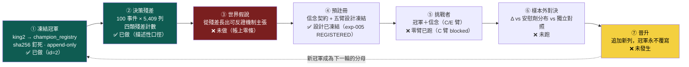
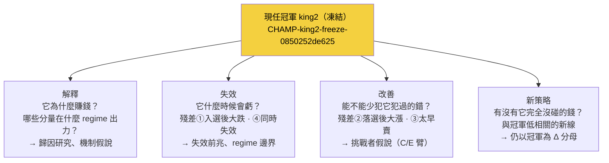

# 現任冠軍制度：凍結 king2，讓所有研究繞著真決策轉

> **【冠軍身分對帳 2026-07-24】** 本頁的「king2」精確指 `STR_king2_deploy`（自動真錢線現任：下單 5577＋儀表板 7795 都跑它）。owner 手上另有**王牌本尊 `STR_king1`**（血統祖先，純 REVYOY 條件選股，手動路徑引用），已另冊凍結 `CHAMP-king1-original`（lineage `king1-line`）——兩條策略共用同一台時間狀態機（S_IND 領先股感測器／5日冷卻／月營收錨凍結／前5日先出），**AARO 鏡像只忠實 king2_deploy 的選股層、持有層簡化**。全部證據與六項 dormant code 稽核見 [[champion-identity]]。

這一頁承載 owner **第三輪批評**（2026-07-22）的核心修正。前兩輪把「演化什麼」（世界模型不是策略）與「怎麼分開裁決」（三迴圈）修對了，但整份 wiki 的主線仍然**斷成兩段**：一段是 owner 手上真的在賺錢的最強策略 king2（活在王牌真錢線，wiki 幾乎不談它）；另一段是信念契約支線（[[exp-004-belief-contract|實驗 004]] 拿 MIEE 事件假說跑通了到期對帳——但那兩條信念跟任何真實決策都沒有關係）。兩段各自成立、互不相接。**修法＝建立「現任冠軍」制度：把 king2 凍結成研究帳上的冠軍基準，讓每一個研究問題從冠軍的決策殘差長出來、每一個挑戰者以冠軍為分母對決、晉升只以追加新列發生——冠軍永不覆寫。**

> **認知答案**：一個活的研究系統需要一個「現任冠軍」——當前已知最好、被凍結、不可被悄悄改動的決策政策——因為只有對照冠軍，「更好」才有明確定義（Δ＝挑戰者 − 冠軍），研究問題才有天然的決策相關性（冠軍上次真實決策錯在哪，就是最值得研究的未知）。
>
> **行動答案**：主線＝**凍結冠軍 → 決策殘差 → 世界假說 → 預註冊 → 挑戰者 → 樣本外對決 → 晉升**。目前真的完成的是前兩步加預註冊（凍結列 `champion_registry` id=2、殘差資料集 5,409 列、[[exp-005-king2-prereg|實驗 005]] 五臂預註冊）；假說尚未從殘差長出、零個挑戰臂跑過、零次對決、零次晉升。**不要把本頁讀成「世界信念已經改善了 king2」——那一步一次都還沒發生。**

## 一、為什麼需要「現任冠軍」：把兩段敘事接回一條主線

前兩輪重構後的系統有一個沒被說破的尷尬：**它研究的東西跟 owner 真正下注的東西無關。** 信念契約結算的是 MIEE 漲價事件假說（B-H-001／B-H-003），而 owner 的真錢跑的是 king2——一條月頻營收動能策略。就算認知迴圈把一百條事件信念結算得再漂亮，只要沒有一條接到「king2 該不該改、怎麼改」，研究就只是在旁邊自轉。

「現任冠軍」制度一次解決三個問題：

- **「更好」有了定義。** 沒有冠軍，任何新策略的好壞只能對抽象基準（大盤、隨機）比；有了凍結冠軍，一切增量都是 Δ＝挑戰者 − 冠軍，同資料、同成本口徑、同窗。
- **研究問題有了天然的決策相關性。** [[hypothesis-engine|假說引擎]] 第二輪用 ResearchValue 的 DecisionRelevance 項防「研究不改變任何決策的問題」——但那一項是引擎自估的，可以吹。冠軍殘差不用估：**每一列殘差都是一筆真的虧掉或漏掉的錢**。「2609 陽明在候選池排 43 落選、隨後三週漲 133%」這個問題的決策相關性不需要任何人打分。
- **改進不會汙染基準。** 冠軍凍結且 append-only，挑戰者贏了也只能「追加新列」成為新冠軍，舊冠軍列永遠留著當歷史分母——不存在「悄悄改一個參數、回頭聲稱一直都這樣」的路。

## 二、冠軍是誰：king2 的精確規則（研究鏡像口徑）

冠軍不是一個名字，是一份逐字規則。真相源＝`/media/liao/MyHDD/舊機遷移資料/recursive_temporal_cognitive_grid/finlab_usage_guide/s994_str_enhanced.py`（`STR_king2` 於 line 49、`STR_king2_deploy` 於 line 171），且 `king2_deploy ≡ STR_king2(adv_floor=0.3, top_k=12, harden_gates=True)`。骨架如下（逐字條文已全文存入凍結列的 `rule_spec_json`）：

| 部件 | 內容 | 備註 |
|---|---|---|
| 分數（傾斜非過濾） | `score = 0.65 × rev + 0.35 × tilt` | rev＝月營收去年同月增減%的橫斷面百分位（`RK`＝`rank(axis=1, pct=True)`） |
| tilt 傾斜 | `(指紋 + 籌碼) / 2` | 2017 前集保缺資料時各分量 `.fillna(0.5)` 自動中性 |
| 指紋（5 分量等權） | 低券資比、低 60 日波動、120 日區間位置高、5 日均線偏離、5−20 日動能差 | `C_MI_MX_C(df,w) = (df−rolling_min)/(rolling_max−df+1e-10)`（區間位置比）；用**未還原收盤價**（只有 regime 覆蓋層用 `etl:adj_close`） |
| 籌碼（4 分量等權） | 集保結構：散戶佔比（<10 張、<5 張）下降、大戶（>1000 張）佔比上升 | 週頻集保 ffill 到日頻 |
| 品質/動能四閘（AND） | b1＝(ROE＋營益率＋淨利率百分位)/3 > 0.3（皆 `.deadline()` 防前視）；b2＝200 日區間位置門檻；b3/b4 逐字條文見真相源 | **除壞不選好**：閘只剔除，不加分 |
| 組合 | 過閘者按 score 取 top-12，月頻換股錨，`pre_days=5` 以碼為準 | 成本口徑（S_IND/RP）逐字入 `rule_spec_json` |

績效快照（**照抄官方口徑含出處，本管線尚未復算**，不可當本管線驗證數字）：king2 全史 Sharpe 2.843／CAGR 87.8%／Calmar 3.51／MDD −25.0%（s994 檔頭）；king2_deploy 現況全期 Sharpe 2.71／CAGR 81.4%／Calmar 3.48／MDD −23.4%（docstring 2026-07 對帳）；另有一組早期研究期＋f1.5 槓桿的 104%／5.74／−18.2，凍結列裡已明標「**勿當現況**」。

## 三、凍結怎麼做：champion_registry，冠軍永不覆寫

凍結不是「複製一份檔案」，是把冠軍的**身份**做成可重算的內容雜湊，釘進 append-only 帳：

- **表**：`data/aaro.sqlite` 的 `champion_registry`，append-only 觸發器鎖 UPDATE／DELETE（**實打過**，不是宣稱）。
- **凍結列**（id=2）：lineage＝`king2-freeze`、champ_id＝`CHAMP-king2-freeze-0850252de625`——這串 id **就是內容雜湊**（name＋version＋四檔 sha256＋規則全文，重算相等）；name＝「凍結版 king2（研究鏡像凍結・殘差資料集基準）」、version＝`deploy`、data_cutoff＝2026-07-22（finlab_db `price:收盤價` 末日）、frozen_at＝2026-07-22 22:33:29。
- **來源檔 sha256**：`s994_str_enhanced.py`＝`3b3bffd0c93e666b…`、`s0_basedata.py`＝`a401d8dc1eb32901…`、`s993_str_for_import.py`＝`01e9d2e91373c2a8…`、`DEPLOYMENT_SPEC.md`＝`fc81e60d2f077963…`。
- **冠軍永不覆寫**：晉升唯一的寫入方式是**追加新列**。任何人（包括引擎自己）都不能改動 id=2 那一列——想換冠軍，就得留下一列新的、帶自己內容雜湊的登記，歷史分母永遠可回查。

**誠實標記，不得省略：這是「研究帳上的冠軍鏡像」，不是真錢線本體。** 王牌真錢線（king-deploy 堆疊）對本研究帳**唯讀**——研究這邊凍結、殘差、對決、晉升，全部只發生在研究帳；真錢線一個位元都不動，晉升結論要進真錢永遠要過 owner 人核與 CA 閘。研究鏡像與真錢線之間已知的 **9 條鏡像差異**逐條記錄在 `engine/out/king2_residuals.json`——鏡像復算與官方口徑數字對不齊時，先查那 9 條，不要急著懷疑哪邊造假。

## 四、五角色：冠軍對決的完整棋盤

owner 給的制度不是「冠軍 vs 挑戰者」兩個角色，是五個——因為「挑戰者贏了」這句話要成立，得先排除兩種假贏（搜尋偏誤、複雜度紅利）：

| 角色 | 定義 | 存在的理由 | 對應 [[exp-005-king2-prereg]] 的臂 |
|---|---|---|---|
| **champion 現任冠軍** | 凍結版 king2，sha256 釘死、永不覆寫 | 一切 Δ 的分母；沒有它，「更好」無定義 | A 臂（本管線復算 Dev＋Val） |
| **placebo 安慰劑** | 冠軍＋**隨機內容**的假信念（同介面，seed 0..19 成分布） | 量出「隨便加一條信念也能碰運氣贏多少」的**搜尋偏誤地板**——挑戰者至少要贏過這個分布的 95 百分位 | B 臂 |
| **belief_augmented 信念增強** | 冠軍＋**已確認**（confirmed）的世界信念 | 主挑戰者：檢驗「世界知識」到底有沒有增量 | C 臂（目前 **blocked**：帳上零條 confirmed） |
| **independent 獨立對照** | 冠軍＋同等複雜度的**純價量**條件 | 歸因對照：把「世界知識的功勞」跟「多加一個濾網的功勞」拆開 | D 臂 |
| **challenger 挑戰者** | 有晉升資格的候選（本輪限 C／E 臂；E＝信念只控曝險/退出、不改選股，名單與 A 逐日相同） | 晉升門檻的受試者：連過五道門才能追加新列成為新冠軍 | C／E 臂 |

## 五、研究問題從冠軍長出：四條分支

有了冠軍，「今天研究什麼」不再從抽象的「最大未知」出發，而是從冠軍身上長出四條具體分支：

四條分支的優先序不是拍腦袋：**改善與失效兩支直接踩在殘差資料上**（每列都是真錢的錯），先走；解釋是它們的地基（不懂為什麼賺，就不知道哪些錯是本質的）；新策略最後（它連分母都還要借冠軍的）。這就是 [[hypothesis-engine|假說引擎]] 第三版「殘差優先、ResearchValue 退為補充」的制度來源。

## 六、殘差四格：冠軍真實決策的錯，逐列入帳

殘差＝把凍結冠軍在歷史上每一次月頻換股決策攤開，對照事後真實報酬（超額＝對加權報酬指數同窗），問四個問題。真實計數（**100 個換股事件、5,409 樣本列、候選池中位 51.5 檔、入選 1,200 列**；逐列資料集＝`engine/out/king2_residuals_dataset.parquet`，明細與 top-5 案例＝`king2_residuals.json`）：

| 殘差類 | 定義（描述性分位口徑） | 計數 | 最重具名案例 |
|---|---|---|---|
| **① 入選後大跌**（假陽性） | 入選列超額低於入選組 p10（−9.36%） | 120 列 | 3147 於 2026-06-10 以池內第 3 名入選，06-11→07-08 跌 −28.9%、超額 −35.5% |
| **② 落選後大漲**（漏網） | 候選池落選列超額高於 p90（+16.65%） | 362 列 | 2609 陽明 2020-12-10 在候選池排 43 落選（score 0.649 不進 top-12），12-11→01-05 漲 +133.6%、超額 +128.2%（航運超級週期） |
| **③ 選對但太早賣** | 入選且獲利出清後、至下輪進場前再漲超過 p75（+2.65%） | 300 列 | 1785 光洋科 2026-03-10 入選（池排 4），持有窗賺 +12.5%，出清後至下輪進場又漲 +41.4% |
| **④ 同時失效** | 單一事件的入選股**過半**負超額 | 25／100 事件（共 300 入選列） | — |

對應 [[exp-005-king2-prereg|實驗 005]] 預註冊的「殘差四格（選中×漲跌）」：長假說的來源限定在**做錯決策的兩格**——假陽性（選中且跌＝①）與漏網（沒選且漲＝②）；③屬持有層（接 [[fw-holding-lifecycle|持有期生命週期]] 的地盤）、④屬 regime 層。

一個已經浮出的機制線索（描述性，不是結論）：100 事件中 26 個發生在弱盤（0050<MA50），但 25 個「同時失效」事件裡**只有 2 個在弱盤**——集體失效多發生在**盤面健康時**。這說明弱盤風險已被 regime 覆蓋層另行減碼擋掉，**殘差集中在健康盤的選股本身**——這正是值得長出第一條世界假說的地方。

## 七、誠實邊界（不得省略）

- **主線七步只完成①②④三步。** 假說尚未從殘差長出（帳上零條）、C 臂 blocked（零條 confirmed 信念）、零個挑戰臂跑過、零次對決、零次晉升。本頁描述的是**制度**與**已凍結的地基**，不是已運轉的閉環。
- **殘差分類是描述性分位口徑，不是因果判定。** p10／p90／p75 門檻是入選組與候選池的經驗分位——移動門檻，計數就變。「120 列入選後大跌」讀作「有 120 個值得研究的錯」，不能讀作「king2 有 120 個 bug」。
- **績效快照是照抄，不是復算。** 三組官方口徑數字連出處抄進凍結列，本管線的 A 臂 Dev＋Val 復算尚未跑；復算對不齊時要先對那 9 條鏡像差異。
- **同一冠軍有兩個登記名。** 預註冊文件以 `CHAMP-king2-v1` 釘冠軍、凍結列（id=2）champ_id＝`CHAMP-king2-freeze-0850252de625`，兩者指向同一組來源檔 sha256（`3b3bffd0…`／`a401d8dc…`）。一個是人讀版本名、一個是內容雜湊——這條命名縫應該收斂成一條對照紀錄，目前尚未收斂，先明講。
- **研究帳的冠軍是鏡像，真錢線唯讀。** 本頁任何動詞（凍結、對決、晉升）都只發生在研究帳；王牌真錢線不因本制度自動改變任何一分部位。

延伸：五臂設計、晉升五道門與 blocked 誠實原因見 [[exp-005-king2-prereg|實驗 005]]；殘差怎麼變成研究問題見 [[hypothesis-engine|假說引擎]]；冠軍挑戰環怎麼疊在 W/O/B/P 主軸上見 [[research-loop|研究迴圈]]；信念的預註冊與到期對帳機件（本制度的④⑥兩步所依賴）見 [[world-belief-contract|信念契約]] 與 [[exp-004-belief-contract|實驗 004]]；三迴圈各自的裁判見 [[three-loops|三個迴圈]]。

## 附註一：冠軍登記帳的兩列（誠實正名）

2026-07-22 當日兩條平行工作線各自向 `champion_registry` 註冊了一列凍結 king2（append-only 不刪不改，照實留）：`CHAMP-king2-v1`（實驗 005 預註冊所引用的正名列）與 `CHAMP-king2-freeze-0850…`（殘差資料集的基準列，rule_spec 較完整）。兩列釘的是**同一組來源檔 sha256**（核心規則檔逐位相同），凍結物一致、無矛盾；日後引用以 `CHAMP-king2-v1` 為冠軍正名、freeze 列為殘差基準紀錄。

## 附註二：冠軍選對公司之後——載具層

冠軍制度回答「要不要看多這家公司」；選對之後「用什麼報酬形狀表達」是另一層決策，見 [[instrument-router|載具路由器]]（股票／權證／CB／CBAS 的路由原則）與 [[exp-006-cb-router-prereg|實驗 006]]（CB 載具路由第一實驗，構想級）。
