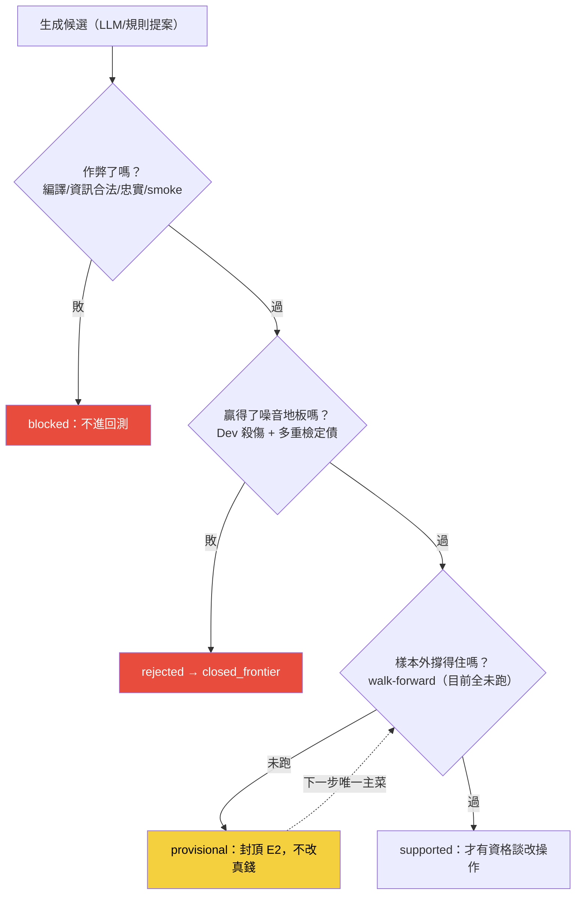

# 誠實紀律：一台有權拒絕相信自己的引擎

自動化研究最大的失敗模式不是「找不到 Alpha」，是「一直生子代，總能找到漂亮結果，然後相信它」。這一頁把整套用來對抗這件事的紀律攤開——它們不是口號，每一條都對應到具體的程式閘、帳本結構或考卷斷言。核心信條一句話：

> 系統必須有權拒絕自己的改進，否則是變異累積、不是進化。

最能說明這件事的，是引擎生成過一個 CAGR 33% 的候選（[實驗 001](exp-001-candidate-c.md)），然後親手把它拆成 `conflicting`、判定那 33% 幾乎全是動能 beta 相加（[實驗 002](exp-002-ablation.md)）。**生成一個看起來像 Alpha 的東西、同時拒絕相信它——這才是它該做的事。**

這張圖的重點是那個黃色的 `provisional`：**目前所有四輪實驗都停在這裡**，因為 walk-forward 一輪都還沒跑。這不是卡關，是紀律——沒過樣本外門，就沒資格宣稱有用。

## 一、拒絕相信自己：生成 ≠ 相信

引擎把「生成一條策略」和「相信一條策略」徹底分開。生成很便宜（構造基因、過閘、入帳），相信很貴（要過樣本外門與歸因門）。所以每份漂亮結果交付時，報告的主體不是那個數字，而是**替你先做好的懷疑**——[實驗 001](exp-001-candidate-c.md) 的 C 一交付就掛三張警告：越嚴越好是動能指紋、MDD 脆弱、籃子半重構但訊號平均效果微弱。這不是事後找碴，是框架內建的動作。

## 二、provisional 封頂：證據級不能跳級

裁決詞彙只有四種，且**由門推出、不由語感推出**：

- `supported`：主張、否證、樣本外、增量與部署同形測試都支持。
- `provisional`：方向有證據，但缺 Vault、前瞻、容量或其他必要關卡。
- `rejected`：主要宣稱被否決、輸給基準或無法重現。
- `blocked`：資料、可知時間、樣本數或環境不足，尚不能判勝負。

配套的是證據級 **E0–E4**（見 [框架：研究雙語與認知編譯器](fw-research-bilingual.md)）：沒回測是 E0，樣本內是 E1，全樣本重複支持是 E2，樣本外確認才 E3。四輪實驗全部封頂 **E2**——因為它們都是「看過全部歷史」的全樣本描述性對照，沒有一段是留出來、事後才碰的樣本外。任何報告只要提到績效數字，就必須帶「全樣本、E2、本口徑」三個限定詞，量值不可跨口徑引用。

## 三、負結果同權入帳：只存成功者的圖會反覆踩坑

`closed_frontier`（封閉前沿）、`fails_under`、`reduces_capacity` 與正向知識**同等入圖**。負向與不確定關係是 LLM 生成下一代時的「完整代價表」；只存正向的圖會讓系統反覆踩同樣的坑。[實驗 003](exp-003-graph-evolution.md) 裡，迴圈的 gen1（改用「250 日高位持續性」機制）回測輸給父代，就被否決並寫進 `closed_frontier` 不再重試——這是負結果入帳的正面示範。

但這裡有一個**誠實的張力，我們不掩蓋**：實驗 003 為了不讓「越追越深的動能世代」污染只增不改的正典帳，把整批三代（含 gen1 這個負結果）外科回滾了。理想上 gen1 該永久留，本輪它隨批回滾（雖有暫存證據副本）——這是負結果入帳鐵律的一次不乾淨執行，已在該實驗第 5 節標明，也列進 [給 LLM 評審：請攻擊這些接縫](for-llm-review.md) 請你檢視。

## 四、圖是帳的投影，不是第二真相源

這是圖記憶層最重要的設計判斷（見 [知識圖譜：四張圖](graph-knowledge.md)）。四張圖全部是 append-only 帳之上的衍生視圖或可重推表：**DROP 掉全部圖表、從帳重推，必須逐位元一致**（考卷斷言）。每一條邊必須能指回帳裡的證據列，**沒有證據列的邊不准存在**。這條紀律擋掉一個典型陷阱——「用想像的邊餵傳播，比沒有邊還毒」。LLM 可以提案邊與超邊，但提案只進候選佇列，成邊要嘛靠純碼從帳投影、要嘛靠實驗證據落地後自動成立。

## 五、LLM 只提案，純碼裁決

貫穿全系統的權力邊界：**評分器唯一，且不可被進化對象自改**。LLM 在整條流水線裡只出現在兩個地方——歸因判不出來時提案解讀、圖提案下一個該測哪組（Hyperedge Completion）；輸出一律是結構化 spec 片段，過驗證器，非法即拒。所有評分與裁決是**零 LLM 純碼**。[實驗 002](exp-002-ablation.md) 的 `conflicting` 就是純碼判的：synergy CAGR 只 +0.74pp（勉強過噪音門檻）、synergy Sharpe −0.12（負），兩指標方向相反 → 判 conflicting。獨立重算員特別確認：運轉手**沒有**把「相加」凹成「綜效」。

## 六、薄縱切優先：先打通一條最小鏈，不先擴建任何單層

上位方向裁決的第一鐵律：任何語言層的橫向擴建（批量擴詞、新資料源、新層、新服務）之前，必須先存在一條走完「真實事件源 → 可投資假說 → PIT 特徵 → 負對照 → 持有規則 → 報告 → 一次紙上決策」的**薄型垂直鏈**。P0 選的薄縱切是持有期退出時點（[實驗 000](exp-000-engine-first-run.md)），因為它最接近真實資金決策：有真策略、真入選日、真持有名單、真股價、真換股規則。**架構先於價值驗證（architecture-first）是被點名的致命盲點**——四層同時建成，日後研究失敗就無法歸因到哪一層。

## 七、三效度閘：別把「能跑」當「有效」

對語言棧的任何「有效」宣稱，必須標明效度種類：

- **結構效度／執行效度**（考卷全綠、服務活著）＝已證明，但**不得冒充**下面三者。
- **判別效度**：不同未來結果的案例，事前能否區分？
- **增量效度**：加入某層（如世界訊號）是否勝過只用價格／營收／產業基準？
- **決策效度**：照狀態行動是否改善淨報酬／回撤／資金效率？

只有後三者算研究價值，而目前**三者皆零**。這條擋住一個陰險的錯誤：一個錯誤的經濟模型，也可以百分之百確定性地、穩定可重現地輸出錯誤結論——**把確定性當有效性**是被點名的高危盲點。

## 八、證據歸屬分離：語言棧的功勞只能用 A/B 記帳

「凍結判準、負對照、負結果入帳」是一般研究紀律，不需要語言棧也做得到。所以語言棧不能把「大波段線的紀律成功」記到自己頭上。它唯一合法的功勞簿＝**同一研究問題的 A/B 對照**（舊流程 vs 棧流程），逐案記錄七項：可執行率／通過第一輪比率／樣本外通過率／被資料洩漏淘汰的比率／平均研究工時／owner 人工介入次數／結論在新資料加入後翻轉次數。這也解釋為什麼即使策略沒改善，若治理效率有可量化增量，該層仍可能保留。

## 九、其他貫穿性紅線（濃縮）

- **事件樣本紅線**：任何回測資料集一列＝一次決策事件，不是一天；日頻資料只服務持有狀態觀察，不得偷改成日頻選股（[方法：策略基因（StrategySpec 九部件）](method-strategy-spec.md)）。
- **雙視角隔離**：Point-in-Time 視圖與事後視圖分開儲存，**禁止把事後資訊回寫成當時理由**；報告與敘事卡必分欄呈現。
- **反捏造錨點**：每個新聞事件宣稱必附錨點引文，引文必須是原文逐字子字串且 ≥8 字，違者整顆丟審查佇列（[框架：質化引擎（新聞→世界模型→特徵→Alpha工廠）](fw-qual-engine.md)）。
- **四時分離**：valid／event／known／system 四種時間不得混用；任何特徵引用資料必過「known_time ≤ decision_cutoff」檢查——混淆任一即未來函數（[框架：時間層（時態邏輯節點）](fw-temporal.md)）。
- **交互超邊要消融**：無單獨／組合對照實驗不得立綜效邊，判準凍結、純碼判定（[超圖：策略基因超邊與交互超邊](graph-hypergraph.md)）。
- **真錢永不自動**：自動迴圈 PASS 上限 shadow、production 人按、真錢永不自動。

## 十、總體 kill criteria：語言棧自己也要可反證

紀律的最上層，是連「這整套語言棧值不值得存在」都設了出口。在**累計 3 條真實研究線、至少 100 筆真案例**之後，若相較舊流程未能達成以下**任一**項，就暫停一切擴建、拆除沒有增量的層：

- 假錯誤提早發現率提升；
- owner 審查時間降低三成（三成為 owner 給定值，其餘門檻待 A/B 記帳跑出基準值後補上，依「不虛構門檻」紅線先記口徑不填數）；
- 可重現研究比例提高；
- 樣本外通過率提高；
- 從假說到裁決的時間縮短。

局部失效照各專案失效表修補，但**修補不得無限迴圈替代整體裁決**——「詞彙不足就擴詞、抽取不好就修抽取」這種無限修補、卻沒有「整體假說失敗」的出口，是被點名的中危盲點。圖層若只是好看、沒改變下一代提案品質，一樣拆。

想知道這些紀律最容易在哪裡被鑽漏、哪些接縫最值得攻擊，接著讀 [給 LLM 評審：請攻擊這些接縫](for-llm-review.md)。

---

**被連結自（反向連結）：** [實驗 003：圖驅動自主進化三代](exp-003-graph-evolution.md) · [實驗索引：每一輪真跑，逐環節攤開](exp-index.md) · [整體架構與資料流](architecture.md) · [方法：進化迴圈（圖提案→變異→裁決→回流）](method-evolution-loop.md) · [框架：世界訊號](fw-world-signal.md) · [框架：時間層（時態邏輯節點）](fw-temporal.md) · [框架：特徵代數](fw-feature-algebra.md) · [框架：研究雙語與認知編譯器](fw-research-bilingual.md) · [框架：質化引擎（新聞→世界模型→特徵→Alpha工廠）](fw-qual-engine.md) · [知識圖譜：四張圖](graph-knowledge.md) · [給 LLM 評審：請攻擊這些接縫](for-llm-review.md) · [總覽：從一個念頭到一台會拒絕相信自己的引擎](overview.md) · [詞彙表](glossary.md) · [質化結構組成語言（總覽）](lang-qual.md) · [超圖：策略基因超邊與交互超邊](graph-hypergraph.md) · [量化結構組成語言（總覽）](lang-quant.md) · [首頁：Alpha 進化迴圈研究 Wiki](index.md)
