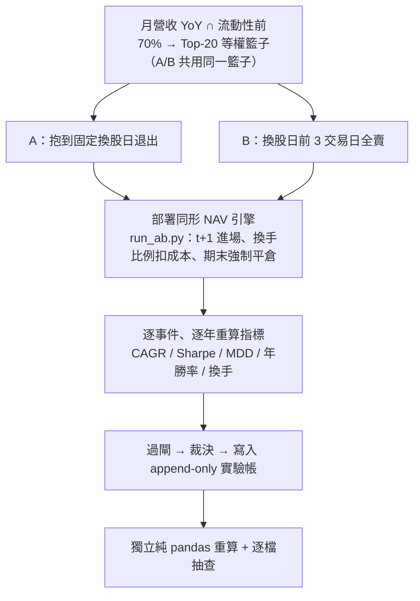

# 實驗 000：引擎首輪 A/B 退出時點

這是進化引擎的**第一次真跑一整輪**，也是後面所有實驗的地基。它做的事其實很小：把你現行的月營收策略正式寫成「創世基因」入帳，然後只改一個部件——退出時點——生出一個子代，比較「抱到固定換股日（A）」和「提前三個交易日賣（B）」。結論是 B 勝，但**只到「方向」為止**。真正的成果不是那 8 個百分點，而是證明了 [整條迴路](architecture.md)（規格→驗證→查重→編譯→對照→入帳→圖投影）端到端真的能走完，而且走完後帳是自洽的。

> 資料截止 2026-07-22｜回測 2015-01→2026-06，138 個換股事件｜裁決 provisional（E2）｜真相源＝`報告_引擎首輪運轉_20260722.md`

## 假說

**「月營收 Top-20 策略，在每次換股前提前三個交易日全賣出，長期績效會勝過抱到固定換股日。」**

這不是憑空的公式，是 owner 多年的經驗法則——本輪第一次把這個經驗放上可稽核的天平。假說屬於 [StrategySpec](method-strategy-spec.md) 分類裡的 **timing（時點）主張**：不改買什麼，只改什麼時候賣。

## 取用哪些部件、從哪裡來

單變因實驗的關鍵是「只有一個部件不同」。本輪動用的部件與來源：

| 部件 | 這輪的內容 | 語言／來源框架 |
|---|---|---|
| selection_policy（選股） | 月營收 YoY 排序取 Top-20、等權；池＝月營收可得 ∩ 20日均額前 70% | [框架：特徵代數](fw-feature-algebra.md) 承載，兩檔共用、完全相同 |
| holding_policy（持有／退出） | **唯一變因**：A＝抱到換股日；B＝提前 3 個交易日全賣 | [框架：持有期生命週期](fw-holding-lifecycle.md) 的退出動作 |
| execution_policy（執行） | trade_at=close、公告錨日 t+1 進場、換手比例扣成本 | AARO evaluator 契約 |
| lineage（血統） | B 的父代＝A，MOVE＝改 holding_policy | [方法：進化迴圈（圖提案→變異→裁決→回流）](method-evolution-loop.md) generation log |

其餘七個部件 A 與 B 逐字相同——這正是 diff 閘要保證的：聲稱只改退出，就真的只有退出變。取用規則的細節見 [部件從哪取用](method-components.md)。

## 怎麼組成

兩檔策略被構造成兩份不可變的 [StrategySpec](method-strategy-spec.md)：

- **A（創世基因 genesis）**：`spec_id=d5899cced7a49652`、`genome=f80773fabebcdadc`。
- **B（子代）**：`spec_id=d59b18dc7c96d348`、`parent=A`、`genome=8506920f3d6a6a54`。

因為 selection_policy 相同，A 和 B 每個月買的是**完全相同的 20 檔籃子**，差別只在晚三天還是早三天離場。所以任何績效差異，全部來自「持有期最後三個交易日」的報酬——這是一個乾淨的單變因實驗。

## 演算步驟

逐步展開：①月初凍結籃子（PIT：只用當時可知的營收與流動性）；②A/B 各自套用退出規則；③丟進部署同形淨值引擎 `engine/run_ab.py`——不是用 IC 當替身，而是真的跑完整月頻選股＋日頻持有＋t+1 執行，成本＝手續費 0.1425%×0.3 折買賣各計＋賣出證交稅 0.3%；④跑完 2015→2026 共 138 個換股事件；⑤逐年、逐事件算出指標；⑥過閘、裁決、入帳。

## 過了哪些閘

依 [證據閘](method-gates.md)，本輪是實驗運轉型，決策門通過情形：

| 決策門 | 通過條件 | 本輪 |
|---|---|---|
| 帳務門 | 淨值經獨立重算一致 | ✅ 過（誤差 ≤1e-14） |
| 複現門 | 選股與退出可由另一人獨立重現 | ✅ 過（兩事件日 20/20 逐檔命中） |
| 互證門 | 與獨立管線方向一致 | ◐ **部分過**（CAGR/Sharpe 過；MDD 方向相反） |
| 樣本外門 | walk-forward／IS-OOS 裁決 | ❌ **未過**（未跑） |
| 實戰門 | 紙上前瞻→人核 | ❌ 未過（依權力表永不自動） |

編譯閘、行為 smoke 閘（觸發率、換手、持股數、交易日差為 3）、部署同形閘皆通過；六筆閘結果（compile/smoke/deploy_shape × A,B）入帳，全 pass。**注意**：閘 pass 只代表「閘已執行」，不代表策略優劣裁決——這句話明文寫進了 `deploy_shape.metrics_json.note`。

## 結果

期間 2015-01→2026-06，138 事件，等權 Top-20：

| 指標 | A 固定換股日 | B 提前三天 | Δ(B−A) | 能用來做什麼 |
|---|---|---|---|---|
| 年化報酬 CAGR | 12.25% | 20.22% | **+7.97pp** | 只證明本口徑方向；量值不可引用 |
| Sharpe | 0.664 | 1.083 | **+0.42** | 同上 |
| 最大回撤 MDD | −35.7% | −30.1% | B 淺 5.6pp | **不可引用**——Q1 管線方向相反 |
| 年度勝率 | 8/12 | 10/12 | +2 年 | B 輸掉 2022 等 2 年，非每年必勝 |
| 年換手（單邊） | 6.5 | 11.5 | +5.0 | B 每月全清全買，多付約 2pp/年仍勝出 |

機制上，B 的優勢**不是省成本省出來的**（它成本更重），而是避開了「換股尾端虧損」——[持有期研究線](fw-holding-lifecycle.md)（Q1）已定位這段尾端負報酬集中在換股日當天、且集中在新營收轉弱的股票。

**代表案例（含反例）**：2022-10 事件——10-10 公告錨、10-11 買進 20 檔，A 抱到 11-11、B 在 11-08 出場（驗證員確認是交易日差非日曆日差）。但 2022 全年 B 反而**輸**（−13.3% vs A 的 −11.1%）：空頭年提前出場再全額買回，成本與時點都不利。「提前三天」贏在長期平均，不是每年都對。

## 裁決

**provisional（E2）、不改真錢、不改現行操作。** 由五道門直接推出：帳務與複現過、互證部分過、樣本外未過。演化邊（A→B）記 `verdict=provisional`、`changed_component=holding_policy`。

決策階梯目前位置：帳務正確 → 規則可重現 → **方向互證（部分）← 在這裡** → 樣本外裁決 → 紙上前瞻 → 改變操作。

## 獨立驗證（可由另一人複核）

- **數字獨立重算員**：用完全獨立的純 pandas 腳本（零 import 本引擎計算函式）全期重算，誤差 ≤1e-14；兩個事件日逐檔抽查 20/20 命中。PASS（3 個 minor：換手彙總捨入 2.6e-6、MDD 翻向未列入 gaps 已補、公告錨順延措辭）。
- **帳面紅線複核員**：以引擎規格重算兩個基因雜湊、演化邊六維差異全部命中。PASS。
- **第二條管線互證**：五天前的 [持有期研究線](fw-holding-lifecycle.md) 用 finlab 官方套件跑同題——A 年化 7.43%/Sharpe 0.3975、B 8.60%/0.4923，**方向一致**（B 的 CAGR 與 Sharpe 都較高）。但量值差 7 倍（Δ +1.17pp vs 本輪 +7.97pp，口徑不同：本輪多了流動性前 70% 過濾、成本計法不同）；MDD 方向相反（Q1 版 B 較深 −45.44% vs A −43.39%）。

重現指令：`cd /media/liao/MyHDD/FOR_AGENT/aaro && /home/liao/finlab_env/bin/python -m engine.run_ab`。

## 誠實邊界（不得省略）

- **無樣本外**：所有數字都「看過全部歷史」，證據級封頂 E2。這是還不能行動的根本原因。
- **量值不可引用**：兩管線量值差 7 倍、MDD 方向相反——只有「提前三天方向為正」互證成立。流動性過濾可能就是量值差主因，值得單獨立案。
- **只測了 0 與 3 天**：沒證明「三天」是最優天數。owner 原設計的 0/1/2/3/4/5 日掃描尚未跑。
- **預註冊不完整**：本輪只有世代宣告，帳內無凍結雜湊（`contract_hash` 空）——描述性對照不越線，但下輪要升級語氣必須先凍結判準。
- **敘事層尚早**：[質化引擎](fw-qual-engine.md)同輪為最新籃子出卡，20 檔只有 1 檔（南亞科）有內容，其餘 19 檔誠實顯示「尚無邊」——上游新聞真歷史只有 15 天，這是現實不是故障。

下一輪唯一主菜：先凍結判準，再跑 walk-forward 版 A/B——過了才有資格談改退出規則。這條線的接續是 [實驗 001](exp-001-candidate-c.md)（改選股）。攻擊接縫收在 [給 LLM 評審](for-llm-review.md)。

---

**被連結自（反向連結）：** [實驗 001：生成候選 C（月營收 × 價格強勢）](exp-001-candidate-c.md) · [實驗 002：交互超邊消融](exp-002-ablation.md) · [實驗 004：世界信念契約首度到期對帳](exp-004-belief-contract.md) · [實驗索引：每一輪真跑，逐環節攤開](exp-index.md) · [方法論：誠實紀律（拒絕相信自己）](discipline.md) · [方法：證據閘（十道關卡）](method-gates.md) · [方法：部件從哪取用、怎麼啟用](method-components.md) · [框架：持有期生命週期](fw-holding-lifecycle.md) · [框架：時間層（時態邏輯節點）](fw-temporal.md) · [框架：研究雙語與認知編譯器](fw-research-bilingual.md) · [框架：質化引擎（新聞→世界模型→特徵→Alpha工廠）](fw-qual-engine.md) · [演化的目標：一個目標函數量不了三種東西](objective.md) · [給 LLM 評審：請攻擊這些接縫](for-llm-review.md) · [總覽：真正該演化的不是策略，是世界模型](overview.md) · [質化結構組成語言（總覽）](lang-qual.md) · [量化結構組成語言（總覽）](lang-quant.md) · [首頁：Alpha 進化迴圈研究 Wiki](index.md)
