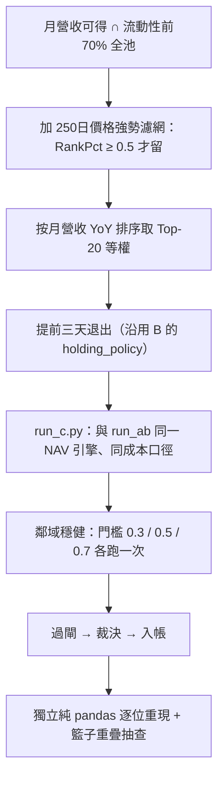

# 實驗 001：生成候選 C（月營收 × 價格強勢）

這是「用框架生成一條策略」的第一個實例。生成的不是憑空寫的公式，是 owner 對話裡的第一個念頭——月營收成長選股，先用 250 日價格強勢過濾。框架把它構造成一條基因（候選 C＝[實驗 000](exp-000-engine-first-run.md) 的最佳策略 B 再加一層價格強勢濾網），過完全套閘、兩路獨立驗證，全部通過。結果**驚人地好**：年化 33.2%、Sharpe 1.52。但這一頁真正的價值不是那個 33%，是**框架當場給這個漂亮結果掛了三張警告標籤**——引擎生成了一個看起來像 Alpha 的東西，同時拒絕相信它。

> 資料截止 2026-07-22｜回測 2015-01→2026-06，138 事件｜裁決 provisional（E2）｜真相源＝`報告_生成策略C_月營收價格強勢_20260722.md`

## 假說

**「在一份本來就高月營收成長的名單裡，先剔掉『價格不強』的個股（250 日 range-position 橫斷面排名、強在前），選股會更好。」**

用 [世界訊號](fw-world-signal.md) 的語言讀，這個假說偏向「**預期差尚未耗盡**（expectation_gap）」——市場還沒把營收訊號完全定價，價格強勢是再評價仍在進行的確認；而不是「買在已定價高點（already_priced）」。假說屬 [StrategySpec](method-strategy-spec.md) 分類的 **filter／ranking（選股）主張**。

## 取用哪些部件、從哪裡來

延續 [實驗 000](exp-000-engine-first-run.md) 的 B，只改一個部件：

| 部件 | 這輪的內容 | 語言／來源框架 |
|---|---|---|
| holding_policy | 沿用 B：提前三天退出（不變） | [框架：持有期生命週期](fw-holding-lifecycle.md) |
| selection_policy（選股） | **唯一變因**：在月營收 Top-20 之上，先加 250 日價格強勢濾網（門檻 0.5） | [框架：特徵代數](fw-feature-algebra.md) 的可執行結構地址 |
| 新特徵成員 | 250 日價格強勢＝`RankPct(MinMaxScale(close, RollMin(close,250), RollMax(close,250)))`，`GEc(·, 0.5)`，輸出 bool | [框架：特徵代數](fw-feature-algebra.md)，`fid=2c2ad96b2d0b` |

價格強勢的完整結構地址（[特徵代數](fw-feature-algebra.md) 的 B+X+W+R+O 五段命名）：`L3·B_Close·X_RollMin→RollMax→MinMaxScale→RankPct→GEc·W250·R_橫斷面同儕·O_布林`。這個地址本身就證明它只回看、無前視。取用細節見 [部件從哪取用](method-components.md)。

## 怎麼組成

構造成第三條 [StrategySpec](method-strategy-spec.md)：`spec_id=62a1ab99429db876`、`genome=c82af190c11ab151`、`parent=d59b18dc7c96d348(B)`。三代血統 A→B→C，基因指紋全不同。selection_policy 全式：

`Weight(TopN(RankBy(Universe('流動性濾網', '250日價格強勢濾網'), key='rev_yoy', order='desc'), n=20), scheme='equal')`

關鍵：C 的 `research_claim` 欄為了守單變因 diff 閘而**逐字沿用了 B 的文字**（仍在談退出時點），C 的真實研究主題只記在 `lineage.move`——這是框架「單變因 diff vs 語意描述」的已知張力，只讀 claim 欄會誤判主題。

## 演算步驟

因為只改選股，A/B/C 共用同一個 NAV 引擎、同一套成本，唯一變因是 selection_policy——保證差異可乾淨歸因。

## 過了哪些閘

| 決策門 | 通過條件 | 本輪 |
|---|---|---|
| 帳務門 | 淨值經獨立重算一致 | ✅ 過（誤差 0） |
| 複現門 | 選股/退出可由另一人獨立重現 | ✅ 過（濾網、籃子逐檔重現） |
| 穩健門 | 鄰域非單點尖峰 | ✅ 過（三門檻皆勝且單調）——但單調本身是保留（見下） |
| 樣本外門 | walk-forward／IS-OOS 裁決 | ❌ 未過（未跑） |
| 歸因門 | 能區分真 Alpha 與動能 beta | ❌ 未過（本輪無法分離） |

diff 閘證明只有 selection_policy 變；資訊合法性閘確認濾網只回看、as-of≤公告日、t+1 執行；抽 2023-06-10 事件確認 Top-20 全部 250 日強勢 RankPct≥0.5（濾網真在作用、非空轉）。詳見 [證據閘](method-gates.md)。

## 結果

期間 2015-01→2026-06，138 事件，等權 Top-20，主門檻 0.5：

| 指標 | A 創世 | B 提前三天 | C 月營收×強勢 | 決策意義 |
|---|---|---|---|---|
| 年化報酬 | 12.25% | 20.22% | **33.22%** | 只證明本口徑方向；量值不可引用 |
| Sharpe | 0.66 | 1.08 | **1.52** | 同上 |
| 最大回撤 | −35.7% | −30.1% | −29.2% | **不可引用**——本引擎 MDD 曾與獨立管線相反 |
| 年度勝率 | 8/12 | 10/12 | **11/12** | C 唯一負報酬年＝2022 |
| 鄰域穩健（thr 0.3/0.5/0.7 CAGR） | — | — | 30.9%／33.2%／43.0% | 三門檻皆勝 B、單調遞增 |

C 全樣本大勝 B、十二年贏十一年、鄰域穩健。**唯一輸 B 的年份是 2023**（C +45.4% vs B +79.2%）——AI／半導體爆發性動能年，「要求已成形的 250 日強勢」等於缺口部分收斂後才進場，錯過早段爆發。這正是 already_priced 機制的現身：爆發動能 regime 下，等強勢確認會太慢。

## 該被懷疑的三個裂縫

這一節是**框架替你先做的懷疑**，不是事後找碴。C 的勝出至少有三條路可能是假象：

1. **單調 ＝ 動能指紋**：「濾網越嚴（top 30%）報酬越高（43%）」的乾淨單調，恰恰是「價格強勢＝動能 beta」在 2015–2026 這段友善多頭 regime 付錢的典型形狀。結果越單調，樣本外反而越該小心。
2. **MDD 脆弱**：[實驗 000](exp-000-engine-first-run.md) 已發現本引擎 MDD 方向會與 finlab 管線相反（已記 `mdd_caveat`）。C 對 B 的 MDD 優勢僅 +0.9pp，**不得**據此宣稱「C 回撤較淺」。
3. **籃子半重構、但強勢效果平均很小**：C 與 B 的 Top-20 全期平均只重疊 10.14/20（約半數換掉）；然而抽驗（2023-06-10）顯示 B 與 C 持股的 250 日強勢中位數幾乎一樣（0.70 vs 0.71）——因為高營收成長股本就多屬強勢。「濾網平均而言幾乎沒改變持股有多強，卻靠重排半個籃子壓出 33% vs 20% 的大差距」——這種「對選股切點高度敏感、訊號平均效果卻微弱」的組合，是過擬合的常見長相。

三個裂縫都指向同一個未知：**C 的優勢是真 Alpha，還是動能 beta 在多頭剛好付錢？** 本輪無法分離——這正是 [實驗 002](exp-002-ablation.md) 要拆的。

## 裁決

**provisional（E2）、不改真錢、不當可用策略、不入封閉前沿**（那是給失敗方向的，C 是正向結果，方向保持開放待樣本外）。演化邊（B→C）記 `verdict=provisional`、`changed_component=selection_policy`、`evidence_level_cap=E2`。

決策階梯位置：帳務正確 → 可重現 → 鄰域穩健 → **方向有全樣本證據（provisional）← 在這裡** → 樣本外裁決 → 歸因確認 → 改變操作。

## 獨立驗證

- **數字獨立重算員**：用完全獨立的純 pandas（自寫濾網/錨定/退出/成本引擎，零 import 本引擎函式）逐位元重現 A/B/C 全部指標、12 年逐年報酬、11/12 勝年、鄰域三門檻、籃子重疊 10.14/20 與 C⊄B（0%），多數吻合到小數第六位；確認強勢濾網只回看、as-of≤公告日、t+1 執行，無前視。PASS，無 blocker。
- **帳面紅線複核員**：確認三代血統自洽、C 只改 selection_policy、基因雜湊重算一致、正負結果入帳規則正確。PASS。

**注意**：兩路驗證都是「同資料同口徑」的正確性驗證，重現的是「同一份全樣本計算」，**不觸及樣本外有效性**——那是 walk-forward 的事。可信的是數字，不是結論。

重現指令：`/home/liao/finlab_env/bin/python -m engine.run_c`。

## 誠實邊界（不得省略）

- **無樣本外、E2 封頂**：33% 這個絕對值很可能被全樣本＋多頭偏樣本嚴重高估。
- **無法區分真 Alpha 與動能 beta**：三個裂縫都指向這個未知，本輪拆不開。
- **claim 欄語意錯置**：C 的 research_claim 逐字沿用 B（守 diff 閘的代價），真實主題只在 lineage.move。
- **鄰域穩健 ≠ 有效**：三門檻皆勝且單調——但「單調」本身既可解讀為穩健，也可解讀為動能指紋，這是保留不是背書。

下一步唯一主菜：凍結判準 → walk-forward + regime 拆解，專門拆「C 是真的捕捉了尚未定價的營收預期，還是只是動能 beta 剛好付錢」。這件事由 [實驗 002](exp-002-ablation.md) 的四臂消融正面回答。

---

**被連結自（反向連結）：** [實驗 000：引擎首輪 A/B 退出時點](exp-000-engine-first-run.md) · [實驗 002：交互超邊消融](exp-002-ablation.md) · [實驗 003：圖驅動自主進化三代](exp-003-graph-evolution.md) · [實驗索引：每一輪真跑，逐環節攤開](exp-index.md) · [方法論：誠實紀律（拒絕相信自己）](discipline.md) · [方法：策略基因（StrategySpec 九部件）](method-strategy-spec.md) · [方法：證據閘（十道關卡）](method-gates.md) · [方法：部件從哪取用、怎麼啟用](method-components.md) · [框架：世界訊號](fw-world-signal.md) · [框架：持有期生命週期](fw-holding-lifecycle.md) · [框架：特徵代數](fw-feature-algebra.md) · [框架：研究雙語與認知編譯器](fw-research-bilingual.md) · [給 LLM 評審：請攻擊這些接縫](for-llm-review.md) · [總覽：真正該演化的不是策略，是世界模型](overview.md) · [詞彙表](glossary.md) · [超圖：策略基因超邊與交互超邊](graph-hypergraph.md) · [量化結構組成語言（總覽）](lang-quant.md) · [首頁：Alpha 進化迴圈研究 Wiki](index.md)
