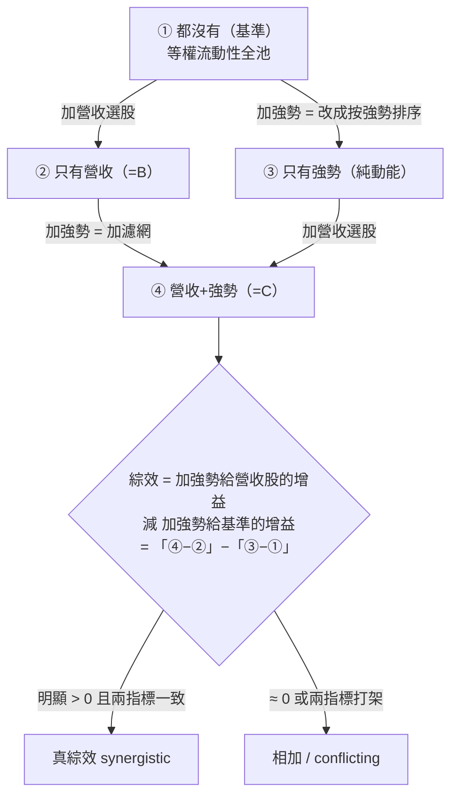
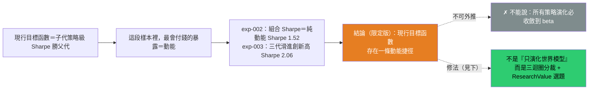

# 實驗 002：交互超邊消融

[實驗 001](exp-001-candidate-c.md) 生出一個漂亮的 33% 候選 C，並替它掛了三張警告標籤，其中第二張是「單調＝動能指紋」。這一輪就是**正面拆穿那張標籤**：用一個乾淨的四臂消融（ablation，逐個拿掉因子看貢獻），問一個尖銳的問題——C 的優勢是「月營收 × 價格強勢」的**真綜效**，還是兩個因子各自貢獻的**相加**？機器對自己上一輪剛生出的最好結果，判了 `conflicting`：C 幾乎全是動能 beta 相加，不是真綜效。這一頁是本專案「引擎拒絕相信自己」最鋒利的一次。

> 資料截止 2026-07-22｜回測 2015-01→2026-06，138 事件｜裁決 conflicting（E2）｜真相源＝`報告_圖驅動進化與交互超邊_20260722.md`

## 假說

**「候選 C（月營收 × 250 日價格強勢）勝過父代 B，是因為兩個因子產生了真綜效——價格強勢『特別』幫月營收股，而不只是強勢誰都幫的相加效果。」**

這是一個關於 [交互超邊](graph-hypergraph.md) 的假說：超邊（hyperedge）連結兩個以上的節點，斷言它們**共同**產生效果。要證明綜效存在，不能只看「C 贏了」，得證明「1+1 > 2」。

## 取用哪些部件、從哪裡來

| 部件／機件 | 這輪的內容 | 來源檔案 |
|---|---|---|
| 四臂消融器 | 2×2 設計：都沒有／只有營收／只有強勢／兩者都有 | `engine/ablation.py`（本輪新增，考卷 `tests_ablation.py` 六卷綠） |
| 交互超邊表 | 把消融結果寫成一條交互超邊入帳 | `engine/db_graph.py`（interaction_edge 表遷移） |
| NAV 引擎 | 四臂共用同一部署同形淨值引擎、同成本 | 沿用 [實驗 000：引擎首輪 A/B 退出時點](exp-000-engine-first-run.md) 的 `run_ab.py` |
| 純碼 relation 判定 | synergy 過門檻與方向一致性 → synergistic / conflicting / additive | `ablation.py`，LLM 零涉入 |

四臂的 spec 都是既有基因，非新造：基準（等權流動性全池）、R=[B](exp-000-engine-first-run.md)、S only（純動能）、R×S=[C](exp-001-candidate-c.md)。

## 怎麼組成：2×2 消融的邏輯

判斷「真綜效 vs 相加」的方法，是比較兩個「加強勢的增益」：

若「把強勢加到營收股上」的增益，明顯大於「把強勢加到基準上」的增益，才是綜效（強勢特別幫營收股）；若兩者差不多，就是相加（強勢誰都幫，跟營收無關）。

## 演算步驟

①用同一 NAV 引擎跑四臂（提前三天退出四臂一致，構成乾淨 2×2）；②算各臂 CAGR / Sharpe / 對基準超額；③算兩個「加強勢增益」——`add_S given R`（在營收股上加）與 `add_S given not-R`（在基準上加）；④綜效＝兩者之差＝`[R×S − R] − [S only − 基準]`；⑤對 CAGR 綜效與 Sharpe 綜效各設門檻（CAGR 0.5pp／Sharpe 0.10），純碼判 relation；⑥寫成一條交互超邊入帳；⑦獨立管線複算。

## 過了哪些閘

| 決策門 | 通過條件 | 本輪 |
|---|---|---|
| 機件門 | 消融模組考卷全綠、決定性 | ✅ 過（六卷綠） |
| 消融門 | 四臂齊備、synergy 純碼可重算、獨立複現 | ✅ 過 |
| 綜效門 | synergy 顯著為正且兩指標一致 | ❌ **未過**（conflicting，判為相加） |
| 樣本外門 | walk-forward 裁決 | ❌ 未過（E2 封頂） |

消融紀律硬閘：缺任一臂、或證據為空，直接拒絕入帳——這道紀律真的擋得住（獨立紅線員驗證）。詳見 [證據閘](method-gates.md)。

## 結果：純動能自己就解釋了 C 的絕大部分

2015-01→2026-06，138 事件，等權 Top-20，提前三天退出，同一 NAV 引擎與成本：

| 組合 | 年化報酬 | Sharpe | 對基準超額(CAGR) |
|---|---|---|---|
| ① 都沒有（基準，等權流動性全池） | 14.61% | 0.96 | — |
| ② 只有營收選股（＝父代 B） | 20.22% | 1.08 | +5.60pp |
| ③ 只有價格強勢（純動能） | 26.87% | **1.52** | +12.26pp |
| ④ 營收＋強勢（＝候選 C） | 33.22% | **1.52** | +18.60pp |
| **綜效**＝[④−②]−[③−①] | — | — | CAGR **+0.74pp**／Sharpe **−0.12** |

三個關鍵讀數：

- **加強勢給營收股 ＝ 加給基準**：`add_S given R` CAGR +13.0pp vs `add_S given not-R` +12.3pp——幾乎一樣。強勢的貢獻與有沒有做營收選股**無關**，是相加。
- **風險調整面歸零**：純動能 Sharpe 1.52 ＝ 營收＋強勢 Sharpe 1.52。有了動能之後，再加營收選股，對 Sharpe 的邊際貢獻是**零**。
- **兩指標方向相反**：synergy CAGR +0.74pp（勉強過噪音門檻）、synergy Sharpe −0.12（負）——證據衝突，判 `conflicting`。

值得注意：一個天真的「只看 CAGR」判定會給出 `synergistic`（因為 +0.74pp 過了 0.5pp 門檻），但引擎同時看 Sharpe 綜效為負，主動判 conflicting——**沒有把相加凹成綜效**。

## 裁決

**交互超邊 `conflicting`（C 非綜效，是動能 beta 相加）、不改真錢。** 由決策門推出，不由「C 有 33%」推出。這條交互超邊 `INT_0107e94c9f2c`（成員＝月營收 rev_yoy + 250 日 range-position 價格強勢，relation=conflicting，四臂齊備，E2）**永久保留在正典帳**——負結果／衝突結果也是知識。

決策階梯位置：機件正確 → 消融可信 → **綜效被否決（判為動能 beta）← 在這裡** → 樣本外裁決 → 迴圈常態落帳。

這證實了 [實驗 001](exp-001-candidate-c.md) 替 C 掛的第二張警告標籤：那個漂亮的 33%，拆開來大部分是動能 beta 在多頭樣本付錢。

## 獨立驗證

- **數字獨立重算員**：用完全獨立的純 pandas（不 import 消融/回測函式）重建四臂 total_return 與 CAGR（差 <1e-14）、對基準超額、synergy 的差異中之差（synergy_cagr +0.007447、synergy_sharpe −0.1218，與存檔差 0）、relation 邏輯（獨立重寫得 conflicting），全部吻合。PASS，無 blocker，並特別確認**運轉手沒有把相加凹成綜效**。
- **紅線員**：確認四條紅線全 CLEAN——圖驅動是真的（非硬編）、消融紀律真的擋（缺臂/空證據被拒）、負結果真的入帳、無偷碰真錢。

重現指令：`/home/liao/finlab_env/bin/python -m engine.tests_ablation`（六卷）。

## 誠實邊界：這個實驗不能證明什麼（語氣不超過證據）

這一頁最容易被讀過頭。它是一個**乾淨、可重算、負結果如實入帳**的消融，但它的證據力有明確天花板——把裁決講得比證據更滿，本身就是這份 wiki 要示範的反例（見 [誠實紀律](discipline.md)）。逐條列出它**不能**支撐的推論：

1. **不能證明「這組因子普遍無綜效」——僅特定候選**：只否決了「月營收 × 250 日 range-position 強勢」這一組、在這個口徑下的綜效。換別的營收定義、別的強勢窗口、別的持有規則，綜效可能重現。
2. **不能證明「動能在別的市場狀態也主宰」——多頭偏樣本**：2015–2026 這段單一路徑本身偏多頭，動能就是這段最會付錢的暴露。這個 `conflicting` 是「**在這段樣本裡**」的結論，不是跨 regime 的結論。
3. **不能當可下注結論——未 walk-forward、E2 封頂**：全樣本回測、零樣本外。synergy +0.74pp CAGR 在 11 年單一路徑裡遠低於噪音水平；conflicting 是誠實裁決，不是可部署訊號。
4. **judgment 依賴未校準門檻——synergy 門檻未校準**：綜效門檻（CAGR 0.5pp／Sharpe 0.10）是實作預設、未經研究校準，而 synergy 剛好落在門檻附近。門檻一動，`conflicting` 與 `synergistic` 可能互換。
5. **兩臂操作不完全對稱——消融兩臂不對稱**：「加強勢」在營收側是加濾網（filter），在基準側是改成按強勢排序 Top-20（ranker + 集中），非完全同一操作（已在證據 `interpretation_caveat` 標注）；synergy 的差異中之差須連同此不對稱一起讀。此外未存日報酬序列，Sharpe 綜效只驗了算術組合、未重驗輸入。

這五條合起來界定了本頁裁決的**合法射程**：一句話——「這個目標函數、這段樣本、這一組因子，有一條會被正確迴圈利用的動能捷徑」。射程之外的全稱結論（例如「動能永遠贏」「所有策略演化必收斂到 beta」）本頁**不背書**。

## 更深一層：這是「現行目標函數存在動能捷徑」的直接實驗證據

到這裡為止，本頁講的都是「C 不是綜效」。把鏡頭拉遠一格，這次消融連同姊妹實驗 [實驗 003](exp-003-graph-evolution.md)，一起指向一個更上游的觀察——但這個觀察的**份量要拿捏準，第一版 wiki 把它講成「鐵證／坐實了演化目標本身錯了」，那是說太滿**。owner 第二輪批評直接點名這一點，這裡把它降級到證據撐得住的講法。

**能講到的**：在**現行的目標函數**（適應度＝子代策略級指標 Sharpe／CAGR 勝父代）與**這段樣本**下，一台機件完全正確、決定性可重現的進化迴圈，會找到一條**動能捷徑（momentum shortcut）**——exp-002 把「營收＋強勢」拆穿成動能相加（純動能 Sharpe 1.52 ＝ 組合 1.52），exp-003 放手追報酬則三代滑進更純的動能（gen3 創新高 250、Sharpe 2.06，機器自標「幾乎肯定過度擬合」）。這是**對「現行目標函數存在動能捷徑」的直接實驗證據**——不是紙上臆測，是被自己的帳本記下來的兩筆。

**不能講到的**：這**不**等於「所有策略演化都必然收斂到 beta」。要下那個全稱結論，得先補上前一節誠實邊界列的五個缺口——跨 regime 樣本、walk-forward、對稱消融、校準門檻、多組候選。目前證據只支撐「**這個目標 × 這段樣本，有一條會被正確迴圈利用的動能捷徑**」，僅此而已。這個「語氣不超過證據」的收斂，本身就是這份 wiki 想示範的紀律。

## 那修法是什麼：不是「只演化世界模型」，是三個分開裁決的迴圈

第一版 wiki 的修法寫成「把演化目標從策略改成世界模型」。owner 第二輪批評指出這也是**矯枉過正**：策略不是可有可無的投影，它是「**世界信念進入現實約束（成本、beta、風險、容量）之後的決策政策**」，本身必須被單獨演化與裁決。正確的修法是把一個迴圈拆成**三個目標不同、裁判不同、分開結算**的迴圈：

- **認知迴圈**（改世界模型）：裁判＝預測校準／樣本外 log score／反證是否觸發。本頁揭露的動能捷徑，正是「認知迴圈的裁判被誤用成策略級績效」的後果。
- **決策迴圈**（改策略）：裁判＝**beta 中性化後的增量**、成本後效用、風險。exp-003 P0 的「動能 beta 懲罰」其實就是這條迴圈裁判的雛形——把動能中性化後還剩多少，才算策略的真增量。
- **元研究迴圈**（改怎麼選問題）：裁判＝單位成本資訊增益／重複研究率／失敗歸因。它取代舊版「知識缺口收斂」這個**會被鑽漏洞**的目標（缺口可以被無限細分刷數量），改用 `ResearchValue`＝(不確定性 × 決策相關性 × 可辨識性 × 期望資訊增益) ÷ (成本 × 時間) 來選題。

三迴圈的完整設計見 [三個進化迴圈](three-loops.md)，世界／觀測／信念／策略的乾淨分離見 [世界模型](world-model.md) 與 [信念契約](world-belief-contract.md)。exp-004 已把認知迴圈的後半段（到期對帳 → 信念更新）用真資料跑通一次——信念 B-H-003 因 86 筆對帳僅 27 命中，信心從 0.5 純碼更新到 0.2256、判 REFUTE，見 [實驗 004](exp-004-belief-contract.md)。

一句話收束：這一輪只否決了**這一組因子、這個樣本**的綜效，並提供「**現行適應度函數有動能捷徑**」的直接證據——它不是說迴圈永遠找不到真訊號（exp-003 行動二允許「扣掉動能後仍有子代勝出」翻案），也不是說策略該被廢除（它反而是三迴圈裡獨立的決策迴圈）。同一份報告的另一半——讓圖自己提案、自主連跑數代——記在 [實驗 003](exp-003-graph-evolution.md)。

---

**被連結自（反向連結）：** [三個迴圈：認知、決策、元研究，各有各的裁判](three-loops.md) · [世界模型：世界不是新聞，新聞是世界狀態的 delta](world-model.md) · [因果層：新聞→事件→供需→公司→財報→預期→價格](causal-layer.md) · [實驗 001：生成候選 C（月營收 × 價格強勢）](exp-001-candidate-c.md) · [實驗 003：圖驅動自主進化三代](exp-003-graph-evolution.md) · [實驗 004：世界信念契約首度到期對帳](exp-004-belief-contract.md) · [實驗索引：每一輪真跑，逐環節攤開](exp-index.md) · [整體架構與資料流](architecture.md) · [方法論：誠實紀律（拒絕相信自己）](discipline.md) · [方法：策略基因（StrategySpec 九部件）](method-strategy-spec.md) · [方法：證據閘（十道關卡）](method-gates.md) · [方法：進化迴圈（圖提案→變異→裁決→回流）](method-evolution-loop.md) · [框架：研究雙語與認知編譯器](fw-research-bilingual.md) · [演化的目標：一個目標函數量不了三種東西](objective.md) · [研究作業系統：11 層與「別蓋空引擎」](research-os.md) · [給 LLM 評審：請攻擊這些接縫](for-llm-review.md) · [總覽：真正該演化的不是策略，是世界模型](overview.md) · [詞彙表](glossary.md) · [超圖：策略基因超邊與交互超邊](graph-hypergraph.md) · [首頁：Alpha 進化迴圈研究 Wiki](index.md)
