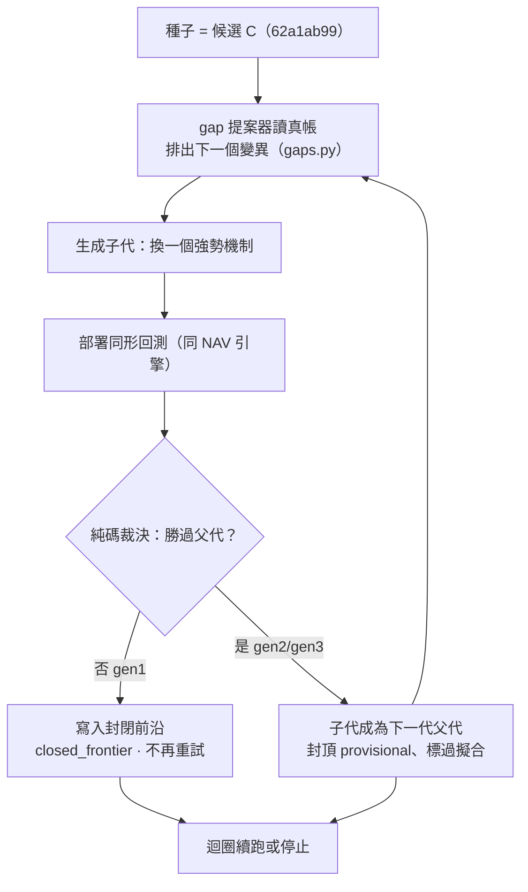

# 實驗 003：圖驅動自主進化三代

前面幾輪的每一代變異都是**人手指定**的（改退出、加濾網）。這一輪補上進化最缺的一塊：**讓圖自己提案下一個該測的變異、讓結果回流、自主連跑數代**——不是我挑。三件機件都落地、都真跑、都由純程式碼裁決。結論分兩層：機件層，迴圈**是真的會自己轉**、會記負結果；但結果層，一旦放手讓它追報酬，它就一路走進更深的動能暴露（某代 Sharpe 衝到 2.06、疑過擬合）。所以世代最後**外科回滾**，正典帳保持乾淨。這一頁證明的東西很重要，但它證明的恰好是「自主迴圈目前找不到真 Alpha，只會重新發現動能 beta」。

> 資料截止 2026-07-22｜回測 2015-01→2026-06，138 事件｜裁決 機件證實、世代回滾｜真相源＝`報告_圖驅動進化與交互超邊_20260722.md`

## 假說

**「讓 [知識圖](graph-knowledge.md) 自己讀出『下一個最該測的變異』並自主連跑數代，進化迴圈能找到勝過現有基因的新 Alpha。」**

這是對整套 [進化迴圈](method-evolution-loop.md) 的可否證檢驗：不是問「某一條策略好不好」，是問「這台會自己提案、自己跑、自己記帳的機器，放手之後會產出什麼」。

## 取用哪些部件、從哪裡來

本輪新增四個純碼模組，各自帶考卷：

| 機件 | 做什麼 | 來源檔案 |
|---|---|---|
| ① gap 提案器 | 讀真帳排出「下一個該測的變異」，機制清單在提案器檔、不在迴圈檔（非硬編） | `engine/gaps.py`（`propose_next`，`tests_gaps.py` 五卷綠） |
| ② 交互超邊消融 | 見 [實驗 002：交互超邊消融](exp-002-ablation.md) | `engine/ablation.py` |
| ③ 自主迴圈 | 每代父代＝上一代子代、跑通、記帳、續接 | `engine/evolve_loop.py`（`run_evolution`，`tests_loop.py` 全綠） |
| 圖記憶表遷移 | interaction_edge 與封閉前沿落表 | `engine/db_graph.py` |

種子＝[候選 C](exp-001-candidate-c.md)。所有裁決由純程式碼執行，LLM 零涉入提案與判決。

## 怎麼組成：迴圈為什麼算「自主」

迴圈算自主，關鍵在**每一代要測什麼，來自讀圖的提案器、不是寫死的清單**。從 C 出發，提案器提出「換一個強勢機制」，迴圈就把 selection 裡的強勢定義換掉，跑回測，比較父子，寫回血統，再讓子代當下一代的父代。

## 演算步驟：迴圈跑了哪三代

從 C 出發，提案器連續提案、迴圈連跑三代（對即時父代的差）：

| 代 | 變異 | CAGR | Sharpe | 裁決 |
|---|---|---|---|---|
| gen1 | 250 日**高位持續性** | 25.26% | 1.28 | **輸給父代（CAGR −7.95pp）→ 被否決 → 寫入封閉前沿** |
| gen2 | 120 日**動能** | 34.00% | 1.50 | provisional |
| gen3 | 250 日**創新高** | 55.80% | **2.06** | provisional、標「幾乎肯定過度擬合」 |

三代 genome 互異＝真變異；連跑兩次血統逐字一致＝決定性可重現。這條「越換越高」的軌跡，配上 [實驗 002](exp-002-ablation.md) 的消融結論，說的是同一件事：**放手讓迴圈追報酬，它就一路走進更純的動能暴露**——因為在這段多頭樣本裡，動能就是會付錢。機器對每一代都如實封頂 provisional、標過度擬合，沒有一代被誤判為可部署。

## 過了哪些閘

| 決策門 | 通過條件 | 本輪 |
|---|---|---|
| 機件門 | 三件模組考卷全綠、決定性 | ✅ 過（提案器五卷、消融六卷、迴圈全綠、既有引擎九卷） |
| 消融門 | 見 [實驗 002：交互超邊消融](exp-002-ablation.md) | ✅ 過 |
| 樣本外門 | walk-forward 裁決 | ❌ 未過（E2 封頂） |
| 落帳門 | 迴圈世代乾淨落帳（真發現留、追動能標記） | ◐ **半過**（回滾了、非乾淨落帳） |

## 結果與裁決

**三件機件全部證實可運作**：圖真的自己提案（gen1 的變異＝提案器對真帳排出的第一名，可重現、基因指紋相符）、迴圈真的會回流（每代父代＝上一代子代）、負結果真的入帳（gen1 被否決後寫進封閉前沿、不再重試）。

**但世代結果回滾。** 自主迴圈那 3 代是真跑通、對真帳查證後**外科回滾**，正典帳保持乾淨的 A/B/C ＋ 兩個消融控制臂。回滾原因：完整 3 代會把「當前最佳」前移到疑過擬合的 gen3、並 regress 一個脆弱考卷——與其把追動能的 provisional 世代永久寫進只增不改的帳，不如保持正典乾淨、把它們當一次可重現的演練，證據副本留在暫存區。

正典帳現況：策略基因 5 條（A、B、C ＋ 消融兩臂）、[交互超邊](graph-hypergraph.md) 1 條（conflicting）、演化邊 2 條（A→B、B→C）、gate_result 13。

決策階梯位置：機件正確 → 消融可信 → 綜效被否決 → **機件證實但世代回滾 ← 在這裡** → 樣本外裁決 → 迴圈常態落帳。

## 獨立驗證

- **數字獨立重算員**：重建四臂與 synergy（見 [實驗 002](exp-002-ablation.md)）逐位吻合。**但迴圈三代子代的原始指標未持久化**（隨回滾移出正典帳、證據副本在暫存），重算員只能就「對父代的差分」對帳、無法獨立重算子代本身。
- **紅線員**：FAIL → 修復後解除。四條紅線最終全 CLEAN（圖驅動非硬編、消融紀律真的擋、負結果入帳、無偷碰真錢）；FAIL 僅因「考卷當下紅＋孤兒根目錄 .sqlite（迴圈真跑落點）」，兩者已修（`tests_gaps.py` 自我命中的禁字問題＋補出生標注；孤兒檔移入暫存）。

重現指令：`/home/liao/finlab_env/bin/python -m engine.tests_gaps`（五卷）＋`engine.tests_loop`。

## 誠實邊界（不得省略）

- **迴圈追的是動能、不是真訊號**：它產出的高報酬很可能就是動能 beta 在多頭樣本的重複發現。gen3 的 2.06 幾乎肯定是集中度過擬合。「自主迴圈能找到真 Alpha」這個命題信心**低**。
- **回滾與「負結果入帳」鐵律有張力**：gen1 是負結果，理想上該永久留；本輪它隨整批回滾了（雖有暫存證據副本）。這是一個**誠實的張力，不是乾淨的執行**——迴圈要常態運轉，需要一個「把追動能世代與真發現分開落帳」的機制，目前是全批回滾的粗處理。
- **消融覆蓋範圍有限**：交互超邊消融目前只硬綁「月營收 × 250 日 range-position 強勢」這一組；迴圈子代一旦把強勢機制變異掉就離開覆蓋範圍，依 [反捏造紀律](discipline.md)不虛構、無法為新機制補消融——所以本輪沒為迴圈後代生新綜效邊。
- **綜效門檻可能翻動判定**：見 [實驗 002](exp-002-ablation.md)。

下一步三件，對準同一件事——**別讓迴圈變成動能 beta 發現器**：①凍結判準後跑 walk-forward 樣本外消融；②給自主迴圈的適應度加一道「動能 beta 懲罰」（如對純動能因子中性化後才計分），否則放手優化 CAGR 只會一再重新發現 beta；③修迴圈落帳，把「真發現」與「追動能／疑過擬合世代」分軌，讓負結果永久留、追動能世代標記而非全批回滾。整條實驗線的總帳見 [實驗索引](exp-index.md)，最該被攻擊的接縫收在 [給 LLM 評審](for-llm-review.md)。

---

**被連結自（反向連結）：** [三個迴圈：認知、決策、元研究，各有各的裁判](three-loops.md) · [因果層：新聞→事件→供需→公司→財報→預期→價格](causal-layer.md) · [實驗 002：交互超邊消融](exp-002-ablation.md) · [實驗 004：世界信念契約首度到期對帳](exp-004-belief-contract.md) · [實驗索引：每一輪真跑，逐環節攤開](exp-index.md) · [方法論：誠實紀律（拒絕相信自己）](discipline.md) · [方法：證據閘（十道關卡）](method-gates.md) · [方法：進化迴圈（圖提案→變異→裁決→回流）](method-evolution-loop.md) · [框架：特徵代數](fw-feature-algebra.md) · [框架：研究雙語與認知編譯器](fw-research-bilingual.md) · [演化的目標：一個目標函數量不了三種東西](objective.md) · [知識圖譜：四張圖](graph-knowledge.md) · [研究作業系統：11 層與「別蓋空引擎」](research-os.md) · [研究迴圈：世界不被更新，被更新的是信念](research-loop.md) · [給 LLM 評審：請攻擊這些接縫](for-llm-review.md) · [總覽：真正該演化的不是策略，是世界模型](overview.md) · [詞彙表](glossary.md) · [超圖：策略基因超邊與交互超邊](graph-hypergraph.md) · [量化結構組成語言（總覽）](lang-quant.md) · [首頁：Alpha 進化迴圈研究 Wiki](index.md)
