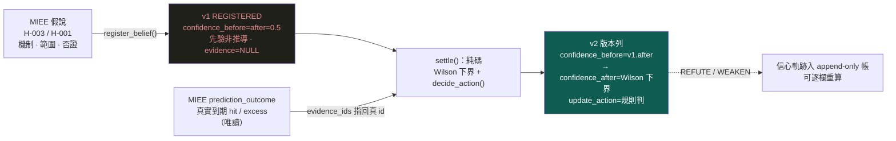

前三輪實驗都在做同一類事：生策略、回測、拆穿它是不是動能 beta（[[exp-000-engine-first-run|000]]～[[exp-003-graph-evolution|003]]）。這一輪換一條線——**第一次不評策略、而評「信念」**。它把 [[fw-qual-engine|MIEE]] 兩條事件驅動假說編成 append-only 的世界信念版本，讀真實的到期結算數，純碼把信心從先驗 0.5 更新到證據下界，並判一個 `update_action`。結果是本專案第一次**一條信念被真證據推翻**：B-H-003 因 86 筆對帳只命中 27 筆（31.40%），信心 0.5 → 0.2256，判 `REFUTE`；作為對照，同機制、主窗較長的 B-H-001 被 636 筆削弱但存活（`WEAKEN`，0.5 → 0.3913）。這一頁是[[three-loops|三迴圈]]裡**認知迴圈**的第一個真跑實例。

> 資料截止 2026-07-22｜信念 v1 註冊 2026-07-17、v2 對帳 2026-07-17～19｜證據源＝MIEE `prediction_outcome`（唯讀）｜裁決 REFUTE / WEAKEN（純碼）｜真相源＝`aaro/wm/belief.py`＋`data/aaro.sqlite` `belief_contract` 表

## 假說

這一輪要驗的不是「某策略會不會賺」，而是一個**方法學假說**：

**「把 MIEE 已到期對帳的假說編成帶版本的信念契約，能否純碼地、可重算地回答那句分水嶺問題——哪一條信念、因為哪一份證據、從哪一版更新到哪一版？而且，當證據夠差時，這套規則會不會真的把一條信念判成推翻（而不是凹成成立）？」**

要證明這件事成立，光看「有沒有寫進表」不夠，得看兩個對照結局：一條**該被推翻**的信念真的被判 `REFUTE`、一條**只該被削弱**的信念真的被判 `WEAKEN`——同一套純碼規則，靠證據品質自己分流。

## 取用哪些部件、從哪裡來

| 部件／機件 | 這輪的內容 | 來源檔案 |
|---|---|---|
| 信念契約 schema | 14 欄 append-only 信念表＋兩個防改防刪觸發器 | `wm/belief.py` `SCHEMA_SQL`（詳見 [[world-belief-contract|信念契約]]） |
| MIEE 讀取（唯讀） | `hypothesis` 讀機制/範圍/否證；`prediction_outcome` 讀真實 hit/excess | `wm/belief.py` `connect_miee_ro()`（`?mode=ro` 結構性擋寫） |
| Wilson 下界結算器 | 由命中數 k/n 算方向命中率 95% 區間，`confidence_after`＝下界 | `wm/belief.py` `wilson_interval()`／`settle()`（純函式、無隨機） |
| 純碼決策樹 | 由 (n, k, avg_excess, wilson_lo/hi) 判五態動作，LLM 零涉入 | `wm/belief.py` `decide_action()` |
| 證據源 | 兩條假說的 MIEE 前瞻預測到期結算 | MIEE `miee.db`（H-001 / H-003，真到期數） |

兩條信念的來源假說都是既有 MIEE 假說，非本輪新造：B-H-003 ← `miee:H-003`（主窗 5 日）、B-H-001 ← `miee:H-001`（主窗 20 日）。兩者機制幾乎相同（漲價反映供需吃緊超出市場預期、未預先反應標的遲滯重定價），差別只在主窗與樣本。

## 怎麼組成：先驗列 → 讀真證據 → 純碼結算 → 版本列



判斷「推翻 vs 削弱」的邏輯，全在 `decide_action()` 這棵純碼決策樹，對映 MIEE `falsifier` 的 OR 子句（`min_n` 為 MIEE 假說原生門檻）：

```
n < min_n                          → HOLD_PRIOR   證據不足，維持先驗
wilson_hi ≤ 0.5  且  avg_excess ≤ 0 → REFUTE       兩否證子句齊發 → 推翻
wilson_lo > 0.5  且  avg_excess > 0 → REINFORCE    連下界都過基準且超額為正 → 強化
hit_rate ≤ 0.5   或  avg_excess ≤ 0 → WEAKEN       任一否證跡象 → 削弱但存活
其餘（點估計過基準但不顯著）        → NARROW_SCOPE  保留並限縮範圍待更多證據
```

`REFUTE` 與 `WEAKEN` 的唯一分水嶺，就是**否證子句是「齊發」還是「只發一條」**：命中率上界不過基準是共同的第一條，第二條「平均超額 ≤ 0」發不發，決定推翻或只是削弱。

## 演算步驟

① `register_belief()` 把 MIEE 假說編成 v1 先驗列（`confidence_before=after=0.5`、`evidence_ids=NULL`、`update_action=REGISTERED`）；② `fetch_reconciled()` 唯讀讀該假說所有 `prediction_outcome`，聚合 `n`（總對帳數）、`k`（命中數）、`avg_excess`（平均成本後超額），並回逐筆 outcome id 當證據指針；③ `wilson_interval(k,n)` 算方向命中率的 95% 區間 `(lo, hi)`，`confidence_after = round(lo, 6)`；④ `decide_action()` 由 `(n, k, avg_excess, min_n, lo, hi)` 判 `update_action`；⑤ 寫 v2 版本列，`confidence_before(v2)=confidence_after(v1)`（鏈接）、`evidence_ids` 存 outcome id 清單與 n/k、`settlement_rule` 存可重算的規則 JSON；⑥ append-only：改信念＝寫新 version，觸發器擋任何 UPDATE/DELETE；⑦ 冪等——同一組 (n,k) 重跑不灌新版本。

## 過了哪些閘

| 決策門 | 通過條件 | 本輪 |
|---|---|---|
| 機件門 | 信念契約考卷全綠、決定性、可重算 | ✅ 過（`tests_belief.py` **5/5 PASS**） |
| 重算門 | `confidence_after` 純碼可重算，且對得上 MIEE 真實 hit 數 | ✅ 過（考卷①；獨立手算見下） |
| append-only 門 | 觸發器實擋 UPDATE/DELETE，信念史只增不改 | ✅ 過（考卷②：UPDATE/DELETE 均 RAISE ABORT） |
| 純碼裁決門 | `update_action` 由規則決定、非人填、LLM 零涉入 | ✅ 過（考卷③） |
| 上游零寫入門 | 全程對 MIEE 零寫入 | ✅ 過（考卷④：`miee.db` sha256 前後不變 `e269e644…`） |
| 決策改變門 | 信念更新後，下游策略是否據此改變 | ❌ **未做**（留 exp-005，見誠實邊界） |

前五道全綠，最後一道**刻意不做**——這一輪只走到「信念更新」，不碰「決策改變」。

## 結果：一條被推翻、一條被削弱，同一套規則自己分流

兩條信念的 v2 對帳列，逐欄都是 `belief_contract` 表裡查得到的事實：

| 信念 | 主窗 | n（對帳） | k（命中） | 命中率 | 平均超額 | Wilson 下界／上界 | 信心 before→after | update_action |
|---|---|---|---|---|---|---|---|---|
| **B-H-003** | 5 日 | 86 | 27 | **31.40%** | **−0.00760** | 0.2256 ／ 0.4182 | 0.5 → **0.225612** | **REFUTE** |
| **B-H-001** | 20 日 | 636 | 273 | 42.92% | **+0.00180** | 0.3913 ／ 0.4680 | 0.5 → **0.391315** | **WEAKEN** |

三個關鍵讀數：

- **B-H-003 兩否證子句齊發 → 推翻**：命中率 95% 上界 0.4182 仍不過 0.5（第一條），**且** 平均超額 −0.0076 為負（第二條）——兩條齊發，判 `REFUTE`。這是本專案第一次一條信念被真證據推翻。
- **B-H-001 只發一條 → 削弱但存活**：命中率上界 0.4680 也不過 0.5（第一條發），**但** 平均超額 +0.0018 為正（第二條沒發）——只一條否證跡象，命中率又 ≤ 0.5，判 `WEAKEN`。信心從 0.5 掉到 0.3913，信念沒被推翻、只是變弱。
- **同機制、只差主窗與樣本，結局就分流**：兩條信念機制幾乎相同，一條 REFUTE、一條 WEAKEN，完全由證據品質經同一套純碼規則自己決定——沒有人手動指定誰被推翻。

這正是假說要的兩個對照結局：該推翻的推翻、該削弱的削弱，規則靠證據自己分流。

## 裁決

**信念 B-H-003 判 `REFUTE`（推翻）、B-H-001 判 `WEAKEN`（削弱），皆由 `decide_action()` 純碼規則推出、非人填。** B-H-003 的 `REFUTE` 與 MIEE 自身 `status='refuted'` 一致——兩套獨立系統對同一條假說得到同向結論。方法學假說**成立**：信念契約能純碼、可重算地回答分水嶺問題，且證據夠差時真的會判推翻。

決策階梯位置：機件正確 → 重算可信 → append-only 擋改 → **信念更新落帳（REFUTE/WEAKEN）← 在這裡** → 決策是否據此改變（未做，exp-005）。

一句話收斂：**信念 B-H-003，因 86 筆對帳僅 27 命中（outcome id 87..172），信心 from v1=0.5 → v2=0.225612，update_action=REFUTE。** 世界沒有改變，改變的是我們對這條機制的信心。

## 獨立驗證

- **考卷五道全綠（`tests_belief.py` 5/5 PASS）**：①`confidence_after` 純碼可重算且對得上 MIEE 真實 hit 數；②append-only 觸發器實擋 UPDATE/DELETE；③`update_action` 由規則決定非人填；④MIEE `miee.db` sha256 前後不變（`e269e644a7e3cd0b…`），全程零寫入；⑤每個 `def` 出生標注齊備。
- **Wilson 下界手算複核（獨立於模組）**：B-H-003 k=27/n=86 → center 0.32191、margin 0.09630 → lo **0.22561**、hi 0.41820，與存檔 0.225612／0.418206 吻合（差 <1e-4，四捨五入）；B-H-001 k=273/n=636 → lo **0.39131**、hi 0.46803，與存檔 0.391315／0.468025 吻合。confidence_after 確實是命中率的 Wilson 95% 下界，非任何人手填。
- **決策動作獨立重判**：以 `(wilson_hi≤0.5 且 avg_excess≤0)` 手判 B-H-003＝REFUTE、以 `(hit_rate≤0.5 且 avg_excess>0)` 手判 B-H-001＝WEAKEN，與存檔 `update_action` 一致。

重現指令：`/home/liao/finlab_env/bin/python /media/liao/MyHDD/FOR_AGENT/aaro/wm/tests_belief.py`（五卷）；跑信念生命：`/home/liao/finlab_env/bin/python /media/liao/MyHDD/FOR_AGENT/aaro/wm/belief.py`。

## 誠實邊界（不得省略）

- **只做「到期對帳 → 信念更新」，沒做「決策是否因此改變」**。信念被推翻/削弱後，下游策略要不要停用、縮倉、重畫適用範圍——閉環後半段完全沒做，留 exp-005。這一輪信念動了，策略一動也沒動；所以它證明的是「認知迴圈能結算」，**不是**「這條信念的推翻已經影響任何一分真錢或任何一條策略」。
- **`confidence_before` 是明說的先驗 0.5，不是從資料推導**。只有 `confidence_after` 純碼算。先驗選 0.5（方向擲硬幣基準）是設計選擇；換先驗、信心軌跡就不同。
- **`n` 是跨時窗匯總、非只主窗**：`fetch_reconciled()` 把該假說在各 horizon（[5,10,20,60]）的 outcome 全匯總成一個命中率。這是一個**該被攻擊的口徑**——把不同時窗的命中混池成單一 hit_rate，並不乾淨。這也是為什麼 B-H-001 在信念契約判 `WEAKEN`（n=636 匯總），而 MIEE 自身 `status` 標 `insufficient`（其主窗口徑樣本不足）——兩套系統用不同結算口徑，B-H-003 的 REFUTE 才與 MIEE `refuted` 對得上。這條不一致必須明講，不能只報對得上的那條。
- **信心＝命中率 Wilson 下界，對「賺賠幅度」不敏感**：結算器只讓 `avg_excess` 透過否證子句（正負）進來，沒把超額的**大小**放進信心。一條命中率低但每次命中賺很大的信念，會被這個口徑低估。換結算器（如超額 t 值）結論可能不同。
- **MIEE 假說不是完整世界機制信念**：它是事件驅動（漲價後短窗）的可證偽預測，是目前**唯一**有真到期結算數的真資料，才拿它當第一條信念的證據；它**不等於**「升息壓估值」那種常駐世界模型節點。信念契約的殼對了，內容還停在事件層——與 [[world-model|世界模型]] 空殼互為因果。
- **兩條信念、單一對帳時點，不是統計勢力**：這是「機制能不能跑通」的首例，不是「這套結算在多條信念、多次對帳上都穩」的證明。要看它在更多信念、跨時間重複對帳的表現，才談得上信心。

延伸：這 14 欄 schema 與 W/O/B/P 四層分開的完整論證見 [[world-belief-contract|信念契約]]；這一輪屬於三迴圈裡的認知迴圈、為何認知裁判不能用決策裸績效見 [[three-loops|三迴圈]]；決策迴圈的動能 beta 捷徑直接證據見 [[exp-002-ablation|實驗 002]]；把提問抬到世界未知層見 [[hypothesis-engine|假說引擎]]；四輪策略實驗的血統見 [[exp-index|實驗索引]]；最該被攻擊的接縫收在 [[for-llm-review|給 LLM 評審]]。
