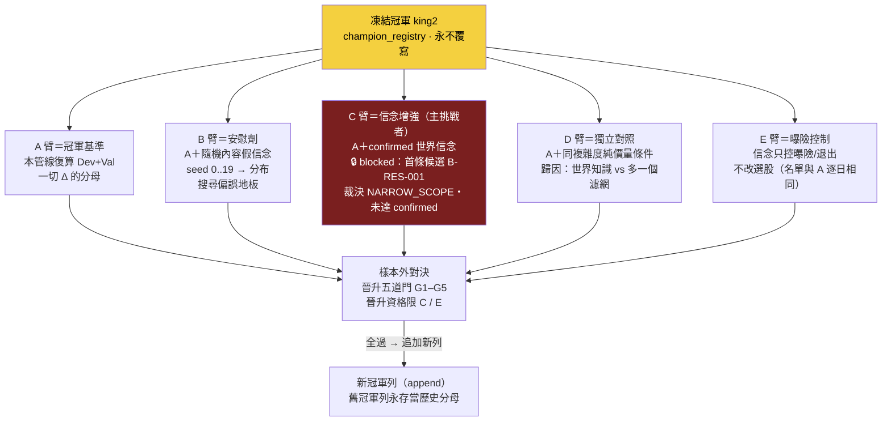

# 實驗 005：king2 冠軍—挑戰者五臂預註冊（REGISTERED，零臂已跑）

這一頁與前五個實驗頁性質不同：**它不報結果，因為還沒有結果。** 它是 [現任冠軍制度](champion-challenger.md) 第一次落成一份可執行的預註冊——冠軍凍結、五臂設計、晉升五道門、判準八維度，全部在任何一臂跑之前寫死。狀態＝**REGISTERED，零臂已跑**。之後補跑任何一臂，都只能對照本頁凍結的設計驗收；跑完發現不合意再回頭改門檻，就是作弊，本頁存在的目的就是讓那條路走不通。

> 預註冊凍結 2026-07-22｜冠軍凍結列＝`champion_registry` id=2（append-only 觸發器實打過）｜殘差資料集＝100 事件 5,409 列｜機件考卷＝`engine/tests_exp005.py` **12 題全綠（fail-closed 真跑）**｜**已跑的臂數＝0**

## 假說（預註冊的，不是已驗證的）

**「把已確認的世界信念（confirmed belief）加到凍結冠軍 king2 上，能在樣本外產生超過搜尋偏誤地板、且不可被『多一個濾網』解釋的成本後增量。」**

這句話的每個限定詞都對應一個臂或一道門：「凍結冠軍」＝A 臂分母；「搜尋偏誤地板」＝B 臂安慰劑分布；「不可被多一個濾網解釋」＝D 臂獨立對照；「樣本外」「成本後」＝晉升門 G1。**本頁不主張這個假說為真**——它完全可能被 B 或 D 臂打掉，那也是合法結局。

## 取用哪些部件、從哪裡來

| 部件 | 內容 | 來源 |
|---|---|---|
| 冠軍凍結 | king2 規則全文＋四檔 sha256 釘入 `champion_registry`（預註冊以 `CHAMP-king2-v1` 稱之；凍結列 id=2 champ_id＝`CHAMP-king2-freeze-0850252de625`，內容雜湊可重算） | `data/aaro.sqlite`；真相源 `s994_str_enhanced.py`（sha256 `3b3bffd0…`）＋`s0_basedata.py`（`a401d8dc…`） |
| 殘差資料集 | 100 換股事件、5,409 樣本列、候選池中位 51.5 檔、入選 1,200 列；四類殘差計數 | `engine/out/king2_residuals.json`＋`king2_residuals_dataset.parquet`（見 [現任冠軍制度：凍結 king2，讓所有研究繞著真決策轉](champion-challenger.md)） |
| 信念契約 | C 臂的信念來源與 confirmed 判定機制（六動詞、到期對帳） | [世界信念契約：被更新的是信念，不是世界](world-belief-contract.md)／`wm/belief.py`（機件由 [實驗 004：世界信念契約首度到期對帳](exp-004-belief-contract.md) 驗證） |
| 機件考卷 | 預註冊機件 fail-closed 驗證 12 題 | `engine/tests_exp005.py`（12/12 PASS） |

## 五臂設計

| 臂 | 角色（[現任冠軍制度：凍結 king2，讓所有研究繞著真決策轉](champion-challenger.md) 五角色） | 是什麼 | 回答什麼問題 | 可晉升？ |
|---|---|---|---|---|
| **A** | champion | 凍結 king2，本管線復算 Dev＋Val | Δ 的分母；順帶驗鏡像與官方口徑對不對得齊 | —（它就是在位者） |
| **B** | placebo | A＋隨機內容假信念（同介面，seed 0..19 成**分布**） | 隨便塞一條信念、碰運氣能贏多少？（搜尋偏誤地板） | 否 |
| **C** | belief_augmented（主挑戰者） | A＋**已確認**世界信念改選股 | 世界知識對選股有沒有真增量？ | 是 |
| **D** | independent | A＋同等複雜度純價量條件 | C 若贏，是「知識」還是「多一個濾網」？ | 否 |
| **E** | challenger（曝險型） | 信念只控曝險／退出，**不改選股**（名單與 A 逐日相同） | 世界知識就算選不了股，能不能管好「抱多大、何時退」？ | 是 |

## C 臂為什麼仍 blocked：首條候選信念 B-RES-001 未達 confirmed

C 臂的定義是「冠軍＋**已確認**的世界信念」。信念帳的狀態剛從「冠軍決策鏈上零候選」推進到「第一條候選」。先前兩條真跑信念（B-H-003 判 REFUTE 0.5→0.2256、B-H-001 判 WEAKEN 0.5→0.3913，見 [實驗 004](exp-004-belief-contract.md)）是 MIEE 事件線的、不在冠軍決策鏈上；**B-RES-001 才是第一條真正從 king2 決策殘差長出的世界假說**——king2 落選股中，當時所屬產業月營收 YoY 中位（PIT）高者，持有窗 forward 殘差方向為正（見 [實驗 007](exp-007-residual-belief.md)）。

但 B-RES-001 的第一次樣本外裁決是 **NARROW_SCOPE**——HOLDOUT 方向對（n=25、命中 0.64、平均超額 +0.715%/事件）卻不顯著（t=0.73、bootstrap 95% CI [−1.19%, +2.60%] 含 0、2023 年 −1.05%），confidence 只從 0.5 微降到 0.445（Wilson 下界），**既未確認也未否證**。confirmed 門檻要 confidence 過 0.5 且樣本外顯著，B-RES-001 兩條都沒到，所以**帳上仍是零條 confirmed、C 臂維持 blocked**，下一閘＝獨立 walk-forward。

這裡刻意選了**誠實的慢路**而不是方便的快路：快路是「隨便挑條聽起來合理的信念、標成 confirmed、把 C 臂跑起來」，那會讓 C 臂從第一天就建立在自我認證上。慢路是 blocked 等貨真價實的解鎖鏈：**殘差四格（選中×漲跌）的假陽性與漏網兩格 → 長出世界假說 → 登記 belief_contract → 前瞻對帳 → 第一條 REINFORCE（confirmed）→ C 臂解鎖**。B-RES-001 是這條慢路的第一次嘗試、停在 NARROW_SCOPE——C 臂什麼時候能跑，取決於殘差線什麼時候長出第一條**撐過樣本外對帳**的信念，不取決於任何人的耐心。

## 晉升五道門（判準凍結）

晉升限 C／E 臂，**五道門全過**才追加新冠軍列，缺一即敗：

| 門 | 內容 | 擋什麼 |
|---|---|---|
| **G1** | 樣本外主指標：Val 成本後、beta 中性年化增量的 bootstrap 下界 > 0 | 樣本內好看、樣本外歸零；動能 beta 假增量 |
| **G2** | 超過 B 臂安慰劑分布的 95 百分位 | 搜尋偏誤：隨機信念也能碰運氣贏 |
| **G3** | Δ ≥ D 臂的 Δ | 複雜度紅利：贏的不是知識，是「多一個濾網」 |
| **G4** | 守門欄：尾損／最差 regime／換手容量／集中度 | 平均變好、極端變爛的隱性交換 |
| **G5** | Vault 人核同號 | 機器自我晉升；真錢線永遠隔一道人 |

判準共**八維度、預註冊時凍結**。有一個誠實的例外要明講：G4 的**具體守門數值**目前刻意留白，帶明標「A 臂＋B 分布跑出後、挑戰臂跑前」以 **EXP-005-CAL** 二段凍結——因為合理的尾損／容量門檻要參照 A 臂復算的實際分布，現在硬填就是瞎編。二段凍結的紀律是：**校準只准看 A 與 B，任何挑戰臂（C/D/E）跑出任何數字之後，門檻永久鎖死。**

## 過了哪些閘（目前只有機件閘）

| 閘 | 內容 | 狀態 |
|---|---|---|
| 機件門 | `engine/tests_exp005.py` 12 題，fail-closed 真跑 | ✅ 12/12 全綠 |
| 冠軍凍結門 | champion_registry append-only 觸發器實擋 UPDATE/DELETE；champ_id 內容雜湊重算相等 | ✅ 過 |
| 殘差資料門 | 四類計數與逐列 parquet 落地、口徑寫明 | ✅ 過（描述性口徑） |
| G1–G5 晉升門 | 五臂對決後的晉升裁決 | ❌ **一道都還沒開始**（零臂已跑） |

機件考卷驗的是「這套預註冊制度會不會壞」：凍結列改不動、雜湊重算相等、blocked 狀態擋得住 C 臂偷跑、門檻凍結後改不了——**它完全不驗「假說對不對」**。12/12 全綠的意思是「棋盤擺好了」，不是「棋下贏了」。

## 結果・裁決

**無。狀態＝REGISTERED。** 零臂已跑、零個 Δ 存在、零次晉升。本頁的「結果」欄要等 A 臂與 B 分布跑出、EXP-005-CAL 二段凍結完成、C 臂解鎖並對決之後才會有內容——且屆時只能按本頁凍結的判準驗收。

## 誠實邊界（不得省略）

- **這是預註冊，不是實驗報告。** 任何「五臂已跑」「世界信念已改善 king2」的讀法都是誤讀——目前真實存在的只有三樣：凍結冠軍、殘差資料集、這份預註冊。
- **C 臂可能長期 blocked。** 解鎖鏈的每一步（殘差→假說→對帳→REINFORCE）都可能失敗。第一條候選 B-RES-001 已把這個風險演一遍——它方向對、但樣本外不顯著，停在 NARROW_SCOPE（既未 confirmed 也未 REFUTE）；一次樣本外 E2 不足以 confirmed，需獨立 walk-forward。在它（或後續候選）真正撐過樣本外對帳之前，C 臂誠實地維持 blocked，這個實驗就停在那裡。
- **A 臂復算可能對不齊官方口徑。** 凍結列的績效快照是照抄（Sharpe 2.843／2.71 兩組口徑），研究鏡像有 9 條已知差異在 `king2_residuals.json`；A 臂跑出來若有落差，先對帳差異清單、再修口徑、不准回頭改官方數字。
- **G4 數值二段凍結是一個可被攻擊的縫。** 「跑完 A/B 再定守門值」在紀律上是必要之惡（不看分布就定值＝瞎編），但它留下一個「校準時偷看方向」的理論縫——防線是校準規則本身也要在 EXP-005-CAL 落地時寫成純碼與書面理由，供事後稽核。
- **E 臂與 [持有期生命週期](fw-holding-lifecycle.md) 的邊界未定稿。** E 臂「信念控曝險/退出」與持有層 H0–H5 狀態機在概念上重疊，實作時誰管哪段要先劃清，否則會出現同一決策兩套規則。

延伸：冠軍制度全貌與殘差四格見 [現任冠軍制度](champion-challenger.md)；殘差怎麼長成假說見 [假說引擎](hypothesis-engine.md)；confirmed 的判定機件見 [信念契約](world-belief-contract.md) 與 [實驗 004](exp-004-belief-contract.md)（本實驗的機件驗證支線）；主線全圖見 [研究迴圈](research-loop.md)；歷次實驗索引見 [實驗索引：每一輪真跑，逐環節攤開](exp-index.md)。

---

**被連結自（反向連結）：** [假說引擎：研究問題從冠軍的殘差長出來](hypothesis-engine.md) · [實驗 006：CB 載具路由四臂預註冊（構想級——判準未凍結、未入帳、零臂已跑）](exp-006-cb-router-prereg.md) · [實驗 007：king2 殘差第一條世界假說——落選股的產業需求殘差](exp-007-residual-belief.md) · [實驗索引：每一輪真跑，逐環節攤開](exp-index.md) · [現任冠軍制度：凍結 king2，讓所有研究繞著真決策轉](champion-challenger.md) · [研究迴圈：W/O/B/P 分離，主線繞著現任冠軍轉](research-loop.md) · [首頁：Alpha 進化迴圈研究 Wiki](index.md)
