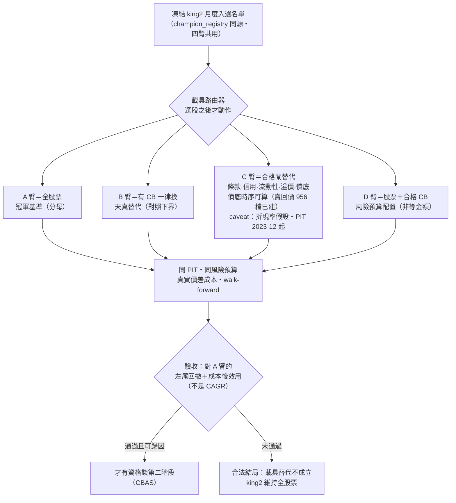
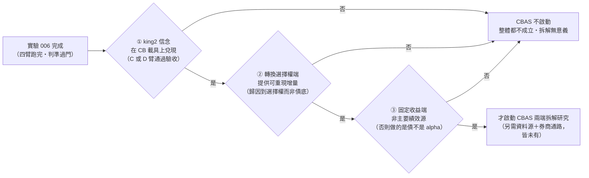

這一頁比 [[exp-005-king2-prereg|實驗 005]] 更早期。005 是「已凍結入帳、待跑」的預註冊；**本頁只是構想級預註冊——四臂設計與紀律已寫成文字，但判準尚未凍結入帳、資料前置未完成、零臂已跑。** 依預註冊紀律，判準必須在任何一臂跑之前凍結進研究帳，本頁目前不滿足這個條件；它的作用是把設計先攤開給 LLM 檢視，升格條件列在頁尾。

實驗問的問題屬於 [[instrument-router|載具路由器]] 的第一條研究線（**CB_as_instrument，載具替代**）：king2 已經回答「要不要看多這家公司」之後，改用 CB 而非股票來表達這個信念，報酬形狀會不會更好？它**不是**第二條線（CB_as_information，CB 市場訊號改善 king2 選股）——那條線不在本實驗範圍，兩條線的資料可以共用、結論不可互相引用。

> **認知答案**：這是一個「換載具、不換信念」的實驗——四臂共用同一份凍結的 king2 入選名單，唯一的差別是每檔標的用股票還是 CB 來持有；因此任何臂間差異只能歸因於載具的報酬形狀，不能歸因於選股。
>
> **行動答案**：第一工項（補歷史賣回價資料）**已實質達成**——推翻偵察「3/86」的悲觀結論：finlab `cb_published_info` 的「最近賣回權價格」其實是 2009→2026 每日面板，**956/1,803 檔曾有賣回價**（在每個賣回窗口前約一年填入，窗外稀疏／0 是經濟正確——賣回底只在賣回日附近綁定）。已建 `data/cb_putprice.sqlite`，**歷史債底時序（債底＝PV(賣回價)）做得出來**，C 臂的「債底合格」條件現在可以算了（帶兩個誠實 caveat：折現率單一假設、嚴格 PIT 只 2023-12 起，見下）。本實驗整體仍**還不能跑**——判準未凍結入帳、零臂已跑；剩下的是凍判準、補其餘合格閘，最後才跑。

## 假說（構想級，未入帳）

**「在完整保留 king2 原始 Alpha（同名單、同時點、同風險預算）的前提下，對『條款、流動性、溢價、債底皆合格』的入選標的以 CB 替代股票持有，能改善左尾回撤與成本後效用。」**

限定詞逐一對應設計：「完整保留原始 Alpha」＝路由器只在選股之後動作、A 臂是分母；「合格」＝C 臂的閘，且 B 臂（一律換）存在就是為了證明合格閘有價值；「左尾與成本後效用」＝驗收口徑，明確**排除 CAGR 比大小**。

## 四臂設計

| 臂 | 內容 | 回答什麼 |
|---|---|---|
| **A（冠軍基準）** | 凍結 king2 名單，全部以股票持有——即現狀 | 一切 Δ 的分母 |
| **B（無腦替代）** | 同名單，凡當時存在對應 CB 就一律換成 CB | 「CB 天生比較好」的天真主張——B 若不輸 A，合格閘就是多餘；B 預期會輸（流動性與溢價成本），它是 C 的對照下界 |
| **C（合格閘替代）** | 同名單，僅當該檔 CB 通過**條款、信用、流動性、溢價、債底**五項合格檢查才替代，否則維持股票 | 主挑戰臂：「挑過的 CB」是否改善報酬形狀 |
| **D（風險預算配置）** | 同名單，股票與合格 CB 並存，按風險預算（非金額）在兩載具間配置 | 「全有全無替代」與「連續配置」哪個是對的路由粒度 |

## 紀律（跑之前就要寫死的規則）

1. **同名單**：四臂共用同一份凍結 king2 名單，載具決策不得回饋到選股——否則測的就不是載具了。
2. **同 PIT**：替代決策只用決策時點可得的資訊。
3. **同風險預算、非同金額**：CB 的 delta 小於 1，等金額替代等於偷偷降曝險，左尾自然變好——那是降槓桿的功勞不是 CB 的。各臂配等風險，用當時可算的 delta 口徑折算。
4. **真實價差成本**：CB 歷史上僅約六至七成交易日有成交，收盤中價假設會把成本低估、平滑高估（既有審計已證實停滯報價把平滑高估約 3 倍）；成本用真實標價／次筆成交法。
5. **當時實際存在的 CB**：替代只考慮決策日已發行、未到期、可交易的 CB，排除事後才發行者（survivorship）。
6. **當時版本的轉換價與條款**：轉換價會下修，用最新值回填歷史等於前視；一律用當時生效版本。
7. **Walk-forward**：合格閘的任何參數只用過去窗估計、下一窗驗證。
8. **Beta／產業／規模中性檢查**：臂間 Δ 若能被曝險漂移解釋（CB 臂實質 beta 較低、或替代集中在特定產業規模），歸因不成立。

## 驗收問題（口徑先釘死）

**在保留 king2 原始 Alpha 的前提下，CB 替代是否改善「左尾回撤」與「成本後效用」——不是 CAGR 比較高。** CB 的理論賣點是債底提供的凸性（下跌有底、上漲跟漲），這個賣點如果為真，會顯現在回撤分布的左尾與風險調整後的效用，不會、也不需要顯現在平均報酬。若某臂 CAGR 較高但左尾沒有改善，視為未通過；若左尾改善但成本吃掉全部效用增量，同樣未通過。

## 已有 vs 缺口（誠實歸戶——這不是從零設計）

CB 線在這台機器上有一條**已定版判決的完整研究遺產**與活著的資料資產。本實驗是在遺產上疊新問題，不是新開荒。逐項標明：

| 項目 | 狀態 | 內容 |
|---|---|---|
| CB 收盤價面板 | ✅ 已有且活著 | 851 檔 CB 日收盤 2021→今，每日自動增量更新；另有鏡像庫七欄完整量價（開高低收／張數／筆數／金額）2007→今 |
| 條款日面板 | ✅ 大半已有 | 每日 per-CB 條款面板 1,803 檔 2009→今：轉換價（含下次生效日，可追下修）、賣回／強贖起迄、餘額、票面利率、標的股價 |
| 轉換溢價 PIT 算法 | ✅ 已有 | 逐日溢價面板的現成算法（條款面板的轉換價＋標的股價） |
| Delta 口徑 | ✅ 已有兩套 | 實證價格分箱映射（歷史研究 #104）＋ BS 連續 delta 與 overhang；風險預算折算（紀律 3）有現成口徑可選，選哪套需在凍結時寫死 |
| 流動性合格檢查 | ✅ 已有 | 六指標 harness 現成：新鮮度／死券尾／價差 proxy／集中度／容量地板／週轉成本 |
| **賣回價歷史（債底時序）** | ✅ **已建（帶 caveat）** | **推翻偵察「3/86」結論**：`cb_published_info`「最近賣回權價格」是每日面板 2009→2026，956/1,803 檔曾有賣回價（賣回窗口前約一年填入，窗外稀疏／0 是經濟正確）。已建 `data/cb_putprice.sqlite`：`putprice_history_finlab` 286,576 列（40,308 列嚴格 PIT 有 2023-12 起爬取時戳、246,268 列重建標 `pit_verified=0`）＋`putprice_snapshot_openapi` 390 列（TPEx 當前快照，可每日增量往前累積）；考卷 6/6＋openapi 交叉 64/65。**歷史債底時序做得出來**。caveat＝折現率單一假設＋嚴格 PIT 只 2023-12 起（見下段） |
| 債底折現端 | ❌ 缺 | 無公債殖利率曲線、無個券信用利差；近似債底（固定折現率）可算，精確債底要新抓 |
| 信用維度 | ❌ 全缺 | 無信評資料且無免費源；C 臂的「信用合格」只能用財報欄位自建 proxy，凍結時必須誠實標明這是 proxy 而非信評 |
| 條款全文層 | ❌ 缺 | 下修公式與頻率、擔保與否不在任何表；要新抓公開發行資訊 |
| PIT 品質警示 | ⚠️ 要抽查 | 條款面板的爬取時戳僅 2023-12 起；之前為回填，嚴格 PIT 段需對公開歷史檔抽查對帳 |

**已判死清單（勿重跑，直接引用判決）**：CB 選股 alpha＝FALSIFIED（動能換皮，歷史研究 #73）；CB 折溢價套利＝判死（折價可成交機會每年個位數、容量玩具級）；CB 債券區 sleeve＝PASS_SIGNAL_ONLY（凸性為真、carry 未證）。本實驗的四臂**都不與這三條重疊**——它不選股（名單來自 king2）、不套利（不做折溢價交易）、不做獨立 sleeve（CB 只作為既有信念的載具）——但檢視時請驗證這個「不重疊」宣稱本身。

## 第一工項（歷史賣回價）：實質達成

第一工項不是回測代碼，是建賣回價資料源——沒有它，C 臂的「債底合格」條件算不出、主挑戰臂直接缺席，實驗跑了也只剩 A/B/D 的殘缺對決。這一工項現在**實質達成**（考卷 6/6＋openapi 交叉 64/65）：

- **推翻偵察的「3/86」悲觀結論**：先前抽查以為賣回價欄幾乎全空，實情是 finlab `cb_published_info` 的「最近賣回權價格」是一張 **2009→2026 每日面板、956/1,803 檔曾有賣回價**。它在每個賣回窗口前約一年才填入，窗口外稀疏或為 0——這不是缺資料，是經濟正確：賣回底只在賣回日附近綁定。
- **落地成 `data/cb_putprice.sqlite`**：`putprice_history_finlab` 286,576 列（其中 40,308 列有 2023-12 起的爬取時戳＝嚴格 PIT，246,268 列為重建、標 `pit_verified=0`）＋`putprice_snapshot_openapi` 390 列（TPEx 當前快照，可每日增量往前累積）。
- **歷史債底時序（債底＝PV(賣回價)）因此做得出來**，C 臂「債底合格」條件從「算不出」變成「可計算」。

兩個誠實限制必須跟結論一起讀：

1. **折現率是單一假設、信用維度全缺**：債底＝PV(賣回價) 的折現率端用單一 `DISCOUNT_RATE`，不是市場推導；openapi 的評等欄 390/390 全空，信用維度無資料。算得出來的是「賣回價現值」的近似，不是信用調整後的精確債底。
2. **嚴格 PIT 只從 2023-12 起、之前是重建**：只有 40,308 列有爬取時戳佐證嚴格 PIT，更早的段是重建。賣回價是發行時固定的條款（不像轉換價會逐年下修），重建大致合法，但目前只標 `pit_verified=0`、**尚未對 TPEx 歷史每日檔對帳**。

行情面的自由資料源也已驗證可用（櫃買中心每日 CB 行情 CSV，無需登入，含等價與議價兩軌完整欄位）：

https://www.tpex.org.tw/storage/bond_zone/tradeinfo/cb/{年}/{年月}/RSta0113.{年月日}-C.csv

（民國年格式，日期解析需處理；其餘官方來源見 [[cb-cbas]]。）

## CBAS 第二階段：三個解鎖條件

CBAS（可轉債資產交換——把 CB 拆成純債端與選擇權端分別交易）目前**零代碼、零資料源、零下單通路**，既有規劃文件已裁決進觀察區。它被刻意排在本實驗**之後**，因為拆解一個東西的前提是先證明整體有價值。三個解鎖條件，全過才啟動 CBAS 研究：

注意條件 ②③ 的方向：如果 CB 臂的好處主要來自債底（固定收益端），那正確結論是「買債」而不是「拆 CBAS」；只有當增量可歸因到轉換選擇權，付出 CBAS 的通路成本去單獨持有選擇權端才有意義。

## 升格為 REGISTERED 的條件

本頁從「構想級」升為 005 那樣的「REGISTERED」，需要全部完成：

1. 歷史賣回價資料源落地，債底時序可算（第一工項）。✅ **實質達成**——`data/cb_putprice.sqlite`（956 檔 2009→2026、考卷 6/6＋openapi 交叉 64/65）；殘留 caveat＝折現率單一假設／信用維度缺、嚴格 PIT 只 2023-12 起（前段為重建、未對 TPEx 歷史檔對帳）。
2. 五項合格閘的具體門檻、delta 折算口徑、成本模型逐一寫死並凍結入研究帳（信用維度誠實標為財報 proxy）。
3. 四臂共用的 king2 名單快照與 sha 釘死，與 [[champion-challenger|冠軍登記簿]] 同源。
4. 機件考卷（fail-closed 驗證）全綠。

在那之前，**本頁的任何內容都不是可引用的實驗結論**——它是一份等待凍結的設計。

## 相關頁

[[instrument-router]]｜[[cb-cbas]]｜[[champion-challenger]]｜[[exp-005-king2-prereg]]
