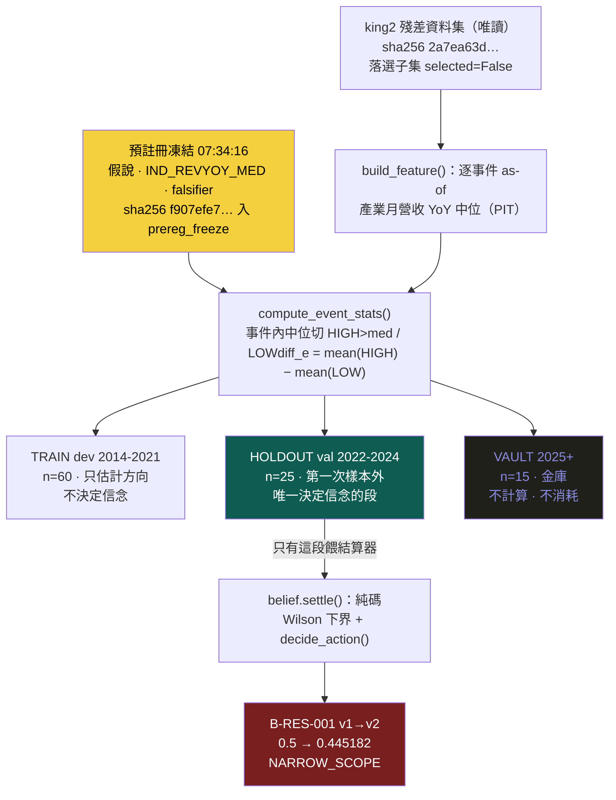

# 實驗 007：king2 殘差第一條世界假說——落選股的產業需求殘差

前面的實驗要嘛評策略（[000](exp-000-engine-first-run.md)～[003](exp-003-graph-evolution.md)）、要嘛驗信念 `settle` 機件本身會不會壞（[004](exp-004-belief-contract.md)，內容是 MIEE 事件假說，不在冠軍決策鏈上）、要嘛還沒開跑（[005](exp-005-king2-prereg.md)／[006](exp-006-cb-router-prereg.md) 都是零臂已跑的預註冊）。**這一輪第一次拿一條「關於真實世界怎麼運作」的假說**，從凍結、純碼結算，一路走到信念更新，把 [研究迴圈](research-loop.md)裡的認知迴圈用**真實世界機制**跑滿一整圈。而它最值得記下來的，不是它成功了——**是它不漂亮，而系統誠實地接受了不漂亮**：樣本外方向對、但不顯著（t=0.73、bootstrap 95% 信賴區間含 0），純碼規則判 `NARROW_SCOPE`（保留並限縮範圍），沒有把一個弱訊號湊成 alpha，也沒解鎖 [EXP-005](exp-005-king2-prereg.md) 的 C 臂。

> 預註冊凍結 **2026-07-23 07:34:16**（`prereg_freeze` 表，sha256 `f907efe7…`）｜信念結算 **07:36:35**（`belief_contract` `ts`）——**凍結早於結算 129 秒，這是防 fishing 的物理證據**｜殘差資料集＝`king2_residuals_dataset.parquet`（sha256 `2a7ea63d…`，唯讀）｜裁決＝`NARROW_SCOPE`（E2）｜信心 0.5 → **0.445182**（Wilson 下界，純碼）｜考卷＝`wm/tests_residual_hypothesis.py`

## 從哪條殘差長出來：陽明 2609 落選卻 +133.6%

這條假說不是憑空想的，是從冠軍的**決策殘差**逼出來的。[現任冠軍制度](champion-challenger.md)把 king2 凍結後，攤開它每次換股的殘差四格（選中×漲跌），其中「**落選卻大漲**（missed_soar）」那一格的榜首是**陽明 2609——落選、但持有窗 +133.6%**。這不是隨機噪音：2020–2021 是航運超級週期，整個航運產業的需求在爆炸，而 king2 當下看不見。

順著這個個案問一句「king2 到底漏看了什麼」，答案指向一個結構性缺口，而不是一次運氣。這正是 [假說引擎](hypothesis-engine.md)的職責：研究問題從冠軍的殘差長出來，不從研究員的靈感長出來。

## 機制動機：king2 的分數是「個股特質的」，看不到產業世界衝擊

king2 給每檔股票打的分數是純個股特質的——`score = (1−0.35)×RK(個股月營收 YoY) + 0.35×(指紋+籌碼)/2`，四道閘（品質／位階／動能／流動性）也全部逐檔算。**它把每檔股票當一個孤立的點打分，沒有任何一項讀「這檔所在的產業，整體需求是不是正在加速」。**

於是航運超級週期這種**產業／世界層的需求衝擊**發生時，會出現一個系統性盲點：個股的月營收 YoY 要落後好幾個月才反映產業需求，而 king2 當下只看得到還沒跟上的個股訊號，就把「身處熱產業、但個股數字還沒發動」的股票排到 top-12 之外。陽明就是這個盲點的旗艦反例。

**機制先驗釘死了方向**：如果這個盲點是真的，那麼落選股裡「所屬產業需求高」的一組，forward 殘差應該**顯著為正**——而且方向必然是 `HIGH > LOW`，不是資料挑出來的，是機制推出來的。

## 預註冊：把假說、特徵、否證條件在跑之前全部寫死

要讓「順著陽明這個個案挖出來的假說」不淪為事後合理化，唯一的辦法是**在看到任何結算數字之前，把整套判準凍結**。這一輪凍結了三樣東西：

**假說（一句話）**：king2 候選池中「落選（四閘＋流動性地板全過、但 `score` 非 top-12）」的股票裡，當時所屬產業的月營收 YoY 中位數高者，持有窗 forward 殘差（對大盤超額）**顯著為正**。

**特徵 `IND_REVYOY_MED`（產業層月營收 YoY 需求，as-of 決策日）**：對每個換股事件日 `d`，用 finlab_db 的 `monthly_revenue:去年同月增減(%)` 面板取索引 ≤ `d` 的**最後一列**（`.loc[:d].iloc[-1]`，嚴格無前視），把各代號的 YoY% 按 `security_categories` 的產業歸屬分組，取**產業中位數**當作該股所處產業的「需求溫度」。

**否證條件（`falsifier`）**：HOLDOUT 段事件級 `diff_e` 的方向命中率，Wilson 95% 上界 ≤ 0.5 且平均 `diff_e` ≤ 0 → `REFUTE`；命中率 ≤ 0.5 或平均 ≤ 0 → `WEAKEN`。**這些門檻寫在跑之前，跑完不准搬。**

凍結靠 `prereg_freeze` 表落地：預註冊檔的 sha256（`f907efe7…`）連同 `frozen_at` 時戳一起 append 進表；之後任何一次改檔，裁決時重算 hash 對不上就被稽核抓到。**這就是防 fishing 的機制——不是靠自律，是靠一個「凍結先於結算」的時戳可以被獨立驗證。**

## 怎麼組成：三段切分，只有 HOLDOUT 有權更新信念



切分沿用 `config.HOLDOUTS` 的凍結邊界，三段各司其職、權責不同：

| 段 | 事件窗 | 事件數 | 角色 |
|---|---|---|---|
| **TRAIN（樣本內）** | dev 2014-01 … 2021-12 | 60 | **只估計方向、報告樣本內效應**——不決定任何信念動作 |
| **HOLDOUT（第一次樣本外）** | validation 2022-01 … 2024-12 | 25 | **唯一決定信念的段**——`confidence_after` 只由這 25 個事件算出 |
| **VAULT（保留）** | 2025-01 以後 | 15 | **金庫，本實驗完全不動用**——保留為下一道獨立樣本外閘 |

這個「只有 HOLDOUT 決定信念」的紀律是整套結算誠實性的地基：方向由機制先驗釘死（§機制動機），TRAIN 只用來看樣本內效應與同號檢查，**信念的信心值只准由第一次真正的樣本外資料產生**。VAULT 連算都不算，留給未來的 walk-forward 當乾淨的第二道閘。

## 演算步驟與純碼結算規則

① `build_feature()` 為落選子集逐事件算 `IND_REVYOY_MED`（as-of 產業月營收 YoY 中位，PIT）；② `compute_event_stats()` 在**每個事件內**以該事件的 `IND_REVYOY_MED` 中位數切 `HIGH`（>中位）/`LOW`（<中位），算 `diff_e = mean(excess|HIGH) − mean(excess|LOW)`、`hit_e = 1 if diff_e>0`（對映預註冊方向 HIGH>LOW），只留兩組皆非空的合格事件——**事件內分組把時間與 regime 控掉**，比較的永遠是同一天同一批落選股裡的兩組；③ `segment_stats()` 按三段切分匯總，得每段的 `n`（合格事件數）、`k`（Σ`hit_e`）、`avg_excess`（`diff_e` 平均）；④ 只把 HOLDOUT 段餵 `belief.settle()`（沿用 [004](exp-004-belief-contract.md) 同一支純函式，零改動），`confidence_after` ＝命中率的 Wilson 95% 下界；⑤ `decide_action()` 由 `(n, k, avg_excess, min_n, lo, hi)` 純碼判動作；⑥ 寫 `belief_contract` 的 v1 先驗列與 v2 結算列，append-only 觸發器擋任何 UPDATE/DELETE。

判「該保留還是該推翻」的邏輯全在 `decide_action()` 這棵純碼決策樹（`min_n=20` 凍結）：

```
n < 20                              → HOLD_PRIOR    證據不足，維持先驗
wilson_hi ≤ 0.5  且  avg_excess ≤ 0 → REFUTE        兩否證子句齊發 → 推翻
wilson_lo > 0.5  且  avg_excess > 0 → REINFORCE     連下界都過基準且效應為正 → 強化
hit_rate ≤ 0.5   或  avg_excess ≤ 0 → WEAKEN        任一否證跡象 → 削弱但存活
其餘（點估計過基準但不顯著）        → NARROW_SCOPE   保留並限縮範圍待更多證據
```

**LLM 在這一步完全沒有涉入**——把 25 個事件的 `(n,k,avg_excess)` 丟進這棵樹，落到哪個枝，就是哪個裁決。

## 過了哪些閘

| 閘 | 內容 | 狀態 |
|---|---|---|
| 凍結先於結算門 | `prereg_freeze(EXP-007).frozen_at` 早於 B-RES-001 v2 的 `ts` | ✅ 過（07:34:16 < 07:36:35，早 129 秒） |
| 重算門 | 重跑結算函式，`n`／`k`／`avg_excess` 與 `belief_contract` 帳上逐欄一致 | ✅ 過（考卷②；獨立手算見下） |
| 證據指針門 | v2 `evidence_ids` 指回真殘差子集：HOLDOUT 事件日存在於凍結 parquet、dataset sha256 一致 | ✅ 過（`2a7ea63d…`） |
| 上游零寫入門 | 王牌線兩檔 sha256 前後不變（＝EXP-005 champion_registry 釘住值） | ✅ 過 |
| 出生標注門 | `wm/residual_hypothesis.py` docstring 首行「標題｜一句話」齊備 | ✅ 過 |
| C 臂解鎖門 | 這條信念是否夠格把 EXP-005 C 臂從 blocked 打開 | ❌ **不夠格**（見裁決，非機件失敗而是證據等級不足） |

前五道全綠證明的是「這套結算制度沒壞、且沒作弊」——**它完全不證明「假說對」**。最後一道刻意標紅：機件全過，不等於證據夠格解鎖真決策。

## 結果：方向對，但不顯著

三段切分逐欄都是 `belief_contract` 查得到的事實：

| 段 | n（事件） | k（命中） | 命中率 | 平均 diff_e | Wilson 下界／上界 | 角色 |
|---|---|---|---|---|---|---|
| **TRAIN**（2014-2021） | 60 | 35 | 0.583 | **+1.487%** | — | 只估計，不決定信念 |
| **HOLDOUT**（2022-2024） | 25 | 16 | **0.640** | **+0.715%** | 0.4452 ／ 0.7975 | **唯一決定信念** |
| VAULT（2025+） | 15 | 13 | 0.867 | +3.211% | — | 未動用（金庫） |

HOLDOUT 這 25 個事件是唯一有裁決權的一段，三個關鍵讀數決定了它的命運：

- **方向對**：命中率 0.64 > 0.5，平均 `diff_e` +0.715% 為正——「產業需求高組殘差更好」這個方向，在第一次樣本外站得住。
- **但不顯著**：25 個事件的 `diff_e` 平均對 0 做 t 檢定，**t=0.73**；10,000 次 bootstrap 的 95% 信賴區間 ≈ **[−1.19%, +2.60%]，跨過 0**。逐年拆開更清楚——2022 年 +1.15%、2024 年 +2.14%，但 **2023 年是 −1.05%**（9 事件裡只有 5 個命中），效應完全不穩定。
- **關鍵的一步：Wilson 下界沒過基準**。命中率 0.64 的樣本雖然點估計漂亮，但 25 個事件的不確定性讓 95% 下界只到 **0.4452 < 0.5**——連下界都過不了擲硬幣基準，`REINFORCE` 的第一個條件（`wilson_lo > 0.5`）就不成立。

## 信念 B-RES-001：0.5 → 0.445，NARROW_SCOPE

把 HOLDOUT 的 `(n=25, k=16, avg_excess=+0.715%)` 丟進 `decide_action()`，走的是這條路徑：`n=25 ≥ 20`（不是 HOLD_PRIOR）→ 上界 0.7975 > 0.5（不是 REFUTE）→ **下界 0.4452 ≤ 0.5（不是 REINFORCE）** → 命中率 0.64 > 0.5 且效應為正（不是 WEAKEN）→ 落到 **`NARROW_SCOPE`**。

信念 **B-RES-001** 於是從 v1 先驗列（`confidence 0.5`、`REGISTERED`、無證據）更新到 v2 結算列：`confidence 0.5 → 0.445182`（Wilson 下界，純碼算，非人填），`update_action = NARROW_SCOPE`。信心**掉了一點**（0.5 → 0.445）——不是因為假說被推翻，是因為「一個點估計為正、但下界過不了基準」的證據，理性的反應就是「留著、限縮範圍、等更多證據」，而不是「相信它」。

這正是這一頁存在的理由。`NARROW_SCOPE` 比 `REINFORCE` 誠實：面對一個「看起來會賺、但統計上撐不住」的訊號，**系統有權拒絕自己的假說**。如果這裡硬把它標成 `REINFORCE`、去解鎖 C 臂，那才是把弱訊號湊成 alpha——而整套預註冊＋純碼結算的存在，就是為了讓那條路走不通。

## 裁決

**B-RES-001 判 `NARROW_SCOPE`、證據等級 E2——既未確認、亦未否證。** 方向在第一次樣本外對了（命中率 0.64、效應為正），但不顯著（t=0.73、bootstrap CI 含 0、Wilson 下界 0.445 < 0.5、2023 年逆向）。這是一個「方向站得住、力道站不住」的結果。

**它不足以真解鎖 [EXP-005](exp-005-king2-prereg.md) 的 C 臂。** C 臂的定義是「冠軍＋**已確認**（confirmed）的世界信念」，而一次第一次樣本外的 E2 結果不是 confirmed；帳上 `REINFORCE` 依舊是 **0**，C 臂維持 `blocked`。要把 B-RES-001 升成 confirmed，需要的是**獨立的 walk-forward**（逐年 PIT、樣本外串接、block-bootstrap 下界 > 0），那是下一道閘，不是這一輪能給的。

決策階梯位置：機制動機成立 → 預註冊凍結（先於結算）→ 純碼結算可重算 → **信念落帳 NARROW_SCOPE ← 在這裡** → 獨立 walk-forward（未做）→ confirmed → C 臂解鎖（未發生）。

一句話收斂：**落選股的產業需求殘差，在第一次樣本外方向對但不顯著（25 事件、命中率 0.64、t=0.73、CI 含 0），信念 B-RES-001 從 0.5 更新到 0.445，判 NARROW_SCOPE——系統沒有把一個弱訊號湊成 alpha。**

## 獨立驗證

- **Wilson 下界手算複核（獨立於模組）**：k=16／n=25 → center 0.62135、margin 0.17617 → lo **0.44518**、hi 0.79752，與存檔 0.445182／0.797523 吻合（差 <1e-4）。`confidence_after` 確實是命中率的 Wilson 95% 下界。
- **裁決路徑獨立重判**：以 `n≥20`、`wilson_hi 0.7975>0.5`、`wilson_lo 0.4452≤0.5`、`hit_rate 0.64>0.5 且 avg_excess>0` 逐條手判，落點＝`NARROW_SCOPE`，與存檔 `update_action` 一致。
- **顯著性獨立重算**：25 個 HOLDOUT `diff_e` 對 0 的 t=0.732；10,000 次 bootstrap 95% CI 跨 0；逐年 2022 +1.15%／2023 −1.05%／2024 +2.14%——三項都由 `king2_residuals_dataset.parquet` 重跑得出。
- **凍結先於結算可稽核**：`prereg_freeze` 的 `frozen_at`＝2026-07-23 07:34:16、`belief_contract` B-RES-001 v2 的 `ts`＝07:36:35，時戳差 129 秒且 sha256 可重算對帳。

重現指令：`cd /media/liao/MyHDD/FOR_AGENT/aaro && /home/liao/finlab_env/bin/python -m wm.residual_hypothesis`（純碼結算）；`/home/liao/finlab_env/bin/python -m wm.tests_residual_hypothesis`（考卷）。

## 誠實邊界（不得省略）

- **一次第一次樣本外＝E2，不是 confirmed。** 即使這次結算是 `REINFORCE`，也不足以解鎖 C 臂——遑論實際只到 `NARROW_SCOPE`。C 臂真解鎖要獨立 walk-forward，這是[信念契約](world-belief-contract.md)刻意設的「誠實的慢路」：confirmed 要撐過的不只一道閘。
- **殘差是研究鏡像，不是真實入選紀錄。** 資料集是研究鏡像重建（承襲上游 `MIRROR_DEVIATIONS`：王牌線 `deploy_logs` 僅 2026-06-29 起，全史殘差只能鏡像重建）。這裡研究的是「king2 規則若照跑會漏掉誰」，不是「king2 當年真的漏掉誰」。
- **`IND_REVYOY_MED` 與個股 `rev_rank` 的共線性未剝離。** 產業月營收 YoY 中位，與 king2 自己就在用的個股月營收 YoY 排名，天然相關。這次沒有把「產業層需求」從「個股層動能」裡乾淨切開——所以就算方向顯著，也還分不清賺的是「世界知識」還是「同一個動能換個包裝」。這要靠後續的控制實驗（把個股 `rev_rank` 當共變量迴歸掉）才說得清，是這條線的下一個問題。
- **產業成員身分用當前快照（輕微成員 look-ahead）。** `security_categories` 是當前快照，非歷史逐時；產業「數值」（月營收 YoY as-of d）嚴格 PIT，但「哪檔屬哪個產業」用了今天的分類。產業成員屬準靜態，影響小，但確實是一個縫。
- **口徑是毛超額，不含手續費／滑價。** `excess` 為對大盤毛報酬超額，與王牌線官方含滑價口徑不互比——這條線量的是「訊號在不在」，不是「扣完成本還賺不賺」。
- **VAULT 看起來很強，但那正是不能偷看的理由。** VAULT（2025+）15 事件命中率 0.867、平均 +3.21%，比 HOLDOUT 好得多——但它**沒有、也不該**進這次結算。一旦拿它來「補強」信心，凍結切分就白做了；它必須留給下一道獨立閘，在那之前它的漂亮數字對本裁決零效力。

延伸：這條殘差怎麼從冠軍決策長出來、殘差四格的完整定義見 [現任冠軍制度](champion-challenger.md)；為什麼「被更新的是信念不是世界」、confirmed 的慢路怎麼設計見 [信念契約](world-belief-contract.md)；這條信念要餵給哪一臂、C 臂為何仍 blocked 見 [實驗 005](exp-005-king2-prereg.md)；研究問題為何只能從殘差長出見 [假說引擎](hypothesis-engine.md)；本輪在三迴圈裡的位置見 [研究迴圈](research-loop.md)；為什麼策略級裸績效量不了這種認知結果、要靠信念層裁判見 [演化的目標](objective.md)；歷次實驗血統見 [實驗索引](exp-index.md)。

---

**被連結自（反向連結）：** [實驗 005：king2 冠軍—挑戰者五臂預註冊（REGISTERED，零臂已跑）](exp-005-king2-prereg.md) · [實驗索引：每一輪真跑，逐環節攤開](exp-index.md)
