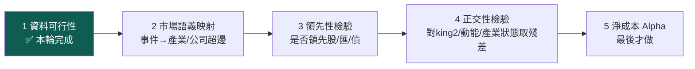

# 實驗 009（預備）：預測市場預期層——E_t[event] 不是 W_t

**這一頁是預備階段記錄，不是實驗結果**：本輪只完成了實驗五步中的第 1 步（資料可行性）＋架構前置（資料源偵察器），**零報酬統計、零家族檢定燃燒**——這是刻意的：Alpha 檢定放在最後一步，前面每一步都可能把這條線誠實地砍掉。

## ⚠ 合規警示（放最前面）

台灣 ISP 對 polymarket.com 網域做 **DNS 攔截**（境外博弈封鎖名單；本機實測本地 DNS 解到非 Cloudflare 的攔截位址、公共 DNS 解到正常位址）。本輪偵察為**唯讀公開市場資料**（官方文件明示無需 API key）、無帳號、無下注、無金流，connector 以公共 DNS 解出的真實 IP 連線（DNS 層繞行）。**「是否日常化使用此資料源」的合規判斷歸 owner**——此事實同步記在資料源登記簿的 compliance 欄，owner 一句話即停用並清資料。

## 定位：Polymarket 補的是世界模型缺的「市場預期」層

owner 裁決的核心定位，一句話：

> **Polymarket ＝ 可觀測的市場預期 E_t[event]，不是世界真實狀態 W_t。**

`p=0.7` 不是「事件真實機率 70%」，是「市場此刻的集體定價」。這正好補上世界模型（W/O/B/P 分離）一直空著的那層——「**市場是否已定價**」從此有了可觀測的代理。它也不該被當成另一個價格技術指標：值得測的不是 `p_t` 本身，而是

```
Signal_t = Δlogit(p_t) × Liquidity × ResolutionQuality × EntityRelevance × Novelty
```

其中 `Δlogit(p_t) = logit(p_t) − logit(p_{t−k})`（k = 1小時／1日／5日），乘上的每一項都是可信度修正：價差太大機率不可靠、深度/OI 區分真實重定價與小額推價、距結算時間、多結果 entropy、跨市場一致性。**市場標題不夠——真正決定語義的是完整裁決規則**（依哪個官方結果、截止時間、例外條款；爭議還可能進 UMA 挑戰程序），所以 connector 把 `description`（裁決規則全文）與 metadata 一併保存。

## 核心假說（凍結於預備階段，Alpha 檢定前不動）

> 與台股產業有**因果機制**的 Polymarket 事件機率變化，能否解釋 king2 尚未解釋的未來報酬——而非重複動能、新聞或大盤風險？

第一輪只選三個有經濟機制的事件族群（不撒網，否則搜尋帳與多重檢定成本爆炸）：①Fed 利率與美國流動性；②關稅、出口管制、半導體政策；③地緣政治、能源與航運中斷。

實驗順序（owner 凍結，**Alpha 最後**）：



統計承諾（沿 exp-008 教訓）：時序高度重疊一律 **Newey-West**＋block bootstrap；每個 market、事件族群、時間尺度都進全域搜尋帳（family=`EXPECTATION_MARKET`）。

## 第 1 步結果：可行性偵察（唯讀、~15 請求、真資料）

| 族群 | 找到市場 | 代表歷史樣本（日頻全程） |
|---|---|---|
| Fed／流動性 | 98 檔 | Fed 決策市場：134 個日點、量 **$2.35 億**、已結算歷史可取 |
| 關稅／晶片政策 | 51 檔 | 「Trump 宣布對中降關稅?」14 點、$140 萬 |
| 地緣／能源／航運 | 42 檔 | **「中國 2024 侵台?」352 個日點**（2024-01→2025-01）、$570 萬；荷姆茲海峽活市場含 bid/ask |

入庫 `data/polymarket.sqlite`：**191 檔市場、100% 含完整裁決規則**、719 個價格點（逐 unix 時戳＝真 PIT）。考卷 10/10（含 Δlogit 手算對照、裁剪防爆、時戳無重複、**零報酬統計紀律**——可行性階段的碼裡連 Sharpe/IC 字樣都不准出現）。

可行性裁決：**技術上可行，帶三個誠實限制**——

1. **單一市場壽命短**（數週到一年）：長面板要**縫接同族群的序列市場**（如逐次 FOMC 會議市場），縫接規則本身要進 prereg（縫法自由度＝作弊面）。
2. **高量宏觀市場約 2024 起**：與 dev tier（2014-2021）完全不重疊——**既有的 dev/validation 切分對這個源不適用**，EXP-009 的 tier 設計要重新 prereg（2024-2025 當研究段？LIVE_FORWARD 當確認段？這是進第 2 步前必須凍結的決定）。
3. **歷史 spread 不可得**（bid/ask 只在活市場）：流動性可信度修正對歷史段要用 volume/OI 代理，或從今天起前向累積。

## 架構產出：資料源偵察器（比 Polymarket 本身更重要）

owner 點名的真缺口：**系統會探索特徵，還不會自主探索資料源**。本輪落地偵察器的帳本層 `wm/source_scout.py`（`source_registry`，append-only＋latest-wins，無證據列即非法），Polymarket 是第一個走完「偵察→評估→記錄」的源；worklist 已種入其餘八個候選（選擇權 IV/skew、Google Trends、航運 AIS、衛星夜光、招聘、App/網站流量、海關進出口、信用隱含），全部 `SOURCE_UNKNOWN` 待偵察。**Polymarket 只是第一個示範，偵察器迴路（圖譜缺口→搜源→評估→connector→特徵→檢驗→回寫）的自動化是後續工作。**

## 誠實邊界（不得省略）

- **本輪零報酬統計**：沒有任何 IC/Sharpe/報酬數字被計算——說「Polymarket 有 Alpha」的證據現在是**零**，只有「資料拿得到、語義保得住」。
- **E_t ≠ W_t 的紀律尚未被檢定**：預期層進圖譜時必須與世界狀態層分開建模（預期變化／意外＝surprise 才是訊號候選），這是第 2 步語義映射的設計約束。
- **合規判斷未決**（見頁首警示）：在 owner 拍板前，這個源停在 `SOURCE_BLOCKED_LOCAL`，不進任何自動排程。
- **偵察量刻意低**（~15 請求）：三族群的市場覆蓋數字是搜尋詞抽樣、非完整枚舉。

延伸：世界模型的 W/O/B/P 分離見 [[world-model|世界模型]]；「市場是否已定價」在病灶清單的位置見 [[research-loop|研究迴圈]]；資料源狀態機見 [[blockers|難點 B1]]；exp-008 的 NW 統計教訓見 [[exp-008-world-alpha|實驗 008]]。
