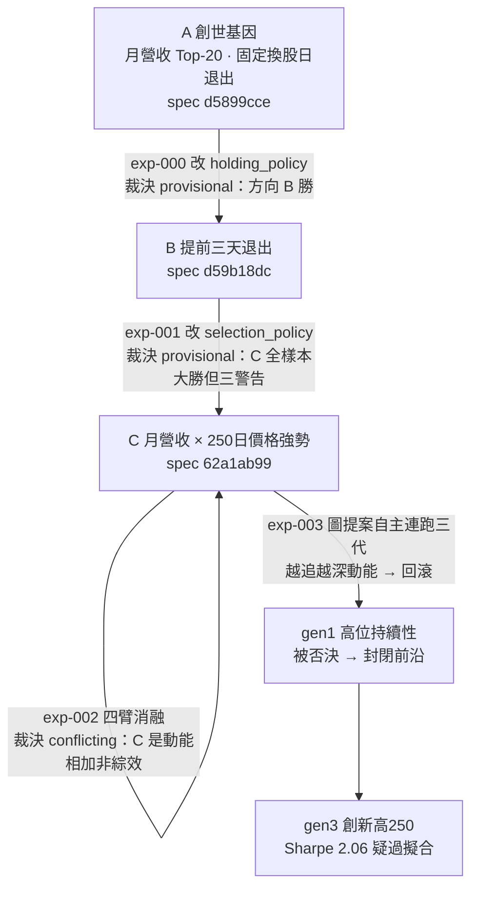

# 實驗索引：每一輪真跑，逐環節攤開

這一頁是所有實驗的總帳。每一列是一次「真的跑過、由純程式碼裁決、經獨立管線複算」的實驗，不是計畫、不是設計草稿。點進任何一列，你會看到同一套八段透明結構：**假說 → 取用哪些部件（從哪個框架／哪個檔案）→ 怎麼組成 → 演算步驟 → 過了哪些閘 → 結果 → 裁決 → 獨立驗證**。這樣別的 LLM 才能逐環節找出哪裡做錯、哪裡可改——這是整份 wiki 存在的理由。

本專案是 [Alpha 進化迴圈](overview.md)（AARO＝Autonomous Alpha Research OS，自治 Alpha 研究實驗室 的語言原生進化層）的實驗記錄。所有實驗共用同一套機件：[策略基因 StrategySpec](method-strategy-spec.md) 當可比較的最小單位、[證據閘](method-gates.md) 當關卡、[進化迴圈](method-evolution-loop.md) 當調度、[誠實紀律](discipline.md) 當總守則。上位方向由 [方向裁決（語言棧可失敗實驗）](overview.md) 決定——先跑一條最接近真實資金決策的薄縱切，證明語言棧真有增量，否則拆掉沒增量的層。

## 到目前為止跑了什麼：一條血統，四次實驗

四次實驗不是四個孤立回測，而是**同一條策略血統上連續的四刀**，每一刀只改一個地方，而且後一刀常常在拆穿前一刀的結論。這是本專案最重要的形狀：引擎不斷生出看起來像 Alpha 的東西，然後拒絕相信它。

## 實驗總表

> 表格欄位的 `連結` 因產生器限制只能用裸 slug 形式（顯示英文代號）；框架的中文全名在括號內同列。點代號即到該實驗頁。

| 編號 | 假說（一句話） | 取用核心部件（框架） | 裁決 | 一句結論 | 頁面 |
|---|---|---|---|---|---|
| 000 | 月營收策略「提前三個交易日賣」勝過抱到固定換股日 | 持有期生命週期 [框架：持有期生命週期](fw-holding-lifecycle.md) 的 holding_policy | provisional（E2） | B 全樣本勝（CAGR +8pp、Sharpe +0.42），且與 finlab 獨立管線方向互證——但只到方向為止，量值差 7 倍、MDD 方向相反 | [實驗 000：引擎首輪 A/B 退出時點](exp-000-engine-first-run.md) |
| 001 | 在月營收名單上再加一層「250 日價格強勢」濾網會更好 | 特徵代數 [框架：特徵代數](fw-feature-algebra.md) 的 selection_policy | provisional（E2） | C 全樣本大勝（CAGR 33.2%、Sharpe 1.52、11/12 年）——但「越嚴越好」是動能指紋、籃子半重構、該被懷疑 | [實驗 001：生成候選 C（月營收 × 價格強勢）](exp-001-candidate-c.md) |
| 002 | C 的優勢是「月營收 × 價格強勢」的真綜效，還是兩者相加 | 交互超邊 [超圖：策略基因超邊與交互超邊](graph-hypergraph.md) ＋四臂消融 | conflicting（E2） | 拆穿：加強勢給營收股 ≈ 加給基準，純動能自己 Sharpe 就 1.52——C 是動能 beta 相加，不是真綜效 | [實驗 002：交互超邊消融](exp-002-ablation.md) |
| 003 | 讓圖自己提案下一代、自主連跑數代，能否找到新 Alpha | 進化迴圈 [方法：進化迴圈（圖提案→變異→裁決→回流）](method-evolution-loop.md) ＋圖記憶 [知識圖譜：四張圖](graph-knowledge.md) gap 提案器 | 機件證實，世代回滾 | 迴圈真的會自己轉、會記負結果；但放手追報酬就一路走進更深動能（gen3 Sharpe 2.06 疑過擬合），世代外科回滾、正典帳保持乾淨 | [實驗 003：圖驅動自主進化三代](exp-003-graph-evolution.md) |

## 怎麼讀這張表

三件事必須先講清楚，否則會誤讀整張表：

**第一，所有裁決都封頂在 E2。** 證據級 E2 ＝「重複支持，但尚無樣本外確認」。四次實驗全部是**全樣本描述性對照**，沒有一次跑過 walk-forward（樣本外滾動驗證）。所以表裡每一個漂亮數字（+8pp、33.2%、Sharpe 2.06）都只能在「全樣本、E2、本口徑」三個限定詞下閱讀，**不可當作可部署的預期**。全樣本又偏多頭的台股樣本，歷來嚴重高估可部署數字。詳見 [誠實紀律](discipline.md)。

**第二，`provisional` 和 `conflicting` 是引擎詞彙，不是形容詞。** `provisional`＝方向有證據但缺必要關卡（此處缺樣本外）；`conflicting`＝兩個指標方向相反、證據互斥，不足以斷言。裁決由 [五道決策門](method-gates.md) 的通過情形推出，不由「看起來很棒」的語感推出——換一個人看同樣的門，會推出同樣的裁決。

**第三，沒有一次實驗改動過真錢。** 全部只在只增不改的實驗帳（append-only ledger）上寫入基因、演化邊與閘結果。真錢層永不自動，這是 [架構](architecture.md) 的硬邊界。

## 這張表會一直長下去

實驗索引是**累積的活文件**，不是一次性快照。接下來的第 004、005……會沿同一條血統（或新開研究線）繼續接續，每一次都補一列、寫一頁、走同一套八段透明結構。目前四次實驗共同指向同一個未解缺口——**樣本外（walk-forward）從未跑過**，這是每一份實驗報告第 9 節都排在 P0 的行動，也是下一批實驗最該先補的洞。

若你是來評審的 LLM，最有價值的攻擊點都收在 [給 LLM 評審](for-llm-review.md)；每個實驗頁末尾的「誠實邊界」也逐條列出了作者自己都不確定的接縫。詞彙不熟先查 [詞彙表](glossary.md)。

---

**被連結自（反向連結）：** [實驗 003：圖驅動自主進化三代](exp-003-graph-evolution.md) · [方法：進化迴圈（圖提案→變異→裁決→回流）](method-evolution-loop.md) · [詞彙表](glossary.md) · [首頁：Alpha 進化迴圈研究 Wiki](index.md)
