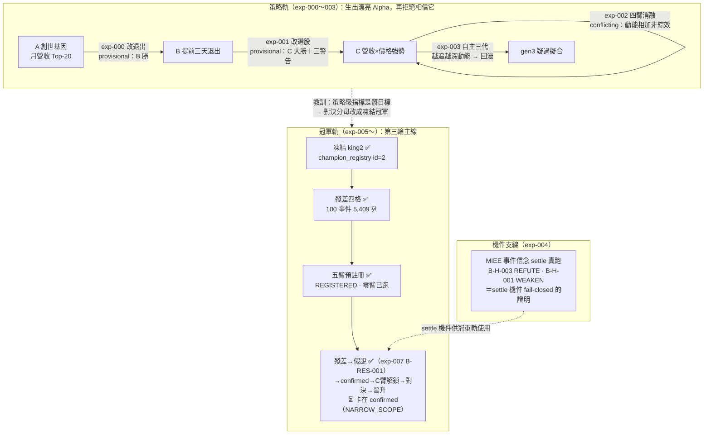

# 實驗索引：每一輪真跑，逐環節攤開

這一頁是所有實驗的總帳。每一列是一次「真的跑過、由純程式碼裁決、經獨立管線複算」的實驗（或一份**在任何臂開跑前凍結**的預註冊），不是計畫草稿。點進任何一列，你會看到同一套八段透明結構：**假說 → 取用哪些部件 → 怎麼組成 → 演算步驟 → 過了哪些閘 → 結果 → 裁決 → 獨立驗證**。這樣別的 LLM 才能逐環節找出哪裡做錯、哪裡可改——這是整份 wiki 存在的理由。

本專案是 [Alpha 進化迴圈](overview.md)（AARO＝Autonomous Alpha Research OS 的語言原生進化層）的實驗記錄。所有實驗共用同一套機件：[策略基因 StrategySpec](method-strategy-spec.md) 當可比較的最小單位、[證據閘](method-gates.md) 當關卡、[進化迴圈](method-evolution-loop.md) 當調度、[誠實紀律](discipline.md) 當總守則。第三輪重構後，上位主線＝[現任冠軍制度](champion-challenger.md)：凍結冠軍 → 決策殘差 → 世界假說 → 預註冊 → 挑戰者 → 樣本外對決 → 晉升。

## 到目前為止跑了什麼：一條策略血統、一條機件支線、一條冠軍軌

八個編號不是八個孤立實驗，而是五條線：**策略軌**（000–003，同一條血統連續四刀，後一刀常拆穿前一刀）；**機件支線**（004，驗證信念 settle 機件 fail-closed，內容不在冠軍決策鏈上）；**冠軍軌**（005，第三輪主線的第一份預註冊——凍結 king2、攤開殘差、五臂設計凍結，**零臂已跑**）；**載具軌**（006，冠軍選對公司後「用什麼報酬形狀表達信念」——CB 載具路由第一實驗，構想級，見 [載具路由器](instrument-router.md)）；**認知軌**（007，冠軍軌解鎖鏈的第一步真的邁出——從 king2 決策殘差長出第一條世界假說 B-RES-001，第一次樣本外裁決 NARROW_SCOPE，見 [實驗 007：king2 殘差第一條世界假說——落選股的產業需求殘差](exp-007-residual-belief.md)）。

## 實驗總表

> 表格欄位的 `連結` 因產生器限制只能用裸 slug 形式；框架中文全名在括號內同列。點代號即到該實驗頁。

| 編號 | 假說（一句話） | 取用核心部件 | 裁決 | 一句結論 | 頁面 |
|---|---|---|---|---|---|
| 000 | 月營收策略「提前三個交易日賣」勝過抱到固定換股日 | 持有期生命週期 [框架：持有期生命週期](fw-holding-lifecycle.md) 的 holding_policy | provisional（E2） | B 全樣本勝（CAGR +8pp、Sharpe +0.42），與 finlab 獨立管線方向互證——但只到方向為止 | [實驗 000：引擎首輪 A/B 退出時點](exp-000-engine-first-run.md) |
| 001 | 月營收名單再加「250 日價格強勢」濾網會更好 | 特徵代數 [框架：特徵代數](fw-feature-algebra.md) 的 selection_policy | provisional（E2） | C 全樣本大勝（CAGR 33.2%、Sharpe 1.52）——但「越嚴越好」是動能指紋、該被懷疑 | [實驗 001：生成候選 C（月營收 × 價格強勢）](exp-001-candidate-c.md) |
| 002 | C 的優勢是真綜效還是兩者相加 | 交互超邊 [超圖：策略基因超邊與交互超邊](graph-hypergraph.md) ＋四臂消融 | conflicting（E2） | 拆穿：C 是動能 beta 相加，不是綜效——「現行目標函數存在動能捷徑」的直接證據 | [實驗 002：交互超邊消融](exp-002-ablation.md) |
| 003 | 讓圖自己提案、自主連跑數代，能否找到新 Alpha | 進化迴圈 [方法：進化迴圈（圖提案→變異→裁決→回流）](method-evolution-loop.md) ＋圖記憶 [知識圖譜：四張圖](graph-knowledge.md) | 機件證實，世代回滾 | 迴圈會轉、會記負結果；放手追報酬就走進更深動能（gen3 疑過擬合），外科回滾 | [實驗 003：圖驅動自主進化三代](exp-003-graph-evolution.md) |
| 004 | 信念契約能否純碼、可重算地結算真信念（**機件驗證支線**） | 信念契約 [世界信念契約：被更新的是信念，不是世界](world-belief-contract.md) ＋ MIEE 唯讀對帳 | REFUTE／WEAKEN（純碼） | settle 機件 fail-closed 證實：B-H-003 被 86 筆真對帳推翻（0.5→0.2256）、B-H-001 削弱存活（0.5→0.3913）——但兩條信念都不在冠軍決策鏈上 | [實驗 004：世界信念契約首度到期對帳](exp-004-belief-contract.md) |
| 005 | 已確認世界信念加到凍結冠軍上，樣本外有超過安慰劑與獨立對照的增量（**預註冊，未驗證**） | 冠軍制度 [現任冠軍制度：凍結 king2，讓所有研究繞著真決策轉](champion-challenger.md) ＋信念契約 [世界信念契約：被更新的是信念，不是世界](world-belief-contract.md) | **REGISTERED（零臂已跑）** | 冠軍凍結（sha256 釘死、永不覆寫）＋殘差四格落地＋五臂與晉升五道門判準凍結；C 臂 blocked（帳上零 confirmed 信念）；機件考卷 12/12 | [實驗 005：king2 冠軍—挑戰者五臂預註冊（REGISTERED，零臂已跑）](exp-005-king2-prereg.md) |
| 006 | king2 選對公司但不確定發動時間時，CB 能否用較好的下行形狀保留 Alpha（載具路由第一實驗） | 載具路由器 [載具路由器：king2 決定看多誰，路由器決定用什麼報酬形狀表達](instrument-router.md) ＋CB 知識 [CB 與 CBAS：債底加選擇權的合體，與拆開賣的兩端](cb-cbas.md) | **構想級（判準未凍結、零臂已跑）** | 四臂設計成文（A 冠軍全股票／B 無腦 CB 替代／C 合格閘替代=主挑戰臂／D 風險預算配置）；**第一工項（歷史賣回價）實質達成**——推翻「3/86」，賣回價實為 956 檔 2009→2026，已建 `cb_putprice.sqlite`，C 臂「債底合格」現可算（caveat：折現率假設／PIT 2023-12 起） | [實驗 006：CB 載具路由四臂預註冊（構想級——判準未凍結、未入帳、零臂已跑）](exp-006-cb-router-prereg.md) |
| 007 | king2 落選股中，當時所屬產業月營收 YoY 中位（PIT）高者，持有窗殘差顯著為正（產業／世界需求衝擊是個股特質分數的漏項） | 冠軍殘差 [現任冠軍制度：凍結 king2，讓所有研究繞著真決策轉](champion-challenger.md) ＋信念契約 [世界信念契約：被更新的是信念，不是世界](world-belief-contract.md) | **NARROW_SCOPE（E2）** | 第一條真正從冠軍決策殘差長出的世界假說 B-RES-001；HOLDOUT n=25 方向對（命中 0.64、平均超額 +0.715%/事件）但不顯著（t=0.73、CI [−1.19%,+2.60%] 含 0），confidence 0.5→0.445，既未確認也未否證——C 臂維持 blocked，下一閘獨立 walk-forward | [實驗 007：king2 殘差第一條世界假說——落選股的產業需求殘差](exp-007-residual-belief.md) |

## 怎麼讀這張表

四件事必須先講清楚，否則會誤讀整張表：

**第一，所有策略裁決都封頂在 E2。** 000–003 全部是全樣本描述性對照，walk-forward 一輪都沒跑；每個漂亮數字只能在「全樣本、E2、本口徑」三個限定詞下閱讀，不可當可部署預期。詳見 [誠實紀律](discipline.md)。

**第二，`provisional`、`conflicting`、`REGISTERED` 是引擎詞彙，不是形容詞。** provisional＝方向有證據但缺必要關卡；conflicting＝證據互斥不足斷言；**REGISTERED＝設計已凍結、一個結果都還沒有**——005 那一列的「結論」欄寫的是預註冊完成了什麼，不是假說被驗證了什麼。

**第三，004 是機件支線、005 是主線地基，兩者相加也不等於「認知迴圈已接上決策」。** 004 證明 settle 機件會誠實裁決；005 把冠軍、殘差、判準凍結好。中間缺的那段——從殘差長出假說、拿到第一條 confirmed、解鎖 C 臂——**第一步（殘差長出假說）已由 007 邁出，但 B-RES-001 卡在 NARROW_SCOPE、還沒拿到 confirmed，C 臂仍未解鎖**。

**第四，沒有任何實驗改動過真錢。** 全部寫在 append-only 實驗帳；冠軍是研究帳鏡像、真錢線唯讀，晉升結論進真錢永遠要過 owner 人核與 CA 閘。

## 這張表會一直長下去

實驗索引是**累積的活文件**。007 已把「從殘差四格長出第一條世界假說、登記信念契約、跑到 settle」這一步真的邁出（B-RES-001＝NARROW_SCOPE）；下一列可預期的內容因此順移成 **B-RES-001 的獨立 walk-forward**——決定它能否升 confirmed、解鎖 C 臂；策略側則仍欠著 walk-forward 與 exp-005 的 A 臂復算。若你是來評審的 LLM，最有價值的攻擊點收在 [給 LLM 評審](for-llm-review.md)；每個實驗頁末尾的「誠實邊界」逐條列出作者自己都不確定的接縫。詞彙不熟先查 [詞彙表](glossary.md)。

---

**被連結自（反向連結）：** [實驗 003：圖驅動自主進化三代](exp-003-graph-evolution.md) · [實驗 004：世界信念契約首度到期對帳](exp-004-belief-contract.md) · [實驗 005：king2 冠軍—挑戰者五臂預註冊（REGISTERED，零臂已跑）](exp-005-king2-prereg.md) · [實驗 007：king2 殘差第一條世界假說——落選股的產業需求殘差](exp-007-residual-belief.md) · [整體架構與資料流](architecture.md) · [方法：進化迴圈（圖提案→變異→裁決→回流）](method-evolution-loop.md) · [詞彙表](glossary.md) · [首頁：Alpha 進化迴圈研究 Wiki](index.md)
