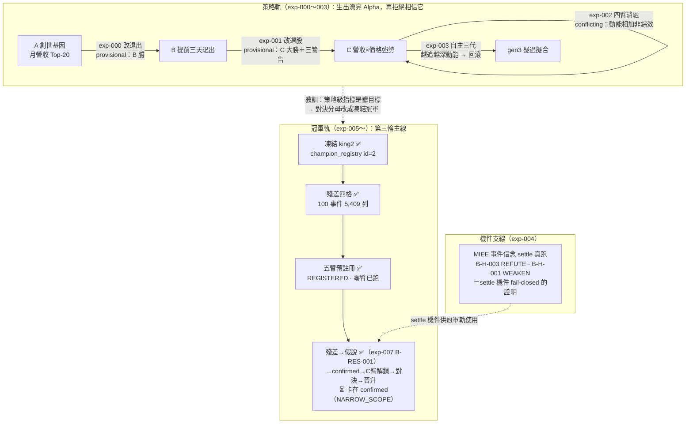

這一頁是所有實驗的總帳。每一列是一次「真的跑過、由純程式碼裁決、經獨立管線複算」的實驗（或一份**在任何臂開跑前凍結**的預註冊），不是計畫草稿。點進任何一列，你會看到同一套八段透明結構：**假說 → 取用哪些部件 → 怎麼組成 → 演算步驟 → 過了哪些閘 → 結果 → 裁決 → 獨立驗證**。這樣別的 LLM 才能逐環節找出哪裡做錯、哪裡可改——這是整份 wiki 存在的理由。

本專案是 [[overview|Alpha 進化迴圈]]（AARO＝Autonomous Alpha Research OS 的語言原生進化層）的實驗記錄。所有實驗共用同一套機件：[[method-strategy-spec|策略基因 StrategySpec]] 當可比較的最小單位、[[method-gates|證據閘]] 當關卡、[[method-evolution-loop|進化迴圈]] 當調度、[[discipline|誠實紀律]] 當總守則。第三輪重構後，上位主線＝[[champion-challenger|現任冠軍制度]]：凍結冠軍 → 決策殘差 → 世界假說 → 預註冊 → 挑戰者 → 樣本外對決 → 晉升。

## 到目前為止跑了什麼：一條策略血統、一條機件支線、一條冠軍軌

八個編號不是八個孤立實驗，而是五條線：**策略軌**（000–003，同一條血統連續四刀，後一刀常拆穿前一刀）；**機件支線**（004，驗證信念 settle 機件 fail-closed，內容不在冠軍決策鏈上）；**冠軍軌**（005，第三輪主線的第一份預註冊——凍結 king2、攤開殘差、五臂設計凍結，**零臂已跑**）；**載具軌**（006，冠軍選對公司後「用什麼報酬形狀表達信念」——CB 載具路由第一實驗，構想級，見 [[instrument-router|載具路由器]]）；**認知軌**（007，冠軍軌解鎖鏈的第一步真的邁出——從 king2 決策殘差長出第一條世界假說 B-RES-001，第一次樣本外裁決 NARROW_SCOPE，見 [[exp-007-residual-belief]]）。

## 實驗總表

> 表格欄位的 `[[連結]]` 因產生器限制只能用裸 slug 形式；框架中文全名在括號內同列。點代號即到該實驗頁。

| 編號 | 假說（一句話） | 取用核心部件 | 裁決 | 一句結論 | 頁面 |
|---|---|---|---|---|---|
| 000 | 月營收策略「提前三個交易日賣」勝過抱到固定換股日 | 持有期生命週期 [[fw-holding-lifecycle]] 的 holding_policy | provisional（E2） | B 全樣本勝（CAGR +8pp、Sharpe +0.42），與 finlab 獨立管線方向互證——但只到方向為止 | [[exp-000-engine-first-run]] |
| 001 | 月營收名單再加「250 日價格強勢」濾網會更好 | 特徵代數 [[fw-feature-algebra]] 的 selection_policy | provisional（E2） | C 全樣本大勝（CAGR 33.2%、Sharpe 1.52）——但「越嚴越好」是動能指紋、該被懷疑 | [[exp-001-candidate-c]] |
| 002 | C 的優勢是真綜效還是兩者相加 | 交互超邊 [[graph-hypergraph]] ＋四臂消融 | conflicting（E2） | 拆穿：C 是動能 beta 相加，不是綜效——「現行目標函數存在動能捷徑」的直接證據 | [[exp-002-ablation]] |
| 003 | 讓圖自己提案、自主連跑數代，能否找到新 Alpha | 進化迴圈 [[method-evolution-loop]] ＋圖記憶 [[graph-knowledge]] | 機件證實，世代回滾 | 迴圈會轉、會記負結果；放手追報酬就走進更深動能（gen3 疑過擬合），外科回滾 | [[exp-003-graph-evolution]] |
| 004 | 信念契約能否純碼、可重算地結算真信念（**機件驗證支線**） | 信念契約 [[world-belief-contract]] ＋ MIEE 唯讀對帳 | REFUTE／WEAKEN（純碼） | settle 機件 fail-closed 證實：B-H-003 被 86 筆真對帳推翻（0.5→0.2256）、B-H-001 削弱存活（0.5→0.3913）——但兩條信念都不在冠軍決策鏈上 | [[exp-004-belief-contract]] |
| 005 | 已確認世界信念加到凍結冠軍上，樣本外有超過安慰劑與獨立對照的增量（**預註冊，未驗證**） | 冠軍制度 [[champion-challenger]] ＋信念契約 [[world-belief-contract]] | **REGISTERED（零臂已跑）** | 冠軍凍結（sha256 釘死、永不覆寫）＋殘差四格落地＋五臂與晉升五道門判準凍結；C 臂 blocked（帳上零 confirmed 信念）；機件考卷 12/12 | [[exp-005-king2-prereg]] |
| 006 | king2 選對公司但不確定發動時間時，CB 能否用較好的下行形狀保留 Alpha（載具路由第一實驗） | 載具路由器 [[instrument-router]] ＋CB 知識 [[cb-cbas]] | **構想級（判準未凍結、零臂已跑）** | 四臂設計成文（A 冠軍全股票／B 無腦 CB 替代／C 合格閘替代=主挑戰臂／D 風險預算配置）；**第一工項（歷史賣回價）實質達成**——推翻「3/86」，賣回價實為 956 檔 2009→2026，已建 `cb_putprice.sqlite`，C 臂「債底合格」現可算（caveat：折現率假設／PIT 2023-12 起） | [[exp-006-cb-router-prereg]] |
| 007 | king2 落選股中，當時所屬產業月營收 YoY 中位（PIT）高者，持有窗殘差顯著為正（產業／世界需求衝擊是個股特質分數的漏項） | 冠軍殘差 [[champion-challenger]] ＋信念契約 [[world-belief-contract]] | **NARROW_SCOPE（E2）** | 第一條真正從冠軍決策殘差長出的世界假說 B-RES-001；HOLDOUT n=25 方向對（命中 0.64、平均超額 +0.715%/事件）但不顯著（t=0.73、CI [−1.19%,+2.60%] 含 0），confidence 0.5→0.445，既未確認也未否證——C 臂維持 blocked，下一閘獨立 walk-forward | [[exp-007-residual-belief]] |
| 008 | 報酬的橫斷面資訊藏在**世界層**（產業營收狀態的水位/加速度/擴散度/陽明落後機制），非只在個股層 | 世界鏈 [[graph-native]] ＋確認閘機件 ＋搜尋帳 Bonferroni | **全 BLOCKED（誠實負結果）** | 第一次用世界模型找 Alpha：dev 四候選全強顯著（t=5.8~16.5，W_BREADTH 八年年年非負）→ prereg 凍結 → validation 全歸零、零挑戰者——**世界層訊號 regime 相依**（2022 升息後死掉）是本輪買到的真世界知識；W_LAGGARD（陽明機制）橫斷面均值反向＝個案敘事≠均值行為 | [[exp-008-world-alpha]] |
| 009 | 與台股產業有因果機制的 Polymarket 事件機率變化（Δlogit×可信度），能否解釋 king2 未解釋報酬（**預備：只完成第1步可行性，零報酬統計**） | 資料源偵察器＋ExpectationMarketSource | **預備級（可行性✅）** | E_t[event]≠W_t 定位凍結；三族群 98/51/42 檔市場、191檔100%含裁決規則、已結算市場全程日頻歷史可取（中國侵台2024=352點）；合規=台灣DNS攔截誠實記錄歸owner；三限制=單市場短命要縫接/宏觀市場2024起tier要重設計/歷史spread不可得 | [[exp-009-expectation-layer]] |
| F01 | 法人變化型特徵是否只是完整 king2 籌碼分數的換皮（**主線改向第一實驗：不追 Sharpe 只清換皮,零前瞻報酬**） | 完整king2節點 [[exp-f01-king2-overlap]] ＋DataContract＋FeatureSpec＋def/evi 分圖 | **重疊圖完成（F01.1 修正口徑）** | 完整king2逐字重建並對parquet 2500格對帳0超差;11法人特徵=**10 LOW_OBSERVED_OVERLAP＋1 PARTIAL＋0換皮**（F01.1 改名:低相關≠增量）;符號一致0.87–1.0、非線性OOF R²≤0.090=非換皮藏;最大重疊7/11落chip(經濟合理)且零SIZE_PROXY;def_edge 60邊＋evi_edge 11邊＋[證物包](https://github.com/Baboonbrother/alpha-evolution-wiki/tree/main/evidence/F01)——法人流=**值得進殘差辨識的低重疊候選軸**,是否有增量=F02 | [[exp-f01-king2-overlap]] |
| F02 | 把法人特徵加進**完整 king2 base model**,能否在樣本外更準辨識 king2 的錯誤（假陽性=入選後大跌/漏網=落選後大漲）——incremental test 非單特徵顯著性 | 殘差辨識 walk-forward＋圖查詢候選＋prereg 872ebadf | **雙 NOT_DETECTED_UNDER_F02_SPEC（F02.1 降級,家族未封）** | 6折walk-forward(訓練窗門檻/embargo/grouped split):base本身有辨識力(PR-AUC 0.16–0.34 vs 盛行率0.08–0.25≈1.5–2×lift),加11法人特徵**未偵測到樣本外增量**(T1 meanΔPR-AUC−0.003、log loss 5/6折變差;T2 −0.012、1/6折正);合成檢定力雙向證明機器有效(真訊號判INCREMENTAL/純雜訊不誤判)——證明「這個鏟法沒挖到礦」非「山裡沒礦」(無CI/等效區間;all-11稀釋/固定λ/共線四成因分不開);spec綁定六欄,統計補強收進矩陣引擎;**base=AARO鏡像非live王牌king1,見冠軍身分對帳** | [[exp-f02-residual-discrimination]] |

## 怎麼讀這張表

四件事必須先講清楚，否則會誤讀整張表：

**第一，所有策略裁決都封頂在 E2。** 000–003 全部是全樣本描述性對照，walk-forward 一輪都沒跑；每個漂亮數字只能在「全樣本、E2、本口徑」三個限定詞下閱讀，不可當可部署預期。詳見 [[discipline|誠實紀律]]。

**第二，`provisional`、`conflicting`、`REGISTERED` 是引擎詞彙，不是形容詞。** provisional＝方向有證據但缺必要關卡；conflicting＝證據互斥不足斷言；**REGISTERED＝設計已凍結、一個結果都還沒有**——005 那一列的「結論」欄寫的是預註冊完成了什麼，不是假說被驗證了什麼。

**第三，004 是機件支線、005 是主線地基，兩者相加也不等於「認知迴圈已接上決策」。** 004 證明 settle 機件會誠實裁決；005 把冠軍、殘差、判準凍結好。中間缺的那段——從殘差長出假說、拿到第一條 confirmed、解鎖 C 臂——**第一步（殘差長出假說）已由 007 邁出，但 B-RES-001 卡在 NARROW_SCOPE、還沒拿到 confirmed，C 臂仍未解鎖**。

**第四，沒有任何實驗改動過真錢。** 全部寫在 append-only 實驗帳；冠軍是研究帳鏡像、真錢線唯讀，晉升結論進真錢永遠要過 owner 人核與 CA 閘。

## 007 之後：無人選題迴圈與兩件防作弊基礎

007 證明「殘差→假說→對帳」鏈路可通，但那一輪的選題與機制全是人做的（搜尋帳記 `autonomous=0`）。之後補的不是第八個編號實驗，而是讓**第二套（冠軍認知迴圈）自己轉**的基礎建設與第一次無人選題真跑，記在 [[autonomous-research|自主研究]]：

- **不可偷看的資料金庫**（`wm/vault.py`）：把樣本外分段釘進 append-only 狀態機，只有 `SEALED` 段可授 confirmed。king2 殘差四段裡歷史三段已全 `EXPOSED`（含修掉的 exp-007 wiki 破封），唯一 `SEALED` 是未來累積的 `LIVE_FORWARD`——B-RES-001 的 confirmed 從此只能來自未來。
- **全域搜尋帳**（`wm/search_ledger.py`）：記每輪候選／實測／家族／HOLDOUT 查詢次數，並以 Bonferroni 把「測越多、門檻越高」接進結算，擋「連測一百次挑幸運者」。
- **無人選題迴圈第一次真跑三輪**：純碼選題／去重／資料判定／評分／組特徵／預註冊／結算／決定下一題，只有生機制交 9b；三輪都自轉完成、都誠實判 `HOLD_PRIOR`（切細後每條件只剩 13–17 事件）。**這是知識成功（迴圈能自轉），不是 Alpha 成功。**

## 這張表會一直長下去

實驗索引是**累積的活文件**。007 已把「從殘差四格長出第一條世界假說、登記信念契約、跑到 settle」這一步真的邁出（B-RES-001＝NARROW_SCOPE）；之後又把選題本身接進 agent 閉環（見上）。下一列可預期的內容因此有兩條：**B-RES-001 的獨立 walk-forward**（決定它能否升 confirmed、解鎖 C 臂，但真 confirmed 只能等 LIVE_FORWARD 累積），以及**開放探索線**（與 king2 低相關的新 Alpha 家族，避免只把冠軍越修越複雜）；策略側則仍欠著 walk-forward 與 exp-005 的 A 臂復算。若你是來評審的 LLM，最有價值的攻擊點收在 [[for-llm-review|給 LLM 評審]]；每個實驗頁末尾的「誠實邊界」逐條列出作者自己都不確定的接縫。詞彙不熟先查 [[glossary|詞彙表]]。
