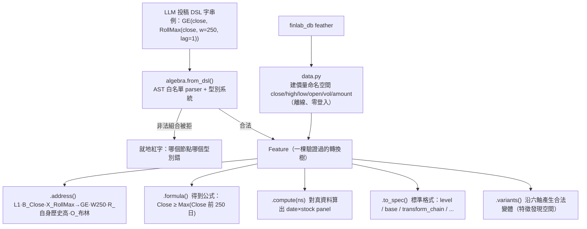

# 特徵代數：一個特徵不是一個名字，是一個完整地址

**特徵代數（Feature Algebra）**是[五層量化語言](lang-quant.md)的最底層文法。它做一件事：把量化特徵從「一串不透明字串」變成「一棵型別化、可組合、可驗證、可運算的轉換樹」。所有上層語言——[世界訊號](fw-world-signal.md)的觀測、[持有期](fw-holding-lifecycle.md)的六組狀態向量、[研究雙語](fw-research-bilingual.md)假說裡的 features 欄——最終都得用它的地址來表達，否則就是散字串、不可 PIT、不可驗算。

服務已上線：systemd 8983，入口 `tailscale /featalg`（tailnet-only），程式碼在 `FOR_AGENT/feature-algebra/`。

## 核心觀察：L（抽象層）只是標籤，真正區分特徵的是 X（Transform）

先看一個會讓人卡住的問題。「創新高、移動平均、報酬率、波動率、分位數」——這幾個特徵，如果只用「抽象層 L」來描述，它們可能全都是 L1 或 L2。但它們的**運算機制完全不同**。所以 L 這個標籤根本沒有區分力：

> 「L 一樣不代表特徵一樣；真正區分它們的是 X（Transform，做了什麼數學轉換）。」

這就是為什麼一個特徵不能只有一個名字或一個層級，而要拆成一個**完整地址**：

```
Feature = B + X + W + R + O           （L 只是抽象深度的標籤，不是完整公式）

  B  Base Input     原始輸入是什麼？     close / high / low / open / vol / amount
  X  Transform      做了什麼運算？       聚合 XA / 關係 XR / 正規化 XN / 時間 XT
  W  Window         用多長的窗口？       250 / 120 / 20 …
  R  Reference      跟什麼基準比較？     自身歷史高 / 自身均線 / 橫斷面同儕 …
  O  Output Type    最後輸出什麼型態？   布林 / 0–1 / 連續 / 計數
```

`X`（轉換算子）是這個地址的靈魂。它分四類：**聚合類 XA**（RollMax/RollMean/RollMin…）、**關係類 XR**（GE/RatioMinus1…）、**正規化類 XN**（MinMaxScale/RankPct…）、**時間類 XT**（TimeSinceEvent…）。同一個 Base 加同一個 Window，換一個 X 就是完全不同的特徵：

| 特徵 | Base | Transform 鏈（X） | Output | 公式 |
|---|---|---|---|---|
| 250 日創新高 | Close | RollMax → GE | 布林 | `𝟙[Close ≥ Max(Close_{t-250:t-1})]` |
| MA250 | Close | RollMean | 連續 | `Mean(Close, 250)` |
| MA250 乖離 | Close | RollMean → RatioMinus1 | 連續 | `Close / Mean(Close, 250) − 1` |
| 250 日區間位置 | Close | RollMin → RollMax → MinMaxScale | 0–1 | `(Close − Min250)/(Max250 − Min250)` |

四個特徵的 B（Close）與 W（250）完全一樣，`L` 也可能一樣——但因為 X 鏈不同，它們是四個機制不同的特徵。這張表就是「L 只是標籤」的直接證明。

## 一個特徵怎麼從 DSL 變成可算的樹

架構的關鍵是：**能被文法建構出來的空間，就是合法特徵空間**。LLM 只投稿一段 DSL 字串，`from_dsl()` 負責驗證＋編譯成一棵轉換樹，非法（元數/窗口/分位/型別錯）就地拒絕：



每棵樹的節點都會**推導 dtype**（型別），非法組合在建構期就被擋——這跟「先讓 LLM 亂寫字串、再用白名單事後過濾」是相反的方向。`.address()`／`.formula()`／`.tree()` 全部由樹結構純程式碼算出，不靠 LLM 判斷；這是「確定性的歸給程式」信條（見 [誠實紀律](discipline.md)）在特徵層的落地。

## PIT 安全靠構造，不靠事後檢查

Point-in-Time（PIT，只用當時真的能知道的資料）在這一層是**靠算子庫的設計保證的**，不是靠檢查器補救：

- 代數裡**沒有任何前視算子**（沒有 `shift(-w)` 這種能偷看未來的操作）。
- `lag=1` 的語意就是「不含當日」——250 日創新高比較的是 `Close_{t-250:t-1}`，不含 t 日自己。
- 洩漏探針（leakage probe）對 12 個種子目錄特徵 F001–F012 全數通過。

要強調的是：這裡保證的是**運算合法**（算子沒有前視），不等於**資訊合法**（那筆觀測在 as-of 時點是否真的以當時形態可得）。後者是資料版本契約的事，特徵代數目前只有運算層 as-of，缺 `ingested_at`／`revised_at`／`source_version` 等欄位——這是方向裁決點名的真缺口，歸 twdata 自建資料線與[時間層](fw-temporal.md)處理（見下方誠實邊界）。

## 沿六軸產生合法變體＝特徵發現空間

`.variants()` 是進化迴圈拿來當「特徵層變異生成器」的關鍵能力：給定一個特徵，沿窗口 W／算子 X／基準 R／輸出 O／門檻／時間軸六個軸，**系統化產生合法的變體**。這讓 [進化迴圈](method-evolution-loop.md)的變異不是「LLM 亂改一句話」，而是「沿代數軸一次改一個座標」——這正是[StrategySpec](method-strategy-spec.md)要求「特徵層的 MOVE 必須落成 B/X/W/R/O 的結構 diff」的底層能力。

## 這一層在哪些真實驗裡被用過

- **[實驗 001](exp-001-candidate-c.md)（生成候選 C）**：候選策略 C 的「250 日價格強勢濾網」，就是用特徵代數組出來的一條可執行、無前視的布林特徵。附錄記錄的真實 DSL 是 `GEc(RankPct(MinMaxScale(close, RollMin(close, w=250), RollMax(close, w=250))), c=0.5)`，地址＝「L3·B_Close·X_RollMin→RollMax→MinMaxScale→RankPct→GEc·W250·R_橫斷面同儕·O_布林」，fid=`2c2ad96b2d0b`。這證明了「用型別化算子組合，能表達真正想要的濾網，且自動帶完整推導樹」。
- **H-DEV2（特徵代數當變異生成器的那一代，AARO 帳內有紀錄）**：示範了「生成器忠實閘」——語言引擎的輸出 vs AARO 命名空間的實際計算，在已知切片上逐位元對帳，相關係數 `corr=1.000000`。這是[十道證據閘](method-gates.md)裡「生成器忠實閘」的原型做法。
- **[實驗 003](exp-003-graph-evolution.md)（圖驅動進化）**：自主迴圈的每一代都在變異特徵代數的算子（換強勢機制：高位持續性→動能 120→創新高 250），三代 genome 互異證明是真變異。但也暴露了一個教訓——放手讓迴圈追報酬，它會一路走進更純的動能暴露（見該實驗的 conflicting 裁決）。

## 誠實邊界

- **資訊版本契約未補**：特徵代數只保證運算層 PIT（算子無前視），缺七時戳資訊合法性契約（`event_time`/`published_at`/`available_at`/`ingested_at`/`revised_at`/`source_version`/`entity_mapping_version`）。拿不齊的欄位在 [資訊合法性閘](method-gates.md)一律標 blocked，不准用現值近似歷史可知值。此契約歸 twdata 資料線。
- **策略層算子不在本層**：特徵代數止於「產橫斷面 panel」，沒有 filter/top_n/weight/rebalance 這些策略層算子——那些是 `speclang/`（引擎 P0 已落地六算子）的新語言，見 [StrategySpec](method-strategy-spec.md)與 [整體架構](architecture.md)。
- **W 軸教訓入檔**：H-DEV2 的對照臂推翻了「窗長軸＝純調參可自動擋」的假設（|Δ|=0.0107 過門檻）——所以變異引擎的自動擋參規則要保守，調參軸不自動立案、但保留受控對照臂，不得寫死「參數軸一律無資訊」。

延伸閱讀：往上一層是把「世界判斷」也語言化的 [世界訊號](fw-world-signal.md)；特徵代數如何被拼進完整策略基因，見 [StrategySpec 九部件](method-strategy-spec.md)。

---

**被連結自（反向連結）：** [實驗 000：引擎首輪 A/B 退出時點](exp-000-engine-first-run.md) · [實驗 001：生成候選 C（月營收 × 價格強勢）](exp-001-candidate-c.md) · [實驗索引：每一輪真跑，逐環節攤開](exp-index.md) · [方法：策略基因（StrategySpec 九部件）](method-strategy-spec.md) · [方法：部件從哪取用、怎麼啟用](method-components.md) · [框架：世界訊號](fw-world-signal.md) · [框架：持有期生命週期](fw-holding-lifecycle.md) · [框架：時間層（時態邏輯節點）](fw-temporal.md) · [框架：研究雙語與認知編譯器](fw-research-bilingual.md) · [知識圖譜：四張圖](graph-knowledge.md) · [研究作業系統：11 層與「別蓋空引擎」](research-os.md) · [研究迴圈：世界→知識→假說→驗證→更新世界模型](research-loop.md) · [總覽：真正該演化的不是策略，是世界模型](overview.md) · [詞彙表](glossary.md) · [質化結構組成語言（總覽）](lang-qual.md) · [量化結構組成語言（總覽）](lang-quant.md) · [首頁：Alpha 進化迴圈研究 Wiki](index.md)
