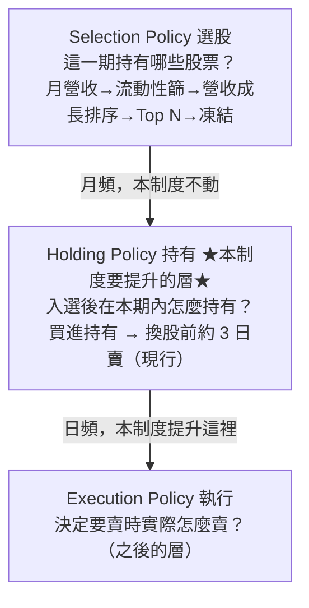

# 持有期生命週期：入選之後，這檔的「剩餘 Alpha」還有多少？

**持有期 Alpha 生命週期（Holding Lifecycle）**是[五層量化語言](lang-quant.md)的第三層，也是整個進化迴圈的 **P0 主場**——方向裁決指定「最接近真實資金決策的薄縱切」就是它（見 [總覽](overview.md)的薄縱切原則）。它回答一個被長期混淆的問題：**月頻選股入選之後、到下次換股之間，什麼時候繼續抱、什麼時候提前退、什麼時候降低曝險？**

權威真相源：`FOR_AGENT/holding-lifecycle/設計書_持有期Alpha生命週期_20260721.md`；機器 schema 在 `schema.py`，驗證閘 `holding_cli.py validate`。

## 最重要的心智模型：選股 vs 持有管理，兩件事分開

你其實一直在做兩件不同的事，過去把它們混在一起了：

- **選股（Selection）**：這個月該持有哪些股票？——月頻，決定持股**身份**，凍結不動。
- **持有管理（Holding）**：某檔入選後，從買進到換股之間怎麼處置？——日頻，觀察持股**狀態**，持續更新。

關鍵釐清是這一句：**加入每日資料，不等於每天重新改持股。** 月頻決定持股身份（在不在籃子裡，凍結）＋ 日頻觀察持股狀態（現在該全額持有、減碼、退出還是等待）。籃子凍結是整個制度的地基紅線——日頻是持有管理層，**不是第二套選股系統**。

所以一個完整策略拆成三層：

要提升的只有中間那層。現行「換股前約 3 天賣」很可能已經是好基準——所以真正值得研究的**不是**讓模型每天重新選股，而是把「持有期內狀態怎麼演化」描述得更精準，找出 Alpha 何時成熟、衰退或失效。

## 持有狀態向量 H_t：六組，各回答一個問題

某檔股票入選後，每天替它建一個持有狀態向量 `H_t`，拆成六組。每一組的每個特徵，都應該寫成 [特徵代數](fw-feature-algebra.md)的 `B+X+W+R+O` 地址（可組合、可 PIT、可驗算）：

| 組 | 回答的問題 | 代表特徵 |
|---|---|---|
| **① temporal 時間位置** | Alpha 出現在持有期前段/中段/尾段？ | `days_since_entry` `days_to_next_rebalance` `fraction_of_holding_cycle` `days_since_revenue_release` |
| **② price_path 價格路徑** | 不只看今天在哪，看它「怎麼走到今天」 | `return_since_entry` `drawdown_from_post_entry_peak` `trend_consistency` `new_high_count` `failed_breakout_count` |
| **③ signal_lifecycle 訊號生命週期** | 當初選它的理由還在增強嗎？ | `revenue_yoy` `revenue_acceleration` `signal_age` `signal_decay` `fundamental_confirmation` |
| **④ pricing_state 市場定價** | 這個利多被市場交易到什麼程度了？ | `price_response_to_signal` `valuation_expansion` `crowding` `peer_relative_performance` |
| **⑤ failure 失效與危險** | 這是「一般雜訊下跌」還是「假說失效」？ | `breakdown` `market_regime_shift` `fundamental_contradiction` `liquidity_deterioration` |
| **⑥ tradability 可交易性** | 即使該賣，實際賣不賣得掉？ | `position_to_adv` `estimated_slippage` `days_needed_to_exit` `limit_up_down_risk` |

第②組的意義最容易被低估：兩檔都累積 +10%，一檔緩漲、一檔先漲 25% 再回落——只看「今天在哪」（+10%）會判成一樣，看「怎麼走到今天」才知道持有狀態完全不同。第⑤組專門區分兩種下跌，不分清楚，每日管理就退化成追漲殺跌。

## 結果不能只有一個數：剩餘 Alpha

如果研究只證明「提前賣報酬更高」，那不夠。對每個 `H_t`，要研究的是一整個**未來結果向量 O_t**（未來 1 日/3 日/到換股日報酬、最大漲幅/最大回撤、正報酬機率、贏大盤機率、風險/流動性調整後報酬）。把它濃縮成一個概念——**剩餘 Alpha（Residual Alpha）**：

> Residual Alpha_t ＝ 從今天繼續持有到排程退出日的期望報酬。

於是每日研究的問法從「明天會漲還是跌」升級成「這檔股票的剩餘 Alpha 還有多少」。這是整個制度的認知主軸。

## 從「固定提前三天」升級為退出狀態機 H0–H5

現行規則等於只用了一個變數 `days_to_rebalance <= 3`。但不要一步跳到黑箱函數——先做成**可理解的退出狀態 H0–H5**（先狀態化再函數化）：

| 狀態 | 含義 | 預設動作 |
|---|---|---|
| **H0** Alpha 未展開 | 剛入選，價格尚未反映 | `HOLD` |
| **H1** Alpha 展開中 | 基本面與價格同步確認 | `HOLD` |
| **H2** Alpha 成熟 | 已有主要漲幅，剩餘報酬下降 | `REDUCE`（減碼） |
| **H3** Alpha 衰退 | 訊號老化、價格轉弱 | `EXIT_EARLY`（提前退出） |
| **H4** 假說失效 | 發生明確反證 | `INVALIDATE`（因假說失效退出） |
| **H5** 週期到期 | 接近固定換股日 | `EXIT_SCHEDULED`（排程退出） |

**你的「提前三天」其實就是 H5。** 要研究的核心問題是：**能不能用 H0–H4 補充 H5，而不是取代月頻策略？** 五個持有動作（`HOLD`/`REDUCE`/`EXIT_EARLY`/`EXIT_SCHEDULED`/`INVALIDATE`）就是狀態機的輸出詞彙。

## 三個該做的研究（是實驗設計，不是已有結論）

1. **Q1 剩餘 Alpha 曲線**：對所有歷史入選股票，畫「入選第 1–20 天，每天繼續持有到換股日的平均報酬」。
2. **Q2 條件化剩餘 Alpha**：把「倒數 N 天」再切成不同狀態（已大漲高位轉弱／尚未上漲但基本面強／剛突破／假說失效），各自的剩餘報酬。
3. **Q3 退出規則比較**：A 固定換股日／B 固定提前三天／C 狀態式提前退出／D 狀態式退出＋最晚提前三天，比 CAGR/Sharpe/MDD/勝大盤/換手/流動性。設計書預期**最後很可能是 D 最好**——平常固定持有、明確失效才提前退、無論如何最晚換股前三天退，保留月頻穩定性又加入有限度日頻智慧。

## 已真跑：研究問題一（已用 finlab 套件獨立驗證）

這一層不是紙上談兵——Q1 已於 2026-07-22 真跑並經 finlab 套件覆核（用真還原股價＋月營收 YoY 重建月頻策略：Top-20、流動性前 70%、2015–2026、138 期換股、PIT 安全）：

- **入選後 1–11 天大多是雜訊**，沒有平滑的 alpha 衰退曲線；扣掉市場的負報酬幾乎**全集中在「換股日當天」那一根**，跨 N（10/20/30/50）與時期都穩定。
- 這一根的下跌**幾乎全來自「新一期營收轉弱」的股票**——機制＝訊號生命週期失效（`signal_decay`）在退出日兌現＝**H4 假說失效**，不是「持有太久自然衰退」。新營收在換股日已公告、隔天才跌 → PIT 安全可交易。
- **finlab 官方資料重算**：退出日效應顯著——退出日 **−21bps（t=−3.92）**、新營收轉弱股 **−87bps（t=−7.69）**、仍強股 −6.6bps 不顯著。（手算是 −30bps，略偏大，以 finlab 的 −21bps 為準。）
- **含成本回測**：「提前三天出場」vs「抱到換股日」——**提前三天淨勝**：CAGR 7.43%→8.60%（+1.17pp）、Sharpe 0.40→0.49（MDD −43%→−45% 略升）。淨賺門通過。

**裁決**：五道研究門過四（效應存在／成因定位／PIT 安全／簡單規則淨賺 過；精準版 C「只出轉弱股」未回測，全樣本外級未過）。現行「提前三天」經 finlab 引擎背書可繼續用。

## 這一層在真實驗裡怎麼被用

- **[實驗 000](exp-000-engine-first-run.md)（引擎首輪 A/B 退出時點）**：策略引擎把現行月營收策略寫成創世基因，只變異「退出時點」一個部件生出子代——策略 A（抱到換股日）vs 策略 B（提前三天＝H5）。B 大勝（CAGR 20.22% vs 12.25%、Sharpe 1.08 vs 0.66、10/12 年勝），且與本層 Q1 的 finlab 版**方向互證成立**（限 CAGR/Sharpe）。這是兩條完全獨立管線都得到「提前三天較好」——正是進化迴圈「證據歸屬分離」想要的互證形態。
- **[實驗 001](exp-001-candidate-c.md)（候選 C）**：候選 C 沿用了本層的「提前三天退出（H5）」作為 holding_policy，只變異選股——證明持有規則可以被凍結、當作其他變異的乾淨背景。

## 誠實邊界

- **只有 Q1 真跑過**：Q3 的退出規則 A/B/C/D 完整比較（尤其 C「只精準出轉弱股」是否勝 B）、換股日下跌拆「賣壓 vs 資訊」、**樣本外 walk-forward** 都**還沒做**，且刻意不虛構。
- **量值不可跨管線引用**：[實驗 000](exp-000-engine-first-run.md) 的 B 多賺約 8pp，Q1 版只多 1.17pp——量值差 7 倍源自股票池與成本口徑不同，只有**方向**互證；**MDD 方向兩管線相反**（本輪 B 較淺、Q1 版 B 較深），「提前賣回撤較小」不成立為穩健結論。證據級封頂 E2（重複支持、尚無樣本外確認），provisional、不改真錢。
- **不虛構門檻**：最佳提前天數、H 狀態分類界線、剩餘 Alpha 估計式，都要研究得出——這條也寫進了 `schema.py`：機器 schema 只放已定義的結構，分類器與門檻**留白**。
- **不做黑箱**：先狀態化（H0–H5）再函數化成 Exit Score，那是後話。
- **Alpha 生命週期 ≈ 世界訊號九態（待驗證）**：本層的六階生命週期（訊號出生→市場辨識→價格展開→成熟→衰退→到期）與 [世界訊號](fw-world-signal.md)九態都在描述「定價生命週期」，只是尺度不同（事件 vs 持股期），**是否嚴格同構待驗證**。

延伸閱讀：這一層的結果（剩餘 Alpha）是 [研究雙語](fw-research-bilingual.md)評估四層與失效字典要量測、裁決的對象；退出決策的報告一律走 [固定認知順序報告](fw-research-bilingual.md)，用過門制而不是「該賣了」這種形容詞。時間位置向量（第①組）如何升級為[時間層](fw-temporal.md)的相對時間特徵，見時間層。

---

**被連結自（反向連結）：** [實驗 000：引擎首輪 A/B 退出時點](exp-000-engine-first-run.md) · [實驗 001：生成候選 C（月營收 × 價格強勢）](exp-001-candidate-c.md) · [實驗索引：每一輪真跑，逐環節攤開](exp-index.md) · [方法：策略基因（StrategySpec 九部件）](method-strategy-spec.md) · [方法：部件從哪取用、怎麼啟用](method-components.md) · [框架：世界訊號](fw-world-signal.md) · [框架：時間層（時態邏輯節點）](fw-temporal.md) · [框架：特徵代數](fw-feature-algebra.md) · [框架：研究雙語與認知編譯器](fw-research-bilingual.md) · [總覽：從一個念頭到一台會拒絕相信自己的引擎](overview.md) · [詞彙表](glossary.md) · [量化結構組成語言（總覽）](lang-quant.md) · [首頁：Alpha 進化迴圈研究 Wiki](index.md)
