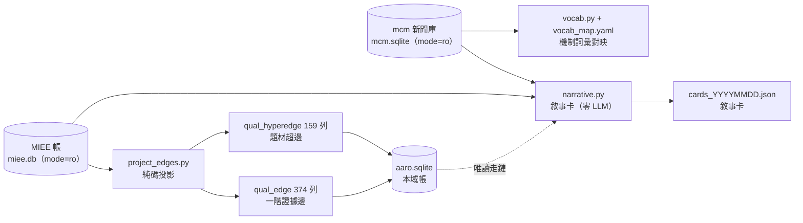

# 質化引擎：把新聞投影成帶證據的圖與敘事卡

## 這頁在講什麼

[質化結構組成語言（總覽）](lang-qual.md) 講的是新聞四層的「為什麼」與「該分開」；這頁講**已經真跑落地的那一小塊**——2026-07-22 產出的 `qual/` 模組。它做了四件事，全部**零 LLM、對策略/裁決表零寫入、上游全程唯讀**：

1. **qual_edge**：從 MIEE 帳純碼投影出一階「事件→資產」證據邊（374 列）。
2. **qual_hyperedge**：從凍結快照投影出題材超邊（159 條）。
3. **敘事卡**：每檔資產一張「我到底買了什麼」的 JSON 卡。
4. **機制詞彙對映**：mcm 的機制詞 ↔ [世界訊號](fw-world-signal.md)的機制詞的人核對映表。

其中 MIEE＝市場訊息演化引擎、mcm＝股市新聞管線（market-cognition）——兩者都是既有真跑系統，質化引擎只用 `file:...?mode=ro` URI 唯讀連線，**永不寫入上游**（`db_qual.py` 把兩條唯讀連線字串寫死成常數，考卷 grep 級認這兩行）。

## qual_edge：事件→資產的一階證據邊

**形狀沿 OCM**（組織圖譜，全機最完整的「帶證據帶時效」二元邊實作）的 typed edge：`src / rel / dst / valid_from / valid_to / evidence / status / source`。投影規則是純碼：讀 MIEE `market_mapping`（`approved=1` 人核過的）JOIN `event`，`src=event:事件id`、`rel=relation_type`、`dst=asset:代號`、`valid_from=event.announced_at`。

三個設計判斷值得注意：

- **內容尋址**：`edge_id = sha256(正規化內容)[:16]`。同內容重跑必得同 id，`INSERT OR IGNORE` 因此冪等；上游變了就長出**新列**（不原地改）。
- **無證據的邊不准存在**：`evidence` 欄有 `CHECK`，必須是**非空 JSON 陣列**（引用 `miee:event:id` 與 `miee:message:id`）。這是 [知識圖譜：四張圖](graph-knowledge.md) 第一鐵律「邊無證據列即非法」的欄位級落地。
- **狀態純碼判定**：`contested → conflicted`；多來源 → `corroborated`；單來源 → `observed`。不由人手填。
- **append-only**：兩個觸發器擋 UPDATE/DELETE——「圖＝帳的投影，改帳不改圖」。整張表可 DROP 後從 MIEE 帳重推，`content_hash()` 逐位元一致（考卷斷言）。

## qual_hyperedge：一筆快照＝一條題材超邊

題材是「多檔股票共同屬於同一敘事」的多元關係，二元邊表達不了，所以用超邊。投影來源＝MIEE `ignition_snapshot`（159 筆凍結快照）：一筆快照就是一條超邊，`kind` 封閉為 `theme/sector`，`members_json` 是成員代號集（原樣照抄、凍結），`heat/breadth` 記快照當下的新聞熱與廣度，`snapshot_ts` 保留原掃描時點。同樣 evidence 非空 CHECK、同樣 append-only。

這條「世界側題材超邊」與 [超圖：策略基因超邊與交互超邊](graph-hypergraph.md) 講的「研究側策略/交互超邊」**分屬不同家族、不得混稱**——世界側描述市場世界（質化引擎地盤），研究側描述研究過程（策略引擎地盤）。

## 敘事卡：每檔資產一張「我買了什麼」

`narrative.py` 為每檔資產產一張 JSON 卡，全部欄位是純碼投影，**LLM 敘事段誠實留 `null`**（標「LLM 敘事層未接」）。一張卡含：

- **事件（帶星級＋錨點引文）**：星級純碼判定（來源數為主、高信心加成、封頂 5★）；每個事件宣稱附**逐字錨點引文**與 `message_id`，機器可回溯原文（沿 MIEE eventize 的反捏造閘）。
- **mcm 九維分數摘要**：事件證據訊息 → `mcm:feed:id` → `title_scores` 九維平均（含 supply_chain_score）。
- **世界模型鏈**：沿 qual_edge 由 asset 節點反向走傳導路徑（多跳記全路徑）；**走不出就誠實回「尚無邊」**，不虛構。

紀律三條：敘事卡是投影、對策略表零寫入路徑（用 `connect_aaro_ro()` 唯讀）；每宣稱帶錨點 id；LLM 整理不帶任何行動建議語彙。

**15 天歷史的誠實邊界就在這裡最刺眼**：首輪對 20 檔最新籃子（2026-06-10 事件）出卡，只有 **1/20 有內容**（2408 南亞科 3 事件），其餘 19 檔顯示「尚無邊」；另一次對事件數前 12 檔出卡（104 顆錨點可回溯）。稀疏不是 bug，是 mcm 新聞只從 2026-07-07 起收的上游現實。詳見 [實驗 000：引擎首輪 A/B 退出時點](exp-000-engine-first-run.md)。

## 機制詞彙對映：擴圖前的前置件

要把新聞世界模型接上 [世界訊號](fw-world-signal.md)，先得對齊兩套機制詞彙——**mcm 的 M_\*（9 詞）與世界訊號的 M_\*（30 詞）不同源不同名**，全機唯一同名的只有 `M_MARGIN_EXPANSION`（毛利擴張）。`vocab.py` 用純碼查表，紀律極嚴：

- **只有 `exact/approved` 狀態才生效**；`proposed`（語意近似待人核）`map()` **預設不回傳**——不假裝已對上。本輪：1 條 exact 生效、3 條 proposed 待人核、其餘 unmapped 誠實列出。
- **全覆蓋校驗**：mcm 每個實際詞要嘛在 mappings、要嘛在 unmapped，**沉默漏掉即報錯**（`verify()` 吃這個）。例如 `M_MARGIN_COMPRESSION`（毛利壓縮）誠實列 unmapped，理由是「ws 只有擴張向、無壓縮向」，不硬映。

## 誠實邊界（三個世界模型層缺口）

- **供應鏈全機只有一階**（`supply_chain_distance` 幾乎全 0）；多階傳導拓撲不存在，要新建且每條邊要證據，禁畫想像全圖。
- **機制詞彙兩套僅 1 條 exact 生效**，3 條仍 proposed 待人核。
- **正式世界模型 edges 表近乎空帳**；填充靠第四層工廠的驗證產出回寫，不靠 LLM 一次畫滿。
- 這一切都仍卡在 [質化結構組成語言（總覽）](lang-qual.md) 的 15 天新聞史下——新聞特徵無回測深度，第三層回測型研究以歷史回填為前置條件。

驗收：`cd aaro/qual && python tests_qual.py` 九卷全綠。相鄰頁：語言層總覽 [質化結構組成語言（總覽）](lang-qual.md)、圖鐵律 [知識圖譜：四張圖](graph-knowledge.md)、超圖家族 [超圖：策略基因超邊與交互超邊](graph-hypergraph.md)、紀律 [方法論：誠實紀律（拒絕相信自己）](discipline.md)、名詞 [詞彙表](glossary.md)。

---

**被連結自（反向連結）：** [假說引擎：從「今天有哪些新聞」到「今天最大的未知是什麼」](hypothesis-engine.md) · [因果層：新聞→事件→供需→公司→財報→預期→價格](causal-layer.md) · [實驗 000：引擎首輪 A/B 退出時點](exp-000-engine-first-run.md) · [整體架構與資料流](architecture.md) · [方法論：誠實紀律（拒絕相信自己）](discipline.md) · [框架：世界訊號](fw-world-signal.md) · [框架：時間層（時態邏輯節點）](fw-temporal.md) · [知識圖譜：四張圖](graph-knowledge.md) · [知識層：一則新聞展開成一張知識子圖](knowledge-layer.md) · [研究迴圈：世界→知識→假說→驗證→更新世界模型](research-loop.md) · [給 LLM 評審：請攻擊這些接縫](for-llm-review.md) · [總覽：真正該演化的不是策略，是世界模型](overview.md) · [質化結構組成語言（總覽）](lang-qual.md) · [超圖：策略基因超邊與交互超邊](graph-hypergraph.md) · [進化的目標設錯了（病灶六）](objective.md) · [首頁：Alpha 進化迴圈研究 Wiki](index.md)
