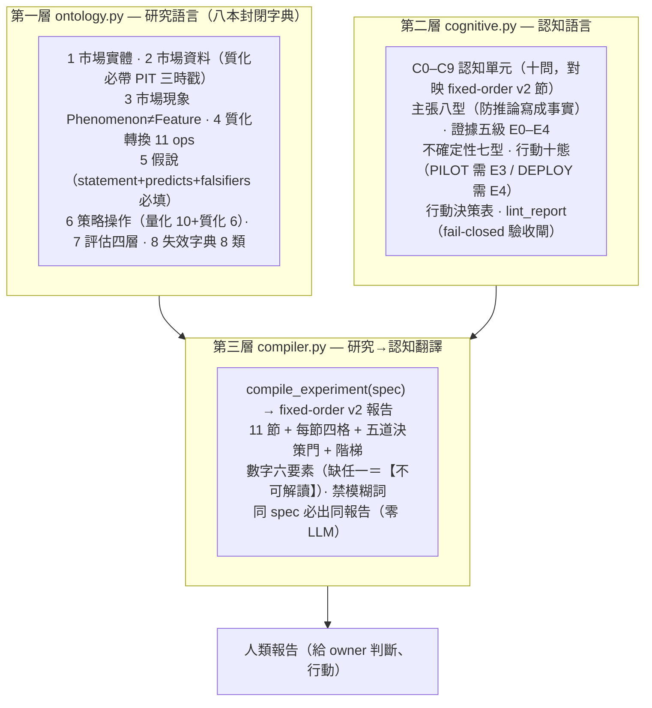

# 研究雙語：機器能研究的語言，翻成人能行動的語言

**研究雙語（Research Bilingual / Research Ontology + Cognitive Compiler）**是[[lang-quant|五層量化語言]]的第四層，也是所有實驗的**出口**。它的名字裡的「雙語」很實在——系統其實同時需要兩種語言，中間靠一台確定性編譯器把兩邊接起來：

```
A. 研究語言（機器能研究）   市場世界 → 資料 → 特徵 → 策略 → 實驗 → 評估
B. 認知語言（人能理解行動） 事實 → 差異 → 機制 → 證據 → 判斷 → 行動

          研究物件 ──→ 認知編譯器 ──→ 人類報告
```

第一套語言防止**研究混亂**（LLM 亂造假說、亂比較），第二套防止**報告混亂**（把推論寫成事實、語氣超過證據）。前三層（[[fw-feature-algebra|特徵代數]]／[[fw-world-signal|世界訊號]]／[[fw-holding-lifecycle|持有期]]）都在講研究語言這一側；這一層額外補上認知語言，並用編譯器保證「同一份實驗自動編譯成固定認知順序的人類報告」。

服務已上線：systemd 8987，入口 `tailscale /compiler`（沙盒可貼 spec 即時編譯），程式碼在 `FOR_AGENT/research-ontology/`。

## 三層架構



## 核心信條：語氣不得超過證據

這一層最重要的一條規則，是把「語氣」和「證據」綁死——**行動由門推出，不由語感**：

- **證據五級 E0–E4**：每個結論必標「有效到哪一級」。E0＝想法（沒回測）、E1＝樣本內、E2＝重複支持但無樣本外、E3＝樣本外確認、E4＝前瞻/實戰確認。這對映 [[overview|策略本體論]]的「回測是在提高期望的證據等級」。
- **語氣不得超過證據**：`PILOT`（小規模試行）需 E3、`DEPLOY`（部署）需 E4。E2 的實驗，編譯器**自動降級**成 `VERIFY`（先進組合層驗證）；手造的「超級報告」（語氣灌水）會被 `lint_report` 這道 fail-closed 閘擋下。
- **訊號層封頂 VERIFY**：只有 IC、沒有組合層結果的實驗，最高裁決＝「進入組合層驗證」，不直接 PILOT——防止「橫斷面相關性好」被當成「可交易」。
- **負結果也入庫**：候選輸給基準 → `ARCHIVE`（誠實歸檔，防重複試錯）。

**行動十態**是十種確定性的行動裁決（含 `REJECT`／`ARCHIVE`／`VERIFY`／`PILOT`／`DEPLOY`／`EXIT` 等；完整十種清單見 `cli_ro.py vocab`，此處不逐一虛構）。決策由五道門推出：證據門（E3+）／增量門／穩健門／成本門／容量門。

實測兩個種子（數字示意）：EX001 突破＋營收（組合層，E3）→ **PILOT 小規模試行**；EX002 regime 門控（訊號層，E3）→ **VERIFY 先進組合層**。同一個 E3，因為一個在組合層、一個只在訊號層，行動裁決就不同——這正是「語氣綁證據結構」的價值。

## 這一層是 fixed-order-report v2 的代碼化

全機有一套「固定認知順序報告協議 v2」（`/fixed-order-report`），規定所有給人看的報告都走固定的宏觀順序（0 決策首頁→1 現況→2 機制→…→10 機器附錄）＋段內固定四格（答案→證據→這代表什麼→目前限制）。那份協議是報告骨架的**憲法（prose 形式，靠自律遵守）**；本層把它**代碼化成一台可執行的編譯器＋lint 閘**——手寫報告靠自律，編譯報告靠閘。

這四台已真跑的引擎報告——[[exp-000-engine-first-run|實驗 000]]、[[exp-001-candidate-c|實驗 001]]、[[exp-002-ablation|實驗 002]]、[[exp-003-graph-evolution|實驗 003]]——全部按 fixed-order v2 骨架寫成，每一份都有「0 決策首頁／決策欄位表／一眼看懂／分命題信心／由門推出的裁決／升降級表」。它們是這一層要保證「所有實驗都長這樣」的活範例。特別值得看的是它們如何實踐「語氣不超過證據」：[[exp-001-candidate-c|實驗 001]]生出一個 33% 年化的漂亮結果，報告卻替它掛三張警告標籤、裁決 provisional——這就是編譯器該做的事（見 [[discipline|誠實紀律]]）。

## 這一層負責的兩本字典，值得單獨記住

- **評估四層（第 7 本字典）**：訊號證據／組合證據／穩健證據／認知證據——這是「一個 Alpha 的證據要分幾種來看」的封閉分類，[[fw-holding-lifecycle|持有期]]的剩餘 Alpha 就是要餵進這四層量測的對象。
- **失效字典（第 8 本，8 類）**：專門用來「攻擊自己的研究」——列出一個結論可能怎麼假。這對映進化迴圈的[[method-gates|攻擊閘]]與失敗歸因。

## 誠實邊界

- **種子實驗數字是示意佔位**：README 明載——種子實驗（EX001/EX002）的數字是示意，編譯器本身（驗證／門／閘／lint／渲染）是真的。接真實驗＝把 AARO/finlab 結果填進同一份 schema。
- **尚未成為所有實驗的必經出口**：H-DEV2 已把一次真實驗接進編譯器，但這一層**尚未成為所有實驗必經的出口**——四份引擎報告是按 fixed-order v2 骨架寫成、由冷讀驗收把關，並非每一份都已跑過 `compiler.py` 全自動編譯。方向裁決把「報告自動編譯（真實驗轉接器）」列為 P2、且延後——理由是報告自動化的價值建立在上游研究規格穩定，太早做會把尚未穩定的研究流程固化成文件格式。
- **本層不產生 Alpha，只保證誠實**：它管的是「研究語言不混亂、報告語氣不灌水」，不負責找 Alpha；它的功勞要記在「更快淘汰錯誤、降低人工審查、提高重現率」這類治理指標上，且這些同樣必須量化（A/B 功勞簿），否則「治理價值」也只是敘事。

延伸閱讀：這一層在整個引擎裡的位置見 [[method-strategy-spec|StrategySpec]]（假說的 features 欄存 [[fw-feature-algebra|特徵代數]] DSL、行動決策表吃 [[fw-world-signal|世界訊號]]九態）與 [[method-gates|十道證據閘]]。所有五層共用的誠實紀律見 [[discipline|方法論：誠實紀律]]。
