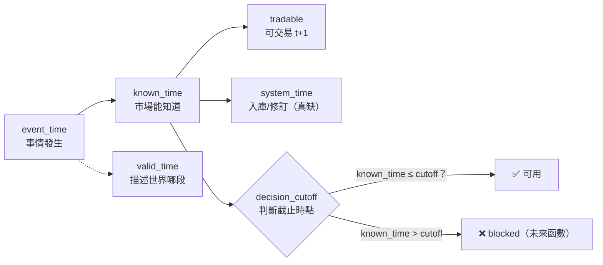

# 時間層：時間不是欄位，是圖的一級結構

**時間層（Temporal Layer）**是[五層量化語言](lang-quant.md)的第五層，也是最新、最未完成的一層（owner 2026-07-22 補充）。它橫貫其餘四層，做一件事：把時間從「一個欄位」升級成「圖的一級結構」。

先說清楚它為什麼是必要的。前四層——[特徵代數](fw-feature-algebra.md)、[世界訊號](fw-world-signal.md)、[持有期](fw-holding-lifecycle.md)、[研究雙語](fw-research-bilingual.md)——即使全部到位，畫出來的仍偏一張**靜態邏輯圖**。但投資從來不是判斷「A 與 B 有沒有關」，而是判斷：

> **什麼事在什麼時候發生、經過多久傳導、目前走到哪個階段、站在當時能不能做出這個判斷。**

所以核心單位從「邏輯節點」升級為**時態邏輯節點**，五層各司其職：

```
知識圖譜   保存「誰與誰有關」
超圖       保存「哪些條件共同成立」
時間圖     保存「以何種順序、速度與期限發生」     ← 本層新增
PIT 契約   保存「站在當時能知道什麼」
策略時鐘   決定「現在能不能行動」                 ← 本層新增
```

## 四種時間，混淆任一＝未來函數

「月營收年增率 47%」在量化上是**不完整**的——因為世界發生時間 ≠ 資訊發布時間 ≠ 市場可交易時間 ≠ 系統入庫時間。時間層要求每筆事實都分辨四種時間：

| 時間 | 回答的問題 | 既有承載 | 現況 |
|---|---|---|---|
| **valid_time** | 這個事實描述世界的哪段時間 | `qual_edge` 的 `valid_from`/`valid_to` 欄（[質化引擎](fw-qual-engine.md)，已落地） | 已有 |
| **event_time** | 事情實際何時發生 | MIEE `event.announced_at`/`effective_at`；[研究雙語](fw-research-bilingual.md) `occurred_at` | 已有 |
| **known_time** | 市場/系統何時第一次能知道 | [研究雙語](fw-research-bilingual.md) `knowable_at`（三時戳強制＋時序驗證已上線）；mcm `known_at` | 已有 |
| **system_time** | 資料何時入庫/修訂 | `ingested_at`/`revised_at`/`source_version` | **真缺**（全機零實作，歸 twdata 資料線） |



**鐵律**：任何特徵引用資料都必過 `known_time ≤ decision_cutoff` 檢查。混淆任一種時間＝未來函數。要注意的是，[特徵代數](fw-feature-algebra.md)保證的「運算合法」（算子無前視）不等於「資訊合法」——修訂值、回填、事後分類、下市缺失仍可洩漏，`ingested_at` 與 `available_at` 的差正是偵測回填洩漏的關鍵欄。

## 時間關係邊：13 個封閉詞彙

「date: 2026-07-10」太弱——投資邏輯關心的是**時間關係**。時間關係邊的詞彙表（13 個，封閉治理，與[知識圖譜](graph-knowledge.md)的關係表同表、兩書不得各自擴詞）：

```
BEFORE / AFTER / OVERLAPS / DURING / STARTS / FINISHES / PERSISTS /
ACCELERATES / DECAYS / RECURS / LAGS / LEADS / INVALIDATES_AFTER
```

帶滯後分佈的例子（這才是投資真正關心的形狀）：

```
客戶需求增加 ─LEADS_BY_30~60D→ 營收加速 ─LEADS_BY_10~40D→ 法人上修 ─OVERLAPS→ 價格突破
產能開出 ─INVALIDATES_AFTER→ 產能短缺敘事
```

機器側落成 `temporal_edge` 表（框架書 T-P1 設計，含 13 詞彙的 `CHECK` 約束、`lag_lo_days`/`lag_hi_days`/`lag_basis`/`regime_note`）——注意 **lag 帶分佈不帶單值**：大波段線 E8 實驗的教訓是「lag 有 regime 依賴」（分半降級），不得寫死單一數字。

## 點事件、期間狀態、階段——三者不得混裝

- **點事件**（event_time 一刻）：公告訂單／月營收公告／政策通過／首次突破。
- **期間狀態**（valid_from→valid_to）：需求加速中／庫存下降中／價格尚未充分反應。
- **階段**（狀態帶生命週期）：形成前→初次出現→確認→加速→擴散→擁擠→鈍化→反轉→失效。

所以「AI 題材」不是布林值，而是「階段＝定價擴散中、開始於 5-12、已持續 71 天、位於歷史週期第 68 百分位、新聞仍增但價格反應開始鈍化」。歸戶：[世界訊號](fw-world-signal.md)九態就是「行情」這個對象的階段機、[MIEE](fw-qual-engine.md) hypothesis 狀態機是「假說」的階段機——本層要把階段語意**推廣為任何期間狀態的標準配備**（統一階段 schema，真缺）。

## 相對時間比絕對日期重要——時間本身是特徵

距事件天數、傳導延遲 vs 歷史中位、持續時間週期位置、一階/二階速度、證據新鮮度與半衰期權重——這五組**相對時間都是可回測的特徵**。歸戶：[持有期](fw-holding-lifecycle.md)的時間位置向量（`days_since_entry`/`days_to_next_rebalance`/`fraction_of_holding_cycle`/`days_since_revenue_release`）就是這個概念在持有域的落地；[特徵代數](fw-feature-algebra.md)已有 XT 類算子（`TimeSinceEvent`）當文法種子。

## 五時鐘：高頻新聞不得破壞低頻策略

每個策略有五個時鐘，混用它們就會讓「新聞今天轉弱」錯誤地觸發月頻策略賣出：

| 時鐘 | 管什麼 |
|---|---|
| **觀察時鐘** observation | 資料多快更新 |
| **判斷時鐘** decision | 何時重算決策 |
| **執行時鐘** execution | 何時真的下單 |
| **持有時鐘** holding | 抱多久 |
| **評估時鐘** evaluation | 多久結算對錯 |

「新聞今天轉弱」在月頻策略裡只改**觀察時鐘**的題材強度，不觸發賣出——除非命中預先定義的提前退出條件。歸戶：這是[持有期](fw-holding-lifecycle.md)三層拆分（Selection/Holding/Execution）的時間軸版；[實驗 000](exp-000-engine-first-run.md)的部位編譯器（`engine/compile_positions`）之事件錨＋t+1 已實作「判斷/執行時鐘分離」的最小版；[敘事卡](fw-qual-engine.md)「零影響策略」鐵律就是觀察/決策時鐘隔離的落地。真缺：五時鐘未在 [StrategySpec](method-strategy-spec.md) 明文成欄位。

## 雙視角隔離：當時視角與事後視角分開存，禁止回寫

事後看「4 月接單→5 月營收加速→6 月上修→7 月大漲」邏輯完整，但 4 月當時你不知道後三件事。每個節點兩個視圖：

- **Point-in-Time View**（`as_of` 當時已知/未知清單）
- **Retrospective View**（事後實現清單）

兩者分開儲存，**禁止事後資訊回寫成當時理由**。歸戶：[MIEE](fw-qual-engine.md) 預測帳就是這個隔離的既有實作（prediction 預註冊→settle 到期對帳，845 筆已對帳）；AARO 預註冊凍結同理。這也解釋了為什麼四份引擎報告都把「PIT 視圖」與「事後視圖」分欄呈現。

## 時態超邊：成員＋順序＋時窗，缺一不算共同成立

[超圖](graph-hypergraph.md)的交互超邊只說「哪些條件共同成立」——但五個條件分別發生在三年前不算共同成立。時態超邊必須帶時間約束：

```
H_REV_EXPECTATION_GAP ＝ { A 需求事件首現[t0], B 營收加速[t0+0~90d],
  C 同業確認[與 B 重疊≥30d], D 法人未上修[判斷日成立], E 價格未反應[判斷日成立] }
約束：A BEFORE B；C OVERLAPS B≥30d；D/E VALID_AT decision_cutoff；
      全部成員 known_time ≤ decision_cutoff
輸出：預期差成立，valid_from=判斷日，20 個交易日未再確認即過期
```

落地：`interaction_edge`（[交互超邊表](graph-hypergraph.md)）增 `constraints_json`（時間約束封閉語法，T-P2 起強制非空）；約束驗證是純碼（時間比較不需要 LLM）。

## 進化目標的最終形態：可驗證的時間因果模式

系統最後要找的 Alpha 不是「營收加速有效」，而是一條**帶完整時間約束的時態超邊＋預註冊的未來驗證窗**：

> 需求新聞首次出現後 30–70 日，月營收連續兩次加速，同業同步確認，但法人尚未上修且價格反應低於歷史正常幅度時，未來 20–60 日存在正向超額報酬。

這才是能被理解、被回測、被監控、能隨時間演化的完整投資邏輯。因此[進化迴圈](method-evolution-loop.md)的變異對象擴充——不只變異特徵與規則，也變異**時窗、順序約束與滯後假設**（各為獨立的單變因軸，同受一次一變因紀律）。

## 兩個圖家族的對帳（防詞彙撞名）

時間層橫貫兩個不同的圖家族，引用時必須指明是哪一家，不得混稱「四圖」：

- **世界模型側四圖**（[質化引擎](fw-qual-engine.md)的地盤，描述市場世界）：實體關係圖／條件超圖／**時間因果圖（本層新增）**／**決策狀態圖（本層新增）**。
- **研究記憶側四圖**（[知識圖譜](graph-knowledge.md)的地盤，描述研究過程）：定義／策略／證據／演化。

時間層對兩家族都生效：研究記憶側也要 PIT（已有）；世界模型側新增時間因果圖與決策狀態圖。超圖層同樣分家：世界側超邊＝`qual_hyperedge`（[題材超邊](fw-qual-engine.md)，已落地 159 條）、研究側超邊＝strategy_spec 基因超邊（已落地）＋`interaction_edge` 交互超邊（G-P2）。

## 誠實邊界：這一層幾乎整層是設計

這是全機最未完成的一層。誠實歸戶如下：

**已存在（對過碼）**：三時戳強制＋時序驗證（[研究雙語](fw-research-bilingual.md)）；τ 軸 PIT（[世界訊號](fw-world-signal.md)）；`valid_from`/`to` 欄（`qual_edge`）；時間位置向量（[持有期](fw-holding-lifecycle.md)）；XT 算子種子（[特徵代數](fw-feature-algebra.md)）；預測帳雙視角（[MIEE](fw-qual-engine.md)）；事件錨＋t+1（[實驗 000](exp-000-engine-first-run.md)引擎已實作）。

**真缺（本層新設計，全部標「待補」）**：
- 時間關係邊 13 詞彙表與 lag 分佈量測（`temporal_edge` 表，T-P1）
- **統一時態節點 schema**（十塊合體，含 `temporal_identity` 與 `next_expected_events` 節點欄）——目前只存在於對映表，**沒有任何一張表完整長這樣**（T-P2）
- 統一階段 schema（T-P2）
- 時態超邊 `constraints_json` 約束驗證器（T-P2）
- 五時鐘入 StrategySpec（T-P1）
- 對齊契約六欄入 data_contract（`sampling_frequency`/`availability_lag`/`alignment_rule`/`max_staleness`/`aggregation_window`/`decision_cutoff`，T-P1）
- `system_time` 層（`ingested`/`revised`/`version`，歸 twdata）
- 敘事十格模板與決策狀態圖（T-P3）

**分期**：T-P1 隨引擎 P1（五時鐘＋對齊契約欄＋敘事卡改十格＋`temporal_edge` 表與詞彙 CHECK）；T-P2（統一時態節點 schema＋時態超邊約束驗證器＋階段 schema＋lag 分佈量測，標 regime 依賴）；T-P3（決策狀態圖＋時間因果模式的變異軸開放）。時間層不獨立於薄縱切——**walk-forward 版 A/B**（[實驗 000](exp-000-engine-first-run.md)第 9 節行動一）本身就是第一個吃到五時鐘與對齊契約的實驗。

延伸閱讀：時間層的十塊 schema 如何對映回其餘四層，見上表；超圖側的時態約束見 [超圖](graph-hypergraph.md)；PIT 雙視角在報告層的呈現見 [研究雙語](fw-research-bilingual.md)與 [誠實紀律](discipline.md)。

---

**被連結自（反向連結）：** [因果層：新聞→事件→供需→公司→財報→預期→價格](causal-layer.md) · [整體架構與資料流](architecture.md) · [方法論：誠實紀律（拒絕相信自己）](discipline.md) · [方法：策略基因（StrategySpec 九部件）](method-strategy-spec.md) · [方法：部件從哪取用、怎麼啟用](method-components.md) · [框架：世界訊號](fw-world-signal.md) · [框架：持有期生命週期](fw-holding-lifecycle.md) · [框架：特徵代數](fw-feature-algebra.md) · [知識圖譜：四張圖](graph-knowledge.md) · [研究作業系統：11 層與「別蓋空引擎」](research-os.md) · [給 LLM 評審：請攻擊這些接縫](for-llm-review.md) · [總覽：真正該演化的不是策略，是世界模型](overview.md) · [詞彙表](glossary.md) · [超圖：策略基因超邊與交互超邊](graph-hypergraph.md) · [進化的目標設錯了（病灶六）](objective.md) · [量化結構組成語言（總覽）](lang-quant.md) · [首頁：Alpha 進化迴圈研究 Wiki](index.md)
