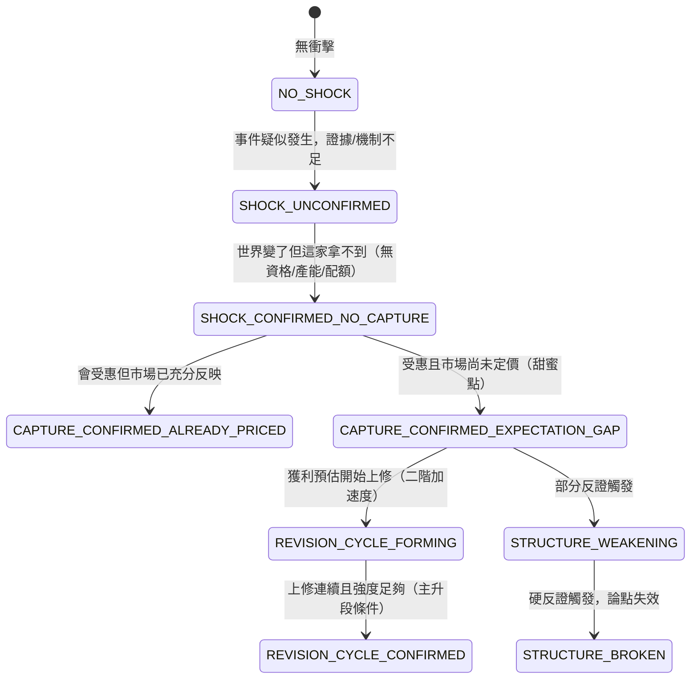

# 世界訊號：把「世界判斷」變成可組合、可反證的地址

**世界訊號（World Signal）**是[五層量化語言](lang-quant.md)的第二層。[特徵代數](fw-feature-algebra.md)把「數學轉換」做成可組合可驗證的語言；世界訊號再往上一階，把**世界事件、經濟機制、公司位置、財務傳導、市場預期、反證條件**也做成同樣可組合、且**可反證**的語言。它要解決的是量化最難的一塊——「這家公司到底在什麼世界機制裡、市場定價到哪、什麼會證明我看錯了」。

服務已上線：systemd 8986，入口 `tailscale /wsignal`，程式碼在 `FOR_AGENT/world-signal/`。

## 核心差別：不要讓 LLM 寫人話標籤

量化最常見的失敗，是讓 LLM 產出「AI 需求很強／政策利多／公司受惠／市場尚未反映」這種**人話標籤**。它們不可計算、不可比較、不可反證——寫了等於沒寫。世界訊號的做法是把每個世界判斷拆成一個完整地址：

```
WS = D + V + M + A + T + P + E + τ

  D  Observation      看到什麼原始世界資料？    台電決標金額 34.5 億
  V  Event            發生什麼事件/轉折？        EV_ACCEL（連續加速）
  M  Mechanism        透過什麼機制改變經濟結構？  政策需求→認證門檻→產能受限→售價提升→毛利擴張
  A  Actor Exposure   哪家公司捕獲、捕獲多少？    曝險×資格×產能×配額×防禦力（幾何平均）
  T  Transmission     利益如何進入財報？          增量營收/毛利/營業利益/現金流橋接
  P  Pricing/Expect   市場已定價到哪？            預期差 = 研究估計增量利益 − 市場隱含
  E  Evidence         依據與反證是什麼？          支持/反對/缺料 + 可觸發的反證條件
  τ  Time             事件/可知/影響的時間結構？   觀測≤公開≤訊號≤影響（PIT）
```

八個欄位每一個都有**封閉詞彙**（見下）。LLM 只准從封閉字典裡組合，不准寫自由文字標籤——考卷實測會擋掉「AI 需求很強」這種不可計算標籤。

## 輸出不是「會漲/不會漲」，是行情演化狀態機

這是世界訊號最關鍵的設計判斷：**輸出不是一次性的選股標籤，而是一個描述「行情演化到哪」的狀態機**（九態，有序）。同一個衝擊在不同的捕獲程度、定價程度、時間點，會落到不同狀態——這才是行情演化，不是靜態貼標。



九態的名稱與定義（`worldlang.state_machine()` 純函數推出，同輸入同輸出、附判決依據）：

| 狀態 | 白話 |
|---|---|
| `NO_SHOCK` | 沒有可辨識的世界事件 |
| `SHOCK_UNCONFIRMED` | 事件疑似發生但證據不足/機制未驗證 |
| `SHOCK_CONFIRMED_NO_CAPTURE` | 世界變了但這家拿不到（無資格/無產能/無配額） |
| `CAPTURE_CONFIRMED_ALREADY_PRICED` | 會受惠但市場已充分反映（無預期差） |
| `CAPTURE_CONFIRMED_EXPECTATION_GAP` | 受惠且市場尚未充分定價 ← **甜蜜點（可研究）** |
| `REVISION_CYCLE_FORMING` | 獲利預估開始上修（二階加速度正在形成） |
| `REVISION_CYCLE_CONFIRMED` | 上修連續且強度足夠（主升段條件） |
| `STRUCTURE_WEAKENING` | 部分反證觸發/機制減弱 |
| `STRUCTURE_BROKEN` | 硬反證觸發，論點失效 |

案例庫 WS001–WS006 用同一個衝擊（華城／台電強韌電網）示範了其中六種狀態，證明「同一衝擊、不同捕獲/定價/時間＝不同狀態」。

## 八欄位的封閉詞彙（節選）

封閉詞彙是這一層的鐵律。LLM 組世界訊號時只能從這些清單取值：

- **D 觀測型別**（9 種）：`Price` / `Quantity` / `Capacity` / `Demand` / `Competition` / `Policy` / `Technology` / `Finance` / `Market`。
- **V 事件算子**（11 種 `EV_*`）：`EV_CHANGE`（變化）/ `EV_ACCEL`（加速度，二階）/ `EV_THRESHOLD`（門檻突破）/ `EV_REGIME`（狀態切換）/ `EV_CONCENTRATION` / `EV_EXIT` / `EV_ENTRY` / `EV_SHORTAGE` / `EV_POLICY` / `EV_ADOPTION` / `EV_REPRICING`。
- **M 機制字典**（`M_*`，分需求/供給/價格/競爭/財務/認知六族）：如 `M_CAPACITY_CONSTRAINT`（產能受限）、`M_ASP_INCREASE`（售價提升）、`M_MARGIN_EXPANSION`（毛利擴張）、`M_EXPECTATION_GAP`（預期差）、`M_EARNINGS_REVISION`（獲利上修）等約 30 個。
- **A 公司捕獲**：分數 = 五因子**幾何平均**（曝險 revenue_purity × 產能 capacity_available × 配額 allocation_share × 資格 certification_status × 防禦力 replacement_risk）；捕獲門檻 `CAPTURE_FLOOR = 0.4`。幾何平均的用意是「任一因子為零則整體為零」——沒資格拿不到，其他再高也沒用。
- **R 事件基準**（6 種）：`absolute_threshold` / `own_5y_baseline` / `own_history` / `peer_median` / `prior_regime` / `sector_baseline`。
- **P 預期差型**（自動分類，5 種）：`direction`（方向差）/ `magnitude`（規模差）/ `duration`（時間差）/ `margin`（利潤差）/ `structural`（結構差）。

完整清單見程式碼 `worldlang.py`（真相源）與 `VOCAB.md`。

## 兩條硬規則：反證必填、PIT 靠時間結構

沿 [特徵代數](fw-feature-algebra.md)／[AARO 同一信條](discipline.md)：**LLM 只投稿結構化 spec，判決純碼**。其中兩條規則是這一層的命脈：

1. **可反證是硬性要求**：每個訊號必附可觸發的反證條件 `{id, metric, op, threshold, hard}`，`op ∈ {<,>,<=,>=,==}`，至少一條 `hard=true`。無反證的訊號**直接被拒**。反證一旦觸發，狀態機自動轉 `STRUCTURE_WEAKENING`/`STRUCTURE_BROKEN`。這條規則的意義：一個不能被證明錯的世界判斷，在這套語言裡不成立。
2. **PIT 靠時間結構**：`observation_time ≤ public_available_time ≤ signal_time`；`expected_start` 不早於 `public_available_time`（否則就是前視）。用未公開資料＝前視，擋。

## 兩層接在一起：世界層閘 + 技術層時機

世界訊號決定「參不參與」，[特徵代數](fw-feature-algebra.md)（真股價）決定「時機」。`combine.py` 把兩者合成 `LargeMoveWorldState`：**世界態先閘**（拿不到就不參與），再看技術態給時機判斷。

```
世界層（本專案）：世界衝擊確認 + 公司捕獲 + 有預期差 → 甜蜜點
      ↓ 世界態先閘（沒過就不參與）
技術層（特徵代數，真股價）：相對強度轉正 / 突破 / 量能 → 何時開始被市場交易
      ↓
甜蜜點 × 技術剛啟動 ＝ 最佳進場窗口
世界說主升段但價格沒動 ＝ 背離注意
```

## 這一層在真實驗裡怎麼被用

- **[實驗 001](exp-001-candidate-c.md)（候選 C）**：候選 C「月營收 × 250 日價格強勢」贏過父代的機制，報告是**用世界訊號的兩態語言來讀**的——偏向 `CAPTURE_CONFIRMED_EXPECTATION_GAP`（預期差尚未耗盡：市場還沒把營收訊號完全定價、價格強勢是再評價仍在進行的確認），而不是 `CAPTURE_CONFIRMED_ALREADY_PRICED`（買在已定價高點）。唯一輸年 2023（AI 爆發年）則落在 `already_priced` 態——等強勢確認等於在缺口收斂後才進場。這示範了九態語言可以把「為什麼會贏、什麼時候例外」講成可解釋的機制，而不是黑箱。但報告也誠實標注：這是**方向性讀法、非因果定案**。

## 誠實邊界

- **世界層數值是示意佔位**：案例庫（WS001–WS006）的世界層數值是示範 schema 與引擎用的**佔位資料**，不是即時抓取的真實世界資料，不得當投資依據。引擎本身（狀態機／影響比／預期差／反證／PIT）是真的、可驗證；股票代號真實、技術層用真股價。世界層**尚未接真資料源**。
- **缺探索通道（真缺口）**：現行 `worldlang` 的 `"unknown"` 只是捕獲評分的一個因子值，**不是**方向裁決要求的探索通道。封閉詞彙只適用生產通道；新現象需要一個 `UNKNOWN_EVENT`／`UNKNOWN_MECHANISM` 型別＋原始證據保留＋聚類＋累積後提案擴充本體的通道——這一塊全機零實作，是本體鎖死（ontology lock-in）的真風險。開工世界訊號完整因果鏈（引擎 P1）前，必須先補這個設計。
- **增量效度未證**：方向裁決明訂 P1 世界訊號的成功標準**不是**「至少一檔通過驗證閘」（那只證明系統會運作），而是「在一批正、負案例中，世界訊號相較簡單基準（只用價格/營收/產業）具有可量化的增量判別力」——目前這個增量為零、待證。
- **mcm 機制詞彙未對映**：世界訊號的 `M_*` 與新聞管線 mcm 的 `M_*` 不同源不同名（只有 `M_MARGIN_EXPANSION` 同名），擴圖前要先建對映表，見 [質化引擎](fw-qual-engine.md)。

延伸閱讀：世界訊號的九態與[持有期](fw-holding-lifecycle.md)的 Alpha 生命週期六階疑似同構（都在描述定價生命週期，尺度不同）——這條線索見 [持有期生命週期](fw-holding-lifecycle.md)。時間欄位 τ 的完整升級見 [時間層](fw-temporal.md)。

---

**被連結自（反向連結）：** [世界信念契約：被更新的是信念，不是世界](world-belief-contract.md) · [世界模型：世界不是新聞，新聞是世界狀態的 delta](world-model.md) · [假說引擎：今天最值得消除、又辨識得出的決策相關未知是什麼](hypothesis-engine.md) · [因果層：新聞→事件→供需→公司→財報→預期→價格](causal-layer.md) · [實驗 001：生成候選 C（月營收 × 價格強勢）](exp-001-candidate-c.md) · [整體架構與資料流](architecture.md) · [方法：策略基因（StrategySpec 九部件）](method-strategy-spec.md) · [方法：部件從哪取用、怎麼啟用](method-components.md) · [框架：持有期生命週期](fw-holding-lifecycle.md) · [框架：時間層（時態邏輯節點）](fw-temporal.md) · [框架：特徵代數](fw-feature-algebra.md) · [框架：研究雙語與認知編譯器](fw-research-bilingual.md) · [框架：質化引擎（新聞→世界模型→特徵→Alpha工廠）](fw-qual-engine.md) · [研究迴圈：世界不被更新，被更新的是信念](research-loop.md) · [給 LLM 評審：請攻擊這些接縫](for-llm-review.md) · [總覽：真正該演化的不是策略，是世界模型](overview.md) · [詞彙表](glossary.md) · [質化結構組成語言（總覽）](lang-qual.md) · [量化結構組成語言（總覽）](lang-quant.md) · [首頁：Alpha 進化迴圈研究 Wiki](index.md)
