# 詞彙表

這份 wiki 的代號在首現處都會展開，但如果你跳著讀，這一頁一次把關鍵詞說清楚——每個詞一句話定義，並連到它的主場頁去看細節。下面這張圖先讓你看到這些詞**住在流水線的哪一段**，再往下查定義。

```mermaid
flowchart LR
    subgraph STATE["狀態層"]
      A1["狀態的期望"]
      A2["決策事件樣本"]
      A3["B+X+W+R+O"]
      A4["九態"]
      A5["H0-H5"]
    end
    subgraph EVAL["證據層"]
      B1["E0-E4"]
      B2["walk-forward"]
      B3["provisional"]
      B4["薄縱切"]
    end
    subgraph GRAPH["圖記憶層"]
      C1["genome"]
      C2["交互超邊"]
      C3["closed_frontier"]
    end
    subgraph ABL["消融與陷阱"]
      D1["消融"]
      D2["synergy"]
      D3["conflicting"]
      D4["動能 beta"]
    end
    STATE --> EVAL --> GRAPH --> ABL
```

## 狀態層：策略是什麼

**狀態的期望**（`E[未來報酬 | S]`）
策略的本質——某檔股票現在的完整狀態 S 對未來報酬的**條件期望值**；策略不是「條件 → 動作」而是「狀態 → 期望 → 排序 → 政策」，回測的作用是提高這個期望的證據等級。機器學習只負責估這個期望，其餘（池、事件、頻率、配置）全是政策層。主場：[[overview]]、[[method-strategy-spec]]。

**決策事件樣本**
回測資料集的一列＝一次**決策事件**（例如月營收公布日 7/10 才有一筆決策，下一筆是 8/10），不是「一天一列」。硬塞成日頻樣本會稀釋訊號、汙染標籤——這是很多量化平台卡住的地方，也是本系統貫穿全實驗的紅線。主場：[[method-strategy-spec]]、[[overview]]。

**B+X+W+R+O**
[[fw-feature-algebra|特徵代數]]把每個特徵拆成的完整地址：原始輸入 **B**（如收盤價）＋轉換算子鏈 **X**（如 RollMin→RollMax→MinMaxScale→RankPct）＋窗口 **W**（如 250 日）＋比較基準 **R**（如橫斷面同儕）＋輸出型別 **O**（如布林）。關鍵：抽象層 L 不能區分特徵，真正區分靠 X 轉換。主場：[[fw-feature-algebra]]。

**九態**
[[fw-world-signal|世界訊號]]輸出的**行情演化九個狀態**（甜蜜點／主升段／破壞……）狀態機，取代「會漲／不會漲」這種二元判斷——世界訊號描述的是行情走到哪個階段，不是漲跌預測。主場：[[fw-world-signal]]。

**H0–H5**
[[fw-holding-lifecycle|持有期生命週期]]的**退出狀態機六態**：H0 未展開／H1 展開中／H2 成熟／H3 衰退／H4 假說失效／H5 週期到期。它取代「固定提前三天賣」這種單一規則，配五個持有動作（HOLD／REDUCE／EXIT_EARLY／EXIT_SCHEDULED／INVALIDATE）。主場：[[fw-holding-lifecycle]]。

## 證據層：一個結論可信到什麼程度

**E0–E4**
[[fw-research-bilingual|研究雙語]]的證據級階梯：**E0** 想法（沒回測）→ **E1** 樣本內 → **E2** 全樣本重複支持（尚無樣本外確認）→ **E3** 樣本外確認 → **E4** 最高級（前瞻對帳等真實驗證）。目前四輪實驗**全部封頂 E2**——因為都是看過全部歷史的全樣本對照。主場：[[fw-research-bilingual]]。

**walk-forward**
樣本外驗證法：所有選擇（挑參數、挑規則）只在訓練窗完成，樣本外只做裁決、不再回頭優化。這是把 provisional 升成 supported 的唯一途徑，而目前**一輪都還沒跑**——它是所有實驗頁「下一步唯一主菜」。主場：[[method-gates]]、[[discipline]]。

**provisional**
四種純碼裁決之一（另三種：`supported`／`rejected`／`blocked`）——方向有證據，但缺 Vault、前瞻或樣本外等必要關卡。四輪實驗**全部停在 provisional**，一律不改真錢。裁決由門推出、不由語感推出。主場：[[method-gates]]、[[discipline]]。

**薄縱切**（thin vertical slice）
先把一條最小策略從「資料 → 假說 → PIT 特徵 → 負對照 → 持有規則 → 報告 → 一次紙上決策」整條打通，**不先擴建任何單層**。這是上位方向裁決的第一鐵律，用來對抗「架構先於價值驗證」——四層同時建成，日後失敗就無法歸因到哪一層。主場：[[discipline]]、[[overview]]。

## 圖記憶層：知識怎麼存

**genome**
策略基因的**內容雜湊**：`genome_id` ＝去掉血統（lineage）部件後的八部件雜湊，用來認定「這是不是同一個基因」——同基因重投會被硬擋（改血統也擋）。與 `spec_id`（完整九部件雜湊）區分：兩份 spec 只差評估口徑時 spec_id 不同、genome 可能相同。主場：[[graph-hypergraph]]、[[method-strategy-spec]]。

**交互超邊**（`interaction_edge`）
超圖裡存「**多條件共同作用**」的超邊，記錄已被消融驗證的高階綜效知識（例如「創新高＋營收加速＋低波動同現才強」）。成立要件極嚴：單獨與組合效果都要入帳、組合要顯著超過邊際和、引用的實驗 id 缺一即拒。主場：[[graph-hypergraph]]。

**closed_frontier**（封閉前沿）
負向邊帳：同型方向已被充分否決，除非有新資料、新機制或新識別方法才能重開。查重閘命中封閉方向會直接擋掉生成，避免系統反覆踩同一個坑。[[exp-003-graph-evolution|實驗 003]] 的 gen1 被否決後就寫進這裡。主場：[[method-evolution-loop]]、[[discipline]]。

## 消融與陷阱：怎麼分辨真 Alpha 和假象

**消融**（ablation）
一個 **2×2 對照**：分別測「都沒有／只有 A／只有 B／兩者都有」，再看「把 B 加到 A 上」的增益是否明顯大於「把 B 加到基準上」的增益——若差不多就是相加，若前者明顯更大才是綜效。這是分辨真綜效與假綜效的硬工具。主場：[[exp-002-ablation]]、[[method-evolution-loop]]。

**synergy**（綜效值）
消融算出的**差異中之差**：`[組合 − 只有A] − [只有B − 基準]`。候選 C 的 synergy CAGR 只 +0.74pp（勉強過噪音門檻）、synergy Sharpe −0.12（負）——兩指標方向相反。主場：[[exp-002-ablation]]。

**conflicting**
交互超邊四種關係之一（另三種：`synergistic` 綜效／`antagonistic` 相剋／`independent` 獨立）——**證據衝突**，兩指標方向相反、綜效近噪音，判為「相加不是綜效」。候選 C 就被判 conflicting。主場：[[exp-002-ablation]]、[[graph-hypergraph]]。

**動能 beta**（momentum beta）
「價格強勢 ≒ 動能因子暴露」在多頭偏樣本裡剛好付錢的那部分報酬，它會**冒充成 Alpha**。指紋是「濾網越嚴、報酬越單調上升」——結果越乾淨，越該懷疑是動能 beta 而非真訊號。[[exp-001-candidate-c|實驗 001]] 的 C 有這個指紋，[[exp-002-ablation|實驗 002]] 證實它幾乎全是動能 beta 相加。主場：[[exp-001-candidate-c]]、[[exp-002-ablation]]、[[for-llm-review]]。

## 其他常見代號（首現速查）

- **AARO**（自治 Alpha 研究實驗室）：既有且真跑過十個研究世代的實驗帳＋唯一評分器系統，本專案的地基；細節散見 [[architecture]]。
- **StrategySpec**：進化的最小單位＝一份完整策略基因，九部件；主場 [[method-strategy-spec]]。
- **MOVE**：受控變異動作的封閉詞彙（調參／換機制／條件化／分解／重組……），一次只改一個部件；主場 [[method-evolution-loop]]。
- **Vault**：最上層樣本外保留集，每次動用都記一筆消耗帳、需人核，防反覆偷看；見 [[method-gates]]。
- **PIT**（Point-in-Time）：只使用「站在當時真的已知」的資料；四時分離與雙視角隔離見 [[fw-temporal]]。
- **provisional/E2 封頂的意義**：見 [[discipline]]——機件會轉、帳務可信、能自我否證，但沒有任何一條策略撐過樣本外。

要看這些詞怎麼在真實驗裡運作，去 [[exp-index]]；要理解它們背後的紀律，去 [[discipline]]。
