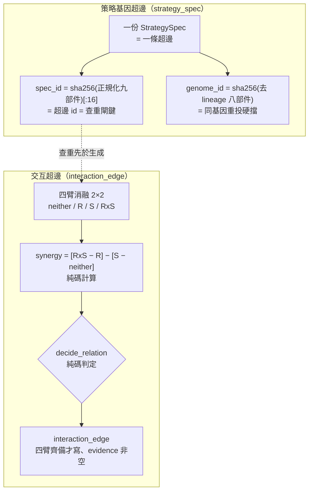

# 超圖：策略基因超邊與交互超邊

## 為什麼要超圖

[知識圖譜：四張圖](graph-knowledge.md) 的四張二元邊圖存的是「可分解的已知關係」（A 依賴 B、X 支持 Y）。但 Alpha 的真實形狀常常是**多條件共同作用**——「創新高＋營收加速＋低波動環境」三者同現才強、單獨都弱。這種**高階交互**用二元邊表達不了，要用**超邊**（一條邊連一群節點）。研究側有兩種超邊，紀律完全不同：

- **策略超邊＝基因型**（已落地）：每份策略本身就是一條超邊。
- **交互超邊＝已驗證的高階交互知識**（G-P2 落地首例）：例如「A×B 有綜效」，但**必須靠消融實驗才能立**。

## 策略基因超邊：spec_id 同時是身分與查重閘

每個 [StrategySpec](method-strategy-spec.md) 就是一條超邊：成員集依「member_kind ↔ 九部件對映表」定義（不自由列舉，防詞彙漂移），輸出＝結果向量＋證據級。實作上是 `strategy_spec` 表＋`spec_member` 成員索引表，概念上是超圖。兩個雜湊是靈魂：

- **`spec_id = sha256(正規化九部件)[:16]`**：這個內容尋址雜湊**同時充當超邊 id 與查重閘**——生成候選前先查「這個組合以前做過沒」（AARO `kb.check G0` 的圖版）。
- **`genome_id = sha256(去 lineage 的八部件)[:16]`**：八部件全同、只有血統/MOVE 名字不同的兩份 spec，genome 相同 → **同基因重投硬擋**（換個 MOVE 名字不算新策略）。

查重閘 `graph_views.graph_check(spec)` 四道判斷：①同 `spec_id`（一模一樣的九部件重投）→ **擋**；②同 `genome_id` → **擋**；③命中已封閉前沿方向 → **擋**；④成員 Jaccard 相似度 ≥0.8 → **只警示不擋**（取捨：避免誤殺合法的「只差評估口徑」對照實驗）。使用者在運算紙看到的是「此組合已於 EXP_xxx 測過，verdict=…」而非靜默失敗。

> 序列化陷阱（實測教訓）：帳上 B 的 selection DSL 以雙引號存、C 以單引號存，直接雜湊原始字串會讓「語意相同、序列化不同」的兩 spec 得到不同 genome，查重漏網。[實驗 003：圖驅動自主進化三代](exp-003-graph-evolution.md) 的提案器因此改成先走 speclang 重序列化（正規化）再算 genome，才是真的基因超邊查重。

## 交互超邊：不消融不准立綜效

交互超邊存「已驗證的高階交互知識」。**成立紀律（反捏造，比什麼都重要）**——LLM 覺得「應該有綜效」不能立，四要件缺一即拒：

1. 成員的**單獨效果**與**組合效果**都有入帳實驗（消融結構：單測各成員＋合測組合）；
2. 組合效果**顯著超過**成員邊際效果之和（判準凍結在 evaluator，純碼判定）；
3. `evidence` 欄引用的實驗 id **缺一即拒**；
4. 信心標 E 級，隨新證據升降（**追加事件，不覆寫**）。

`db_graph.py` 把這些寫成硬約束：`write_interaction_edge` 要求 `arms` 涵蓋四臂 `REQUIRED_ARMS=(neither,R,S,RxS)`，**缺臂直接 raise**；`evidence_exp_ids` 必為非空清單；`relation` 必在封閉四值內；`ablation_ok` 由「四臂是否齊備」**純碼算、不由呼叫端傳入**。DB 層再補兩道 `CHECK`（evidence 非空、`ablation_ok=0` 禁 `status=active`）與 append-only 觸發器。

**relation 四值封閉**：`synergistic`（綜效）／`antagonistic`（相剋）／`independent`（獨立）／`conflicting`（證據衝突）。判定純碼（`decide_relation`）：主指標 CAGR 綜效、Sharpe 綜效佐證；**兩指標方向相反且皆過門檻 → conflicting**；否則依 CAGR 綜效 >+門檻 synergistic／<−門檻 antagonistic／門檻內 independent。是哪個報哪個，**嚴禁湊正綜效**。

## conflicting 裁決的意義（首例 INT_0107e94c9f2c）

G-P2 落地的第一條、也是唯一一條交互超邊，就給了 owner 一記漂亮的自我否證。詳細逐環拆解在 [實驗 002：交互超邊消融](exp-002-ablation.md)，這裡講它為什麼重要：

- **成員**＝{月營收 rev_yoy, 250 日 range-position 價格強勢}，即 [候選 C](exp-001-candidate-c.md)「月營收×價格強勢」的綜效故事。
- **四臂全樣本（2015-01→2026-06，138 事件）**：純動能自己 Sharpe 就 1.52，和「營收＋強勢」的 1.52 **一模一樣**；加強勢給營收股 +13.0pp ≈ 加給基準 +12.3pp（CAGR）。
- **synergy**：CAGR **+0.74pp**（勉強過噪音門檻）、Sharpe **−0.12**（負）——**兩指標方向相反** → 純碼判 **`conflicting`**。

**這代表什麼**：`conflicting` 不是「找到綜效」，是**「證據衝突、不足以斷言真綜效」**——C 的優勢幾乎全是動能 beta 相加，不是「月營收 × 價格強勢」的真綜效。強勢的貢獻與有沒有做營收選股無關，是相加不是綜效。這條邊以 `ablation_ok=1`、`evidence_level=E2`、`status=provisional` 永久保留在正典帳（四筆 gate_result 為證據），**證據級封頂 E2**（全樣本描述性、無樣本內外、無 walk-forward），語氣封頂「方向」，不構成部署裁決。獨立重算員逐位吻合、確認**沒把相加凹成綜效**。

這就是本專案「拒絕相信自己」（見 [方法論：誠實紀律（拒絕相信自己）](discipline.md)）最具體的一次兌現：機器對自己上一輪剛生出的「漂亮 33%」候選，跑了乾淨消融、主動判它非綜效。

## 治理位置與時態邊界

- **超邊留在 AARO 域內 DB**（aaro.sqlite 新表），**不**向世界模型基底註冊「第九種物件」（八物件鎖是憲法）；只把裁決摘要鏡射出去。
- **時態約束 `constraints_json`**：交互/預期差類超邊理論上必帶時間約束（順序＋時窗＋VALID_AT，見 [框架：時間層（時態邏輯節點）](fw-temporal.md)），**T-P2 起強制非空**；**本輪 G-P2 允許 NULL**——時態超邊的約束驗證器仍待補。
- **交互超邊只此一條**：消融模組目前只硬綁「月營收×250 日強勢」這一組；迴圈子代一旦把強勢機制變異掉就離開覆蓋範圍，**依反捏造紀律不虛構**新綜效邊——所以 [實驗 003：圖驅動自主進化三代](exp-003-graph-evolution.md) 的後代沒有生新交互超邊。

## 別和世界側超邊搞混

本頁講的是**研究側超邊**（`strategy_spec` 基因超邊＋`interaction_edge` 交互超邊，管研究過程）。[框架：質化引擎（新聞→世界模型→特徵→Alpha工廠）](fw-qual-engine.md) 的 **qual_hyperedge 題材超邊（159 條）是世界側**（管市場世界的題材/類股）。兩者同名「超邊」但分屬不同家族、不同 DB 語意，引用時必須指明家族。

驗收：`cd aaro && python -m engine.tests_ablation`（六卷）與 `python -m engine.tests_engine`（九卷含基因超邊查重）全綠。下一站：消融逐環審 → [實驗 002：交互超邊消融](exp-002-ablation.md)；自主迴圈 → [實驗 003：圖驅動自主進化三代](exp-003-graph-evolution.md)；二元邊四圖 → [知識圖譜：四張圖](graph-knowledge.md)。

---

**被連結自（反向連結）：** [實驗 002：交互超邊消融](exp-002-ablation.md) · [實驗 003：圖驅動自主進化三代](exp-003-graph-evolution.md) · [實驗索引：每一輪真跑，逐環節攤開](exp-index.md) · [方法論：誠實紀律（拒絕相信自己）](discipline.md) · [方法：策略基因（StrategySpec 九部件）](method-strategy-spec.md) · [方法：證據閘（十道關卡）](method-gates.md) · [方法：進化迴圈（圖提案→變異→裁決→回流）](method-evolution-loop.md) · [框架：時間層（時態邏輯節點）](fw-temporal.md) · [框架：質化引擎（新聞→世界模型→特徵→Alpha工廠）](fw-qual-engine.md) · [知識圖譜：四張圖](graph-knowledge.md) · [給 LLM 評審：請攻擊這些接縫](for-llm-review.md) · [總覽：從一個念頭到一台會拒絕相信自己的引擎](overview.md) · [詞彙表](glossary.md) · [首頁：Alpha 進化迴圈研究 Wiki](index.md)
