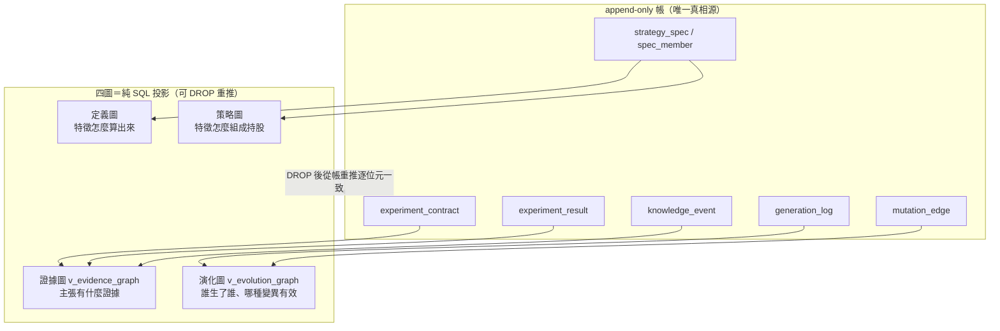

# 知識圖譜：四張圖，全部是帳的投影

## 為什麼需要圖：血統鏈不夠

AARO（自治 Alpha 研究實驗室，本專案地基）的記憶已經是全機最強：append-only 帳＋已封閉前沿＋下一議程。但它的**關係結構只有 `generation_log.parent` 這條「單親字串鏈」**加少量鏡射回鏈，家族只是一個 `family_id` 字串標籤。這代表一整批問題**答不出來**：

- 這個特徵依賴哪些資料？哪些策略用過它？（定義/使用關係查不到）
- 哪些組合反覆失敗？共同包含什麼？（失敗模式交集查不到）
- A 和 B 各自有效但從未共測？（未測交互查不到）
- 「創新高＋營收加速＋低波動」三者同現才強、單獨都弱——這種**高階交互作用**無處存放（二元邊表達不了，要靠 [超圖](graph-hypergraph.md)）。

上一版迴圈（生成→回測→驗證→保留）因此只是自動化實驗平台；補上圖層，才是會累積市場知識、理解交互、據此演化的系統。

## 第一鐵律：圖是帳的投影，不是第二真相源

這是整個圖層最重要的設計判斷，繼承兩條既有憲法（世界模型基底「衍生欄現算、嚴禁落庫」；策略生命週期引擎書「用想像的邊餵傳播，比沒有邊還毒」）。落地規則有三：

1. **四圖全是 append-only 帳之上的衍生視圖或可重推表**——DROP 掉全部圖表，從帳重推必須**逐位元一致**（考卷斷言）。
2. **每一條邊必須能指回帳裡的證據列**；沒有證據列的邊不准存在（[框架：質化引擎（新聞→世界模型→特徵→Alpha工廠）](fw-qual-engine.md) 的 qual_edge 用 `CHECK` 強制、演化圖用 `WHERE` 過濾強制）。
3. **LLM 只能「提案」邊**；提案只進候選佇列，成邊要嘛純碼從帳投影、要嘛靠實驗證據落地後自動成立。這是 [方法論：誠實紀律（拒絕相信自己）](discipline.md) 頁反捏造紀律的圖版。



## 四張圖：各回答什麼、從哪投影

| 圖 | 回答的問題 | 節點 | 邊（封閉詞彙） | 投影來源 | 狀態 |
|---|---|---|---|---|---|
| **定義圖** | 這個特徵到底怎麼算出來的？ | 資料欄、算子、參數、特徵、輸出型別 | uses_data / applies_transform / takes_parameter / produces / derived_from | 特徵代數 [框架：特徵代數](fw-feature-algebra.md) 的 `to_spec()/tree()` 已含全部資訊，純碼展開 | 設計（視圖待補） |
| **策略圖** | 策略怎麼把特徵組成持股？ | 池狀態、特徵、算子、組合狀態、持有政策、執行政策 | consumes / transforms_state / ranks_by / selects / allocates / exits_by | StrategySpec [方法：策略基因（StrategySpec 九部件）](method-strategy-spec.md) 九部件結構，純碼展開 | 設計（視圖待補） |
| **證據圖** | 這個主張有什麼證據？ | 假說、實驗、指標、結果、反證、證據級 | supports / contradicts / tested_on / valid_under / replicates / supersedes | `experiment_contract × experiment_result ＋ knowledge_event` | **已落地** `v_evidence_graph`（36 邊） |
| **演化圖** | 誰生了誰、哪種變異在什麼條件有效？ | 策略世代節點 | mutation 邊（帶 parent/child/changed_component/before/after/多維 delta） | `generation_log` 字串血統 ＋ `mutation_edge` 結構化邊 | **已落地** `v_evolution_graph`（9 邊） |

**誠實狀態**（2026-07-22）：`graph_views.py` 目前只建了**證據圖與演化圖兩個視圖**（DDL 是固定字串常數，重推決定性）；**定義圖與策略圖仍是設計，視圖待補**。另有一張「節點帶狀態」視圖 `v_feature_node`（把特徵節點的已測實驗/正負/有效脈絡全部 SQL 現算，永不手填）列在框架書 G-P1，**尚未建成、標待補**——手填的節點狀態一定腐爛，現算的才永遠與帳一致。

## 三種關係都要存，不是只存正向

只存成功者的圖會讓系統反覆踩同樣的坑。三類關係同權入圖：

| 類 | 詞彙 | 例 |
|---|---|---|
| 支持 | supports / improves / synergizes_with / valid_under | Top10 —improves→ CAGR |
| 負向 | hurts / contradicts / fails_under / reduces_capacity | Top10 —hurts→ 流動性 |
| 不確定 | untested_with / weak_evidence / conflicting_results | Top10 —conflicting_effect_on→ Sharpe |

負向與不確定關係是 LLM 生成下一代時的「完整代價表」；**已封閉前沿（closed_frontier）就是現成的負向邊來源**——[實驗 003：圖驅動自主進化三代](exp-003-graph-evolution.md) 裡 gen1 被否決後就寫進了它，死方向不再重試。

## 圖驅動進化：六步閉環

圖不只是好看，它要改變「下一代該測什麼」的提案品質。六步閉環（詳見 [方法：進化迴圈（圖提案→變異→裁決→回流）](method-evolution-loop.md)）：

```
① Graph Retrieval    查已知：哪些測過、哪些反覆失敗、哪些機制只有初步證據
② Gap Detection      找空洞：已知 X 在低波動有效，未知 ＋Y 在高波動是否仍有效
③ Hyperedge Completion  LLM 提案候選超邊（只提案、不裁決）→ 見 graph-hypergraph
④ Controlled Mutation  候選超邊 → StrategySpec diff（一次只改少數成員）
⑤ Experiment         編譯 → 十閘 → 裁決 → 見 method-gates
⑥ Graph Writeback    結果→證據邊；ΔE→演化邊；消融齊備→交互超邊；死方向→封閉前沿負向邊
```

圖至少提供五個能力：避免重複實驗（查重閘，見 [超圖：策略基因超邊與交互超邊](graph-hypergraph.md)）、找鄰近變異（沿定義圖走一兩步）、找失敗模式（負向超邊交集）、找未測交互（步驟②）、建因果研究路徑（營收加速→預期上修→定價延遲，沿傳導鏈找替代代理）。

## 兩個圖家族不得混稱

**研究記憶側四圖**＝定義/策略/證據/演化（本頁，管實驗與策略的血統）；**世界模型側四圖**＝實體關係/條件超圖/時間因果/決策狀態（[框架：質化引擎（新聞→世界模型→特徵→Alpha工廠）](fw-qual-engine.md) 與 [框架：時間層（時態邏輯節點）](fw-temporal.md) 的地盤，管市場世界）。兩家族並存於不同層，引用時必須指明是哪一家族，不得只說「四圖」。同理超邊也分家：世界側是 qual_hyperedge、研究側是基因超邊＋交互超邊（見 [超圖：策略基因超邊與交互超邊](graph-hypergraph.md)）。

下一站：多條件共同作用怎麼存 → [超圖：策略基因超邊與交互超邊](graph-hypergraph.md)；策略的九部件基因 → [方法：策略基因（StrategySpec 九部件）](method-strategy-spec.md)；名詞 → [詞彙表](glossary.md)。

---

**被連結自（反向連結）：** [世界模型：世界不是新聞，新聞是世界狀態的 delta](world-model.md) · [實驗 003：圖驅動自主進化三代](exp-003-graph-evolution.md) · [實驗索引：每一輪真跑，逐環節攤開](exp-index.md) · [整體架構與資料流](architecture.md) · [方法論：誠實紀律（拒絕相信自己）](discipline.md) · [框架：時間層（時態邏輯節點）](fw-temporal.md) · [框架：質化引擎（新聞→世界模型→特徵→Alpha工廠）](fw-qual-engine.md) · [知識層：一則新聞展開成一張知識子圖](knowledge-layer.md) · [研究作業系統：11 層與「別蓋空引擎」](research-os.md) · [給 LLM 評審：請攻擊這些接縫](for-llm-review.md) · [質化結構組成語言（總覽）](lang-qual.md) · [超圖：策略基因超邊與交互超邊](graph-hypergraph.md) · [量化結構組成語言（總覽）](lang-quant.md) · [首頁：Alpha 進化迴圈研究 Wiki](index.md)
