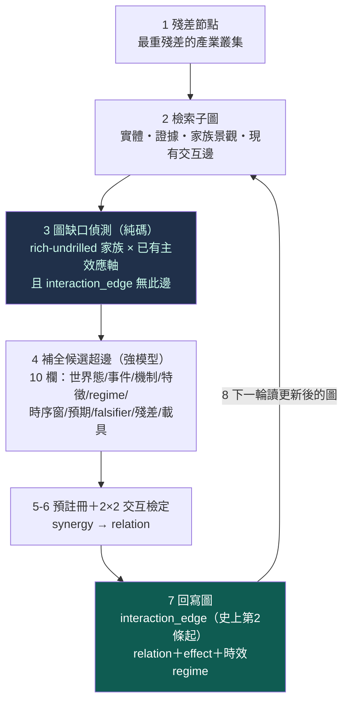

# graph-native：讓圖與超圖成為思考器官，而非事後記帳

一個誠實的批評命中要害：到目前為止，這台引擎的自主迴圈是「**殘差＋統計驅動，圖只做查重、記帳、血統**」——`StrategySpec` 基因超邊防換名重跑、`closed_frontier` 擋死方向、演化邊記父子代。這比較接近 **graph-aware ledger**，還不是 **graph-native intelligence**。最新自主迴圈（[[autonomous-research|冠軍利用線]]）裡真正跟圖有關的只有一步：查 `closed_frontier` 排除死方向。機制生成的本質仍是：

> 殘差摘要 → LLM 想一個故事 → 關鍵詞配到現有欄位

而不是：

> 讀圖 → 找斷鏈／衝突／未測交互 → 補全候選超邊 → 編譯成實驗

`ORTHOGONAL_EDGE` 這種名字還容易造成錯覺——它是「統計上與 king2 低相關」的標籤，**不是知識圖譜的一條 edge**。

這一頁記錄把圖擺回它該在的位置的第一條薄縱切（`wm/graph_native.py`）：**圖活在「殘差 ↔ 可檢定假說」之間**。king2 殘差仍是起點，但圖負責把殘差轉成「有歷史、有因果、有條件組合」的研究問題。

## 八步：圖產生問題 → 超圖承載假說 → 實驗更新圖

與 [[autonomous-research|冠軍利用線]]的關鍵差別在**問題從哪來**：那條線是「殘差叢集 → LLM 故事 → 關鍵詞配欄位」；這條線是「**圖缺口 → 補全超邊**」。圖缺口偵測（step 3）純碼掃 `family_landscape`（因子家族景觀）找 `status∈(rich,moderate)` 且 `drilled=0` 的家族，配上有信念背書的主效應軸（B-RES-001 的產業營收），若這一對在 `interaction_edge` 裡**沒有邊**、且不在 `closed_frontier`——那就是圖上一條「**分開有效、但從未共同檢定**」的斷鏈。這正是批評點名的那種問題。

## 真跑兩輪：下一輪真的從「被上一輪改寫的圖」重選

第一條薄縱切在最重殘差產業（電子零組件業，35 個漏網事件）上跑了兩輪：

| 輪 | 圖缺口（讀圖產生的問題） | 2×2 交互檢定 | 回寫 |
|---|---|---|---|
| R1 | 產業營收 × **risk**（rich、增量 0.053、drilled=0） | synergy t=0.11 → `independent` | interaction_edge 1→**2** |
| R2 | 產業營收 × **quality**（rich、增量 0.044、drilled=0） | synergy t=−0.07 → `independent` | interaction_edge 2→**3** |

**最關鍵的是 R1→R2 的轉換**：第二輪之所以改選 quality，是因為第一輪把 risk 那條交互超邊**寫進了圖**，第二輪讀到更新後的 `interaction_edge`（已含 risk），純碼缺口偵測就排除了 risk、改選次高的 quality。**下一輪的問題，真的依賴上一輪對圖的改寫**——這就是「實驗更新圖譜、圖譜再生下一個問題」的閉環，而不是一段寫死的順序。

兩個交互的裁決都是 `independent`（synergy 不顯著）——這是誠實的知識結果：把 risk 或 quality 與產業營收**共同檢定**，都沒有帶來單測之外的新資訊。B-RES-001 那條方向對但不顯著的產業營收效應，加上這兩個家族當交互也救不起來。這些「無交互」的結論被寫成 `interaction_edge` 存進圖，下次就不會重測。

## 沿途修掉的三個真 bug（誠實記錄）

這條線第一版有三個 bug，逐一被抓出來修——它們本身就說明「接圖」比想像難：

1. **弱模型補不出超邊**：9b 對 10 欄結構化 JSON 會跑飛（把 prompt 裡的股票代碼當清單狂列）。改用強模型（依[[discipline|模型分級]]，超邊補全屬「需綜合判斷」步驟），並把代碼移出 prompt。
2. **回寫詞彙不符、下一輪選不動**：`interaction_edge` 的 members 一度存成特徵欄名（`adv_rank`），但缺口偵測比對的是家族名（`risk`）——對不上，導致第二輪重選同一缺口。改成存家族語意名，下一輪才排除得掉。
3. **`INSERT OR IGNORE` 靜默吞掉 CHECK 違反**：`interaction_edge` 有 `relation IN (...)` 的封閉詞彙 CHECK，我的 relation 用了不在 enum 的詞（`additive_or_independent`），`INSERT OR IGNORE` 把整個插入**默默丟棄**、回寫從未生效、還不報錯。改用 `ON CONFLICT DO NOTHING`（讓 CHECK 違反 raise）＋插入後驗證真的進表——把靜默失敗變成清楚錯誤。

## 這是「真圖驅動」還是「圖裝飾」？對抗查證過了

「graph-native」是個作者有立場宣稱成功的主張，所以派了**四個獨立稽核鏡頭**（各自在 scratch DB 上真跑實驗）攻擊它是不是 graph-theater。綜合裁決＝**GENUINELY_GRAPH_NATIVE**（四鏡頭全 GRAPH_NATIVE）。決定性證據是依賴性測試：

| 情境 | 第 1 輪選 | 第 2 輪選 | 說明 |
|---|---|---|---|
| 正常（第 1 輪回寫圖） | risk | **quality** | 回寫後下一輪從更新圖重選 |
| **跳過第 1 輪回寫** | risk | **risk** | 圖沒被改 → 下一輪選一樣 |
| 把 quality 增量抬過 risk | **quality** | — | 讀圖數值排序，非寫死 risk-first |
| 只加 quality 交互邊 | risk | — | 非固定「risk→quality」階梯 |

輪與輪之間**唯一變動的狀態是 `interaction_edge` 表**，而 `step3_detect_gap` 的簽名根本沒有 round/counter 參數。所以「跳過回寫 → 下一輪同選、回寫 → 下一輪改選」是**真依賴圖狀態**，不是重複呼叫的副作用。稽核還逐位元重算了 2×2 交互檢定（與存檔一致）、確認非法 relation 現在會 raise（不再靜默）。

### 但有兩處裝飾成分，誠實標出、不吹成滿分

稽核同時指出兩個「敘事飽滿、但實質稀薄」的接縫——它們是品質瑕疵，不是 theater，但必須講清楚：

1. **超邊的 `feature` 敘事與實際檢定脫鉤（最重要）**：LLM 補的超邊寫「計算營收 YoY 與風險因子**乘積項**的加權係數」，但程式實跑的 2×2 檢定用的是固定映射（risk→`adv_rank`、主軸→`IND_REVYOY_MED`）的**中位切 synergy**——測的是**同兩軸**沒錯，但**函數形式**是中位切、不是超邊文字寫的乘積項。所以超邊目前是假說「詮釋層」的真載體，卻還不是「檢定規格」的真載體。**把超邊的 feature 敘事編譯成實際被計算的表達式，是接圖的下一關。**
2. **候選池太小、`instrument` 欄是常數**：FAMILY_FEATURE 白名單過濾後只有 risk/quality 兩顆合格，兩輪就收斂——「圖越滿→重選」的空間很窄。10 欄裡 `instrument` 每條都寫死「股票」（prompt 沒問這欄），實為「8 判斷欄（強模型）＋1 模板（residual_link）＋1 常數（instrument）」。

## v2：補三刀（owner 改判後）——超邊變成可執行規格、負結果不再過度泛化、世界鏈接上真產業營收

owner 改判確認 v1 已跨過「圖裝飾 → 圖控制研究議程」的門檻，但點名三個仍未接上的接縫。`wm/graph_native2.py` 逐一補：

**刀 1【最重要】超邊說的 = 實驗算的，雜湊硬閘鎖死。** v1 的超邊寫「營收 × 風險**乘積項**」，程式卻跑中位切 synergy——同軸、不同函數。v2 建 `HyperedgeSpec →(compile)→ ExperimentSpec`，執行端由**實際用的參數**重建一個 `executed_hash`，與編譯出的 `spec_hash` 做**硬閘**：不一致直接 raise、拒絕採用結果。現在有兩個可編譯 form——`median_split_2x2` 與 `rank_product`（真的算兩軸排名乘積項的偏效應），超邊宣稱哪個、執行端就必須算哪個。考卷實測：竄改執行端的 form → hash 隨之改變 → 閘 raise。**超邊從此是「可執行規格」，不只「研究故事」。**

**刀 2 一次負結果只封該情境，不封所有情境。** v1 只要 {營收×risk} 有邊就不再測，等於一次弱負結果封死一切。v2 的超邊身分＝情境 tuple `{members, form, regime}`——**每一維都真驅動計算**（form 選計算分支、regime 過濾樣本、family 換家族軸），缺口偵測只排除**同情境格**。真跑四輪走過四個不同格：

| 輪 | 情境格（family × form × regime） | spec_hash | n | 交互效應 |
|---|---|---|---|---|
| R1 | risk × median_split × normal | 66e79152 | 17 | t=0.28 → independent |
| R2 | risk × **rank_product** × normal | 000f218c | 17 | t=−0.39 → independent |
| R3 | risk × median_split × **weak** | 07164ed6 | 8 | t=−0.24 → independent |
| R4 | risk × rank_product × weak | 8c7cff5d | 8 | t=−0.49 → independent |

四個 hash 各異＝form 與 regime 真的編進了身分（regime 還真的換了樣本：normal n=17 vs weak n=8）；{normal, median_split} 的負結果**沒有**封死 {weak} 或 {rank_product}。「這個時期、這種切法、這個樣本裡沒有顯著交互」不再被過度讀成「所有情境都沒有」。

**刀 3 世界鏈接上真產業營收世界狀態。** v1 只讀 `family_landscape`（因子景觀）。v2 建真世界鏈 **股 → 產業 → 產業營收世界狀態 → 時間傳導**：世界狀態是把個股月營收**加總成產業層需求訊號**（真 finlab），例如航運業營收 YoY 從 2020-06 的 −13.6% 一路加速到 2021-08 的 +29.2%——這條**超級週期曲線是真資料**，而漏網股（2609、2642）正坐在產業營收轉上、king2 還沒選到的拐點。這比只讀因子景觀更靠近「讀世界」。

### v2 三刀也對抗查證過——而且稽核揪出一個真 bug，當場修了

三鏡頭獨立稽核 v2 三刀（雜湊閘可否繞過／情境是否真不互封且收斂／世界鏈是否讀真資料）。初判 **MOSTLY_SOLID_SOME_WEAK**：三刀核心都真——**雜湊閘結構鎖死 form**（稽核親手把 `compute` 從 median 竄改成 rank_product，executor 真的走了另一段計算、`executed_hash` 隨之改變、閘 `raise`，證明不是抄 `spec_hash` 的假閘）；**世界鏈讀真資料**（獨立重算航運業營收 YoY 逐月吻合，2021-08=+29.17，是 ~25 檔成分股的真加總、與任一單股相關 <0.76）；**情境化真不互封且會收斂**。

但稽核揪出一個**真 bug**：雜湊的 7 個欄裡有 4 個是**裝飾欄**——`universe / horizon / tier / axis_world_col` 進了 hash 卻**沒驅動計算**（執行端日期寫死、沒按產業過濾），所以 `horizon=20` 與 `horizon=60`、`universe 航運` 與 `universe 半導體` 會存成**不同 id 卻跑出逐位元相同的計算**＝幽靈格，這反過來讓刀 2 的情境化出現假的區分。

**這個 bug 已修（不是只揭露）**：實驗身分收斂成只含**真驅動計算的三欄** `{compute(form), axis_family_col(family), regime}`——`horizon` 移除（殘差集只有 king2 單一持有窗，無法真驅動）、`universe` 移出身分改記進 constraints 當世界鏈**動機產業**（跨產業交互本就不該按單一產業過濾，世界狀態軸 `IND_REVYOY_MED` 已把每檔的產業營收帶進來；實測按單一產業過濾會讓同事件湊不齊 2×2 四格、樣本歸零）。修完考卷加了兩題硬驗：「universe 不改實驗 hash（無幽靈格）」與「實驗身分只含真驅動欄」，全綠。所以現在雜湊指紋的**就是**實驗實際做的事，`hash==實驗實際規格` 不再是過度宣稱。

但**世界鏈到「產業營收世界狀態」為止就斷了**——運價（BDI/SCFI）、新聞事件節點、多跳供應鏈（船舶供給／港口壅塞）仍**沒有真資料源**，模組把這些明白列在 `world_chain.unfilled` 裡，不假裝有。所以 v2 把 owner 要的鏈補到了「產業營收」這一跳，前面「運價 → 產業營收」和旁邊「新聞 → 世界狀態」那幾跳還是空的。

## 誠實邊界（不得省略）

- **超邊敘事與實際檢定脫鉤，是接圖的下一關（稽核揪出的最重要瑕疵）。** 現在超邊的 `feature` 欄寫的函數形式（乘積項加權係數）不是程式實測的形式（中位切 synergy）——測的是同兩軸、但形式不同。要讓超邊真正成為「檢定規格」的載體，得把它的 feature 敘事編譯成可計算表達式（接 [[fw-feature-algebra|特徵代數]]的文法）。這是把「詮釋層載體」升級成「規格層載體」的關鍵。
- **這是把「圖驅動選題」的機制接上，不是宣稱世界知識圖已完整。** 真實的世界知識圖仍非常稀疏：正式因果邊 0、供應鏈一階、`interaction_edge` 在這條線之前只有 exp-002 一條。本輪讀的「圖」主要是 `family_landscape`（因子家族景觀）＋`interaction_edge`＋`belief_contract`——這些是真的、但還不是「陽明→航運→貨櫃運價→船舶供給」那種完整實體因果鏈。實體/時間因果圖的填充、以及擴大可算家族池（現只 risk/quality 兩顆合格、兩輪就收斂），是後續工作。
- **交互檢定跑在 EXPOSED 殘差段（示範，confirmable=False）。** 與[[autonomous-research|自主輪]]同一紀律：歷史段已燒毀，這裡證明的是「圖驅動選題→檢定→回寫」的機制會轉，不是可 confirmed 的 Alpha。
- **主效應軸只有一條（B-RES-001 產業營收）。** 圖缺口目前都是「產業營收 × 某家族」；要真正發揮圖的威力，需要更多有信念背書的主效應軸，以及實體/時間邊參與選題。

**這條線現在真正卡在哪，逐條攤在 [[blockers|難點與卡關]]**——特別是為什麼「接世界多跳鏈」還沒走完（主要卡在運價/新聞/供應鏈無真資料源，不是程式沒寫）。

延伸：這條線與殘差驅動的自主迴圈的分工見 [[autonomous-research|自主研究]]；四張知識圖的定義見 [[graph-knowledge|知識圖譜]]；交互超邊與消融的原理見 [[graph-hypergraph|超圖]]；為什麼選題該從殘差長出見 [[hypothesis-engine|假說引擎]]；第一條被交互檢定的主效應信念見 [[exp-007-residual-belief|B-RES-001]]。
