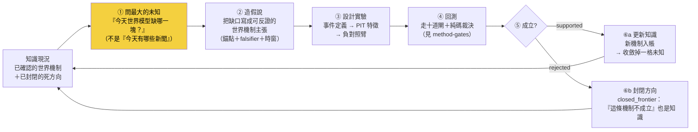
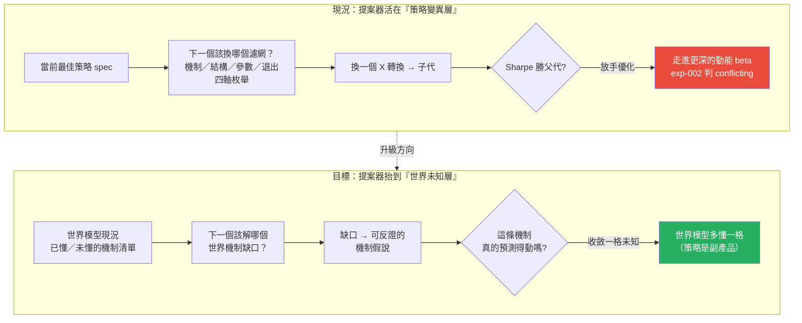

# 假說引擎：每天先問「今天最大的未知是什麼」

## 一句話：把研究的第一個動作從「蒐集」換成「提問」

自動研究最容易長歪的地方，不是不會算，是**問錯了第一個問題**。一台每天問「今天有哪些新聞、哪個因子又漲了」的引擎，會不停地蒐集、比對、找出「這段樣本裡誰付錢」——然後把「誰付錢」誤當成「我懂了什麼」。假說引擎要換掉的就是這個第一動作：每天先問一句**「對這個市場，我現在最大的未知是什麼？」**，再讓整條研究線去解那個未知。

這一頁是 owner 病灶清單第六條（進化的**目標**定義錯了）的解法面。病灶本身寫在 [進化目標](objective.md)，整條研究迴圈的骨架寫在 [研究迴圈](research-loop.md)，本頁只負責一件事：**把「知識缺口 → 假說 → 實驗設計 → 回測 → 成立? → 更新知識」這個閉環講清楚，並誠實對帳它現在到底做到哪、缺在哪一層。**

黃色那格是全頁的重點。**引擎的價值不由「找到多少 Alpha」決定，而由「每天問對哪個未知、收斂掉哪一格未知」決定。**Alpha 是這個閉環轉動時掉出來的副產品，不是它瞄準的目標。

## 病灶六：目前這台引擎問的是「該換哪個濾網」，不是「該解哪個世界機制」

owner 的批評很尖：wiki 把「策略／程式／prompt」當成進化對象（像 AlphaEvolve 那樣優化 Min Loss／FLOPs），於是進化迴圈每天問的其實是「當前最佳策略的下一個單變因變異該試哪個」。這在 [進化迴圈](method-evolution-loop.md) 裡是明擺著的：`gaps.propose_next()` 沿四條軸枚舉——

- **機制軸**：換一個強勢濾網的 X 轉換（區間位置／趨勢一致性／創新高／高位持續性／原始動能）；
- **結構軸**：拆掉濾網、看純 rank 有沒有增量；
- **參數軸**：同機制換門檻／窗口／TopN；
- **退出軸**：提前賣天數 A↔B 翻轉。

四條軸全部是**策略內部的變異方向**。它問的是「這台策略機器的下一顆螺絲該換哪一顆」，而**不是**「這個市場我還有哪一塊機制沒搞懂」。這就是病灶六在假說層的具體長相：**提案器活在「特徵／策略變異層」，不在「世界未知層」。**

## 誠實對帳：已經有什麼、其實是空殼、擺錯在哪一層

不能說「完全沒有假說引擎」——骨架是有的，而且是全機最完整的研究記憶之一。但也不能說「已經在解世界未知」——它解的全是策略變異。三態攤開：

| 元件 | 狀態 | 事實（資料截止 2026-07-22，讀 `data/aaro.sqlite`） |
|---|---|---|
| `research_gap` 缺口表 | 【已設計・在用】 | schema 齊全（gid／question／source／family／priority／rationale／status），有真資料在跑 |
| `next_agenda()` 純碼排序 | 【已設計・在用】 | `kb.py`：讀 `research_gap` 取 `status='open'`、按 `priority DESC` 排序，**純碼排、非 LLM 觀感**——這條紀律是對的 |
| `closed_frontier` 死方向帳 | 【已設計・在用】 | 死方向入帳、查重閘 `check()` 會擋重撞（負結果同權入帳） |
| `gaps.propose_next()` 提案器 | 【已設計・在用，但擺錯位階】 | 四軸枚舉全在策略變異層（見上節） |
| **缺口內容的層級** | **【擺錯位階】** | **這是最誠實的一格，見下** |
| 世界機制缺口提案 | 【幾乎空殼】 | 帳上**沒有任何一條** gap 是在問「世界機制未知」 |

第五、六格是要害。把帳上目前所有還沒解的缺口（`status='open'`）攤出來看，它們**全部**是策略／因子層的問題：

| gid | 問的其實是什麼 | 家族 | 這是哪一層的問題 |
|---|---|---|---|
| `king_ablation` | 王牌 king2 策略的成分（rev／指紋／籌碼／四閘）各貢獻多少 | king2 | 策略內部歸因 |
| `king_aaro_addon` | AARO 的營收過濾／低換手能不能對 king2 加值 | king2 | 因子疊加 |
| `lineage_R015` | 低波動品質 × 營收過濾動能 做低相關組合、分散後 Sharpe | interaction | 因子交互 |
| `lineage_R011` | 已確認的營收過濾動能純多頭接真前瞻帳 | growth×momentum | 驗證換真對帳 |

**連那條資料庫裡真的被標成 `source='knowledge_gap'`（知識缺口）的條目，內容也是「兩條確認線相關應低、分散可能提升 Sharpe」——依然是因子相關性的問題，不是世界機制的問題。**這不是找碴：它精準印證了病灶六。提案器有一個叫「知識缺口」的欄位，但欄位裡裝的仍是策略調參層的內容。`closed_frontier` 也一樣——已封閉的三個方向（`regime_gated_cost_after`／`path_quality_over_momentum`／`institutional_cross_sectional`）全是因子家族的死路，沒有一條是「某個世界機制被證偽」。

一句話收斂這個對帳：**假說引擎的「殼」是好的（缺口帳＋純碼排序＋死方向入帳），但它裝的「內容」全在策略變異層。要升級的不是重寫殼，是把提問抬高一層。**

## 為什麼「子代 Sharpe 勝父代」是錯的進化目標

這不是空談，我們自己的實驗正面撞上了它。[進化迴圈](method-evolution-loop.md) 目前的適應度就是「子代 CAGR／Sharpe 是否勝過父代」。把這個目標交給自主迴圈放手優化，[實驗 002](exp-002-ablation.md) 的結果一點都不客氣：

- 迴圈從候選 C 出發，一路換強勢機制，報酬越換越高（某代 Sharpe 衝到 2.06）；
- 但對 C 跑乾淨的四臂消融，判定 **`conflicting`**——C 的優勢**幾乎全是動能 beta 相加**，不是「月營收 × 價格強勢」的真綜效。純動能自己的 Sharpe 就已經 1.52，和「營收＋強勢」一模一樣；
- 結論：**放手讓迴圈優化策略級指標，它就一路走進更純的動能暴露**——因為在這段多頭樣本裡，動能就是會付錢。

這正是病灶六的證據。優化「策略級指標」（Sharpe 勝父代）的終點，是**重新發現一個大家早就知道的 beta**，而不是多懂一分這個市場。要優化的目標應該換成**世界模型的可反證預測力／知識缺口的收斂速度**——問「這條機制假說撐不撐得過樣本外」，而不是問「這顆螺絲換完 Sharpe 有沒有比較高」。目標一換，同一台迴圈機器追的東西就從「beta 換皮」變成「可被否證的世界機制」。詳細的目標重構論證在 [進化目標](objective.md)。

## 升級的樣子：把提案器抬到「世界未知層」

現況與目標並排，差別就是提問的高度：

具體升級成什麼樣，就是把本頁頂上那個閉環真的接起來：

1. **問未知**：`propose_next()` 的枚舉來源，從「當前最佳策略的四軸變異」換成「世界模型帳上標記為未懂／低信心的機制節點」。缺口不再是「該換哪個濾網」，而是「營收加速 → 法人上修 之間的傳導延遲，我到底知不知道？」。
2. **造假說**：缺口編譯成一條**可反證的世界機制主張**，帶錨點引文、falsifier、時窗（沿 [世界訊號](fw-world-signal.md) 反證必填與 [質化引擎](fw-qual-engine.md) 錨點紀律）。
3. **設計實驗**：假說自動展開成事件定義 → PIT 特徵 → 負對照臂（這一段的機件其實已經有——見 [十道閘](method-gates.md)、[消融](exp-002-ablation.md)）。
4. **回測＋裁決**：走完與價量特徵完全相同的十閘與純碼裁決，LLM 一個字都不進 verdict 欄。
5. **成立? → 更新知識**：`supported` 就把新機制寫進世界模型、收斂掉一格未知；`rejected` 就把「這條機制不成立」寫進 `closed_frontier`——**兩種結果都讓世界模型多懂一分**。

換句話說：**閉環的每一步機件幾乎都已經存在，缺的只是把第①步的提問來源從「策略 spec」換成「世界模型的未知清單」。**這是位階的搬移，不是從零蓋一套新引擎。

## 薄縱切紅線：不要為了這個升級去蓋一台「世界未知提案器」大工程

這裡有一個必須先說清楚、否則會直接踩雷的地方。把提案器抬到世界未知層，**聽起來**像是要蓋一套「掃描全世界機制缺口 → 自動排序 → 自動提假說」的宏大系統。**別。**那正是 [誠實紀律](discipline.md) 第六條點名的 architecture-first 致命盲點——先把大架構鋪滿、日後研究失敗卻無法歸因到哪一層。

正確的修法分兩刀，成本與正確性完全不同：

- **第一刀（現在就做，便宜且正確）**：重構敘事主軸與進化目標。把 wiki 的問題從「該換哪個濾網」改寫成「該解哪個世界機制未知」，把適應度從「子代 Sharpe 勝父代」改成「機制假說的可反證預測力」。這只動觀念與目標函數，不動架構。
- **第二刀（走薄縱切，不蓋空引擎）**：**只挑一條**真實的「世界 → 知識 → 假說 → 驗證」機制鏈，把它從頭填滿——例如 CoWoS 擴產 → 台積電產能 → 相關供應鏈的傳導，或台電強韌電網 → 受惠標的的傳導。用這一條真鏈把假說引擎的閉環走通一次，證明「問世界未知」真的比「問策略變異」多找到東西，**再**談要不要推廣。**先把一條鏈填滿，不要先把十一個引擎的殼擺滿。**

這兩刀的順序不能顛倒：沒有第一刀，第二刀填出來的鏈仍會被舊目標拉回去追 beta；沒有第二刀只有第一刀，敘事對了但沒有任何真證據證明升級有價值。

## 誠實邊界（不得省略）

- **本頁描述的閉環尚未以「世界未知」為輸入真跑過**。頂部那張 缺口→假說→實驗→更新 圖，第②–⑤步的機件（假說、事件研究、PIT 特徵、十閘、純碼裁決）在 [實驗 002](exp-002-ablation.md) 已對**策略層**假說真跑；但第①步「以世界機制未知為提問來源」目前**沒有**任何真資料——帳上零條世界機制缺口。
- **`research_gap` 的內容全在策略／因子層**，連 `source='knowledge_gap'` 的那條也是因子相關性問題。這是本頁最重要的誠實對帳，不是修辭。
- **提案器的「機制軸」名字會誤導**：`gaps.py` 裡的「機制軸」指的是換一個**技術指標的 X 轉換**（強勢怎麼算），不是換一個**世界機制**（供應鏈怎麼傳導）。同一個「機制」詞，在策略變異層與世界未知層意思完全不同，讀 [方法：進化迴圈（圖提案→變異→裁決→回流）](method-evolution-loop.md) 時要分清楚。
- **升級沒有把握一定找得到東西**：即使把提問抬到世界未知層，也完全可能「解完那格未知、發現它對報酬沒有增量」。這是合法結局——收斂掉一格未知本身就是知識，不保證換得到 Alpha。這條沿 [誠實紀律](discipline.md) 的三效度閘：能跑 ≠ 有效。
- **與世界模型層的空殼互為因果**：假說引擎問不出世界未知，一部分原因是世界模型層本身近乎空帳（正式 edges 表 0 筆、供應鏈只 1 階）——見 [世界模型](world-model.md)。兩層要一起薄縱切，不能只補一層。

延伸：進化目標為什麼錯、該換成什麼，讀 [進化目標](objective.md)；整條研究迴圈的骨架，讀 [研究迴圈](research-loop.md)；現行提案器的純碼細節與四軸枚舉，讀 [進化迴圈](method-evolution-loop.md)；那條 exp-002 的 conflicting 證據，讀 [實驗 002](exp-002-ablation.md)。

---

**被連結自（反向連結）：** [因果層：新聞→事件→供需→公司→財報→預期→價格](causal-layer.md) · [整體架構與資料流](architecture.md) · [研究作業系統：11 層與「別蓋空引擎」](research-os.md) · [研究迴圈：世界→知識→假說→驗證→更新世界模型](research-loop.md) · [總覽：真正該演化的不是策略，是世界模型](overview.md) · [進化的目標設錯了（病灶六）](objective.md) · [首頁：Alpha 進化迴圈研究 Wiki](index.md)
