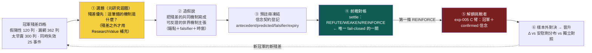

# 假說引擎：把第一個問題換成「現任冠軍上一次做錯的決策是哪些」

## 一句話：選題標準演化了三輪，終點是「殘差優先」

自動研究最容易長歪的地方，不是不會算，是**問錯了第一個問題**。這一頁的「第一個問題」已經被 owner 的三輪批評連續改寫，三個版本擺在一起看最清楚：

| 版本 | 第一個問題 | 死穴 |
|---|---|---|
| 第一輪 | 「今天**最大的知識缺口**是什麼？去收斂它」 | 會被鑽漏洞：製造容易收斂的假缺口再關掉它們，帳面漂亮、真未知一格沒動 |
| 第二輪 | 「**ResearchValue** 最高的未知是什麼？」（不確定×決策相關×可辨識×資訊增益÷成本時間） | 更好的排序啟發式，但分子三項全是**引擎自估**——DecisionRelevance 可以吹、Identifiability 可以吹、InfoGain 可以吹 |
| **第三輪（現行）** | 「**現任冠軍上一次真實決策，錯在哪裡？**」——從 [冠軍殘差四格](champion-challenger.md) 長出假說 | 殘差有限、只照亮冠軍附近的未知（見第四節誠實邊界）——所以 ResearchValue 退為**殘差之外**的補充選題器 |

第三輪的關鍵洞見：**殘差自帶 DecisionRelevance，不需要任何人打分。** 「2609 陽明在候選池排 43 落選、隨後超額 +128.2%」——這個問題值不值得研究，不用引擎自估「這攸關重大決策」，因為它**就是**一筆真實漏掉的錢。第二輪 ResearchValue 想用公式逼出來的性質（決策相關、可辨識、有資訊增益），殘差天然全有：它掛在一筆具體決策上（相關）、有明確的事前候選池與事後報酬（可辨識）、而冠軍還在場上每月做同型決策（解開就能用）。抽象的「最大未知」要靠自估撐腰；**具體的「上次做錯的事」自己就站得住。**



黃色那格（選題）決定研究**往哪裡花力氣**，現在由殘差餵；綠色那格（對帳）決定**帳能不能作假**，仍然是全迴圈唯一無法被自估膨脹的關卡；紅色那格（挑戰者）目前 blocked——帳上零條 confirmed 信念，見 [實驗 005](exp-005-king2-prereg.md)。

## 一、殘差四格怎麼長出假說：三個真案例走一遍

殘差不是抽象分類，是 5,409 列帶名字、帶日期、帶報酬的資料（口徑與計數見 [現任冠軍制度](champion-challenger.md)）。從殘差到假說的動作是：**找一格裡的重複形狀，把它寫成一條可反證的世界機制主張**。用三個已入帳的最重案例示範這條路怎麼走（以下「候選假說」是**示意方向，帳上尚未登記任何一條**）：

- **漏網（落選後大漲）→ 世界層假說。** 2609 陽明 2020-12-10 事件：score 只 0.649、池排 43 落選，隨後 +133.6%（航運超級週期）。這格的共同形狀若是「產業級供需反轉初期，個股月營收動能還沒跟上、但世界層事件已經確認」，候選假說就是一條世界機制主張：「當 X 型產業事件（運價／報價連續上行 N 週）確認時，該產業內營收動能排名偏低的成員在其後 M 週有正超額」——帶事前可查的錨點、帶 falsifier、可登記進 [信念契約](world-belief-contract.md) 做前瞻對帳。
- **假陽性（入選後大跌）→ 失效前兆假說。** 3147 於 2026-06-10 以池內第 3 名入選，隨後超額 −35.5%。若這格的共同形狀是「高分入選但某類世界層負訊號已出現」，候選假說就是「入選當下存在 Y 訊號者，主窗超額顯著低於無訊號組」——這正是 exp-005 **E 臂**（信念控曝險、不改選股）想吃的錢。
- **太早賣 → 持有層假說。** 1785 光洋科入選賺 +12.5% 出清後又漲 +41.4%。這格屬 [持有期生命週期](fw-holding-lifecycle.md) 的地盤：假說形如「出清時 Z 條件成立者，下輪進場前仍有正殘餘 Alpha」——退出規則的研究從此有了真資料的靶。

另有一條**已浮出但尚未成形**的線索：25 個「同時失效」事件裡只有 2 個發生在弱盤——集體失效集中在**盤面健康時**，代表 regime 覆蓋層已經接住弱盤，殘差指向健康盤的選股機制本身。這是目前最值得長出第一條假說的方向。

## 二、ResearchValue 退位：殘差之外的補充選題器

第二輪的 ResearchValue 公式沒有被丟掉，但位階變了——**從主選題器退為補充選題器**：

```
                 Uncertainty × DecisionRelevance × Identifiability × ExpectedInfoGain
ResearchValue ＝ ────────────────────────────────────────────────────────────────
                                      Cost × Time
```

它現在只管**殘差照不到的地方**：冠軍完全沒碰的錢（[冠軍四分支](champion-challenger.md)的「新策略」支）、與冠軍低相關的新研究線、基礎設施型問題（資料品質、口徑）。理由有二：

- **殘差優先勝在真值錨定。** ResearchValue 的分子三項全是自估、可被灌水；殘差的決策相關性是歷史事實。兩者都在手上時，永遠先用不會說謊的那個。
- **但殘差有照明範圍限制。** 殘差只照亮「冠軍附近」的未知——它會告訴你 king2 哪裡錯，不會告訴你「有一整類 king2 根本沒參與的機會存在」。全靠殘差選題，研究會收斂成「把冠軍修得更好」的局部搜索。所以殘差之外，仍需要一個排序啟發式，ResearchValue 是目前最好的候選——**用的時候要記得它可被 game，別把它當真值分數。**

## 三、真正的防線仍是信念到期對帳（fail-closed 錨）

選題標準換了三輪，這一條從第二輪起就沒變、也不該變：**無論問題怎麼選出來，最後都要落成一條預註冊、會到期、被真 outcome 打分的信念——settle 是整條迴圈唯一無法被自估膨脹的關卡。** 你可以把一格殘差的重要性講得天花亂墜，但你騙不了 settle：市場到期時要嘛付了錢、要嘛沒付，Wilson 下界是純碼算的，LLM 一個字都進不了裁決。

機件已被 [實驗 004](exp-004-belief-contract.md) 用真資料驗證：B-H-003 事前凍結靶（antecedent／predicted／falsifier／主窗 5 日、先驗 0.5），到期 86 筆對帳僅 27 命中、平均超額 −0.76%，兩條否證子句齊發，純碼判 REFUTE、信心 0.5 → 0.2256；同機制的 B-H-001 只發一條否證，判 WEAKEN、0.5 → 0.3913。**該推翻的推翻、該削弱的削弱，規則靠證據自己分流**——這就是殘差長出的假說未來要走的同一條對帳路。在冠軍制度裡它還多了一重意義：**第一條撐過對帳的 REINFORCE（confirmed）信念，就是解鎖 exp-005 C 臂的鑰匙**——挑戰者的資格不由任何人核發，由 settle 核發。

## 四、誠實對帳：機件現況（2026-07-22，讀 `data/aaro.sqlite`）

| 元件 | 狀態 | 事實 |
|---|---|---|
| `research_gap` 缺口表＋`next_agenda()` 純碼排序 | 【已設計・在用】 | schema 齊全、`priority DESC` 純碼排——紀律對，但排的還是策略調參題 |
| `closed_frontier` 死方向帳 | 【已設計・在用】 | 負結果同權入帳、查重閘擋重撞 |
| 冠軍殘差資料集 | 【已落地】 | 100 事件 5,409 列、四類計數齊、具名案例入 `king2_residuals.json` |
| **殘差 → 假說** | 【**零條**】 | 帳上沒有任何一條從殘差長出的世界假說——第一節的候選假說全是示意方向 |
| 信念契約 settle 機件 | 【已驗證】 | exp-004 兩條真 settle（REFUTE／WEAKEN）；**confirmed＝0，C 臂因此 blocked** |
| ResearchValue 評分器 | 【未實作】 | 仍是設計；現行排序是單一 `priority` 欄 |

把帳上所有 `status='open'` 的缺口攤出來，它們**全部**仍是策略／因子層問題（`king_ablation`、`king_aaro_addon`、`lineage_R015`、`lineage_R011`）。第三輪重構之後，這張缺口帳的**正確餵法**已經確定——從殘差四格長題——但**餵的動作還沒發生**。

## 五、薄縱切紅線：第一條殘差假說，勝過十個選題框架

把選題制度講三輪，最大的風險是又掉進 [誠實紀律](discipline.md) 點名的 architecture-first：去蓋一台「殘差自動聚類 → 假說自動生成 → ResearchValue 自動排序」的宏大選題引擎。**別。**下一步只有一刀：**從殘差四格（優先「健康盤同時失效」或「漏網」格）人工長出第一條世界假說，登記進信念契約，跑到 settle。** 一條真的走完「殘差→假說→對帳」的鏈，勝過任何選題框架的十頁設計——而且它同時是 C 臂解鎖鏈的第一步。等這條鏈真的 settle 過幾條，再談要不要自動化選題。

## 六、誠實邊界（不得省略）

- **「殘差優先」目前是制度宣告，不是已運轉的管線。** 殘差資料集已落地，但帳上**零條**從殘差長出的假說、零條登記進信念契約、零條 settle。本頁第一節的三條候選假說是**示意方向**，不是已登記的主張。
- **殘差分類是描述性分位口徑**（p10／p90／p75），移動門檻計數就變；一列殘差＝一個值得研究的錯，不＝一個已定位的 bug。
- **殘差只照亮冠軍附近。** 全靠殘差選題會退化成局部搜索，這是 ResearchValue 保留為補充選題器的理由；但 ResearchValue 分子自估可 game 的老問題也原封不動地保留著——它是啟發式，不是真值。
- **殘差長出的假說可能全軍覆沒。** 第一批假說全被 REFUTE、C 臂長期 blocked，是完全合法的結局；一條 REFUTE 掉的信念本身就是知識（如 B-H-003），不保證換得到 Alpha。能跑 ≠ 有效。
- **「機制」一詞在兩層意思不同**：現行提案器 `gaps.py` 的「機制軸」指技術指標的 X 轉換（強勢怎麼算），本頁的「世界機制」指供需／傳導那一層。讀舊碼時別混淆。

延伸：冠軍制度、五角色與殘差四格全貌見 [現任冠軍制度](champion-challenger.md)；五臂預註冊與 C 臂 blocked 見 [實驗 005](exp-005-king2-prereg.md)；settle 機件與 B-H-003 全案見 [信念契約](world-belief-contract.md) 與 [實驗 004](exp-004-belief-contract.md)；主線全圖見 [研究迴圈](research-loop.md)；三迴圈各自的裁判見 [三個迴圈](three-loops.md)；現行提案器四軸枚舉的純碼細節見 [進化迴圈](method-evolution-loop.md)。

---

**被連結自（反向連結）：** [三個迴圈：認知、決策、元研究，各有各的裁判](three-loops.md) · [世界信念契約：被更新的是信念，不是世界](world-belief-contract.md) · [因果層：新聞→事件→供需→公司→財報→預期→價格](causal-layer.md) · [實驗 004：世界信念契約首度到期對帳](exp-004-belief-contract.md) · [實驗 005：king2 冠軍—挑戰者五臂預註冊（REGISTERED，零臂已跑）](exp-005-king2-prereg.md) · [整體架構與資料流](architecture.md) · [演化的目標：一個目標函數量不了三種東西](objective.md) · [現任冠軍制度：凍結 king2，讓所有研究繞著真決策轉](champion-challenger.md) · [研究作業系統：11 層與「別蓋空引擎」](research-os.md) · [研究迴圈：W/O/B/P 分離，主線繞著現任冠軍轉](research-loop.md) · [總覽：真正該演化的不是策略，是世界模型](overview.md) · [首頁：Alpha 進化迴圈研究 Wiki](index.md)
