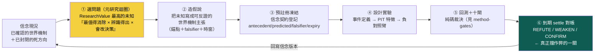
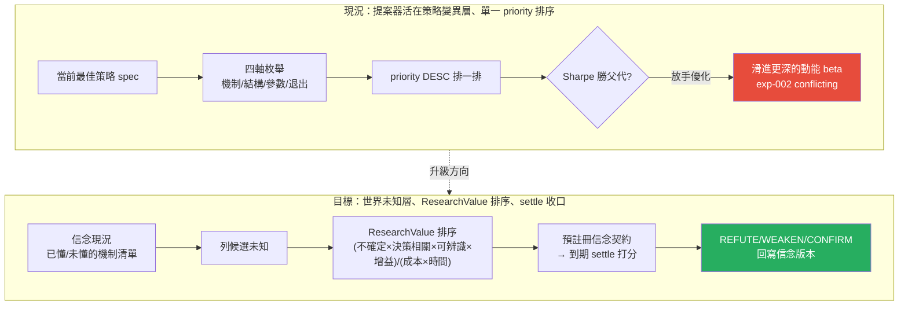

# 假說引擎：把第一個問題從「蒐集」換成「今天最值得消除的未知是什麼」

## 一句話：研究的第一個動作，不是算，是選對問題

自動研究最容易長歪的地方，不是不會算，是**問錯了第一個問題**。一台每天問「今天有哪些新聞、哪個因子又漲了」的引擎，會不停地蒐集、比對、找出「這段樣本裡誰付錢」——然後把「誰付錢」誤當成「我懂了什麼」。假說引擎要換掉的就是這個第一動作。

但「換成什麼」有講究。第一輪的答案是「每天問：**今天最大的知識缺口是什麼、去把它收斂掉**」。owner 第二輪批評把這個答案打回票：**「知識缺口收斂」會被鑽漏洞。** 一台被「收斂缺口」獎勵的引擎，會去**製造容易收斂的假缺口**、再把它們一個個關掉，帳面上「缺口數下降」很漂亮，實際上一格真正重要的未知都沒動。這跟第三節那個「優化 Sharpe 只會找到 beta」是同一種病——**你獎勵什麼代理，它就把那個代理刷給你看**。

所以第一個問題要改得更精確：**「今天最值得花資源去消除、而且辨識得出來、又真的會改變某個決策的未知，是哪一個？」** 這一頁負責把這個提問講清楚、把它化成一條能排序的公式（ResearchValue），並**誠實承認這條公式本身也擋不住作弊、真正的防線在下游的信念到期對帳**。病灶本身寫在 [進化目標](objective.md)，三個迴圈的分工寫在 [三個迴圈](three-loops.md)，本頁只管**元研究迴圈**那一格：怎麼選問題。



黃色那格（選問題）決定研究**往哪裡花力氣**；綠色那格（到期對帳）決定**帳能不能作假**。第一輪只有黃色、沒把綠色接上，於是選問題那格一被獎勵「收斂缺口」，整台引擎就去刷假缺口。這一版的重點是：**選問題可以用公式排序，但公式擋不住自欺；真正 fail-closed 的是⑥那一關——每條信念都得預註冊一個會到期、會被真 outcome 打分的預測。**

## 一、把目標從「收斂缺口」換成 ResearchValue

owner 的替換很具體。研究議程的排序目標，從「哪個缺口最大、去收斂它」換成一條分數：

```
                 Uncertainty × DecisionRelevance × Identifiability × ExpectedInfoGain
ResearchValue ＝ ────────────────────────────────────────────────────────────────
                                      Cost × Time
```

每一項在問一件不同的事，缺任一項這個問題就不值得做：

| 項 | 在問什麼 | 為 0 會怎樣 |
|---|---|---|
| **Uncertainty** | 我對這個未知現在有多不確定？（信念熵） | 已經幾乎確定的事，研究它學不到東西 |
| **DecisionRelevance** | 解開它，會**改變**任何一個決策／政策嗎？ | 兩種答案都不改變你要做的事＝白算 |
| **Identifiability** | 用現有資料、PIT、無混淆，這未知**辨識得出來**嗎？ | 問一個沒有 falsifier、資料分不開的問題＝永遠得不到答案 |
| **ExpectedInfoGain** | 跑這個實驗，預期能削掉多少不確定？ | 期望資訊增益趨零＝跑了也白跑 |
| **Cost** | 算力／資料／人工成本 | 分母：越貴越不值得 |
| **Time** | 多久才拿得到 settle 訊號（牆鐘） | 分母：越久回饋越慢 |

這條公式把第一個問題從「**哪個缺口最大**」（純看 Uncertainty，鼓勵製造假缺口）升級成「**每單位資源，能消除的、決策相關的、辨識得出的不確定，最多的是哪個**」。特別是 owner 點名要加的 **Identifiability**——它直接堵掉「問一堆聽起來重要、但根本分不出因果、也沒有反證窗的大哉問」這種最常見的自我感動式研究。一個問題再相關，若在現有資料下**辨識不出來**（混淆拆不開、沒有乾淨的事前預期、沒有 falsifier），它的 ResearchValue 就該是 0，不該排進議程。

## 二、誠實承認：ResearchValue 的分子，本身也是可被 game 的 proxy

這是本頁最重要、也最容易被跳過的一段。**換上 ResearchValue 不等於解決了作弊問題，只是把作弊點搬了位置。**

「知識缺口收斂」可以被刷假缺口。那 ResearchValue 呢？它的分子有三項——DecisionRelevance、Identifiability、ExpectedInfoGain——**這三項全都是引擎自己估的**。沒有任何外部真值強制它們誠實：

- 引擎可以**高估** DecisionRelevance：把一個其實不改變任何決策的問題，說成「這攸關重大部位」；
- 引擎可以**高估** Identifiability：宣稱「這資料分得開、有乾淨 falsifier」，實際上一堆混淆；
- 引擎可以**高估** ExpectedInfoGain：把預期資訊增益吹大，讓自己想做的題目排到最前。

換句話說，**ResearchValue 是一個更好的排序啟發式，不是一個自我認證的真值分數。** 它把「該做哪個研究」排得更合理，但它擋不住一個有動機自欺的引擎去膨脹自己的分子。如果把 ResearchValue **本身**當成適應度去大量優化，你會得到一台很會**把自己的問題估得很高分**的引擎——這正是 [進化目標](objective.md) 那條「你獎勵什麼代理它就刷什麼」的病，只是換了個代理。

**所以真正防作弊的，不在選問題這一關，在下游。**

## 三、真正的防線：信念到期對帳（fail-closed 錨）

ResearchValue 挑出來的問題，最後都要落成**一條預註冊、會到期、會被真 outcome 打分的信念**——這一步才是整條迴圈**唯一無法被自估膨脹的關卡**。你可以在事前把一個問題的 DecisionRelevance 吹到天上，但你**沒辦法騙 settle**：市場到期時要嘛付了錢、要嘛沒付，Wilson 下界是純碼算的，LLM 一個字都進不了那個裁決。

這正是 [信念契約](world-belief-contract.md) 存在的理由。看 [實驗 004](exp-004-belief-contract.md) 那條被推翻的信念 **B-H-003**，它把「選問題階段講得多好聽」跟「對帳階段認不認帳」的落差演得一清二楚：

- **事前**（v1 REGISTERED，2026-07-17 18:54）：信念「漲價事件後、未預先反應的標的在數日內遲滯重定價」，凍結成一個可反證的靶——antecedent `pre_event_runup_20d_max<=0.1`、predicted `direction=positive 成本後超額`、主窗 5 日、falsifier「主窗成本後平均超額 <=0 或 p_noise>0.05 或 n<20」。confidence 先驗 0.5。
- **到期**（v2 REFUTE，2026-07-17 19:00）：evidence＝`prediction_outcome` id 87..172 共 **86 筆**真 outcome，**n=86、k=27 命中、hit_rate 31.4%、成本後平均超額 −0.76%**。純碼用 `wilson_lower_bound_95_vs_coinflip`：wilson_lo=0.2256、wilson_hi=0.418。規則判定「wilson_hi<=0.5 且 avg_excess<=0」兩個否證子句齊發 → `update_action=REFUTE`，confidence 從 **0.5 → 0.2256**。與 MIEE 自身 `status='refuted'` 一致。

重點在這裡：**這條信念事前在選問題階段大可被估成高 ResearchValue（漲價傳導攸關很多標的、看起來辨識得出、預期增益大）——但那些自估全都不算數，算數的是 86 筆真對帳。** 選問題階段的分數只決定「值不值得去問」；只有到期對帳決定「信念該升該降」。把這一關接上，選問題階段就算被灌水，也灌不進最終的信念版本——**議程可以被 game，settle 不能**。這是整台假說引擎唯一的 fail-closed 錨。

## 四、病灶六在假說層的長相：提案器活在「策略變異層」

owner 第一輪的批評也落在這一層：目前這台引擎的提案器問的不是「該解哪個世界機制未知」，是「當前最佳策略的下一個單變因變異該試哪個」。這在 [進化迴圈](method-evolution-loop.md) 裡明擺著——`gaps.propose_next()` 沿四條軸枚舉：

- **機制軸**：換一個強勢濾網的 X 轉換（區間位置／趨勢一致性／創新高／高位持續性／原始動能）；
- **結構軸**：拆掉濾網、看純 rank 有沒有增量；
- **參數軸**：同機制換門檻／窗口／TopN；
- **退出軸**：提前賣天數 A↔B 翻轉。

四條軸全部是**策略內部的變異方向**。它問的是「這台策略機器的下一顆螺絲該換哪一顆」，而**不是**「這個世界我還有哪一塊機制沒搞懂、而且值得且辨識得出地去搞懂」。用 ResearchValue 的語言講：現行提案器的分母（Cost/Time）算得很細，分子卻**整個塌縮成 Uncertainty 一項**（哪組因子沒共測過），完全沒有 DecisionRelevance、Identifiability 這兩把關鍵的閘——這就是它會滑進 beta 的結構性原因。

## 五、誠實對帳：殼是好的、內容全在策略層

不能說「完全沒有假說引擎」——骨架是全機最完整的研究記憶之一。但也不能說「已經在選決策相關的世界未知」——它選的全是策略變異。三態攤開：

| 元件 | 狀態 | 事實（資料截止 2026-07-22，讀 `data/aaro.sqlite`） |
|---|---|---|
| `research_gap` 缺口表 | 【已設計・在用】 | schema 齊全（gid／question／source／family／priority／rationale／status），有真資料在跑 |
| `next_agenda()` 純碼排序 | 【已設計・在用】 | 讀 `status='open'`、按 `priority DESC` 排序，**純碼排、非 LLM 觀感**——這條紀律是對的 |
| `closed_frontier` 死方向帳 | 【已設計・在用】 | 死方向入帳、查重閘 `check()` 會擋重撞（負結果同權入帳）——這已經是「重複研究率」的雛形 |
| `priority` 排序依據 | 【擺錯位階】 | 現在只是單一 priority 欄，**不是 ResearchValue 四因子**；沒有 DecisionRelevance／Identifiability 閘 |
| 世界機制缺口提案 | 【幾乎空殼】 | 帳上**沒有任何一條** gap 是在問「世界機制未知」 |
| 信念到期對帳接回選問題 | 【剛起步】 | exp-004 兩條信念真 settle，但尚未回饋成「哪類問題事後證明高/低 ResearchValue」的失敗歸因 |

把帳上所有 `status='open'` 的缺口攤出來，它們**全部**是策略／因子層的問題（`king_ablation` 王牌成分歸因、`king_aaro_addon` 因子疊加、`lineage_R015` 因子交互、`lineage_R011` 驗證換真對帳）。連那條被標成 `source='knowledge_gap'` 的條目，內容也是「兩條確認線相關應低、分散可能提升 Sharpe」——依然是因子相關性，不是世界機制。`closed_frontier` 也一樣，已封閉的三個方向全是因子家族的死路。

一句話收斂：**假說引擎的殼是好的（缺口帳＋純碼排序＋死方向入帳），但排序只用單一 priority、內容全在策略變異層。要升級的是兩件事——把排序換成 ResearchValue 四因子、把提問來源從『策略 spec』抬到『決策相關的世界未知』。**

## 六、升級的樣子：把提案器抬到世界未知層，用 ResearchValue 排序



升級成什麼樣，就是把本頁頂上那條閉環真的接起來：

1. **選問題**：`propose_next()` 的枚舉來源，從「當前最佳策略的四軸變異」換成「信念帳上標記為未懂／低信心的機制節點」；排序從單一 priority 換成 **ResearchValue 四因子**——特別是加上 DecisionRelevance 與 Identifiability 兩閘，濾掉「不改決策」和「辨識不出」的問題。
2. **造假說**：未知編譯成一條**可反證的世界機制主張**，帶錨點引文、falsifier、時窗（沿 [世界訊號](fw-world-signal.md) 反證必填與 [質化引擎](fw-qual-engine.md) 錨點紀律）。
3. **預註冊凍結**：登記進 [信念契約](world-belief-contract.md)——antecedent／predicted_outcome／falsifier／expiry 全部凍結，之後不准改靶。
4. **設計實驗＋回測**：假說展開成事件定義 → PIT 特徵 → 負對照臂，走完與價量特徵完全相同的十閘（[方法：證據閘（十道關卡）](method-gates.md)）與純碼裁決。
5. **到期 settle**：真 outcome 到齊，純碼判 REFUTE／WEAKEN／CONFIRM，回寫信念版本——**這一關才是防作弊的錨，見第三節。**
6. **失敗歸因回饋議程**：settle 結果回頭校準「哪類問題事後證明高／低 ResearchValue」——這才讓元研究迴圈的裁判（單位成本資訊增益／重複率／失敗歸因，見 [三個迴圈：認知、決策、元研究，各有各的裁判](three-loops.md)）真的閉環。

換句話說：**閉環的每一步機件幾乎都已經存在（缺口帳、純碼排序、十閘、exp-004 的信念 settle），缺的是把第①步的排序換成 ResearchValue、把第⑤⑥步的 settle 真的接回議程。** 這是位階與裁判的搬移，不是從零蓋一套新引擎。

## 七、薄縱切紅線：別為了這個升級去蓋一台「世界未知提案器」大工程

把提案器抬到世界未知層，**聽起來**像要蓋一套「掃描全世界機制缺口 → 自動算 ResearchValue → 自動提假說」的宏大系統。**別。**那正是 [誠實紀律](discipline.md) 點名的 architecture-first 致命盲點——先把大架構鋪滿、日後研究失敗卻無法歸因到哪一層。正確修法分兩刀：

- **第一刀（現在就做，便宜且正確）**：重構敘事與排序目標。把提問從「該換哪個濾網」改寫成「該解哪個決策相關、辨識得出的世界機制未知」，把排序從單一 priority 換成 ResearchValue 四因子。這只動觀念與排序函數，不動架構。
- **第二刀（走薄縱切，不蓋空引擎）**：**只挑一條**真實的「觀測 → 信念 → 假說 → 驗證」機制鏈（例如 CoWoS 擴產 → 台積電產能 → 相關供應鏈的傳導，或台電強韌電網 → 受惠標的），把它從頭填滿、預註冊一條信念、跑到 settle。用這一條真鏈證明「用 ResearchValue 選世界未知」真的比「刷策略變異」多找到東西，**再**談推廣。**先把一條鏈填滿並 settle 一次，不要先把十一個引擎的殼擺滿。**

兩刀順序不能顛倒：沒有第一刀，第二刀填出來的鏈仍會被舊排序拉回去追 beta；沒有第二刀只有第一刀，敘事對了但沒有任何真 settle 證明升級有價值。

## 八、誠實邊界（不得省略）

- **ResearchValue 目前是設計，不是線上評分器**。現行排序仍是單一 `priority DESC`；四因子（尤其 DecisionRelevance／Identifiability）尚未化成 `kb.py` 裡跑著的計算。「換成 ResearchValue」是方向，未實作。
- **ResearchValue 的分子是自估、可被 game**（第二節）。它是更好的排序啟發式，不是自我認證的真值。**唯一 fail-closed 的防線是信念到期對帳**（第三節、[世界信念契約：被更新的是信念，不是世界](world-belief-contract.md)），不是這條公式本身——這是本頁最不能省的一句。
- **本頁描述的閉環尚未以「世界未知」為輸入真跑過**。第②–⑤步的機件在 [實驗 002](exp-002-ablation.md) 已對**策略層**假說真跑、在 [實驗 004](exp-004-belief-contract.md) 已對**信念**真 settle 兩條；但第①步「以決策相關世界未知為提問來源」目前**沒有**任何真資料——帳上零條世界機制缺口。
- **提案器的「機制軸」名字會誤導**：`gaps.py` 的「機制軸」指換一個**技術指標的 X 轉換**（強勢怎麼算），不是換一個**世界機制**（供應鏈怎麼傳導）。同一個「機制」詞在兩層意思完全不同。
- **升級沒有把握一定找得到東西**：即使把提問抬到世界未知層、用 ResearchValue 排序，也完全可能「解完那格未知、settle 發現它對報酬沒有增量」。這是合法結局——一條 REFUTE 掉的信念（如 B-H-003）本身就是知識，不保證換得到 Alpha。這沿 [誠實紀律](discipline.md) 的三效度閘：能跑 ≠ 有效。

延伸：三個迴圈（認知／決策／元研究）各自的裁判見 [三個迴圈](three-loops.md)；進化目標為何錯、為何一把尺不夠見 [進化目標](objective.md)；信念怎麼被真證據逐版更新、B-H-003 的完整 settle 見 [信念契約](world-belief-contract.md) 與 [實驗 004](exp-004-belief-contract.md)；整條研究迴圈的骨架（W/O/B/P 分開）見 [研究迴圈](research-loop.md)；現行提案器的純碼細節與四軸枚舉見 [進化迴圈](method-evolution-loop.md)；那條 exp-002 的 conflicting 證據見 [實驗 002](exp-002-ablation.md)。

---

**被連結自（反向連結）：** [三個迴圈：認知、決策、元研究，各有各的裁判](three-loops.md) · [世界信念契約：被更新的是信念，不是世界](world-belief-contract.md) · [因果層：新聞→事件→供需→公司→財報→預期→價格](causal-layer.md) · [實驗 004：世界信念契約首度到期對帳](exp-004-belief-contract.md) · [整體架構與資料流](architecture.md) · [演化的目標：一個目標函數量不了三種東西](objective.md) · [研究作業系統：11 層與「別蓋空引擎」](research-os.md) · [研究迴圈：世界不被更新，被更新的是信念](research-loop.md) · [總覽：真正該演化的不是策略，是世界模型](overview.md) · [首頁：Alpha 進化迴圈研究 Wiki](index.md)
