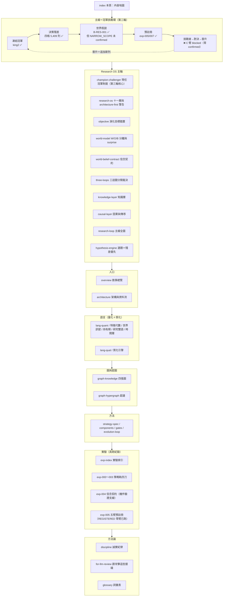

# Alpha 進化迴圈研究 Wiki

這是一份**攤在陽光下請人來拆的研究筆記**。它記錄一台自動進化引擎：把每次實驗當可否證證據、把累積知識當可查詢圖，讓另一個 LLM 能指著某一步說「這裡做錯了」或「這裡可以更好」。凡是裁決，都能被別人用同一份資料重算出同一個結論——它**不是黑箱**。

而這份 wiki 自己被拆了**三輪**，三輪各修一個層次的錯：

- **第一輪（演化什麼）**：整份敘事把「策略」當演化對象，但該演化的是「世界模型」——對『市場如何運作』的一組可反證信念。直接證據是引擎自己的實驗（[[exp-002-ablation|實驗 002]]）：讓它優化策略級指標，它就找到動能捷徑、一再重新發現動能 beta（限這段樣本）。
- **第二輪（怎麼分開裁決）**：①世界 W／觀測 O／信念 B 要乾淨分離——被更新的永遠是信念，投資賺的是 surprise＝新觀測−市場預期（[[world-model]]、[[world-belief-contract|信念契約]]）；②「只演化世界模型」矯枉過正，應拆成 [[three-loops|認知／決策／元研究三迴圈]]分開裁決；③選題用 ResearchValue 取代可被鑽漏洞的「缺口收斂」；④exp-002 別說過頭。
- **第三輪（主線接回真決策，2026-07-22）**：前兩輪修完，主線仍**斷成兩段**——owner 真錢在跑的最強策略 king2（wiki 幾乎不談），與跟任何真實決策無關的信念契約支線（[[exp-004-belief-contract|實驗 004]] 是**機件驗證**，不是主線）。修法＝**現任冠軍制度**：凍結 king2 當冠軍（永不覆寫）→ 攤開它的決策殘差 → 從殘差長出世界假說（天然決策相關，勝過抽象「最大未知」）→ 預註冊 → 挑戰者 → 樣本外對決 → 晉升追加新列。新增 [[champion-challenger|現任冠軍制度]] 與 [[exp-005-king2-prereg|實驗 005 五臂預註冊]] 兩頁，並改寫 [[hypothesis-engine|假說引擎]]（選題改殘差優先）與 [[research-loop|研究迴圈]]（主線圖加冠軍挑戰環）。
- **第四輪（載具層，2026-07-22）**：king2 回答「要不要看多這家公司」，載具回答「用什麼**報酬形狀**表達這個信念」——四種商品（股票／權證／CB／CBAS）不混進同一個選股分數，路由永遠在選股之後。新增 [[instrument-router|載具路由器]]（五載具對照＋InstrumentUtility）、[[cb-cbas|CB／CBAS 知識與誠實歸戶]]（六維覆蓋現況：債底半套＝歷史賣回價無資料源是最大缺口；CBAS 零實作觀察區；已判死清單勿重跑）、[[order-execution-ui|下單協調邏輯]]（去識別化：雙塔分工／八道閘鏈／零自動送單／多載具擴充點，附「請 LLM 檢視的協調問題」）、[[exp-006-cb-router-prereg|實驗 006 CB 路由（構想級）]]。

先講最重要的三件事，免得被印象帶偏：①別被漂亮數字帶走——引擎生成過年化 33% 的策略（[[exp-001-candidate-c|實驗 001]]），然後自己拆穿它是 beta 相加（[[exp-002-ablation|實驗 002]]）；②別被「機件很誠實」帶走——機件誠實，但演化對象、裁決分工、主線錨點三個層次都曾擺錯，這正是三輪批評依次修的；③**別把第三輪讀成「世界信念已經改善 king2」**——目前真實存在的只有凍結冠軍、殘差資料集、預註冊三樣，零個挑戰臂跑過、零次對決、零次晉升。

如果你只有三分鐘：讀 [[overview]]（敘事總覽）→ [[champion-challenger|現任冠軍制度]]（第三輪主線）→ [[research-loop|研究迴圈]]（W/O/B/P × 冠軍挑戰環全圖）→ [[for-llm-review]]（我最想被你攻擊的接縫）。想看真資料，跳 [[champion-challenger|殘差四格]] 與 [[exp-004-belief-contract|實驗 004]]。

## 這份 wiki 怎麼長大，以及這一輪為什麼重構

它是**會持續增長的實驗 wiki**，不是一次寫完的定稿。策略軌跑完四輪真實驗（[[exp-000-engine-first-run|000]]～[[exp-003-graph-evolution|003]]），信念契約機件驗證一輪（[[exp-004-belief-contract|004]]），冠軍挑戰軌完成凍結＋殘差＋預註冊（[[exp-005-king2-prereg|005]]，REGISTERED）。所有數字帶「資料截止 2026-07-22」與證據級標記；尚未實作或未驗證的部分一律明標「待補」或 provisional。

三輪重構全部是**敘事層與制度層的，不是又蓋引擎**。owner 同時警告：把研究迴圈拆成十一層是對的，但「真的把十一個引擎都蓋出來」正是 [[discipline]] 點名的 architecture-first 陷阱。修法兩條腿：①敘事與制度現在就修（便宜、正確）；②建置只走薄縱切——第三輪的薄縱切已經指名：**從殘差長出第一條世界假說、settle 它**，其餘一概不蓋。

## 內容地圖（分群 × 一句話）

### Research OS 主軸
- [[champion-challenger]] — **第三輪核心**：現任冠軍制度——凍結 king2（永不覆寫）、五角色（champion／challenger／belief_augmented／placebo／independent）、殘差四格真計數、研究問題從冠軍四分支長出。
- [[research-os]] — 十一層重構與「別掉進 architecture-first」的兩腿修法。
- [[objective]] — 演化目標錯置：優化策略級指標會找到動能捷徑（exp-002 直接證據）。
- [[world-model]] — W／O／B 乾淨分離；新聞三型；surprise＝O−市場預期。
- [[world-belief-contract]] — 信念契約：可版本化、可對帳、可被真觀測推翻；機件已由 exp-004 驗證。
- [[three-loops]] — 認知／決策／元研究三迴圈分開裁決。
- [[knowledge-layer]] — 知識層：事件與傳導沉澱成可查詢的圖。
- [[causal-layer]] — 因果與供應鏈傳導；誠實面對 edges 0 筆、供應鏈一階。
- [[research-loop]] — **主線全圖**：W/O/B/P 骨架 × 冠軍挑戰環（殘差→假說→挑戰者→對決→晉升）。
- [[hypothesis-engine]] — 假說引擎第三版：**選題殘差優先**（殘差天然帶決策相關性），ResearchValue 退為殘差外補充。

### 入口
- [[overview]] — 敘事總覽：從「拒絕相信自己」到「演化世界模型」到「繞著冠軍轉」。
- [[architecture]] — 一張大圖看懂閉環、每格對應哪頁、哪些格是真的哪些是空殼。

### 量化語言（策略投影的文法）
- [[lang-quant]] — 四層量化語言總覽。
- [[fw-feature-algebra]] — 特徵代數：B+X+W+R+O 型別化轉換樹。
- [[fw-world-signal]] — 世界訊號：可反證世界模型與行情九態（數值示意佔位）。
- [[fw-holding-lifecycle]] — 持有期生命週期：H0–H5 退出狀態機（殘差「太早賣」格的接收方）。
- [[fw-research-bilingual]] — 研究雙語與認知編譯器：E0–E4 證據級。
- [[fw-temporal]] — 時間層：幾乎整層未實作。

### 質化語言（新聞怎麼變成可反證特徵）
- [[lang-qual]] — 四層用法、三階段嚴格分離。
- [[fw-qual-engine]] — mcm→MIEE 雛形與誠實缺口（新聞真史 15 天）。

### 圖與超圖（記憶結構）
- [[graph-knowledge]] — 四張圖，全是 append-only 帳的投影。
- [[graph-hypergraph]] — 策略基因超邊與交互超邊（正典帳 1 條、判 conflicting）。

### 方法（引擎怎麼運作）
- [[method-strategy-spec]] — 策略基因 StrategySpec 九部件。
- [[method-components]] — 九部件從哪取用。
- [[method-gates]] — 十道證據閘：先確定沒作弊，再問有沒有用。
- [[method-evolution-loop]] — 進化迴圈六步。

### 實驗（真跑紀錄）
- [[exp-index]] — 索引與血統：策略軌四刀＋機件支線 004＋冠軍軌 005。
- [[exp-000-engine-first-run]] — 引擎首輪 A/B 退出時點對照。
- [[exp-001-candidate-c]] — 33% 的候選 C 與當場掛上的三張警告。
- [[exp-002-ablation]] — 動能捷徑的直接證據（conflicting）。
- [[exp-003-graph-evolution]] — 圖驅動三代：機件會轉，放手就滑進動能。
- [[exp-004-belief-contract]] — **機件驗證支線**：settle 機件 fail-closed 真跑（B-H-003 REFUTE 0.5→0.2256、B-H-001 WEAKEN 0.5→0.3913）；信念內容不在冠軍決策鏈上。
- [[exp-005-king2-prereg]] — **冠軍軌第一份預註冊**：五臂＋晉升五道門判準凍結、C 臂 blocked（零 confirmed）、機件考卷 12/12；**REGISTERED，零臂已跑**。

### 方法論（誠實與審查）
- [[discipline]] — 誠實紀律：provisional 封頂、負結果入帳、薄縱切、architecture-first 警告。
- [[for-llm-review]] — 給評審 LLM：最想被攻擊的接縫。
- [[glossary]] — 詞彙表。

## 一句話總綱

> **主線＝冠軍挑戰環：凍結冠軍 → 決策殘差 → 世界假說 → 預註冊 → 挑戰者 → 樣本外對決 → 晉升（追加新列，冠軍永不覆寫）。** 研究問題從冠軍殘差四格長出——每一列殘差都是一筆真的虧掉或漏掉的錢，決策相關性不必自估。環上完成到哪、還缺哪一段，一律由下方真相帳快照說了算（不再手寫）：

<!--STATE-->
> **現況快照（自 `aaro.sqlite` 真相帳投影，非手寫；由 `wm/state_projector.py` 於 build 時注入）**
>
> - 編號實驗：**8 個**（000–007，每個都指回帳本證據）
> - 信念契約：**6 條**＝策展 3＋自主示範 3；從冠軍殘差長出的世界假說 **1 條** → B-RES-001（NARROW_SCOPE，信心 0.445182）
> - 已 confirmed（REINFORCE 過基準且來自 SEALED 段）：**0 條（C 臂維持 blocked）**
> - 預註冊凍結：**7 份**（H-DEV2、EXP-005、AUTO-AR-1-C-normal-revH-chipL、AUTO-AR-2-C-normal-revM-chipL、AUTO-AR-3-C-normal-revL-chipL、OPEN-3fe5914572bb10d4、EXP-007）
> - C 臂狀態：**blocked**（需一條 confirmed 信念才解鎖）
> - 金庫可授 confirmed 的 SEALED 段：**1 個** → LIVE_FORWARD（SEALED，0 筆，未來事件累積中）
> - 自主搜尋輪：**5 輪**（無人選題自主 **4 輪**，示範迴圈自轉，結算在 EXPOSED 段故不可 confirmed）
<!--/STATE-->

環的中段仍未閉合：已有第一條從殘差長出的世界假說（B-RES-001），但它 `NARROW_SCOPE`、未 confirmed，挑戰者 C 臂因此維持 blocked，零對決、零晉升。

目前這台引擎最誠實的狀態，分三態說完：**機件會轉、帳務可信、能自我否證**（策略軌四刀＋settle 機件 fail-closed 真跑）；**主線地基已釘死但環的中段整段是空的**（殘差→假說→confirmed→對決全未發生）；**世界模型閉環其餘層多為空殼**（因果 edges 0 筆、新聞史 15 天、`temporal_edge` 未建、walk-forward 未跑）。所有策略裁決封頂 E2、真錢一律不動、冠軍是研究帳鏡像而真錢線唯讀。細節見 [[champion-challenger]]、[[research-loop]]、[[exp-005-king2-prereg]]、[[discipline]] 與 [[for-llm-review]]。
