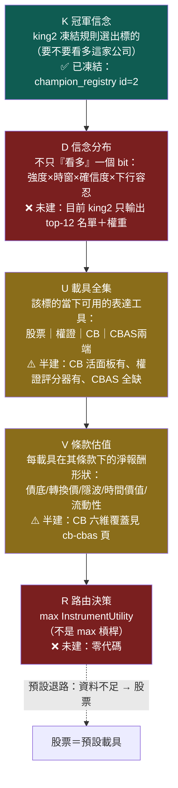
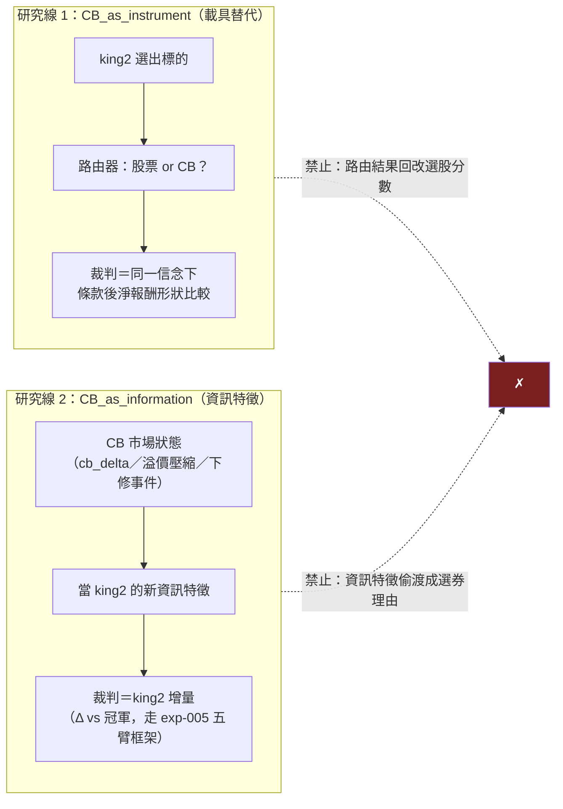

# 載具路由器：king2 決定看多誰，路由器決定用什麼報酬形狀表達

這一頁承載 owner 對「多載具」的核心鐵律，先把它一字不差地立起來：**king2 回答的問題是「要不要看多這家公司」；載具（股票／權證／CB／CBAS）回答的是「用什麼報酬形狀表達這個信念」。這是兩個不同的問題，四種商品不得混進同一個選股分數。** 載具路由器（Instrument Router）永遠站在 [冠軍 king2](champion-challenger.md) 選出標的**之後**——它不改名單、不改信念，只改表達方式。

> **認知答案**：選股與選載具是兩層獨立決策。第一層（king2）產出「對哪些公司、多強的看多信念、什麼時窗」；第二層（路由器）拿著這個信念分布，去每種載具的**條款與市況**下估「表達這份信念的淨效用」，選效用最高者。把 CB 折價、權證隱波、CBAS 槓桿倒進選股分數裡，會讓「公司好不好」跟「這張紙划不划算」互相汙染——那正是舊 CB 研究線用 #73 實驗證明過的死路（CB 選股 alpha＝動能換皮，FALSIFIED，詳見 [CB 與 CBAS：債底加選擇權的合體，與拆開賣的兩端](cb-cbas.md)）。
>
> **行動答案**：目前**路由器本體一行代碼都不存在**，存在的是它的地基：king2 凍結在 `champion_registry`（[現任冠軍制度：凍結 king2，讓所有研究繞著真決策轉](champion-challenger.md)）、851 檔 CB 活面板每天更新、下單 app 已有「權證模式」證明「標的→衍生品映射＋權重沿用」可行（[下單執行與作戰 UI：從訊號到真單的協調機制（全系統零自動送單）](order-execution-ui.md)）。owner 已裁決的推進順序＝①凍結股票冠軍 → ②建 CB 完整 PIT 條款行情 → ③先測「股票 vs CB」二載具路由 → ④再測 CB 市場當 king2 新資訊特徵 → ⑤最後才拆 CBAS 兩端 → ⑥權證只作短時窗催化劑支線。實驗設計見 [實驗 006：CB 載具路由四臂預註冊（構想級——判準未凍結、未入帳、零臂已跑）](exp-006-cb-router-prereg.md)。

## 一、K→D→U→V→R：路由器的完整資料流

owner 給的路由器不是一個 if-else，是一條五站管線。K（冠軍信念）在最上游、R（路由決策）在最下游，中間三站各自獨立可驗證：



五站各自的責任邊界：

- **K（冠軍信念）**：king2 的凍結規則產出「看多誰」。路由器對 K **唯讀**——任何路由結果都不得回流去改選股名單，否則兩層又混回一鍋。
- **D（信念分布）**：把「看多」展開成有形狀的信念：多強（分數距離門檻多遠）、多久（月頻換股窗 vs 事件催化時窗）、多確信（歷史同型事件的命中分布）、能吞多少下行。**這一站是目前最大的概念缺口**——king2 今天只給名單與權重，沒有給分布；沒有 D，路由器只能退化成「全部買股票」。
- **U（載具全集）**：逐標的枚舉當下真的存在、真的能成交的表達工具。注意是「這檔公司此刻有沒有活著的 CB／權證／可承作的 CBAS」，不是理論上的四選一——台股多數標的**只有股票一種載具**，路由器多數時候無事可做，這是常態不是缺陷。
- **V（條款估值）**：對每個候選載具，在**它自己的條款**下算報酬形狀：CB 要算債底與轉換溢價（[CB 與 CBAS：債底加選擇權的合體，與拆開賣的兩端](cb-cbas.md) 三式）、權證要算隱波與時間價值衰減、CBAS 要算權利金與提前終止條款。條款資料不足＝該載具直接出局，不得用假設值硬估（fail-closed）。
- **R（路由決策）**：用下一節的效用函數比大小。**預設退路永遠是股票**——股票是唯一無條款、無到期、無對手方的載具，任何一站資料不足都應塌縮回股票。

## 二、效用函數：InstrumentUtility，四個懲罰項缺一不可

路由決策的比較基準是同一個效用函數：

```
InstrumentUtility = E[條款後淨報酬]
                  − 風險懲罰（下行形狀：權證歸零風險、CB 信用風險）
                  − 流動性懲罰（成交得掉嗎：CB 僅 61–75% 日成交、權證靠造市商報價）
                  − 估值不確定懲罰（條款資料缺多少、模型假設多重）

CBAS 兩端在上式之外再扣三項：
                  − 交易對手懲罰（店頭契約，對手是券商不是交易所）
                  − 契約不透明懲罰（條款逐案議定，無公開標準）
                  − 提前終止懲罰（券商可依契約提前終止，路徑依賴）
```

三件事必須說破：

1. **「路由器不是選槓桿最高。」** 這句是 owner 的原話等級紅線。權證與 CBAS 選擇權端的 E[報酬] 項在看對時遠大於股票，但四個懲罰項（尤其估值不確定與流動性）會把大多數情境的效用打回股票之下。一個只看第一項的路由器＝一台自動買權證的賭博機。
2. **估值不確定懲罰是 fail-closed 的數學形式。** 缺賣回價→債底估不出→CB 的估值不確定懲罰趨近無限大→路由塌回股票。這讓「資料缺口」自動變成「不路由」，而不是「硬估後路由錯」。
3. **懲罰項的權重是研究對象，不是拍腦袋常數。** [實驗 006：CB 載具路由四臂預註冊（構想級——判準未凍結、未入帳、零臂已跑）](exp-006-cb-router-prereg.md) 的設計就是先預註冊懲罰結構、再用歷史數據回填量級——順序不能反。

## 三、五載具對照：本質、適合的信念、主要代價

| 載具 | 本質 | 適合表達的信念 | 主要代價 |
|---|---|---|---|
| **股票** | 公司所有權，線性報酬，無到期日 | 預設載具：中長期看多、時窗不確定、要吃股息與長尾 | 資金占用 100%；下行無地板（跌多少賠多少） |
| **權證** | 交易所掛牌的短天期選擇權，時間價值每天流失 | **短時窗、有明確催化劑、方向確信度高**的信念（見第五節：僅作支線） | 時間價值衰減；深價外歸零；隱波由發行商定價；到期日硬切 |
| **CB（可轉債）** | 信用調整債底＋轉換選擇權（拆解見 [CB 與 CBAS：債底加選擇權的合體，與拆開賣的兩端](cb-cbas.md)） | 看多但要下行地板：「漲我跟、跌我退回債底附近」的凸性信念 | 轉換溢價（買貴選擇權）；流動性差（僅六至七成日成交）；債底依賴發行人償債能力 |
| **CBAS 選擇權端** | 把 CB 拆開後的純轉換選擇權，權利金≈CB 市價−債底 | 極高確信、願付權利金換高槓桿、且接受店頭對手風險的信念 | 權利金歸零風險；店頭契約三重懲罰（對手／不透明／提前終止）；無公開行情 |
| **CBAS 固定收益端** | 把 CB 拆開後的債底現金流，收固定收益、讓渡轉換權 | 不看多股價、只賺信用利差的信念——**與 king2 的看多信念正交**，基本不在路由範圍 | 承擔發行人信用風險；流動性鎖死到期；同樣是店頭契約 |

讀表的方式：五行不是五個平行選項。股票是地板，CB 是「付溢價買凸性」，權證是「付時間價值買短爆發」，CBAS 兩端是「付店頭三重懲罰把 CB 的凸性拆到極致」。**沿表往下走，每一行都是拿更多懲罰項去換更尖的報酬形狀**——路由器的工作就是判斷 D 站的信念形狀值不值得付這個交換。

## 四、什麼情況 CB 比股票適合：八列情境

「CB 優於股票」不是 CB 便宜（折價）就成立——那是折溢價套利的思路，已判死（見 [CB 與 CBAS：債底加選擇權的合體，與拆開賣的兩端](cb-cbas.md) 已判死清單）。CB 勝出的條件是**信念形狀**與 CB 的凸性對得上：

| # | 情境 | 為什麼 CB 較適合 | 前提條款 |
|---|---|---|---|
| 1 | 看多但公司波動極大，下行超出容忍 | 債底提供地板，凸性「漲跟跌不跟」 | 債底可信（信用無虞＋賣回價可算） |
| 2 | 信念時窗長於權證壽命、短於永久持有 | CB 存續期 3–5 年，介於權證與股票之間 | 距到期／賣回日還有足夠時間價值 |
| 3 | 轉換溢價率低（CB 市價貼近轉換價值） | 幾乎用股票的價格買到「股票＋地板」 | 溢價率低不是因為流動性死水造成的假價 |
| 4 | 正股接近轉換價、Delta 在中段（0.3–0.7） | 凸性最值錢的區段：上行開始跟、下行還有墊 | Delta 口徑用實證分箱（px2delta）非純 BS |
| 5 | 預期有下修轉換價事件 | 下修＝選擇權履約價免費調低，股票拿不到這個 | 需追蹤 `cb_reset_distance` 與公司下修動機 |
| 6 | 大盤 regime 走弱但個股信念仍在 | 股票端會被 regime 閘減碼；CB 天然自帶減碼形狀 | 與 [下單執行與作戰 UI：從訊號到真單的協調機制（全系統零自動送單）](order-execution-ui.md) 的 regime 閘互動需先定義清楚 |
| 7 | 賣回日近且賣回收益率為正（YTP>0） | 最壞情境變成「持有到賣回收年化正報酬」 | **賣回價資料——正是目前最大缺口，此列今天算不出來** |
| 8 | 部位大到股票市場衝擊成本可觀 | CB 另一個池子分流（但 CB 池更淺，僅限中大型券） | 需查該檔 CB 日成交額；多數 CB 比正股更淺 |

誠實邊界：**這張表是路由器的假說清單，不是已驗證結論。** 八列裡每一列都要在 [實驗 006：CB 載具路由四臂預註冊（構想級——判準未凍結、未入帳、零臂已跑）](exp-006-cb-router-prereg.md) 的框架下逐列變成可反證的實驗；尤其第 7 列在歷史賣回價資料源補齊之前根本不可測。

## 五、權證：短時窗催化劑支線，不是月頻預設替代

權證在這套系統裡被明確**降級為支線**：它不參與月頻換股的預設路由，只在「明確催化劑＋短時窗＋高確信」三條件同時成立時作為戰術表達。理由有三：

- **時間結構對不上。** king2 是月頻持有策略，權證的時間價值衰減按日計費——拿按日燒錢的工具去表達按月結算的信念，衰減成本直接吃掉月頻信念的期望值。
- **定價權在對面。** 權證隱波由發行商報價，散戶端沒有隱波談判力；造市品質參差是證交所自己列名的風險之一。
- **歸零是常態結局。** 深價外權證到期歸零，「看對方向、看錯時點」在權證上是全損，在股票上只是套牢。

下單系統現況（誠實歸戶）：王牌下單 app 已有可跑的權證模式（權證模式：每檔標的映射到 權證評分器 評分最高的認購權證、權重沿用、走同一個 送單漏斗（唯一送單函式） 送單漏斗，見 [下單執行與作戰 UI：從訊號到真單的協調機制（全系統零自動送單）](order-execution-ui.md)）——**這是「標的→衍生品映射」的工程存證，不是權證支線已被驗證有效的證據**。催化劑判定、時窗控制、隱波過濾，全部未建。

官方風險來源（證交所）：

https://twse-regulation.twse.com.tw/m/LawContent.aspx?FID=FL007293

https://shl.twse.com.tw/page/land/commodity/4.html

（前者為證交所認購（售）權證風險預告書樣本之法規頁；後者為證交所宅在家學習網的權證投資風險教材。兩連結 2026-07-22 驗證可開；證交所權證教育宣導舊網址已隨官網改版失效，故以此二頁為準。）

## 六、兩條研究線，嚴禁互相汙染

CB 相關研究只有兩條合法路線，路由器只屬於第一條：



- **線 1（載具替代）**：名單不變，問「這個信念用 CB 表達會不會更好」。裁判是報酬形狀比較，實驗場在 [實驗 006：CB 載具路由四臂預註冊（構想級——判準未凍結、未入帳、零臂已跑）](exp-006-cb-router-prereg.md)。
- **線 2（資訊改善）**：CB 市場整體狀態（全市場 cb_delta、溢價壓縮、下修潮）當成 king2 的**候選新特徵**，問「加了它，冠軍的樣本外增量是多少」。裁判是 Δ vs 冠軍，必須走 [現任冠軍制度：凍結 king2，讓所有研究繞著真決策轉](champion-challenger.md) 的五臂對決框架，不得另立山頭。
- 兩線共用資料（同一批 CB 面板與條款），**不共用結論**：線 1 成立不代表線 2 成立，反之亦然。舊研究線的教訓正是把兩線混在一起——「CB 折價」既被當選券理由又被當市場訊號，最後兩頭都證偽。

## 七、已有 vs 缺口：路由器的誠實資產負債表

| 部件 | 已有 | 缺口 |
|---|---|---|
| K：冠軍信念 | king2 凍結（champion_registry id=2，sha256 釘死） | — |
| D：信念分布 | 無 | 全缺：king2 只出名單＋權重，強度／時窗／確信度分布未定義 |
| U：載具枚舉 | CB 活面板 851 檔每日更新；下單 app 權證評分器 評分器 | CBAS 可承作性零資料；「哪檔標的有活 CB」的映射表未固化 |
| V：條款估值 | CB 六維中三維全套、兩維半套（詳表在 [CB 與 CBAS：債底加選擇權的合體，與拆開賣的兩端](cb-cbas.md)） | 歷史賣回價無源→債底時序不可得；權證隱波史未收；CBAS 十項承作資料全缺 |
| R：路由決策 | 無 | 全缺：效用函數零代碼，懲罰權重零校準 |
| 執行腿 | 送單漏斗（唯一送單函式） 漏斗載具無關；權證模式已跑通 | CB 能否直接走 主券商 API 的股票合約腿**未查證**（面額 10 萬／單位不同）；CBAS 無 API、券商櫃檯業務 |

下一步唯一合法入口＝[實驗 006：CB 載具路由四臂預註冊（構想級——判準未凍結、未入帳、零臂已跑）](exp-006-cb-router-prereg.md)：先預註冊「股票 vs CB」二載具路由的判準與懲罰結構，在賣回價資料源補齊之前，只做不依賴債底時序的那部分。

相關頁：[現任冠軍制度：凍結 king2，讓所有研究繞著真決策轉](champion-challenger.md)｜[CB 與 CBAS：債底加選擇權的合體，與拆開賣的兩端](cb-cbas.md)｜[下單執行與作戰 UI：從訊號到真單的協調機制（全系統零自動送單）](order-execution-ui.md)｜[實驗 006：CB 載具路由四臂預註冊（構想級——判準未凍結、未入帳、零臂已跑）](exp-006-cb-router-prereg.md)

---

**被連結自（反向連結）：** [CB 與 CBAS：債底加選擇權的合體，與拆開賣的兩端](cb-cbas.md) · [下單執行與作戰 UI：從訊號到真單的協調機制（全系統零自動送單）](order-execution-ui.md) · [實驗 006：CB 載具路由四臂預註冊（構想級——判準未凍結、未入帳、零臂已跑）](exp-006-cb-router-prereg.md) · [實驗索引：每一輪真跑，逐環節攤開](exp-index.md) · [現任冠軍制度：凍結 king2，讓所有研究繞著真決策轉](champion-challenger.md) · [首頁：Alpha 進化迴圈研究 Wiki](index.md)
