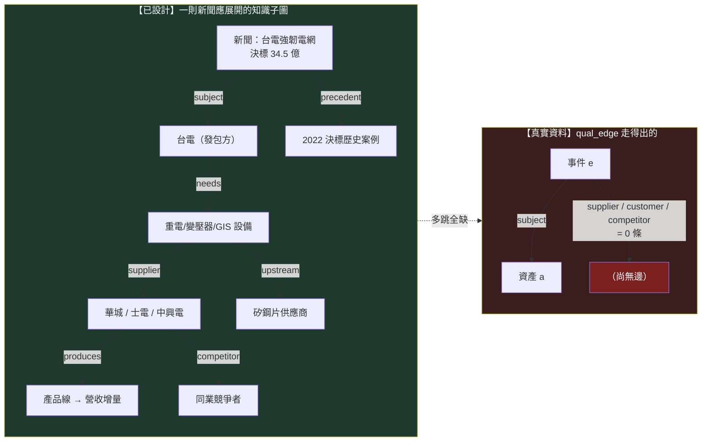

# 知識層：一則新聞展開成一張知識子圖

這一頁是 owner 深層批評的**病灶 2**。它問的是：當一則新聞進來，這台引擎把它變成了什麼？

> 一則新聞不該只被打成「正面／負面情緒」——那太淺，等於沒讀。一則新聞應該**展開成一張知識子圖**：`台電（發包方）→ 設備類別（重電/電網/變壓器）→ 受惠公司（華城/士電/中興電）→ 產品線 → 營收貢獻 → 歷史事件（2022 也發過標）→ 上游供應商（矽鋼片）→ 競爭者 → 歷史案例（上次決標後股價怎麼走）`。有了這張子圖，你才知道「這則新聞到底牽動了誰、透過什麼、以前發生過沒、可以拿什麼當代理」。這是把新聞當**世界模型的第二層**用，不是當情緒指標用。

知識層是 [世界模型](world-model.md)（病灶 3）往下走一步的具體化：世界狀態告訴你「世界現在是什麼」，知識層告訴你「這個事件在世界的關係網裡連到誰」。

## 認知答案與行動答案（先講結論）

- **認知答案**：知識子圖**已經有完整的設計語言、也真的建了一張圖表出來，但那張圖幾乎是平的**——374 條邊全部是同一種「這則事件講的是這檔股票」的一階關係，`台電 → 設備 → 公司 → 供應商 → 競爭者` 這種**多跳知識子圖，在真實資料裡不存在**。正式的世界模型邊表是 0 筆空帳。所以病灶 2 精確講不是「沒有知識層」，是「知識層退化成一張事件指向單一資產的星狀圖」。
- **行動答案**：不要一次把整張想像的供應鏈圖畫出來（[圖鐵律](graph-knowledge.md)：用想像的邊餵傳播比沒有邊還毒）。**選一條真鏈、逐邊帶證據錨點填深**——例如台電強韌電網那條，從發包方一路建到上游供應商與歷史案例，每一跳都指得回一則有逐字引文的新聞。填實一條，勝過畫十張空圖。

## 三態誠實對帳：知識子圖現在到底有多少邊

### 【已設計】哪些框架已經定義了「一則新聞→知識子圖」的語言

- [質化引擎](fw-qual-engine.md)的 **qual_edge** 沿 OCM（組織圖譜，全機最完整的「帶證據帶時效」二元邊實作）的 typed edge 形狀：`src / rel / dst / valid_from / valid_to / evidence / status / source`。每條邊必須指回帳裡的證據列（`evidence` 欄有 `CHECK`，非空 JSON 陣列，否則整條邊非法）。這正是「知識子圖的每條邊都要能溯源」的欄位級落地。
- [四張圖](graph-knowledge.md)定義了知識如何從 append-only 帳投影成可查詢的圖，第一鐵律「圖是帳的投影、不是第二真相源」保證圖不會長出想像的邊。
- **關係詞彙已存在**：MIEE（市場訊息演化引擎）的 `market_mapping.relation_type` 有 `subject / supplier / customer / peer`——這就是「事件→設備→公司→供應商→競爭者」多跳所需的邊型別詞彙。
- [敘事卡](fw-qual-engine.md)的「世界模型鏈」設計會沿 qual_edge 從 asset 節點**反向多跳走傳導路徑**，走不出就誠實回「尚無邊」——多跳查詢的機制本身已寫好。

### 【幾乎空殼】實際資料量（2026-07-22 查得，活管線會漂）

這是病灶 2 最刺眼的地方，數字攤開：

| 資料表 | 應該裝什麼 | 實際 | 意義 |
|---|---|---|---|
| AARO `qual_edge` | 事件↔公司↔供應鏈的多型別知識邊 | **374 筆，rel 全部是 `subject`** | 全是「這事件講的是這檔」，**零 supplier/customer/competitor 邊**——圖是平的星狀 |
| MIEE `market_mapping`（approved=1） | 人核過、可用的關係邊 | **374 筆全是 subject，supply_chain_distance 全 0** | 人核過的傳導邊＝**0**；唯一 1 筆 supplier 邊還沒核准 |
| mcm 正式 `edges` 表 | 提升為正典的因果/關係邊 | **0 筆** | 世界模型邊表是**空帳** |
| mcm `causal_observations` | 帶機制的因果觀察 | 108 筆（`company_role` 全空、單一 `proof_grade`） | 是**原始觀察料**，不是連成圖的邊 |
| mcm `nodes` | 知識圖節點 | 155 個 | 有節點、**沒有邊把它們連起來** |

翻成白話：**「一則新聞 → 台電 → 設備 → 華城 → 產品 → 營收 → 供應商 → 競爭者」這條子圖，在資料裡走不出第一跳**。qual_edge 的 374 條邊，每一條都只是「事件 e 指向資產 a」，沒有第二跳。[敘事卡](fw-qual-engine.md)首輪對 20 檔最新籃子出卡，只有 **1/20 有內容**（2408 南亞科 3 事件），其餘 19 檔的世界模型鏈都誠實顯示「尚無邊」。稀疏不是 bug，是 mcm 新聞只從 2026-07-07 起收、**真實歷史只有 15 天**的上游現實，加上多跳邊根本還沒被投影出來。

### 【擺錯位階】wiki 把研究記憶圖當主角、世界知識圖當延伸

- [四張圖](graph-knowledge.md)（定義／策略／證據／演化）講得很完整，但它們是**研究記憶側**——管實驗與策略的血統，不是 owner 病灶 2 講的世界知識子圖。
- owner 要的那張圖是**世界模型側**（實體關係／條件超圖／時間因果／決策狀態），它在 wiki 裡只出現在 [質化語言](lang-qual.md)的「第二層世界模型」一段，被描述成「只建圖不打分」的中間層，且落地狀態是三個誠實缺口（[框架：質化引擎（新聞→世界模型→特徵→Alpha工廠）](fw-qual-engine.md)）。**最完整的圖是研究側，最空的圖是世界側**——而 owner 要當根用的，恰好是最空的那張。

## 一張圖看懂：設計 vs 真實

左邊是設計該長成的子圖（八類節點、五種關係、帶歷史案例）；右邊是資料庫真的走得出的——一條 subject 邊到底，剩下全是「尚無邊」。病灶 2 就是這張圖左右的落差。

## 修法：填深一條，不畫寬十條

知識層的正確補法，繼承 [圖鐵律](graph-knowledge.md)與 [誠實紀律](discipline.md)的薄縱切原則：

1. **選一條真鏈填深**：拿台電強韌電網（或 CoWoS）這一條，把 `subject / supplier / customer / competitor / precedent` 五種邊**逐條建出來**，每條邊 `evidence` 欄引用一則帶逐字錨點引文（≥8 字原文子字串，MIEE 反捏造閘）的新聞。目標是這一條鏈**能從新聞多跳走到上游供應商與歷史案例**，而不是 374 條 subject 邊再加一堆想像箭頭。
2. **邊靠證據落地、不靠 LLM 畫滿**：LLM 只能**提案**候選邊（進候選佇列），成邊要嘛純碼從帳投影、要嘛靠人核 approved（[知識圖譜：四張圖](graph-knowledge.md)第三鐵律）。目前 4,350 筆未核准的 distance-1 對映就是候選料——它們該經人核逐條轉正，不是直接當邊用。
3. **接回世界狀態與因果**：這條知識子圖不是孤立的，它上接 [世界狀態](world-model.md)（台電政策是能源/基建世界狀態的 delta），下接 [因果層](causal-layer.md)（設備需求 → 營收 → 預期 → 股價的機制傳導）。三層填的是同一條薄縱切。

一句話收束：**知識層有完整的邊語言、有反捏造的證據閘、有多跳查詢機制——唯獨沒有多跳的邊**。病灶 2 的解不是再蓋一套圖框架，是把已有的框架**灌進一條真實、帶證據、走得出多跳的鏈**。

延伸閱讀：知識邊的機制傳導（H20→GPU→HBM→股價）→ [因果層：新聞→事件→供需→公司→財報→預期→價格](causal-layer.md)；世界狀態當根 → [世界模型：世界不是新聞，新聞是世界狀態的 delta](world-model.md)；qual_edge 的實作與三個缺口 → [框架：質化引擎（新聞→世界模型→特徵→Alpha工廠）](fw-qual-engine.md)；圖為什麼是帳的投影 → [知識圖譜：四張圖](graph-knowledge.md)；為什麼不能一次蓋 11 層 → [研究作業系統：11 層與「別蓋空引擎」](research-os.md)。

---

**被連結自（反向連結）：** [世界模型：世界不是新聞，新聞是世界狀態的 delta](world-model.md) · [因果層：新聞→事件→供需→公司→財報→預期→價格](causal-layer.md) · [整體架構與資料流](architecture.md) · [方法論：誠實紀律（拒絕相信自己）](discipline.md) · [研究作業系統：11 層與「別蓋空引擎」](research-os.md) · [研究迴圈：W/O/B/P 分離，主線繞著現任冠軍轉](research-loop.md) · [給 LLM 評審：請攻擊這些接縫](for-llm-review.md) · [總覽：真正該演化的不是策略，是世界模型](overview.md) · [首頁：Alpha 進化迴圈研究 Wiki](index.md)
