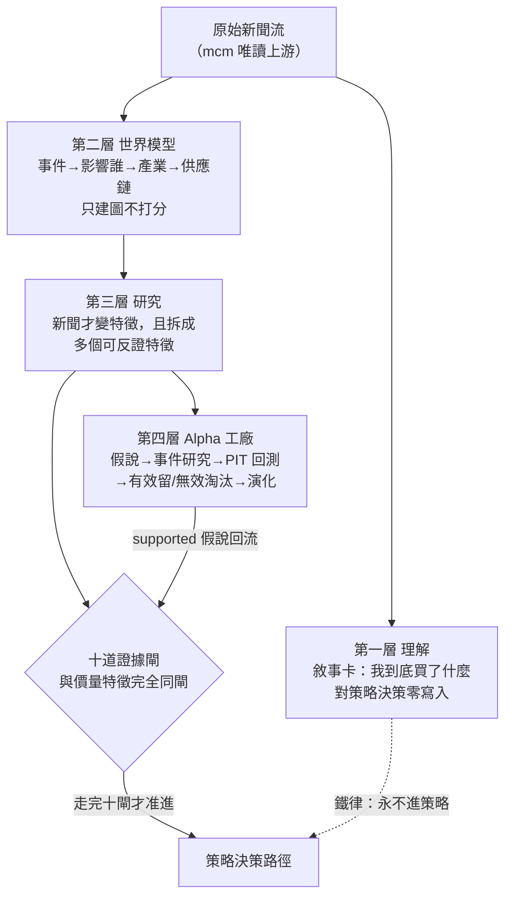

# 質化結構組成語言：新聞的四層用法

## 一句話先講清楚

量化語言棧（見 [量化結構組成語言（總覽）](lang-quant.md)）把價、量、財報拆成可組合的結構化特徵；**質化語言棧把「新聞」拆成四個彼此隔離的層**——理解、世界模型、研究、Alpha 工廠。這頁講的是這四層各做什麼、為什麼一定要分開，以及一條最硬的紅線：**新聞情緒分數這種單一數字，禁止直接當策略特徵**。它的實作面（qual_edge 證據邊、qual_hyperedge 題材超邊、敘事卡、機制詞彙對映）在 [框架：質化引擎（新聞→世界模型→特徵→Alpha工廠）](fw-qual-engine.md)。

owner 2026-07-22 補充的關鍵裁決是：**新聞不是拿來取代量化，而是量化策略的「第二層世界模型」**。所以不能把新聞直接拿去篩股票，而要把它拆成完全不同用途的階段，一層一層過關才准影響決策。

## 四層在做什麼

| 層 | 做的事 | 是否影響策略 | 對映 |
|---|---|---|---|
| 理解 | 每檔持股生成「為什麼可能會漲」的敘事卡，讓你每天知道買了什麼、不只有代號 | **完全不影響**——只解釋 | [框架：質化引擎（新聞→世界模型→特徵→Alpha工廠）](fw-qual-engine.md) 敘事卡 |
| 世界模型 | 事件 → 影響誰 → 產業 → 公司 → 供應鏈，做成知識圖譜（不是「正面/負面」情緒，那太淺） | 只建圖、不打分 | [知識圖譜：四張圖](graph-knowledge.md) 在資訊域的延伸 |
| 研究 | 新聞這時才變成特徵，且拆成「一組」可反證特徵（不是單一 News Factor），過同一套十道證據閘 [方法：證據閘（十道關卡）](method-gates.md) | 走完十閘才有資格進 | 特徵代數 [框架：特徵代數](fw-feature-algebra.md) 型別＋PIT |
| Alpha 工廠 | 假說 → 事件研究 → PIT 回測 → 有效入因子庫／無效記失敗原因 → 下一輪演化 | 產出的特徵回流進化迴圈 | 雛形＝MIEE（見下） |

**MIEE**（市場訊息演化引擎，訊息→事件→假設→事件研究→預測帳→換代的既有系統）就是第四層工廠的現成雛形——它不是本專案新蓋的，本專案只是把它歸戶為工廠雛形，第四層的實作因此「不是新蓋工廠，是接兩條線」：MIEE 的 supported 假說編譯成特徵、特徵以候選身分進進化迴圈，與價量特徵同權同閘。

## 三階段分離是鐵律，不是建議

這是整個質化語言棧最重要的設計判斷。三條紀律缺一不可：

1. **理解層零影響策略**：敘事卡是純投影，對策略與裁決表**零寫入路徑**（[框架：質化引擎（新聞→世界模型→特徵→Alpha工廠）](fw-qual-engine.md) 的敘事卡走 `mode=ro` 唯讀連線，考卷斷言它碰不到策略表）。理解層的任何輸出，永遠不進策略決策路徑。
2. **世界模型層只建圖不打分**：這層只把事件與供應鏈關係畫成帶證據的圖（見 [知識圖譜：四張圖](graph-knowledge.md)），不產生任何分數。
3. **研究層產出必須走完十閘**：只有研究層產出、且走完與價量特徵**完全相同**的 [十道證據閘](method-gates.md)的新聞特徵，才有資格進策略。

從這三條直接推出一條禁令：**「新聞情緒分數」這種單一數字，禁止直接當特徵**。owner 的原話研究紀律是——新聞的情緒、量、事件強度確實**可能**提供額外預測力，但是否**持續**產生 Alpha，必須經嚴格樣本外回測與交易成本驗證，不得直接假設有效。這正是 [方法論：誠實紀律（拒絕相信自己）](discipline.md) 頁「生成即拒絕相信」的精神在資訊域的落地。

## 新聞特徵長什麼樣（不是一個，是一組）

第三層要把新聞拆成多個可反證特徵，各自過閘。owner 列的特徵與既有積木對映如下（**多數積木只有「即時快照版」，歷史序列版未建**）：

- **News Volume**（近 30 天新聞量）、**Novelty**（是不是以前沒發生過）、**Expectation Gap**（新聞很好但股價沒動＝市場還沒反應）——前二者 MIEE 已有近親，第三者對應 [世界訊號](fw-world-signal.md)的 P 預期差。
- **Supply Chain Coverage**（整條供應鏈是否開始講同一件事）——靠 mcm 的 supply_chain_score（全機唯一現成的每則新聞供應鏈相關度值）。
- **Consensus / Persistence / Narrative Strength / Cross Industry / Policy / Capital / World State**——多為即時版近親或未建。

## 誠實邊界（不得省略）

- **新聞真實歷史只有 15 天**：mcm（股市新聞管線，market-cognition，17,279 篇/九維分數）自 2026-07-07 起收，所以**新聞特徵目前沒有回測深度**。第三層的回測型研究因此**不開工**，直到歷史回填零件建成。兩條出路並行：①**前瞻驗證**（MIEE 的 ignition_snapshot 凍結快照就是為此建的往前驗記錄器）；②**歷史回填**（從歷史新聞抽日期/指標/值三元組，帶錨點閘，規劃中未建）。
- **敘事卡已有零 LLM 版但覆蓋極稀**：首輪對 20 檔最新籃子出卡，只有 **1/20 有內容**（2408 南亞科 3 事件錨點可回溯），其餘 19 檔誠實顯示「尚無邊」——正是 15 天新聞史的上游現實。細節見 [實驗 000：引擎首輪 A/B 退出時點](exp-000-engine-first-run.md) 與 [框架：質化引擎（新聞→世界模型→特徵→Alpha工廠）](fw-qual-engine.md)。
- **世界模型層近乎空帳、機制詞彙兩套未對映**：見 [框架：質化引擎（新聞→世界模型→特徵→Alpha工廠）](fw-qual-engine.md) 的三個誠實缺口。

分期（掛在引擎 P 序列之下）：P1 隨附敘事卡頁與機制詞彙對映表（零影響策略、不阻塞主線）；P2 才做新聞特徵編譯器與歷史回填、多階供應鏈拓撲；P2–P3 才做工廠全閉環。

下一站：實作面看 [框架：質化引擎（新聞→世界模型→特徵→Alpha工廠）](fw-qual-engine.md)；世界模型層的圖結構看 [知識圖譜：四張圖](graph-knowledge.md)；名詞不熟看 [詞彙表](glossary.md)。

---

**被連結自（反向連結）：** [框架：質化引擎（新聞→世界模型→特徵→Alpha工廠）](fw-qual-engine.md) · [知識層：一則新聞展開成一張知識子圖](knowledge-layer.md) · [給 LLM 評審：請攻擊這些接縫](for-llm-review.md) · [量化結構組成語言（總覽）](lang-quant.md) · [首頁：Alpha 進化迴圈研究 Wiki](index.md)
