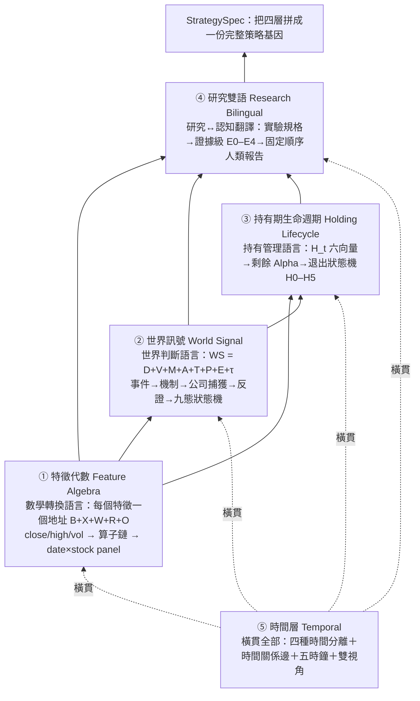

# 量化結構組成語言：五層語言，把「策略」拆成可組合的積木

這一整組頁面回答一個問題：**要讓機器自動進化出 Alpha，策略必須先能被拆解成合法的、可組合的、可驗證的語言單元**——不能是一段任人寫的 Python，也不能是一串不透明的因子字串。[總覽](overview.md)講的是「為什麼要有進化迴圈」，這裡講的是「進化迴圈拿什麼當基因」。

先給一句認知主軸：**策略不是「條件→動作」，而是「世界狀態 S → 對未來報酬的期望 E[R|S] → 排序 → 政策 → 組合」**（詳見 [策略本體論](overview.md)）。這條映射的每一段，都需要一種專門的語言來描述，否則機器只能盲目回測、無法歸因「這一代到底改了什麼、改的是哪一層」。五層語言就是為這五段各配一種文法。

## 整體架構：五層語言由下而上

這五層不是嚴格堆疊的塔（它們最終都餵進同一份 [StrategySpec 策略基因](method-strategy-spec.md)），但用「由下而上」的方式理解它們最省力——下層是上層的積木：

一句話讀懂這張圖：**特徵代數是最底層文法（一切數字都是它算出來的）；世界訊號把「世界判斷」也升級成同樣可組合可反證的語言；持有期生命週期用底下兩層的特徵去管「入選後怎麼抱」；研究雙語把上面所有實驗編譯成人能讀、能判斷的報告；時間層則橫貫這四層，確保每一個判斷都站在「當時真的能知道」的資訊上。**

## 五層各自負責什麼

| 層 | 頁面 | 回答的問題 | 核心單位 | 現況 |
|---|---|---|---|---|
| ① 數學轉換 | [特徵代數](fw-feature-algebra.md) | 這個特徵到底怎麼算出來的？ | 地址 `B+X+W+R+O` | 已上線（systemd 8983），零改動沿用＋擴造策略層 |
| ② 世界判斷 | [世界訊號](fw-world-signal.md) | 這家公司在什麼世界機制裡、市場定價到哪、什麼會證明我錯？ | 地址 `D+V+M+A+T+P+E+τ` → 九態 | 引擎已上線（systemd 8986），但世界層數值是示意佔位、未接真資料源 |
| ③ 持有管理 | [持有期生命週期](fw-holding-lifecycle.md) | 月頻選股入選後，這檔的「剩餘 Alpha」還有多少、何時該退？ | 持有狀態向量 `H_t` 六組 → `H0–H5` | 骨架上線＋研究問題一已真跑（finlab 覆核）；A/B/C/D 完整比較未做 |
| ④ 研究↔認知 | [研究雙語](fw-research-bilingual.md) | 這份實驗的證據到哪一級、語氣能不能超過證據、人該怎麼行動？ | 證據級 `E0–E4`＋行動十態 | 編譯器已上線（systemd 8987）；尚未成為所有實驗必經出口 |
| ⑤ 時間 | [時間層](fw-temporal.md) | 什麼事在什麼時候發生、傳導多久、現在走到哪個階段、當時能不能做這判斷？ | 時態邏輯節點（十塊 schema） | 大部分為設計；只有事件錨＋t+1、`qual_edge` 時效欄已落地，其餘標「待補」 |

## 為什麼是「語言」而不是「特徵集合」

這是整個專案最容易被誤解的地方。傳統量化平台把因子當成一堆字串（`"RK((PCTCHG(close,1)>0).rolling(120).mean())"`），再用 AST 白名單事後擋掉非法的。問題是：**字串的表達空間無限大，白名單只能被動防守，LLM 可以寫出任何看起來合理但機制錯亂的字串。**

五層語言反過來做——**用型別化算子建構，能表達的空間「就是」合法空間**。於是 LLM 的角色從「自由造詞」被壓縮成「在合法文法裡組合」：它只投稿結構化的 spec 片段，判決永遠是純程式碼。這條信條（[LLM 只提案、判決純碼](discipline.md)）貫穿全部五層，也是進化迴圈能自我否證、而不是自我催眠的根本原因（見 [實驗 003](exp-003-graph-evolution.md)：機器對自己生的漂亮結果判了 conflicting）。

## 這五層怎麼被進化迴圈用

五層語言是「基因的文法」；[StrategySpec](method-strategy-spec.md) 是「一條具體基因」；[進化迴圈](method-evolution-loop.md) 則是「讓基因一次改一個字母、比較父子、把成敗寫回記憶」的機制。一次進化的最小動作是：沿某一層的某一個軸做**受控變異**（一次一變因），編譯成新的 StrategySpec，過 [十道證據閘](method-gates.md)，由 [研究雙語](fw-research-bilingual.md) 編譯成報告，再寫回 [知識圖譜](graph-knowledge.md)。

已經真跑過的例子直接展示了這條鏈：[實驗 000](exp-000-engine-first-run.md) 只變異「退出時點」這一個部件（用到 [持有期](fw-holding-lifecycle.md) 的 H5）；[實驗 001](exp-001-candidate-c.md) 只變異「選股」一個部件（用到 [特徵代數](fw-feature-algebra.md) 組出 250 日價格強勢濾網）；兩者都被誠實封頂在 provisional／E2、不改真錢。

## 誠實邊界

- 這五層裡，只有 [特徵代數](fw-feature-algebra.md) 是「零改動沿用」的成熟件；[世界訊號](fw-world-signal.md) 的世界層數值是示意佔位、且缺探索通道（方向裁決點名的真缺口）；[持有期](fw-holding-lifecycle.md) 只有研究問題一真跑過；[研究雙語](fw-research-bilingual.md) 的種子實驗數字是示意；[時間層](fw-temporal.md) 幾乎整層是設計、大量欄位標「待補」。
- 這五層目前**沒有一層被證明有「增量效度」**——也就是「加了這層是否勝過只用簡單基準」尚未有 A/B 對照數據。方向裁決把這件事立為總體 kill criteria：三條真研究線、100 筆真案例後若無增量，沒有增量的層要被拆除。
- 質化側的語言（新聞→世界模型→特徵）另見 [質化結構組成語言](lang-qual.md)，不在本組五頁內。

下一步請往下走：先讀最底層的 [特徵代數](fw-feature-algebra.md)，它是理解其餘四層的前提。詞彙不熟可隨時查 [詞彙表](glossary.md)。

---

**被連結自（反向連結）：** [整體架構與資料流](architecture.md) · [框架：世界訊號](fw-world-signal.md) · [框架：持有期生命週期](fw-holding-lifecycle.md) · [框架：時間層（時態邏輯節點）](fw-temporal.md) · [框架：特徵代數](fw-feature-algebra.md) · [框架：研究雙語與認知編譯器](fw-research-bilingual.md) · [研究作業系統：11 層與「別蓋空引擎」](research-os.md) · [給 LLM 評審：請攻擊這些接縫](for-llm-review.md) · [總覽：真正該演化的不是策略，是世界模型](overview.md) · [質化結構組成語言（總覽）](lang-qual.md) · [首頁：Alpha 進化迴圈研究 Wiki](index.md)
