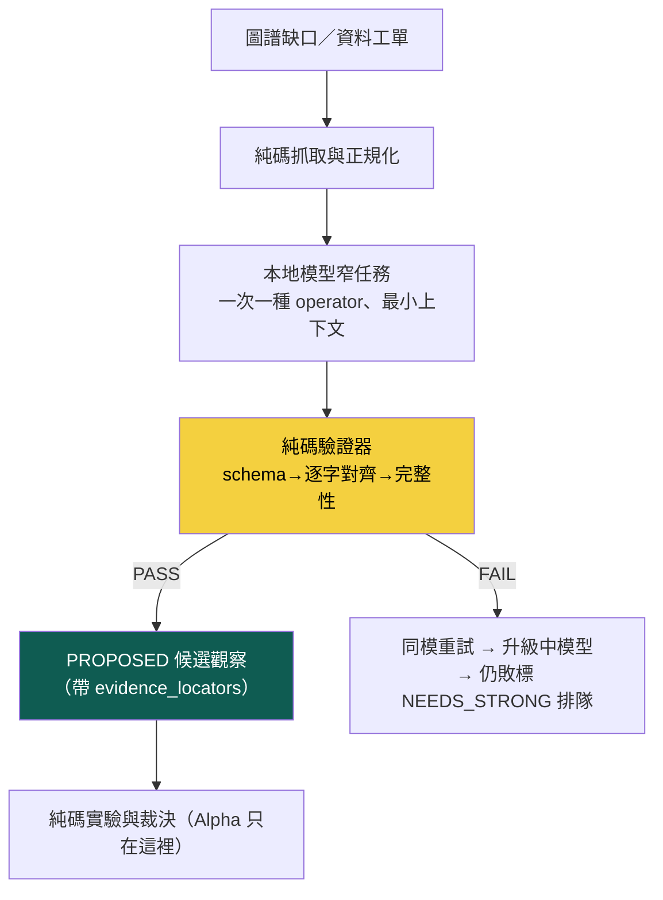

# 本地模型工人層：產候選觀察，永不產已知事實

到 EXP-009 為止，這台引擎的缺口很清楚：**系統知道有哪些資料源與工單待處理，但缺一群能持續清工單的低成本工人**。本頁記錄工人層的落地——owner 裁決的精確定位：

> 不是把「自主研究」全部交給本地模型，而是讓本地模型成為**大量、狹窄、可驗證**工作的執行層；純程式負責確定性工作，強模型只處理真正需要新理解的地方。

## 三鐵律（寫進碼、考卷驗證）

1. **本地模型產「候選觀察」，不產「已知事實」**——所有輸出落 `pm_proposed_obs`，status 永遠從 `PROPOSED` 開始，不得直接寫入世界狀態、不得產生交易訊號。
2. **沒有 evidence_locators 的輸出直接非法**——每個抽取欄位必須是**逐字原文子串**，純碼驗證器逐欄比對；捏造、改寫（連大小寫不同都算）、整段複製全部擋下。不是 confidence 寫高就能過。
3. **兩件事不交給本地模型**：短命市場的序列縫接方法（直接影響訊號，必須 prereg）；Polymarket 與台股的 Alpha／領先性／正交性判定（只由統計程式算）。

## 分流表（誰做什麼）

| 工作 | 執行者 | 原因 |
|---|---|---|
| API 抓取、時戳、去重、schema/PIT 檢查 | 純程式 | 結果確定、必須可重現 |
| 標題分類、實體抽取、裁決規則拆欄 | **ornith:9b**（小） | 重複量大、需基本語意 |
| 模糊案件二審、系列合併歧義 | **ornith:35b**（中） | 需語意但可由規則驗證 |
| 新因果機制、新超邊、否證設計、稽核 | 強模型 | 錯一次會污染研究方向 |
| prereg、統計、回測、裁決 | 純程式 | 模型不得自由改判準 |
| 部署與下單 | 硬閘＋人 | 不交給弱模型 |

## 執行帳：`local_operator_run`（append-only，11 欄照規格）

每次執行落帳：`task_id / operator_name / input_hash`（模型實際看到的輸入）`/ model_id / prompt_version / schema_version / evidence_locators / confidence`（只供路由，不當真）`/ validation_result / escalation_reason / run_hash`。驗證結果採細分類（owner 修正後）：`PASS`／`SCHEMA_ERROR`／`MISSING_FIELD`／`OVER_EXTRACTED`／`PARAPHRASED_SPAN`（改寫）／`FABRICATED_SPAN`（真捏造）；`WRONG_ROLE` 只能在 golden 考卷上量。三試皆敗標 `NEEDS_STRONG` 排隊給強模型／人工——**不自動呼叫**。

## 首批真跑：Polymarket 191 檔語料的前 60 檔 × 2 個 operator

第一批兩個窄 operator（EXP-009 第 2 步語義映射的前置）：

- `parse_market_question`：question → 事件主體／結果條件／期限（全逐字 span）
- `parse_resolution_rule`：裁決規則全文 → 裁決來源／條件／例外（全逐字 span）——**標題不夠，語義靠規則**

## ⚠ 量測語義修正（owner 揪出四個問題，全部已修）

初版的量測有四個會誤導的地方，本節記錄修正——**修正後的數字比初版難看，但它們是真的**：

1. **「103/120＝86%」不是準確率**，是 `final_task_completion_rate`（含重試與升級的管線最終完成率）。task 級真拆解：unique 120 件、**首試成功只有 50 件（42%）**、同模重試救 4、升級 35b 救 49、17 件未解。
2. **「幻覺率 86%」混合了不同錯誤**——已拆成 `FABRICATED_SPAN`（真捏造）／`PARAPHRASED_SPAN`（改寫，語意可能對）／`WRONG_ROLE`（只能在 golden 上量）／`MISSING_FIELD`／`OVER_EXTRACTED`／`SCHEMA_ERROR`。舊帳未細分的列誠實標 `not_verbatim_legacy`。
3. **golden 6/6 的 promotion 死結已修**：v2 閘改層級比較——fabricated 一票否決 → accuracy 不得降 → 平手依序比 missing／升級率／延遲（滿分平手仍可因次要指標改善而升級）。
4. **golden 考卷升級為角色級**：101 筆、8 分層（模板規則審定＋手標，標注者可回溯），每欄帶「可接受逐字 span 清單」＋normalized 值（**純碼解析**，span 與 normalized 分欄——正規化不交給模型）＋允空旗標。**角色級判卷立刻把 9b 打回原形：舊關鍵詞版 6/6 → 角色版 16/24（66.7%）、且抓到 2 筆 fabricated**——證明「關鍵詞出現在 span」確實高估了語意結構的正確性。

**定位同步降級（owner 裁決）**：本地模型是**選配的候選 span 提取器**，用途是讓強模型少看一些原文——**不是「Alpha 研究能力」**。operator 擴充暫停；輸送帶下游（Observation→圖譜）優先，見 [[exp-009-expectation-layer|EXP-009 縱切]]。上位原則：

> **Deterministic Integrity ＋ Model-Assisted Discovery**：模型負責擴張未知與提出候選；純碼負責真相、實驗、裁決與記憶。模型不可用時，可以暫停新的語意發現，但不得污染既有知識，也不得阻塞已登記實驗的執行與結算。

**首批真跑結果**（60 市場×2 operator、~273 次嘗試全落帳、15 分鐘）：`final_task_completion_rate`＝103/120（86%）、首試成功 42%、17 件 `NEEDS_STRONG`、103 筆 PROPOSED 觀察入庫（含逐字證據）。attempt 級 scorecard（全由帳重算）：

| operator | 模型 | n | attempt 通過率 | **非逐字率**（legacy 未細分\*） | 空欄敗 | 延遲 |
|---|---|---|---|---|---|---|
| 問題解析 | ornith:9b | 79 | 54% | **0%** | 46% | 2.1s |
| 問題解析 | ornith:35b（二審） | 17 | 82% | 0% | 18% | 4.3s |
| 規則解析 | ornith:9b | 111 | 10% | **86%** | 4% | 2.8s |
| 規則解析 | ornith:35b（二審） | 49 | 71% | **29%** | 0% | 5.5s |

\* 首批跑在細分類上線前，這欄是「非逐字」總率（fabricated＋paraphrased 未分），帳上誠實標 `not_verbatim_legacy`；新批次起自動細分。

這張表講了三件事，每件都是工人層存在的理由：

1. **分工是真的、可量測的**：9b 在短問題解析可用（失敗全是「漏抽欄位」、零捏造），在長規則文本上**幻覺率 86%**（改寫而非逐字複製）——超出它的能力。第一個數據驅動的路由修正因此產生：**規則解析該直接派 35b、跳過 9b**（省下必敗的首試）。
2. **證據閘在真實工作量下守住了**：9b 那 86% 的幻覺**一筆都沒有進入 PROPOSED**——全部被逐字比對擋在門外。閘的意義不是讓模型不犯錯，是讓錯誤出不了門。
3. **角色級 golden 才是真基準**：關鍵詞版曾給 9b 6/6 滿分；升級為角色級判卷（101 筆分層、可接受 span 清單、normalized、允空）後，同一個 9b 掉到 **16/24（66.7%）＋2 筆 fabricated**——這才是 promotion 閘 v2 的現任基準。

## 進化迴圈 v0：不只在工作，還要在進化

工人層帶自己的 RSI 外圈：**scorecard**（細分類錯誤率／升級率／延遲，全由帳重算）＋ **task_stats**（unique/attempt 分離、first-pass/retry/escalation、`final_task_completion_rate`）→ 失敗原因分類 → 改 prompt／模型／閾值 → **角色級 golden 回歸考卷**（101 筆 8 分層、固定 seed 抽樣可重跑）→ **promotion 閘 v2**（層級比較：fabricated 一票否決 → accuracy 不得降 → 平手比 missing／升級率／延遲——滿分平手仍可升級，無死結）。

## 誠實邊界（不得省略）

- **這是工人層 v0**：兩個 operator、單一升級鏈；owner 開的完整 operator 清單（事件族群建立、系列市場配對、實體映射、影響方向、新鮮度、衝突偵測）還沒建——它們每個都要走同樣的「逐字證據＋PROPOSED」紀律。
- **PROPOSED 觀察還沒有消費者**：候選觀察入庫了，但「觀察→圖譜（經治理）」的下一段（evidence fusion、與既有事件圖比對）未接。
- **幻覺閘只保證「來源真實」，不保證「抽取正確」**——span 是逐字原文但可能抽錯欄位（如把結果條件抽成主體）；這由 golden 考卷的關鍵詞檢查與二審把關，但覆蓋有限。
- **合規前提不變**：Polymarket 語料的取得沿 [[exp-009-expectation-layer|EXP-009]] 的合規警示，owner 未拍板前不進自動排程；本批處理的是**已入庫**的偵察語料。

延伸：資料源偵察器與九源 worklist 見 [[blockers|難點 B1]]；E_t≠W_t 與五步順序見 [[exp-009-expectation-layer|EXP-009]]；模型分級的原始紀律見 [[discipline|誠實紀律]]。
