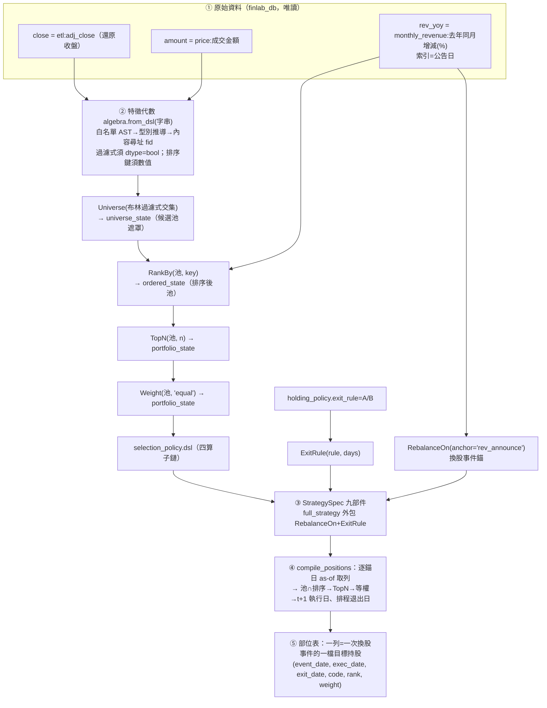

# 方法：部件從哪取用、怎麼啟用

## 這一頁要回答什麼

[上一頁](method-strategy-spec.md)說了策略基因由九部件組成、由 diff 閘守單變因。這一頁把「規格」落到「真的能算出一張持股表」——一步步走過：一條**特徵代數 DSL 字串**怎麼被驗證成合法特徵、**speclang 六算子**怎麼把這些特徵組成一條策略、**finlab_db 價量命名空間**從哪裡餵資料進來、**事件錨＋t+1** 怎麼把訊號變成無前視的部位。這是整台引擎唯一「碰真資料」的地方，別的層都是它的投影。

真相源：`engine/speclang.py`（六算子）、`engine/spec.py`（九部件組譯）、`engine/compile_positions.py`（部位編譯）、以及唯讀匯入的 [feature-algebra](fw-feature-algebra.md) `algebra.py`／`data.py`。

## 組裝流程圖：原始資料 → 特徵 → 算子 → 規格 → 部位



下面把每一步拆開講。

## ① 特徵代數 DSL：一條字串怎麼被驗證成合法特徵

`selection_policy` 裡的每一條過濾式與排序鍵都是 [特徵代數](fw-feature-algebra.md)的 DSL 原文字串。speclang **不自己解析特徵**，一律轉手 `algebra.from_dsl()`：

- **白名單 AST parser**：只准算子呼叫、常數、白名單節點，禁任意 Python。
- **型別推導**：每個特徵算出 dtype。`Universe` 的過濾式**必須 dtype=bool**（`_check_universe` 逐條檢查，非布林即拒），因為池篩選是布林事件面板的交集；`RankBy` 的排序鍵**必須數值**（布林不可排序）。
- **內容尋址 fid**：合法特徵回一個 `sha256(正規化 DSL)` 的 fid，進 spec_member 供查重。
- **PIT 靠構造**：特徵代數的算子庫沒有前視算子（例如 `RollMax(close, w=250, lag=1)` 的 lag 是刻意設計），所以「運算合法」由文法保證。

真實例子（[候選 C](exp-001-candidate-c.md) 的價格強勢濾網）：

```
GEc(RankPct(MinMaxScale(close, RollMin(close,w=250), RollMax(close,w=250))), c=0.5)
```

讀法：close 對 250 日區間做 MinMaxScale（現價在近一年高低點的相對位置）→ RankPct（橫斷面排名分位）→ GEc(c=0.5)（分位≥0.5 為真）＝「250 日區間位置排在市場前段」的布林事件面板。dtype=bool，可當 Universe 過濾式。若把 `GEc` 拿掉（輸出變數值），拿去當過濾式就會被 `_check_universe` 擋下。

## ② speclang 六算子：型別鏈怎麼組成一條策略

`speclang.py` 在特徵代數的 dtype 系統上**再擴三個策略層型別**：`universe_state`（候選池遮罩）→ `ordered_state`（排序後池）→ `portfolio_state`（帶權重持股）。六個算子是宣告式 `SOp`（宣告 accepts→returns 型別、參數種類與 `check_fn`），型別必須逐級銜接，接不上就 `StratValidationError`：

| 算子 | accepts → returns | 白話 | 詞彙約束（封閉） |
|---|---|---|---|
| Universe | (布林過濾式…) → universe_state | 池篩選：分位>0.8 ∧ 量前50% | 過濾式走特徵代數驗證、須 bool |
| RankBy | (universe_state, key) → ordered_state | 事件日按月營收 YoY 排序 | key ∈ EVENT_FIELDS 或數值特徵；order ∈ asc/desc |
| TopN | (ordered_state, n) → portfolio_state | 取前 20 | n 為 ≥1 整數 |
| Weight | (portfolio_state, scheme) → portfolio_state | 等權 | scheme 只有 `equal`（第一版） |
| RebalanceOn | (portfolio_state, anchor) → portfolio_state | 錨定月營收公布日，隔日執行 | anchor ∈ EVENT_ANCHORS |
| ExitRule | (portfolio_state, rule) → portfolio_state | 掛退出規則 | rule ∈ A／B；C/D 明確拒收 |

算子集**第一版刻意小**——夠表達現行月營收策略與 A/B 退出即可，膨脹靠之後的世代逼出來。同樣沿特徵代數紀律：AST 白名單 parser（`_ALLOWED` 節點）、`SNode.make` 把參數排序存放保證同構同序列化、`Strategy.sid = sha256(正規化 DSL)`。

**部件與算子的分工**（`spec.py` 強制）：`selection_policy.dsl` 只准含 Universe/RankBy/TopN/Weight**四**算子，**不准**含 RebalanceOn/ExitRule——後兩者分屬 `execution_policy` 與 `holding_policy` 部件。組譯時 `full_strategy()` 才把它們外包回來拼成完整六算子鏈：

```
ExitRule( RebalanceOn( <selection 四算子鏈>, anchor='rev_announce' ), rule='B', days=3 )
```

這個切分讓 [diff 閘](method-strategy-spec.md)能分辨「改選股」與「改退出」是兩個不同部件的變異。

## ③ finlab_db 價量命名空間：資料從哪裡進來

speclang 把封閉詞彙表寫死，不許自由字串亂接欄位：

- **日頻價量**走特徵代數 `data.py` 命名空間：`close = finlab_db etl:adj_close`（還原收盤）、`amount = finlab_db price:成交金額`。`compile_positions` 呼叫 `fa.namespace(bases)` 只載入該策略真正引用的 base 欄位。
- **事件錨定欄位**走 `EVENT_FIELDS`：`rev_yoy = monthly_revenue:去年同月增減(%)`——**索引是公告日**（每月 10 日順延），不是交易日，該日值當日可知。這與日頻欄位分開，因為它是事件面板。
- **換股事件錨**走 `EVENT_ANCHORS`：`rev_announce = 月營收公告日`，語意是「錨日訊號、隔一交易日執行」，內建無 lag 參數可調（`execution_policy.lag_days` 硬凍結為 1）。

## ④ 事件錨＋t+1：怎麼把訊號變成無前視的部位

`compile_positions.py` 是編譯主迴圈，逐個換股事件日產一張目標權重表。關鍵三步都是 PIT（point-in-time，只用當時可知資料）靠構造：

1. **as-of 取列**（`_asof_row`）：在事件日 d，取池遮罩與排序鍵面板中**索引 ≤ d 的最新一列**——絕不看未來。月營收公告表因此取「d 當天已公告的最新一期」。
2. **t+1 執行**（`_next_trading_day`）：訊號在錨日 d 形成，執行日是 d 之後**第一個交易日**（`searchsorted(d, side="right")`）——當天訊號不當天成交。
3. **排程退出日**（`exit_date`）：規則 A ＝下一事件的執行日；規則 B ＝下一事件執行日**往前 N 個交易日**（且不早於本次執行日）。區間內最後一個事件無下一錨時，`exit_date` 誠實留 `NaT`，不虛構。

輸出的**樣本單位紅線**（總綱鐵律 6）：一列 ＝ 一次決策事件的一檔目標持股，事件軸是公告日，不是交易日。這保證了 [部署同形閘](method-gates.md)裡「回測資料集行數 ＝ 決策事件數」的斷言（[實驗 000](exp-000-engine-first-run.md) 跑出 138 個換股事件、[事件樣本卷](method-gates.md)驗的就是它）。

## 九部件各自從哪個框架「取用、啟用」

把上面串起來，九部件在啟用時各自向哪個既有資產借力：

- **selection_policy** ← [特徵代數](fw-feature-algebra.md)（合法特徵、fid）＋ speclang 四算子鏈。
- **holding_policy** ← [持有期生命週期](fw-holding-lifecycle.md)的退出規則（A/B 已啟用、C/D 留白）＋特徵代數（未來狀態式退出的特徵）。
- **execution_policy** ← AARO evaluator 契約：錨、t+1、成本口徑（沿 AARO config 凍結值）。
- **data_contract** ← 新增資訊合法性契約：每欄 source＋pit_note（七時戳為設計，見 [時間層](fw-temporal.md)）。
- **world_hypothesis** ← [世界訊號](fw-world-signal.md)（薄縱切代多為空）。
- **research_claim／evaluation_contract** ← [strategy-dev 預註冊契約](fw-research-bilingual.md)（主張型別、基準、否證集合）。
- **validity_domain** ← AARO contract（市場、期間、宇宙）。
- **lineage** ← Ladder／LCEI／generation_log（父代、MOVE、生成器版本）。

## 誠實邊界（不得省略）

- **有些真過濾表達不了**：現行月營收策略原本還有「非 ETF／上市滿一年／非全額交割」三個過濾，這三欄不在特徵代數 FIELDS 詞彙內，本版**無法表達**——`example_spec()` 誠實記在 `data_contract.gaps`，不硬塞、不虛構。這是 [語言編譯閘](method-gates.md)的能力邊界，不是 bug。
- **pit_note 只是字串**：資料的可知時間目前靠人寫的 `pit_note` 字串宣告，機器尚未逐欄驗證七時戳（event/published/available/ingested/revised/source_version/entity_mapping_version）——這是 twdata 自建資料線的活，缺的欄由 [資訊合法性閘](method-gates.md)標 blocked。
- **成本不在編譯層**：`compile_positions` 只到部位編譯，不算績效；成本、滑價、淨值走 [部署同形閘](method-gates.md)的 NAV 引擎（`run_ab`），成本是換手比例一次性扣減的**向量化近似**，非逐筆撮合。
- **停牌以陳價出場**：[實驗 000](exp-000-engine-first-run.md) 中持有期停牌以陳價出場共 19 檔次（占比不到 0.5%，已誠實計數）。
- **Weight 只有等權**：`WEIGHT_SCHEMES = ('equal',)`，市值權重等其他配權尚未進詞彙。

下一步：組出來的部位要過哪十道關卡才准算數，見 [方法：證據閘（十道關卡）](method-gates.md)；引擎怎麼自己提案下一個 spec，見 [方法：進化迴圈（圖提案→變異→裁決→回流）](method-evolution-loop.md)。

---

**被連結自（反向連結）：** [實驗 000：引擎首輪 A/B 退出時點](exp-000-engine-first-run.md) · [實驗 001：生成候選 C（月營收 × 價格強勢）](exp-001-candidate-c.md) · [方法：策略基因（StrategySpec 九部件）](method-strategy-spec.md) · [方法：進化迴圈（圖提案→變異→裁決→回流）](method-evolution-loop.md) · [首頁：Alpha 進化迴圈研究 Wiki](index.md)
