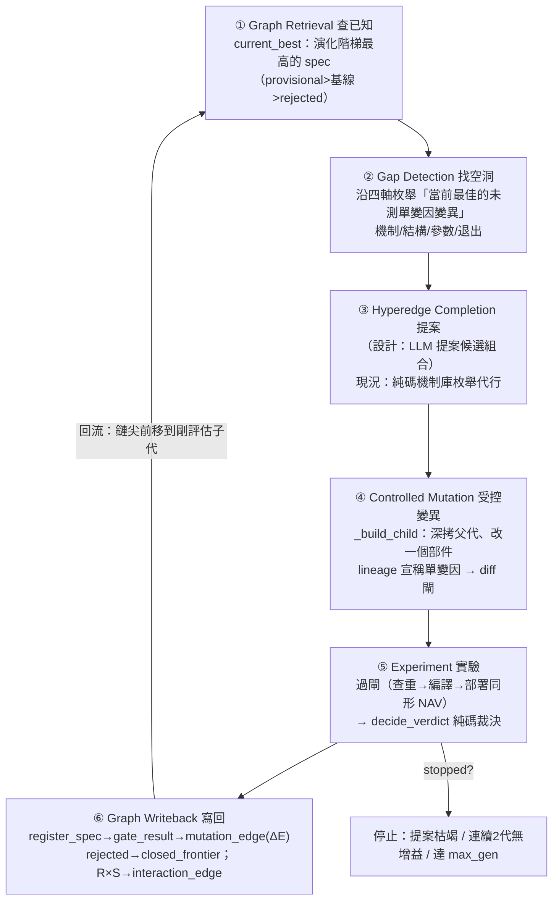

# 方法：進化迴圈（圖提案→變異→裁決→回流）

## 一句話：會自己轉、而且第一個否證的是自己

前面三頁講的是靜態零件：[策略基因](method-strategy-spec.md)、[部件組裝](method-components.md)、[十道閘](method-gates.md)。這一頁把它們接成一個**會自己轉的閉環**——引擎讀圖找出「最值得測的下一個單變因變異」，自動組成子代、過閘、用純碼裁決勝負、把結果（含負結果）寫回演化圖，再回流讓下一代看到。全程**零大模型裁決**：LLM 一個字都不寫進 verdict 欄。

它的成功標準不是「一直找到更高 Sharpe」，而是用固定研究預算**更快排除假發現**。[實驗 002](exp-002-ablation.md)／[實驗 003](exp-003-graph-evolution.md) 已真跑一輪：迴圈轉出來的第一個結論，是拆穿它自己上一輪剛生出的漂亮候選 C。

真相源：`engine/gaps.py`（提案器）、`engine/evolve_loop.py`（主閉環）、`engine/ablation.py`（交互超邊）；對映總綱 3.7「圖驅動進化：六步閉環」。

## 六步閉環：對映總綱 3.7



`gaps.py` 負責 ①②④ 的純碼骨幹；`evolve_loop.py` 負責 ⑤⑥ 與回流。裁決永遠不在提案器裡——提案器只提案，成立與否是別處的純碼對帳（總綱 3.4 反捏造紀律）。

## 步驟一：查已知（current_best，純碼定義）

`gaps.current_best()` 不靠人指定「當前最佳」，用一個純碼**演化階梯**：`provisional`（勝出）> 基線（genesis／無入邊）> `rejected` > `refuted`。同級以「入邊 ΔE（Sharpe, CAGR）」破平，再以血統鏈深度、spec_id 決定性破平。未知裁決保守落基線層（fail-closed，不擠上 provisional）。

## 步驟二＋三：找空洞、提案（四軸枚舉＋三閘 dedup）

`gaps.propose_next()` 沿四條封閉軸枚舉「當前最佳的未測單變因變異」，按**優先度階梯**排序（鐵律 9「變異＝換方向非調參」）：

```
PRIORITY_RANK = {mechanism:0, structure:1, parameter:2, exit:3}   # 機制 > 結構 > 參數 > 退出
```

- **機制軸**（最高優先）：換強勢濾網的 X 轉換——機制庫 `STRENGTH_MECHANISMS` 五筆，每筆是**不同 X 轉換＝不同機制**（區間位置／趨勢一致性／創新高／高位持續性／原始動能）。機制庫在提案器檔、**不在迴圈檔**，所以「下一代測什麼」是圖提的、不是硬編清單。
- **結構軸**：拆掉強勢濾網（filter-then-rank → 純 rank），對照濾網是否真有增量。
- **參數軸**（低優先）：同機制不同門檻 c／窗口 w／TopN n／提前賣天數。
- **退出軸**（最低優先）：A↔B 翻轉——但這方向已測。

枚舉後過**三閘 dedup**（純碼）：①**基因超邊查重**（正規化 genome 命中帳上任一 spec ＝重跑既測組合）；②**封閉前沿方向命中**（死方向不重提）；③**退出軸已測方向**（A vs B 已於演化邊比過）。任一命中即 dropped 並附白話理由——使用者在運算紙看到的是「此組合已於 EXP_xxx 測過」，不是靜默失敗。

> 序列化陷阱（實測 2026-07-22，寫進 `gaps.py` docstring）：帳上 B 的 selection DSL 以雙引號存、C 以單引號存，直接雜湊原始字串會讓語意相同的兩 spec 得到不同 genome、查重漏網。`gaps` 一律先把 DSL 走 speclang **重序列化正規化**再算 genome，才是真的基因超邊查重。

## 步驟四＋五：受控變異、過閘、純碼裁決

`_build_child` 深拷父代、只改一個部件、lineage 宣稱單變因，先過 [diff 閘](method-strategy-spec.md)（實際 diff 必為單一部件）與 [查重閘](graph-hypergraph.md)。過關才呼 `_nav_for` 跑 [部署同形](method-gates.md) NAV 引擎（真 finlab_db、同成本、同 PIT），事件數 ≠ 錨日數即 fail-loud。

裁決在 `decide_verdict()`，純碼、E2 封頂：

```
任一指標非有限（CAGR/Sharpe）      → blocked（無法裁決）
CAGR 或 Sharpe 不如父代            → rejected（負結果，如實入帳）
CAGR 與 Sharpe 皆勝父代 + 子期穩健  → provisional（方向有證據，待 walk-forward）
皆勝但鄰域不穩（單點傾向）          → provisional（弱證據，標記鄰域不穩）
```

**永不發 supported**——那需要 [walk-forward 閘](method-gates.md)，本迴圈沒有。鄰域穩健由 `_subperiod_robust` 判：重疊期間對半切，子代兩半 CAGR 皆勝父代才算穩健，任一半無法定義就保守回 not robust（避免把單點寫成最佳）。

## 步驟六：寫回演化圖（負結果也寫）

`_writeback()` 一代寫回：`register_spec`（strategy_spec＋spec_member 同交易）→ `gate_result`（compile／deploy_shape）→ `mutation_edge`（含多維 ΔE：ΔCAGR／ΔSharpe／ΔMDD／Δ年勝率＋子期佐證＋`evidence_level_cap=E2`）。`rejected` 也寫，並把死方向記進 `closed_frontier`（負結果入帳，下一代不再重試）；子代若為消融覆蓋的 R×S 組合，呼 `ablation.ledger` 寫 [交互超邊](graph-hypergraph.md)。

## 回流與停止：探索式血統鏈

這裡有一個**誠實揭露的結構限制**（寫在 `evolve_loop.py` docstring）：候選 C 的邊際巨大（相對 B 的 ΔSharpe≈0.44），`current_best` 的演化階梯同級以入邊 ΔE 破平 → current_best **永遠釘在 C**，任何真實子代都擠不過。若每代都問 current_best，鏈永遠 parent=C、不是真血統鏈。

所以迴圈改採**探索式血統鏈**：鏈尖每代前移到剛評估的子代（無論裁決），下一代對鏈尖提案（第二代起走 `_proposals_for` 同一提案引擎、只把鏈尖顯式當親代參數化，提案仍由圖枚舉）。爬山式「只保留真實增益」由 `best_so_far` **另行追蹤、不污染鏈**。停止條件三個：提案枯竭／連續 2 代無增益（`NO_GAIN_STOP`）／達 `max_gen`。

## 迴圈真跑一輪：三代發生了什麼（實驗 003）

```
種子 C（62a1ab99, Sharpe 1.52）
  ↓ gen1：換「250日高位持續性」機制 → CAGR −7.95pp 輸父代
     → REJECTED，寫 closed_frontier=strength_high_position_persistence_250d
  ↓ gen2：換「120日動能」→ provisional（CAGR 34.0%/Sharpe 1.50）
  ↓ gen3：換「250日創新高」→ provisional（Sharpe 2.06，標「幾乎肯定過度擬合」）
```

三代 genome 互異＝真變異，連跑兩次血統逐字一致＝決定性。但這條「越換越高」的軌跡，配上 [消融](exp-002-ablation.md)結論說的是同一件事：**放手讓迴圈追報酬，它就一路走進更純的動能暴露**——因為在這段多頭樣本裡動能就是會付錢。機器對每一代都如實封頂 provisional、標過擬合，沒有一代被誤判為可部署。

## 誠實邊界（不得省略）

- **③ Hyperedge Completion 的 LLM 未接入**：引擎冊設計「LLM 提案候選超邊」，但 `evolve_loop` 全純碼、零 LLM。目前用純碼機制庫枚舉代行「提案」，這是刻意的保守選擇，不是完整實作。引擎冊設計的**歸因路由表**（Dev 強 OOS 崩→過擬合類 等七列）也只以四軸優先度階梯近似，未全代碼化。
- **迴圈世代已回滾**：[實驗 003](exp-003-graph-evolution.md) 的三代對真帳跑通、驗證後**外科回滾**，正典帳只留乾淨的 A/B/C＋兩個消融臂。回滾原因：完整三代會把 current_best 前移到疑過擬合的 gen3。
- **回滾與「負結果入帳」的張力**：gen1 是負結果，理想上該永久留；本輪它隨整批回滾了（有暫存證據副本）——這是一個**誠實的張力，不是乾淨的執行**。修法（真發現與追動能世代分軌落帳）是明列的下一步。
- **適應度未加動能懲罰**：迴圈目前優化 CAGR，不扣動能 beta，所以「放手優化只會一再重新發現 beta」。加動能懲罰是三份報告共同的 P0 行動。
- **E2 封頂**：全迴圈無 walk-forward／樣本外，裁決上限 provisional；迴圈追出的高報酬**沒有任何樣本外意義**，很可能只是動能 beta 在多頭樣本的重複發現。

延伸：三個實驗的逐環透明拆解見 [實驗索引](exp-index.md)，方法論紀律見 [誠實紀律](discipline.md)，接縫清單見 [給 LLM 評審](for-llm-review.md)。

---

**被連結自（反向連結）：** [實驗 000：引擎首輪 A/B 退出時點](exp-000-engine-first-run.md) · [實驗 003：圖驅動自主進化三代](exp-003-graph-evolution.md) · [實驗索引：每一輪真跑，逐環節攤開](exp-index.md) · [整體架構與資料流](architecture.md) · [方法：證據閘（十道關卡）](method-gates.md) · [方法：部件從哪取用、怎麼啟用](method-components.md) · [框架：時間層（時態邏輯節點）](fw-temporal.md) · [框架：特徵代數](fw-feature-algebra.md) · [知識圖譜：四張圖](graph-knowledge.md) · [給 LLM 評審：請攻擊這些接縫](for-llm-review.md) · [總覽：從一個念頭到一台會拒絕相信自己的引擎](overview.md) · [詞彙表](glossary.md) · [量化結構組成語言（總覽）](lang-quant.md) · [首頁：Alpha 進化迴圈研究 Wiki](index.md)
