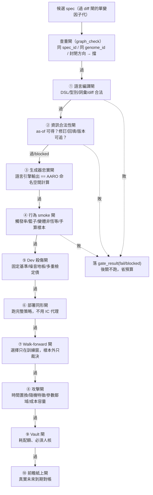

# 方法：證據閘（十道關卡）

## 一句話：先確定沒作弊，再問有沒有用

一個候選 [StrategySpec](method-strategy-spec.md) 組出來之後，不是直接看它賺多少，而是**依成本由低到高**串過一排證據閘。設計紀律只有一句：**前一關失敗，不花後一關的預算**——DSL 都編譯不過就別浪費一次完整回測。每道閘輸出一筆機器結果 `GateResult{verdict, metrics_json, evidence_refs}` 落 `gate_result` 表，報告層只引用結果 id 與判決理由，**永不由報告層重算**。

真相源：引擎冊「證據閘：先確定沒作弊，再問有沒有用」十條表＋框架書 2.2 的實作歸戶；實作在 `engine/run_ab.py`／`run_c.py`／`ablation.py`（寫 gate_result）與 `engine/graph_views.py`（查重閘）。

## 十道閘：擋什麼、成本序、現況

| # | 閘 | 擋什麼（fail 的長相） | 現況（來自三份實驗報告） |
|---|---|---|---|
| 0 | 查重閘（G0） | 同 spec_id／同 genome_id／封閉前沿方向重投 | ✅ 已實作 `graph_check`；見 [超邊](graph-hypergraph.md) |
| 1 | 語言編譯閘 | DSL 語法、型別鏈、封閉詞彙、本體版本、策略 diff 不合法 | ✅ 已實作（gate_name=`compile`；= [validate_spec](method-strategy-spec.md)＋speclang.parse＋diff_gate） |
| 2 | 資訊合法性閘 | 觀測在 as-of 時點不可得；修訂值、回填、實體映射版本無法追 | ◐ 部分：pit_note 字串已在，**七時戳機器檢查器未建**；缺欄標 blocked，不硬過（twdata 線的活） |
| 3 | 生成器忠實閘 | 語言引擎輸出 ≠ AARO 命名空間實際計算 | ◐ 示範級：H-DEV2 已示範 corr=1.000000 的做法；三份報告的**獨立純 pandas 逐位重算**代行此職，常駐 gate 函式未寫 |
| 4 | 行為 smoke 閘 | 觸發率、覆蓋、持股數、成本、變體恆等（子代其實等同父代）、手算樣本錯 | ✅ 已實作（gate_name=`smoke`） |
| 5 | Dev 殺傷閘 | 輸給固定基準、掉進噪音地板、未做多重檢定調整 | ◐ 設計：沿用 AARO `harness.judge`＋噪音地板＋`debt_ledger`；本輪 E2 未跑 Dev/OOS 切分 |
| 6 | 部署同形閘 | 用全橫斷面 IC 冒充可交易；改集中策略卻沒跑集中策略 | ✅ 已實作（gate_name=`deploy_shape`；NAV 引擎跑完整月頻選股＋日頻持有＋t+1） |
| 7 | Walk-forward／Validation 閘 | 選擇偷看樣本外；訓練窗外做了調參 | ❌ **未跑**（E2 封頂，裁決上限 provisional）；三份報告的 P0 行動一 |
| 8 | 攻擊閘 | 時間置換、隨機特徵、參數鄰域、子期、成本容量敏感度扛不住 | ◐ 雛形：`evolve_loop._subperiod_robust`（時間子期鄰域穩健）是其中一項；全套武器未建（AARO 自列 L-08） |
| 9 | Vault 閘 | 反覆偷看最終保留集 | 設計：沿用 AARO `vault_usage` 消耗帳，須人核 |
| 10 | 前瞻紙上閘 | 真實未來資料到期對帳未過（研究畢業的最後證據） | 設計：沿 MIEE `ignition_snapshot` 前瞻帳前例；依權力表永不自動 |

**額外一道：消融閘**（gate_name=`ablation`）。它是部署同形閘的延伸，專證「交互超邊是真綜效還是相加」——[實驗 002](exp-002-ablation.md) 對候選 C 跑四臂 2×2 消融，純碼算 synergy＝[R×S−R]−[S−neither]，判 relation。四臂齊備、證據非空才准寫 [交互超邊](graph-hypergraph.md)（`ablation_ok=1` 才可 active），這是反捏造紀律的硬鎖。

## 三道 P0 真的在寫 gate_result 的閘

現況要說清楚：十道閘裡，**目前真正執行並落 gate_result 的只有三道**——`compile`（①語言編譯）、`smoke`（④行為）、`deploy_shape`（⑥部署同形），加上消融的 `ablation`。這三道就是 [實驗 000](exp-000-engine-first-run.md) 帳上「gate_result 6 列（compile/smoke/deploy_shape × A,B）」的來源。其餘七道要嘛是設計（Dev/攻擊/Vault/前瞻），要嘛降級代行（資訊合法性用 pit_note 字串、生成器忠實用獨立重算），要嘛明確未跑（walk-forward）。

這也是為什麼所有實驗的證據級都**封頂 E2**（全樣本部署同形描述性對照、無 IS/OOS、無 walk-forward），裁決上限只能到 `provisional`，[進化迴圈](method-evolution-loop.md)永不自己發 `supported`——那需要第 7 道閘。

## gate verdict=pass 的準確含義（容易誤讀）

`gate_result` 的 verdict 欄寫 `pass`，**不代表策略優劣**。程式碼在 `metrics_json.note` 裡明說：「pass 僅代表閘已執行且指標完整，不代表策略優劣裁決」。策略的優劣裁決（supported／provisional／rejected／blocked）不進 gate_result，進 [演化邊 mutation_edge](graph-hypergraph.md) 的 verdict 欄。兩者分開，是為了不讓「閘跑完了」被誤讀成「策略是好的」。

## 硬閘之後才做 Pareto

引擎的裁決不是單一分數：先做 claim-level verdict，只有通過硬閘的候選才進父子比較；倖存者之間看 Pareto 關係（報酬／風險／回撤／換手／容量／複雜度／證據級／穩定性）。**若新策略只多 0.1% 報酬卻增加一倍換手與三個資料源，預設不升級——複雜度必須由明確增量支付。** 這道原則在 [實驗 003](exp-003-graph-evolution.md) 裡尤其關鍵：迴圈被放手追 CAGR 時一路走進更深動能，每一代都被如實封頂 provisional、標過度擬合，沒有一代被單一高 Sharpe 誤判為可部署。

## 誠實邊界（不得省略）

- **十道閘只三道真跑**：如上，其餘為設計／降級代行／未跑，不得宣稱「十閘全建」。框架書七誠實邊界原文：「未落地＝gates 十閘全建（僅三閘）」。
- **E2 是天花板不是及格線**：E2 只是「重複支持、尚無樣本外」；它擋不住過擬合，[C 的 33%](exp-001-candidate-c.md) 過了三道閘照樣被 [消融](exp-002-ablation.md)拆穿是動能 beta。閘通過 ≠ 事實確認。
- **資訊合法性的真缺口**：ingested_at／revised_at／source_version／entity_mapping_version 全機零實作；能過的只是「運算合法」（無前視算子），不是「資訊合法」（該筆觀測在 as-of 時點真的以當時形態可得）。回填洩漏目前防不住。
- **攻擊閘只有一項**：`_subperiod_robust` 只做時間子期對半切的鄰域穩健，時間置換／隨機特徵／參數鄰域全掃描等武器未建。
- **忠實閘靠人力代行**：目前每輪靠一名獨立重算員寫純 pandas 腳本逐位對帳，不是常駐 gate；一旦不跑獨立重算，忠實性就沒有自動保證。

下一步：這排閘怎麼被裝進「提案→變異→過閘→裁決→寫回→回流」的自動迴圈，見 [方法：進化迴圈（圖提案→變異→裁決→回流）](method-evolution-loop.md)。

---

**被連結自（反向連結）：** [三個迴圈：認知、決策、元研究，各有各的裁判](three-loops.md) · [世界信念契約：被更新的是信念，不是世界](world-belief-contract.md) · [假說引擎：今天最值得消除、又辨識得出的決策相關未知是什麼](hypothesis-engine.md) · [實驗 000：引擎首輪 A/B 退出時點](exp-000-engine-first-run.md) · [實驗 001：生成候選 C（月營收 × 價格強勢）](exp-001-candidate-c.md) · [實驗 002：交互超邊消融](exp-002-ablation.md) · [實驗索引：每一輪真跑，逐環節攤開](exp-index.md) · [整體架構與資料流](architecture.md) · [方法：策略基因（StrategySpec 九部件）](method-strategy-spec.md) · [方法：進化迴圈（圖提案→變異→裁決→回流）](method-evolution-loop.md) · [方法：部件從哪取用、怎麼啟用](method-components.md) · [框架：特徵代數](fw-feature-algebra.md) · [框架：研究雙語與認知編譯器](fw-research-bilingual.md) · [研究作業系統：11 層與「別蓋空引擎」](research-os.md) · [研究迴圈：世界不被更新，被更新的是信念](research-loop.md) · [給 LLM 評審：請攻擊這些接縫](for-llm-review.md) · [詞彙表](glossary.md) · [質化結構組成語言（總覽）](lang-qual.md) · [量化結構組成語言（總覽）](lang-quant.md) · [首頁：Alpha 進化迴圈研究 Wiki](index.md)
