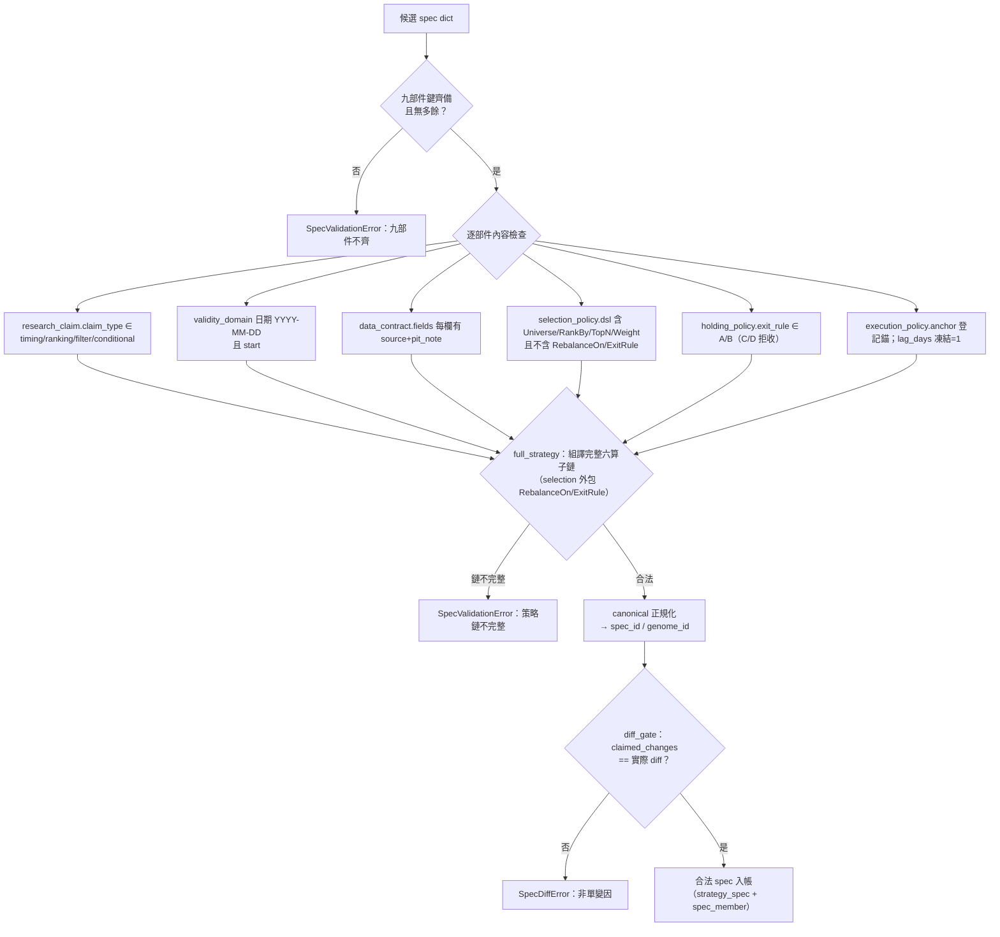

# 方法：策略基因（StrategySpec 九部件）

## 一句話：進化的最小單位不是一條公式，是一份完整規格

這台引擎不把「一段回測腳本」或「一個因子字串」當策略。每個父代與子代都必須先成為一份不可變的 **StrategySpec**（策略規格）——把整份策略拆成**九個部件**的結構化文件，經驗證後以內容雜湊入只增不改的帳。這麼做換來一個關鍵能力：系統能**先做結構差異、再做績效比較**——若一個子代宣稱「只改了退出規則」，但規格 diff 顯示資料或股票池也一起變了，編譯階段就拒絕，不讓多個變因包成一個漂亮結果。這就是 [部件從哪取用](method-components.md) 的上層契約，也是 [策略基因超邊](graph-hypergraph.md) 的物理載體：一份 spec ＝一條超邊，它的雜湊同時是查重鍵。

真相源：引擎冊《設計書_語言原生自動進化量化策略引擎》的「進化的最小單位是一份完整策略規格」表，實作在 `engine/spec.py`。

## 九部件：每個回答一個問題、各有語言來源

`spec.py` 的 `COMPONENTS` 常數把九部件寫死，`validate_spec()` 逐部件檢查、缺一或多一即 `SpecValidationError`（fail-closed）：

| 部件 | 回答什麼 | 語言／來源 | 進 [超邊成員](graph-hypergraph.md)？ |
|---|---|---|---|
| research_claim | 想證明什麼；屬 timing／ranking／filter／conditional 哪型主張 | [strategy-dev 預註冊契約](fw-research-bilingual.md) | 否（只進雜湊） |
| validity_domain | 哪個市場、期間、可交易時點與不適用範圍 | AARO contract | 否 |
| world_hypothesis | 外部衝擊、機制、公司捕獲與反證（**可為空 dict**） | [世界訊號](fw-world-signal.md) | 是→regime 成員 |
| data_contract | 每欄來源、PIT 可知時間與版本 | 新增資訊合法性契約 | 否 |
| selection_policy | 這一期哪些股票有持有資格 | [特徵代數](fw-feature-algebra.md)＋[speclang](method-components.md) | 是→universe/feature/operator/param |
| holding_policy | 入選後 HOLD／EXIT／INVALIDATE 的規則 | [持有期生命週期](fw-holding-lifecycle.md)＋特徵代數 | 是→holding/exit |
| execution_policy | t 何時形成訊號、t+1 如何成交、成本、容量 | AARO evaluator 契約 | 否 |
| evaluation_contract | 基準、主指標、walk-forward、否證集合 | strategy-dev＋AARO | 否 |
| lineage | 父代、變異 MOVE、唯一改動、生成器版本 | Ladder／LCEI／generation_log | 否 |

**四個部件不進成員索引**（research_claim／data_contract／execution_policy／evaluation_contract／lineage），只進 `spec_json` 全文與 spec_id 雜湊——這是為了讓「只差評估口徑」的兩份 spec 不被誤判成同一策略。對映規則見 [超邊](graph-hypergraph.md) 與框架書 2.4。

## 兩個雜湊：spec_id 認「整份規格」、genome_id 認「基因型」

內容尋址沿 [特徵代數](fw-feature-algebra.md) 的 fid 慣例：

- `spec_id = sha256(canonical(九部件))[:16]`——整份規格的指紋，也是查重鍵與超邊 id。
- `genome_id = sha256(canonical(八部件，去掉 lineage))[:16]`——**去掉血統後**的基因指紋。八部件全同、只有 lineage（換個 MOVE 名字）不同 ＝ **同一基因**，[查重閘](method-gates.md) 據此擋掉「換個名字重投既測組合」。

`canonical()` 用 `sort_keys=True`、無多餘空白、UTF-8 原文序列化，保證同規格必出同字串。

## diff 閘：一次一變因的代碼化

這是九部件設計最硬的一道護欄，實作在 `spec.diff()` 與 `spec.diff_gate()`：

```
diff(parent, child):  逐部件比對（lineage 除外，因親代與 MOVE 必然不同）
                      → 回「實際變更部件」集合
diff_gate(parent, child):
    claimed = child.lineage.claimed_changes   # 子代宣稱改了哪些部件
    actual  = diff(parent, child)             # 實際 diff 出來的部件
    if claimed != actual:  raise SpecDiffError  # 宣稱≠實際即拒
```

它的白話意義：**你說你只動了選股，帳就必須驗證你真的只動了選股**。[實驗 001](exp-001-candidate-c.md) 生成候選 C 時，diff 閘證明 C 對父代 B 只有 `selection_policy` 一個部件變更，差異因此可乾淨歸因到「加了價格強勢濾網」——這是後續 [消融](exp-002-ablation.md) 能拆穿它的前提。

## 驗證流程圖



`full_strategy()` 是驗證的收尾：它把 `selection_policy.dsl`（四算子鏈）外包上 `RebalanceOn`（execution 部件的錨）與 `ExitRule`（holding 部件的規則），組成完整六算子鏈丟給 [speclang](method-components.md) 再驗一次——確保九部件不只各自合法，還能**組譯成一條可執行策略**。

## 誠實邊界（不得省略）

- **world_hypothesis 可為空**：多數薄縱切代不押世界假設，空 dict 是合法值。四層語言不是每次都要全塞進策略，[世界訊號](fw-world-signal.md)只在研究問題需要 regime 時才進場。
- **單變因 vs 語意描述的已知張力**：[候選 C](exp-001-candidate-c.md) 為了守 diff 閘，`research_claim` 欄逐字沿用了父代 B 的文字（仍在談退出時點），C 的真實主題只記在 `lineage.move`——只讀 claim 欄的人會誤判主題。這是框架承認的一個接縫，列給 [LLM 評審](for-llm-review.md)。
- **ExitRule C/D 留白**：`holding_policy.exit_rule` 只收 A（固定換股日）／B（提前 N 日），狀態式 C/D 明確拒收——持有狀態分類器依 [持有期設計書](fw-holding-lifecycle.md)尚未研究得出，不虛構。
- **時間層擴欄未實作**：總綱第五部設計的 data_contract 對齊契約六欄、execution_policy 五時鐘欄（T-P1）皆為設計，`spec.py` 尚未加。目前 `lag_days` 硬凍結為 1（錨日訊號、隔一交易日執行），見 [時間層](fw-temporal.md)。
- **資訊合法性只到字串**：`data_contract.fields` 目前只強制 `source` 與 `pit_note` 兩個字串欄，七時戳的機器檢查器未建，缺欄的 spec 由 [資訊合法性閘](method-gates.md)標 blocked，不准用現值近似歷史可知值。

下一步：這九個部件**具體從哪個檔案、哪個命名空間取用、怎麼一步步組裝成部位**，見 [方法：部件從哪取用、怎麼啟用](method-components.md)。

---

**被連結自（反向連結）：** [三個迴圈：認知、決策、元研究，各有各的裁判](three-loops.md) · [世界信念契約：被更新的是信念，不是世界](world-belief-contract.md) · [實驗 000：引擎首輪 A/B 退出時點](exp-000-engine-first-run.md) · [實驗 001：生成候選 C（月營收 × 價格強勢）](exp-001-candidate-c.md) · [實驗索引：每一輪真跑，逐環節攤開](exp-index.md) · [整體架構與資料流](architecture.md) · [方法論：誠實紀律（拒絕相信自己）](discipline.md) · [方法：證據閘（十道關卡）](method-gates.md) · [方法：進化迴圈（圖提案→變異→裁決→回流）](method-evolution-loop.md) · [方法：部件從哪取用、怎麼啟用](method-components.md) · [框架：時間層（時態邏輯節點）](fw-temporal.md) · [框架：特徵代數](fw-feature-algebra.md) · [框架：研究雙語與認知編譯器](fw-research-bilingual.md) · [知識圖譜：四張圖](graph-knowledge.md) · [研究作業系統：11 層與「別蓋空引擎」](research-os.md) · [研究迴圈：世界不被更新，被更新的是信念](research-loop.md) · [詞彙表](glossary.md) · [超圖：策略基因超邊與交互超邊](graph-hypergraph.md) · [量化結構組成語言（總覽）](lang-quant.md) · [首頁：Alpha 進化迴圈研究 Wiki](index.md)
