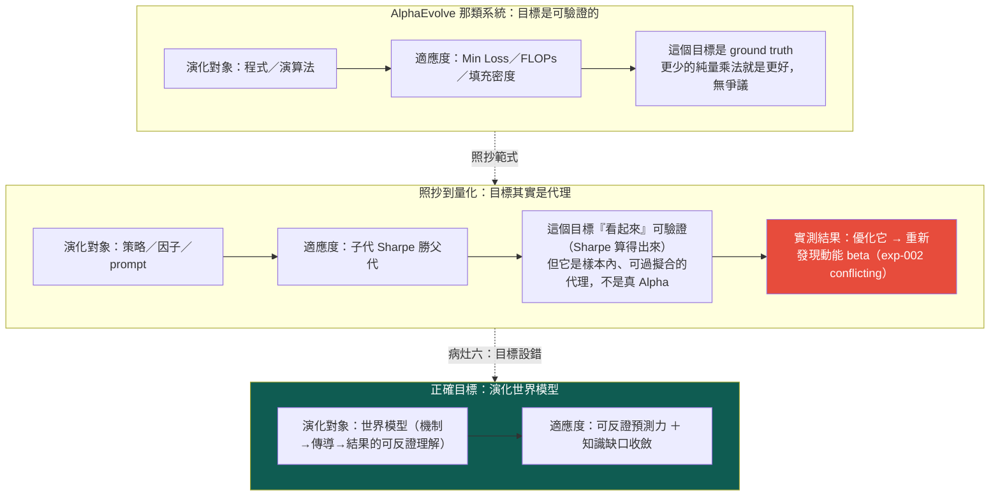

# 進化的目標設錯了：要演化的是世界模型，不是策略

這一頁講整套系統**最深的一個 bug**。前面的頁都在談「進化（Evolution）」怎麼跑得更好——圖怎麼提案、消融怎麼判、迴圈怎麼回流。但 owner 的批評指到更下面一層：問題不在**演化的機制**，在**演化的目標（Objective）設錯了**。

先給認知答案與行動答案，其餘證據都服務這條主軸。

> **認知答案**：目前這台引擎（以及大多數「自動找 Alpha」的系統）把**策略／程式／prompt** 當成演化對象，去優化一個策略級指標（子代 Sharpe 勝過父代）。這是照抄 AlphaEvolve 那類「優化一個可機械驗證的目標」的範式——但在量化投資裡，那個目標是**過擬合代理**，不是你真正要的東西。真正該被演化、該當這條研究迴圈之根的，是**世界模型（World Model）**：對「什麼機制驅動什麼結果」的可反證理解。
>
> **行動答案**：不要再把適應度設成「策略績效贏過父代」。那個目標我們**已經實測過會壞**——見下面 [實驗 002](exp-002-ablation.md)。新目標要換成**世界模型的可反證預測力**與**知識缺口的收斂**；而第一步不是重寫評分器，是先給現行迴圈的適應度加一道「動能 beta 懲罰」（[實驗 003](exp-003-graph-evolution.md) 的 P0 行動），擋住「放手優化 CAGR 只會一再重新發現 beta」這個已被證實的陷阱。

## 一、AlphaEvolve 為什麼能用：因為它的目標無可爭議

先講清楚被照抄的範式為什麼在它自己的場域裡有效。AlphaEvolve 這類演化式程式合成系統的核心前提是：**適應度函數是一個可機械驗證的 ground-truth 指標**——一個矩陣乘法演算法用了幾次純量乘法、一個模型的 loss 是多少、一種裝箱方式的填充密度多高。這些數字**就是你要的東西本身**，不是它的代理：更少的乘法次數，客觀上就是更好的演算法，沒有「它看起來好但其實沒用」的空間。

有了這種目標，演化就有一個**不會騙自己的裁判**。你可以放手讓它變異幾百萬代，因為每一代的分數都直接對應真實價值。這是 AlphaEvolve 範式成立的全部基礎。

## 二、照抄到量化，目標就從「真值」退化成「代理」

問題出在把這個範式搬到量化投資時，**目標的性質變了，但抄的人沒注意到**。

「子代策略的 Sharpe 勝過父代」看起來也像個可驗證的目標——Sharpe 確實算得出來、確實決定性可重現、確實能寫進純碼裁決。整套 [進化迴圈](method-evolution-loop.md) 的 `decide_verdict()` 現在就是這樣判的：`CAGR 與 Sharpe 皆勝父代 → provisional`。表面上跟 AlphaEvolve 一樣嚴謹。

但它跟 FLOPs 有一個致命差別：**樣本內的策略績效不是 ground truth，是一個高度可過擬合的代理**。你真正要的是「這條策略在未來、在你沒看過的市場狀態下還會賺錢」，而樣本內 Sharpe 對這件事只是一個**有偏、可被搜尋策略反向利用**的估計。當你把它當適應度去大量優化，演化不會去找「真正理解市場」的策略，它會去找「在這段歷史上剛好 Sharpe 高」的策略——而在一段多頭偏樣本裡，那幾乎必然是**動能 beta**。

這不是理論擔憂。這台引擎自己撞上了。

## 三、鐵證：優化策略級指標，就只會重新發現動能 beta

這是本頁最硬的一塊，也是為什麼「目標設錯」不是抽象批評、而是已被實驗證實的病灶。

[實驗 002](exp-002-ablation.md) 對這台引擎自己剛生出的漂亮候選 C（月營收 × 250 日價格強勢，CAGR 33%、Sharpe 1.52）跑了一個乾淨的四臂消融，問：C 的優勢是「月營收 × 價格強勢」的**真綜效**，還是兩個因子各自貢獻的**相加**？純碼判定的答案是 `conflicting`——**幾乎全是動能 beta 相加**：

| 組合 | Sharpe | 對基準超額(CAGR) |
|---|---|---|
| 都沒有（基準，等權流動性全池） | 0.96 | — |
| 只有營收選股（＝父代 B） | 1.08 | +5.60pp |
| 只有價格強勢（純動能） | **1.52** | +12.26pp |
| 營收＋強勢（＝候選 C） | **1.52** | +18.60pp |

三個讀數把「策略級目標會壞」講死了：

- **加強勢給營收股（+13.0pp）≈ 加給基準（+12.3pp）**——價格強勢的貢獻與有沒有做營收選股**無關**，是相加不是綜效。
- **純動能 Sharpe 1.52 ＝ 營收＋強勢 Sharpe 1.52**——有了動能之後，再加營收選股，對風險調整報酬的邊際貢獻是**零**。
- synergy CAGR 只 +0.74pp（勉強過噪音門檻）、synergy Sharpe −0.12（負），兩指標方向相反 → `conflicting`。

然後 [實驗 003](exp-003-graph-evolution.md) 把這件事演成完整的悲劇：讓圖自己提案、自主連跑三代，**放手讓迴圈去追報酬**，它就一路走進更純的動能暴露——gen2 換 120 日動能（Sharpe 1.50）、gen3 換 250 日創新高（Sharpe **2.06**，標「幾乎肯定過度擬合」）。迴圈的機件全部正確運作、決定性可重現、負結果如實入帳——**但它找到的每一樣東西都是動能 beta 在多頭樣本重複付錢**。

把這兩個實驗合起來看，結論很尖銳：**當適應度＝策略級績效勝過父代，一台機件完全正確的進化迴圈，會可靠地、決定性地收斂到動能 beta。** 不是因為它壞了，是因為你叫它優化的那個目標，本來就是動能 beta 分數最高。這就是病灶六——**Evolution 沒問題，Objective 設錯了**。

## 四、正確的目標：世界模型的可反證預測力與知識缺口收斂

如果策略級績效是錯的目標，什麼是對的？owner 的重構把根從「策略」搬到「世界模型」：這條研究迴圈真正該演化的，是系統對「**什麼機制、在什麼條件下、經過多久、驅動什麼結果**」的可反證理解（見 [研究迴圈](research-loop.md) 的主軸與 [世界模型層](world-model.md)）。對應地，適應度也要換成兩個服務世界模型的量：

- **可反證預測力**：一條知識不是用「它讓某策略 Sharpe 變高」來評分，而是用「它事前下了一個**會被證偽**的預測、後來對帳成立」來評分。這正是 [MIEE](fw-qual-engine.md) 預測帳（預註冊 → 到期 settle 對帳）與 [假說引擎](hypothesis-engine.md) 在做的事——目標從「績效」換成「**這個世界模型能不能在事前、對未見過的事件、做出對的可反證預測**」。系統要找的 Alpha 的最終形態，不是「營收加速有效」，而是一條**帶完整時間約束、附預註冊未來驗證窗的時態因果模式**（見 [時間層](fw-temporal.md) 5.12）——那才是可被理解、被監控、能隨時間演化的完整投資邏輯。
- **知識缺口收斂**：進化的每一步該問「這一代**消除了世界模型的哪一個未知**」，而不是「這一代 Sharpe 高了多少」。[知識圖](graph-knowledge.md) 的 gap detection（已知「創新高在低波動有效」、未知「＋營收加速在高波動是否仍有效」）就是缺口的來源——好的變異是去**測那個未知**，不是去多頭樣本裡多刷一次動能。這也是為什麼下一代研究問題該**從圖的空洞裡長出來，不從 LLM 的靈感裡長出來**。

換句話說：AlphaEvolve 的裁判是「更少的 FLOPs」，這套系統對的裁判該是「**世界模型更能事前反證地預測市場，且更少未測的知識缺口**」——而不是「這條策略在看過的歷史上分數更高」。

## 五、誠實邊界（不得省略）

這一頁講的是**目標的重構**，屬於敘事與設計層，必須誠實標明哪些還沒兌現：

- **新目標尚未成為可計算的適應度函數**。「可反證預測力」與「知識缺口收斂」目前是**方向**，不是 `evolutor` 裡跑著的評分器。現行迴圈的 `decide_verdict()` 仍在比子代對父代的 CAGR/Sharpe——也就是**錯的目標仍在線上**。把它換成世界模型目標是設計，未實作。
- **第一步是打補丁，不是換引擎**。三份報告共同的 P0 行動是給現行適應度加「動能 beta 懲罰」（對純動能因子中性化後才計分），這只是**擋住已知的最大過擬合來源**，讓迴圈至少不再是純動能 beta 發現器；它本身**不等於**演化世界模型。真正的目標轉向要靠 [假說引擎](hypothesis-engine.md) 與預測帳把「可反證預測」變成一等公民。
- **這是重構，不是推翻已跑的實驗**。exp-000～003 的機件、消融、帳務全部有效且經獨立重算；本頁不改它們的數字，只是指出它們**優化的目標**是錯的——這恰恰是那些實驗**自己證明出來的**。
- **別把目標重構升級成「蓋 11 個引擎」**。把根搬到世界模型是對的敘事，但「真的把世界模型層、知識層、因果層都蓋出來」正是 owner 在 [誠實紀律](discipline.md) 裡點名的 architecture-first 陷阱——修法走薄縱切，先填一條真的世界→知識→假說→驗證鏈，細節見 [研究作業系統](research-os.md)。

一句話收束：**這台引擎最有價值的一次自我否證（exp-002），同時也是對它自己目標函數的起訴書。** 機件會轉、帳務可信、能拒絕相信自己——但只要目標還是「策略級績效勝父代」，它會非常誠實地、非常可重現地，把力氣全花在重新發現動能 beta 上。

延伸：這條迴圈真正的主軸見 [研究迴圈](research-loop.md)；11 層架構與「別蓋空引擎」的紀律見 [研究作業系統](research-os.md)；把「可反證預測」變成一等公民的機制見 [假說引擎](hypothesis-engine.md)；紀律總條文見 [誠實紀律](discipline.md)；不認得的詞查 [詞彙表](glossary.md)。

---

**被連結自（反向連結）：** [世界模型：世界不是新聞，新聞是世界狀態的 delta](world-model.md) · [假說引擎：從「今天有哪些新聞」到「今天最大的未知是什麼」](hypothesis-engine.md) · [因果層：新聞→事件→供需→公司→財報→預期→價格](causal-layer.md) · [實驗 002：交互超邊消融](exp-002-ablation.md) · [整體架構與資料流](architecture.md) · [方法論：誠實紀律（拒絕相信自己）](discipline.md) · [研究作業系統：11 層與「別蓋空引擎」](research-os.md) · [研究迴圈：世界→知識→假說→驗證→更新世界模型](research-loop.md) · [給 LLM 評審：請攻擊這些接縫](for-llm-review.md) · [總覽：真正該演化的不是策略，是世界模型](overview.md) · [首頁：Alpha 進化迴圈研究 Wiki](index.md)
