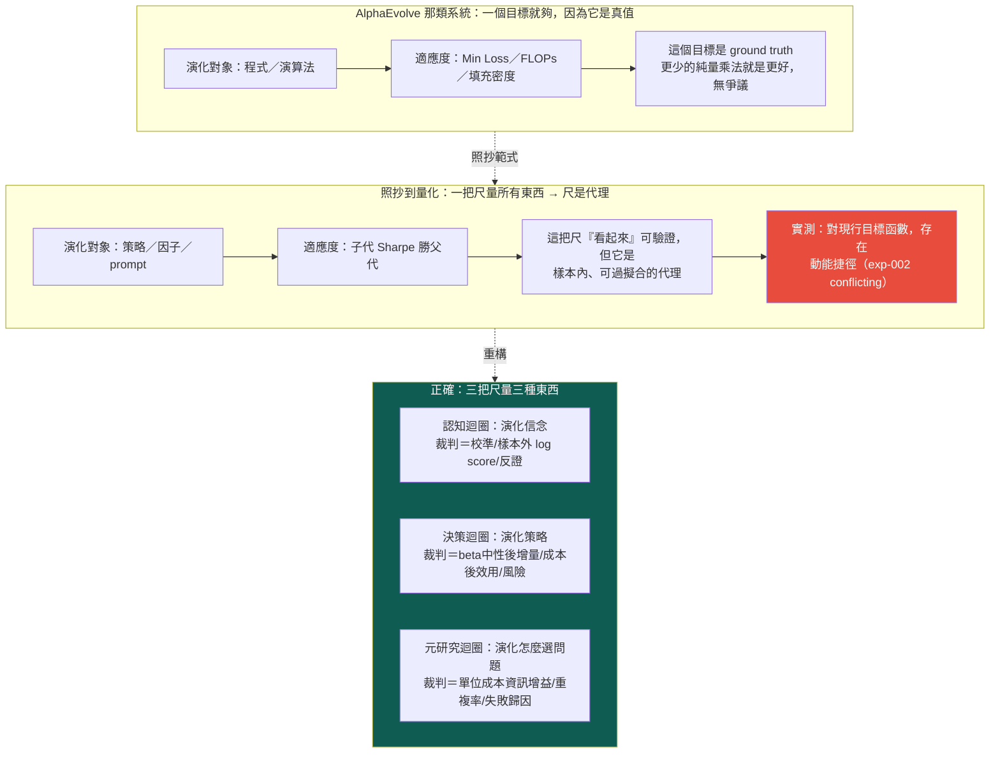

# 進化的目標設錯了——但「只演化世界模型」也是矯枉過正

這一頁講整套系統**最深的一個 bug**，以及修這個 bug 時**第一輪修過頭**的地方。前面的頁都在談「進化（Evolution）」怎麼跑得更好——圖怎麼提案、消融怎麼判、迴圈怎麼回流。owner 第一輪批評指到更下面一層：問題不在**演化的機制**，在**演化的目標（Objective）設錯了**。owner 第二輪批評又補一刀：第一輪的解法「所以改成只演化世界模型」**本身也是錯的**——它把策略當成可有可無的投影丟掉了。

先給認知答案與行動答案，其餘證據都服務這條主軸。

> **認知答案**：原始的 bug 是真的——這台引擎（以及大多數「自動找 Alpha」的系統）把**策略／程式／prompt** 當成演化對象，去優化一個策略級指標（子代 Sharpe 勝父代），而那個指標是**過擬合代理**，不是你真正要的東西。但第一輪的修法「**只**演化世界模型」矯枉過正了：它把「策略」貶成世界信念的**免費投影**，好像信念對了策略就自動掉出來。實情相反——**策略是世界信念穿過真實世界約束（成本、beta、風險、容量）後的決策政策**，那層約束是真功夫，有它自己的對錯。正確的結構不是「一個目標」，是**三個分開裁決的迴圈**：認知迴圈演化**信念**、決策迴圈演化**策略**、元研究迴圈演化**怎麼選問題**，各有各的裁判。
>
> **行動答案**：不要再用**一把尺**（子代 Sharpe 勝父代）量所有東西——那把尺我們**已經實測過會壞**（見下面 [實驗 002](exp-002-ablation.md)）。改成三把尺：認知迴圈用**預測校準／樣本外 log score／反證**、決策迴圈用 **beta 中性後增量／成本後效用／風險**、元研究迴圈用**單位成本資訊增益／重複研究率／失敗歸因**。三迴圈的完整分工見 [三個迴圈](three-loops.md)。而**第一步**不是重寫全部評分器，是先給**決策迴圈**的適應度加一道「動能 beta 懲罰」（[實驗 003](exp-003-graph-evolution.md) 的 P0 行動），擋住「放手優化 CAGR 只會一再重新發現 beta」這個已被證實的捷徑。

## 一、AlphaEvolve 為什麼一把尺就夠：因為它的目標無可爭議

先講清楚被照抄的範式為什麼在它自己的場域裡有效。AlphaEvolve 這類演化式程式合成系統的核心前提是：**適應度函數是一個可機械驗證的 ground-truth 指標**——一個矩陣乘法演算法用了幾次純量乘法、一個模型的 loss 是多少、一種裝箱方式的填充密度多高。這些數字**就是你要的東西本身**，不是它的代理：更少的乘法次數，客觀上就是更好的演算法，沒有「它看起來好但其實沒用」的空間。

有了這種目標，演化就有一個**不會騙自己的裁判**，而且**一把尺就夠**——因為在它的世界裡，「更好的程式」是單一維度、無歧義的。你可以放手讓它變異幾百萬代，每一代的分數都直接對應真實價值。這是 AlphaEvolve 範式成立的全部基礎，也是它**只需要一個目標函數**的原因。

## 二、照抄到量化，一把尺就從「真值」退化成「代理」

問題出在把這個範式搬到量化投資時，**目標的性質變了，但抄的人沒注意到**。

「子代策略的 Sharpe 勝過父代」看起來也像個可驗證的目標——Sharpe 確實算得出來、確實決定性可重現、確實能寫進純碼裁決。整套 [進化迴圈](method-evolution-loop.md) 的 `decide_verdict()` 現在就是這樣判的：`CAGR 與 Sharpe 皆勝父代 → provisional`。表面上跟 AlphaEvolve 一樣嚴謹。

但它跟 FLOPs 有一個致命差別：**樣本內的策略績效不是 ground truth，是一個高度可過擬合的代理**。你真正要的是「這條策略在未來、在你沒看過的市場狀態下還會賺錢」，而樣本內 Sharpe 對這件事只是一個**有偏、可被搜尋策略反向利用**的估計。當你把它當適應度去大量優化，演化不會去找「真正理解市場」的策略，它會去找「在這段歷史上剛好 Sharpe 高」的策略——而在一段多頭偏樣本裡，那條最好走的路，往往是**動能 beta**。

這不是純理論擔憂。這台引擎自己撞上了那條路。

## 三、直接證據（正確計量）：對現行目標函數，存在一條動能捷徑

這是本頁最硬的一塊。這裡要**謹慎地**陳述它證明了什麼、沒證明什麼——owner 第二輪特別點名舊版把這個實驗**說太滿**。

[實驗 002](exp-002-ablation.md) 對這台引擎自己剛生出的漂亮候選 C（月營收 × 250 日價格強勢，CAGR 33%、Sharpe 1.52）跑了一個乾淨的四臂消融，問：C 的優勢是「月營收 × 價格強勢」的**真綜效**，還是兩個因子各自貢獻的**相加**？純碼判定的答案是 `conflicting`——**幾乎全是動能 beta 相加**：

| 組合 | Sharpe | 對基準超額(CAGR) |
|---|---|---|
| 都沒有（基準，等權流動性全池） | 0.96 | — |
| 只有營收選股（＝父代 B） | 1.08 | +5.60pp |
| 只有價格強勢（純動能） | **1.52** | +12.26pp |
| 營收＋強勢（＝候選 C） | **1.52** | +18.60pp |

三個讀數把這件事講死了：

- **加強勢給營收股（+13.0pp）≈ 加給基準（+12.3pp）**——價格強勢的貢獻與有沒有做營收選股**無關**，是相加不是綜效。
- **純動能 Sharpe 1.52 ＝ 營收＋強勢 Sharpe 1.52**——有了動能之後，再加營收選股，對風險調整報酬的邊際貢獻是**零**。
- synergy CAGR 只 +0.74pp（勉強過噪音門檻）、synergy Sharpe −0.12（負），兩指標方向相反 → `conflicting`。

然後 [實驗 003](exp-003-graph-evolution.md) 讓圖自己提案、自主連跑三代，**放手讓迴圈去追報酬**，它就一路走進更純的動能暴露——gen2 換 120 日動能（Sharpe 1.50）、gen3 換 250 日創新高（Sharpe **2.06**，標「幾乎肯定過度擬合」）。迴圈的機件全部正確運作、決定性可重現、負結果如實入帳。

**這證明了什麼，要精確**：合起來看，這是**對「子代 Sharpe 勝父代」這個現行目標函數，存在一條動能捷徑的直接實驗證據**——在這段多頭偏樣本上，優化它會系統性地滑向動能 beta，而不是滑向對世界的新理解。

**這不證明什麼**：它**不**證明「所有策略演化都必然收斂到 beta」。那是舊版的過度宣稱。它是**在這個特定目標函數 × 這段特定樣本**下的一次真實觀測——一個存在性證明（「這條捷徑存在、且迴圈會走它」），不是一條普世定律。換一個把 beta 中性化掉的目標、換一段含空頭的樣本、換一個帶反證約束的搜尋空間，結論可能不同——事實上，加 beta 懲罰正是為了**堵掉這條已被觀測到的捷徑**。把「觀測到一條捷徑」升級成「一切演化的命運」，就犯了跟原始 bug 同一類的錯：把一次樣本內觀測當成 ground truth。

即便收窄成存在性證明，它依然很尖銳：**當你用『策略級績效勝父代』這一把尺，一台機件完全正確的進化迴圈，會沿著這段樣本裡最好走的那條路滑下去——而那條路是動能 beta。** 這就是原始 bug——**Evolution 沒問題，用單一策略級目標當裁判有問題**。

## 四、第一輪修過頭了：策略不是投影，是穿過約束的決策政策

原始 bug 的第一輪解法是「把根從策略搬到世界模型，**只**演化世界模型」。方向對了一半，但 owner 第二輪批評指出它**過頭**：它把策略貶成世界信念的一個**免費投影**，好像「信念對了 → 策略自動掉出來」。這是錯的，而且錯得會讓人忽略一整層真功夫。

**策略是世界信念（B）穿過真實世界約束後的決策政策（P）**，不是 B 的無損投影。從「我相信 CoWoS 擴產會讓某供應鏈受惠」到「我今天實際該持有什麼、多少、抱多久、何時砍」，中間隔著一整層**現實約束**：

- **成本與滑價**：信念再對，週轉太高被交易成本吃光就不該做；
- **beta 與風險**：一條政策若增量全來自 beta 暴露，即使賺錢也不算「懂了世界」（這正是第三節的捷徑）；
- **容量與流動性**：小型股上有效的信念，放大部位就成交不了（[持有期](fw-holding-lifecycle.md) 記過 0056 這種案例）；
- **持有與退出**：同一個信念，配不同的進出場政策，報酬天差地別（[實驗 000](exp-000-engine-first-run.md) 的 A/B 退出時點）。

這層約束**有它自己的對錯**，不能靠「把信念弄對」免費得到。所以策略需要一個**自己的演化迴圈、自己的裁判**——決策迴圈，用「beta 中性化後還有沒有增量、成本後效用、風險」來打分。把它丟掉、只演化信念，等於假設現實約束不存在——那跟「照抄 FLOPs 尺」是同一種天真，只是天真在另一頭。

於是正確結構是**三個分開裁決的迴圈**，各演化不同的東西、各用不同的尺：

| 迴圈 | 演化什麼 | 裁判（不可共用） | 為什麼要獨立 |
|---|---|---|---|
| **認知迴圈** | 信念／世界模型 B | 預測校準、樣本外 log score、反證 | 「懂了世界」的判準是**可反證預測力**，不是賺不賺錢 |
| **決策迴圈** | 策略 P（決策政策） | beta 中性後增量、成本後效用、風險 | 「該不該做」隔著真實約束，有 beta 捷徑要專門堵 |
| **元研究迴圈** | 怎麼選問題（研究議程） | 單位成本資訊增益、重複研究率、失敗歸因 | 「值不值得研究」是資源配置問題，見 [假說引擎：今天最值得消除、又辨識得出的決策相關未知是什麼](hypothesis-engine.md) 的 ResearchValue |

一把尺量三種東西，就是本頁病灶的根：用決策迴圈的尺（Sharpe）去評認知的產出（信念），於是「懂了世界」被誤判成「Sharpe 高」，最後只量出動能 beta。三迴圈怎麼扣在一起、各自的 settle 怎麼跑，見 [三個迴圈](three-loops.md) 與 [研究迴圈](research-loop.md)。

## 五、認知迴圈的裁判長什麼樣：可反證預測，不是績效

三把尺裡最反直覺的是**認知迴圈的尺**——它**不用績效**評分。一條信念不是用「它讓某策略 Sharpe 變高」來評，而是用「它事前下了一個**會被證偽**的預測、後來對帳成立」來評。這正是 [信念契約](world-belief-contract.md) 與 [MIEE](fw-qual-engine.md) 預測帳在做的事：預註冊 → 到期 settle → 純碼判 REFUTE／WEAKEN／CONFIRM。

[實驗 004](exp-004-belief-contract.md) 給了這把尺第一個真讀數：信念 B-H-003（漲價事件後遲滯重定價，主窗 5 日）事前把預期凍結成靶，86 筆對帳只有 27 命中、成本後平均超額 −0.76%，純碼用 Wilson 下界把信心從 0.5 判到 **0.2256**，`update_action=REFUTE`。**注意這條信念被推翻，用的不是「它對應的策略賺不賺錢」，是「它事前的可反證預測對不對」**——這就是認知迴圈的尺與決策迴圈的尺**根本不同**的活證據。系統要找的 Alpha 的最終形態，不是「營收加速有效」，而是一條**帶完整時間約束、附預註冊未來驗證窗的時態因果模式**（見 [時間層](fw-temporal.md)）——那才是能被認知迴圈這把尺持續打分、能隨時間演化的完整投資邏輯。

## 六、誠實邊界（不得省略）

這一頁講的是**目標的重構**，屬於敘事與設計層，必須誠實標明哪些還沒兌現：

- **三把尺目前只有一把半真的在跑**。決策迴圈的尺（Sharpe/CAGR 勝父代）是線上的（但那正是要修的舊尺）；認知迴圈的尺剛在 exp-004 跑出**兩條**信念契約；元研究迴圈的尺（ResearchValue）目前是**設計**，見 [假說引擎：今天最值得消除、又辨識得出的決策相關未知是什麼](hypothesis-engine.md)，未成為線上評分器。「三迴圈分開裁決」是對的結構，但遠未實作完。
- **exp-002 是存在性證明，不是普世定律**。本頁第三節已改寫成「對現行目標函數存在動能捷徑的直接實驗證據」；任何把它讀成「所有策略演化必然收斂 beta」的說法都超出證據。
- **第一步是打補丁，不是換三套引擎**。三份報告共同的 P0 行動是給**決策迴圈**加「動能 beta 懲罰」，這只是**堵住已知的最大捷徑**，不等於「三迴圈都建好了」。真正的目標轉向要靠 [信念契約](world-belief-contract.md) 與 [假說引擎](hypothesis-engine.md) 把「可反證預測」與「單位成本資訊增益」變成一等公民。
- **這是重構，不是推翻已跑的實驗**。exp-000～004 的機件、消融、帳務、信念 settle 全部有效且經獨立重算；本頁不改它們的數字，只是指出「用單一策略級目標當裁判」是錯的——這恰恰是那些實驗**自己證明出來的**。
- **別把目標重構升級成「蓋 11 個引擎」**。把根搬到世界信念、把策略獨立成決策迴圈，都是對的敘事，但「真的把信念層、知識層、因果層都蓋出來」正是 [誠實紀律](discipline.md) 點名的 architecture-first 陷阱——修法走薄縱切，先填一條真的觀測→信念→假說→驗證鏈，細節見 [研究作業系統](research-os.md)。

一句話收束：**這台引擎最有價值的一次自我否證（exp-002），起訴的不是「策略」這個東西，是「用一把尺量所有東西」這件事。** 機件會轉、帳務可信、能拒絕相信自己——但只要還想用單一策略級目標當唯一裁判，它會非常誠實地、非常可重現地，把力氣全花在重新發現動能 beta 上。把尺拆成三把、讓信念、策略、議程各自被對的裁判打分，才是解法。

延伸：三個迴圈的完整分工與 settle 見 [三個迴圈](three-loops.md)；這條迴圈真正的主軸（W/O/B/P 分開）見 [研究迴圈](research-loop.md)；信念怎麼被真證據判 REFUTE 見 [信念契約](world-belief-contract.md) 與 [實驗 004](exp-004-belief-contract.md)；把「值不值得研究」變成 ResearchValue 見 [假說引擎](hypothesis-engine.md)；11 層架構與「別蓋空引擎」的紀律見 [研究作業系統](research-os.md)；紀律總條文見 [誠實紀律](discipline.md)；不認得的詞查 [詞彙表](glossary.md)。

---

**被連結自（反向連結）：** [三個迴圈：認知、決策、元研究，各有各的裁判](three-loops.md) · [世界信念契約：被更新的是信念，不是世界](world-belief-contract.md) · [世界模型：世界不是新聞，新聞是世界狀態的 delta](world-model.md) · [假說引擎：今天最值得消除、又辨識得出的決策相關未知是什麼](hypothesis-engine.md) · [因果層：新聞→事件→供需→公司→財報→預期→價格](causal-layer.md) · [整體架構與資料流](architecture.md) · [方法論：誠實紀律（拒絕相信自己）](discipline.md) · [研究作業系統：11 層與「別蓋空引擎」](research-os.md) · [研究迴圈：世界不被更新，被更新的是信念](research-loop.md) · [給 LLM 評審：請攻擊這些接縫](for-llm-review.md) · [總覽：真正該演化的不是策略，是世界模型](overview.md) · [首頁：Alpha 進化迴圈研究 Wiki](index.md)
