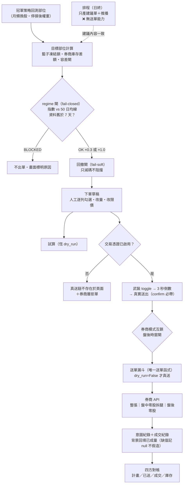

# 下單執行與作戰 UI：從訊號到真單的協調機制（全系統零自動送單）

這一頁描述研究線的最末端：信念如何變成真實資金部位。前面所有頁在講「研究怎麼產生可信的決策」，這一頁講「決策怎麼安全地變成券商委託單」。它存在的目的是讓檢視的 LLM 能審這套**協調設計**——因為 [載具路由器](instrument-router.md) 若讓 CB 進入實盤，CB 腿要掛的就是這條鏈，而這條鏈目前是為股票（與權證）設計的。

> **認知答案**：這套執行系統的本質是「一條收斂的漏斗＋一串只會擋不會衝的閘」——所有真單收斂到唯一一個送單函式，函式之前排一串閘，每道閘只有兩種失效方向：fail-closed（資料有問題就不出單）或 fail-soft（只減碼、不阻擋），而且**全系統沒有任何自動送單路徑**，排程只產建議與推播，真單必經人手兩段擊發。
>
> **行動答案**：檢視這一頁時，請把注意力放在「多載具加入後哪些閘的假設會破」——容差閘以股數為單位、四方對帳以股票庫存為口徑、風險倍率作用在單一資金池，這三個假設在 CB 腿加入後都需要泛化，具體問題列在頁尾。

**去識別化聲明**：本頁一律用角色名——「作戰台」＝唯讀聚合看板、「下單 app」＝唯一會碰券商寫入的行程、「送單漏斗」＝唯一送單函式、「主券商／監看券商」＝兩家實體券商的角色。不含部署位址、埠號、檔名與服務名；檢視協調邏輯不需要那些。

## 雙塔分工：看的行程與送的行程物理分離

系統由兩個常駐行程組成，職責以「會不會碰券商寫入」一刀切開：

- **作戰台（唯讀聚合看板）**：聚合健康燈號（市場 regime／策略衰減／資料新鮮度）、建議單、委託回報、帳務庫存、四方對帳與淨值卡。它**絕不引入下單模組**——程式層面就不具備送單能力；使用者在作戰台按的任何下單動作，都只是經一層帶驗證的代理轉發給下單 app，作戰台自己永遠送不出單。
- **下單 app（唯一寫入行程）**：持有券商連線，負責產生建議單、試算、真送、改價、刪單與回報查詢。全部 API 都有存取憑證閘。平時以 API 金鑰登入券商，這種登入**只有唯讀能力**（查庫存／報價／委託）；真送需要另外啟用交易憑證（見閘鏈）。
- **送單漏斗（唯一送單函式）**：所有真單——不論股票整張、盤中零股、盤後零股、權證——最終收斂到同一個函式，只有 `dry_run=False` 才真送。**試算路徑恆為 dry_run**，UI 上的「試算」按鈕在程式上不可能變成真送。

這個分工的取捨：看板可以放心加功能、放心壞，因為它壞掉的最壞結果是「看不到」，不是「送錯單」。

## 訊號怎麼變成目標部位

上游是 [現任冠軍策略](champion-challenger.md) 的回測部位（月頻換股、停損後部位），換算成每檔權重。之後三步：

1. **籃子凍結鎖**：換股窗內凍結籃子的代號與權重，凍結粒度已下沉到「本窗已建股數」——窗內不因價格波動重算目標，防止日內漂移引發反覆進出。
2. **券商庫存差額**：目標市值（部署資金 × 權重）對照券商實際庫存，差額才產生買賣建議單。系統對帳的是券商回報的真實庫存，不是自己記的帳。
3. **容差閘（防 churn）**：差額市值小於「目標市值 1% 與一個小額門檻取大者」就視為已達成、不出單；容差內的零股微修賣單一律不產生（零股當日不可回補，微修反而製造風險）。

## 閘鏈：真單之前的每一道閘（依序）

| # | 閘 | 性質 | 行為 |
|---|---|---|---|
| 1 | 存取憑證閘 | 硬擋 | 下單 app 全部 API 需存取憑證；作戰台的代理入口自行驗證、不自動補發（防區網內的偽造請求直達送單端點） |
| 2 | regime 閘 | **fail-closed 硬擋** | 大盤代表 ETF 收盤價對自身 50 日均線，只用決策時點之前的資料（無前視）。資料取不到、歷史不足、或最新收盤距決策超過 7 個日曆天 → **BLOCKED：不產生任何訂單**，畫面顯示原因，絕不悄悄滿倉。正常時：跌破均線曝險 ×0.3、站上 ×1.0 |
| 3 | 回撤閘 | fail-soft 只減碼 | 策略自身近期報酬落入自身歷史低分位 → 曝險再 ×0.5；**算不出來就回 ×1.0，不阻擋**。總倍率＝regime × 回撤，部署資金＝使用者輸入 × 總倍率 |
| 4 | 槓桿紀律 | 指引非強制 | 槓桿上限（f ≤ 2.3）只是指引，系統**永不自動套用槓桿、不借錢**——要用槓桿由使用者自行輸入含槓桿資金 |
| 5 | 交易憑證閘（CA） | UI ＋ 券商層雙擋 | 未啟用交易憑證時：真送按鈕**根本不渲染進頁面**（不是灰掉），且就算繞過 UI，券商端也會拒單。憑證狀態只存行程記憶體，服務重啟即消失＝每次重啟後真送前都要由人重新啟用 |
| 6 | 兩段擊發 | 人工 | 武裝 toggle 撥開 → 3 秒倒數 → 才出現真實送出；送出請求還需帶明確的 confirm 旗標，缺一即拒 |
| 7 | 券商模式互鎖 | 硬擋 | 讀端切到監看券商模式時，真送一律被擋——防止「看 A 券商的畫面、把單送進 B 券商」 |
| 8 | 盤後時窗閘 | 伺服器端硬擋 | 盤後零股單只在法定時窗（13:40–14:30）內受理，時窗外伺服器直接拒絕 |

送出前 UI 還有兩道輔助檢查：檢查清單四綠（regime 非 BLOCKED／策略健康非警報／資料新鮮／憑證已啟用）與送前餘額對照（本批買進金額超過現金即紅框擋下）。

## 零自動送單與 dead-man 紀律

自動化的邊界劃得很清楚。排程做的事：開盤前預跑資料與回測快取；收盤後跑健康檢查、產生**建議單並推播通知**——同樣走 fail-closed 紀律，但**不送單**。行程內自動的事：regime 與回撤計算、差額計算、唯讀連線斷線自癒重登（送單路徑不自動重登）、成交量背景回填。**造成資金變動的每一個動作都是人工的。**

dead-man 紀律把「沉默」變成訊號：日終線每一步檢查結束碼，失敗即推播告警；規則是「每個交易日必有一則推播，整天無聲＝管線死了」。缺席本身就是告警，不需要另一個監控器來監控監控器。

## 四方對帳

每筆真送寫入兩類紀錄：意圖紀錄（送單／取消／改價／盤後，統一格式）與成交紀錄；背景執行緒輪詢券商委託回報，回填已成交量——查不到成交均價就記 null，**不假造數字**。作戰台的四方對帳卡比對四個口徑：**計畫**（建議單要達成的部位）、**已送**（實際送出的委託）、**成交**（券商回報成交）、**庫存**（券商帳上實際持有），任兩方對不上即高亮。這是事後發現「單送了但沒成交」「成交了但與計畫偏離」的唯一機制。

## 人工確認點總表

| 時點 | 人做什麼 |
|---|---|
| 開工 | 選策略、輸入部署資金（含是否用槓桿的決策——系統不代做） |
| 產單 | 按「產生建議單」、逐列勾選／改量／改限價 |
| 授權 | 啟用交易憑證（每次服務重啟後皆需重做） |
| 真送 | 武裝 toggle → 3 秒倒數 → 真實送出 |
| 盤中 | 改價、刪單、原子改價（刪舊未成量→重掛新價，與真送同憑證紀律） |
| 切換 | 券商模式切換（切到監看券商即封鎖真送） |
| 盤後 | 盤後零股批次確認（受伺服器時窗閘限制） |

## 多載具擴充：現成的接點與已知障礙

CB 載具若通過 [實驗 006](exp-006-cb-router-prereg.md) 的驗證要進實盤，不是重寫一套執行系統，而是掛進上述漏斗。現成的接點有四個：

1. **送單漏斗的表格格式已載具無關**：欄位是「代號／動作／下單別／下單價／下單數量」，新載具＝新增一種「下單別」分支＋對應的合約解析，漏斗本身不用動。
2. **券商接觸面已抽象成適配層藍圖**：與券商互動的 15 個動作（登入、查庫存、送單、改價……）已有介面設計（正規化單位、統一欄名），多載具應搭這層一起做，而不是在漏斗裡塞 if。
3. **權證模式是現成前例**：權證模式證明了「標的→衍生品映射＋權重沿用」的模式可行——每檔入選標的換成評分最高的衍生品、沿用原權重、走同一個漏斗。CB 可複製同一模式。
4. **持股 CB 風險偵測已在跑**：下單 app 已有唯讀的持股 CB 偵測（轉換價／價內外／delta／強贖賣回下修旗標），CB 腿的資訊面有底子。

已知障礙（誠實列出，皆未解）：

- **CB 能否直接走現有股票合約腿真送，未查證**——CB 的單位、面額、tick 都與股票不同，這是第一個要驗的事實問題。
- **容差閘以股數為單位**，CB 以張（面額）計價，「差額 1%」的口徑需要泛化，否則容差閘對 CB 若不是失效就是誤擋。
- **單一全域狀態＝一次一策略一模式**，股票與 CB 並行需要 per-載具的管線狀態。
- **執行環境是序列式單線程**，行情訂閱與載具增加會互相阻塞。
- **監看券商「登入即帶憑證」、無唯讀連線**——若未來以該券商執行，唯讀／可寫的天然分離消失，兩段擊發＋存取憑證閘變成唯一防線，這是兩券商間最重要的安全差異。

## 誠實邊界（本頁描述的可信度）

本頁依據對執行系統原始碼與部署契約的唯讀偵察寫成，以下幾點偵察時**未逐行核實**：籃子凍結鎖的「本窗已建股數」由哪個環節在何時寫入（讀取端已確認會用，寫入端進度未核實）；日終建議單的完整演算法（只確認了 fail-closed 與不送單的定位）；作戰台前端行為依據的是 UI 規格文件而非逐行讀前端碼。檢視時若某個結論依賴這三處細節，請把它當「大概率如此」而非「已證實」。

## 請 LLM 檢視的協調問題

1. **容差閘單位**：CB 腿加入後，容差閘應以「面額」「張數」還是「等效 delta 股數」計？若以等效 delta 計，delta 口徑日日變動，容差閘會不會自己製造 churn？
2. **四方對帳如何擴**：同一標的同時持有股票與 CB 時，「計畫／已送／成交／庫存」四方要按載具分列還是按標的合併？合併的話用什麼共同單位不失真？
3. **風險預算跨載具怎麼分**：regime × 回撤總倍率目前作用在單一資金池；股票與 CB 並存時，倍率該作用在各載具資金、還是作用在合計等效曝險？CB 的債底是否應讓它在 regime BLOCKED 時享有不同待遇（例如只擋新增、不擋既有 CB）？
4. **籃子凍結鎖凍什麼**：股票凍「本窗已建股數」；CB 若因強贖或下修導致條款中途變動，凍結的目標還成立嗎？條款事件應不應該是合法的窗內解凍理由？
5. **閘鏈完備性**：現有八道閘是為股票日內流動性設計的；CB 成交稀疏（歷史上僅約六到七成交易日有成交），「限價單掛著不成交」的狀態會在容差閘與四方對帳間製造長期懸掛差異，需不需要一道「懸掛委託老化」閘？
6. **fail-soft 的邊界**：回撤閘「算不出來就不減碼」對股票合理（缺資料時保守方向不明確）；對 CB，缺的若是債底資料，保守方向其實明確（當純股票風險處理），fail-soft 的預設方向是否應按載具分別定義？
7. **dead-man 覆蓋面**：CB 資料管線（條款面板、收盤面板）加入後，dead-man 的「每日必有推播」是否要按管線分列，避免股票線活著掩蓋 CB 線死了？

---

**被連結自（反向連結）：** [CB 與 CBAS：債底加選擇權的合體，與拆開賣的兩端](cb-cbas.md) · [載具路由器：king2 決定看多誰，路由器決定用什麼報酬形狀表達](instrument-router.md) · [首頁：Alpha 進化迴圈研究 Wiki](index.md)
